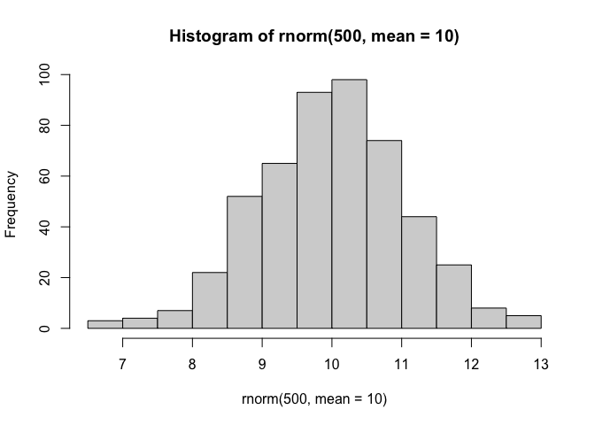
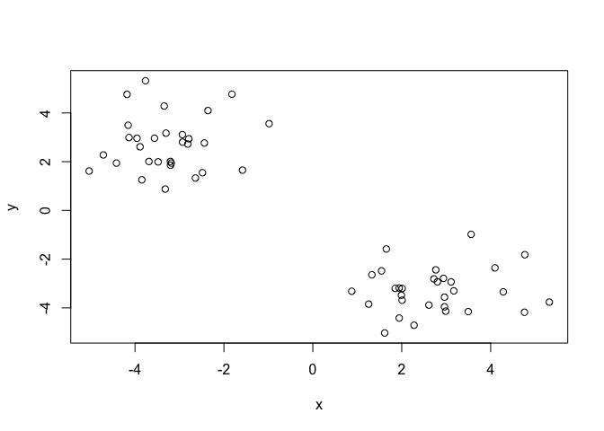
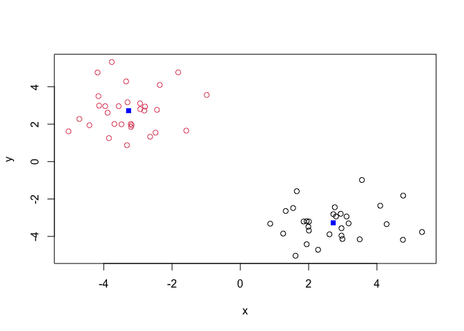
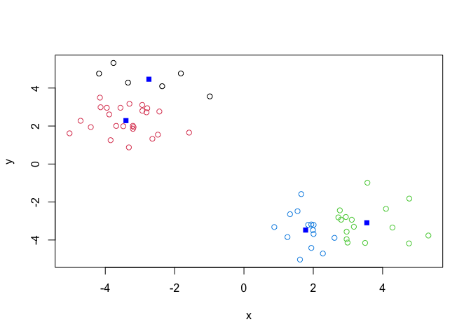
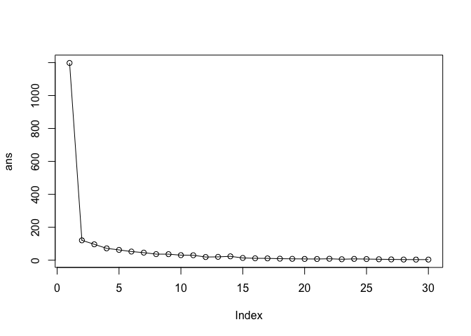
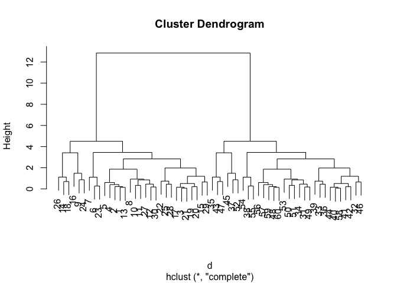
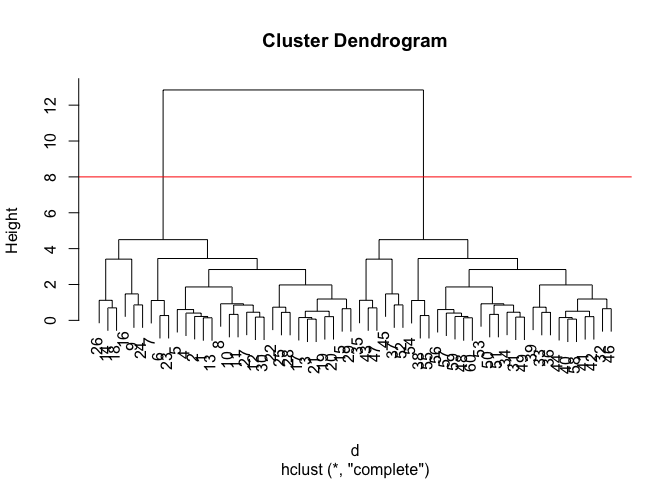

# Class 7: Machine Learning 1
Erica Yue Hu (PID:A17787225)

\##Background today we will begin our exploration of some important
machine learning methods, namely **clustering** and **dimensionality
reduction**

Let’s make up some input data where we know what the natural groupings
are

The function `rnorm()`can be useful here.

``` r
hist(rnorm(500, mean=10))
```



> Q. generate 30 random numbers centered at +3 and another 30 centered
> at -3

``` r
tmp<-c(rnorm(30, mean=3), (rnorm(30,mean=-3)))

cbind(x=tmp, y=rev(tmp))
```

                   x          y
     [1,]  2.7235137 -2.8114636
     [2,]  2.9392223 -2.7898083
     [3,]  1.9424655 -3.1851275
     [4,]  3.1102236 -2.9346841
     [5,]  2.7656679 -2.4404466
     [6,]  1.3289837 -2.6413244
     [7,]  1.6532973 -1.5826582
     [8,]  3.4954564 -4.1546543
     [9,]  4.0966865 -2.3590840
    [10,]  2.9618132 -3.5619998
    [11,]  3.1708087 -3.3032042
    [12,]  2.9613476 -3.9562245
    [13,]  2.8025287 -2.9304191
    [14,]  4.7609942 -4.1799373
    [15,]  1.2556143 -3.8462147
    [16,]  3.5607352 -0.9842706
    [17,]  1.8526416 -3.2021111
    [18,]  5.3202383 -3.7641711
    [19,]  2.0075426 -3.6864299
    [20,]  1.9916706 -3.4804240
    [21,]  2.0092927 -3.2047685
    [22,]  1.6160047 -5.0315408
    [23,]  1.5456371 -2.4824197
    [24,]  4.7684997 -1.8195539
    [25,]  2.2768088 -4.7123771
    [26,]  4.2841054 -3.3436846
    [27,]  2.6108449 -3.8865884
    [28,]  1.9427257 -4.4180768
    [29,]  0.8753924 -3.3195633
    [30,]  2.9890332 -4.1358582
    [31,] -4.1358582  2.9890332
    [32,] -3.3195633  0.8753924
    [33,] -4.4180768  1.9427257
    [34,] -3.8865884  2.6108449
    [35,] -3.3436846  4.2841054
    [36,] -4.7123771  2.2768088
    [37,] -1.8195539  4.7684997
    [38,] -2.4824197  1.5456371
    [39,] -5.0315408  1.6160047
    [40,] -3.2047685  2.0092927
    [41,] -3.4804240  1.9916706
    [42,] -3.6864299  2.0075426
    [43,] -3.7641711  5.3202383
    [44,] -3.2021111  1.8526416
    [45,] -0.9842706  3.5607352
    [46,] -3.8462147  1.2556143
    [47,] -4.1799373  4.7609942
    [48,] -2.9304191  2.8025287
    [49,] -3.9562245  2.9613476
    [50,] -3.3032042  3.1708087
    [51,] -3.5619998  2.9618132
    [52,] -2.3590840  4.0966865
    [53,] -4.1546543  3.4954564
    [54,] -1.5826582  1.6532973
    [55,] -2.6413244  1.3289837
    [56,] -2.4404466  2.7656679
    [57,] -2.9346841  3.1102236
    [58,] -3.1851275  1.9424655
    [59,] -2.7898083  2.9392223
    [60,] -2.8114636  2.7235137

``` r
x<-cbind(x=tmp, y=rev(tmp))
plot(x)
```



rev(): reverse cbind(): binds them as coloumns tgt rbind(): binds them
as rows

\##Kmeans clustering

the main function in “base R” for K-means clustering is called
`kmeans()`

``` r
km <- kmeans(x, centers=2)
km
```

    K-means clustering with 2 clusters of sizes 30, 30

    Cluster means:
              x         y
    1  2.720660 -3.271636
    2 -3.271636  2.720660

    Clustering vector:
     [1] 1 1 1 1 1 1 1 1 1 1 1 1 1 1 1 1 1 1 1 1 1 1 1 1 1 1 1 1 1 1 2 2 2 2 2 2 2 2
    [39] 2 2 2 2 2 2 2 2 2 2 2 2 2 2 2 2 2 2 2 2 2 2

    Within cluster sum of squares by cluster:
    [1] 60.29953 60.29953
     (between_SS / total_SS =  89.9 %)

    Available components:

    [1] "cluster"      "centers"      "totss"        "withinss"     "tot.withinss"
    [6] "betweenss"    "size"         "iter"         "ifault"      

> Q. what component of the results object details the clusters sizes

``` r
km$size
```

    [1] 30 30

> Q. what component of the results object details the cluster centers?

``` r
km$centers
```

              x         y
    1  2.720660 -3.271636
    2 -3.271636  2.720660

> what component of the results object details the cluster membership
> vector(i.e our main result of which points lie in which cluster)

``` r
km$cluster
```

     [1] 1 1 1 1 1 1 1 1 1 1 1 1 1 1 1 1 1 1 1 1 1 1 1 1 1 1 1 1 1 1 2 2 2 2 2 2 2 2
    [39] 2 2 2 2 2 2 2 2 2 2 2 2 2 2 2 2 2 2 2 2 2 2

> Q. Plot our clustering results with points colored by cluster and also
> add the cluster centers as new points

``` r
plot(x, col=km$cluster)
points(km$centers, col="blue", pch=15)
```



> Q. Run ‘kmeans()’ again and this time produce 4 clusters \*and call
> your result object `k4`) and make a results figure like above?

``` r
k4 <- kmeans(x, center=4)
k4
```

    K-means clustering with 4 clusters of sizes 6, 24, 16, 14

    Cluster means:
              x         y
    1 -2.741784  4.465210
    2 -3.404099  2.284522
    3  3.544430 -3.091842
    4  1.779209 -3.477116

    Clustering vector:
     [1] 3 3 4 3 3 4 4 3 3 3 3 3 3 3 4 3 4 3 4 4 4 4 4 3 4 3 4 4 4 3 2 2 2 2 1 2 1 2
    [39] 2 2 2 2 1 2 1 2 1 2 2 2 2 1 2 2 2 2 2 2 2 2

    Within cluster sum of squares by cluster:
    [1]  9.458895 25.909144 22.673969 13.251063
     (between_SS / total_SS =  94.0 %)

    Available components:

    [1] "cluster"      "centers"      "totss"        "withinss"     "tot.withinss"
    [6] "betweenss"    "size"         "iter"         "ifault"      

``` r
plot(x, col=k4$cluster)
points(k4$centers,col="blue", pch=15)
```



the metric

``` r
km$tot.withinss
```

    [1] 120.5991

``` r
k4$tot.withinss
```

    [1] 71.29307

> Q. let’s try different number of K(centers) from 1 to 30 and see what
> the best result is?

``` r
i <- 1
ans <- NULL 
for (i in 1:30) {
  ans <- c(ans, kmeans(x,centers = i)$tot.withinss)
}
ans 
```

     [1] 1197.827458  120.599057   96.472360   71.850064   62.432376   52.399515
     [7]   45.836669   36.775626   36.573592   30.556056   29.983020   19.213700
    [13]   20.184936   23.373937   13.525242   11.428147   11.020990    9.102961
    [19]    8.215772    7.571001    7.228537    8.555489    5.786247    7.845427
    [25]    6.940411    5.717777    4.777607    3.866178    3.583895    3.632260

``` r
plot(ans,typ="o")
```



> the best result is the point after the drop

**key points**: k means will impose a clustering structure on your data
even if it is not there - it will always give you the answer you asked
for even if that answer is silly!

\##hierachical clustering

the main function for hierachical clustering is called `hclust()`.
Unlike `kmeans()` (which does all the work for you) you can’t just pass
`hclust()` our raw input data. It needs a “distance matrix” like the one
returned from the `dist()` function.

``` r
d<-dist(x)
hc <- hclust (d)
hc
```


    Call:
    hclust(d = d)

    Cluster method   : complete 
    Distance         : euclidean 
    Number of objects: 60 

``` r
plot(hc)
```



To extract our cluster membership vector from a `hclust()` result obect
we have to “cut” our tree at a given height to yield a separate
“groups”/“branches”.

``` r
plot(hc)
abline(h=8, col="red", lyt=2)
```

    Warning in int_abline(a = a, b = b, h = h, v = v, untf = untf, ...): "lyt" is
    not a graphical parameter



To do this, we use the `cutree()` function on our `hclust()` object:

``` r
grps <- cutree(hc, h=8)
grps
```

     [1] 1 1 1 1 1 1 1 1 1 1 1 1 1 1 1 1 1 1 1 1 1 1 1 1 1 1 1 1 1 1 2 2 2 2 2 2 2 2
    [39] 2 2 2 2 2 2 2 2 2 2 2 2 2 2 2 2 2 2 2 2 2 2

``` r
table(grps,km$cluster)
```

        
    grps  1  2
       1 30  0
       2  0 30

## PCA of UK food data

import the dataset of food consumption in the UK

``` r
url <- "https://tinyurl.com/UK-foods"
x <- read.csv(url)
x
```

                         X England Wales Scotland N.Ireland
    1               Cheese     105   103      103        66
    2        Carcass_meat      245   227      242       267
    3          Other_meat      685   803      750       586
    4                 Fish     147   160      122        93
    5       Fats_and_oils      193   235      184       209
    6               Sugars     156   175      147       139
    7      Fresh_potatoes      720   874      566      1033
    8           Fresh_Veg      253   265      171       143
    9           Other_Veg      488   570      418       355
    10 Processed_potatoes      198   203      220       187
    11      Processed_Veg      360   365      337       334
    12        Fresh_fruit     1102  1137      957       674
    13            Cereals     1472  1582     1462      1494
    14           Beverages      57    73       53        47
    15        Soft_drinks     1374  1256     1572      1506
    16   Alcoholic_drinks      375   475      458       135
    17      Confectionery       54    64       62        41

> Q1. how many rows and columns are in your new data frame named x? what
> r functions could you use to answer this question?

``` r
dim(x)
```

    [1] 17  5

one solution to set the row names is to do it by hand…

``` r
#rownames(x) 
rownames(x) <- x[,1]
rownames(x)
```

     [1] "Cheese"              "Carcass_meat "       "Other_meat "        
     [4] "Fish"                "Fats_and_oils "      "Sugars"             
     [7] "Fresh_potatoes "     "Fresh_Veg "          "Other_Veg "         
    [10] "Processed_potatoes " "Processed_Veg "      "Fresh_fruit "       
    [13] "Cereals "            "Beverages"           "Soft_drinks "       
    [16] "Alcoholic_drinks "   "Confectionery "     

to remove the first column, i can use the minus index trick

``` r
x <- x[,-1]
x
```

                        England Wales Scotland N.Ireland
    Cheese                  105   103      103        66
    Carcass_meat            245   227      242       267
    Other_meat              685   803      750       586
    Fish                    147   160      122        93
    Fats_and_oils           193   235      184       209
    Sugars                  156   175      147       139
    Fresh_potatoes          720   874      566      1033
    Fresh_Veg               253   265      171       143
    Other_Veg               488   570      418       355
    Processed_potatoes      198   203      220       187
    Processed_Veg           360   365      337       334
    Fresh_fruit            1102  1137      957       674
    Cereals                1472  1582     1462      1494
    Beverages                57    73       53        47
    Soft_drinks            1374  1256     1572      1506
    Alcoholic_drinks        375   475      458       135
    Confectionery            54    64       62        41

A better way to do this is to set the row names to the first column with
`read.csv()`

``` r
x <- read.csv(url, row.names=1)
x
```

                        England Wales Scotland N.Ireland
    Cheese                  105   103      103        66
    Carcass_meat            245   227      242       267
    Other_meat              685   803      750       586
    Fish                    147   160      122        93
    Fats_and_oils           193   235      184       209
    Sugars                  156   175      147       139
    Fresh_potatoes          720   874      566      1033
    Fresh_Veg               253   265      171       143
    Other_Veg               488   570      418       355
    Processed_potatoes      198   203      220       187
    Processed_Veg           360   365      337       334
    Fresh_fruit            1102  1137      957       674
    Cereals                1472  1582     1462      1494
    Beverages                57    73       53        47
    Soft_drinks            1374  1256     1572      1506
    Alcoholic_drinks        375   475      458       135
    Confectionery            54    64       62        41

> Q2. which approach to solving the “row-names problem” mentioned above
> do you prefer and why? is one approach more robust than another under
> certain cricumstances?

prefer the 2nd method because it doesn’t take away a column each time
you run the code. also it is shorter.

\##spotting major differens and trends is diffuclt even in this wee 17D
dataset

``` r
barplot(as.matrix(x), beside=T, col=rainbow(nrow(x)))
```


``` r
barplot(as.matrix(x), beside = F, col=rainbow(nrow(x)))
```


> Q. changing what optional argument in the above barplot() function
> results in the following plot?

changing the “beside” argument from T to F changes it from a histogram
graph to a stacked graph.

``` r
pairs(x, col=rainbow(nrow(x)), pch=16)
```


``` r
library(pheatmap)
pheatmap(as.matrix(x))
```


## PCA to the rescue

the main pca function in “base R” is called `prcomp()`. this function
wants the transpose of our food data as input (i.e. the foods as columns
and the countries as rows)

``` r
pca <-prcomp(t(x))
```

``` r
summary(pca)
```

    Importance of components:
                                PC1      PC2      PC3     PC4
    Standard deviation     324.1502 212.7478 73.87622 2.7e-14
    Proportion of Variance   0.6744   0.2905  0.03503 0.0e+00
    Cumulative Proportion    0.6744   0.9650  1.00000 1.0e+00

``` r
attributes (pca)
```

    $names
    [1] "sdev"     "rotation" "center"   "scale"    "x"       

    $class
    [1] "prcomp"

To make one of main PCA result figures we turn to ‘pca\$x’ the scores
along our new PCs. This is called “PC plot” or”score plot” or
“Ordination plot”…

``` r
my_cols <- c("orange", "red", "blue", "darkgreen")
```

``` r
library(ggplot2)

ggplot(pca$x)+
  aes(PC1,PC2)+
  geom_point(col=my_cols)
```


the second major result rigure is called a “loadings plot” of “variable
contributions plot” or “weight plot”.

``` r
ggplot(pca$rotation)+ 
  aes(PC1,rownames(pca$rotation))+
      geom_col()
```


