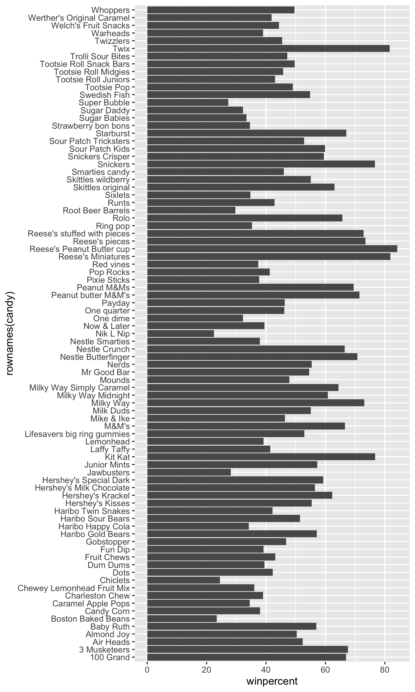
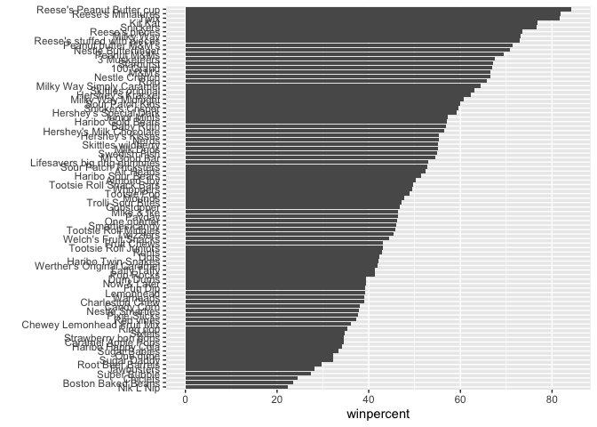
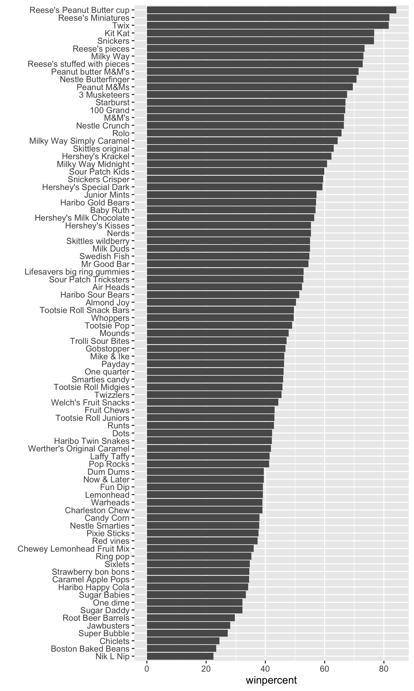
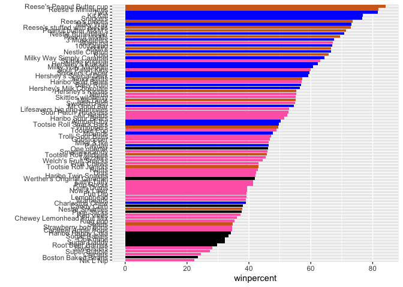
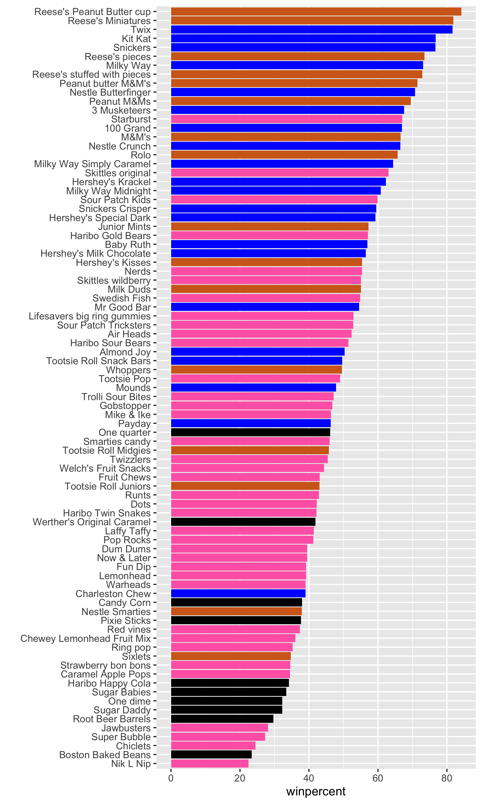
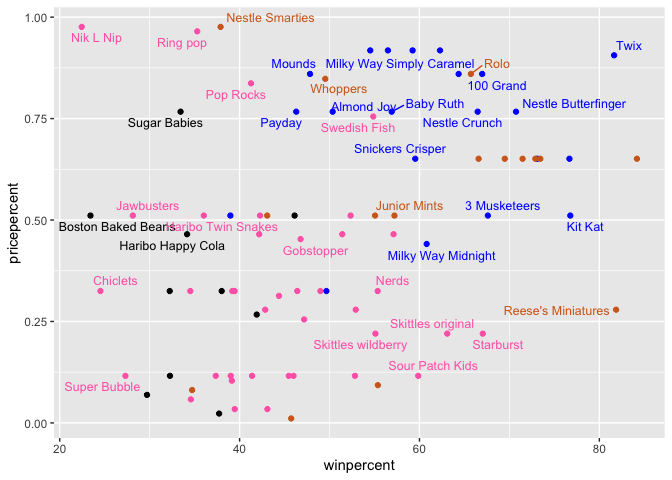
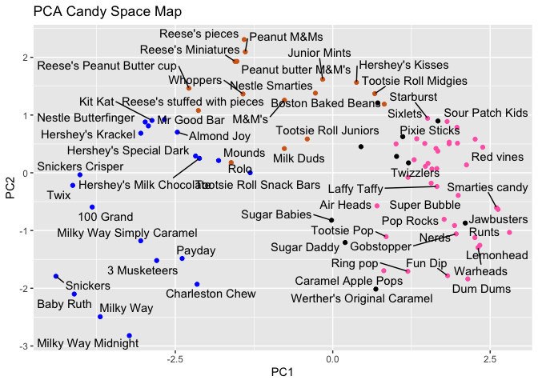

# class09_mini_project_candy
Erica Yue Hu, PID: A17787225

reading the data:

``` r
read.csv("candy-data.csv")
```

                    competitorname chocolate fruity caramel peanutyalmondy nougat
    1                    100 Grand         1      0       1              0      0
    2                 3 Musketeers         1      0       0              0      1
    3                     One dime         0      0       0              0      0
    4                  One quarter         0      0       0              0      0
    5                    Air Heads         0      1       0              0      0
    6                   Almond Joy         1      0       0              1      0
    7                    Baby Ruth         1      0       1              1      1
    8           Boston Baked Beans         0      0       0              1      0
    9                   Candy Corn         0      0       0              0      0
    10          Caramel Apple Pops         0      1       1              0      0
    11             Charleston Chew         1      0       0              0      1
    12  Chewey Lemonhead Fruit Mix         0      1       0              0      0
    13                    Chiclets         0      1       0              0      0
    14                        Dots         0      1       0              0      0
    15                    Dum Dums         0      1       0              0      0
    16                 Fruit Chews         0      1       0              0      0
    17                     Fun Dip         0      1       0              0      0
    18                  Gobstopper         0      1       0              0      0
    19           Haribo Gold Bears         0      1       0              0      0
    20           Haribo Happy Cola         0      0       0              0      0
    21           Haribo Sour Bears         0      1       0              0      0
    22          Haribo Twin Snakes         0      1       0              0      0
    23            Hershey's Kisses         1      0       0              0      0
    24           Hershey's Krackel         1      0       0              0      0
    25    Hershey's Milk Chocolate         1      0       0              0      0
    26      Hershey's Special Dark         1      0       0              0      0
    27                  Jawbusters         0      1       0              0      0
    28                Junior Mints         1      0       0              0      0
    29                     Kit Kat         1      0       0              0      0
    30                 Laffy Taffy         0      1       0              0      0
    31                   Lemonhead         0      1       0              0      0
    32 Lifesavers big ring gummies         0      1       0              0      0
    33         Peanut butter M&M's         1      0       0              1      0
    34                       M&M's         1      0       0              0      0
    35                  Mike & Ike         0      1       0              0      0
    36                   Milk Duds         1      0       1              0      0
    37                   Milky Way         1      0       1              0      1
    38          Milky Way Midnight         1      0       1              0      1
    39    Milky Way Simply Caramel         1      0       1              0      0
    40                      Mounds         1      0       0              0      0
    41                 Mr Good Bar         1      0       0              1      0
    42                       Nerds         0      1       0              0      0
    43         Nestle Butterfinger         1      0       0              1      0
    44               Nestle Crunch         1      0       0              0      0
    45                   Nik L Nip         0      1       0              0      0
    46                 Now & Later         0      1       0              0      0
    47                      Payday         0      0       0              1      1
    48                 Peanut M&Ms         1      0       0              1      0
    49                Pixie Sticks         0      0       0              0      0
    50                   Pop Rocks         0      1       0              0      0
    51                   Red vines         0      1       0              0      0
    52          Reese's Miniatures         1      0       0              1      0
    53   Reese's Peanut Butter cup         1      0       0              1      0
    54              Reese's pieces         1      0       0              1      0
    55 Reese's stuffed with pieces         1      0       0              1      0
    56                    Ring pop         0      1       0              0      0
    57                        Rolo         1      0       1              0      0
    58           Root Beer Barrels         0      0       0              0      0
    59                       Runts         0      1       0              0      0
    60                     Sixlets         1      0       0              0      0
    61           Skittles original         0      1       0              0      0
    62          Skittles wildberry         0      1       0              0      0
    63             Nestle Smarties         1      0       0              0      0
    64              Smarties candy         0      1       0              0      0
    65                    Snickers         1      0       1              1      1
    66            Snickers Crisper         1      0       1              1      0
    67             Sour Patch Kids         0      1       0              0      0
    68       Sour Patch Tricksters         0      1       0              0      0
    69                   Starburst         0      1       0              0      0
    70         Strawberry bon bons         0      1       0              0      0
    71                Sugar Babies         0      0       1              0      0
    72                 Sugar Daddy         0      0       1              0      0
    73                Super Bubble         0      1       0              0      0
    74                Swedish Fish         0      1       0              0      0
    75                 Tootsie Pop         1      1       0              0      0
    76        Tootsie Roll Juniors         1      0       0              0      0
    77        Tootsie Roll Midgies         1      0       0              0      0
    78     Tootsie Roll Snack Bars         1      0       0              0      0
    79           Trolli Sour Bites         0      1       0              0      0
    80                        Twix         1      0       1              0      0
    81                   Twizzlers         0      1       0              0      0
    82                    Warheads         0      1       0              0      0
    83        Welch's Fruit Snacks         0      1       0              0      0
    84  Werther's Original Caramel         0      0       1              0      0
    85                    Whoppers         1      0       0              0      0
       crispedricewafer hard bar pluribus sugarpercent pricepercent winpercent
    1                 1    0   1        0        0.732        0.860   66.97173
    2                 0    0   1        0        0.604        0.511   67.60294
    3                 0    0   0        0        0.011        0.116   32.26109
    4                 0    0   0        0        0.011        0.511   46.11650
    5                 0    0   0        0        0.906        0.511   52.34146
    6                 0    0   1        0        0.465        0.767   50.34755
    7                 0    0   1        0        0.604        0.767   56.91455
    8                 0    0   0        1        0.313        0.511   23.41782
    9                 0    0   0        1        0.906        0.325   38.01096
    10                0    0   0        0        0.604        0.325   34.51768
    11                0    0   1        0        0.604        0.511   38.97504
    12                0    0   0        1        0.732        0.511   36.01763
    13                0    0   0        1        0.046        0.325   24.52499
    14                0    0   0        1        0.732        0.511   42.27208
    15                0    1   0        0        0.732        0.034   39.46056
    16                0    0   0        1        0.127        0.034   43.08892
    17                0    1   0        0        0.732        0.325   39.18550
    18                0    1   0        1        0.906        0.453   46.78335
    19                0    0   0        1        0.465        0.465   57.11974
    20                0    0   0        1        0.465        0.465   34.15896
    21                0    0   0        1        0.465        0.465   51.41243
    22                0    0   0        1        0.465        0.465   42.17877
    23                0    0   0        1        0.127        0.093   55.37545
    24                1    0   1        0        0.430        0.918   62.28448
    25                0    0   1        0        0.430        0.918   56.49050
    26                0    0   1        0        0.430        0.918   59.23612
    27                0    1   0        1        0.093        0.511   28.12744
    28                0    0   0        1        0.197        0.511   57.21925
    29                1    0   1        0        0.313        0.511   76.76860
    30                0    0   0        0        0.220        0.116   41.38956
    31                0    1   0        0        0.046        0.104   39.14106
    32                0    0   0        0        0.267        0.279   52.91139
    33                0    0   0        1        0.825        0.651   71.46505
    34                0    0   0        1        0.825        0.651   66.57458
    35                0    0   0        1        0.872        0.325   46.41172
    36                0    0   0        1        0.302        0.511   55.06407
    37                0    0   1        0        0.604        0.651   73.09956
    38                0    0   1        0        0.732        0.441   60.80070
    39                0    0   1        0        0.965        0.860   64.35334
    40                0    0   1        0        0.313        0.860   47.82975
    41                0    0   1        0        0.313        0.918   54.52645
    42                0    1   0        1        0.848        0.325   55.35405
    43                0    0   1        0        0.604        0.767   70.73564
    44                1    0   1        0        0.313        0.767   66.47068
    45                0    0   0        1        0.197        0.976   22.44534
    46                0    0   0        1        0.220        0.325   39.44680
    47                0    0   1        0        0.465        0.767   46.29660
    48                0    0   0        1        0.593        0.651   69.48379
    49                0    0   0        1        0.093        0.023   37.72234
    50                0    1   0        1        0.604        0.837   41.26551
    51                0    0   0        1        0.581        0.116   37.34852
    52                0    0   0        0        0.034        0.279   81.86626
    53                0    0   0        0        0.720        0.651   84.18029
    54                0    0   0        1        0.406        0.651   73.43499
    55                0    0   0        0        0.988        0.651   72.88790
    56                0    1   0        0        0.732        0.965   35.29076
    57                0    0   0        1        0.860        0.860   65.71629
    58                0    1   0        1        0.732        0.069   29.70369
    59                0    1   0        1        0.872        0.279   42.84914
    60                0    0   0        1        0.220        0.081   34.72200
    61                0    0   0        1        0.941        0.220   63.08514
    62                0    0   0        1        0.941        0.220   55.10370
    63                0    0   0        1        0.267        0.976   37.88719
    64                0    1   0        1        0.267        0.116   45.99583
    65                0    0   1        0        0.546        0.651   76.67378
    66                1    0   1        0        0.604        0.651   59.52925
    67                0    0   0        1        0.069        0.116   59.86400
    68                0    0   0        1        0.069        0.116   52.82595
    69                0    0   0        1        0.151        0.220   67.03763
    70                0    1   0        1        0.569        0.058   34.57899
    71                0    0   0        1        0.965        0.767   33.43755
    72                0    0   0        0        0.418        0.325   32.23100
    73                0    0   0        0        0.162        0.116   27.30386
    74                0    0   0        1        0.604        0.755   54.86111
    75                0    1   0        0        0.604        0.325   48.98265
    76                0    0   0        0        0.313        0.511   43.06890
    77                0    0   0        1        0.174        0.011   45.73675
    78                0    0   1        0        0.465        0.325   49.65350
    79                0    0   0        1        0.313        0.255   47.17323
    80                1    0   1        0        0.546        0.906   81.64291
    81                0    0   0        0        0.220        0.116   45.46628
    82                0    1   0        0        0.093        0.116   39.01190
    83                0    0   0        1        0.313        0.313   44.37552
    84                0    1   0        0        0.186        0.267   41.90431
    85                1    0   0        1        0.872        0.848   49.52411

``` r
candy = read.csv("candy-data.csv", row.names=1)
head(candy)
```

                 chocolate fruity caramel peanutyalmondy nougat crispedricewafer
    100 Grand            1      0       1              0      0                1
    3 Musketeers         1      0       0              0      1                0
    One dime             0      0       0              0      0                0
    One quarter          0      0       0              0      0                0
    Air Heads            0      1       0              0      0                0
    Almond Joy           1      0       0              1      0                0
                 hard bar pluribus sugarpercent pricepercent winpercent
    100 Grand       0   1        0        0.732        0.860   66.97173
    3 Musketeers    0   1        0        0.604        0.511   67.60294
    One dime        0   0        0        0.011        0.116   32.26109
    One quarter     0   0        0        0.011        0.511   46.11650
    Air Heads       0   0        0        0.906        0.511   52.34146
    Almond Joy      0   1        0        0.465        0.767   50.34755

## what is in the dataset

> Q1. How many different candy types are in this dataset?

there are 85 rows in theis dataaset

> Q2. How many fruity candy types are in the dataset?

``` r
sum(candy$fruity==1)
```

    [1] 38

there are 38 fruity candy types

## 2.2 what is ur fav candy ?

``` r
library(dplyr)
```


    Attaching package: 'dplyr'

    The following objects are masked from 'package:stats':

        filter, lag

    The following objects are masked from 'package:base':

        intersect, setdiff, setequal, union

``` r
candy |> 
  filter(row.names(candy)=="Twix") |> 
  select(winpercent)
```

         winpercent
    Twix   81.64291

> Q3. What is your favorite candy (other than Twix) in the dataset and
> what is it’s winpercent value?

``` r
candy |> 
  filter(row.names(candy)=="Reese's pieces") |> 
  select(winpercent)
```

                   winpercent
    Reese's pieces   73.43499

Reese’s pieces: 73.43499 percent

> Q4. What is the winpercent value for “Kit Kat”?

``` r
candy["Kit Kat", ]$winpercent
```

    [1] 76.7686

> Q5. What is the winpercent value for “Tootsie Roll Snack Bars”?

the winpercent value of “tootsie roll snack bar” is 49.653503 percent

# skim function

``` r
library("skimr")
skim(candy)
```

|                                                  |       |
|:-------------------------------------------------|:------|
| Name                                             | candy |
| Number of rows                                   | 85    |
| Number of columns                                | 12    |
| \_\_\_\_\_\_\_\_\_\_\_\_\_\_\_\_\_\_\_\_\_\_\_   |       |
| Column type frequency:                           |       |
| numeric                                          | 12    |
| \_\_\_\_\_\_\_\_\_\_\_\_\_\_\_\_\_\_\_\_\_\_\_\_ |       |
| Group variables                                  | None  |

Data summary

**Variable type: numeric**

| skim_variable | n_missing | complete_rate | mean | sd | p0 | p25 | p50 | p75 | p100 | hist |
|:---|---:|---:|---:|---:|---:|---:|---:|---:|---:|:---|
| chocolate | 0 | 1 | 0.44 | 0.50 | 0.00 | 0.00 | 0.00 | 1.00 | 1.00 | ▇▁▁▁▆ |
| fruity | 0 | 1 | 0.45 | 0.50 | 0.00 | 0.00 | 0.00 | 1.00 | 1.00 | ▇▁▁▁▆ |
| caramel | 0 | 1 | 0.16 | 0.37 | 0.00 | 0.00 | 0.00 | 0.00 | 1.00 | ▇▁▁▁▂ |
| peanutyalmondy | 0 | 1 | 0.16 | 0.37 | 0.00 | 0.00 | 0.00 | 0.00 | 1.00 | ▇▁▁▁▂ |
| nougat | 0 | 1 | 0.08 | 0.28 | 0.00 | 0.00 | 0.00 | 0.00 | 1.00 | ▇▁▁▁▁ |
| crispedricewafer | 0 | 1 | 0.08 | 0.28 | 0.00 | 0.00 | 0.00 | 0.00 | 1.00 | ▇▁▁▁▁ |
| hard | 0 | 1 | 0.18 | 0.38 | 0.00 | 0.00 | 0.00 | 0.00 | 1.00 | ▇▁▁▁▂ |
| bar | 0 | 1 | 0.25 | 0.43 | 0.00 | 0.00 | 0.00 | 0.00 | 1.00 | ▇▁▁▁▂ |
| pluribus | 0 | 1 | 0.52 | 0.50 | 0.00 | 0.00 | 1.00 | 1.00 | 1.00 | ▇▁▁▁▇ |
| sugarpercent | 0 | 1 | 0.48 | 0.28 | 0.01 | 0.22 | 0.47 | 0.73 | 0.99 | ▇▇▇▇▆ |
| pricepercent | 0 | 1 | 0.47 | 0.29 | 0.01 | 0.26 | 0.47 | 0.65 | 0.98 | ▇▇▇▇▆ |
| winpercent | 0 | 1 | 50.32 | 14.71 | 22.45 | 39.14 | 47.83 | 59.86 | 84.18 | ▃▇▆▅▂ |

> Q6. Is there any variable/column that looks to be on a different scale
> to the majority of the other columns in the dataset?

complete rate column

> Q7. What do you think a zero and one represent for the
> candy\$chocolate column?

``` r
skim(candy$chocolate)
```

|                                                  |                  |
|:-------------------------------------------------|:-----------------|
| Name                                             | candy\$chocolate |
| Number of rows                                   | 85               |
| Number of columns                                | 1                |
| \_\_\_\_\_\_\_\_\_\_\_\_\_\_\_\_\_\_\_\_\_\_\_   |                  |
| Column type frequency:                           |                  |
| numeric                                          | 1                |
| \_\_\_\_\_\_\_\_\_\_\_\_\_\_\_\_\_\_\_\_\_\_\_\_ |                  |
| Group variables                                  | None             |

Data summary

**Variable type: numeric**

| skim_variable | n_missing | complete_rate | mean |  sd |  p0 | p25 | p50 | p75 | p100 | hist  |
|:--------------|----------:|--------------:|-----:|----:|----:|----:|----:|----:|-----:|:------|
| data          |         0 |             1 | 0.44 | 0.5 |   0 |   0 |   0 |   1 |    1 | ▇▁▁▁▆ |

## exploratory analysis

``` r
hist(candy$winpercent)
```


> Q9. Is the distribution of winpercent values symmetrical?

no, it is skewed to right

> Q10. Is the center of the distribution above or below 50%?

above 50% it is 50.3167638

``` r
summary(candy$winpercent)
```

       Min. 1st Qu.  Median    Mean 3rd Qu.    Max. 
      22.45   39.14   47.83   50.32   59.86   84.18 

> Q11. On average is chocolate candy higher or lower ranked than fruit
> candy?

steps to solve this: 1. find all choco candy in the dataset 2. extract
or find their winpercent values 3. calculate the mean of these values 4.
do the same for fruit

``` r
chocolate <- mean(candy$winpercent[as.logical(candy$chocolate)])
fruity<- mean(candy$winpercent[as.logical(candy$fruity)])
chocolate
```

    [1] 60.92153

``` r
fruity
```

    [1] 44.11974

on average, chocolate has a higher ranking than fruity candy.

> Q12. Is this difference statistically significant?

``` r
chocolate.win <- candy$winpercent[as.logical(candy$chocolate)]
fruity.win <- candy$winpercent[as.logical(candy$fruity)]
t.test(chocolate.win, fruity.win)
```


        Welch Two Sample t-test

    data:  chocolate.win and fruity.win
    t = 6.2582, df = 68.882, p-value = 2.871e-08
    alternative hypothesis: true difference in means is not equal to 0
    95 percent confidence interval:
     11.44563 22.15795
    sample estimates:
    mean of x mean of y 
     60.92153  44.11974 

## Overall Candy Rankings

> Q13. What are the five least liked candy types in this set?

five least disliked candy types are Nik L Nip, Boston Baked Beans,
Chiclets, Super Bubble, and Jawbusters.

``` r
inds <- order(candy$winpercent)
head(candy[inds,],n=5)
```

                       chocolate fruity caramel peanutyalmondy nougat
    Nik L Nip                  0      1       0              0      0
    Boston Baked Beans         0      0       0              1      0
    Chiclets                   0      1       0              0      0
    Super Bubble               0      1       0              0      0
    Jawbusters                 0      1       0              0      0
                       crispedricewafer hard bar pluribus sugarpercent pricepercent
    Nik L Nip                         0    0   0        1        0.197        0.976
    Boston Baked Beans                0    0   0        1        0.313        0.511
    Chiclets                          0    0   0        1        0.046        0.325
    Super Bubble                      0    0   0        0        0.162        0.116
    Jawbusters                        0    1   0        1        0.093        0.511
                       winpercent
    Nik L Nip            22.44534
    Boston Baked Beans   23.41782
    Chiclets             24.52499
    Super Bubble         27.30386
    Jawbusters           28.12744

> Q14. What are the top 5 all time favorite candy types out of this set?

``` r
inds <- order(candy$winpercent)
tail(candy[inds,],n=5)
```

                              chocolate fruity caramel peanutyalmondy nougat
    Snickers                          1      0       1              1      1
    Kit Kat                           1      0       0              0      0
    Twix                              1      0       1              0      0
    Reese's Miniatures                1      0       0              1      0
    Reese's Peanut Butter cup         1      0       0              1      0
                              crispedricewafer hard bar pluribus sugarpercent
    Snickers                                 0    0   1        0        0.546
    Kit Kat                                  1    0   1        0        0.313
    Twix                                     1    0   1        0        0.546
    Reese's Miniatures                       0    0   0        0        0.034
    Reese's Peanut Butter cup                0    0   0        0        0.720
                              pricepercent winpercent
    Snickers                         0.651   76.67378
    Kit Kat                          0.511   76.76860
    Twix                             0.906   81.64291
    Reese's Miniatures               0.279   81.86626
    Reese's Peanut Butter cup        0.651   84.18029

Top five are Snickers, Kit Kat, Twix, Reese’s Miniatures, Reese’s Peanut
Butter cup

> Q15. Make a first barplot of candy ranking based on winpercent values.

``` r
library(ggplot2)

ggplot(candy)+ 
       aes(winpercent, rownames(candy))+
        geom_col()
```


``` r
ggsave("barplot1.png", height=10, width=6)
```

 \>Q16. This is quite ugly, use the reorder() function
to get the bars sorted by winpercent?

``` r
library(ggplot2)

ggplot(candy)+ 
       aes(winpercent, 
           reorder(rownames(candy), winpercent))+
        geom_col()+
        ylab("") #turn off y label we don't need that
```



``` r
ggsave("barplot2.png", height=10, width=6)
```



## time to add some useful color

color by chocolate:

``` r
library(ggplot2)

ggplot(candy)+ 
       aes(winpercent, 
           reorder(rownames(candy), winpercent),
           fill=chocolate)+
        geom_col()+
        ylab("") 
```


I want custom colors that i pick so we need to make this ourselves…

``` r
my_cols <- rep("black", nrow(candy))
my_cols[candy$chocolate==1]<-"chocolate"
my_cols[candy$bar==1]<-"blue"
my_cols[candy$fruity==1] <-"hotpink"
my_cols
```

     [1] "blue"      "blue"      "black"     "black"     "hotpink"   "blue"     
     [7] "blue"      "black"     "black"     "hotpink"   "blue"      "hotpink"  
    [13] "hotpink"   "hotpink"   "hotpink"   "hotpink"   "hotpink"   "hotpink"  
    [19] "hotpink"   "black"     "hotpink"   "hotpink"   "chocolate" "blue"     
    [25] "blue"      "blue"      "hotpink"   "chocolate" "blue"      "hotpink"  
    [31] "hotpink"   "hotpink"   "chocolate" "chocolate" "hotpink"   "chocolate"
    [37] "blue"      "blue"      "blue"      "blue"      "blue"      "hotpink"  
    [43] "blue"      "blue"      "hotpink"   "hotpink"   "blue"      "chocolate"
    [49] "black"     "hotpink"   "hotpink"   "chocolate" "chocolate" "chocolate"
    [55] "chocolate" "hotpink"   "chocolate" "black"     "hotpink"   "chocolate"
    [61] "hotpink"   "hotpink"   "chocolate" "hotpink"   "blue"      "blue"     
    [67] "hotpink"   "hotpink"   "hotpink"   "hotpink"   "black"     "black"    
    [73] "hotpink"   "hotpink"   "hotpink"   "chocolate" "chocolate" "blue"     
    [79] "hotpink"   "blue"      "hotpink"   "hotpink"   "hotpink"   "black"    
    [85] "chocolate"

``` r
ggplot(candy)+ 
       aes(winpercent, 
           reorder(rownames(candy), winpercent),
           fill=chocolate)+
        geom_col(fill=my_cols)+
        ylab("") 
```



``` r
ggsave("barplot3.png", height=10, width=6)
```



> Q17. What is the worst ranked chocolate candy?

it is sixlets

> Q18. What is the best ranked fruity candy?

it is the pink one so it is starbursts

## Taking a look at pricepercent

``` r
library(ggrepel)

# How about a plot of win vs price
ggplot(candy) +
  aes(x=winpercent, y=pricepercent, label=rownames(candy)) +
  geom_point(col=my_cols) + 
  geom_text_repel(col=my_cols, size=3.3, max.overlaps = 5)
```

    Warning: ggrepel: 50 unlabeled data points (too many overlaps). Consider
    increasing max.overlaps



> Q19. Which candy type is the highest ranked in terms of winpercent for
> the least money - i.e. offers the most bang for your buck?

reese’s miniatures

> Q20. What are the top 5 most expensive candy types in the dataset and
> of these which is the least popular?

most expensive are hershey’s milk chocolate, hershey’s krackel, ring
pop, nestle smarties, and nik L nip

least popular is nik l nip

``` r
ord <- order(candy$pricepercent, decreasing = TRUE)
head( candy[ord,c(11,12)], n=5 )
```

                             pricepercent winpercent
    Nik L Nip                       0.976   22.44534
    Nestle Smarties                 0.976   37.88719
    Ring pop                        0.965   35.29076
    Hershey's Krackel               0.918   62.28448
    Hershey's Milk Chocolate        0.918   56.49050

## exploring the correlation structure

pearson correlation values range from -1 to +1

``` r
library(corrplot)
```

    corrplot 0.95 loaded

``` r
cij <- cor(candy)
corrplot(cij)
```


> Q22. Examining this plot what two variables are anti-correlated
> (i.e. have minus values)?

anti-correlated is fruity vs chocolate

> Q23. Similarly, what two variables are most positively correlated?

most positively correlated are variables that are the same as each other
like chocolate and chocolate

## PCA

REMEMBER TO USE SCALE=TRUE

``` r
pca <- prcomp(candy, scale=TRUE)
summary(pca)
```

    Importance of components:
                              PC1    PC2    PC3     PC4    PC5     PC6     PC7
    Standard deviation     2.0788 1.1378 1.1092 1.07533 0.9518 0.81923 0.81530
    Proportion of Variance 0.3601 0.1079 0.1025 0.09636 0.0755 0.05593 0.05539
    Cumulative Proportion  0.3601 0.4680 0.5705 0.66688 0.7424 0.79830 0.85369
                               PC8     PC9    PC10    PC11    PC12
    Standard deviation     0.74530 0.67824 0.62349 0.43974 0.39760
    Proportion of Variance 0.04629 0.03833 0.03239 0.01611 0.01317
    Cumulative Proportion  0.89998 0.93832 0.97071 0.98683 1.00000

the main result rigure: the PCA score plot:

``` r
ggplot(pca$x)+
  aes(PC1, PC2, label=rownames(pca$x))+
  geom_point(col=my_cols)+
  geom_text_repel()+
  labs(title="PCA Candy Space Map")
```

    Warning: ggrepel: 24 unlabeled data points (too many overlaps). Consider
    increasing max.overlaps



> Q24. Complete the code to generate the loadings plot above. What
> original variables are picked up strongly by PC1 in the positive
> direction? Do these make sense to you? Where did you see this
> relationship highlighted previously?

fruity, pluribus, and hard

The “loadings” plot for pC1

``` r
ggplot(pca$rotation)+
  aes(PC1,reorder(rownames(pca$rotation), PC1))+
  geom_col()
```


> Q25. Based on your exploratory analysis, correlation findings, and PCA
> results, what combination of characteristics appears to make a
> “winning” candy? How do these different analyses (visualization,
> correlation, PCA) support or complement each other in reaching this
> conclusion?

it would be chocolate, bar arrangment, cheap. PCA showed correlation
between price points and preferences. The bar graphs showed which ones
are most popular. correlation showed the different combination that
people like and dislike.
