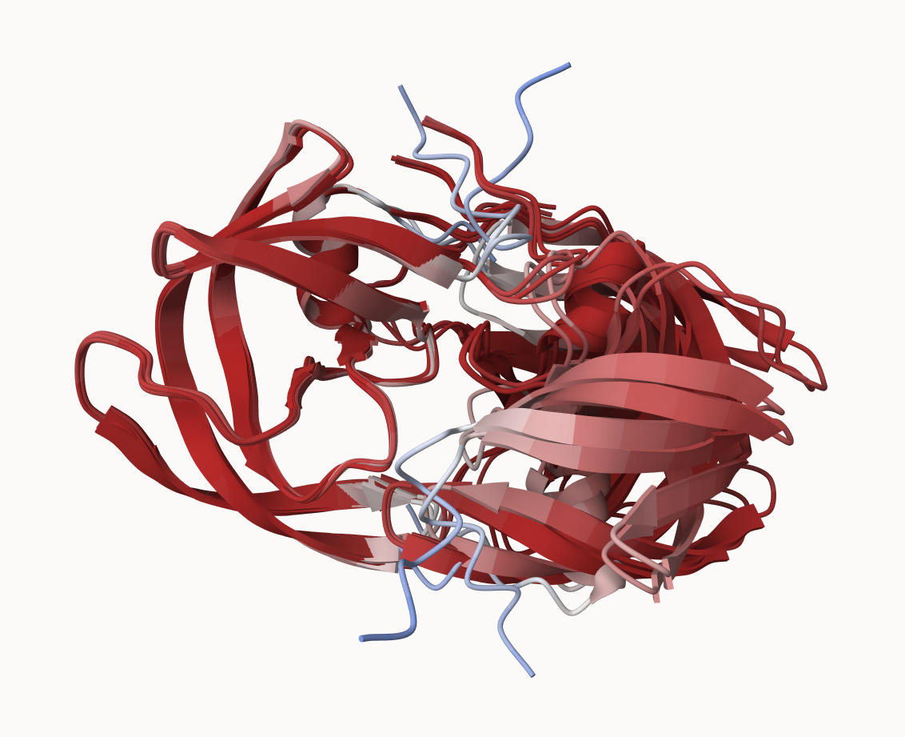
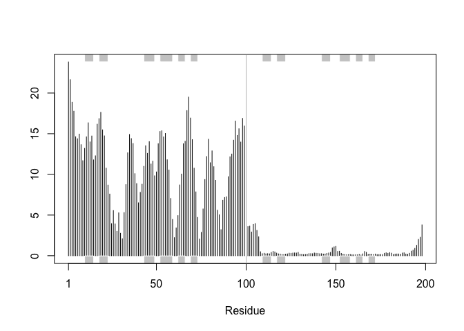
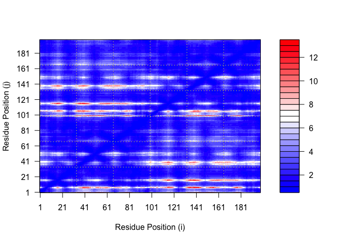
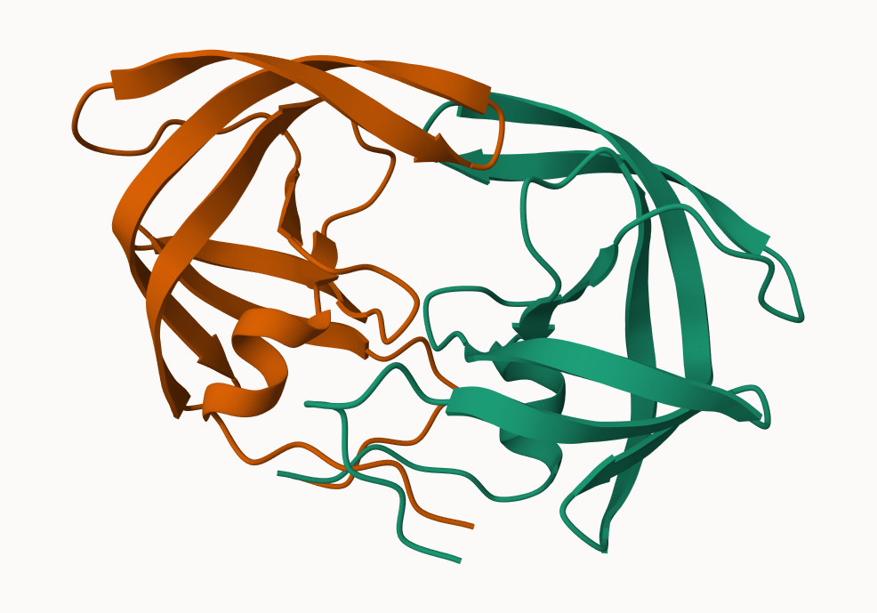

# class 11: Alphafold
Erica Yue Hu (PID: A17787225)

## background

In this hands-on session we will utilize AlphaFold to predict protein
structure from sequence (Jumper et al. 2021).

Without the aid of such approaches, it can take years of expensive
laboratory work to determine the structure of just one protein. With
AlphaFold we can now accurately compute a typical protein structure in
as little as ten minutes.

the pdb database (the main repository of experimental structures) only
has ~250 thousand structures (we saw this in the last lab). the main
protein sequence database has over **200 million** sequences!!! Only
0.125% of known sequences have a known structure - this is called the
“structure knowledge gap”

``` r
(250000/200000000)*100
```

    [1] 0.125

- structures are much harder to determine than sequences
- they are expensive (on avg ~1 million each )
- they take an average 2-5 years to solve!

# EBI alphafold database

the EBI has a databse of pre-computed Alpha Fold (AF) models called
AFDB. This is growing all the time and can be useful to check before
running AF ourselves.

## running alphafold

we can download and run locallt (on our own computers) but we need a
GPU. Or we can use “cloud” computer to run this on someone else’s
computers

we will use ColabFold <https://github.com/sokrypton/ColabFold>

previously found that there was no AFDB entry for our HIV sequence:

    >HIV-Pr-Dimer
    PQITLWQRPLVTIKIGGQLKEALLDTGADDTVLEEMSLPGRWKPKMIGGIGGFIKVRQYDQILIEICGHKAIGTVLVGPTPVNIIGRNLLTQIGCTLNF:PQITLWQRPLVTIKIGGQLKEALLDTGADDTVLEEMSLPGRWKPKMIGGIGGFIKVRQYDQILIEICGHKAIGTVLVGPTPVNIIGRNLLTQIGCTLNF

here we will use AlphaFold2_mmseqs2

## Custom analysis of resulting models

``` r
# Change this for YOUR results dir name
results_dir <- "hivpr_23119_3" 
```

``` r
# File names for all PDB models
pdb_files <- list.files(path=results_dir,
                        pattern="*.pdb",
                        full.names = TRUE)

# Print our PDB file names
basename(pdb_files)
```

    [1] "hivpr_23119_3_unrelaxed_rank_001_alphafold2_multimer_v3_model_4_seed_000.pdb"
    [2] "hivpr_23119_3_unrelaxed_rank_002_alphafold2_multimer_v3_model_1_seed_000.pdb"
    [3] "hivpr_23119_3_unrelaxed_rank_003_alphafold2_multimer_v3_model_5_seed_000.pdb"
    [4] "hivpr_23119_3_unrelaxed_rank_004_alphafold2_multimer_v3_model_2_seed_000.pdb"
    [5] "hivpr_23119_3_unrelaxed_rank_005_alphafold2_multimer_v3_model_3_seed_000.pdb"

``` r
library(bio3d)

# Read all data from Models 
#  and superpose/fit coords
pdbs <- pdbaln(pdb_files, fit=TRUE, exefile="msa")
```

    Reading PDB files:
    hivpr_23119_3/hivpr_23119_3_unrelaxed_rank_001_alphafold2_multimer_v3_model_4_seed_000.pdb
    hivpr_23119_3/hivpr_23119_3_unrelaxed_rank_002_alphafold2_multimer_v3_model_1_seed_000.pdb
    hivpr_23119_3/hivpr_23119_3_unrelaxed_rank_003_alphafold2_multimer_v3_model_5_seed_000.pdb
    hivpr_23119_3/hivpr_23119_3_unrelaxed_rank_004_alphafold2_multimer_v3_model_2_seed_000.pdb
    hivpr_23119_3/hivpr_23119_3_unrelaxed_rank_005_alphafold2_multimer_v3_model_3_seed_000.pdb
    .....

    Extracting sequences

    pdb/seq: 1   name: hivpr_23119_3/hivpr_23119_3_unrelaxed_rank_001_alphafold2_multimer_v3_model_4_seed_000.pdb 
    pdb/seq: 2   name: hivpr_23119_3/hivpr_23119_3_unrelaxed_rank_002_alphafold2_multimer_v3_model_1_seed_000.pdb 
    pdb/seq: 3   name: hivpr_23119_3/hivpr_23119_3_unrelaxed_rank_003_alphafold2_multimer_v3_model_5_seed_000.pdb 
    pdb/seq: 4   name: hivpr_23119_3/hivpr_23119_3_unrelaxed_rank_004_alphafold2_multimer_v3_model_2_seed_000.pdb 
    pdb/seq: 5   name: hivpr_23119_3/hivpr_23119_3_unrelaxed_rank_005_alphafold2_multimer_v3_model_3_seed_000.pdb 

``` r
pdbs
```

                                   1        .         .         .         .         50 
    [Truncated_Name:1]hivpr_2311   PQITLWQRPLVTIKIGGQLKEALLDTGADDTVLEEMSLPGRWKPKMIGGI
    [Truncated_Name:2]hivpr_2311   PQITLWQRPLVTIKIGGQLKEALLDTGADDTVLEEMSLPGRWKPKMIGGI
    [Truncated_Name:3]hivpr_2311   PQITLWQRPLVTIKIGGQLKEALLDTGADDTVLEEMSLPGRWKPKMIGGI
    [Truncated_Name:4]hivpr_2311   PQITLWQRPLVTIKIGGQLKEALLDTGADDTVLEEMSLPGRWKPKMIGGI
    [Truncated_Name:5]hivpr_2311   PQITLWQRPLVTIKIGGQLKEALLDTGADDTVLEEMSLPGRWKPKMIGGI
                                   ************************************************** 
                                   1        .         .         .         .         50 

                                  51        .         .         .         .         100 
    [Truncated_Name:1]hivpr_2311   GGFIKVRQYDQILIEICGHKAIGTVLVGPTPVNIIGRNLLTQIGCTLNFP
    [Truncated_Name:2]hivpr_2311   GGFIKVRQYDQILIEICGHKAIGTVLVGPTPVNIIGRNLLTQIGCTLNFP
    [Truncated_Name:3]hivpr_2311   GGFIKVRQYDQILIEICGHKAIGTVLVGPTPVNIIGRNLLTQIGCTLNFP
    [Truncated_Name:4]hivpr_2311   GGFIKVRQYDQILIEICGHKAIGTVLVGPTPVNIIGRNLLTQIGCTLNFP
    [Truncated_Name:5]hivpr_2311   GGFIKVRQYDQILIEICGHKAIGTVLVGPTPVNIIGRNLLTQIGCTLNFP
                                   ************************************************** 
                                  51        .         .         .         .         100 

                                 101        .         .         .         .         150 
    [Truncated_Name:1]hivpr_2311   QITLWQRPLVTIKIGGQLKEALLDTGADDTVLEEMSLPGRWKPKMIGGIG
    [Truncated_Name:2]hivpr_2311   QITLWQRPLVTIKIGGQLKEALLDTGADDTVLEEMSLPGRWKPKMIGGIG
    [Truncated_Name:3]hivpr_2311   QITLWQRPLVTIKIGGQLKEALLDTGADDTVLEEMSLPGRWKPKMIGGIG
    [Truncated_Name:4]hivpr_2311   QITLWQRPLVTIKIGGQLKEALLDTGADDTVLEEMSLPGRWKPKMIGGIG
    [Truncated_Name:5]hivpr_2311   QITLWQRPLVTIKIGGQLKEALLDTGADDTVLEEMSLPGRWKPKMIGGIG
                                   ************************************************** 
                                 101        .         .         .         .         150 

                                 151        .         .         .         .       198 
    [Truncated_Name:1]hivpr_2311   GFIKVRQYDQILIEICGHKAIGTVLVGPTPVNIIGRNLLTQIGCTLNF
    [Truncated_Name:2]hivpr_2311   GFIKVRQYDQILIEICGHKAIGTVLVGPTPVNIIGRNLLTQIGCTLNF
    [Truncated_Name:3]hivpr_2311   GFIKVRQYDQILIEICGHKAIGTVLVGPTPVNIIGRNLLTQIGCTLNF
    [Truncated_Name:4]hivpr_2311   GFIKVRQYDQILIEICGHKAIGTVLVGPTPVNIIGRNLLTQIGCTLNF
    [Truncated_Name:5]hivpr_2311   GFIKVRQYDQILIEICGHKAIGTVLVGPTPVNIIGRNLLTQIGCTLNF
                                   ************************************************ 
                                 151        .         .         .         .       198 

    Call:
      pdbaln(files = pdb_files, fit = TRUE, exefile = "msa")

    Class:
      pdbs, fasta

    Alignment dimensions:
      5 sequence rows; 198 position columns (198 non-gap, 0 gap) 

    + attr: xyz, resno, b, chain, id, ali, resid, sse, call

RMSD is a standard measure of structural distance between coordinate
sets. We can use the rmsd() function to calculate the RMSD between all
pairs models.

``` r
rd <- rmsd(pdbs, fit=T)
```

    Warning in rmsd(pdbs, fit = T): No indices provided, using the 198 non NA positions

``` r
range(rd)
```

    [1]  0.000 14.428

Draw a heatmap of these RMSD matrix values:

``` r
library(pheatmap)

colnames(rd) <- paste0("m",1:5)
rownames(rd) <- paste0("m",1:5)
pheatmap(rd)
```


# plot pLDDT values across all models

``` r
# Read a reference PDB structure
pdb <- read.pdb("1hsg")
```

      Note: Accessing on-line PDB file

``` r
plotb3(pdbs$b[1,], typ="l", lwd=2, sse=pdb)
points(pdbs$b[2,], typ="l", col="red")
points(pdbs$b[3,], typ="l", col="blue")
points(pdbs$b[4,], typ="l", col="darkgreen")
points(pdbs$b[5,], typ="l", col="orange")
abline(v=100, col="gray")
```


improve the superposition/fitting of our models by finding the most
consistent “rigid core” common across all the models – can use the core
find function:

``` r
core <- core.find(pdbs)
```

     core size 197 of 198  vol = 8545.102 
     core size 196 of 198  vol = 7895.904 
     core size 195 of 198  vol = 3578.885 
     core size 194 of 198  vol = 1851.196 
     core size 193 of 198  vol = 1697.199 
     core size 192 of 198  vol = 1612.765 
     core size 191 of 198  vol = 1530.198 
     core size 190 of 198  vol = 1447.398 
     core size 189 of 198  vol = 1377.107 
     core size 188 of 198  vol = 1303.816 
     core size 187 of 198  vol = 1239.03 
     core size 186 of 198  vol = 1188.129 
     core size 185 of 198  vol = 1118.464 
     core size 184 of 198  vol = 1071.665 
     core size 183 of 198  vol = 1034.007 
     core size 182 of 198  vol = 980.828 
     core size 181 of 198  vol = 942.238 
     core size 180 of 198  vol = 911.387 
     core size 179 of 198  vol = 879.749 
     core size 178 of 198  vol = 834.459 
     core size 177 of 198  vol = 785.261 
     core size 176 of 198  vol = 762.116 
     core size 175 of 198  vol = 722.023 
     core size 174 of 198  vol = 700.389 
     core size 173 of 198  vol = 677.251 
     core size 172 of 198  vol = 657.804 
     core size 171 of 198  vol = 632.902 
     core size 170 of 198  vol = 614.193 
     core size 169 of 198  vol = 591.511 
     core size 168 of 198  vol = 573.974 
     core size 167 of 198  vol = 552.398 
     core size 166 of 198  vol = 529.484 
     core size 165 of 198  vol = 500.54 
     core size 164 of 198  vol = 482.513 
     core size 163 of 198  vol = 458.422 
     core size 162 of 198  vol = 444.451 
     core size 161 of 198  vol = 433.577 
     core size 160 of 198  vol = 419.082 
     core size 159 of 198  vol = 404.931 
     core size 158 of 198  vol = 393.799 
     core size 157 of 198  vol = 382.999 
     core size 156 of 198  vol = 366.651 
     core size 155 of 198  vol = 352.023 
     core size 154 of 198  vol = 335.659 
     core size 153 of 198  vol = 319.395 
     core size 152 of 198  vol = 307.932 
     core size 151 of 198  vol = 296.815 
     core size 150 of 198  vol = 284.286 
     core size 149 of 198  vol = 273.457 
     core size 148 of 198  vol = 261.975 
     core size 147 of 198  vol = 249.597 
     core size 146 of 198  vol = 237.951 
     core size 145 of 198  vol = 226.098 
     core size 144 of 198  vol = 213.263 
     core size 143 of 198  vol = 200.212 
     core size 142 of 198  vol = 187.502 
     core size 141 of 198  vol = 177.523 
     core size 140 of 198  vol = 167.371 
     core size 139 of 198  vol = 160.874 
     core size 138 of 198  vol = 154.453 
     core size 137 of 198  vol = 148.438 
     core size 136 of 198  vol = 142.129 
     core size 135 of 198  vol = 136.528 
     core size 134 of 198  vol = 130.768 
     core size 133 of 198  vol = 123.867 
     core size 132 of 198  vol = 117.608 
     core size 131 of 198  vol = 112.709 
     core size 130 of 198  vol = 106.36 
     core size 129 of 198  vol = 100.59 
     core size 128 of 198  vol = 95.717 
     core size 127 of 198  vol = 91.067 
     core size 126 of 198  vol = 86.861 
     core size 125 of 198  vol = 82.309 
     core size 124 of 198  vol = 78.554 
     core size 123 of 198  vol = 74.632 
     core size 122 of 198  vol = 70.489 
     core size 121 of 198  vol = 66.802 
     core size 120 of 198  vol = 62.901 
     core size 119 of 198  vol = 59.152 
     core size 118 of 198  vol = 55.75 
     core size 117 of 198  vol = 51.831 
     core size 116 of 198  vol = 48.3 
     core size 115 of 198  vol = 44.926 
     core size 114 of 198  vol = 42.417 
     core size 113 of 198  vol = 39.425 
     core size 112 of 198  vol = 37.381 
     core size 111 of 198  vol = 33.06 
     core size 110 of 198  vol = 28.153 
     core size 109 of 198  vol = 25.33 
     core size 108 of 198  vol = 22.509 
     core size 107 of 198  vol = 20.695 
     core size 106 of 198  vol = 18.754 
     core size 105 of 198  vol = 17.757 
     core size 104 of 198  vol = 16.712 
     core size 103 of 198  vol = 15.44 
     core size 102 of 198  vol = 14.745 
     core size 101 of 198  vol = 14.758 
     core size 100 of 198  vol = 13.11 
     core size 99 of 198  vol = 11.018 
     core size 98 of 198  vol = 8.967 
     core size 97 of 198  vol = 7.643 
     core size 96 of 198  vol = 6.326 
     core size 95 of 198  vol = 5.37 
     core size 94 of 198  vol = 4.312 
     core size 93 of 198  vol = 3.391 
     core size 92 of 198  vol = 2.697 
     core size 91 of 198  vol = 1.911 
     core size 90 of 198  vol = 1.577 
     core size 89 of 198  vol = 1.144 
     core size 88 of 198  vol = 0.826 
     core size 87 of 198  vol = 0.594 
     core size 86 of 198  vol = 0.494 
     FINISHED: Min vol ( 0.5 ) reached

We can now use the identified core atom positions as a basis for a more
suitable superposition and write out the fitted structures to a
directory called corefit_structures:

``` r
core.inds <- print(core, vol=0.5)
```

    # 87 positions (cumulative volume <= 0.5 Angstrom^3) 
      start end length
    1     8  50     43
    2    52  95     44

``` r
xyz <- pdbfit(pdbs, core.inds, outpath="corefit_structures")
```


examine the RMSF between positions of the structure:

``` r
rf <- rmsf(xyz)

plotb3(rf, sse=pdb)
abline(v=100, col="gray", ylab="RMSF")
```



## Predicted Alignment Error for domains

Independent of the 3D structure, AlphaFold produces an output called
Predicted Aligned Error (PAE). This is detailed in the JSON format
result files, one for each model structure.

we read these files and see that AlphaFold produces a useful
inter-domain prediction for model 1 (and 2) but not for model 5:

``` r
library(jsonlite)

# Listing of all PAE JSON files
pae_files <- list.files(path=results_dir,
                        pattern=".*model.*\\.json",
                        full.names = TRUE)
```

reading 1st and 5th file:

``` r
pae1 <- read_json(pae_files[1],simplifyVector = TRUE)
pae5 <- read_json(pae_files[5],simplifyVector = TRUE)

attributes(pae1)
```

    $names
    [1] "plddt"   "max_pae" "pae"     "ptm"     "iptm"   

``` r
# Per-residue pLDDT scores 
#  same as B-factor of PDB..
head(pae1$plddt) 
```

    [1] 91.44 93.75 94.19 93.44 95.62 89.81

these scores are useful for ranking. the lower the PAE score the better

We can plot the N by N (where N is the number of residues) PAE scores
with ggplot or with functions from the Bio3D package:

``` r
plot.dmat(pae1$pae, 
          xlab="Residue Position (i)",
          ylab="Residue Position (j)")
```



``` r
plot.dmat(pae5$pae, 
          xlab="Residue Position (i)",
          ylab="Residue Position (j)",
          grid.col = "black",
          zlim=c(0,30))
```


We should really plot all of these using the same z range. Here is the
model 1 plot again but this time using the same data range as the plot
for model 5

``` r
plot.dmat(pae1$pae, 
          xlab="Residue Position (i)",
          ylab="Residue Position (j)",
          grid.col = "black",
          zlim=c(0,30))
```


## Residue conservation from alignment file

``` r
aln_file <- list.files(path=results_dir,
                       pattern=".a3m$",
                        full.names = TRUE)
aln_file
```

    [1] "hivpr_23119_3/hivpr_23119_3.a3m"

``` r
aln <- read.fasta(aln_file[1], to.upper = TRUE)
```

    [1] " ** Duplicated sequence id's: 101 **"
    [2] " ** Duplicated sequence id's: 101 **"

``` r
dim(aln$ali)
```

    [1] 5397  132

We can score residue conservation in the alignment with the conserv()
function.

``` r
sim <- conserv(aln)

plotb3(sim[1:99], sse=trim.pdb(pdb, chain="A"),
       ylab="Conservation Score")
```


``` r
con <- consensus(aln, cutoff = 0.9)
con$seq
```

      [1] "-" "-" "-" "-" "-" "-" "-" "-" "-" "-" "-" "-" "-" "-" "-" "-" "-" "-"
     [19] "-" "-" "-" "-" "-" "-" "D" "T" "G" "A" "-" "-" "-" "-" "-" "-" "-" "-"
     [37] "-" "-" "-" "-" "-" "-" "-" "-" "-" "-" "-" "-" "-" "-" "-" "-" "-" "-"
     [55] "-" "-" "-" "-" "-" "-" "-" "-" "-" "-" "-" "-" "-" "-" "-" "-" "-" "-"
     [73] "-" "-" "-" "-" "-" "-" "-" "-" "-" "-" "-" "-" "-" "-" "-" "-" "-" "-"
     [91] "-" "-" "-" "-" "-" "-" "-" "-" "-" "-" "-" "-" "-" "-" "-" "-" "-" "-"
    [109] "-" "-" "-" "-" "-" "-" "-" "-" "-" "-" "-" "-" "-" "-" "-" "-" "-" "-"
    [127] "-" "-" "-" "-" "-" "-"

viewing this model in molstar:

``` r
m1.pdb <- read.pdb(pdb_files[1])
occ <- vec2resno(c(sim[1:99], sim[1:99]), m1.pdb$atom$resno)
write.pdb(m1.pdb, o=occ, file="m1_conserv.pdb")
```


