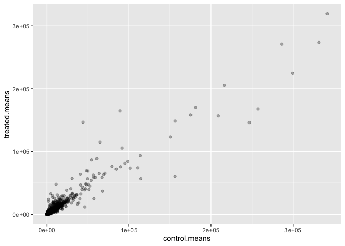
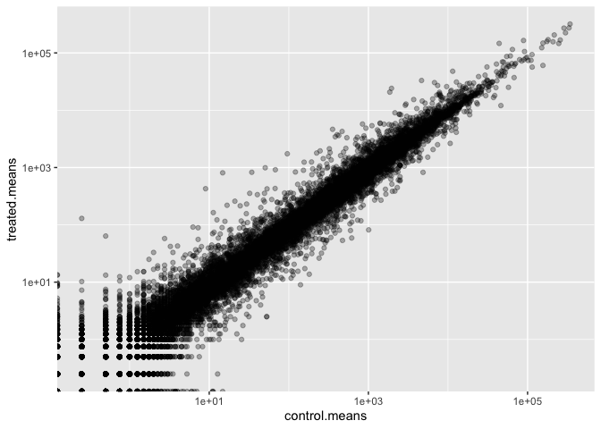
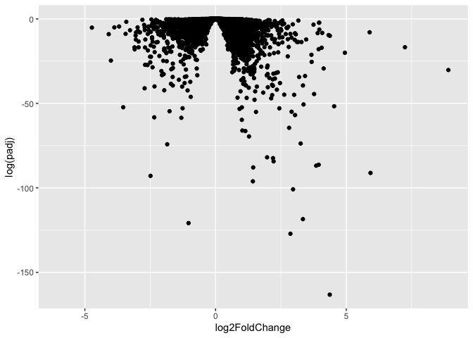
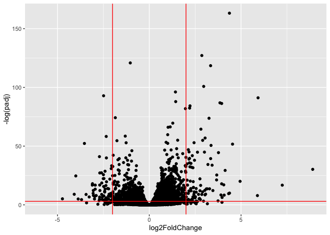
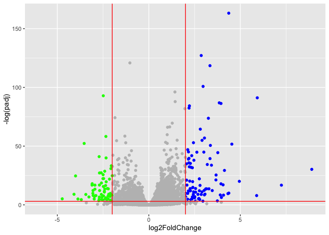

# class 13: RNAseq with DESeq2
erica yue hu (a17787225)

## background

today we will perform an RNASeq analysis on the effects of dexamethasone
(hereafter “dex”), a common steroid, on airway smoothe muslce (ASM) cell
lines.

## Data Import

we need two things for this analysis:

- **countData**: a table with genes as rows and smaples / experiements
  as columns, -**colData**: metadata about the columns (i.e. samples) in
  the main countData object.

``` r
counts <-read.csv("airway_scaledcounts.csv", row.names=1)
metadata <- read.csv("airway_metadata.csv")
```

``` r
head(counts)
```

                    SRR1039508 SRR1039509 SRR1039512 SRR1039513 SRR1039516
    ENSG00000000003        723        486        904        445       1170
    ENSG00000000005          0          0          0          0          0
    ENSG00000000419        467        523        616        371        582
    ENSG00000000457        347        258        364        237        318
    ENSG00000000460         96         81         73         66        118
    ENSG00000000938          0          0          1          0          2
                    SRR1039517 SRR1039520 SRR1039521
    ENSG00000000003       1097        806        604
    ENSG00000000005          0          0          0
    ENSG00000000419        781        417        509
    ENSG00000000457        447        330        324
    ENSG00000000460         94        102         74
    ENSG00000000938          0          0          0

## check on metadata counts correspondance

we need to check that the metadata matches the samples in our count
data.

``` r
ncol(counts) == nrow(metadata)
```

    [1] TRUE

``` r
colnames(counts) == metadata$id
```

    [1] TRUE TRUE TRUE TRUE TRUE TRUE TRUE TRUE

``` r
all(c(T,T,F,T))
```

    [1] FALSE

> Q1. HOW MANY GENES ARE IN THIS DATAASET?

``` r
nrow(counts)
```

    [1] 38694

> Q2. how many “control” samples are in thsi dataset?

``` r
sum(metadata$dex == "control")
```

    [1] 4

## Analysis Plan…

we have 4 replicates per condition (“control” and “treated”). we want to
compare the control vs the treated to see which genes expression levels
change when we have the drug present.

we will go row by row (gene by gene) and see if the average value in
control columns is different than the average value in treated columns

step 1: find which columns in `counts` correspond to “control” samples

step 2: extract and select these columns

step 3: caluclate an average value for each gene (i.e each row)

``` r
#the indices(i.e positions) that are "control" 
control.inds <- metadata$dex == "control"
```

``` r
#extract/select these "control" columns from counts 
control.counts <- counts[,control.inds]
```

``` r
#calculate the mean for each gene (i.e row)
control.means <- rowMeans(control.counts)
```

\##for treated:

``` r
treated.inds <-metadata$dex=="treated"
```

``` r
treated.counts <- counts[,treated.inds]
```

``` r
treated.means <- rowMeans(treated.counts)
```

lets put these two mean values into a new data.frame `meancounts` for
easy book-keeping and plotting

``` r
meancounts <- data.frame(control.means, 
                        treated.means)

head(meancounts)
```

                    control.means treated.means
    ENSG00000000003        900.75        658.00
    ENSG00000000005          0.00          0.00
    ENSG00000000419        520.50        546.00
    ENSG00000000457        339.75        316.50
    ENSG00000000460         97.25         78.75
    ENSG00000000938          0.75          0.00

> Q: make ggplot of average counts of control vs treated

``` r
library(ggplot2)
ggplot(meancounts, aes(x=control.means,y=treated.means))+
  geom_point(alpha=0.3)
```



this needs to be log transformed as it is so highly skewed:

``` r
library(ggplot2)
ggplot(meancounts, aes(x=control.means,y=treated.means))+
  geom_point(alpha=0.3)+
  scale_x_log10()+
  scale_y_log10()
```

    Warning in scale_x_log10(): log-10 transformation introduced infinite values.

    Warning in scale_y_log10(): log-10 transformation introduced infinite values.



## log2 units and fold change

if we consider “treated”/“control” counts we will get a number that
tells us the change.

``` r
log2(20/20)
```

    [1] 0

``` r
# a doubling in the treated vs control 
log2(2)
```

    [1] 1

``` r
log2(10/20)
```

    [1] -1

> Q. add a new column `log2fc` for log2 fold change of treated and
> control to our meancounts object

``` r
meancounts$log2fc <- 
  log2(meancounts$treated.means/
         meancounts$control.means)

head(meancounts)
```

                    control.means treated.means      log2fc
    ENSG00000000003        900.75        658.00 -0.45303916
    ENSG00000000005          0.00          0.00         NaN
    ENSG00000000419        520.50        546.00  0.06900279
    ENSG00000000457        339.75        316.50 -0.10226805
    ENSG00000000460         97.25         78.75 -0.30441833
    ENSG00000000938          0.75          0.00        -Inf

## remove zero count genes

typically we would not consider zero count genes - as we have no data
about them and they should be excluded from further consideration. these
lead to “funky” log2 fold change values (e.g divide by zero errors)

\##DESeq analysis

we are missing any measure of significance from the work we ahave so
far. lets do this properly with the **DESeq2** package

``` r
library(DESeq2)
```

the DESeq2 package, like many bioconductor packages, wants it’s input in
a very specific way - a data structure setup with all the info it neeeds
for the calculation

``` r
dds <- DESeqDataSetFromMatrix(countData= counts,
                              colData = metadata, 
                               design = ~dex)
```

    converting counts to integer mode

    Warning in DESeqDataSet(se, design = design, ignoreRank): some variables in
    design formula are characters, converting to factors

The main function in this package is called `DESeq()` it will run the
full analysis for us on our `dds` input object:

``` r
dds <- DESeq(dds)
```

    estimating size factors

    estimating dispersions

    gene-wise dispersion estimates

    mean-dispersion relationship

    final dispersion estimates

    fitting model and testing

extract our results:

``` r
res <- results(dds) 
head(res)
```

    log2 fold change (MLE): dex treated vs control 
    Wald test p-value: dex treated vs control 
    DataFrame with 6 rows and 6 columns
                      baseMean log2FoldChange     lfcSE      stat    pvalue
                     <numeric>      <numeric> <numeric> <numeric> <numeric>
    ENSG00000000003 747.194195      -0.350703  0.168242 -2.084514 0.0371134
    ENSG00000000005   0.000000             NA        NA        NA        NA
    ENSG00000000419 520.134160       0.206107  0.101042  2.039828 0.0413675
    ENSG00000000457 322.664844       0.024527  0.145134  0.168996 0.8658000
    ENSG00000000460  87.682625      -0.147143  0.256995 -0.572550 0.5669497
    ENSG00000000938   0.319167      -1.732289  3.493601 -0.495846 0.6200029
                         padj
                    <numeric>
    ENSG00000000003  0.163017
    ENSG00000000005        NA
    ENSG00000000419  0.175937
    ENSG00000000457  0.961682
    ENSG00000000460  0.815805
    ENSG00000000938        NA

## Volcano plot

a useful summary figure ofour results is often called a volcano plot. it
is basically a plot of log2 fold change values vs Adjusted P values

> Q. use ggplot to make a first version of “volcano plot” of
> `log2FoldChange` vs `padj`

``` r
ggplot(res, aes(log2FoldChange, padj))+
  geom_point()
```

    Warning: Removed 23549 rows containing missing values or values outside the scale range
    (`geom_point()`).


this is not very useful becuase the y-axis (P-value) is not really
helpful - we want to focus on the low p value.

``` r
ggplot(res, aes(log2FoldChange, 
                log(padj)))+
       geom_point()
```

    Warning: Removed 23549 rows containing missing values or values outside the scale range
    (`geom_point()`).



``` r
ggplot(res, aes(log2FoldChange, 
                -log(padj)))+
       geom_point()
```

    Warning: Removed 23549 rows containing missing values or values outside the scale range
    (`geom_point()`).


each dot is a gene if it is away from 0 in positive direction, it means
the expression is going up one of the exploding point meanas p value is
small so it is significant

``` r
ggplot(res, aes(log2FoldChange, 
                -log(padj)))+
       geom_point()+
  geom_vline(xintercept = c(-2,+2), col="red")+
  geom_hline(yintercept = -log(0.05), col="red")
```

    Warning: Removed 23549 rows containing missing values or values outside the scale range
    (`geom_point()`).



## add some plot annotation

> Q: add clor to the points (genes) we care about, nice axis labels, a
> useful title, and a nice theme.

``` r
mycols <- rep("gray", nrow(res))
mycols[res$log2FoldChange > 2 ] <-"blue" 
mycols[res$log2FoldChange < -2] <- "green"
mycols[res$padj >= 0.05] <- "gray"
```

``` r
ggplot(res)+
  aes(x=log2FoldChange, 
      y=-log(padj)) +
  geom_point(col = mycols)+ 
  geom_vline(xintercept = c(-2,+2), col="red")+
  geom_hline(yintercept = -log(0.05), col="red")
```

    Warning: Removed 23549 rows containing missing values or values outside the scale range
    (`geom_point()`).



## save our results to a CSV file

``` r
write.csv(res, file="results.csv")
```

## add annotation data

to make sense of our results we need to know what the differentially
expressed genes are and what biological pathways and process they are
involved in.

``` r
head(res)
```

    log2 fold change (MLE): dex treated vs control 
    Wald test p-value: dex treated vs control 
    DataFrame with 6 rows and 6 columns
                      baseMean log2FoldChange     lfcSE      stat    pvalue
                     <numeric>      <numeric> <numeric> <numeric> <numeric>
    ENSG00000000003 747.194195      -0.350703  0.168242 -2.084514 0.0371134
    ENSG00000000005   0.000000             NA        NA        NA        NA
    ENSG00000000419 520.134160       0.206107  0.101042  2.039828 0.0413675
    ENSG00000000457 322.664844       0.024527  0.145134  0.168996 0.8658000
    ENSG00000000460  87.682625      -0.147143  0.256995 -0.572550 0.5669497
    ENSG00000000938   0.319167      -1.732289  3.493601 -0.495846 0.6200029
                         padj
                    <numeric>
    ENSG00000000003  0.163017
    ENSG00000000005        NA
    ENSG00000000419  0.175937
    ENSG00000000457  0.961682
    ENSG00000000460  0.815805
    ENSG00000000938        NA

Let’s start by mapping our ENSEMBLE ids to the more conventional gene
SYMBOL

we will use two bioconductor packages for this “mapping”
**AnnotationDbi** and **org.Hs.eg.db**

we will need to install these from bioconductor
with`BiocManager::install("AnnotationDbi")`

``` r
library(AnnotationDbi)
library(org.Hs.eg.db)
```

``` r
columns(org.Hs.eg.db)
```

     [1] "ACCNUM"       "ALIAS"        "ENSEMBL"      "ENSEMBLPROT"  "ENSEMBLTRANS"
     [6] "ENTREZID"     "ENZYME"       "EVIDENCE"     "EVIDENCEALL"  "GENENAME"    
    [11] "GENETYPE"     "GO"           "GOALL"        "IPI"          "MAP"         
    [16] "OMIM"         "ONTOLOGY"     "ONTOLOGYALL"  "PATH"         "PFAM"        
    [21] "PMID"         "PROSITE"      "REFSEQ"       "SYMBOL"       "UCSCKG"      
    [26] "UNIPROT"     

different organism has different abbreviations

``` r
res$symbol <- mapIds(org.Hs.eg.db, 
               keys = rownames(res), #our ids 
                keytype = "ENSEMBL", #their format
              column = "SYMBOL")    #what i want to translate to 
```

    'select()' returned 1:many mapping between keys and columns

``` r
head(res)
```

    log2 fold change (MLE): dex treated vs control 
    Wald test p-value: dex treated vs control 
    DataFrame with 6 rows and 7 columns
                      baseMean log2FoldChange     lfcSE      stat    pvalue
                     <numeric>      <numeric> <numeric> <numeric> <numeric>
    ENSG00000000003 747.194195      -0.350703  0.168242 -2.084514 0.0371134
    ENSG00000000005   0.000000             NA        NA        NA        NA
    ENSG00000000419 520.134160       0.206107  0.101042  2.039828 0.0413675
    ENSG00000000457 322.664844       0.024527  0.145134  0.168996 0.8658000
    ENSG00000000460  87.682625      -0.147143  0.256995 -0.572550 0.5669497
    ENSG00000000938   0.319167      -1.732289  3.493601 -0.495846 0.6200029
                         padj      symbol
                    <numeric> <character>
    ENSG00000000003  0.163017      TSPAN6
    ENSG00000000005        NA        TNMD
    ENSG00000000419  0.175937        DPM1
    ENSG00000000457  0.961682       SCYL3
    ENSG00000000460  0.815805       FIRRM
    ENSG00000000938        NA         FGR

> Q. can u add “GENENAME” and “ENTREZID” as new columns too `res` name
> “name” and “entrez”?

``` r
res$name <- mapIds(org.Hs.eg.db, 
            keys = rownames(res),
            keytype = "ENSEMBL",
            column = "GENENAME")
```

    'select()' returned 1:many mapping between keys and columns

``` r
head(res)
```

    log2 fold change (MLE): dex treated vs control 
    Wald test p-value: dex treated vs control 
    DataFrame with 6 rows and 8 columns
                      baseMean log2FoldChange     lfcSE      stat    pvalue
                     <numeric>      <numeric> <numeric> <numeric> <numeric>
    ENSG00000000003 747.194195      -0.350703  0.168242 -2.084514 0.0371134
    ENSG00000000005   0.000000             NA        NA        NA        NA
    ENSG00000000419 520.134160       0.206107  0.101042  2.039828 0.0413675
    ENSG00000000457 322.664844       0.024527  0.145134  0.168996 0.8658000
    ENSG00000000460  87.682625      -0.147143  0.256995 -0.572550 0.5669497
    ENSG00000000938   0.319167      -1.732289  3.493601 -0.495846 0.6200029
                         padj      symbol                   name
                    <numeric> <character>            <character>
    ENSG00000000003  0.163017      TSPAN6          tetraspanin 6
    ENSG00000000005        NA        TNMD            tenomodulin
    ENSG00000000419  0.175937        DPM1 dolichyl-phosphate m..
    ENSG00000000457  0.961682       SCYL3 SCY1 like pseudokina..
    ENSG00000000460  0.815805       FIRRM FIGNL1 interacting r..
    ENSG00000000938        NA         FGR FGR proto-oncogene, ..

``` r
res$entrez <- mapIds(org.Hs.eg.db, 
            keys = rownames(res),
            keytype = "ENSEMBL",
            column = "ENTREZID")
```

    'select()' returned 1:many mapping between keys and columns

``` r
head(res)
```

    log2 fold change (MLE): dex treated vs control 
    Wald test p-value: dex treated vs control 
    DataFrame with 6 rows and 9 columns
                      baseMean log2FoldChange     lfcSE      stat    pvalue
                     <numeric>      <numeric> <numeric> <numeric> <numeric>
    ENSG00000000003 747.194195      -0.350703  0.168242 -2.084514 0.0371134
    ENSG00000000005   0.000000             NA        NA        NA        NA
    ENSG00000000419 520.134160       0.206107  0.101042  2.039828 0.0413675
    ENSG00000000457 322.664844       0.024527  0.145134  0.168996 0.8658000
    ENSG00000000460  87.682625      -0.147143  0.256995 -0.572550 0.5669497
    ENSG00000000938   0.319167      -1.732289  3.493601 -0.495846 0.6200029
                         padj      symbol                   name      entrez
                    <numeric> <character>            <character> <character>
    ENSG00000000003  0.163017      TSPAN6          tetraspanin 6        7105
    ENSG00000000005        NA        TNMD            tenomodulin       64102
    ENSG00000000419  0.175937        DPM1 dolichyl-phosphate m..        8813
    ENSG00000000457  0.961682       SCYL3 SCY1 like pseudokina..       57147
    ENSG00000000460  0.815805       FIRRM FIGNL1 interacting r..       55732
    ENSG00000000938        NA         FGR FGR proto-oncogene, ..        2268

``` r
write.csv(res, file="results_annotated.csv")
```

\##pathway analysis

now we know the gene names (gene symbols) and their entrez IDs we can
find out what pathways they are involved in. this is called “pathway
analysis” or “gene set enrichment” we will use the **gage** package and
the **pathviewr** package to do this analysis (but there are loads of
others).

``` r
library(gage)
library(gageData)
library(pathview)
```

let’s see what is in gageData, specifically KEGG pathways

``` r
data(kegg.sets.hs)
head(kegg.sets.hs, 2)
```

    $`hsa00232 Caffeine metabolism`
    [1] "10"   "1544" "1548" "1549" "1553" "7498" "9"   

    $`hsa00983 Drug metabolism - other enzymes`
     [1] "10"     "1066"   "10720"  "10941"  "151531" "1548"   "1549"   "1551"  
     [9] "1553"   "1576"   "1577"   "1806"   "1807"   "1890"   "221223" "2990"  
    [17] "3251"   "3614"   "3615"   "3704"   "51733"  "54490"  "54575"  "54576" 
    [25] "54577"  "54578"  "54579"  "54600"  "54657"  "54658"  "54659"  "54963" 
    [33] "574537" "64816"  "7083"   "7084"   "7172"   "7363"   "7364"   "7365"  
    [41] "7366"   "7367"   "7371"   "7372"   "7378"   "7498"   "79799"  "83549" 
    [49] "8824"   "8833"   "9"      "978"   

to run our pathway analysis we will use the **gage()** function. it
wants to maintain inputs: a vector of importance (in our case the log2
fold change values); and the gene sets to check overlap for.

``` r
foldchanges <- res$log2FoldChange
names(foldchanges) <- res$symbol 
foldchanges
```

             TSPAN6            TNMD            DPM1           SCYL3           FIRRM 
      -3.507030e-01              NA    2.061073e-01    2.452701e-02   -1.471426e-01 
                FGR             CFH           FUCA2            GCLC            NFYA 
      -1.732289e+00    4.592819e-01   -2.282438e-01   -2.530308e-01   -5.337334e-01 
              STPG1          NIPAL3           LAS1L           ENPP4          SEMA3F 
      -1.235577e-01    2.101560e-03   -5.732092e-02    2.868170e-01   -1.922028e-01 
               CFTR          ANKIB1         CYP51A1           KRIT1           RAD52 
      -2.863937e-01   -2.460912e-01   -1.797534e-01   -7.125492e-02   -4.115826e-01 
               <NA>             BAD            LAP3            CD99          HS3ST1 
       1.061131e+00    1.032510e-02    1.643007e-01    7.928942e-02    3.990671e-01 
               AOC1           WNT16           HECW1          MAD1L1           LASP1 
       8.049352e-01   -6.167565e-01    1.936813e-01   -5.738893e-02    4.168750e-01 
              SNX11        TMEM176A            M6PR          KLHL13         CYP26B1 
       3.419728e-01    4.044665e-01   -7.701994e-03   -9.645787e-01   -1.030776e+00 
               ICA1          DBNDD1            ALS2          CASP10           CFLAR 
       2.549138e-01   -3.684979e-01    5.489205e-02   -1.783988e-01    1.162500e+00 
               TFPI         NDUFAF7            RBM5           MTMR7          SLC7A2 
      -3.254436e-01   -1.008956e-01   -1.837677e-01    7.546840e-01    5.869317e-01 
               ARF5           SARM1         POLDIP2          PLXND1             AK2 
       3.796899e-01   -8.077704e-02    1.522880e-01   -5.194727e-02   -9.185676e-02 
               CD38           FKBP4           KDM1A            RBM6          CAMKK1 
       2.415845e-01   -3.038333e-03   -3.341060e-01   -3.035313e-01   -6.451762e-01 
              RECQL           VPS50           HSPB6        ARHGAP33         NDUFAB1 
       4.095532e-01   -1.143570e-01   -1.545422e-01   -4.714329e-01    1.099033e-01 
               PDK4        SLC22A16         ZMYND10           ABCB5             ARX 
       2.559675e+00    5.281822e-02   -9.239379e-01   -1.589952e+00    8.946997e-01 
           SLC25A13             ST7           CDC27          SLC4A1           CALCR 
       5.597354e-02   -6.140816e-01   -1.618647e-01   -6.095474e-01              NA 
               HCCS            DVL2          PRSS22            UPF1           SKAP2 
      -1.663624e-01   -3.467479e-01              NA    2.212874e-01    7.330294e-02 
            SLC25A5            MCUB          HOXA11          POLR2J           DHX33 
      -7.718319e-02    2.233337e-01   -1.079306e+00    9.877741e-02    3.144319e-01 
              MEOX1          THSD7A            LIG3           RPAP3           ACSM3 
      -2.193116e+00    9.318273e-01   -3.854730e-01   -1.991431e-01   -3.275090e-01 
              REXO5         CIAPIN1          SPPL2B           ATOSB           COPZ2 
      -4.398274e-01    1.280017e-01    1.013186e-01   -2.058234e-01   -1.065690e-01 
            PRKAR2B            MSL3          CREBBP         TSPOAP1             MPO 
       6.602817e-01    1.902867e-01   -1.044013e-01    1.209417e-01    1.170191e+00 
               PON1           GCFC2           WDR54            CROT           ABCB4 
      -5.479728e-01    1.569585e-01    2.801559e-01   -2.739937e-01   -1.229168e+00 
              KMT2E          RHBDD2            SOX8            IBTK          ZNF195 
       1.380367e-02   -1.517835e-01   -6.647366e-01   -8.752130e-02   -2.454595e-01 
             MYCBP2           FBXL3           ITGAL            PDK2           ITGA3 
      -6.271632e-02    4.085973e-01   -9.388209e-01   -1.279212e-01    3.335346e-01 
                ZFX           LAMP2          ITGA2B            ASB4            GDE1 
       1.629350e-02    4.307508e-02   -6.198260e-01   -6.296606e-01    1.807669e-01 
             REX1BD           CRLF1          OSBPL7          TMEM98            YBX2 
      -5.317531e-02    1.921302e-01   -6.525544e-01    9.041088e-03   -2.883068e-01 
             KRT33A         MAP3K14           ABCC8          CACNG3        TMEM132A 
                 NA   -5.841877e-01              NA   -1.015575e+00   -5.498880e-01 
              AP2B1            TAC1          ZNF263          CX3CL1         SPATA20 
       8.025782e-02    1.962477e+00    1.116907e-01    9.502809e-01   -1.069815e-01 
            CACNA1G       TNFRSF12A            DLX6          MAP3K9            RALA 
      -1.173476e+00   -1.461047e-01    8.946997e-01   -2.185705e-01   -5.691794e-01 
           BAIAP2L1           KDM7A            ETV1             AGK         ALDH3B1 
      -2.737793e-01    5.601732e-03    4.861182e-02    3.315634e-02    4.279165e-01 
              TTC22           PHTF2           CCL26           FARP2           USH1C 
      -6.105749e-01   -4.165878e-01   -4.339514e-01    5.958619e-01              NA 
               GGCT            DBF4          TBXA2R           IFRD1         LGALS14 
      -1.087191e-01   -4.483483e-01   -4.852530e-01   -5.099405e-02   -4.858001e-01 
              COX10        GTF2IRD1            PAF1           VPS41        ARHGAP44 
       1.961253e-01   -4.137239e-02   -2.389320e-01   -1.396043e-01   -1.996811e-02 
              ELAC2            SCIN            ARSD          PNPLA4           MYH13 
       2.517167e-01    2.034239e-01   -1.479025e-02   -1.572303e-02    2.955196e+00 
            ADIPOR2           CDKL3            UPP2          PRSS21           MARK4 
       2.438688e-01   -1.481910e-01   -2.843368e-01    6.079372e-01   -3.771953e-02 
              PROM1         CCDC124        CEACAM21        PAFAH1B1            NOS2 
      -5.524548e-01    2.442439e-01              NA    5.156596e-02   -5.383576e-01 
              DNAH9           BLTP2         SLC13A2            GAS7        TRAPPC6A 
       3.837678e-01    2.440300e-02              NA   -8.957749e-01    2.703063e-01 
               MATK         CEACAM7           CD79B           SCN4A            ST7L 
       1.300314e-01              NA    6.273492e-01   -6.844119e-01    2.155431e-01 
              TKTL1            PAX6          RPUSD1          RHBDF1           LUC7L 
                 NA    2.048258e-01    1.203421e-01    8.681164e-02   -1.038536e-01 
           CACNA2D2          BAIAP3            TSR3            PIGQ          CRAMP1 
       7.395357e-01   -2.116469e-01    7.143399e-02    2.217481e-01    1.667684e-01 
              TEAD3            SELE         DNAJC11            FMO3           MYLIP 
       5.539344e-01              NA   -3.842900e-02    3.139961e-01   -4.897896e-01 
               NOX1            E2F2           PSMB1            SYN1          JARID2 
       8.091294e-01    1.626728e-01    4.784824e-02    6.760110e-01    4.874603e-01 
              CDKL5          CAMK1G          CDK11A            NADK          TFAP2B 
      -1.729351e-01   -8.613065e-01    1.333688e-01    8.301412e-01   -1.403158e+00 
             TFAP2D           DLEC1           CYTH3          ADAM22           SYPL1 
                 NA   -1.717297e-02    1.196835e+00   -2.410868e-02    2.868641e-01 
             CYB561           SPAG9          CELSR3            AASS         PLEKHG6 
       4.612067e-02   -1.667987e-01    5.266172e-01    1.137825e+00    4.054482e-01 
             SS18L2            MPND           MGST1            CRY1         PGLYRP1 
       5.703160e-01    1.324247e-01    4.051439e-03    8.629772e-02    2.695718e+00 
               NFIX         ST3GAL1           MMP25            IL32            PKD1 
      -3.126926e-01   -5.621395e-01   -1.782563e-01   -9.003357e-01    4.045398e-01 
           MAPK8IP2           MED24         RHOBTB2         HEATR5B           SEC62 
       3.784644e-01   -2.572961e-02    3.642741e-01    1.028131e-01    8.295611e-02 
              RPS20           CSDE1           UBE3C           REV3L           TENM1 
      -2.900543e-02   -1.963461e-02    1.971935e-01    9.692876e-01    1.263202e+00 
               PAX7           MASP2             IYD          FAM76A        TRAF3IP3 
                 NA   -4.477102e-01    1.603133e+00    4.268212e-01    3.273177e-01 
              POMT2            VTA1          MLXIPL           BAZ1B          RANBP9 
       1.173867e-01   -1.014317e-01    6.142524e-01   -2.336558e-02    7.168726e-01 
               ETV7           SPRTN         METTL13           DYRK4          ZNF207 
      -6.817471e-01   -1.791711e-01   -9.296401e-02   -2.589997e-01    6.278792e-02 
             UQCRC1        STARD3NL             CD9           HHATL          NCAPD2 
       4.715296e-01   -1.492588e-03    5.706012e-01              NA    3.455429e-02 
              IFFO1            GIPR            PHF7          SEMA3G           NISCH 
      -4.314132e-02   -5.276792e-01    1.831984e-01    2.118170e+00   -2.593802e-01 
              STAB1             FUZ         SLC6A13             IDS           PRSS3 
      -1.618691e+00    1.495597e-01   -1.345440e+00    1.727289e-01    9.969033e-02 
             ZNF200             CD4          LRRC23             BTK             HFE 
       4.601970e-02   -2.825551e-01   -2.881781e-01   -1.012817e+00   -2.615406e-01 
              SCMH1             FYN          HIVEP2            FMO1            ELOA 
       2.884530e-02   -1.116547e-02   -3.887244e-01    5.770867e-01    1.574871e-01 
             LYPLA2           CLCN6            MRC2       NME1-NME2          SLC6A7 
       1.007919e-01   -1.876890e-02   -2.378235e-01   -5.099448e-01   -5.091328e-01 
             TSPAN9           BTBD7           APBA3            MKS1           ABHD5 
       2.249143e-01    7.299491e-02    4.011046e-02   -3.001124e-01    1.096911e+00 
              ANOS1          AKAP8L           MBTD1           UTP18          RNF216 
      -1.131902e+00   -1.906181e-01   -3.161406e-01    2.039669e-01   -1.477994e-02 
              TTC19           PTBP1            DPF1            SYT7           LARS2 
       1.224919e-01    3.571862e-01    6.566603e-01   -8.653323e-01    3.579181e-03 
            PIK3C2A           PLAUR            ANLN             WIZ         RABGAP1 
       2.852833e-01    6.998999e-02   -2.467519e-01    8.868718e-02    4.077168e-01 
                DCN           QPCTL           PPP5C           CEP68          MAP4K3 
      -1.161128e-01    7.417450e-01    5.416510e-01    1.620870e-01    8.132916e-01 
             ZBTB32          TYROBP           LDAF1          GABRA3           BRCA1 
      -4.225513e-01    1.541192e-01    1.587543e-01    2.343223e+00   -1.403527e+00 
              ERCC1            CD22          SEMA3B          MBTPS2        PRICKLE3 
      -7.669312e-02   -1.365997e+00   -6.951359e-01    1.022909e-01    2.105663e-01 
                LTF           EXTL3           NR1H4          ELOVL5           ALOX5 
       1.349419e+00    1.146274e-01    8.946997e-01    4.312805e-01    8.946997e-01 
              KDM5D        CALCOCO1            UBR7          MAP4K5            EHD3 
      -1.205331e-01    4.317126e-01   -3.496257e-02   -1.188039e-01    5.354837e-01 
              PSMC4          MAN2B2         SLC7A14          CLDN11        SLC25A39 
       2.013135e-01    9.054021e-02   -1.509329e+00   -1.649573e+00    1.780576e-02 
                MVP            NUB1            PGM3          RWDD2A            CLK1 
       1.295008e-01    5.550908e-02   -3.562805e-01   -2.643994e-01    3.497655e-01 
             POLR3B          ANGEL1           RNF14        DNASE1L1           DDX11 
      -1.545777e-01   -3.835032e-01    3.013571e-01    1.668261e-03   -2.782654e-01 
              HEBP1          GPRC5A          MAMLD1             CD6           TACC3 
       3.970370e-01   -1.524137e-01    3.700322e-01    7.421946e-02    2.849216e-01 
               UFL1           POLA2           ZC3H3           CAPN1            ACP3 
      -9.985695e-02   -4.073902e-01    4.613884e-02    2.969084e-01   -7.439348e-01 
               MDH1         SLC30A9          MTMR11           COX15         CCDC88C 
      -6.084890e-02    2.159939e-01   -3.127074e-01   -1.719612e-01    1.028154e+00 
               YAF2         ZMYND11             WAS           DPEP1             BID 
       1.333526e-01   -7.292474e-02   -1.821496e-01    2.631677e+00   -5.977019e-02 
              MATR3          NPC1L1           XYLT2           RGPD5           STMN4 
      -3.407282e-01   -2.461179e+00    4.087028e-02   -3.880423e-01    2.328805e+00 
             NUDCD3            ISL1            CHDH          IL20RA           CLCA1 
      -2.754121e-02   -5.479728e-01   -1.274525e+00   -1.320170e+00   -6.717679e-01 
              CLCA4          GLT8D1          ATP2C1            IGF1         SLC38A5 
      -5.479728e-01    5.250715e-02   -2.061427e-01   -1.625173e-01   -8.914492e-01 
             RALBP1           RUFY3           CNTN1         SLC11A1           WWTR1 
       5.460508e-01   -2.382242e-01   -3.321391e-01    1.607875e-01    1.161719e-01 
               AGPS            <NA>          STEEP1          ATP1A2           TTC27 
       6.536151e-02   -5.479728e-01   -1.692822e-01   -1.009691e+00    7.958249e-02 
             ZNF582           VSIG2          PHLDB1           MARCO         CYP24A1 
       7.006272e-02    6.942120e-01    3.861907e-01    1.754724e+00   -3.872968e+00 
             PRDM11           SYT13           SNAI2            CD74             HGF 
       4.705696e-01    4.456294e-01    1.930917e-01   -4.617565e-01   -1.021604e+00 
             ZRANB1            NCDN          ADGRA2         CCT8L1P           ZFP64 
       9.839994e-01   -4.469445e-01   -3.093825e-01   -1.272943e+00   -3.027166e-01 
              MNAT1          SAMD4A           RUNX3           MRE11         PLEKHB1 
       6.159435e-02    1.212231e+00    4.768706e-01    1.628426e-01   -5.709248e-01 
           SERPINB1         CYP3A43          SLC7A9           SPAST           NRXN3 
       4.766909e-01    3.358232e-02   -4.274729e-01    4.558737e-02    1.643286e+00 
             OSBPL5             AQR            CPS1             C8B            FHL1 
       4.848481e-01    1.966088e-01   -2.798911e-01              NA    4.908606e-01 
               RTF2          GABRA1           NLRP2         SLC45A4           RNF10 
       7.762646e-02              NA   -6.707662e-01    1.127237e-01    1.556650e-01 
             ZNF839          ZDHHC6         GRAMD1B            RNH1          NDUFS1 
      -1.263212e-01    1.750412e-01   -7.244389e-01    1.261118e-01    1.593064e-01 
             RB1CC1           ERP44           ALAS1           BIRC3          AKAP11 
       1.724148e-01    2.402659e-01   -2.519484e-01    1.066099e-01   -3.661415e-02 
              GLRX2          SNAPC1            DERA           STRAP           ABCC2 
       2.572681e-01    6.582144e-01    2.374355e-01    2.878617e-01    7.063115e-01 
               DEF6         PLEKHO1            GCLM            UBR2            EHD2 
       5.651429e-02    4.172264e-01    1.256851e+00    1.609959e-01    2.196235e-01 
             DEPDC1         CCDC28A           RRAGD            HSF2           PHF20 
      -1.728247e-01    1.744560e-01    2.998380e-01   -2.269110e-01    8.342305e-03 
            HSD17B6           NR1H3            TYMP          NCAPH2          TOMM34 
      -2.188379e+00    1.943286e-01    1.477571e+00   -1.382368e-01   -5.009343e-01 
              SEC63           KPNA6             VIM  RTEL1-TNFRSF6B             FAS 
      -3.745137e-02    1.517374e-01   -4.021972e-01   -6.791067e-01   -2.001691e-02 
            RNASET2            CD44           KCNG1          AGPAT4          SLAMF7 
      -3.671618e-01   -2.368099e-01   -6.684463e-01   -3.084428e-01    1.780532e+00 
             BTN3A1           MIPEP           PRKCH           INSRR          IFNGR1 
      -8.209472e-01   -4.139406e-01    6.527804e-01   -1.479106e+00    4.225162e-01 
            B4GALT7          SH2D2A            VRK2        TNFRSF1B            VEZT 
      -7.612002e-03   -5.489691e-01    1.177815e-01    8.381483e-01   -9.797224e-03 
             POU2F2            BRD9            SNX1           TBPL1           BMAL2 
      -1.967265e+00    2.203936e-02    3.098179e-03   -1.532667e-01   -8.875034e-02 
             BCLAF1         SLC39A9            ANK1            IBSP           TFB1M 
      -1.508708e-01   -1.171420e-01   -5.309442e-02   -1.737533e+00    7.636624e-02 
             RABEP1           HMGB3          NUP160            BAK1            MUSK 
       4.706970e-03   -3.940820e-01   -1.042260e-02    1.589287e-01   -7.626253e-02 
              IKZF2             GRN          FAM13B        ARHGAP31           CENPQ 
       3.839190e-01   -1.813633e-01   -1.070252e-02   -7.668532e-01    1.119339e-01 
              SARS1          RANBP3          ARID4A           EIPR1          PNPLA6 
      -5.177183e-01   -5.475134e-01   -1.028418e-01    2.251772e-02    1.597879e-01 
              IFT88            ALG1          ZCCHC8           ABCF2           CHPF2 
      -7.086359e-01   -2.220545e-02    7.772233e-02    3.341317e-01    7.783683e-02 
              LRRC7            FUT8            UBA6            GAB2        ATP6V0A1 
      -6.160921e-01   -2.850166e-01   -3.967618e-01    4.052944e-01    5.118905e-01 
              PIAS1          SLC4A7           APBA2          MAP2K3            CLXN 
       9.385629e-02   -1.021873e+00    2.156723e-01    7.376282e-01   -4.736869e-01 
             TMSB10           ASTE1          RNF19A            PEX3       GABARAPL2 
      -1.267855e-01   -6.770334e-01    1.480423e-01   -5.448826e-01    3.733525e-01 
               MYOC          SH3YL1         FAM136A             VCL         DEPDC1B 
       1.254580e-01   -5.345108e-01    2.471149e-01    8.788410e-01   -8.814240e-01 
              DAPK2           NSMAF           ADSS2           STAP1           TIMP2 
       1.567786e+00   -3.375235e-01   -1.476156e-01              NA    1.445987e-01 
               RFC1         TBC1D23            CUL3           MYOM2             OTC 
      -3.084835e-02    2.189159e-01   -1.695734e-02    4.208860e-01   -5.479728e-01 
            CYP46A1            ZZZ3         SLC18A1            USP2            CASR 
      -2.295640e-01   -2.004010e-02    5.867801e-01    5.307339e-01              NA 
              TUBG2         RPL26L1            FLT4           NSUN2          FBXO42 
      -1.292840e-01    3.347218e-01    5.186655e-02    1.114259e-01    2.699707e-01 
              MFAP3            MRI1          METTL1           HOXC8             AGA 
       2.284859e-01    1.198618e-01   -6.065490e-01   -1.866001e-01   -3.381295e-01 
             PI4K2B          BOD1L1           MAT2B            TLL1            EDC4 
       1.088803e-01    4.428067e-02    5.388807e-01   -6.460626e-01    6.961045e-02 
               TRIO            VCAN         CLEC16A            MSR1            CDH1 
      -1.295989e-01   -3.062401e-01   -3.049003e-01   -8.111705e-01   -5.173475e-01 
              MTREX           DNAH5         ZFYVE16          RIPOR1              C6 
      -1.901114e-01   -8.555522e-02   -1.716017e-01    1.651793e-01    1.977351e+00 
              RAI14           SOX30            PNKP           BEST2          PHLPP2 
       4.793244e-01    5.453980e-01   -1.584211e-01   -2.158439e-01    3.044945e-01 
              SPDL1           STAU2         SLC66A1            CTNS           RTN4R 
      -3.921060e-01   -1.470287e-01    2.714296e-01    6.513763e-02   -1.723709e+00 
              PHF23           CDH10          INPP4A          RAB27B           PSMA4 
      -2.237827e-01   -1.812795e+00   -2.027566e-02   -1.706901e+00   -3.671082e-02 
              MYO16            LSG1           PARP3             TNC           THAP3 
       1.716167e+00    1.228947e-01    5.188443e-02   -7.397309e-01   -6.017276e-02 
             RIPOR3            TDP1           AIFM2            <NA>          SPATA7 
       2.072350e-01   -4.661318e-01    7.134371e-01    1.186858e+00   -2.517253e-01 
              MED17          RETSAT            CAPG           AP2S1           USH2A 
       2.471238e-01   -1.273788e-02    1.283355e-03    2.522347e-01   -5.523155e-01 
               ZPBP              TG          ADAM28           BARX2         DCUN1D1 
                 NA    1.918158e-01    9.370632e-01    2.167139e-01    8.245907e-03 
              JADE2            ZIC2            LCP2           TRIT1           ADRB1 
       2.960149e-01              NA              NA   -1.586695e-01    1.019569e+00 
             GUCA2B            CUL7          CTNNA1           PHKA2           CNTLN 
                 NA   -4.287072e-01    4.126661e-02    2.374395e-01   -2.641387e-01 
              EPHA3           HSPA5            DSG2          GEMIN8            OFD1 
       2.129495e-02    1.268072e-01   -5.847063e-01    1.006420e-01   -8.596646e-03 
              GPM6B          MAGEC2           PREX2           WDR37          YTHDC2 
       2.717821e+00   -4.647542e-01   -1.039672e+00    3.004145e-01    1.697936e-01 
              CTPS2         ATP6V1H          POLR2B           ATOSA           ARAP2 
      -2.037433e-02    6.901840e-02   -3.583186e-03   -2.633044e-02   -4.779401e-01 
                TPR              CP          KATNIP          DTNBP1              XK 
      -5.905313e-02    3.448054e-01   -5.556970e-02    1.409851e-01    1.009325e+00 
               ANO2          FERRY3           SCML1            WWC3         ARHGAP6 
       8.012430e-01   -5.939611e-01    2.297147e-01    3.480883e-01   -1.075394e-04 
            FAM184B            MAP4            GOPC            ROS1           USP28 
       5.269890e-01    1.727445e-01   -1.795666e-01   -4.134562e-02    2.023026e-01 
              HDAC9         TSPAN17           NOP16          CC2D2A           RRM2B 
      -5.159974e-01    2.450906e-01    4.592702e-01   -3.134165e-01   -3.861939e-02 
             ZNF800        TNFRSF17           SNX29            LMO3          MRPS10 
       3.546651e-01   -2.548676e-02    4.976136e-01    1.060950e+00   -3.840461e-02 
             GUCA1A            RSF1          VPS13D           CELF2         FAM120A 
      -1.621390e+00   -2.953894e-02    8.907820e-01    8.498113e-01    7.361998e-02 
             R3HDM1          COL9A2           KITLG           ERCC8         ADAMTS6 
      -3.296371e-01   -9.321434e-01   -5.395589e-02   -2.821709e-01   -2.186203e-01 
               H6PD           VAMP3            PER3            UTS2         TNFRSF9 
       3.802279e-01    1.598840e-01   -1.930100e+00   -1.746784e+00    5.481301e-02 
               EPN3           LTBP1            RCN1             ELN            RFC2 
      -1.037224e+00    7.151341e-01   -7.583373e-02    9.450997e-01   -3.866168e-01 
             ARID1B         CLPTM1L          NEDD4L           FOXP3         PPP1R3F 
      -1.472474e-01    3.648211e-01   -1.099597e+00    1.010159e+00   -2.286580e-01 
               HEXB           PTCD2          NEXMIF           JKAMP            DKK3 
       3.868635e-02   -1.757338e-01    8.946997e-01    3.775089e-02    2.574008e-01 
            ARHGEF5          NFE2L3           MCUR1           LIMA1          LETMD1 
       4.116909e-02    3.127165e-01    2.559185e-01   -1.798341e-01   -1.029685e-01 
             SLC4A8           LAMC3          PTGER3           TNIP3           MAPK9 
      -9.729138e-03    5.848724e-02   -1.445242e-01   -6.993959e-01   -1.164461e-01 
            COL23A1           BCAR1          FHIP1B         HERPUD1          HOMER3 
       3.163411e+00    1.613440e-01    1.174338e-01    6.890881e-01   -2.284299e-01 
              RAD51            POLQ          PIK3CB            CYBA           THOC3 
       9.536099e-01   -5.895314e-01    2.892048e-01    3.779392e-01    1.065186e-01 
              HEBP2        MPHOSPH9         PLEKHA5           PRSS8           SIKE1 
       5.056555e-01   -3.738484e-01   -2.786003e-01   -2.632406e+00    3.126192e-01 
              RRP12           FNIP2           MSMO1           TTC17            ALX4 
      -1.632002e-01    1.718729e-01   -9.007344e-02   -2.341036e-01   -1.516680e+00 
              FSTL4           FOXN3         METTL24          AKR7A2           MRTO4 
      -3.772914e-01    4.445705e-01   -1.102548e+00    7.167486e-02    1.898190e-01 
               NNAT            USE1          MCF2L2           NRIP2           LAMA3 
      -2.720499e-01   -1.441345e-01    5.302085e-01   -5.006903e-01    1.253146e+00 
              AP5M1          ANAPC4           KCNQ1         TRAPPC3          THRAP3 
       4.413963e-02    2.781827e-02   -1.231274e+00    9.652776e-02   -9.517830e-02 
              PHPT1          ENTPD2            LY75          ARID4B            OPN3 
      -1.953156e-01   -3.134503e+00    1.149146e+00   -1.693073e-01    7.187920e-01 
            SDCCAG8           PTPRN            HHAT           KIF1B           FOXC1 
      -1.476533e-02   -1.042651e+00   -1.618631e-01    1.542646e-01   -1.422828e-01 
           TBC1D22A           SYNE2         PLEKHH1           ATP9A           SPO11 
       5.021689e-03    5.744961e-02   -1.007433e+00    2.012652e-01   -5.479728e-01 
              CBLN4          CHRDL2         FAM168A            RELT            GALC 
                 NA   -1.256789e+00   -3.636592e-01    3.557773e-01    1.728648e-01 
              NOP58           SZRD1           KCNH2            CUL1        FAM114A2 
       2.063365e-01    2.401141e-01   -1.073547e+00    2.912516e-01    4.111254e-02 
             CYFIP2            TAB2           GINM1         EIF2AK2           USP36 
      -8.166869e-01    9.225042e-02    2.903265e-01   -2.444162e-01    1.037184e-01 
              KMT2C          MCOLN3         CCDC85A            PUM2          MRPL43 
      -1.837144e-01   -3.221470e-01   -1.353710e+00    1.350349e-01   -1.061505e-01 
              ITIH4           ITIH1            HPF1             ZFR         ZNF280C 
      -1.169654e-02    4.343649e+00   -1.528654e-01    1.455224e-01   -4.028934e-01 
             NPFFR2          PHF21B           TRAF1           RC3H2          IL17RB 
      -1.393099e+00              NA    2.934201e-01    2.748266e-01   -9.100056e-01 
           TRAF3IP2            GYG2          DCBLD2        SERPINB3           SOAT1 
       3.020899e-01    3.518789e-01   -1.690316e-01              NA    6.517566e-01 
               PKP2            MSH4              F7            GDI2           PRDM1 
       7.620754e-01   -7.801793e-01   -8.584794e-02   -1.236033e-02    8.346539e-01 
               ATG5           TMCC3          PITHD1            MTA3           USP13 
       3.738255e-01    6.822557e-01   -4.190208e-02   -3.339613e-01    1.260430e-01 
             ATP11B           LAMC2           CDK14         SEC61A1        PPP1R12A 
       2.630364e-01    9.200195e-01   -7.308134e-02   -2.863175e-01    2.619490e-01 
            RASGRF1          CAMK2B           CROCC          POLR3E          ATP2B4 
       3.582200e-01   -1.431491e+00    9.884303e-02    9.722578e-02   -4.841165e-02 
            ZC3H11A           RIOK2           YIPF1            NDC1            DGKG 
      -8.213128e-04   -3.347706e-01    4.301937e-01   -3.272361e-02   -1.338982e+00 
            FLYWCH1            UNKL          TBXAS1          PARP12        ALDH18A1 
      -2.138967e-03    2.999854e-01    1.999065e-01    3.180030e-02   -3.818663e-01 
             TARBP1            GATB            MXD1           CDK17         DNAJC25 
      -3.060804e-01   -1.714710e-01   -6.312163e-02   -4.617646e-01    1.501415e-01 
             SLC2A3             PSD           CTDP1            YBX3           STYK1 
       2.462730e-02   -3.261746e-01    2.332485e-01    4.619716e-01    1.171886e-01 
               WNK1         RPS17P5           CCAR1            OGFR           GNA15 
      -1.128719e-01              NA    1.848629e-03    1.173525e-01   -1.229421e+00 
            CREB3L3            PIGV           PTPRU         SNRNP40          RIMBP2 
      -5.479728e-01    3.730311e-01    9.862559e-02    1.275548e-02   -5.086492e-01 
            COL11A1           QSER1            MPC1           ACAA1           BCAT1 
       2.214518e+00   -2.858469e-02    4.651255e-01    4.868537e-02   -7.519921e-02 
              HDAC7           LZTS1           PRDM6           WNT8A           SPAG4 
       6.242136e-01   -9.511140e-01   -3.397744e-01              NA    5.380958e-01 
             NCKAP1          MRPS35         GUCY1B1          SFSWAP            TNK2 
       3.257323e-01    2.875425e-01   -1.380322e-02   -4.437281e-02   -2.461217e-01 
               MON2            CDH3            ARSF           GPBP1           DGAT2 
      -1.901288e-01   -5.461341e-01    2.758311e-01   -1.602000e-01   -4.027382e-01 
             ZNF112              CS             LTK          MRPS24           ELMO2 
      -5.350431e-02   -6.408460e-02    7.443772e-02   -8.670167e-02    1.817920e-01 
               WAPL            VMP1          APPBP2           POLD1            SEZ6 
       1.887003e-01    4.828847e-01   -5.939713e-02   -2.585163e-01    6.688388e-02 
              EIF4B         SLC6A16           BICRA           SPHK2           RPL18 
      -5.205380e-02   -4.330365e-01    2.984697e-01    9.467955e-02   -6.286424e-02 
               CA11           ISOC2           U2AF2            EPN1           MED29 
      -5.630032e-01   -4.557343e-02   -1.311127e-01    1.867781e-01   -1.249879e-01 
               AHRR            GSC2          ZNF275           MTMR1            GPC1 
      -4.276656e-01              NA    3.657546e-01   -2.017226e-02   -4.159055e-01 
              ADCK1            HAGH            RNF4           CASP8          LIMCH1 
      -1.537283e-01    8.693721e-02    1.618438e-02   -2.679344e-01    9.845727e-02 
             INTS13          TM7SF3            DLX3           SPA17         TSPAN32 
       1.767023e-02    9.806170e-01              NA    1.099996e-01   -2.071453e+00 
               CCN5           DMRT3         ST3GAL6          ATP2C2            NGFR 
      -8.233224e-01              NA   -4.977101e-01   -3.662314e-02    8.356501e-01 
               CDON            TAF2           HIPK2           TNPO3            <NA> 
      -1.490928e+00    8.862691e-02    6.067302e-01   -6.666548e-02   -8.810127e-02 
             RFXANK        TMEM161A           LPAR2            CTSA           SUGP2 
       6.250618e-02   -1.664094e-02   -9.680993e-02   -2.679800e-01   -9.907827e-02 
            SLC12A2           SNX24            EYA2            CNN2           ABCA7 
       4.408875e-02    2.638242e-01    5.041587e-01    7.862060e-01   -6.061326e-01 
             SNCAIP           DDX20           BTBD1            FAR2           BCAS1 
      -1.658167e+00    3.776104e-01    1.340073e-01    4.445728e-01   -1.429328e+00 
             POU1F1          CHI3L2           SBNO2            PMS1          HMG20B 
       8.946997e-01   -2.058416e-02   -4.044668e-02    5.771453e-01    2.505544e-01 
             CALCRL           TAF11          ANKS1A           AP3D1           ZNF76 
       3.677581e-02    8.201152e-02    1.796489e-01   -9.249050e-02   -3.797988e-02 
             NHERF2           NTHL1          BLTP3A           GNAI3            IPO5 
      -1.026374e-01   -5.608614e-02   -1.023292e-01    1.058567e-01   -1.447143e-01 
                OAT            WDR3            PKN2           WDR18           TRAM2 
       7.731039e-02    9.804880e-02    2.995341e-02    2.855641e-01    2.186110e-01 
               NTN1           GLP2R           MCM10            DGKA           ERBB3 
       5.280576e-01    4.459113e-01    2.209897e-01   -9.239462e-04    7.112944e-02 
              ROPN1         ANKRD44           KARS1           ADAT1           PDIA5 
       8.190090e-01   -6.548510e-01    9.086171e-02   -1.310437e-01   -2.184370e-01 
           TBC1D22B          NDUFB4            SPEN            MYLK          ZC3H15 
      -3.775516e-01   -2.188833e-01    7.295514e-01    1.992873e-01   -6.751129e-02 
             MAP2K4           PACC1          SNAP91             SLK          CYB5R4 
       1.337876e-01   -3.608776e-01   -1.191262e+00   -5.603709e-02    2.748800e-01 
            COL17A1           GSTO2         SEC61A2           PRKCQ            TLE2 
      -1.903952e+00    6.673665e-02   -4.924169e-01    1.606856e+00    7.557802e-01 
               ASB1         FAM107B             ME1          TBC1D1           CDK13 
       2.978498e-01   -1.101060e+00   -6.370373e-01    3.952900e-01    2.567275e-01 
             MTHFD2          SLC9A7           FOXJ2            YBX1           PDE4A 
       1.892058e-01   -2.980370e-01    3.343143e-02   -5.561238e-02    2.214927e-01 
            PPP2R5A          CTNNA2          ELAVL1            TIE1           DIP2B 
       2.441809e-01    1.023151e+00    5.970046e-02    9.003883e-01   -2.268588e-01 
            SMARCD1           KDM4A            NFYC         ZMYND12          SLC9A3 
       1.358248e-01   -2.941092e-01   -2.536348e-01   -7.223042e-01   -1.755334e-01 
               NGEF            ASPM            CD84          ELOVL1            SPI1 
      -2.037333e-01   -6.531687e-01   -4.827946e-01    4.951594e-01   -5.742311e-01 
             POLR1H          MPPED2          CLDN18          ZBTB11           ATXN3 
      -2.133957e-01   -5.336594e-01   -3.075589e-01   -2.601948e-01   -5.010217e-02 
             GOLGA5           FGFR2          LRRC40           ISOC1            EML1 
       3.265970e-02   -2.040191e+00   -6.977062e-03   -2.719496e-02    1.217101e-01 
             TRMT11         THUMPD1         MSANTD3          KIF26A           ATG2B 
      -9.637472e-02   -3.050302e-02   -7.298767e-01   -6.917798e-01   -2.637168e-01 
            ARFGEF1          ACSM2B            ZFAT           MTFR1           STAG3 
       1.461941e-01    2.267216e-01   -1.390826e-01    1.187961e-01    3.406125e-02 
               FECH           MYO9A           DDX3Y            PFKP            IDI1 
      -1.732720e-01    1.717895e-01    1.084576e-01    5.328257e-02   -2.515236e-02 
              SP100            KLF6           PLPP1            NEO1           TRAM1 
       1.141994e-02    1.003059e+00   -9.016361e-01   -3.162479e-01    5.983857e-01 
              PHKA1        TNFRSF1A          CACNB1            EVI5          STOML1 
       8.963413e-01    4.018753e-02    2.198034e-01    8.035358e-02   -3.062588e-01 
                PKM           DHX29         DNTTIP2         METTL22         TP53BP1 
      -3.307555e-01   -3.954252e-02    1.413388e-01    1.148140e-01   -7.142457e-01 
                TRO           RRP15            RHOA            DHX8            <NA> 
      -8.182316e-01    1.281409e-01    1.408080e-01    8.380132e-02   -4.603361e-02 
              PRKCZ             ZFY           IARS2            SYT1            NAV3 
      -1.515246e-01    4.816486e-01    1.456934e-01    3.730435e-01    1.400232e+00 
              IDH3G           ROGDI           PDZD4          ATP2B3           ROCK1 
      -8.152951e-02    4.398814e-02   -5.066285e-02   -2.197781e+00    5.174279e-01 
               CBFB            PDK3           HYAL2           HDAC4          RASSF1 
       3.274710e-01    3.727755e-01   -2.030212e-01   -8.183599e-03    4.594111e-01 
              FGFR3           IFI35          HEATR6           COASY         PLEKHH3 
       9.834418e-01    3.317396e-01    2.113414e-02    2.525522e-01    9.265121e-02 
              MEF2A           OTUD5            TFE3         TBC1D25           ACSL4 
       5.368804e-01    1.794319e-01   -1.048723e-01   -1.309821e-01   -3.916823e-01 
             INPP5A           GPKOW         GRIPAP1           FTSJ1           PRR11 
       1.297563e+00    3.300037e-02   -4.952852e-02    3.250929e-02   -3.638323e-01 
              REEP1          ATP11A          POLR1A         LAPTM4A           TTC7A 
       1.733657e-01    2.629559e-02    1.887467e-01   -2.704194e-01   -1.195427e-01 
              IP6K2   STON1-GTF2A1L           SRBD1           KIF2A         RASGRP2 
      -3.012618e-01    8.120288e-01   -5.801746e-01   -1.368519e-01    1.736195e+00 
              PSME4           IFT80           SIRT2          ERLEC1         PPP2R5B 
       2.859183e-01   -5.292391e-01   -6.489286e-02    1.532361e-01    6.171497e-02 
               PYGM           PAGE1           PITX1           TRPC7           MAST4 
      -6.216066e-01              NA   -3.955565e-01              NA   -4.877380e-01 
             ADGRF5            SDK2           ADAM7          NUP133          NUCKS1 
       8.195695e-01    9.522522e-01              NA    2.908231e-01   -3.278137e-01 
              VPS35          DNAJA2            BCL3          KCNAB2           ABCC9 
      -2.314547e-01    5.028081e-02   -4.554661e-01    3.792424e-01    9.795558e-01 
                GAL          CLEC2D          FUNDC1            MAOB            RORA 
      -9.405551e-01    2.970687e-01    1.660487e-01    1.169389e+00    3.553227e-01 
               DRD4          TGFBR3            <NA>         PLA2G10            HES2 
      -3.244948e-01    5.694230e-02    1.592603e-01    1.243906e-01    1.940415e-01 
             ATP1B3           NEDD4            PIGB           MAPK6            GNB5 
       7.441288e-02    2.993210e-02   -6.156136e-02   -1.452121e-01   -6.828935e-02 
             RAB27A           HDHD5            UFD1            LRP6          GUCY2C 
       2.433066e-01    7.198401e-01    1.739825e-01   -3.766459e-01   -2.306609e-01 
                SCT           PHRF1            ELP1           NUCB2            PFN2 
       4.993849e-01    6.094793e-01   -2.173901e-01   -4.847172e-01   -3.527882e-01 
              PTPN3            SPTB           DAPP1           FGF10         SLC44A1 
       2.926823e-01    1.068994e+00    2.836466e+00   -1.334369e+00    2.512116e-01 
            TMEM260            SMG6           EXOC5          CLTCL1           FGF22 
      -2.461527e-01   -3.252663e-01   -4.192965e-02    4.129064e-01    2.503668e+00 
              FSTL3           DGCR2          RNF126             MNT            ZXDC 
       1.729023e+00    6.635591e-02    3.378109e-01    1.630540e-01    3.443660e-01 
              JMJD6            POLB      ST6GALNAC1           WIPI1          FRMPD1 
       3.464489e-01   -3.209970e-01   -5.711500e-01    9.040934e-01    6.023483e-01 
               GBA2           NDST1            ASNS           AP3M2           CNGB1 
       3.094891e-01    2.395984e-01   -1.020411e+00   -4.729868e-01   -1.176022e+00 
         ST6GALNAC2            CHAT          PABPC1           TESK2          CFAP20 
       9.536347e-02              NA   -1.342207e-02   -3.840549e-01   -1.431991e-01 
            CSNK2A2          PTPN21          EIF2B3          CAMK2A           TCOF1 
      -1.040134e-01    7.316721e-02   -8.732347e-02   -1.717120e+00   -2.220966e-01 
              CDC42          OSBPL3           EPHA8         SLC12A3           RAD18 
       4.157083e-02   -1.122369e+00              NA    3.105558e-01    4.162974e-02 
             ATP2B1           TRPM5            NCK2          MAP4K4          MGAT4A 
       5.141572e-01    1.733657e-01    1.017064e-01   -1.288339e-01   -8.939894e-01 
              RPL31            WDR1           SNX13          MS4A12        ARHGAP10 
       3.547527e-02    7.279315e-01   -2.272641e-01              NA    4.838820e-01 
            RPS6KA2            ING3           VASH1           LMCD1           BUD23 
       9.012787e-01   -6.449858e-03   -1.505698e-01    1.595689e+00   -1.190051e-01 
              SEL1L          TRIP13         ATP6AP1            TCF3           TRIB2 
       1.755881e-01   -3.284265e-01    5.405733e-02   -4.672330e-01   -3.347393e-01 
             DAZAP1            MBD3            PRLH            HLTF          FAM50A 
       2.496461e-01   -1.037980e-01              NA   -3.247443e-01    2.839060e-01 
              FAM3A           CPSF1           MYO3B          CYBRD1           CDH19 
       2.195543e-01    7.432487e-02   -2.379784e-01    2.238211e-01   -2.027021e-01 
              PDCD2         SLC6A15           RDH11          PRKACA          ADGRL1 
       1.299477e-01   -1.494227e-02    7.666263e-02   -1.006911e-01   -3.298561e-01 
               SPP2           ACTN1         ZFYVE26         RPS6KA6            EPN2 
      -3.986886e-01    4.580032e-01   -5.202336e-01   -4.211916e-01    3.733925e-01 
             PTPN18           LIMS2           ASIC4            SPEG            LNX1 
       4.003557e-01    1.294803e+00   -2.567831e+00   -3.434980e-01    3.476111e-01 
            ALDH3A2            TFRC          SREBF1           TRPC5            AFF4 
      -1.069321e+00    2.491638e-01   -7.954325e-01   -1.629332e+00   -5.281930e-02 
             UBE2D1           PALS1         RHOBTB1           SMC1A        HSD17B10 
       1.763521e-01   -2.331305e-01    1.461034e-01   -2.313195e-01    2.544876e-01 
              MARK2            HMMR            CHFR           TRHDE           P4HA2 
      -7.413723e-02    1.311375e+00   -2.831937e-02   -1.310994e-01   -3.110608e-01 
             FCGR2B          NFATC3           TRNT1          ACADVL           STK10 
      -1.935837e+00    9.322416e-02    3.697954e-02    1.556794e-02    2.650763e-01 
             FBXW11           ACAP1           CRMP1             EVC           DERL2 
      -9.675903e-02    9.445603e-03   -1.721181e-01   -1.397639e-01   -6.867310e-03 
              SIDT1            NDE1           IRAG1         TMEM38A           AP1M1 
      -3.557145e-02    2.885984e-01    4.617275e-01   -1.387478e-01    1.101847e+00 
                PVR           XRCC1          SCARB1          CYP2W1            MCM2 
      -3.950316e-01   -1.721334e-01   -4.777895e-01    6.837041e-02   -6.865246e-01 
            MOV10L1           PANX2         SELENOO            TP63           ALPK1 
      -9.627453e-01   -4.064685e-01    5.286448e-01   -5.559920e-01   -4.556164e-01 
              LLGL2           PDE8A           CLCN4            NLE1            SDHA 
      -3.455284e-01    1.063682e-02    3.855461e-01   -3.677409e-01    6.302775e-03 
            SMARCE1           FNDC8           GSDMB           KDM5A          ADAM11 
      -2.720464e-01   -3.981196e-02   -2.834651e-01   -2.573593e-02   -4.085839e-01 
            PPP2R3A          FERMT2          ABCB11           DHRS9            CD5L 
      -3.370755e-01    6.143451e-01              NA    2.543422e+00    1.239173e+00 
              PTGS2         IGF2BP2         MAP3K13         ST6GAL1           TBX21 
      -1.290367e+00    8.975580e-01    7.676018e-02   -3.682418e-02              NA 
               <NA>             FRY          PICALM             NSF            GLI2 
       8.946997e-01    6.701708e-01    1.953156e-01   -3.746907e-02   -4.744482e-01 
             CLASP1          MRPS34          NOTCH3          CLNS1A         PPP2R2C 
       1.258414e-01    6.486250e-02    7.161803e-01   -2.268322e-01    1.526950e+00 
              TEAD2             EED           CDHR2            SNCB          TSG101 
      -7.722376e-01   -4.061678e-02   -1.004207e+00    2.681133e+00    2.743617e-01 
              NCBP3          ATP2A3            CA12            MGLL            NTN4 
       1.694316e-02   -3.253000e-02   -8.305743e-01    4.781073e-01    9.371874e-01 
              BCS1L           NUAK1            DPP8         SLC24A1          ZNF532 
       6.672335e-02    1.176814e+00    8.197416e-02    7.951613e-02   -6.076646e-02 
             SCARF1           LMAN1           HACD3          IPCEF1           ZZEF1 
       1.142512e+00   -2.378831e-01   -1.732802e-01   -2.077259e-01    8.702035e-02 
               NOX3            ENO1         SLC12A1           MYDGF            ANO8 
                 NA    3.141220e-01   -1.099297e+00    1.973125e-01   -3.730541e-01 
              TUBE1       ARHGEF10L             TXK           WSCD2           KCNQ2 
      -6.624850e-01    9.791691e-02   -5.408272e-01    2.771170e-01              NA 
              TACR2           ACTR6           TIPIN             SRI          EIF4G3 
      -6.601530e-01   -5.565335e-02   -6.173889e-01    4.151457e-01   -1.999922e-01 
              NUP37          SEMA3A           GTSE1          SEMA3C           TTC38 
      -2.194264e-01   -1.270971e+00    2.472358e-01   -2.632762e-01    3.000434e-01 
              ACAT1          GRAMD4          CELSR1           WNT8B          ZNF638 
       1.913964e-01   -1.005514e+00   -1.400629e+00   -2.567616e+00    6.109777e-02 
           SLC25A40          TIMM21            ADD2            FGF4          RASAL2 
      -2.990753e-01   -1.787512e-01   -2.508759e+00              NA    3.800488e-01 
             VPS9D1          ZNF37A           MARK3         SLC25A3          FNDC3B 
       6.911454e-02   -3.863988e-02   -5.955983e-02    2.370410e-01    6.420266e-01 
              FOSL2          CACNG5          CACNG4            FRYL         TMEM131 
       2.771850e-01    8.946997e-01              NA    4.046855e-01   -1.976681e-01 
              FSCN1            ACTB           MOCOS            PLD1          ATP12A 
      -4.224178e-01    9.226831e-01    9.225607e-02   -4.747310e-01   -5.479728e-01 
              WDR62            DLG1           RAB7A          BCAP29          SEC31B 
      -2.447736e-01    4.894319e-02   -4.350968e-02    2.034957e-01    2.033923e-02 
              SART3        ARHGAP15          TUBA3D            PAX2          EXOSC7 
      -6.090994e-02    4.013804e-02   -4.247458e-01              NA    1.466544e-01 
             KIFAP3           MKRN2            MCM6           REXO2            RBM7 
      -2.726645e-01    5.208954e-01   -5.493346e-02    1.719884e-02   -1.286735e-01 
              RBMS2           BAZ2A          PTPN23            MLH1             UNG 
      -1.507146e-01    5.257697e-02    1.912331e-02   -3.488517e-01   -2.487229e-01 
               FMO4          KLHL20           RGS11         SLC46A1          PLXNA2 
      -1.042625e-01   -1.880491e-01    3.473688e-01    2.295460e-01   -6.404184e-01 
              SPAG5        ANKRD13A           TPD52           ACACB           TRAF4 
       6.318999e-02    6.679266e-01    4.837818e-01    1.610535e-01   -6.738514e-01 
               PAG1         GPATCH1           ICAM3           NT5C2            MCAM 
      -2.149869e-01   -3.645156e-01    4.797846e-01    4.536149e-01    1.269643e+00 
               GPC4           MBNL3         CAMSAP3         RAP1GAP            XAB2 
       9.815351e-01   -5.379824e-01    8.946997e-01    7.539127e-02    1.778255e-02 
            ARHGEF1          STXBP2          MAP2K7           NMRK2            DGKD 
       2.616359e-01    1.455782e-01    3.381544e-02   -5.479728e-01    1.292797e-01 
            CTTNBP2          ACTL6B            RARB           TOP2B          TM9SF3 
      -1.073745e+00              NA   -3.809776e-01   -8.323634e-02    1.383088e-01 
              NFKB2           UBE2T        PPP1R12B         DNAJC10          GTF3C1 
       2.379561e-01   -3.001760e-01    7.788942e-01   -6.880887e-03   -3.345384e-01 
               IL4R           USP33            PAK3           CAPN6             DCX 
       3.038410e-01    8.076884e-01   -1.301769e+00   -1.917057e-01   -5.665513e-01 
              SNRPA           SPAG6          EXOSC5         DYNC1I2         APBB1IP 
      -3.694674e-01    8.946997e-01    2.146342e-01   -7.195923e-02   -1.738818e-01 
              LRCH4          FAM76B           SIRT6             TYR           POLD3 
      -9.141942e-02    8.649437e-02    4.450902e-02   -1.944138e+00   -2.143889e-01 
              ACTN2           CAPZB         GPR137B         NAALAD2           JADE1 
       2.267441e+00    3.059194e-01    4.422463e-01   -1.128010e+00    1.189583e+00 
           SLC25A43           UBE2A           FGFR1           FKBP6           SMC1B 
       4.488653e-01    8.570339e-02    3.318816e-02    1.054967e-01   -5.992167e-01 
              FBLN1           ITGA8            CST7            MAP2           PIAS2 
       1.237077e-02    1.049571e+00   -5.479728e-01    9.103568e-01   -1.199396e-01 
               AMPH            ARAF           MCCC1           LAMP3             FAP 
       1.080461e+00    1.119891e-01    5.300390e-01   -4.624007e-01    6.742029e-02 
               NEBL           ACER3           UBE2K          PIK3C3           N4BP2 
      -2.748623e-01    8.686528e-01    1.184161e-01    3.505465e-01    4.556009e-01 
              TIGAR           TULP3           SYNJ2           ADCY2         PPP2R5C 
      -2.129313e-01    5.613154e-03   -5.251612e-01    2.566996e-01   -4.414339e-02 
               <NA>          RBFOX1            GNB1           HOXA9            EDN1 
       1.159151e-01              NA    9.795930e-02              NA    1.490995e-01 
             MLLT10          ZCWPW1       ADCYAP1R1           FGF20          P2RY10 
      -6.393238e-02    4.605207e-02   -2.103680e+00    2.007245e-01              NA 
              ITM2A            NRDC           VDAC3            PCM1          TNRC6C 
       4.073674e-01    1.351385e-01    2.190395e-02   -3.667946e-01   -3.450525e-01 
            CBFA2T2          BRINP1            ITCH          PKD2L2        TP53INP2 
      -5.926610e-01   -1.005954e+00    1.464540e-01    8.979797e-01    6.139641e-01 
               SDF4           MYH7B          BPIFB2            TP73          TOLLIP 
       1.048051e-01    4.263194e-01              NA   -1.392525e-02    2.116583e-02 
             UBE2D4           CLUL1         RUNX1T1           CDH17           THOC1 
      -3.619438e-01   -1.283386e+00   -3.577932e-01   -9.530655e-01   -3.768204e-01 
              FKBP7          OSBPL6          SLC1A3           XRCC5             LXN 
      -3.498506e-01   -5.863516e-01   -2.122103e-01    1.656580e-01   -9.686700e-01 
              SP140           MKNK1            TNS1           REXO1           SAR1A 
      -2.627462e-01    3.981443e-04   -2.682124e-01    3.384064e-01    3.318573e-01 
             CDC14A         RAPGEF3         CEACAM1           SENP1         DUSP13B 
      -4.167564e-01   -5.095784e-01   -4.199659e-01   -2.428444e-03    8.194090e-01 
                CIC            LIPE           FDFT1        PAFAH1B3           OPHN1 
      -4.723934e-01    5.113207e-01    2.599116e-02   -1.131037e+00   -3.985300e-02 
                AFM           KIF22            SCGN         CARMIL1            PGM1 
                 NA   -2.882639e-02              NA    1.170118e+00    2.131518e-01 
               DDX1            DNM2         EPB41L2           RIMS1           MOXD1 
       7.580353e-02    8.602280e-02   -4.026495e-01    8.854793e-01   -3.120628e-01 
               STX7          RABL2B           KEAP1           DDX43           PTPRH 
       2.924286e-01   -4.379827e-02    7.646651e-02   -9.752209e-01   -8.630492e-01 
                DCT         SLC35H1          CRYBG3           EPHA6            SCTR 
      -4.428549e-01    6.864280e-02   -6.436153e-01    2.525309e+00    8.191852e-01 
               RFX3            RIF1           RAB21          SLC4A4         SMARCA2 
      -2.453384e-01    1.066021e-01    1.960285e-01   -8.257339e-01   -5.579465e-03 
               RDH8           SESN1            MID2          DNAAF6          COL5A3 
      -1.254916e+00   -3.098393e-01    3.696420e-02   -1.125744e+00    9.010537e-01 
              SRCAP            PUM3            CPB2          CHRNA3           KCNN2 
      -7.823542e-02    1.373000e-01   -1.270362e+00   -5.489482e-01    3.035766e-01 
              CNOT4           PSEN1            CPOX          CLDND1             MOK 
      -9.867675e-02    5.037492e-01    3.689039e-02    4.653604e-01   -5.916054e-01 
           HSP90AA1            RBL1          DLGAP4          IGSF9B           CFHR2 
      -3.870531e-01    4.662070e-02   -2.156526e-01   -1.191262e+00              NA 
            CROCCP3           NDC80           AP4E1           RSBN1           MAGI3 
      -6.866273e-01    2.750213e-01   -2.577585e-02    4.470405e-02   -2.888762e-01 
              CXCL2             AFP          COL4A4            TCF7           OSTM1 
      -1.109326e+00   -8.074615e-01    2.006707e+00   -2.842350e-01    4.250523e-01 
               CDH7           IMPG2            PCNP            EXD2            ARG2 
      -1.885901e-01   -4.396887e-01   -1.291261e-01    1.516527e-01    3.805103e-01 
              MEF2C           PTPRC         CACNA1S            PKP1            UBA5 
      -5.219327e-01   -1.503944e-02    8.946997e-01    6.955465e-01   -3.097009e-01 
             STK17B          CDC14B          ZNF510            LRP2          ZNF506 
       9.897869e-01    8.157785e-01   -2.432820e-01   -1.377097e+00   -5.785951e-01 
              JMJD4          DUSP12            AACS           DELE1         SLC13A1 
      -4.128395e-01   -3.080423e-01   -9.360012e-02   -1.206991e-01    1.733657e-01 
             CADPS2          PCDHB4          PCDHA6         PCDHGA2           IFT25 
       1.500434e+00    2.060800e-01    5.350859e-01   -1.207470e-01    3.235608e-01 
             PHLPP1          ATP8B1         IL12RB2         SMARCD3           WDR70 
      -8.732831e-02    1.320885e-01    1.361690e+00    9.530684e-02    1.059350e-01 
               FYB1            MPP4          STRADB            BZW1             PGR 
      -3.352075e-01    1.180365e+00    9.216317e-01    2.528382e-01    4.258447e-01 
            C1QTNF3             ME2         C5orf22           CCNT2         FAM135A 
      -4.560212e-01   -1.188555e-01    3.729313e-02    6.775264e-02   -4.904898e-01 
            COL19A1         EPB41L3          COBLL1            DLG3           KCNK2 
      -2.879173e-02   -2.511835e-01   -2.478517e-01   -8.047867e-01   -6.411557e-01 
            SERTAD4           TRAF5          MRPL22          GEMIN5           OPRK1 
      -2.217246e-01    2.696565e-01    4.615835e-02    1.944007e-01   -1.041300e+00 
             NFE2L1          SEMA5B           GSK3B           ITGB5            ERC1 
       2.007046e-01   -5.091328e-01   -1.045360e-01    1.125880e-02    6.986411e-02 
               XPO1           RNF13           TRPM3           PALB2           DOP1A 
      -2.448067e-01    2.981447e-01   -4.828737e-01   -2.130629e-01   -5.411337e-01 
              LYRM2          BCKDHB           KAT6A            TUT7            ULK2 
      -2.650448e-01    4.627717e-01   -3.628057e-01    1.140982e+00    1.221161e+00 
              GRHL2           TNPO1           PLOD1           P2RX5           ITGAE 
      -1.426787e+00   -1.463841e-02   -8.797772e-02    8.691119e-01    3.314841e-01 
               DIS3           PIBF1           TDRD3          NUFIP1           PDS5B 
       3.182437e-01    1.254437e-01   -2.158630e-01   -1.336799e-01   -1.852237e-01 
              OXCT1           RRAGB            EPYC            CYLD         SLC27A5 
       6.992143e-01    6.637209e-02   -2.103717e+00   -2.376104e-01    1.713600e-01 
             ZNF324          ZNF671          ZNF416          ZNF586          ZNF446 
      -1.928830e-01   -1.577614e-01   -3.967511e-01   -2.851451e-01   -1.023350e-01 
             ZNF264            RPS5            FAT1          YTHDC1          CHMP2B 
       2.217433e-01   -1.980687e-02   -1.667368e-01   -8.369844e-02    9.246898e-02 
              SMAP2            PPIE        ZMPSTE24          STARD7            NOA1 
      -1.290207e-01   -3.032537e-02    1.639830e-01    1.222085e+00   -1.302741e-01 
               REST             HAL            SSH1           GSTP1           APLP2 
       9.276701e-02   -9.623503e-01    1.190608e-01   -6.189131e-02    7.790526e-02 
            FAM234B         SLCO1A2           WBP11           EIF3I          NKAIN1 
       5.207266e-01   -4.853808e-01    1.081446e-01   -3.161483e-02   -6.926275e-04 
            COL16A1           TXLNA            APOB           NCOA1           AGBL5 
      -5.280105e-01    4.298342e-01    1.316000e+00   -2.439740e-03   -1.255086e-01 
              EFR3B           KIF3C           RAB10            GCKR           HADHA 
      -2.117648e+00   -2.694456e-02   -1.613123e-01    4.153457e-02    2.424051e-01 
             MAPRE3             CAD            CD59            CD82          BCORL1 
      -7.302463e-01    2.130869e-01    1.024638e-01    1.231860e+00    6.022183e-02 
               ATRX             AK6            FCN1            MYNN           MECOM 
      -4.315598e-01   -3.980682e-02    1.057542e+00   -2.074152e-01   -1.351838e-01 
             SCAMP1            PREP           HACE1           SEH1L           WDR47 
      -1.070947e-01    5.418646e-01   -1.788951e-01    7.156408e-01    1.053054e-01 
              WDFY1           OVGP1        SLC25A24          MAP3K4           PILRA 
       3.214828e-02    8.132841e-01    2.356146e-01   -4.860766e-01    1.750208e-01 
              IGSF9           ABCB1          ZNF213          AKR1B1           CPNE3 
      -3.225966e+00   -7.274376e-01   -2.951125e-01   -4.820835e-01    4.359593e-01 
               RRN3            CTTN           WNT11           MTIF2           DDHD2 
       2.097950e-01    6.745242e-02   -5.664518e-01    9.464548e-02    2.608042e-01 
             TTC39A           EPS15            ORC1           MGST2           CHERP 
       2.629861e-01    8.325198e-02   -2.177541e-01   -6.048251e-02   -3.908207e-02 
            ATG16L1           USP40         POMGNT1          RAD54L           MAST2 
       3.364970e-01   -2.478096e-01    1.548427e-01   -1.221513e+00   -3.249604e-01 
             DNAJA1         B4GALT1           CHMP5            NFX1            AQP6 
      -2.766125e-01   -5.816622e-01    4.207946e-02   -3.273486e-01    1.100311e+00 
              DIMT1           IPO11           FOLH1         EIF2AK1            NME8 
       3.212771e-01   -1.366472e-01   -5.028478e-01    1.401617e-01              NA 
              EPDR1           SNX10          SEPHS1          MRPL28            HBQ1 
       1.345444e-01   -1.684176e-01   -1.094093e-01   -1.518934e-01   -1.583937e+00 
              ITPKC         CEACAM6            FAT2           RBM22           TMED2 
       5.991608e-01    8.946997e-01   -6.925934e-02   -7.751725e-02    5.272752e-02 
              ERO1B          ZFAND6         HSD17B2           TXLNG           PPEF1 
       2.352102e-01   -7.193170e-02   -1.728728e-01    2.177331e-02    2.390885e+00 
               LAT2           HUWE1            ZW10            ALG9          MYBPC2 
       1.403456e-02   -1.514735e-02   -6.977692e-02    3.573787e-01   -2.887316e+00 
               NOX4           ACOX3           MTMR2        PPP1R15A        HSD17B14 
       3.794974e-02   -1.859806e-01    6.636663e-02    2.373664e-02   -5.534750e-01 
              TRIP6            ACHE             FTL            SRRT             BAX 
      -3.170494e-01   -3.957616e-02   -6.261175e-01    8.259227e-02   -5.376459e-02 
                NLK            PIGS         ADAMTS2       TMPRSS11E         ATXN7L3 
       5.469152e-02    1.727862e-01    6.711843e-01    8.946997e-01    2.279495e-01 
               PGS1           PSMC5           UIMC1            CETP            MMP2 
       1.525838e-01    4.831402e-01   -1.420155e-01   -7.105295e-01   -1.963195e-01 
                MT3          LPCAT2           GNAO1          OGFOD1          SH3BP2 
       3.526092e-01   -3.137939e-01   -9.446393e-01    1.148631e-01   -9.294432e-01 
              NOP14            ADD1          L2HGDH         TXNDC16           RTRAF 
       2.215924e-01    1.743927e-01   -1.712284e-01    3.784649e-01    2.342020e-02 
               NID2           GMCL1           SF3B2          KLHL42            GNAS 
       5.211581e-01    5.340229e-01    8.823589e-02    1.033004e+00   -8.194393e-02 
              DNM1L           PTHLH         PHACTR3          ERGIC2          TFAP2C 
       2.354533e-01    6.958610e-01    3.354748e-01   -1.974998e-02    9.587431e-01 
              AURKA           CASS4             PIR           AAMDC            RFX2 
      -2.278155e-01    4.187553e-01   -6.325970e-01    3.600669e-01   -5.534084e-01 
            METTL2A         SULT2B1            ALG6           CNOT3             GP6 
      -3.655990e-03   -1.001195e+00   -7.739729e-02    2.490429e-01    8.190090e-01 
              PTPN4           DDX18           KHSRP           GNA11           ASAP3 
      -5.500409e-01    2.656195e-02   -3.926641e-03    2.318617e-01   -6.725329e-02 
              EDEM2          DNMT3B            REM1            TPX2          FER1L4 
       3.073865e-02   -6.571448e-01    2.602820e+00   -8.156559e-01    2.387849e-01 
              PDRG1         EPB41L1         SLC15A1           DOCK9         ANKRD10 
       1.003916e-01   -1.898560e-01    2.169383e-01    3.021251e-01   -4.507422e-01 
               TGDS           DOCK3         C3orf18            COQ9          TMEM40 
       1.743877e-01   -5.273582e-01    5.525132e-02   -1.664827e-01   -9.044674e-01 
               KIF9        ARHGAP28           CRLS1         DEFB127        PPP1R13B 
       2.584344e-01   -1.493164e+00    6.580015e-01              NA   -3.514272e-01 
               ATRN            SMOX         SIGLEC1          FKBP1A          NSFL1C 
       4.802935e-02   -8.033007e-01    1.025969e-01    1.319404e-01   -2.368898e-01 
            SLC4A11          DNAAF9          ZNF343            EBF4           CPXM1 
       3.296104e-01    3.298745e-01    3.829817e-01   -1.366603e-01   -7.167900e-01 
               MAVS           LZTS3             F11            XRN2             KIZ 
       6.177318e-01   -9.279019e-03              NA   -5.691652e-02   -1.561161e-01 
             DYNLL1            TESC            SNX5            RPL6           SIRPG 
      -2.530298e-02    3.305291e-01    3.901625e-01   -6.207653e-02              NA 
           MAPKAPK5           P2RX7            ESF1           RBBP9          ANAPC5 
       1.542701e-01   -1.637372e+00    1.791349e-01   -4.925524e-01    2.345319e-02 
            SLC23A2          SLC8B1         TMEM230          DZANK1           KDM2B 
      -2.983527e-01    5.062518e-01    2.279106e-02   -2.095182e-01   -9.008680e-02 
             CFAP61            LHX5           TASP1            OAS1            GCN1 
       3.119140e-01              NA    7.647760e-01   -8.316505e-01    4.526435e-02 
              RPLP0             PXN           SIRT4           RPH3A          KIF16B 
       6.015048e-02   -1.959867e-01   -5.282474e-01    4.634951e-02   -4.747329e-02 
              TRMT6            CHGB           PEBP1            TBX5            BRAP 
       1.905855e-01    2.869998e-01    1.364108e-01   -3.286566e-01    2.611255e-02 
              ERP29            NOS1             FUS           IGBP1           FXYD5 
      -1.738221e-01    3.465825e-01    1.409442e-01    1.151489e-01   -2.460921e-01 
             ZNF302         GRAMD1A           FXYD3            HEPH           CDIP1 
      -2.665764e-01   -1.745171e-01    1.106533e+00   -2.537550e-01    5.689147e-02 
              CMTM1           KCNH4           GANAB            GMIP           RBM41 
      -3.988820e-01    7.785823e-01    1.480194e-01   -1.551367e-01   -1.685375e-01 
              BIRC5            LAG3            MLF2           OTUB2           DDX24 
       2.146250e-01    1.078059e-01   -9.014596e-02   -6.560806e-01    3.320768e-02 
             ZBTB25          NECAP1         ARHGAP4         ANKRD24           DHX32 
       8.626085e-03   -6.904990e-02   -3.551417e-01   -4.530682e-02   -4.366645e-02 
              RCOR1        GPATCH2L           LTBP4           BLVRB          SLC9A1 
      -1.650861e-01    5.978787e-02   -1.943442e-01   -2.294063e-01   -2.477587e-01 
             SPTLC1          PAPOLA            CCNK           PCBP4            RGS1 
      -4.949132e-02    9.300955e-02    2.175102e-01   -3.055339e-01    8.946997e-01 
              YPEL3          MRPS33          NDUFB2            NUDC            MAEA 
       4.231087e-01   -1.307037e-01    1.115813e-01    2.361410e-01   -3.268487e-02 
              ICAM1           STRN4           IRAK3             LYZ              SI 
       3.455115e-01    1.345366e-01    8.352775e-01    2.550440e+00              NA 
               MUL1           TFAP4           PDCD7           SPG21           FETUB 
       2.115788e-01   -2.119895e-01    1.440340e-01    8.578829e-02   -5.479728e-01 
            DNAJB11            P3H2            THPO            CHRD          FLT3LG 
       1.077302e-01   -3.432649e-01   -4.172807e-01    3.570380e-02   -3.187877e-01 
          RAB11FIP3           GNPTG          ZNF268          GOLGA3          PABPC4 
       4.777305e-01   -1.779046e-01   -2.177612e-01    9.571570e-02   -4.648024e-02 
              CD209           CERS4          MCOLN1           USP48           EFNB1 
       1.787857e-01   -3.610831e-01    2.501802e-01    1.888469e-01   -6.066289e-01 
               PDPR           AARS1            GLG1           KIF4A          TNRC6A 
      -1.425379e-02   -5.735012e-01   -1.265250e-01   -4.046872e-01    7.176575e-02 
            PLEKHG2            DLL3           NAT14         PITPNM2           EXOC1 
       1.409846e-01   -9.075758e-01    1.818112e-01    2.514371e-01   -4.390271e-03 
              RBM27          POU4F3          OSBPL8            DTX2           NLRC4 
       1.535895e-01    1.733657e-01   -2.331894e-01   -4.157364e-02    3.978561e-02 
               PUS7           LAMB4           NRCAM           LAMB1         SLC26A4 
       5.655657e-01    1.533513e+00   -2.028104e-01    8.338753e-01    2.791961e-01 
            SLC26A3             DLD            WDR7           TXNL1           IL5RA 
                 NA    2.957735e-02    1.320212e-01   -3.198290e-01   -3.731002e-01 
              ABCC6           CMTM6           ITGA6         RAPGEF4         MAP3K20 
      -1.227929e+00    6.382834e-01    5.617360e-01   -8.606483e-01   -7.440253e-02 
               SMPX              FH          SEL1L3              TF            CDV3 
       8.946997e-01    3.762020e-01   -5.332939e-01   -3.069909e-02    7.309887e-01 
             MYO15A          ALKBH5            APOH           NLRP1         PITPNM3 
      -4.593878e-02   -2.036662e-02    1.143855e+00   -5.432780e-01   -3.835007e-01 
              SPAG7            ORC6           ZFHX4         SLC17A6            CPA1 
       1.433457e-01   -2.300944e-01   -2.227696e-01              NA   -4.771114e-01 
             ZC3HC1            ESR1           RGS17          ANGPT2         TMEM101 
      -4.033798e-02   -1.083384e+00   -7.052651e-01   -1.773913e-01   -1.144182e-01 
              CD200          CCDC80            CMA1           PSME1         PPP2R3C 
      -5.190966e-01    1.036693e-01   -3.668032e-01   -1.053289e-01    8.724820e-02 
              HAUS4            JPH4            MYH7           CEBPE          SLC7A8 
       1.616882e-01   -3.031815e+00              NA    8.946997e-01    7.949430e-01 
              OSGEP        SLC22A17           RNF31           SCFD1            G2E3 
      -3.668607e-01   -2.226187e-01   -9.109453e-02    6.170853e-02    1.083657e-01 
             HECTD1          HNRNPC         RPGRIP1         SUPT16H            TOX4 
      -7.814370e-02    3.213266e-02   -4.972793e-01   -2.101190e-02   -2.070219e-02 
             GEMIN2            TGM1           TINF2            DAZL           TBL1Y 
      -3.476896e-02   -3.535443e-01   -1.379365e-01   -1.561798e+00    8.946997e-01 
             SEMA6A           TRPM7           TYRO3           WDR76           CAPN3 
       5.627956e-02    1.809800e-01   -4.174282e-01   -3.619950e-01    6.203854e-01 
             SNAP23           TBX15           PHGDH          COL9A3             EZR 
       6.659677e-02   -2.329298e-01   -1.416187e+00    1.148977e-01    5.882130e-02 
               MYL6            AGO1           TEKT2           CLSPN            RFFL 
       6.163890e-01   -4.115440e-01    7.849380e-01   -1.412857e+00    1.491506e-01 
             UNC13D          MFSD11          DPYSL2           TGFB2         GPATCH2 
       7.311058e-01   -2.267249e-01   -2.606409e-01   -1.837226e+00   -1.074093e-01 
              NUP50           CDC45            COMT            ADA2            <NA> 
       3.114495e-01    1.305104e-01    2.566825e-01   -4.333923e-01   -5.914060e-01 
             ECHDC1         LRRFIP2          SEC22C            XYLB           HDAC6 
       7.929904e-01    6.933375e-01    4.283882e-01   -1.142809e+00   -1.643563e-01 
              OR1I1           GABRP           KRT31            CDC6            UPRT 
                 NA   -1.733503e-02              NA   -9.469600e-03    7.294489e-02 
              CDC23            AAAS            CBX5            FMO2            SUCO 
      -1.085838e-01   -8.393162e-03   -6.868937e-01    6.583774e-01   -7.865972e-02 
               MSH2          MAP3K1            DHPS           HOOK2           NXPE1 
      -4.171924e-01   -3.113650e-01    1.618356e-01   -9.646284e-02   -2.046669e+00 
              ARCN1        EPB41L4B         TMEM38B           PSMD5           PTGS1 
       2.323670e-01   -1.708470e-01   -5.214697e-01   -2.092427e-01    7.491630e-01 
             NUP188            CRAT          SH2D3C            NANS          TBC1D2 
      -3.084250e-01    2.151782e-01    4.023919e-02    4.476759e-01    5.288654e-01 
               WHRN           PDE6C         CWF19L1          SEMA4G           BTAF1 
      -6.833763e-01    1.036465e+00    3.098719e-01    7.881462e-03    1.835594e-01 
              IKZF5            BLNK            TLL2         CYP26A1           TDRD1 
       7.660932e-02   -2.706207e+00    2.751059e-01    2.904759e+00    3.328766e-01 
             SORBS1          CRTAC1           BAMBI            IL11           MYO3A 
       1.514757e+00              NA    3.945368e-01    2.666425e-01   -5.479728e-01 
                WAC            CREM           NUBP2           TPSD1          SMIM24 
       1.099482e-01   -1.691307e-01    5.940686e-02              NA   -1.791913e+00 
             HIVEP1           TREM2          KCNK16          CRISP3           FKBP5 
      -4.765897e-01   -2.019282e+00              NA    8.946997e-01    3.945052e+00 
              SRPK1           BRPF3         MRPS18A             PGC         TMEM14A 
       2.259650e-01    3.392118e-03   -4.766697e-02    8.946997e-01    4.352751e-01 
              EFHC1           RPS18            BAG6           VARS1            NCR2 
      -3.978197e-02    4.929011e-03   -3.373682e-01    3.054184e-01              NA 
           HSP90AB1             MLN           CDC5L           ITPR3          ZNF184 
      -3.538287e-01   -4.646588e-01    1.892187e-01    1.863212e-01   -6.369339e-01 
                DSP           SIRT1         HNRNPH3           IFT74            JAK2 
       9.638453e-01    2.142050e-01   -6.587530e-02   -4.106282e-02    6.715493e-01 
            IL12RB1            ABL1           ACOT7         SH3GLB1            CDC7 
      -1.222005e-01   -1.014531e-01   -3.459902e-02    2.878791e-01   -9.564029e-02 
              SYDE2           PCSK5             SCD           TMED1          ABLIM1 
       1.224032e+00   -4.025612e-01   -1.981388e+00   -1.732774e-01    1.432677e+00 
              ERMP1           RAB18            NRP1            <NA>         PRTFDC1 
       3.525604e-01    3.874344e-02   -1.445202e-01   -2.972995e-01   -4.395819e-01 
              PALMD         TSPAN15       MACROH2A2         WASHC2C           MAST3 
      -7.126062e-01   -2.150753e+00   -2.834795e-01    1.616176e-01    3.405956e-01 
               MZF1           OCEL1           MYO9B           KCNK6        CATSPERG 
      -3.312268e-01    3.912818e-01   -3.480670e-02    2.395621e+00    4.555878e-01 
              PSMD8          FBXL19           STX1B          HSD3B7          SETD1A 
       3.147463e-01    9.549501e-04   -9.300971e-01    1.788748e-01    3.990650e-02 
              BCL7C          MAGEB2           EFNA2           CIRBP         ATP5F1D 
       7.837417e-02              NA   -5.479728e-01   -2.979967e-01    1.483238e-01 
              CBARP         PCDH11X           AMELY            <NA>          IGFALS 
       2.019208e-01   -1.909848e+00              NA   -7.385427e-01    3.356806e-01 
             HNRNPM         MARCHF2          NDUFB7            TECR          TIMM13 
       1.938631e-01    5.191537e-01   -1.036298e-02   -2.611343e-02    1.790387e-01 
              CDC34            MTAP            MISP         CEP170B          POLR2E 
      -2.096404e-02    1.743859e-01   -8.934707e-02   -2.808661e-02   -8.680427e-02 
             POLRMT            HCN2           CDHR5          IZUMO4          RASSF7 
       3.414681e-01    5.717909e-01   -7.575379e-01    1.174057e+00    1.343815e+00 
            GADD45B            PALM         MADCAM1           MKNK2           ARVCF 
       1.415924e+00    7.422751e-02    1.643127e-01    3.338471e-01   -4.073287e-01 
             TRMT2A          RANBP1          ZDHHC8          KLHL22           MED15 
      -2.156317e-01   -3.921828e-02    3.190717e-01   -1.430489e-01    8.316836e-02 
           SERPIND1          SNAP29            CRKL           LZTR1           MMP11 
       3.052829e-01   -2.423460e-01    6.065629e-02    2.254478e-01   -5.513273e-01 
              CECR2         SMARCB1           P2RX6           DERL3          SLC7A4 
       1.189472e-01   -3.187230e-01   -2.109121e-01   -7.966205e-01   -3.799395e-01 
            BCL2L13            DDTL             DDT           GSTT2             OSM 
      -2.713283e-02    4.987201e-01    3.394053e-01    6.605133e-01   -5.479728e-01 
             CABIN1        TBC1D10A           SUSD2           SF3A1            GGT5 
       6.950703e-01    3.382490e-01    6.492148e-01    8.878035e-02    2.309401e+00 
             RNF215         SEC14L2         SEC14L3         SPECC1L           PPIL2 
      -1.003994e-01    6.222879e-01   -2.751809e-01    3.420606e-01   -1.141728e-01 
               UPB1           YPEL1          SNRPD3            PES1           MAPK1 
       3.291855e-01    4.529544e-01   -1.427512e-01    9.812453e-02    1.438096e-02 
               GGT1           PRODH           PPM1F         SLC35E4           TOP3B 
       2.379162e-01    3.943508e+00   -2.956831e-01    4.104928e-01    2.176730e-01 
             CRYBB3           CYTH4            ESS2            <NA>            MFNG 
                 NA   -1.722716e+00    7.999259e-02   -6.606348e-02              NA 
             CARD10            <NA>         SLC25A1            GRK3          PLA2G3 
      -3.482047e-01   -1.770046e-02    2.907923e-01   -3.492049e-01   -1.512458e+00 
             LGALS2            GGA1            HIRA          SH3BP1           SEZ6L 
       1.403503e-01   -1.250682e-01    1.219519e-01   -6.453530e-01    8.946997e-01 
             LGALS1            HPS4         PIK3IP1            <NA>            SRRD 
      -1.603619e-01   -4.461573e-01    5.584495e-02              NA    3.449234e-02 
              PATZ1          TRIOBP          TFIP11            GCAT          GGTLC2 
      -2.241490e-01   -4.520597e-01    8.220671e-02    6.464542e-01    8.533505e-01 
             CRYBB1         ANKRD54           EIF3L           SNU13         MICALL1 
      -1.139188e+00    2.517857e-01   -1.139599e-02    6.892545e-02   -8.451310e-02 
             POLR2F           SOX10         CCDC134          DEPDC5           PICK1 
       2.510054e-01   -6.435224e-01   -3.958518e-01   -3.708813e-01    2.667349e-02 
              TTC28         SLC16A8           CENPM         SEPTIN3          SLC5A1 
      -8.479588e-01    6.112064e-01   -9.287999e-01   -1.384969e+00   -9.721189e-01 
             SLC5A4          KDELR3          CYP2D6           DDX17            DMC1 
                 NA    1.675438e-01   -9.043960e-01    4.333897e-02    1.627428e+00 
              TCF20            HSCB            CBY1          TOMM22          RSPH14 
      -2.457941e-01   -3.903977e-01   -1.587149e-01   -3.609885e-03   -2.904712e-01 
               XBP1            RTCB           JOSD1           FBXO7          GTPBP1 
      -7.483512e-02   -6.861623e-02    3.386815e-01    1.678422e-02    1.033253e-01 
            POLDIP3           RAB36           TIMP3          PPP6R2            SBF1 
      -7.414855e-02   -6.814861e-02   -6.450494e-01    9.355404e-02    1.635725e-01 
               SUN2          CYB5R3           DNAL4        C22orf31            MIOX 
       1.702115e+00    2.421370e-01   -1.102463e-01   -1.164266e+00    6.863546e-01 
               LMF2          RHBDD3         PACSIN2           TTLL1         RASL10A 
       7.877946e-03   -7.658418e-02    5.493950e-01   -2.420766e-01    1.838985e+00 
              AP1B1          HMGXB4            TOM1            NEFH            CHKB 
      -1.430973e-01   -1.241117e-02    1.405671e-01    2.954260e-01   -2.464016e-01 
                BIK           HMOX1            MCAT           THOC5            MCM5 
       1.539409e+00   -1.313928e+00    2.696315e-01    2.764982e-01    1.824050e-01 
           APOBEC3H            ARSA            TSPO           RASD2          TTLL12 
      -6.661350e-01    4.354409e-02    2.106567e-01   -1.989540e+00    4.956653e-01 
               CBX7           PDGFB             ACR           CABP7            RPL3 
       1.896680e-01   -1.227566e+00   -5.479728e-01   -1.111449e-01   -4.790770e-02 
              ZMAT5          RBFOX2          SYNGR1            TAB1           ASCC2 
      -1.432934e-01   -4.135796e-01   -1.987847e-01   -1.327712e-01   -2.105570e-01 
              MTMR3           MIEF1           APOL4          PNPLA5           APOL1 
      -1.618735e-01    1.530719e-01   -1.219775e-01   -6.567033e-01   -1.719416e-01 
             PNPLA3            MYH9         CACNA1I          SAMM50            TXN2 
       2.267409e-01    2.847023e-01   -6.492213e-01    8.252051e-02   -6.828410e-02 
            FOXRED2           GRAP2           EIF3D          TNRC6B           SGSM3 
      -5.861609e-01    8.946997e-01    6.192158e-03   -2.764483e-01    2.081456e-01 
              IFT27           PVALB        KIAA0930            NCF4          CSF2RB 
      -2.511556e-01              NA   -3.928075e-01    8.946997e-01              NA 
           SLC25A17           UPK3A         FAM118A          KCTD17            ST13 
       1.127862e-01    1.416882e+00   -6.151696e-01    7.485962e-02   -3.030307e-01 
              IL2RB            RBX1           EP300         L3MBTL2           CHADL 
       4.770411e-01    2.275130e-01    1.845364e-01   -4.622729e-01   -9.742179e-01 
            RANGAP1          ZC3H7B           PHF5A            ACO2          POLR3H 
       3.892863e-01    6.009106e-02    8.350495e-02    1.022499e-01   -9.422819e-02 
               TRMU            PMM1           DESI1            CERK            BRD1 
       2.145760e-01    2.532730e-01    3.620072e-01    1.079902e-01   -2.076812e-02 
              ZBED4            MLC1          HDAC10          KCNK10           ABHD4 
       1.239575e-01   -7.195934e-01    1.509358e-01   -3.788833e-01   -2.686446e-01 
              KHNYN           FKBP3         SDR39U1            CTSG            GZMH 
       1.479791e-01    1.100495e-01    3.770017e-02              NA              NA 
               GZMB           RBM23           PRMT5            COCH           AP4S1 
       8.946997e-01   -2.388913e-01    1.071480e-02    7.098825e-01    1.597291e-01 
              POLE2          VCPKMT            SOS2           CDKL1             NIN 
      -4.318466e-01    1.689127e-02    5.447083e-01    2.172657e-01   -8.798739e-02 
               PYGL           TRIM9           PSMC6         GNPNAT1           DDHD1 
       1.003644e-01   -2.860997e-01   -9.937671e-02    3.084995e-01   -3.036002e-01 
              CDKN3           CNIH1          CGRRF1         ATP6V1D         CCDC198 
       2.723023e-01    3.721240e-01    2.125107e-01    2.320594e-01   -7.460109e-01 
              PLEK2            PIGH         LRRC74A           PSMA3           VTI1B 
      -5.999397e-02    1.046499e-01    8.946997e-01    7.175519e-02   -3.675282e-02 
              TIMM9           GSTZ1        KIAA0586           TMED8          SAMD15 
      -2.255445e-01   -3.506449e-01   -2.964410e-01    2.857564e-01   -1.786459e-01 
              AHSA1           DAAM1            ISM2          SPTLC2            RIN3 
       9.638948e-02   -1.032264e+00   -8.350422e-01    8.096051e-02   -3.314799e-01 
               LGMN          ALKBH1            SNW1            CHGA           ITPK1 
       4.528811e-01    4.319310e-01    7.571873e-02   -1.270362e+00    4.220421e-01 
              DHRS7           PPM1A            SIX4         GALNT16            ASB2 
       1.832653e-01    2.152239e-01   -3.901281e-01   -8.897506e-01    1.087630e+00 
             CEP128             ERH           HIF1A           SUSD6           SRSF5 
       2.566261e-01   -1.361012e-01    4.877309e-01    6.780173e-01   -2.818653e-02 
            SLC10A1            EIF5        SERPINA4          SLC8A3          DICER1 
       8.946997e-01   -1.619507e-01              NA    9.600439e-01    1.054708e-01 
            ZFYVE21          MTHFD1           TCL1A          ZC3H14           TELO2 
      -1.292762e-01    3.800766e-01   -4.013223e-01   -5.147996e-02    1.085007e-01 
              PCNX1          BDKRB1           GSKIP            VRK1           PSMC1 
      -2.307253e-01   -1.856179e+00   -2.642668e-02    9.178939e-02   -4.503964e-03 
              PAPLN         RPS6KA5         PPP4R3A        C14orf93           PSMB5 
       9.803860e-01   -1.816040e+00   -1.691898e-01   -4.787930e-01   -6.853290e-03 
                YY1           ACIN1        CCNB1IP1          TRIP11           APEX1 
      -7.694483e-02   -4.852484e-01    2.574150e-02   -9.402904e-02   -2.681729e-01 
             PABPN1             EFS         ARHGAP5            CINP           DHRS2 
      -9.660188e-02   -5.839160e-01    5.646667e-02   -7.906390e-02    1.215804e+00 
              SRP54           CPNE6            CHD8            PCK2           PRORP 
       1.078511e-01              NA   -7.603348e-02   -2.094059e-01    2.924446e-01 
             DCAF11           PSMA6          NFKBIA            EMC9           PSME2 
       1.747437e-01    1.334880e-01    8.566326e-01    1.749968e-02   -3.773228e-01 
             BRMS1L            REC8          TM9SF1          SEC23A           GMPR2 
       4.628461e-01   -9.873322e-02    1.069177e-01   -3.493783e-02    1.416562e-01 
                PNN         RABGGTA          NFATC4            PLTP           PCIF1 
      -5.112967e-03   -9.705453e-02   -4.195610e-01   -2.929464e-01    1.244005e-03 
                GSS            MMP9            VSX1         TRPC4AP            PYGB 
      -3.131123e-01              NA   -5.816403e-01    1.329907e-02    6.325105e-01 
             ABHD12           PROCR           GINS1            NINL            CD40 
       3.320881e-01   -3.111901e-01   -2.448332e-02   -5.104744e-01    8.159355e-01 
              UQCC1          ZMYND8            SGK2           IFT52           MYBL2 
      -1.081481e-01   -1.801393e-01   -1.575351e+00   -9.815802e-02   -1.469916e-01 
             R3HDML           HNF4A           NDRG3            SLA2          RAB5IF 
      -4.881412e-01    1.881378e-01   -5.111796e-01    7.985446e-01    5.079192e-01 
             NFATC2           RIMS4         PABPC1L            STK4           SALL4 
      -1.098028e+00   -3.187056e-01   -1.686960e-01   -1.291841e-01   -1.120749e+00 
               ADNP           PFDN4            DOK5           CSTF1            BMP7 
      -3.337198e-01   -5.562621e-02   -9.111473e-01   -9.617665e-02    6.694889e-01 
               RAE1         TPD52L2          DNAJC5          NELFCD            CTSZ 
      -2.681825e-02    3.252762e-01    1.861992e-01   -2.239139e-02    1.564714e-01 
              PRPF6           TUBB1        PRELID3B            HRH3            MTG2 
       8.927222e-02    2.398199e-01   -1.202907e-02    8.946997e-01    1.541129e-02 
              PSMA7         SLCO4A1           NTSR1           MRGBP           TCFL5 
       3.049846e-01   -1.222692e+00   -2.231074e+00    2.393126e-01    1.609167e-01 
              DIDO1            GID8         SLC17A9           BIRC7          NKAIN4 
      -5.645060e-02    7.452101e-02   -1.288908e-01   -1.325718e+00    1.733657e-01 
            ARFGAP1             AVP         COL20A1          CHRNA4          EEF1A2 
      -3.405502e-02    8.946997e-01    8.714266e-01              NA   -1.837110e-01 
               PTK6           GMEB2          ADISSP           SPEF1          CDC25B 
      -1.607011e-01   -2.309759e-02    1.750943e-01    1.492076e-01   -6.708932e-01 
               ISM1           RNF24          ARFRP1         NDUFAF5          SEL1L2 
       8.886988e-01    4.703028e-01   -3.502781e-01    6.248583e-03    3.936096e-01 
              TRIB3          RASSF2         CSNK2A1         SLC52A3         RPS10P5 
      -1.051985e+00   -1.063839e+00   -1.414403e-01    1.019352e+00   -2.475591e+00 
             ANGPT4           RSPO4            CDS2          PROKR2            HM13 
       2.568800e-01   -1.584005e+00    6.338621e-01              NA    6.313948e-02 
               SNPH           MYLK2          SIRPB1          SEC23B          FERMT1 
      -2.537753e-01    8.946997e-01   -7.188131e-01   -5.738014e-02   -2.643254e-01 
               HAO1            PDYN           CCM2L           PLCB4            MYL9 
                 NA              NA              NA    6.531794e-01    5.207596e-01 
                HCK          TM9SF4           TLDC2          CRNKL1          POFUT1 
      -1.277000e+00   -3.872389e-02    4.134268e+00    2.681559e-01   -5.718167e-02 
             SAMHD1            PAK5           KIF3B           MROH8           NOP56 
       3.850414e+00              NA    1.580693e-01   -4.001387e-01    2.229881e-01 
             MANBAL           IDH3B          MAPRE1            JAG1        CDK5RAP1 
       2.326567e-01    1.036402e-01    2.807244e-01   -5.836708e-01    1.764464e-01 
              SNTA1             OXT            TTI1            E2F1          RPRD1B 
       2.627463e-01    3.228209e+00   -1.456942e-01    2.740238e-01    3.061353e-02 
              PXMP4          CHMP4B             BPI           CST9L         SLC32A1 
      -5.895582e-01    1.017790e-01   -3.185786e-01              NA              NA 
               CST3            ASIP            CST4           ACTR5           WFDC2 
       3.686747e-01   -2.397951e+00              NA   -2.624749e-02              NA 
               AHCY        PPP1R16B          SPINT3          FAM83D           EPPIN 
       9.518910e-02   -5.062260e-01              NA    1.313235e+00   -5.292015e-01 
              DHX35         DNTTIP1        MAP1LC3A         SYNDIG1            PIGU 
       2.938770e-01   -2.883304e-01    6.075821e-01    1.733657e-01   -1.093307e-01 
              TNNC2           ACOT8           APMAP           CELF4          ZNF516 
      -8.933381e-01   -1.370683e-01    2.851298e-01   -8.223602e-01   -2.339169e-02 
              CDH20           ADNP2            RBFA           USP14            VAPA 
      -1.205275e+00   -4.041263e-02   -8.062057e-02    1.547397e-01    4.010290e-01 
             METTL4           LPIN2          SMCHD1           MYOM1          MYL12A 
       5.247079e-01   -1.632643e-01   -1.167238e-01    5.270940e-01    8.830348e-01 
              CEP76         ST8SIA5          CEP192            RNMT           SMAD7 
      -2.612783e-01    1.078407e+00    1.029426e-02   -8.585509e-02    3.101317e-01 
               LIPG           LAMA1          RNF125         ANKRD12            NOL4 
      -4.114796e-01    1.986064e-02    4.590026e-01    1.553648e-01   -2.339126e-02 
               POLI            MIB1           RBBP8           RIOK3           CSTF2 
       1.151760e-01    8.613085e-02    1.636508e-01    4.890404e-01    4.231050e-02 
              H2BW2           MXRA5           VSIG1          PSMD10           ATG4A 
      -8.151665e-01   -1.330862e+00   -8.342661e-01   -4.296287e-01   -2.202713e-01 
                STS           TBL1X          GPR143          PGRMC1           POLA1 
       2.768527e-01   -8.244524e-02              NA   -1.814911e-01   -1.001656e-01 
               MID1            NKAP          RHOXF1            NXT2          GUCY2F 
      -4.719026e-01   -3.111958e-02   -6.717679e-01   -1.174349e-01              NA 
             ATP1B4           MCTS2           ALG13           PRPS2            TLR8 
      -5.293819e-01   -5.509345e-01    3.581375e-01    2.815935e-01   -1.730421e+00 
             MOSPD1         AMMECR1          CHRDL1           WDR13         SUV39H1 
       4.446987e-01    8.004864e-03    1.102006e+00    2.267512e-01   -5.195482e-02 
              PAGE4            SRPX           GLRA2            XIAP           STAG2 
                 NA    9.497580e-01   -9.014948e-01    2.923399e-02    1.073488e-01 
             ATP11C            MCF2              F9           ABCD1          CCDC22 
       5.417399e-01    2.155789e+00              NA    1.240446e-01    1.717398e-02 
            CACNA1F             SYP            PLP2             BMX           LUZP4 
       8.206409e-01    1.339396e-01    4.897679e-01   -5.479728e-01   -5.512698e-01 
               PLS3           NAA10           RENBP            ELF4         SMARCA1 
       2.300211e-01    6.760984e-02    4.660318e-01   -1.941593e-01   -8.470246e-02 
              MTMR8            ASB9         ZC3H12B           RBBP7         PPP1R2C 
      -7.381398e-01   -2.043313e-02   -2.909888e-01    1.357017e-01              NA 
              KCND1          OPN1LW        SLC25A14            FMR1            PIM2 
      -5.294931e-02              NA    1.097397e-01   -1.371381e-01    2.936100e-01 
              SCML2         SLC35A2           PQBP1             RS1          PCSK1N 
      -4.546443e-01    3.637971e-01   -1.429677e-01    8.946997e-01   -2.789990e-01 
                EMD        TAFAZZIN         RAB40AL            PGK1           GATA1 
       2.412488e-01    3.080035e-01    1.042502e+00    4.637022e-01              NA 
              MAGT1             SMS            PHEX           UBL4A          CD99L2 
      -1.300699e-01   -6.541028e-02   -5.522957e-01    2.018858e-01    1.424618e-02 
               EEA1           GPR50             RP2           JADE3           CDK16 
      -2.315960e-01              NA    5.327960e-01   -7.633467e-01    4.446464e-02 
              USP11          PCYT1B            BRS3         HTATSF1           VGLL1 
      -2.106232e-01    1.338540e-01    8.946997e-01   -2.148262e-01              NA 
             CD40LG           TIMP1           KLHL4           GABRE         PCDH11X 
       2.141641e-01   -3.082312e-01   -6.257691e-01   -5.367251e-01   -1.489403e-02 
               FGD1            PIN4           PORCN           ITIH6          MAGED2 
      -3.148755e-01   -1.473174e-01    1.226672e-01              NA   -3.920401e-01 
               RBM3            KLF8           SRPX2           SYTL4         ZDHHC15 
       3.569154e-01    2.135373e-01    6.661467e-02    4.197041e-01   -9.004032e-01 
              CENPI            DRP2           TAF7L           PBDC1             GLA 
      -1.545973e-01   -1.000521e+00   -2.856722e-01   -2.711169e-01   -5.399367e-02 
             ARMCX3            BEX4          RUBCNL           NALCN           FGF14 
      -3.333576e-01   -2.169905e-01   -7.532478e-01    6.546077e-01    6.365495e-01 
              HTR2A          NDFIP2        TNFSF13B          FNDC3A            MLNR 
      -1.512154e+00   -2.090929e-02   -1.096857e+00   -1.580833e-01    1.037831e+00 
             CDADC1          CAB39L            KLF5           STK24            ACP5 
       1.692657e-01    5.033063e-01    2.763810e+00    2.338132e-01   -1.488257e+00 
             DNAJC3           UGGT2         ARHGEF7            FGF9            SGCG 
       4.217593e-01    1.107194e-01    1.585097e-01   -4.325836e-01    8.111252e-02 
              PARP4         SUPT20H          MRPS31        SLC25A15           KPNA3 
       1.109456e-01   -2.216203e-01   -1.034628e-01   -3.348808e-01    2.907014e-01 
               FLT1            RGCC            VWA8            DGKH         KATNAL1 
       8.124202e-01    3.069523e+00   -1.229828e-01    6.614722e-01    3.110431e-01 
              INTS6           ACOD1          DHRS12           MEDAG         TSC22D1 
       9.790027e-04              NA   -5.397744e-02    6.447074e-01    1.150934e+00 
               CLN5           OLFM4            MSLN           MGRN1          ZNF629 
      -8.949968e-02   -1.732289e+00   -7.968606e-01   -1.989548e-02    8.866756e-02 
              TRADD            HSF4          CORO1A           MAPK3           GDPD3 
       7.174653e-02   -5.011498e-01   -1.477925e+00   -2.757743e-01    2.323406e-01 
              ELMO3             MT4            PHKB           LYRM1           NUTF2 
      -5.054045e-01              NA   -5.867111e-02    1.796679e-01    2.092729e-02 
              NUP93           CENPT        TSNAXIP1           NFAT5           LONP2 
       4.222543e-01    1.075302e-01   -1.535332e-01   -1.504772e-01   -1.151448e-01 
              N4BP1           CBLN1          ARL2BP            PLLP          ZNF423 
      -1.872434e-01    1.754724e+00    6.214811e-03    5.484434e-01   -1.299696e+00 
              CCL22           DHODH           CCL17            CTCF             ACD 
      -1.548693e-01   -1.716261e-01              NA   -2.565177e-01    3.253937e-02 
             POLR2C          PARD6A          ZNF821           MMP15            USB1 
       1.614191e-01   -1.531323e-01   -1.234647e+00    1.268871e+00    3.512481e-01 
              CYB5B         CFAP263          PRSS54            NME3           NDRG4 
      -2.761024e-01   -3.859802e-01    1.912252e+00    1.174603e-01   -4.610283e-01 
              PSMD7           SETD6         SLC38A7           VAC14            HAS3 
       2.693478e-01   -7.628447e-02   -8.863045e-02   -9.995041e-02    9.472890e-02 
             TANGO6            COG4           SMPD3        SLC7A6OS          SLC7A6 
       8.394027e-03    7.547333e-03    1.208560e-01    1.868926e-01    1.375327e+00 
            PLA2G15           ESRP2            FA2H           WDR59           MON1B 
       3.017138e-01   -6.786748e-02              NA    1.183788e-01    4.307368e-01 
               CMC2           AXIN1         HCFC1R1           NPRL3           MLYCD 
       8.849235e-02    2.252016e-01   -3.765506e-01   -4.967060e-02    7.171235e-01 
                MPG          NECAB2           HSDL1           TAF1C           NAGPA 
       1.450449e-01    5.664734e-01   -1.904086e-01    1.873552e-01   -1.602029e-01 
              WFDC1         SEC14L5           COTL1           USP10        CRISPLD2 
       1.664182e+00    3.300692e-01    3.717983e-01    2.298269e-01    2.626034e+00 
               TSC2          ZNF500            <NA>            NME4           ABCC1 
      -1.234127e-01    2.865315e-02              NA   -1.582045e-01   -4.113995e-01 
              NOMO3            LMF1           FOXF1           CIAO3          MTHFSD 
      -1.435329e-02    1.887901e-01    1.444121e-01    8.305816e-02   -4.941558e-01 
              CLCN7           HAGHL          ANTKMT          SLC7A5           METRN 
      -6.691591e-02    4.511444e-01    2.502797e-01   -1.143825e+00    2.654747e-01 
             FBXO31           STUB1          RHBDL1           NUBP1           UBE2I 
       1.486877e-02    1.037873e-01    9.725756e-02   -3.195861e-01    1.696307e-02 
                ZP2            MEFV            CRYM           EEF2K          CAPN15 
       1.033389e+00   -1.035303e-01   -1.337536e+00    2.797749e-01    2.638173e-01 
             PIEZO1           GSPT1          ZNF174          CLUAP1           UBFD1 
       7.200204e-02    1.217308e-01   -7.909937e-02   -2.794905e-01   -2.752084e-01 
             PRSS33           EARS2            ELOB            GGA2            AQP8 
                 NA   -1.550114e-01    6.334295e-02   -6.209693e-01    1.033389e+00 
             CPPED1           USP31           HMOX2          DNAJA3     CORO7-PAM16 
       9.762255e-01    6.758303e-01    1.779469e-01   -1.083286e-01    1.614276e+00 
               BFAR           SALL1            TOX3         SNX29P2            RBL2 
       7.077751e-02    9.487669e-01              NA   -1.167862e-01    3.134968e-01 
               QPRT           XYLT1          PYCARD        RPGRIP1L             MAZ 
      -1.120508e+00   -6.615487e-02    1.898784e-01   -1.424731e-01   -2.093457e-01 
               STX4           CDIPT           BCKDK            KAT8           NOMO1 
      -9.111837e-02    8.397532e-01   -8.968340e-03    2.288826e-02   -6.739639e-01 
              IL21R           SYT17            TMC5          CCP110          VPS35L 
      -6.691176e-01   -7.998712e-01   -2.608702e-02   -1.769103e-01    5.983182e-02 
             SLC6A2           RNF40           KNOP1            AQP9           AAGAB 
      -5.479728e-01   -2.895943e-03    3.699657e-02              NA   -1.730614e-01 
               IQCH           LACTB          CORO2B             CSK           HERC1 
      -1.880483e-01    2.928019e-01   -1.252030e+00   -6.037276e-02    1.580524e-01 
              TRIP4           MTFMT          RASL12           AP3B2          ACSBG1 
       1.141089e-01    1.479746e-01   -1.015883e+00    6.217661e-02   -2.677747e-01 
             IGDCC4          RAB11A            CTSH            <NA>           TTC23 
      -2.104500e+00    2.515188e-02    2.869428e-01   -1.229421e+00   -1.652431e-01 
              CD276             FAH           CEMIP           RPAP1          HOMER2 
      -3.102363e-01   -5.162477e-01    1.016072e+00    2.522550e-01   -4.577920e-02 
               EHD4         TMEM87A          ZNF106          CEP152          ATP8B4 
       1.869118e-01    5.075876e-01    4.285192e-01   -7.222920e-01   -3.952352e-01 
               OCA2           DTWD1            TGM5         ENTREP2          GABPB1 
       3.039008e+00   -4.632221e-01   -9.648690e-01    1.928680e+00   -1.308756e-02 
               TJP1             BMF           DMXL2            SCG3         DNAJC17 
       3.290932e-01   -6.196601e-01   -5.055222e-01   -3.173516e-01   -3.167378e-02 
              EIF3J           SPG11            RHOV           VPS18            OIP5 
       2.771169e-01    1.506272e-02    1.879804e+00    4.363657e-01   -9.453606e-02 
            SLC30A4         BLOC1S6           MYEF2            SGK3          PDGFRL 
       2.278540e-01   -7.698628e-02   -2.382464e-01    2.935502e-01    1.202723e-01 
              CSPP1          ZDHHC2            BRF2          TRIM35          ZFAND1 
      -2.294729e-01    2.474014e-01    1.466427e-02    2.205025e-01   -2.344781e-01 
                RP1             CA2            FZD3           INTS9           RIPK2 
       8.190862e-01    1.754724e+00    6.878846e-01    6.344122e-02   -2.471544e-01 
               EYA1             NBN           TRPA1             CPQ           DECR1 
      -9.753687e-01   -3.363827e-01   -4.966121e-01   -1.193600e-01   -9.485549e-02 
              CALB1           BPNT2           SFRP1         LAPTM4B           UBE2W 
       1.830709e-01    3.203863e-01    6.099001e-01   -1.113286e-01    3.040941e-01 
               POP1          NIPAL2           IKBKB            PLAT            JPH1 
       1.086938e-01   -3.718718e-01    6.795183e-02   -1.610712e-01    1.701040e+00 
               DKK4            STK3           GDAP1           RAB2A           EIF3E 
                 NA   -3.895166e-01   -3.414726e-01    2.788303e-01   -9.476700e-02 
               EMC2           ESRP1            CCN4           NDRG1         ZC2HC1A 
      -1.061474e-02   -5.479728e-01   -7.845228e-01    2.061120e-01   -3.960578e-03 
                IL7           STMN2           ARMC1           TRPS1           SPAG1 
      -7.843278e-02    9.583757e-01   -6.621162e-02   -4.560212e-01    7.823221e-02 
             CHRAC1           NCALD           SNX16             GML            UBR5 
       2.363869e-01   -8.386591e-01   -5.221624e-02              NA    1.118921e-01 
              GSDMD            GFUS           PYCR3           EEF1D          ANXA13 
       1.165501e-01   -9.833441e-02    3.612646e-01    1.960575e-03    5.490057e-01 
               SQLE          SH2D4A          INTS10            ERI1        SLC39A14 
       1.037844e-01   -5.521306e-01    8.465122e-02   -4.849298e-02    1.109382e-01 
              MTMR9        LEPROTL1           DCTN6          R3HCC1             GSR 
       5.393598e-02   -1.173104e-01    2.220115e-01   -1.457519e-01    7.461964e-01 
          TNFRSF10A           UBXN8          PPP2CB          ERICH1            NEFM 
       5.013877e-01    1.189450e-02    5.820407e-01    2.588943e-01    3.899915e-01 
              TUSC3        ARHGEF10          KLHDC4            MCM4           ADAM2 
      -2.106827e-01    2.817693e-03   -7.378458e-02   -5.991668e-01              NA 
              KCTD9            FGL1           ASAH1          BNIP3L          MAN2B1 
       7.500404e-01              NA    1.072244e-01    2.505388e-01    8.047401e-02 
              KCNN4           TULP2           NUCB1            DHDH            GYS1 
      -3.192572e-01   -2.102237e-01    9.016199e-02    7.390494e-01    6.251211e-01 
             MAP4K1            CGB2            ECH1          HNRNPL          NFKBIB 
      -1.061058e+00              NA    3.305989e-01   -1.378568e-01    4.024048e-01 
                LHB            CGB3          TUBB4A           SARS2           KCNA7 
      -5.091328e-01   -5.479728e-01   -1.866690e-01   -2.490709e-01   -4.406632e-01 
            SNRNP70          CLPTM1            RELB          CLASRP           LIN7B 
       1.846470e-01    1.516358e-01   -1.598901e-01   -6.954131e-03   -6.289445e-01 
            PPP1R37           FCGRT          PIH1D1             CKM        ARHGEF18 
      -2.161252e-01    8.023274e-02    1.602015e-01   -1.780159e-02    1.633636e-01 
           PPP1R13L          PEX11G           ERCC2           DOT1L         PLEKHJ1 
       5.851485e-01   -7.413332e-02    4.475580e-02    2.320177e-01    4.463590e-01 
            SLC17A7        RNASEH2A            KLC3            CD37           SF3A2 
       1.358353e-02   -2.309674e-01   -1.658650e-01   -1.052900e+00   -4.650624e-02 
                AMH           DKKL1            LYL1            OAZ1           TRMT1 
       8.508151e-01   -9.617031e-01    8.811189e-01    1.579606e-01    1.746864e-01 
              STX10            RETN           FCER2            DMPK          CLEC4M 
      -1.666211e-01              NA              NA    8.715234e-01    1.069434e+00 
             RSPH6A         TBC1D17           IL4I1            TLE6           YJU2B 
      -5.479728e-01    1.308695e-01   -1.182505e+00    5.761499e-01    2.583279e-01 
              PTOV1            TLE5           NOVA2            SGTA            <NA> 
       1.544567e-02    4.467654e-01    1.590337e+00    9.592393e-02    1.500864e+00 
             LILRB1           MED25          LILRA1          SNAPC2        C19orf53 
                 NA    4.301455e-02    8.946997e-01    4.436572e-01   -2.565117e-03 
             TIMM44          CCDC61          IL27RA           ASF1B           TNNT1 
       1.489902e-01    1.234254e-02   -3.226172e-01    1.774304e-01   -2.256807e-01 
               VRK3          FAM32A          PPP6R1        C19orf44           MED26 
       4.737282e-02    2.385580e-01    1.193383e-01   -2.646420e-02   -4.782758e-02 
              OLFM2          RASAL3           AKAP8           EPHX3           HACL2 
      -1.188845e+00    3.687948e-01    2.524405e-01   -1.506741e-01   -1.098722e-01 
             ZNF419           SYDE1          CASP14          SLC1A6           AURKC 
      -2.153299e-01    5.020916e-01   -4.496191e-02    5.623222e-02    2.142070e-01 
               POP4           CCNE1            URI1           PDCD5         ANKRD27 
      -7.047430e-03   -7.042665e-01   -9.359518e-02    2.926014e-01    4.857747e-01 
              RPS16          TIMM50         LGALS13             FBL          DYRK1B 
       5.041884e-03    1.120805e-01              NA    1.324100e-01   -4.221719e-01 
                CLC            CCNP             GPI            AKT2            PLD3 
                 NA   -5.862840e-01   -1.592821e-02   -1.969743e-01   -1.002973e-01 
                PRX           PIAS4           NUMBL            EBI3            YJU2 
      -3.726946e-01    2.076291e-01   -2.154503e-01    2.089200e-01    8.319840e-02 
                SHD            TBCB            FSD1          POLR2I           OVOL3 
                 NA    2.595470e-01   -1.676951e-01   -1.524801e-02              NA 
              CLIP3            ZFR2          SLC1A5           PRKD2            TJP3 
       7.740739e-02   -5.866454e-01    4.257561e-01   -1.074147e-01   -5.311212e-01 
              APLP1          CACTIN           CCDC9        HNRNPUL1            FZR1 
      -5.793463e-01    1.456594e-01    8.402320e-02   -5.016894e-02   -1.119528e-01 
               BBC3           TGFB1          DENND3           DMAC2         CEACAM4 
      -7.432572e-01   -2.779664e-01    4.582905e-01    1.327064e-01              NA 
              PLIN3           MYH14           MRPL4         SIGLEC8           CD79A 
       9.028326e-02   -3.497407e-01    3.157103e-01   -5.438965e-02   -1.533049e-01 
               LIM2           ICAM4           RPS19           NOP53            NKG7 
                 NA    1.798178e-01    3.832368e-02   -2.573039e-02    8.946997e-01 
              ICAM5            ETFB            CD33         CEACAM5             CRX 
       4.658875e-01   -4.347735e-02   -2.798111e-01   -3.719397e-01   -5.194743e-01 
             BABAM1            TYK2         SULT2A1           CDC37            NAPA 
       5.579586e-02    7.829732e-02   -5.048771e-01    9.022837e-02    3.648166e-01 
             RABAC1          ATP1A3           MEIS3           PTPRS            CNFN 
       3.447641e-01   -1.517505e+00    6.473630e-01    5.135133e-01   -8.108288e-01 
              ZNRF4           MEGF8          KDELR1           CYTH2           GRWD1 
                 NA    5.471876e-02    1.607884e-02   -4.441870e-02    2.109819e-01 
             GRIN2D          SYNGR4         CLEC11A           ODAD1           CARD8 
      -1.426564e-02              NA    3.350097e-02   -1.653216e+00   -2.304883e-01 
               LIG1         SIGLEC6          ZNF175         PLA2G4C            <NA> 
      -1.115456e+00              NA   -1.530160e-01   -9.407010e-01    1.750847e+00 
              CABP5            HAS1           RAB3D             DBP         TMEM205 
      -5.479728e-01   -1.503701e+00    4.537350e-01   -1.633197e+00    1.141401e-01 
               CAPS          PLPPR2          FAM83E          RASIP1          SPMAP2 
       1.193978e-01   -7.127808e-02    1.786718e+00    3.196438e-01              NA 
              FGF21           BCAT2           MIER2         PLEKHA4         PPP2R1A 
                 NA    7.448627e-01   -6.653634e-02   -5.312850e-01    1.678474e-01 
              TNPO2         WDR83OS          CACNG7            GCDH          LILRB5 
       7.304625e-02   -7.092311e-03   -1.073539e-01    4.262964e-01   -2.464084e-01 
               KLF1          DNASE2           MAST1           LENG1          PRPF31 
                 NA    9.285640e-02   -3.329933e-02    1.803910e-01   -7.778894e-03 
               TFPT            JAK3          RPL18A          SLC5A5           KCNN1 
       1.740285e-01    1.253336e-01    2.859325e-02    3.558738e-01   -1.520912e-01 
             ARRDC2          PIK3R2           RAB3A           PDE4C          ISYNA1 
       7.156333e-01   -4.292071e-01   -3.628202e-01   -9.939080e-01   -5.963287e-01 
                ELL           CRTC1            COMP           UPK1A            COPE 
       3.999048e-01   -6.366478e-02    6.242457e-01   -8.276105e-02    3.182694e-02 
              DDX49            ETV2           ATP4A           ARMC6         TMEM147 
       8.520657e-02    3.479445e-01    1.539409e+00   -6.207558e-02    7.082973e-02 
             GAPDHS            <NA>             MAG         TMEM59L            HAMP 
       6.329238e-01              NA              NA    2.625926e-01   -4.176624e-01 
               USF2             LSR            KXD1           FKBP8           SUGP1 
       8.028953e-02   -3.618414e-02    1.000719e-01    9.121572e-02   -3.412289e-02 
                HPN           ZNF14           SCN1B            PBX4             ERF 
       7.084686e-01   -2.320473e-01   -1.389812e+00   -1.954037e-01    5.210748e-02 
              GSK3A         ATP13A1          ZNF574           GRIK5         SIPA1L3 
       1.163827e-01    3.329362e-01   -2.275687e-01   -4.742616e-01   -1.713768e-01 
              ZNF85           ETHE1           CADM4            SMG9            AVL9 
      -1.466265e+00   -4.528165e-01   -3.502588e-01   -3.644190e-01    1.396953e-01 
            RUNDC3B          CFAP69         GTPBP10           RASA4            CDK6 
      -7.329082e-01    7.582020e-01   -2.239153e-02    6.076915e-02   -6.669708e-01 
              PMPCB          DNAJC2           TFPI2            BET1           NAMPT 
       1.122796e-01    1.822758e-01   -1.726534e-01   -1.857534e-02    9.820535e-01 
             POLR1F          PIK3CG            PON3            PON2           ITGB8 
       1.417914e-01   -5.086492e-01    2.104490e+00    6.025837e-02   -4.997029e-01 
               HBP1           DUS4L             SP4           WDR91          DNAH11 
      -2.425864e-02   -1.971214e-01   -1.499065e-02   -6.106252e-02    3.632584e-02 
              CBLL1            DLX5            MTPN         STEAP1B             PTN 
       8.765245e-02   -7.138784e-02    1.215113e-01    7.961840e-01   -6.244973e-01 
              PALS2           GSDME        ATP6V0A4         ZC3HAV1           IFT56 
      -3.109272e-01    6.987726e-02    1.733657e-01    1.642338e-01    2.180731e-01 
               OGDH            NPVF           ADAP1            TFEC           H2AZ2 
      -4.526099e-02   -1.172858e+00    2.131597e+00   -1.861736e-01   -4.433909e-02 
               CAV2            CAV1             MET           RNF32           LMBR1 
       5.978365e-01    6.045646e-01    5.817152e-01   -2.621720e-01   -1.201269e-01 
               <NA>            WNT2           HOXA1          DNAJB6           HOXA2 
                 NA   -2.984108e+00    2.001467e-01    2.780401e-01   -7.772815e-01 
              HOXA3            LFNG           HOXA5           HOXA6           BRAT1 
      -6.144357e-01   -2.561735e+00   -9.292978e-02   -1.173819e+00   -1.115098e-01 
               IQCE          ANKRD7           VIPR2         TSPAN12           SSBP1 
      -2.027405e-01   -1.653899e-01    1.411548e+00    4.122640e-02    2.744743e-03 
             HOXA13           CPED1            EVX1          HIBADH         TAX1BP1 
       1.733657e-01    1.098982e+00              NA   -1.952630e-01    9.387733e-03 
               CPVL            CHN2           GRB10          ABHD11            COBL 
      -6.939535e-01   -4.469154e-01    4.027814e-01   -3.908387e-01   -4.128485e-02 
             FKBP14         PLEKHA8           STX1A            NOD1           GARS1 
      -1.653755e-01    7.101333e-01   -6.487344e-02    6.021565e-02   -2.748823e-01 
              CRHR2           EPHB6          MINDY4           GHRHR            <NA> 
       1.184057e+00    1.499607e+00    1.353111e-01   -5.479728e-01   -1.885756e-01 
              CASP2          CHCHD2           CCL24           HSPB1           NPTX2 
      -6.883049e-02    5.856800e-02    6.244263e-01    5.018251e-01    1.615218e+00 
              PDAP1           BUD31           PTCD1          CYP3A5         ZKSCAN1 
      -3.546256e-02    5.045855e-02   -9.772796e-02   -4.243763e-02   -3.360810e-01 
              EIF3B            SNX8           NUDT1          PTPRZ1            TAF6 
       1.546193e-01   -9.611884e-02    1.991937e-01    7.057642e-01    6.515858e-03 
               WASL           HYAL4           SPAM1           AIMP2            TFR2 
       3.746691e-01    1.115569e+00              NA    2.462318e-01   -5.866593e-02 
              FSCN3          MOSPD3            PAX4          PCOLCE          FBXO24 
       8.946997e-01   -1.895571e-01              NA   -6.434248e-01   -5.348975e-01 
            PPP1R17           RBM28           USP42          IMPDH1           AGFG2 
                 NA    2.716976e-01   -1.711497e-01    4.221104e-01   -1.739210e-02 
               LSM5        SERPINE1           AP1S1          MOGAT3         C1GALT1 
       2.431632e-01    7.500978e-01    7.177955e-03   -9.485883e-01   -1.069062e-01 
              PLOD3            RPA3          ZNHIT1          CLDN15           NOBOX 
       3.265005e-01   -6.506364e-02    1.126936e-01    1.298918e-01              NA 
             GLCCI1           MYL10           PHF14            NRF1        TMEM106B 
       4.462690e-01   -2.739133e-01   -2.814414e-01   -1.781483e-01   -7.815858e-02 
               EZH2           CEP41          ZNF862           SFRP4            MEST 
      -8.275233e-01   -4.655675e-01   -4.491760e-02   -8.512557e-01   -1.975147e+00 
              MEOX2          ANKMY2          ACTR3C          POU6F2         TSPAN13 
       1.085988e+00   -7.299865e-01   -7.542193e-02    1.709593e-01   -4.519266e-01 
            RARRES2            <NA>            AGR2             AHR          CHCHD3 
      -3.797822e-01   -3.058974e-01              NA   -2.783319e-01    2.475841e-02 
             GIMAP2        TMEM176B            GLI3           PSMA2          MRPL32 
       3.096654e-01    3.413240e-01   -3.970066e-01    8.024391e-02    2.389986e-01 
               COA1           BLVRA           URGCP         TMEM248            <NA> 
      -2.352492e-01    1.061061e-01    2.043856e-02    1.589697e-01   -3.291472e-01 
               RHEB          PRKAG2           AEBP1           POLD2            MYL7 
       9.991939e-01    1.567657e+00   -1.018283e-01   -1.026775e-01   -1.012817e+00 
                GCK           BCL7B            YKT6            TBL2         GALNTL5 
      -2.825493e-01    1.606910e-01    3.396239e-02   -2.244436e-03              NA 
              CLIP2           EIF4H           LIMK1         SPATA6L          SLC1A1 
      -1.851886e-01    4.353303e-02   -2.828206e-01   -2.501630e-01    5.213266e-01 
               LHX2            FKTN           FSD1L         CNTNAP3           SPIN1 
                 NA   -1.459785e-01    2.406335e-01   -2.592958e-01   -2.996848e-01 
              NMRK1         TMEM245          PRUNE2           MEGF9          TRIM14 
       1.471187e-01    1.781793e-01    7.211312e-01    3.251169e-01   -4.999153e-01 
             CORO2A          TGFBR1          SEC61B              C5             OGN 
      -1.797951e-01   -2.591973e-02    1.126140e-01    8.217303e-03   -9.041891e-01 
               ASPN            ECM2            TLE4            LHX6           PTGR1 
       4.098117e-01   -3.062328e-01   -2.477510e-01              NA   -6.937035e-02 
              SUSD1            AMBP            AKNA          TNFSF8            DNM1 
       2.031783e-01    1.047404e-01   -9.103754e-01    1.733657e-01   -1.850171e+00 
                ENG             AK1         CDC37L1            RLN2            RLN1 
      -3.915218e-01   -2.974274e-01    5.607555e-01              NA              NA 
             PLGRKT         TBC1D13            RIC1           KDM4C           DOCK8 
       8.593790e-02   -6.258244e-02    3.701490e-02   -2.440462e-01    1.755728e-01 
              KANK1          ELAVL2            NCS1           TESK1           KCNT1 
       1.231726e+00   -6.341993e-01   -5.066721e-01    2.351004e-01    8.187270e-01 
                CA9           FUBP3           TYRP1           CREB3            RGP1 
      -1.268524e-01   -4.685223e-02    8.946997e-01   -3.114747e-02   -1.893077e-02 
               MPDZ            LHX3            RIGI            EDF1         PIP5K1B 
      -1.417868e-01    8.946997e-01   -1.012296e-01   -4.529890e-02    1.539282e+00 
              GLIS3            BAG1         RAPGEF1           NPDC1           APBA1 
       3.311553e-01    6.970681e-02    3.038248e-01    1.451175e-01   -1.217916e-01 
               SETX          SH3GL2           PTGDS           ABCA2             SHB 
       8.742843e-02   -1.551417e+00   -2.253115e-01   -1.264307e-01   -9.308964e-01 
             UBE2R2         ABHD17B          EXOSC3          ZFAND5            DVL1 
       4.545486e-02    4.849721e-01    1.451887e-01    7.418647e-01    1.166689e-01 
             PDLIM1            CCNJ            DNTT           GATA3          ATRNL1 
       7.484891e-01   -6.882654e-02              NA    2.022079e+00    8.577805e-02 
               HPS1            PHYH          RASSF4           DNMBP       RAB11FIP2 
       5.775824e-02    4.455329e-02   -1.755087e-01   -1.418770e-01   -1.067235e-01 
             CXCL12          ERLIN1           EIF3A          PKD2L1            CUBN 
      -1.883421e+00   -9.139019e-02    1.914181e-01    1.064964e+00   -1.625721e+00 
             TRDMT1           DDX50           MAPK8         SEC23IP            ATE1 
      -4.275977e-01   -4.941288e-02   -5.647841e-02    1.317785e-01   -1.532527e-01 
            NSMCE4A         PLEKHA1           PALD1           UNC5B           CDH23 
       3.603196e-01    3.689604e-01    4.870900e-01   -9.990025e-01   -3.368715e-03 
               VSIR          SPOCK2           MICU1          PPP3CB          CCSER2 
       3.260593e-01   -5.962352e-01   -5.731229e-02    1.204580e-01   -1.528669e-01 
             BMPR1A          MINPP1           ACTA2            LIPA            TLX1 
       4.760614e-02    2.055735e-01    1.100581e+00    1.395557e-01    1.539409e+00 
               TWNK           LZTS2           SFXN3         KAZALD1           FBXW4 
       1.721195e-01    1.850045e-01    2.078201e-01   -1.109061e+00    2.291895e-01 
               FGF8            NPM3           TNKS2           PITX3            GBF1 
       2.921664e-01   -2.833734e-01   -2.462354e-01    7.345545e-01   -9.386010e-02 
           ARHGAP21           CPEB3          FBXL15          CUEDC2            SUFU 
       3.636051e-02    3.280641e-02    2.036889e-01    4.012914e-02   -4.884256e-01 
            ANKRD26           ACBD5            LHPP          LARP4B          GTPBP4 
      -3.470957e-01   -5.955043e-02   -2.902863e-01    5.837005e-01    5.004198e-01 
              EDRF1           BCCIP           MTPAP          NEURL1        SH3PXD2A 
       1.204501e-01    1.675698e-01    2.495386e-01    4.506613e-01    2.124571e-01 
             PITRM1            STN1          MAP3K8            DKK1            EBF3 
       1.501307e-01   -9.582215e-02    1.045862e+00    3.030844e-01   -6.093565e-01 
              GLRX3          SORCS1          TASOR2         XPNPEP1            SMC3 
       8.981571e-02    8.946997e-01   -1.368045e-01    1.233086e-01    4.866090e-02 
              SHOC2            TFAM           CCDC6            CUL2            CCNY 
       2.508778e-01   -1.391669e-01    8.825310e-02    1.664460e-02    6.704851e-02 
              UBE2S           RPL28           ZMIZ1         DNAJC12            PPIF 
       1.270355e-01   -1.339920e-01   -3.568085e-01   -7.285759e-01    2.223492e-01 
               PBLD         TSPAN14            LGI1         TBC1D12         CYP2C18 
       7.163529e-02   -1.376908e-01   -1.266900e+00    1.013577e-01    2.535495e+00 
              KRT23          CRYBA1          NUFIP2            GIT1           RPL19 
      -5.479728e-01   -1.512182e+00    8.401732e-02    5.549307e-01   -5.790452e-02 
             FBXL20         RUNDC3A            UBTF            CSF3           PSMD3 
      -2.788243e-01    7.952459e-01   -1.571885e-01   -2.589089e-02   -3.790769e-03 
              CASC3        RAPGEFL1            RGS9           RNF43            WNT3 
      -9.683201e-02   -7.986436e-01   -3.361738e-01   -7.258105e-01   -2.800150e+00 
               ASPA          RAD51C         SEPTIN4           MTMR4          TRIM37 
       2.421833e-01   -7.035244e-02    1.549166e+00    1.568208e-01   -1.622463e-01 
              P2RX1           DHX40           KRT37           TUBD1           KPNB1 
       1.929414e-01    3.349843e-02              NA   -4.218967e-01    2.170255e-01 
              GOSR2            PNPO            <NA>         RPS6KB1            <NA> 
      -8.337841e-02    2.072603e-02              NA   -2.631256e-02   -5.693659e-01 
             ZNF29P        CDK5RAP3            CBX1          RECQL5            PIGL 
      -1.899533e+00    1.516611e-01   -4.708086e-01   -8.626866e-02   -7.300271e-02 
              GALK1           INTS2          CAMTA2           MED13           HOXB6 
       2.333129e-01    1.912496e-01   -1.342426e-01    3.088069e-01    3.018379e-01 
               ENO3            <NA>            PFN1          RNF167        SLC25A11 
       3.553252e-01              NA    3.217856e-01    2.544430e-01   -8.556625e-02 
              RASD1           CHRNE            RAI1           NUP88           C1QBP 
       2.214791e+00    3.908349e-01   -1.876246e-01    6.752525e-02    1.514019e-01 
             SLC6A4            BLMH             CPD           GOSR1          CCDC47 
      -6.626720e-01   -1.405565e-01    4.426277e-01   -2.277569e-01    2.205757e-01 
              MED31            DRG2           FTSJ3          AKAP10         ALDH3A1 
       7.543873e-02    1.896134e-01    3.191975e-01    3.183078e-02   -2.454089e+00 
            SMARCD2           ICAM2          SYNGR2            B9D1            UTP6 
       1.294532e+00   -4.831687e-01    7.075823e-01   -5.665936e-01    1.694009e-01 
               DDX5        C17orf75           CYTH1          PSMD11        LGALS3BP 
       1.223522e-01    2.149029e-02   -2.182103e-01    1.277493e-01   -1.792474e-02 
              ASIC2            CCL7            CCL2            CCL8            CCL1 
      -1.829977e+00   -2.208516e+00   -1.615531e-01   -3.690361e+00   -5.479728e-01 
              PEX12           KRT32           DHX58           KAT2A           RAB5C 
      -2.985914e-01   -5.488213e-01    1.118448e-01    3.446165e-02    1.501573e-01 
              NAGLU            <NA>         HSD17B1             MLX         CNTNAP1 
       2.020397e-01   -1.319125e-01    4.346643e-02    2.894453e-01   -6.230943e-01 
               ABI3            EZH1            DLX4         PPP1R9B          COL1A1 
      -7.820723e-01    4.075093e-01    7.693898e-01   -1.708818e-01   -1.277366e+00 
               SGCA  PTGES3L-AARSD1          MRPL27            VAT1          LRRC59 
       1.593812e-02    2.042976e-01   -1.956149e-01   -5.921344e-01    5.069659e-01 
               RND2          ALOX12           HDAC5           ABCC3          LUC7L3 
      -2.149871e+00   -4.349176e-01    4.554410e-01    9.892795e-01   -6.095071e-03 
                PPY            MPP2          SMURF2           DUSP3          CACNG1 
       8.946997e-01   -5.605933e-01   -3.175958e-01    5.041091e-01              NA 
             EFTUD2             HLF         SLC16A6         PRKAR1A           EFNB3 
      -2.774032e-02    1.490291e+00    1.263159e+00    1.526256e-01   -2.659596e-01 
             FAM20A           YWHAE            <NA>             MMD          RANGRF 
       1.107048e+00    1.229111e-01              NA    1.654343e+00    1.773891e-01 
               DPH1          MAP2K6          DHRS7B            WSB1           RCVRN 
       9.155968e-02   -2.777816e-01    4.997206e-01    3.947188e-01   -1.006197e+00 
               MYH1          NHERF1            MYH3            NAT9        SLC38A12 
       2.644885e+00    1.832628e-01    5.776905e-01    4.739510e-02    2.848874e-01 
                VTN         TNFAIP1           IFT20          TMEM97           CDR2L 
      -5.427495e-01    2.237020e-01   -2.140209e-02    5.311215e-01    1.840333e-01 
              PMP22           FOXN1          UNC119           ALDOC          SUPT6H 
      -2.560649e-01    8.946997e-01   -3.051128e-01   -3.468118e-01    1.284092e-02 
              RAB34           PHF12          PHOX2B          TMEM33          GABRA4 
      -3.871978e-02   -1.124932e-01              NA    8.160306e-02    6.717838e-01 
              GNRHR          SLAIN2          OCIAD1         UGT2B10           CWH43 
      -1.122332e+00    1.498690e-01   -7.874179e-03              NA              NA 
            DCUN1D4           USP46         SULT1E1            ODAM           SMR3A 
       3.007704e-01    6.535180e-01   -8.589584e-02              NA              NA 
              CHIC2             NMU           CRACD         LAMTOR3           PF4V1 
       3.883814e-01              NA   -1.529524e+00    1.598743e-01   -1.050885e+00 
              NFKB1            AREG           MANBA          UBE2D3          MAPK10 
      -2.393654e-01   -9.944337e-01   -2.493338e-01    1.106640e-01   -7.617785e-01 
               ELF2          NDUFC1            UCP1          TBC1D9          ZNF330 
      -3.922838e-02   -4.116382e-02   -5.479728e-01   -5.235552e-02    1.269954e-01 
             INPP4B            GAB1           KLHL2             IL2             CPE 
       1.426709e-01   -3.307516e-01   -1.314165e-01              NA   -2.870790e-01 
              RPL34            WFS1          ANXA10          GRPEL1            GAR1 
       8.806021e-02    5.231520e-01   -2.470079e+00    3.381741e-01   -2.679435e-02 
               FRG1           CLCN3           AADAT          GALNT7           DHX15 
      -3.478396e-02   -4.237072e-01   -4.694407e-01    2.192609e-01    1.160797e-01 
               SOD3         SEPSECS             CPZ           TRIM2          SLC2A9 
      -6.590226e-02   -3.455600e-01   -7.284166e-01   -8.906177e-01    2.984057e-01 
              FBXW7           NEIL3         TBC1D19            CLNK            NSD2 
      -2.821540e-01   -1.395266e+00   -8.712510e-01    8.710373e-01   -3.696637e-01 
             SH3D19           STIM2          NKX3-2         SLC75A1            GLRB 
       7.291852e-01   -1.016987e+00   -6.964552e-02    5.379148e-01   -3.417055e-01 
               BST1         RAPGEF2           HGFAC           SNX25          LRP2BP 
       2.434689e-01    8.915313e-02    2.484965e-01    3.725407e-01   -5.340129e-01 
              UFSP2            KLF3           KLHL5         FAM149A           NCAPG 
      -4.854819e-01   -1.611208e-01   -8.811716e-03   -8.792927e-01   -4.394883e-01 
               UGDH        PPARGC1A           DDX25           CRYAB            DBX1 
       2.563570e-01   -2.061277e-01   -1.395028e-01    5.358417e-01    1.539409e+00 
            HTATIP2            CTSC          CCDC34          ZBTB16            ELP4 
       1.240469e-01    1.052088e+00   -1.132974e+00    5.927598e+00   -2.739302e-01 
               ZPR1           MTCH2           FNBP4           TECTA            SC5D 
       2.755383e-01    3.281409e-01    7.592471e-02   -5.313471e-03    5.204996e-02 
              CRTAM             JHY          B3GAT1           HSPA8           P2RX3 
      -3.092193e-01   -5.472501e-02   -7.023552e-02   -2.953984e-01    6.423776e-01 
              VWA5A          DNAJC4            SIAE           SNX15            LPXN 
      -4.929510e-01   -1.996564e-01   -1.062535e-02    2.402720e-01   -4.918428e-01 
               DTX4           ATG2A            EHD1            OSBP         UNC93B1 
       2.709227e-01    2.152419e-01    3.283577e-01   -1.427092e-01    6.317960e-01 
               PUS3            DCPS           KMT5B         FOXRED1          PPP6R3 
      -3.459788e-01   -2.978187e-01    6.317008e-02   -1.652947e-01    1.333185e-01 
              NRXN2          MS4A6A          MS4A4A         ST3GAL4           CPT1A 
      -3.735436e-01   -1.649775e+00              NA    1.266897e-02    7.084798e-01 
              CCND1          CCDC86          PRPF19         TMEM109           CCKBR 
       2.150239e-02    3.484285e-01   -1.526118e-01    3.788405e-01   -5.062260e-01 
                HPX           TRIM3         CHORDC1           FOLR1         ANAPC15 
       1.544911e-03    1.438830e-01    1.018426e-01   -2.713533e-01    7.834463e-02 
              FOLR3           PANX1        ARHGEF17           APOA5           APOA4 
      -1.367620e+00    3.550720e-01    3.452159e-01   -1.470790e+00              NA 
              APOC3          CEP164          RNF141          CEP126          EIF4G2 
                 NA   -2.643052e-02    2.466467e-01   -2.786796e-02   -4.303958e-02 
             IL10RA         GALNT18           BIRC2           UBE4A            DDX6 
      -2.329234e+00   -3.994961e-01    4.191021e-02    6.032544e-02    4.420587e-02 
               UPK2             CBL         NECTIN1           HIPK3       KIAA1549L 
      -1.734550e+00    3.432805e-01   -9.311569e-01    5.659571e-01   -2.201028e-01 
              FBXO3            PDHX          SLC1A2          COMMD9         SLC15A3 
       5.942850e-02   -2.268132e-01   -3.437749e-01   -4.332836e-01    2.312536e-01 
                CD5            ACCS         SCGB2A2             MDK          AMBRA1 
       8.946997e-01   -9.343189e-02              NA   -4.586387e-01    1.080376e-01 
               MADD          PTPMT1           NAA40           CARS1         SLC67A1 
      -1.020517e-01    9.075603e-02   -4.601899e-01   -1.402265e-01    5.808850e-01 
               CD81         SLC35F2        C11orf21          ELMOD1           CALCA 
       1.928079e-04    2.923067e-01    4.263904e-01    1.543293e+00   -5.062260e-01 
               SOX6        C11orf58         PITPNM1           RPS13             AIP 
      -1.427343e-01    2.658465e-02    2.809421e-01    1.010374e-02    9.343662e-02 
              NUP98          NDUFS8          TCIRG1            CHKA           EXPH5 
       2.934676e-01   -6.776919e-02    4.370904e-01    4.109610e-01    1.931202e-01 
               HPS5          GTF2H1         POU2AF1           PTPN5             VWF 
       1.490266e+00    3.796812e-01    1.977163e-01    2.160296e+00   -6.119737e-01 
              PSMD9            P3H3         PPFIBP1         PRPF40B            CD69 
       1.789581e-01   -3.168944e-01   -4.105206e-01   -2.753071e-01              NA 
              PRDM4          CLEC2B            COQ5          SELPLG          CORO1C 
       1.123681e-01    5.596982e-02   -1.638215e-01   -5.120128e-01    2.699524e-01 
              ASIC1             DAO         CAPRIN2         TSPAN11          KCTD10 
      -5.538508e-01    8.946997e-01   -2.142275e-01   -1.490506e+00    4.416057e-01 
            SLC11A2            MLEC             MVK          CSRNP2          CAMKK2 
       3.302754e-01    1.031122e-01   -5.642251e-01   -2.595390e-02    2.478701e-01 
               BIN2           IL23A         ATP5F1B          PTGES3           SYT10 
      -2.669024e-01    5.145306e-01    1.657565e-01    9.336468e-03   -2.458872e+00 
              BCL7A           RSRC2         CYP27B1            MYF6            MYF5 
       4.769838e-01   -4.855584e-02    6.067318e-01   -5.512698e-01              NA 
              LIN7A           KRT18           ACSS3            TNS2            GLI1 
       1.005494e-01    8.544996e-01    1.127459e-01    3.425531e-01   -1.126331e+00 
              PPM1H          METAP2           LTA4H            ELK3         SLC6A12 
      -1.309415e+00   -1.512684e-01   -1.533245e-01    1.072150e-01   -1.233927e-01 
              WNT5B          MAGOHB           TRPV4           ITFG2           FOXM1 
       1.679239e-02   -2.556037e-01    5.162208e-01   -3.417893e-01   -6.640576e-01 
               PRH1           PRMT8          PARP11           ARPC3            GPN3 
      -5.788274e-02   -9.744515e-01   -3.503414e-01    3.114057e-01    7.028204e-01 
              VPS29            FGF6            MYL2        RAD51AP1            CUX2 
       1.855545e-01              NA              NA   -7.264117e-01              NA 
              SH2B3           AKAP3          MANSC1           KCNA1          DUSP16 
       2.753908e-01   -1.258475e-01   -1.208559e-01   -6.828898e-01   -1.933959e-01 
             CREBL2          ACAD10           ALDH2          CDKN1B          GPRC5D 
       2.317336e-01   -1.208418e-01    3.541039e-01   -4.092808e-02    6.042092e-01 
              NAA25            GSG1          SCNN1A            LTBR          OGFOD2 
      -3.902346e-02    1.826584e-01    2.750932e-02    2.235277e-01   -2.630277e-01 
            CDK2AP1            OAS3            OAS2            ART4             MGP 
      -4.660638e-02   -6.879321e-01   -1.041795e+00    1.488876e+00    7.505188e-01 
             RASAL1         ARHGDIB          GTF2H3          EIF2B1           DDX55 
       1.483184e+00    1.087308e+00    1.473199e-01    6.803174e-02   -2.678944e-02 
            SLC38A1           RERGL           ENDOU         SPRING1             VDR 
       7.016764e-01    8.115938e-01    1.174250e-01    2.436149e-01   -1.620716e-01 
              FZD10            RFC5            STX2          ADGRD1           COPZ1 
      -5.479728e-01   -1.613847e-01    6.233597e-01    6.770954e-01   -2.520712e-01 
            TBC1D30           CAND1            IL26            IFNG           RAB5B 
      -1.331008e+00    1.404317e-03   -1.229421e+00              NA    2.422354e-01 
               MDM1          NUP107           CNOT2        TIMELESS           CPSF6 
      -2.317025e-01   -2.833298e-02   -1.552449e-01   -4.574131e-01    6.381760e-02 
               KRR1          MRPL51           GAPDH            NOP2            CHD4 
      -3.407476e-01    8.641096e-02   -1.335024e-01    3.500689e-01   -4.170566e-01 
              ACRBP          BLTP3B          COPS7A            ING4            GNB3 
      -3.308055e-01   -1.609286e-01    4.036165e-02   -3.329513e-01   -3.108415e-01 
              CDCA3           CHPT1            USP5            TPI1          GNPTAB 
      -3.487555e-01    2.161216e-01   -3.193684e-01    1.359924e-01   -2.860529e-01 
              SPSB2            ENO2            ATN1        C12orf57           PTPN6 
      -4.197909e-01   -2.182747e-01    1.503697e-01    1.051873e-01   -6.985225e-01 
             LPCAT3          NT5DC3         SLCO1B3         APOBEC1           NANOG 
       4.880023e-01    8.199176e-01              NA              NA   -1.123906e+00 
              SUDS3          GOLT1B            GYS2            LDHB          PRKAB1 
      -9.409084e-02   -9.695049e-03    1.169351e+00    1.165690e-01    1.664116e-01 
               CMAS           HCFC2         ST8SIA1          CLEC4A           C2CD5 
       2.885311e-01   -1.147717e-01   -1.383945e+00   -8.193076e-01   -9.779157e-02 
              AICDA           RAB35            PHC1          COX6A1            <NA> 
       4.786778e-01    3.265989e-01   -5.057382e-01    7.625999e-02   -9.095594e-01 
               RFX4           RIC8B           SRSF9            <NA>        FGFR1OP2 
       3.132753e-01    1.264079e-01    2.363720e-01   -4.126277e-01   -8.324801e-02 
              KLRB1         COL12A1          BTN3A3            TDP2             FRK 
      -5.086492e-01   -1.957959e-01   -7.732004e-01    9.323799e-02   -3.837908e-01 
                DSE           RWDD1          RSPH4A             MAK         TMEM14C 
       2.084883e-01    7.894080e-02   -1.121506e+00   -2.447882e-01    1.947216e-01 
            PAK1IP1           GCNT2           SMIM8           NEDD9          CEP85L 
      -1.778212e-01    9.732989e-01   -3.043109e-01    1.617442e+00   -1.113032e-01 
              ADTRP           ASF1A            MCM9         FAM184A           RNGTT 
      -6.359307e-02   -1.009893e-01   -2.333683e-01    1.042556e-01    2.404736e-01 
             MAN1A1          GABRR2         SERINC1           HDDC2         TPD52L1 
       8.263828e-01    8.016344e-01    2.855573e-01   -3.274572e-03   -3.473310e-01 
              HINT3           NCOA7          RIPOR2           SASH1             UST 
      -4.632794e-01    4.584230e-01   -6.644520e-01    1.018412e-01    2.246153e-01 
             LY6G5C           ULBP1           FBXO5          MTRF1L           PPARD 
      -2.381872e-01   -3.771755e-01   -3.334727e-01    2.487866e-01    2.304384e-01 
              OPRM1           FANCE           TULP1         SLC26A8          MAPK14 
       4.400245e-01    3.032129e-01    4.385193e-01    8.789808e-01    2.386902e-01 
               RHAG          KCTD20           STK38           SRSF3            <NA> 
                 NA    5.486542e-01    1.839044e-01    2.577746e-01    4.463047e-01 
             MRPL18           IL17A           IL17F            MCM3            RNF8 
       7.712104e-02              NA              NA   -2.050736e-02    2.491293e-01 
            PHACTR1           MDGA1           CILK1           FBXO9            CD83 
      -6.059844e-01   -3.650574e-01    8.730252e-02    1.837433e-01   -7.005036e-01 
               MDN1           GLP1R          SAYSD1            BMP5           BACH2 
       1.653319e-01    1.701040e+00    1.111225e-01    1.733657e-01    2.715265e-01 
              RBM24            CAP2          TREML2          ZNF451            BAG2 
      -7.434967e-01   -2.671872e-01    1.003521e+00   -1.471692e-01   -2.435296e-01 
              RAB23           TSPO2            FHL5           GPR63         KHDRBS2 
      -3.796656e-02   -1.072345e+00    1.953338e+00    1.438615e+00   -5.479728e-01 
              FBXL4            CCNC          PRDM13            E2F3          PTP4A1 
       1.631339e-01    2.381029e-01              NA    9.035011e-02    1.462546e-01 
               SIM1           ASCC3          HDGFL1          POPDC1          COL9A1 
       1.395436e+00   -1.555892e-01              NA    5.259566e-01    1.555655e+00 
              MED23           WASF1           GPLD1         ALDH5A1          CRYBG1 
      -2.091096e-02    5.739721e-01   -2.722706e-01   -8.301985e-02    6.066754e-01 
               VNN1            VNN2          ACOT13           SMAP1           RPS12 
      -4.865848e-01   -2.826314e-01   -3.960888e-01   -1.578229e-01    1.111158e-02 
            C6orf62          B3GAT2            GMNN            EYA4            SOBP 
      -1.699196e-01    2.436805e-02    3.731992e-03   -4.795336e-01   -9.830847e-01 
              NR2E1            SNX3         SLC17A2           HBS1L          TRIM38 
      -8.386686e-01    6.280693e-02    1.539409e+00   -1.212380e-01    3.146614e-01 
               PEX7          ZBTB24            FIG4            PERP         ARFGEF3 
      -1.496970e-01    1.449187e-01   -1.307171e-01   -1.340005e-02    1.122373e-01 
           SLC16A10            HECA          ADGRG6         PHACTR2           EPM2A 
       3.543576e-01    2.056800e-01    7.891854e-01    3.648773e-01   -4.338212e-03 
             OR14J1           OR5V1          OR12D3         SLC39A7         HSD17B8 
                 NA              NA              NA   -2.265047e-01   -2.649934e-01 
               CCR6           TAPBP          UNC93A         SLC22A2            PHF1 
       5.950117e-01    1.959231e-01              NA    2.365786e+00    3.075150e-01 
               CUTA           PACRG             QKI        C6orf118          PDE10A 
      -2.235084e-01   -2.298084e-01    1.110750e-01              NA    2.239449e-01 
               MDFI            TFEB           SMOC2           CCND3            BYSL 
      -2.508430e+00   -8.629563e-01   -9.239036e-01    1.081222e+00   -2.396862e-02 
            FAM120B             TBP          GUCA1B           PRPH2          BICRAL 
       2.250510e-02    6.719703e-02   -5.055178e-01   -4.849318e-01   -9.987570e-02 
            PPP2R5D           MRPL2            PTK7             SRF            CUL9 
       4.817737e-02    1.914077e-02   -4.701232e-02    9.568749e-01   -1.782126e-01 
              DNPH1          DUSP22           EXOC2          COX7A2         TMEM30A 
      -4.947616e-02    4.509310e-01    1.972502e-02    2.285543e-01   -4.018413e-02 
               GMDS           SENP6           IMPG1           VEGFA           PRP4K 
      -5.619866e-01   -1.014278e-01    3.307078e-01   -1.051704e+00    6.861774e-02 
                TTK         SLC29A1            CCN6          BTN2A1           LAMA4 
      -4.563295e-01   -1.658521e-01   -6.297906e-01    1.104534e-01   -1.450853e-01 
             TENT5A           CLIC5          FBRSL1           ENPP5            LY86 
      -1.220925e+00              NA    6.921374e-01   -6.361056e-01              NA 
             PRSS16           MEP1A           TBX18           ERBIN          PCDHB2 
      -3.034805e-01              NA   -1.636664e+00    3.254733e-01   -5.646712e-03 
              HARS2          NUDT12           CEP72          MAN2A1          SEMA5A 
       3.496095e-02    4.103719e-02   -9.773490e-01    6.850633e-02   -2.690661e-01 
                 C7          TENT4A             GHR          HMGCS1             DAP 
       3.284640e+00   -5.278613e-02   -9.372588e-03   -3.950925e-01   -1.163736e-01 
               NME5            BRD8          KIF20A             NNT          MRPS30 
      -1.488243e-01   -1.044621e-01   -2.697581e-01   -1.104320e-01   -9.583953e-02 
              HSPA9          MRPS27           PFDN1           HBEGF          SLC4A9 
      -1.927410e-01   -8.251252e-02    1.506237e-02   -7.140938e-01   -2.570428e+00 
                LOX            GZMK            CDH9           APBB3           TMCO6 
       4.951978e-01              NA   -1.512418e+00    6.963147e-02    4.917628e-01 
              SPARC              IK           HMGCR           CERT1            FAF2 
      -5.650966e-01    7.084991e-02   -7.686354e-02    3.463495e-01    5.723066e-02 
              HAND1          PCDHB3          PCDHB5          PCDHB6          PCDHB7 
       8.946997e-01    5.147206e-01   -6.011765e-01    2.184971e-01   -5.327737e-01 
              PDE8B            CLK4         PCDHB15          HAVCR1            GRM6 
      -5.446765e-02    1.265412e-01   -3.521796e-01   -3.272429e+00   -3.743522e-01 
                ITK          RNF130           THG1L            ARSB          CLINT1 
      -6.855244e-01    1.199468e-02   -3.101305e-01    9.473506e-02    7.998292e-02 
              THBS4           CNOT6           IL12B           BTNL8            TTC1 
      -2.911083e-01   -1.350913e-01    1.402951e-01   -1.079306e+00    8.698122e-02 
               MSH3         RASGRF2          GABRG2           CCNG1          POLR3G 
      -1.815667e-01   -6.674861e-01    2.410339e+00   -1.655723e-01   -4.114273e-01 
             DROSHA            CDH6           LMNB1          ARRDC3          GOLPH3 
       1.623446e-01   -1.267111e+00   -1.054024e+00   -3.353914e-01    2.939230e-01 
               SUB1            NPR3           ARB2A         SLC27A6           TARS1 
      -2.224560e-01    9.859172e-01    1.386028e-01    1.488501e+00   -3.142731e-01 
               IRX4           LNPEP           PDE4D            RAD1           BRIX1 
       2.267663e+00    5.647002e-01    6.955320e-01    7.950638e-01    9.347278e-01 
              AGXT2            PRLR         SLC12A7             IL4           RAD50 
                 NA   -3.267210e-01    1.351453e-01    6.041941e-01    3.044284e-02 
                IL5         ST8SIA4          GNPDA1          PCDH12            SKP1 
      -2.901045e+00    5.800991e-01   -6.257728e-01   -4.340984e-01   -7.847223e-03 
             NUP155          PPP2CA            FGF1           NR3C1         C5orf15 
       1.585803e-02   -1.528934e-02    9.362792e-01   -9.557779e-01    1.491411e-02 
              PPWD1            LIFR          TRIM23        TRAPPC13              C9 
      -1.424973e-01    1.535618e-01    7.643375e-02   -4.914395e-01    3.339943e-01 
             SEC24A         TXNDC15           TTC33           RARS1            WWC1 
       1.342054e-01    1.061609e-01   -3.349034e-01   -1.072013e-01    8.604914e-01 
          MACROH2A1          TCERG1          DPYSL3           SMAD5         CSNK1A1 
       1.105616e-01   -7.449803e-02   -5.755718e-01   -1.410514e-01   -1.221871e-03 
             HMGXB3          ERGIC1          PDGFRB            CDX1        ATP6V0E1 
      -1.530606e-02    7.799039e-01    3.982573e-01   -4.197910e-01    3.678295e-01 
              BNIP1            STC2           CPEB4            HRH2            DBN1 
      -2.444722e-01    1.128908e+00    1.283212e-02   -1.843554e+00   -1.784805e-01 
             ZNF346           UNC5A          EHHADH           CNTN3            SMC4 
       1.244715e-01    2.529526e+00    2.361432e-01   -6.798718e-02   -5.475481e-01 
            SELENOK           ACTR8          TBCCD1         TIMMDC1            CRBN 
       2.645389e-01   -2.542425e-01    3.002325e-02    1.549866e-01    1.085672e-01 
               KNG1             HRG            BCL6             HGD          CLDN16 
      -5.489014e-01   -1.090414e-02    8.428549e-01   -1.033184e-01    1.923590e+00 
               ARL6           NPHP3            CD86          AMOTL2            NIT2 
      -2.234753e-01    3.679372e-02              NA    8.983723e-01    4.532885e-01 
            FAM162A            OGG1           KPNA1            PCCB           UBE3A 
      -2.556258e-01   -1.459069e-01    3.198258e-02   -2.829287e-01    1.011588e-01 
              ARMC8           CEP70            RBP2            RBP1        SLC25A36 
       1.035157e+00    1.682658e-01   -1.755567e-01   -1.051348e+00    1.057629e-01 
               GRK7            RNF7           TFDP2            XRN1           KAT2B 
       1.459940e-01    1.982887e-01   -3.062132e-01    4.560851e-03   -1.482578e-02 
               BCHE        SERPINI2          PDCD10          LRRC31           WNT5A 
      -7.362771e-01              NA    2.841076e-01    1.733657e-01   -2.801878e-01 
             PFKFB4          COL7A1           FGF12         PRKAR2A            HES1 
      -3.202548e-01    1.287446e+00   -3.072807e-02   -7.919637e-02   -2.635327e+00 
               USP4           ACAP2            ECT2           GNAT1           GNAI2 
       1.565087e-01   -2.805079e-01   -1.884105e-02              NA   -2.276566e-02 
                TFG           USP9Y           HYAL1           TUSC2           NPRL2 
       9.347822e-02    2.404495e-02   -1.770678e-01    3.032355e-01   -3.372712e-01 
              RPL24        CYB561D2           CEP15            FXR1            CBLB 
      -1.659105e-02   -2.859275e-02    2.651098e-01   -2.284870e-02    3.755015e-01 
                BBX           IFT57            GNB4           HHLA2            DRC9 
       2.641178e-01   -4.096845e-02    9.490648e-01    2.001488e-01   -1.060479e-01 
               GBE1           MORC1            UMPS           NCBP2            SNX4 
       3.702815e-01              NA   -8.556563e-03   -4.312768e-02    2.253404e-01 
            C3orf52          FRMD4B         SLC41A3          ROPN1B          PLXNA1 
      -2.827523e-03   -1.269970e+00    3.630809e-02   -1.906449e+00   -6.171332e-02 
            ATP6V1A           ABTB1          PODXL2           UPK1B           CSPG5 
      -4.111498e-01    5.264763e-01   -4.896299e-01   -5.392433e-01   -9.706137e-01 
             KLHL18            SCAP           EFCC1          CFAP92           NEK11 
       1.146355e-01    3.200340e-01   -1.172286e+00   -8.488699e-02   -1.108146e+00 
              MRPL3          PLSCR4           HEMK1            CISH        MAPKAPK3 
      -4.446610e-02    4.457077e-01   -3.873695e-01    7.576487e-02   -1.691335e-01 
             ACVR2B           WDR48          COMMD2         GORASP1           PEX5L 
       1.479181e-01   -6.222507e-02    2.242235e-01    5.421438e-01   -1.743560e+00 
               RRP9           ABCC5           AADAC         ABHD14B           EIF1B 
       9.648452e-01    3.577859e-01    3.237042e-01    1.772019e-01   -5.972786e-03 
       ABHD14A-ACY1        ARHGEF26          KLHL24           PLCH1           VIPR1 
      -1.230553e-01    7.297652e-01    8.369206e-03    8.154876e-01    2.267663e+00 
              DNAH1            SSR3          ZBTB47           TNNC1            NKTR 
      -1.789688e-01    3.794097e-01    7.320526e-01    3.390954e-01   -1.937631e-01 
              CLCN2           FOXP1          EIF4G1           SPCS1            NEK4 
      -3.446356e-01   -3.812248e-01    3.028449e-01    1.094252e-01   -2.325739e-01 
             SLC4A3          INO80D          EEF1B2          ADAM23           DGUOK 
      -9.701925e-02    3.439411e-02   -3.592149e-02    4.072194e-01    6.768263e-02 
              MOB1A          KANSL3          LMAN2L            RTKN             TTL 
       2.686989e-01    2.976914e-01    7.817106e-02   -2.644462e-01    4.696246e-02 
               IL1A           CCL20         PIKFYVE          KCNIP3          FAHD2A 
      -1.730421e+00    2.152906e+00    1.930714e-01    6.598691e-02   -1.416193e-01 
                NCL          ACTR1B         SLC35F5           ZAP70           ACTR3 
      -2.530794e-02    9.135931e-02    6.061103e-01   -2.724102e+00    5.257359e-01 
             STEAP3         EPB41L5         TFCP2L1           SF3B6          TP53I3 
      -8.383641e-02    3.122827e-01    3.077900e-01   -5.609529e-03   -3.143301e-01 
            DNAJC27            POMC           STAM2            OTOF            GPD2 
      -4.781641e-01   -1.730049e-01   -9.058477e-03    2.012261e+00    3.447320e-01 
              CENPA           CYTIP           ACVR1           TANC1         SLC30A3 
       2.059126e-01   -5.099341e-01   -6.109125e-02   -4.429048e-01    6.061799e-01 
              MPV17          GTF3C2          EIF2B4           NRBP1           ITGB6 
      -1.009039e-01   -8.574537e-02    1.439876e-01    3.384975e-02   -4.545547e-01 
              FNDC4           ITGA4          PSMD14           SNX17            ASB3 
       4.926702e-02    4.391094e-01    1.523733e-01    3.338048e-02    8.036504e-02 
              PPM1G           PDE1A           REEP6           PCSK4             GCG 
       4.364163e-02    4.034591e-01    6.544525e-01   -1.505137e-01    2.766360e+00 
               APC2           IFIH1           RPS15             GCA          INO80B 
       3.845800e-01   -4.087264e-01   -3.354733e-02    3.533606e-01   -4.654119e-02 
               MOGS           TTC31          NDUFS7           PCGF1           GRB14 
       2.011223e-01   -9.241991e-02   -1.544169e-01   -2.982826e-01    1.023933e+00 
              CLIP4            TLX2          SPTBN1            AUP1            RTN4 
       3.601480e-01    8.946997e-01    1.745147e-01    4.339256e-01    1.648049e-01 
              HTRA2           LOXL3            DOK1          GALNT3           POLE4 
       3.235813e-02   -1.132619e-01    1.640133e-01    4.665452e-01    1.639403e-01 
              TACR1         CCDC88A           ACADL           EVA1A          MRPL19 
      -1.956766e+00   -1.528833e-01    7.786387e-01   -1.342499e-01   -1.282306e-01 
             LANCL1           WDR75          EFEMP1           REG1A           FANCL 
      -2.085247e-02   -6.246689e-02    7.342531e-02              NA   -2.072147e-01 
                FN1           STAT1             GLS          PAPOLG           DNAH6 
       8.786377e-02    4.057039e-01    1.051354e+00    4.716079e-02    9.946348e-02 
               PECR           UNC50          IGFBP2          ELMOD3          IGFBP5 
      -3.671201e-01    1.678363e-01    2.077349e+00   -3.344369e-02   -2.150481e-01 
              USP34           EFHD1          KCNJ13            CCT4            GGCX 
       1.064034e-01    2.106176e+00    2.711398e+00   -2.585879e-02   -1.108589e-01 
               NEU2           EHBP1            OTX1          TXNDC9          COQ10B 
                 NA   -2.955936e-01   -5.462490e-01    3.181424e-01    6.195062e-02 
               GNLY           SF3B1         ST3GAL5          CHST10           PDCL3 
       3.924116e-01   -6.216823e-02   -1.404492e-01   -3.063565e-01    3.468249e-01 
               MOB4           HSPE1           KDM3A           PLCD4           CHMP3 
       3.536888e-01   -2.467792e-01    3.346041e-01   -2.872750e-01   -1.424756e-01 
             ZNF142           IL1R2          PRKAG3           SMYD1           IL1R1 
       1.698732e-01    1.190933e+00   -1.613908e+00              NA    2.326414e-01 
               WNT6          IL1RL2          IL1RL1          IL18R1         IL18RAP 
                 NA   -5.033882e-01    6.635501e-01   -1.002181e-01    8.946997e-01 
             SLC9A2            FHL2            MLPH          CNPPD1            UXS1 
       1.733657e-01    2.929526e-01   -5.711264e-01    3.332106e-01    2.945885e-01 
              ABCB6           STK16          SLC5A7           HDLBP          PPP1R7 
      -5.690287e-02    9.185002e-02   -1.227566e+00   -1.093899e-01   -1.079020e-01 
               PASK           STK25             TPO            PROC             ID2 
       3.339415e-01    4.996398e-02    3.758861e-02    1.027712e-01    1.921344e-01 
              TAF1B          HPCAL1            ODC1           BIRC6           NOL10 
      -1.131490e-01    6.624507e-02    1.512264e-01    3.004005e-01    7.943329e-02 
            PLEKHB2         GORASP2            STRN           CEBPZ           PRKD3 
       1.096614e-01   -1.817439e-01   -5.251562e-02    8.713714e-02   -1.509999e-02 
             DCAF17            QPCT        RAB3GAP1        SLC25A12           RMDN2 
      -6.408167e-02    1.130846e+00   -2.934210e-02    3.736468e-01    7.560076e-01 
               DLX2             LCT           DARS1           SRSF7            SDC1 
       1.196815e+00    8.946997e-01    6.130069e-03   -2.910042e-02   -9.732147e-01 
              PLCL1          SLC1A4            SOS1            KYNU           WIPF1 
       3.578074e-01   -2.488953e-01    1.155143e-01   -1.395850e-01    9.362478e-02 
               ORC2         COX7A2L            PNO1            ORC4            PLEK 
      -9.450428e-02   -4.426414e-02    5.621367e-01   -1.122969e-01   -8.540707e-01 
               RND3            ATF2           THADA            AAK1           TRAK2 
      -7.509369e-01   -5.045889e-02    1.400016e-01   -3.902870e-02    8.764747e-01 
            C2orf42            TIA1          PCYOX1          KISS1R           EPAS1 
      -4.178135e-01   -6.523744e-01    4.472174e-01   -5.479728e-01   -6.746756e-01 
             ARID3A           SUMO1           CD207          GRIN3B            VAX2 
       1.594403e-01   -6.533992e-02              NA   -3.476206e-01    5.622164e-01 
           ATP6V1B1          NFE2L2            MSH6         PLEKHA3             SPR 
       2.854722e-01    6.461550e-02    1.905074e-01    3.327268e-01    2.733419e-01 
              EPHA4          PARD3B           FARSB           ALMS1            BCL9 
       1.308626e+00    5.610977e-01    7.295271e-02    1.431515e-02   -6.318012e-01 
              PRRX1          DHCR24         DNAJC16           MARK1             TNR 
      -7.586881e-01    8.814357e-01    2.612347e-01    7.515975e-01    1.135204e-02 
              MORN1            GPX7          CACYBP            SCP2           TPSG1 
      -2.713855e-01   -1.704695e-01   -3.719191e-01   -2.493246e-01   -5.479728e-01 
             PAPPA2         RALGPS2         ANGPTL1          CEP104          FAM20B 
       1.224142e-01   -4.837248e-01    2.127600e+00    1.952409e-01    2.908236e-01 
            TCEANC2          TMEM59          LRRC42          WRAP73           NPHS2 
       9.246562e-02    1.188245e-01    2.925269e-01    1.604577e-01              NA 
             MRPL37            ICMT           RPL22            CHD5           QSOX1 
       1.940752e-02    4.432189e-02   -1.146712e-01    8.941341e-01    3.792112e-02 
             STXBP3           PHF13          ERRFI1           PARK7         ELAPOR1 
       8.098275e-02    1.959074e-01    2.440220e+00    5.067087e-02   -1.219478e+00 
              OPRD1           AMPD2           SRSF4            MECR           KCNC4 
      -3.402617e-01   -3.045040e-01    1.155560e-01   -1.559429e-03    3.921970e-02 
              EDEM3           WDR77          ATP5PB           RAP1A           HDAC1 
       3.271045e-01    5.047578e-01    3.155716e-03    4.199685e-02    6.091652e-02 
             CAPZA1         S100PBP          RNF19B          SCAMP3          TRIM62 
       1.195012e-01    8.793951e-02   -3.488091e-01    1.856660e-01    1.159726e-01 
              ASH1L          DLGAP3            SFPQ            RHOU           GON4L 
      -2.423878e-01   -1.256721e+00    9.354367e-02   -4.344324e-02   -3.593214e-02 
            ARHGEF2         LAMTOR2           MEF2D           DOCK7             SRM 
      -1.034700e+00   -6.601857e-02    3.040809e-01   -2.475501e-02    7.957738e-01 
              FBXO2           FBXO6         C1orf21            SWT1          MAD2L2 
       2.997562e-01    2.272599e-02    8.986131e-01   -2.022459e-01    2.600782e-01 
             DNAJC6            LEPR        IVNS1ABP        KIAA2013            MFN2 
       1.690294e+00    3.951634e-01   -6.932372e-01    1.892016e-01   -1.405839e-01 
               PRG4            MIIP            SMG7            NCF2             PDC 
       1.742322e+00    4.196472e-01   -9.295537e-02   -3.782812e-01   -2.120341e+00 
            SLC35D1         PLA2G4A         GADD45A         PRAMEF1        PRAMEF12 
       8.768805e-01   -2.484593e+00    1.269527e-01    3.855409e+00    1.962477e+00 
                WLS           PRDM2            RGS2           RPE65            RO60 
      -2.261943e-01    2.133953e-01    5.471582e-02              NA    2.530968e-01 
              AMPD1           UCHL5           BCAS2          SRSF11             CTH 
                 NA   -3.608662e-02   -2.085828e-01    7.281004e-02    6.974664e-01 
              AGMAT          OLFML3          TNNI3K           CFHR3         PLEKHM2 
       2.190777e-01    1.604578e-01   -6.122245e-01   -3.876412e-01    1.748191e-01 
               CRYZ           PHTF1          ZBTB17            CD58          TFAP2E 
      -2.273023e-01    2.322971e-01   -1.027378e-01    9.133029e-02   -5.295265e-01 
                CD2            TTF2           NR5A2          KIF21B           TMEM9 
      -6.350103e-01   -6.764022e-01   -3.543837e-01    8.203761e-01   -2.472368e-01 
              ADPRS          MAP7D1           WARS2            HAO2           OSCP1 
       7.174308e-02    4.326851e-02   -2.169332e-01   -1.794620e+00   -3.713612e-01 
             MRPS15           EXOC8           GNPAT           TSNAX           AIRIM 
       3.352580e-02    2.469569e-01    2.835221e-01    5.783215e-02    7.446068e-02 
              RRAGC            <NA>            NID1          LGALS8          NT5C1A 
       2.501368e-01   -1.314716e-01    1.570864e+00    1.575129e-01              NA 
             HPCAL4             MTR           BMP8B            MYCL         SIPA1L2 
       1.733657e-01    1.874228e-02    4.145419e-01   -4.144958e-01   -3.050098e+00 
                ZP4             RLF             KMO          ZNF684           KCNQ4 
                 NA    1.160194e-01   -1.569757e-01    6.366496e-02    1.306756e+00 
              RIMS3            AKT3            ETV3           ACADM      ST6GALNAC5 
       2.219949e-02    3.425759e-01    1.460331e-01    2.400035e-01   -1.534423e-01 
             SLAMF1            CD48          ADGRL2           PADI2            SDHB 
                 NA              NA   -2.468829e-01   -3.230281e-01    3.676423e-02 
              MFAP2            RPF1           KDM5B            UAP1           ACTL8 
      -7.158665e-01    9.593162e-02   -1.260033e-01    6.410942e-01   -2.557491e+00 
               CTBS            RGS4          KLHL12          IGSF21          SSX2IP 
       5.992914e-02   -1.176438e+00   -4.219382e-02    8.946997e-01   -5.034928e-01 
             ZNHIT6         PLA2G2D           RBBP5            GBP3            GBP1 
       1.362591e-01    3.744669e-01   -2.515335e-01   -5.035487e-01    1.992537e-01 
              KIF17          GPR89B           CDK18           RAB29           CD160 
       4.668413e-01   -7.740069e-02   -7.353405e-01    4.973893e-01    1.126039e-01 
               ECE1           HMGCL            GALE             ID3             CR2 
       2.315530e-01   -4.691911e-02   -1.521792e-02    1.293859e-01   -2.268161e-01 
               CD46           PRPF3           APH1A            P3H1          SLC2A1 
      -3.792775e-04    9.077455e-03    1.217989e-01   -3.094271e-01    4.464486e-01 
           EBNA1BP2           CDC20             MPL            ARTN           IPO13 
       2.382985e-01   -1.694141e-01    1.390055e-01   -4.427370e-02    1.913855e-01 
            ATP6V0B         B4GALT2            ERI3           PTCH2          AKR1A1 
       4.024767e-01   -2.606082e-01    1.845786e-01   -2.868557e-01   -1.417243e-01 
              PRDX1          PIK3R3          TSPAN1           BLZF1         CCDC181 
      -4.721488e-03   -1.561077e+00   -9.683131e-01    1.652894e-01   -3.034544e-01 
            SLC19A2            FAAH           NSUN4           TMED5           MROH9 
       1.075743e+00    2.823614e-01   -1.460820e-02    3.709121e-01    1.786299e+00 
                DR1            <NA>            CNN3          PRRC2C              F3 
       6.150916e-02   -7.309713e-01    3.581801e-01   -3.083819e-01    4.156081e-01 
              ABCD3           VAMP4            DPH5           FASLG           PTBP2 
      -3.382062e-02   -4.970679e-02   -2.173750e-01   -2.462413e+00   -4.124000e-01 
             TNFSF4           PRDX6           DARS2         HSD11B1            IRF6 
       2.617711e-01    4.417440e-01    6.843291e-04    1.198438e+00    3.882421e-01 
              UTP25          PLPPR5          PLPPR4        SERPINC1           RCAN3 
       2.325048e-01   -9.290717e-01   -2.024342e+00    4.045620e-01    7.778895e-01 
               SYF2           RSRP1         SLC35A3           RCOR3           STMN1 
       7.001834e-02    2.535538e-01    4.022057e-01   -1.899726e-01   -8.914826e-02 
             MTFR1L          MAN1C1            NEK2         RPS6KA1           DHDDS 
      -8.522295e-02   -4.244568e-01   -3.039840e-01    2.518083e-01    1.677027e-01 
               NENF            NSL1           PROX1          ARID1A           CENPF 
      -2.199926e-02   -2.522233e-01   -5.611677e-01   -2.175143e-02   -4.469817e-01 
               RPA2          PPP1R8           STX12          MTARC2          SLC5A9 
      -2.049112e-01    7.267254e-02    8.142491e-01    3.351487e-01    6.464235e-02 
             OSBPL9         TXNDC12           ESYT2          POLR1G            MESD 
       3.382351e-01    2.203735e-01    5.031983e-01    4.750897e-01    2.832466e-01 
               RCN2          CHRNB4           MUC5B            CTSD         COLEC11 
       3.036594e-01   -3.904278e-01   -5.170207e+00   -4.574190e-02   -1.443731e+00 
              STAG1           A4GNT           STK11           KMT2A            TREH 
       6.986462e-03   -4.712713e-01   -7.113154e-02   -2.596931e-01    1.642194e+00 
              IFT46            MMP8           APOA1          ZNF541          SLC8A2 
      -1.719725e-01   -4.945472e-01   -2.703480e-01   -7.804914e-01    2.074035e+00 
               KPTN           RPS25           KIF14           TNNT2           DDX59 
       8.010415e-02   -2.383669e-02   -5.244307e-02    2.544637e+00    3.293622e-01 
            CAMSAP2            ATF6           CRYGD            MREG            TNP1 
       6.421418e-03    1.127169e-01              NA   -9.325463e-02              NA 
            FASTKD2            NRP2           CREB1            KLF7             TTR 
       5.894772e-02    9.545073e-01   -5.533338e-01    2.588114e-01              NA 
            B4GALT6         C1orf54            CA14           DNAI7           IRAG2 
      -1.995648e-01   -1.949937e-01    3.833076e-01    2.058775e-01   -1.035139e+00 
             ATP10B           SPCS2           USP35          ELOVL4          FILIP1 
       2.111603e-01    1.778671e-01   -2.641654e-01   -1.664587e-01   -5.703562e-01 
           CASP8AP2           HMGN3           UBE3D            CNR1          SPACA1 
      -6.500133e-02   -3.054214e-01   -6.482284e-01    2.062915e+00              NA 
           ANKRD13C           SGIP1            PHF3         ZC2HC1B            ADGB 
       2.685576e-01   -4.941002e-02   -1.244842e-01    1.733657e-01    3.752043e-01 
             PLAGL1          FBXO30         TNFAIP3           AKAP7           RAB32 
      -1.702228e-01    2.031105e-01    4.834306e-01    7.564868e-01   -3.381421e-01 
                MYB         ALDH8A1            SGK1          RNF146            ARG1 
      -8.413504e-01   -6.643064e-01    5.169626e-01   -6.561355e-03    2.104490e+00 
               CCN2           TCF21          PMFBP1           FBXL5           MED28 
       1.377363e+00    5.210634e-01    3.819984e-01    1.037991e-01    3.911929e-01 
            SLC16A7          RXYLT1          ZNF430           VAMP8         DCLRE1B 
       2.905005e-01    9.918887e-02    1.513411e-01   -7.267533e-01    3.733057e-01 
             MYL12B           FOXO3           ARMC2            GHRH            RPN2 
       5.061439e-01    1.275402e+00    5.960775e-01              NA    7.203141e-02 
              TGIF2           CASQ2           OLFM3            PKD2           ABCG2 
      -5.492892e-01   -4.731994e+00              NA    8.324772e-01    1.888060e-02 
               SPP1           STBD1            CCNI         RARRES1           MFSD1 
       1.463247e+00    5.174551e-01    8.651598e-02    2.002152e-01   -1.257129e-01 
           RAB3GAP2         EEF2KMT             PPL            UBN1            <NA> 
      -1.233006e-01   -7.007609e-02    1.979623e-02    1.073407e-01              NA 
              KLF12           UCHL3          PCDH17          HS1BP3            LDAH 
      -1.945697e-01   -2.614490e-01   -2.142422e+00    3.079319e-01   -2.821832e-01 
              WDR35           CCND2           FGF23            <NA>            ELL2 
       8.139308e-02   -5.118544e-01    1.547680e-02    6.955465e-01    1.867941e-01 
               <NA>           DNAH7         CYP20A1          NDUFB3          GTF3C3 
       2.257002e+00   -8.960801e-01    1.363139e-02    1.114728e-01   -1.420379e-01 
              SATB2           UBE2B           TRPM6             GDA            KLF9 
      -1.133201e-01    3.012677e-01    2.936606e-02   -6.911877e-01    2.127875e+00 
               TJP2           ECRG4        ITGB1BP1           CPSF3            PIGZ 
       1.990883e+00    1.095540e+00    1.773176e-01    1.282369e-01    4.125616e-01 
              SENP5          CCDC92        C1orf198          TRIM67          HEATR1 
       1.622493e-02   -1.219854e-01    5.151555e-01   -2.692253e-02    1.778461e-01 
              PTBP3          RAD23B          FKBP15         CTNNAL1         ABITRAM 
       4.581515e-02    4.318375e-01    3.656392e-02    2.869882e-01   -6.034047e-02 
            DYNC2I2             SET            PTPA            GLE1           RAB14 
      -1.787597e-01   -2.826590e-02   -2.225786e-01    3.384117e-01    1.033353e-02 
              CNTRL          TRIM32           FBXW2           PHF19            NEK6 
      -1.175002e-01    9.180859e-02   -2.905109e-02   -9.315932e-02   -5.387188e-01 
              BSPRY           PPP6C          NDUFA8           HDHD3          LCN1P1 
      -6.519832e-01    7.684105e-02    1.382806e-01   -1.116223e-01              NA 
              RBM18         SLC46A2           HSDL2         MAPKAP1           NR4A3 
       1.805921e-01   -8.231755e-01    1.630097e-01    1.481171e-01    2.082586e+00 
               INVS         GALNT12         DENND1A            ALG2           CSF3R 
      -7.212147e-02   -1.128827e+00   -2.454654e-01    3.899645e-01    1.371772e+00 
               KDSR           VPS4B         ONECUT2        C19orf25          ZBTB45 
       4.781667e-01    3.337924e-01   -1.411831e+00    8.764795e-02    1.073144e-01 
              YLPM1           DCAF4           PROX2            VSX2            FCF1 
      -1.959495e-02   -3.285786e-01    1.994672e-02              NA   -8.841232e-02 
                PGF         IFI27L2           BBOF1            NEK9           ACYP1 
      -1.188542e+00   -1.812361e-01   -7.992744e-02    6.963186e-02   -6.185507e-01 
              IFT43            NPC2            <NA>           DNAL1         IRF2BPL 
       1.952768e-01   -1.685094e-01              NA    8.455096e-02   -4.958853e-02 
              ACOT2           LTBP2           AREL1            MLH3           TTLL5 
       7.869822e-01   -2.335939e-01   -3.010060e-02   -6.215124e-02    3.656619e-01 
             FLVCR2           ABCD4            DLST          PPP4R4           TGFB3 
       7.461751e-01   -1.465357e-01    2.230265e-01    1.033514e-01    1.687524e-01 
            ZC2HC1C           SLIRP           RBM25         ALDH6A1           GPR68 
      -8.042210e-01    5.043935e-02   -8.228721e-02    1.087362e+00   -3.102149e+00 
              ESRRB          EIF2B2           NRDE2            COQ6          ZNF410 
       8.904018e-01   -4.516512e-01   -8.406606e-02   -1.378746e-01   -6.870007e-03 
               RHOQ           GPR75          SUPT7L          KLHL29          DNMT3A 
       1.547818e-01   -9.102742e-02   -9.390545e-02    4.754919e-01   -3.141970e-01 
            TMEM214          ATAD2B          FKBP1B            ATL2           YPEL5 
       1.503330e-01   -2.685817e-02    6.008473e-01    2.519732e-01    1.676033e-01 
             FAM98A           YIPF4           AFTPH          LGALSL          CNRIP1 
       2.261435e-01    3.798831e-01   -6.612262e-02    4.948279e-01    9.468278e-02 
             BCL11A           CRIPT           EPCAM         SLC17A5          OGFRL1 
      -3.338451e-01    1.562074e-02    1.689395e+00    5.463506e-01    5.118602e-01 
               SLF2             IDE           TECTB          ELOVL3           IFIT3 
      -2.613538e-01   -2.045477e-01    8.946997e-01    4.191168e-01   -1.754956e-02 
             NKX2-3           IFIT2            GPAM            CUTC         PPP1R3C 
                 NA   -6.322447e-01    9.672914e-02    9.432503e-02   -4.135396e-01 
            PYROXD2           CNNM1            MXI1          SMNDC1        C10orf88 
      -3.365249e-01    4.772651e-01    1.420939e-01    1.726468e-01   -3.906634e-01 
              HELLS           PRLHR           TCTN3         DENND10           AVPI1 
      -2.614983e-01   -1.193142e+00   -4.160789e-01    3.155673e-01    1.342297e-01 
              WDR11           ARMH3          KCNIP2          CFAP58            GOT1 
       2.078765e-01    8.103236e-02   -8.404458e-01    4.546173e-01    8.474162e-03 
               CPN1           SFRP5           GNA13           HOXB8          KANSL1 
                 NA    8.946997e-01    7.759981e-02   -2.779680e-01   -2.921571e-01 
              HOXB5           CRHR1           HOXB3           HOXB1           DUSP1 
      -6.804019e-02              NA   -1.002753e-01              NA    2.965211e+00 
              PANK3            MSX2             TEK            RCL1           CAAP1 
      -2.563105e-01   -9.994501e-01   -3.505239e-01   -4.235096e-02   -3.223512e-01 
               EQTN           MOB3B           INSL6           INSL4           MLANA 
                 NA    2.001069e+00    1.002457e+00   -1.439418e+00    9.094848e-01 
              CD274           IFNA6           IFNA8           GRIA2           NUP43 
      -6.675810e-01              NA    1.733657e-01    1.166702e+00   -4.846628e-02 
            MTHFD1L           LRP11         CCDC170           PCMT1         PLEKHG1 
      -5.499831e-01   -2.544406e-01    3.802473e-01    2.975357e-01   -3.116246e-01 
              MYCT1            TASL          MAGEB4          CYSTM1           WDR55 
      -8.278918e-01    7.309747e-01              NA    2.683126e-01    5.324135e-02 
              ARAP3          PCDHB8         PCDHB10         PCDHB14         PCDHB12 
      -5.702767e-01   -5.051749e-01   -2.994660e-01   -2.821012e-01   -4.087967e-01 
            SLC25A2             TNN          MRPS14           CENPL         TNFSF18 
       8.946997e-01   -4.729411e-01    5.722495e-02   -2.027212e-01    1.764095e-03 
             SEC16B           GORAB           GPR31           ACAT2            TCP1 
      -9.546219e-01   -5.697738e-01              NA    1.192308e-01    1.080386e-01 
              TTLL2           SNX19           KCNJ5         MSANTD2        TP53AIP1 
      -1.899533e+00    4.445366e-02   -5.248780e-01   -1.665767e-01              NA 
              TEX11            ARR3          PDZD11         SLC10A7          NUDCD1 
       1.276740e-01   -3.243520e-01   -1.010970e-01   -1.665062e-01    6.820283e-01 
               ENY2           MASTL        KIAA1217            <NA>           LYZL1 
       9.893483e-02    7.024581e-02   -7.522075e-01    1.129649e-02              NA 
             PLXDC2            EPC1          IQSEC3          CCDC77           TAF12 
       1.051358e+00   -2.214418e-01   -6.551574e-03   -1.415446e-01   -1.407085e-01 
              ENOX1         TNFSF11           MTRF1          SOHLH2         DNAJC15 
       1.925640e-01   -5.479728e-01    2.389660e-01   -4.924458e-01    3.892170e-01 
            PROSER1            UFM1            WBP4            ELF1           SMAD9 
       6.653862e-02    6.385513e-02    4.006076e-01    8.459172e-01   -1.718913e-01 
              HSPH1          KBTBD7            ALG5          EXOSC8            ETF1 
      -1.685260e-01   -4.626571e-01    3.059203e-01    2.086703e-02    1.825182e-01 
              TGFBI          FAM53C            SIL1           PAIP2            MYOT 
      -3.538888e-01   -5.563646e-02   -1.077917e-01    2.088025e-01    1.312712e-01 
              KDM3B            EGR1           SERP1            PLS1           ZFP30 
       1.236389e-01   -8.158699e-01   -7.497566e-02   -1.440635e+00    2.030594e-01 
              NR2C1           UTP20            TMPO            ARL1          GLT8D2 
      -2.258077e-02    5.220249e-01   -5.723283e-01   -3.013861e-01   -4.145945e-01 
             MTERF2           SOCS2            NFYB          WASHC3           APAF1 
       6.749846e-01   -2.584764e-01    9.569064e-01   -6.991705e-02    1.506934e-01 
              DUSP4             CLU       TNFRSF10B          SORBS3           PTK2B 
      -1.845667e-01   -1.470167e-01   -3.396055e-01    4.811047e-01    1.130599e+00 
             CHRNA2          ADRA1A          PPP3CC          PDLIM2           EPHX2 
      -5.392433e-01    6.837222e-01    3.234608e-01    1.200188e-01   -6.399394e-01 
             RNF170            NPPB          UBIAD1          TARDBP         TNFRSF8 
       4.945077e-02              NA    6.735583e-01   -2.461650e-01    1.130471e-01 
            PRAMEF2          ZNF706          LYPLA1        CRISPLD1           COPS5 
       3.006369e+00   -1.329207e-01    1.464347e-01    1.826106e-01   -5.046007e-02 
              RDH10             EPX           AKAP1            COIL          TRIM25 
      -9.626457e-02    7.593048e-02    1.954201e-02    5.262414e-02   -1.909207e-01 
             SCPEP1            SPOP            TBX2         SLC35B1            TBX4 
      -5.002357e-02   -2.055436e-02    3.099733e-01    1.224105e-01    5.486736e-02 
             NACA3P           TEX14         FAM117A           NCAPH            LRAT 
      -1.401180e+00    5.756814e-01   -4.219820e-01    3.149312e-01   -4.642127e-01 
           TMEM131L            MND1           TRIM6          ABCC11          TENT4B 
      -6.290710e-01   -1.102692e-01   -4.095727e-01   -1.078183e-01    1.988862e-01 
              ADCY7           CEP89           TSHZ3          ECHDC2          TAS2R8 
       1.092358e-01    8.017815e-02   -2.566335e-01   -2.246423e-01              NA 
              PLBD1         TAS2R10            PRB2         PYROXD1            IAPP 
      -3.080761e-01   -5.674710e-01   -1.677514e-01    7.997571e-02   -3.452676e-01 
              KCNJ8          TAS2R7         BCL2L14          TAS2R9            <NA> 
       7.138069e-01              NA   -7.448845e-01              NA              NA 
              PSPC1          ZNF549            A1BG         ZSCAN18          ZNF211 
       6.036185e-02   -3.146515e-01    3.125942e-01    2.248987e-02   -5.114193e-01 
             PDZRN3           RGSL1            LHX4            RNF2          TRMT1L 
      -6.401784e-02   -1.861571e-01   -6.372583e-01   -2.805852e-01   -3.153264e-01 
             SEC22A            CSTA           DPPA4          POPDC2         B4GALT4 
      -1.381798e-01   -4.026949e-01   -2.746504e-01   -8.540206e-02    2.453391e-01 
              NAA50            CD80          KIF18A            GJA8           DESI2 
       4.053431e-02   -1.141998e+00   -1.287978e+00              NA    2.540798e-01 
           MAPK8IP1            CRY2           PEX16          DEPDC7             CAT 
      -4.947911e-01   -2.762492e-01    2.872148e-01   -6.498514e-01    7.710985e-01 
              PILRB           ZMYM2            GJB6            GJA3         TBC1D15 
       2.575509e-01    5.739204e-03              NA   -1.259356e+00   -1.149397e-02 
             ADGRB2          HCRTR1         ZCCHC17           FABP3         KHDRBS1 
      -6.847569e-01    1.728088e+00   -1.598309e-01   -7.014937e-01   -1.920470e-01 
            TMEM39B           CCRL2            CCR2         POLR3GL            GHSR 
      -1.560541e-01              NA              NA    2.525082e-01              NA 
            TNFSF10          ZNF639         SLITRK3          PIK3CA           PDS5A 
      -9.278263e-01   -3.855341e-02    2.085826e+00    5.642162e-01    1.999372e-01 
            TMEM156            LIAS           CPXM2          TMEM54         ZSCAN20 
      -1.441839e+00   -2.376559e-01   -1.297616e-02   -2.970776e-01    2.050757e-02 
              CSMD2            HPCA           LRIF1          TMIGD3           CLCC1 
       4.384445e-01   -6.898681e-01    1.607279e-01   -6.083367e-01    1.108674e-01 
              GPSM2           QTMAN           CXCR4          ZRANB3          ACVR2A 
       5.150768e-01    3.274911e-01              NA   -3.657808e-01   -1.051739e-01 
               POLK            SV2C            FLT3           RPL21           MTIF3 
       1.108170e-01   -1.340984e+00   -5.479728e-01   -7.133980e-02   -1.765552e-01 
              GTF3A         RASL11A            UBL3          FYTTD1          MTERF4 
       9.790896e-02    2.258266e+00   -3.734749e-03   -1.486225e-01   -4.665683e-01 
            XPNPEP2           SASH3            OCRL            PAEP           OBP2A 
       2.394330e-01   -5.479728e-01    7.264576e-02    1.230747e+00              NA 
              MRPS2           TBX22            FMOD            MYOG            LAX1 
      -2.803354e-02              NA   -1.009585e-01    2.375522e+00    4.224609e-01 
                PLG        KIAA1191            COPA           CD244             LY9 
      -2.337147e-01    1.419697e-01   -3.878932e-02              NA    1.222202e-01 
             HS3ST2           RBBP6          ZC3H7A            PRM2          SERAC1 
       9.645911e-01    4.463879e-02    5.027005e-01              NA   -3.063446e-01 
             ANXA11            LDB3            OPN4           SHLD2          PRXL2A 
       3.619178e-01    6.669931e-01              NA    4.400735e-01    2.460358e-01 
             ZNF205           NAA60            RPL5           ODF2L           PTGFR 
      -2.165598e-01   -2.805763e-01    2.233099e-02   -2.468320e-01   -7.066140e-01 
             SPATA1          TRMT13          LRRC39           RWDD3          ZNF644 
       2.165567e-01   -2.105559e-01    2.424613e-01    1.842976e-01    5.177006e-02 
             CCDC18           RPAP2         SLC66A2            BBS9            PMS2 
       1.619607e-01    1.866123e-02    4.000114e-01   -3.641449e-01   -1.801554e-01 
              ZMIZ2             OCM         SEPTIN7           EEPD1           KLHL7 
      -2.796571e-02   -9.574500e-01    2.416555e-01   -1.177646e-01   -7.497373e-02 
            HERPUD2            CBX3       HNRNPA2B1           WIPF3           NXPH1 
       2.128480e-01    1.970271e-02    2.346012e-01    9.314496e-02              NA 
                NPY           HYCC1           HOXA7           INHBA           FKBP9 
                 NA    1.675852e-01    2.206876e+00    9.837221e-01   -6.691633e-03 
             NT5C3A           ARL4A            CCZ1            POLM           RAMP3 
       6.752967e-02    1.041141e-02    2.570661e-01    2.952910e-01   -3.045482e+00 
               MRM2          TWIST1            SMU1          GLIPR2        SLC25A51 
      -8.623010e-02   -1.836896e-01   -7.334700e-03   -2.074068e-01    1.379603e-01 
               CLTA            RECK          SPINK4            <NA>           TAF1L 
      -1.050026e-01   -2.463192e-01    1.733657e-01              NA    4.950095e-01 
               ACO1           PHF24           DNAI1          DCAF10           CNTFR 
       3.829861e-02   -1.847810e+00   -1.899689e+00    9.758644e-02   -1.325718e+00 
           KIAA1549          TRIM24           CYREN           CALD1          AKR1D1 
      -4.330125e-01   -2.906887e-01    2.456832e-01    7.385228e-01    1.694822e-02 
             NUDT10          SFTPA1         NEUROG3            PLAU            SRGN 
       6.039253e-01              NA              NA   -5.282553e-01    1.830154e-01 
              CHST3           BICC1            <NA>           CISD1            EGR2 
       8.570172e-01   -2.708944e-02    1.733657e-01   -1.607962e-01   -2.945695e+00 
                ECD           P4HA1        SLC25A16           ZWINT          VPS26A 
      -7.956021e-02   -3.464496e-01   -1.466314e-01    3.446379e-02    1.124767e-01 
              RBM19             CIT           IFT81           ACADS           HVCN1 
       1.783129e-01   -1.634867e+00    5.749909e-01    9.830222e-01   -3.285047e-02 
               <NA>           DDX54          MED13L          CDKN2C           RNF11 
       8.946997e-01    3.411389e-02    1.960351e-01   -1.341540e-01   -3.206607e-02 
             RASSF8         BHLHE41            SSPN           ITPR2          CCDC91 
       7.348335e-01   -1.291243e-01    2.311369e-01    9.774826e-01   -5.188890e-03 
             NECAB1            WWP1           ACOT9           PRDX4          DDX39A 
       2.856209e-01   -1.525476e-02    3.833805e-01    4.177902e-03    2.204968e-01 
               PKN1            TRIR          ADGRE5           WDR83           GIPC1 
       1.246863e-01    1.732142e-01    3.497781e-01    4.862087e-01    2.463242e-01 
             ACTRT1          CCDC70          SPRYD7            EBPL           ATP7B 
                 NA              NA    5.927370e-01    5.247243e-01   -2.624381e-02 
             ZC3H13            <NA>             NLN           CENPK            OPTN 
      -6.095373e-03    8.946997e-01    7.324572e-01   -1.980122e-01   -1.052901e-01 
              ITIH5            ATF1            TSFM         NEUROD4         ARHGAP9 
      -8.621323e-01   -2.174342e-01    1.943126e-01              NA    2.132444e-02 
            NCKAP1L           MMP19           PFDN5          SPATS2          ORMDL2 
      -1.007825e+00    3.572264e-01   -4.196584e-02   -5.614916e-01    3.799597e-01 
              NR4A1           PDE1B          HOXC13            CDK2            LRP1 
       1.389525e+00   -9.430472e-01    1.754724e+00    3.950773e-01   -1.226491e-01 
             HOXC11          ATG101            NFE2          HOXC12           IKZF4 
                 NA    2.767758e-01   -2.478235e+00              NA   -5.717813e-01 
              SMUG1          TUBA1B       EEF1AKMT3          KBTBD4            <NA> 
      -8.309984e-02   -7.674889e-01    2.869648e-02   -9.065784e-02              NA 
              SARDH             DBH          ATPAF1            STIL           HJURP 
      -1.837125e-01   -9.734111e-02   -4.745470e-02    1.554543e-01    9.918699e-01 
            IL13RA2         COL10A1            AMD1         NDUFAF4           USP45 
      -1.733913e-01   -3.376506e-01    1.705039e-01    2.370363e-01    4.796129e-02 
               PLP1        SERPINA7         MORF4L2           H2BW1           RAB9B 
      -9.237987e-01              NA    1.004545e+00              NA   -3.874154e-01 
                NRK         FAM199X            ESX1          MAGEA9          ATXN3L 
       1.326469e+00    2.192206e-01              NA              NA              NA 
              RAB9A          METTL8          TTC21B             NMI         TNFAIP6 
       1.128472e-01   -2.174739e-01    2.436816e-01   -3.592201e-01   -2.429727e+00 
             ACVR1C           BAZ2B         SLC36A1          LPGAT1           BATF3 
      -1.606345e+00   -3.712132e-01    8.852652e-01    2.020249e-01    2.018292e+00 
               G0S2           KCNJ2           RAP2C          EXOSC9        PLA2G12A 
      -2.688463e+00   -1.730681e-01   -4.457902e-03    6.896720e-01   -3.684036e-01 
               B9D2           COQ8B          PFKFB2           C4BPA           C4BPB 
      -2.470732e-01   -1.609099e-01   -4.133555e-03    3.064534e-02    5.514707e-01 
               <NA>           RAB38           GPR83            AGO2            MXD4 
       1.471602e-02   -1.707485e-02   -2.759582e-01    4.224517e-01   -2.487452e-01 
               <NA>            CKS2            DAW1           ACSL3            CHPF 
       1.246637e-01    8.417179e-02    8.631612e-01   -3.224123e-01    2.946388e-01 
              DNPEP            INHA          MOGAT1           OBSL1         FAM124B 
      -3.988709e-02    6.726024e-01   -6.384401e-01    3.773135e-01    2.641603e-01 
            SLC12A4           ENKD1            MC3R           GCNT7           CTCFL 
       9.190722e-02    5.926034e-02              NA   -6.938087e-01   -1.218558e-01 
               <NA>         FAM210B             PI3         FAM209A           SNX21 
      -1.520287e+00   -2.218306e-02    1.733657e-01   -1.063577e+00   -7.930795e-01 
               SLPI           WFDC3           TTPAL           PREX1           KCNS1 
      -7.293814e-02   -1.313764e-01    1.759963e-01   -7.630538e-01   -2.570008e+00 
            SLC12A5        ARHGAP40            SDC4           NCOA3            PIGT 
       4.121496e-01              NA   -3.826167e-01    1.351223e+00   -5.323400e-02 
              SEMG2           MATN4           NCOA5            VAPB          PARD6B 
                 NA   -1.420587e+00    1.165950e-02    2.325819e-01    6.676721e-01 
            ATP5F1E            CHD6           PLCG1            TOX2           SRSF6 
       1.051718e-01   -2.614978e-01   -6.395986e-02   -2.940020e-01   -1.999482e-01 
            GDAP1L1          GTSF1L         ARFGEF2           ZNFX1          ZNF831 
      -1.995469e+00              NA    3.314621e-01    4.655167e-02              NA 
               EDN3           CSE1L    PEDS1-UBE2V1          RAB22A           PTGIS 
       1.701040e+00   -7.100324e-02    3.373147e-01    4.721179e-02   -6.651987e-01 
              STAU1           CDH26           SNAI1           MOCS3           STX16 
      -8.850946e-02    1.416335e+00   -5.713776e-01   -2.082915e-02   -1.786392e-01 
               <NA>          PMEPA1          RNF114         ANKRD60           DDX27 
      -3.980517e-01   -8.784902e-01   -5.510998e-01              NA    1.746464e-01 
              RBPJL           SEMG1          CIMIP1           BCAS4          KCNK15 
       8.946997e-01              NA              NA   -2.723178e-01   -1.341220e+00 
            TP53TG5            PCK1            ZBP1          NEURL2         MAGEA10 
       1.813112e-01    1.304339e+00    5.283783e-01   -3.649989e-01    3.816788e-02 
               MTRR         FASTKD3            PEPD           CHST8          IQSEC2 
       1.687645e-01   -1.338224e-01   -1.206934e-01    8.946997e-01    2.744921e-01 
              VAMP7            IL9R              XG          STAMBP            NAGK 
       3.131797e-02    8.663469e-01    8.586986e-02   -5.240527e-02   -2.944788e-01 
               MCEE          PAIP2B         SNRNP27       MPHOSPH10           IL17C 
      -3.979933e-01    1.067841e+00    6.401668e-02   -1.587310e-01    1.733657e-01 
          NDUFB4P12          ATP8A1           USP22           POF1B           HIF3A 
                 NA   -6.017974e-01   -4.142919e-01    1.383517e-01    1.971181e+00 
             ZNF576            IRGC           ZNF45           LYPD3            PSG8 
      -2.333702e-01    1.385890e+00   -2.868700e-01   -1.410367e+00   -2.391120e-01 
            CEACAM8             NDP           USP9X          CRISP2           F13A1 
      -1.383554e+00   -4.446742e+00    3.837393e-01              NA              NA 
               GRM4          TRERF1         PACSIN1          BTN2A2           SIRT5 
      -4.863701e-01   -7.805260e-01    4.579064e-01   -3.809771e-01    8.524533e-02 
               MRS2          WRNIP1           RRP36            <NA>          BTN1A1 
       2.293891e-02    1.583568e-01    1.297702e-02   -1.158780e-01    2.235238e+00 
              SNRPC         SLC17A3         SLC17A1        SERPINB6            XPO5 
       3.865515e-02    8.946997e-01              NA   -1.873285e-01   -6.877780e-03 
             ABCC10            H1-3            PEX6            NQO2            <NA> 
       1.895866e-02    9.771280e-02    1.477888e-01   -1.754366e-01    1.960630e-01 
              OARD1          UNC5CL           AARS2            H1-1          ZNF391 
       1.149544e-01   -3.775252e-01   -7.200425e-01              NA   -3.424624e-01 
              RPS10           MOCS1          H2BC11           MED20           OR2B6 
       2.151825e-02    5.077133e-01    2.240428e-01    2.485659e-02    8.194090e-01 
               TBCC           SPDEF           TCP11        MAD2L1BP         APOBEC2 
       2.420673e-01    8.946997e-01   -6.749302e-01    2.093984e-01    5.611009e-01 
             KLHDC3            GNMT           DNAH8           TREM1            MEA1 
       6.285853e-01    6.582967e-02   -4.185858e-01    1.755706e+00   -1.452536e-01 
             KLHL31         COL21A1          CDKN1A            SOX4            GLO1 
       7.220800e-02   -5.903251e-01   -9.820957e-01   -2.336548e+00    1.537404e-01 
              CPNE5          KCNK17           RREB1            SSR1           RIOK1 
       1.460188e+00   -2.003288e+00   -1.022041e-02   -1.045292e-01    3.235588e-02 
               NRN1         SLC35B3           RPP40           ATXN1          NUP153 
      -3.986785e-01    1.654309e-01   -2.103092e-01   -2.565820e-01    5.482986e-02 
                DEK          EEF1E1          CRISP1           RUNX2            OPN5 
       1.537102e-01    2.269923e-01              NA   -1.627766e-02    8.946997e-01 
               GCM2         LRRFIP1           RAB17           CXCL6            EREG 
      -1.901210e+00    4.385942e-01    1.221350e+00    3.045839e-01    1.623578e-01 
             TRIM51            MYRF         SCGB1D2         SCGB2A1           AHNAK 
       8.946997e-01    7.732801e-01              NA              NA    3.380420e-01 
               EMC3           SSUH2            WNT1          SH3TC1           CNOT1 
       2.717737e-01   -8.266721e-01              NA   -1.108998e-01    2.528404e-02 
               <NA>            BBS2            MT1G            MT2A           PHAF1 
      -1.929315e-01   -3.777183e-01    2.524413e+00    2.198564e+00   -4.364148e-02 
               GOT2            DOK4          PIWIL1           GPR18           CLYBL 
      -5.299343e-02    1.691044e-01              NA   -5.479728e-01    4.871738e-01 
              TMTC4           RAP2A         SLC10A2           ABCC4           EFNB2 
      -5.235747e-01   -2.017485e-03    1.733657e-01    4.904213e-01    3.372396e-01 
              SOX21          TM9SF2            HROB           KIF25            IRF1 
       8.946997e-01    1.289197e-01   -1.293819e-01    4.214693e-01   -5.097555e-01 
              UPF3B         RNF113A         SEPTIN6        TMEM255A          NDUFA1 
       1.533931e-01    1.508587e-01   -2.051778e-01   -3.082136e-01    2.266703e-01 
              AMELX          DMAC2L            BMP4          PTGER2            <NA> 
                 NA    3.671679e-01    1.483513e-01    2.878817e-01              NA 
            FAM193A            GRK4            SOX9           TEKT3            MYH2 
      -1.926411e-03   -1.669756e-01   -1.238740e+00   -8.393334e-01    2.153649e+00 
           HS3ST3B1        SLC25A35           MRPS7            GGA3           ARMC7 
       9.161444e-01   -6.994817e-02    5.062059e-02    2.251991e-01    1.191338e-01 
              NUP85        SLC25A19          MIF4GD            NT5C           MSTO1 
       2.487958e-01    5.527108e-01    3.473098e-01    1.569194e-01   -2.257728e-01 
           MIR9-1HG            TTF1          GTF3C4           DDX31          BARHL1 
       2.118285e-02   -2.180977e-01   -6.673105e-02    1.461960e-01    8.190090e-01 
            KIR2DL1        PPP1R12C          MBOAT7            SRMS           OPRL1 
                 NA    6.799747e-01   -7.384246e-03    6.272260e-01   -4.263469e-01 
           SLC2A4RG          NPBWR2          FNDC11         BHLHE23           PPDPF 
      -4.969578e-01              NA   -5.441142e-01              NA   -6.405148e-02 
               IL1B          PLGLB2            IL37          CHCHD5            PAX8 
      -1.535783e+00    4.521272e-01              NA   -1.320939e-01   -4.348033e-01 
             INSIG2          POLR1B          HTR5BP          CCDC93            PSD4 
       3.495914e-01    1.021502e-02    1.801016e-01   -2.453408e-01   -4.643815e-01 
           SLC25A23            PSPN          GTF2F1          ALKBH7            CLPP 
      -2.933713e-02    4.712344e-01   -1.319500e-01    1.426514e-01    1.373712e-01 
             TNFSF9           GRIA3           THOC2            MED1           RPL23 
      -1.631841e+00   -6.224323e-01    6.328610e-01    5.102250e-02   -3.925202e-03 
               <NA>           ATG4C            CD70              C3          SH2D3A 
      -3.138909e+00   -5.452700e-02    3.374796e+00    7.572957e-03   -3.006729e-02 
             TRIP10          GPR108         TNFSF14            FOSB            OPA3 
       2.079566e-01   -9.300711e-02   -5.613326e-01    1.684072e-01    6.201485e-02 
             SNRPD2            RTN2            EML2            VASP           SYMPK 
      -2.066987e-02    3.825199e-01    3.287801e-01    4.190796e-01    1.014891e-01 
             GPCPD1          SDCBP2           PANK2            TGM3           GNRH2 
      -3.810815e-01    3.300156e-01    3.095652e-02   -5.479728e-01   -9.190016e-01 
            DEFB126           FOXA2            CD93            GZF1            PAX1 
                 NA              NA   -5.232401e-01    3.500483e-02    1.539409e+00 
               NAPB            CST8          NKX2-4           CENPB           PSMF1 
       2.086563e-01              NA              NA    1.277928e-01    1.063353e-01 
             NKX2-2            DTD1           CSTL1           RBCK1            TMX4 
                 NA    1.129680e-01    4.190730e-01    2.675344e-03    1.347984e-01 
              CST11           STK35           SNRPB           NRSN2           AP5S1 
                 NA   -1.899984e-01    4.150321e-01   -1.458096e-01   -1.928673e-01 
              RRBP1            BMP2          ZNF133           FLRT3           OVOL2 
       5.827414e-02   -4.312666e-01   -5.675714e-03   -2.470796e+00              NA 
              PCSK2           GFRA4            MKKS           BFSP1            DSTN 
       1.910313e-01              NA   -2.853284e-02    9.514838e-02    9.010211e-01 
              LAMP5          SNRPB2           MGME1           LRRN4         TBC1D20 
      -2.317778e-01    1.237738e-01    1.748634e-01    2.971892e+00    1.341225e-02 
               ITPA           TCF15            OTOR            MCM8           BANF2 
       3.655938e-01              NA              NA    1.086028e-01              NA 
            TMEM74B         FAM110A           SIRPD          MRPS26         DEFB129 
       9.816293e-02    1.953305e-01              NA    1.266025e-01              NA 
              S1PR4            NCLN          CITED1          HNRNPR          ZNF436 
      -1.270362e+00    1.791939e-01    1.352061e+00   -1.070324e-01   -4.876160e-01 
                MAX     CHURC1-FNTB          ARMCX5            GDF5           MMP24 
       1.031273e-01    9.322515e-02   -2.715345e-01   -1.224413e+00    4.537397e-01 
             NECAB3             ID1            RALY         DYNLRB1       C20orf173 
      -3.241579e-01    7.136644e-01   -4.312628e-01    1.390118e-01              NA 
             EIF2S2          ERGIC3           ROMO1         BPIFB9P          FAM83C 
       5.596031e-02   -9.974265e-02    1.443516e-01   -5.479728e-01   -2.110584e-01 
             BPIFB1          CEP250          PLAGL2         MMP24OS            GRPR 
      -3.687839e-01   -2.694774e-01    2.261371e-01    1.237766e-01   -1.290426e+00 
              KDM5C            AMOT         TMEM115           PSMB2            AGO3 
       4.763875e-02   -2.498005e+00    3.757433e-01   -1.022080e-01   -7.486844e-02 
               UROD         ST3GAL3          TMEM53          HECTD3            KLC1 
      -2.482654e-01   -1.795744e-01    7.142746e-01   -8.653937e-02    2.909777e-01 
              XRCC3         TUBGCP3           MCF2L             F10           PCID2 
       2.022267e-01   -1.363490e-01   -1.349821e+00    7.469377e-01    1.043942e-01 
               PROZ          SLURP1           LRFN3          IGFLR1          CAPNS1 
       4.097773e-01   -1.229421e+00    2.748089e-01    1.041528e+00    1.633685e-01 
             PDCD2L           GPR42           RBM42         KIRREL2            UBA2 
      -2.606296e-02              NA    2.529559e-01              NA    2.401161e-01 
              FFAR2            HCST           FFAR1          COX6B1           KRT36 
       1.619877e+00    4.583364e-01   -3.446787e+00    3.432136e-03    1.274538e+00 
               THRA            CCR7           NR1D1           FRMD8           PRDX5 
       2.100944e-01    4.606608e-02   -4.074734e-01    4.752129e-01    1.361198e-02 
            BCL2L12            IRF3           PRMT1            RRAS           PRRG2 
       1.156944e-01   -1.602559e-01   -7.437632e-02    5.851734e-01    3.200370e-01 
              SCAF1           PRR12            TSKS           FLRT1             ASL 
       1.986361e-01    1.265998e-02   -1.700525e-01   -5.768509e-01    5.721209e-01 
               SBDS          CSN1S1           STATH            HTN1          STAT5A 
       3.502427e-01   -5.479728e-01              NA   -1.834631e-01    7.061262e-01 
               WNK4           BECN1           PRKCG           TRAP1           GLIS2 
      -3.106589e-01    2.028672e-01    9.647510e-01   -2.709004e-01   -1.054048e-01 
              NSRP1          DNAJC8           AHDC1            IFI6           DACH2 
       4.251893e-04   -1.686327e-01   -5.261234e-01    1.591130e-01    3.948005e-01 
             ZNF384            EMG1            SSX1             UXT             CFP 
      -1.169670e-01    3.218983e-01    1.750847e+00    1.649283e-01   -1.653186e-01 
               ELK1         TIMM17B           PCNX4           ATG14            KTN1 
       4.138731e-01    4.544162e-02   -3.116169e-01   -3.645045e-02    3.868120e-01 
               SIX1            RHOJ          DLGAP5         L3HYPDH           HSPA2 
      -2.357417e-01   -1.316398e+00   -1.036306e-01    2.413577e-01    2.556669e+00 
              ZBTB1           TRMT5           SGPP1         PLEKHG3             PZP 
       2.134675e-01   -2.297873e-01    3.165078e-01    4.400896e-02   -4.909733e-01 
              PRDM7           RHOT1           EVI2A             OMG         DYNC2I1 
      -3.346640e-01   -1.660203e-02   -1.461640e+00   -1.694565e+00   -2.496577e-01 
              AIF1L          FAM78A          NUP214           CTAG2           AVPR2 
      -2.428135e+00   -9.245060e-01   -5.098383e-02              NA   -5.479728e-01 
            SLC10A3          MAP2K2         HNRNPH2          ARMCX1         TMEM35A 
       1.807838e-01    2.267582e-01   -2.650999e-02   -2.496236e-01   -1.627939e+00 
               <NA>          TIMM8A           ZC4H2            CANX          INTS11 
                 NA   -3.802870e-02   -4.684513e-01    3.641203e-02    9.376547e-02 
              RGS13            IPPK          ZNF484             OMD            FGD3 
      -1.171093e+00   -1.797613e-01   -1.976975e-01    1.802065e+00   -1.227566e+00 
             HIVEP3            PPCS            EDN2          BCL11B           COX7C 
       3.711237e-01    5.254257e-02   -5.479728e-01   -5.479728e-01    6.572946e-03 
              TRAF2           ABHD8           MASP1         ATP13A4          PLAAT1 
      -3.248017e-01   -4.352801e-02   -2.239887e-01   -8.633129e-01    1.270067e+00 
               HELB           RAP1B            IL22          TSPAN8           BEST3 
      -7.659395e-02    3.073660e-01              NA    3.905376e+00    7.179025e-01 
             RAB3IP           PTPRB           DYRK2          YEATS4          TAS2R3 
       5.947065e-01   -6.930600e-01   -2.656898e-02   -2.004538e-01    1.053223e+00 
             TAS2R4          TAS2R5           CRYGN          LRRC61           TRPV5 
      -6.771689e-01   -7.576670e-01    1.494748e-01   -1.559330e-01              NA 
               IDUA          FGFRL1         TMEM175           AUNIP            PIN1 
       7.138904e-02   -7.310437e-03   -3.066760e-01   -2.214666e-01    2.238795e-01 
             FBXL12            EMC1          PLA2G5            UBR4          HP1BP3 
       1.670147e-02   -9.033195e-02   -1.092707e-01   -7.522559e-02   -1.323368e-01 
             ADGRE2           SIN3B          OR7A10         SLC35E1         EPS15L1 
       2.797925e-01   -1.329996e-01              NA    5.013298e-02   -2.200962e-01 
               KLF2           OR7C2           OR7C1           F2RL3          UQCR11 
      -6.579638e-01              NA              NA   -5.110799e-01    2.326823e-01 
               GFER          SYNGR3          PKMYT1         WFIKKN1           WDR24 
      -9.843820e-02    1.365826e+00    8.293040e-02    7.903722e-01   -1.289045e-01 
             FBXL16          CHTF18           GNG13            <NA>           MACF1 
       1.512472e+00   -5.205356e-01    1.701040e+00   -3.553979e-01    2.959365e-01 
            SMARCA4           KDM4B          TICAM1         METTL25           IL17B 
       4.707678e-03    1.712854e-01    3.624187e-01   -1.194201e-01    5.911724e-01 
               EMC6           OR1E2         METTL16          TUBA4A            VIL1 
       3.247331e-01    8.946997e-01   -3.238034e-01   -1.693642e+00    1.500934e+00 
               AAMP            PNKD        TNFRSF19            RNF6           ECHS1 
       1.545072e-01    9.042983e-02   -7.350856e-01    7.849252e-02   -1.503653e-01 
             ZNF835           AKAP9           GNG11            SEM1           GNGT1 
      -7.193400e-03    1.367426e-01    3.798616e-01    7.904215e-02    2.309162e-01 
               HIP1          PTPN12             POR            FGL2          STYXL1 
       4.921224e-01    3.104281e-01    3.048595e-01   -8.290808e-01   -1.977387e-01 
             STEAP4           GNAI1            <NA>            PEX1          MTERF1 
       4.947298e+00    5.254771e-01   -7.343965e-02    4.003966e-02    2.883847e-01 
               SGCE           RBM48           CASD1         ZNF780B           LRFN1 
       5.391242e-02    3.554882e-02   -4.044282e-02   -9.926100e-03   -3.715804e-01 
              ZFP36          SRD5A3          SPINK2         RASL11B           PAICS 
       2.924320e-01    4.316411e-01              NA    3.968746e+00   -1.980373e-01 
                KDR            PPAT         TUBGCP6            ADM2          DGCR6L 
       2.271895e+00   -1.012585e-01    2.808338e-01   -2.699480e+00   -4.784000e-02 
              DGCR8          ASPHD2          VPREB3          SDF2L1         GAL3ST1 
      -8.633100e-02   -5.883855e-02   -1.012817e+00    6.283379e-01    6.013423e-01 
              YWHAH           RFPL1           RFPL2            <NA>            GNAZ 
       3.762200e-03   -7.710500e-01              NA    1.471826e+00    4.519949e-01 
              MGAT3         ADORA2A            ATF4          A4GALT           RFPL3 
       1.129520e-02    1.217904e+00   -2.223637e-01    5.651638e-01              NA 
           CDC42EP1           APOL3           MCHR1           TPST2        BAIAP2L2 
       7.828894e-02    3.910399e-01   -5.216030e+00    5.503228e-02    4.444687e-01 
               MPST           GALR3             TST           APOL5           IGLL1 
       9.599099e-01              NA    1.341590e+00    8.946997e-01   -1.352409e+00 
              APOL2            RAC2             LIF        C22orf23        APOBEC3A 
       2.355851e-01   -4.954298e-01   -2.330916e+00    3.700205e-02   -1.114275e+00 
           APOBEC3F           RIBC2           KRT17            <NA>            EMC4 
      -4.271460e-01   -3.176715e-01   -1.433479e+00   -5.105382e-02   -4.547032e-02 
             RNF112          SPECC1            CPA4           DOCK4            POT1 
       1.247809e+00   -7.377239e-01   -2.228599e+00    1.878717e-01    4.736752e-04 
            TAS2R16         ATP6V1F            LSM8           CDHR3         PRKRIP1 
                 NA    9.845382e-02   -1.300095e-01   -3.586436e-01   -2.224274e-01 
                VGF           PODXL           FOXP2          STRIP2           IFT22 
       1.975316e+00   -3.617268e-01    1.620178e-02   -5.323799e-01   -2.626527e-01 
              MKLN1          DNAJB9            FLNC           LRRC4            CALU 
      -5.272231e-02    1.840095e-01   -2.376679e-01   -1.983568e+00    6.863604e-02 
            CCDC136             SMO            IRF5          LRRC17         KLHDC10 
       3.823018e-01   -9.610463e-01    7.094445e-01   -2.211739e+00   -1.024926e-01 
             NDUFA5           FEZF1          OPN1SW          MRPS12           MYO1B 
       1.582986e-01    2.529526e+00    4.501612e-01    2.981513e-01   -2.372196e-01 
              HOXD1           HOXD3            MTX2          PDE11A            CHN1 
                 NA   -1.325718e+00   -8.489064e-02    7.098816e-01   -5.036931e-01 
               GAD1            <NA>         OSGEPL1          ORMDL1            HAT1 
       2.422775e-04    2.267663e+00   -4.907623e-01    1.041451e+00   -1.439792e-01 
              HOXD9          HOXD10          HOXD11          HOXD13           HERC2 
                 NA              NA              NA              NA    3.033432e-01 
              SNRPN           PSMG2           TWSG1        ARHGAP22           WDFY4 
      -1.255569e-01    2.676335e-01    1.802232e-02   -6.516121e-01    1.107416e+00 
            EIF2AK4           MYO5C           CGNL1           TMOD2           TTBK2 
      -5.937344e-02   -1.727528e-02    3.540135e-01    2.585108e-01   -1.653543e-01 
               ELL3          CCDC32           INO80            ICE2            DLL4 
      -5.462708e-01   -3.593378e-02    2.634391e-01    1.883643e-02    3.746458e+00 
            ALDH1A2          MINDY2             IVD          KNSTRN             DUT 
      -6.073994e-01    1.057915e+00    3.185260e-01    6.129442e-01    2.321221e-01 
              CHAC1            CLN6          ARPP19          VPS13C          CALML4 
      -4.782419e-01   -1.011543e-02    1.204417e-01    6.691861e-02    3.286092e-01 
               ISLR          THAP10           LOXL1           ACKR4         ANAPC13 
      -2.113721e-01   -2.667008e-01   -5.228687e-01   -1.443055e+00   -1.976623e-01 
               MBD4           COPB1           PSMA1           SUMF2           PALLD 
       5.041139e-02    1.854375e-01    5.640073e-02    6.994579e-02    8.763325e-01 
              SPCS3           BBOX1           MYOD1          SERGEF           KCNC1 
       8.349370e-01   -7.205826e-01              NA   -8.048528e-02   -3.121364e+00 
               TPH1           CSRP3            E2F8            DCTD           SOX15 
      -5.347453e-02   -5.479728e-01   -5.596365e-01   -3.697176e-02    1.115957e-02 
             PIMREG           RPAIN            USP6            SHBG            PLD2 
      -7.565790e-02    5.256972e-02    2.809836e-01   -6.362870e-01    1.064828e-01 
              AIPL1            CD68         TXNDC17          ATP1B2            FXR2 
       1.501869e+00   -1.179683e-01    3.723263e-01   -5.397387e-01    2.722082e-01 
              KIF1C           MPDU1         PHF20L1         DNAAF11           CCNT1 
       3.736613e-01   -1.403930e-01    5.233448e-04   -2.066226e-01    5.907860e-02 
              PUS7L            KRI1            ILF3         SLC44A2           AP1M2 
      -2.479810e-01    4.242890e-02    2.771885e-02    5.592664e-01   -8.247234e-01 
             CDKN2D           MTUS1           KLK14         SIGLEC9           KLK10 
       5.735261e-01    9.357970e-02   -2.028106e-01    8.946997e-01   -1.289547e+00 
               KLK8            NGDN           RIPK3           ADCY4           RAB2B 
                 NA    4.599252e-02    1.223087e-01   -1.261040e+00    1.107055e-01 
             BCL2L2           AJUBA            DTD2           PARP2         HEATR5A 
       3.840246e-01   -3.025739e-01    1.694635e-01   -7.956349e-01    9.607125e-02 
              FOXA1            SNX6            EAPP           EGLN3        MIS18BP1 
      -8.211903e-01   -1.193649e-03    2.581761e-02   -1.186890e+00    7.859837e-02 
                NRL          RNASE1           NEDD8            DAD1            TEP1 
       1.582874e-01              NA    1.771940e-01    1.598370e-01    3.314069e-01 
           EPB41L4A            CDO1           REEP5           ITFG1          QRICH2 
      -1.042395e-02    1.126260e+00    1.638724e-01    1.463874e-01   -3.401824e-01 
              FOXJ1         SEC14L1          RHBDF2           AANAT         ARHGEF6 
       8.946997e-01    3.998814e-02   -2.283126e-01    1.027869e-01    1.245953e-02 
             MAP7D3           FGF13           ASH2L            TTI2            ART1 
       1.910469e-01   -1.505707e+00   -3.470118e-02    5.643438e-02              NA 
            CHRNA10          CDKN1C            SGO1          RPS4Y1           VCY1B 
       5.911047e-01    3.951944e-01    2.191589e-01   -9.720828e-02              NA 
                VCY           CDY2B           CDH15           KLF16           PGAP6 
                 NA              NA   -4.476237e-01   -2.445439e-01    3.090607e-01 
               DOHH            MAU2            SHC2          PLPPR3        INS-IGF2 
       2.896603e-01    1.886235e-01   -3.231141e-01    9.120045e-02    1.359761e+00 
            ABHD17A             LBP            SYT5           TNNI3         CBFA2T3 
       1.154516e-01    9.283583e-01   -5.620259e-01    2.943220e-02   -2.810815e+00 
               GAMT            PUDP          ERMARD           PHF10           PRRG3 
      -3.643308e-01    1.215113e-01   -2.437129e-02    1.977060e-01   -1.996638e+00 
             GALNT8           KCNA5         CRACR2A           NXNL2          STARD8 
       5.931321e-01   -6.593319e-01    1.199261e-01   -5.624035e-02   -7.112468e-02 
              NALF2           GDPD2            SAT1           GNL3L          SH3BP4 
                 NA   -1.189278e-01    1.319538e+00    1.309871e-01   -1.312824e-02 
             MOSPD2           DOCK6           ECSIT            LDLR           ELOF1 
       5.210627e-01   -3.820972e-02    5.015434e-02    4.846580e-01   -4.503800e-03 
            TSPAN16         ANGPTL8          PRKCSH            CNN1           CDC16 
      -6.717679e-01   -2.662302e-01    5.094065e-02    6.359019e-01    1.140234e-01 
            ZSCAN10           THEM6            <NA>         NECTIN2            APOE 
       8.946997e-01   -3.473458e-01    1.341927e-01    2.882258e-01   -2.162300e-01 
             TOMM40           APOC1         GADD45G           LRCH2            DPP6 
       2.343993e-01   -5.270403e-01   -1.532409e+00    7.681691e-01    1.275354e+00 
               XPO7            ACE2          FAM98C           SAFB2           RPL36 
      -3.832813e-01              NA   -1.529997e-01    1.336119e-01    3.289088e-02 
             ATP8B3            GDF1            NCAN           KIF1A          GTPBP3 
       5.505981e-02   -6.850329e-01   -1.869253e+00    2.892898e+00    7.216705e-02 
              PLVAP            BST2         SLC27A1           NSUN5          USHBP1 
      -5.479728e-01   -1.419131e-01   -6.843124e-02    9.704980e-03   -2.062501e-02 
           COLGALT1            DDA1          MRPL34            PGLS            LSM7 
       2.212892e-01    3.921764e-01    2.196801e-01   -1.881034e-01   -1.681923e-01 
              TULP4            SNX9         RTN4IP1           QRSL1          MTRES1 
      -3.090110e-01   -4.579547e-01   -3.079082e-01   -2.188898e-01   -3.072624e-02 
              RSPH3            MAS1          ACSBG2           MLLT1            FUT5 
      -1.260806e-01   -1.310611e-02   -6.630264e-01    3.675547e-01    8.946997e-01 
              BMP15            AFDN           ACTN4           STK33         NDUFA10 
                 NA   -5.596871e-02    8.291138e-01   -1.864370e-01    4.630754e-02 
                EPO          ARPC1B          CACNG6          ZSWIM6           FCHO1 
      -2.126538e+00    6.625808e-02    1.195592e+00   -8.771034e-02   -2.774103e-01 
             UNC13A           MAP1S         KLHDC7B            <NA>            PXDN 
      -2.924694e-01    4.939021e-01   -2.910107e+00    2.975199e-01    2.653983e-01 
              SSBP4           GDF15          PGPEP1            IQCN            LSM4 
      -3.407185e-01   -1.965701e+00   -4.905193e-01   -6.955566e-01    8.246306e-02 
               JUND             HRC           TRPM4          OR11H1         SULT4A1 
      -2.732194e-01    1.793526e+00    4.459084e-01              NA   -4.371803e-02 
             ZNF557            CRB3           OLFM1         CAMSAP1           UBAC1 
      -2.143486e-01    7.388712e-02    2.319231e-01   -1.460920e-01   -2.153100e-02 
                SAG          ZBTB46           HELZ2          SAMD10            LSP1 
      -4.581005e-01   -8.575877e-01   -2.090413e-01   -4.087560e-01   -3.009146e-01 
              TNNT3           TNNI2            <NA>          COL5A1          ATXN10 
      -1.705909e+00              NA   -1.872450e+00   -5.328393e-01    7.898287e-02 
            TUBGCP2            CALY          CYP2E1          PNPLA7             HBZ 
       5.975274e-03   -1.117740e+00   -3.836867e-01    3.487612e-01              NA 
               PAK4            MNX1          ZNF337           CEP85            TAF4 
      -1.540614e-01              NA   -8.413509e-02   -2.167402e-01    1.076866e-01 
              GATA5         RBBP8NL           LAMA5          OSBPL2           ADRM1 
                 NA    1.754724e+00   -1.005421e-01   -2.044079e-01    1.802532e-01 
               ASS1          PRDM12          EXOSC2           POMT1            UCK1 
      -3.364162e-01    8.946997e-01   -2.601151e-01    5.960843e-02    8.407809e-02 
             FIBCD1            <NA>          CHMP2A           UBE2M          TRIM28 
      -4.195135e-01    1.679277e-01    3.209414e-02    3.548657e-02   -5.697208e-02 
            METTL26           YIPF2           ATG4D          EIF2S3         TMEM160 
       6.805849e-03   -2.898857e-01    1.866778e-01   -1.548564e-01    2.759531e-01 
              ZC3H4           NPAS1            GMFG         MAP3K10        ARHGEF16 
       6.682135e-02   -5.020509e-01   -6.263066e-01    7.803525e-02   -2.756147e+00 
             LRRC47           SESN2         SMPDL3B         ATP5IF1           MED18 
       2.953022e-02   -9.088733e-01   -1.326303e+00   -1.117502e-01    2.332039e-01 
            THEMIS2           CLIP1          CCDC62           HIP1R          ZNF317 
      -3.850441e-01    2.462073e-01    3.557665e-01   -3.532564e-01    1.138263e-01 
               PPAN           EIF3G         ANGPTL6            SHFL           DNMT1 
       6.128474e-01    2.138439e-01   -6.529628e-02    5.648798e-03   -3.662202e-03 
             ZNF426          SLC6A8            PNCK            DKC1          PLXNA3 
      -2.609630e-01    1.179844e-01   -2.922695e-01   -3.457717e-02    7.656606e-02 
              DUSP9            MPP1          ZNF331          ZNF236         SLC7A10 
      -1.229421e+00   -5.017074e-02   -5.226196e-03   -3.033561e-01    1.539409e+00 
               LRP3           MTRFR           NOL11           UBE4B           CASZ1 
      -3.930064e-01   -3.891443e-01   -5.211236e-02    4.433888e-02    8.207803e-01 
             PKDREJ         HSD17B3          NUTM2F           HABP4            FBP2 
      -4.690265e-01    1.133417e+00   -5.479728e-01    6.211277e-01    6.737447e-01 
            SLC35D2           PRRG1            UBA1             RGN            POLN 
       3.630316e-01    3.761544e-01    6.358977e-02   -3.476975e-02   -2.501931e-01 
               <NA>           PPIL4           ULBP2          AKAP12           SYNE1 
      -7.974751e-02   -4.457833e-02   -3.455878e-01   -9.694773e-01    1.178758e-01 
              ULBP3           LATS1          EPS8L1          LILRB2            AAR2 
      -5.437203e-01    3.420997e-02    8.074903e-01              NA    2.426814e-01 
              TTLL9          BPIFA2           RBM39          COX4I2          BPIFA3 
      -7.541111e-01   -6.050924e-01   -6.386167e-02    8.946997e-01              NA 
             ZNF341            GGT7         DEFB118           ACSS2           EDA2R 
       7.554492e-02   -1.407246e-02              NA    2.951722e-01   -9.259976e-01 
            ARHGEF9           C1QL1            GFAP             PYY          HIGD1B 
      -3.751427e-01   -3.669781e-01    8.948153e-02   -5.810347e-01   -2.239298e-01 
           ATP6V1E1          ZNF227          ZNF428          TEX101          ZNF141 
       3.185227e-01   -3.206028e-01   -9.982202e-02   -2.012402e+00   -2.669064e-01 
              CCL25          COX4I1            EMC8            GSE1            <NA> 
      -1.272943e+00   -2.938869e-02    5.143659e-01   -4.330556e-01    1.231055e-01 
              GINS2          CHMP1A         SH3BGRL           COX7B         SLC34A1 
      -5.337071e-01    1.240235e-01   -7.838849e-03   -2.313797e-01              NA 
                F12            PRR7          NFATC1            IDO1            GJA9 
      -5.339542e-01   -1.368097e-01    6.897094e-02   -6.310699e-01   -2.625383e-01 
               CAP1            PPT1       RAB11FIP4            RLIM            CDX4 
       5.453122e-01    1.443461e-01   -2.410198e+00    2.010895e-01              NA 
              ABCB7           TRAF3           HAUS8          ADGRE3          MRPS25 
      -2.093715e-01   -4.565656e-01    3.793821e-01              NA    3.350253e-02 
             SH3BP5           HACL1          TBC1D5           CAPN7           RFTN1 
      -8.577983e-01    5.587854e-02   -2.343626e-01    1.037311e-01    1.442319e-01 
            C3orf20            RBSN         GALNT15          SLC6A6           KCNC3 
      -3.345587e-01   -1.476622e-01    1.560651e+00   -1.963996e+00    1.468238e+00 
              NAPSA            <NA>           NR1H2          LRRC4B          PDLIM4 
      -1.405480e-01    1.539409e+00    3.556028e-01   -3.557177e-01   -5.196397e-01 
              KIF3A           MGAT1           GFPT2           TUBG1           PSME3 
      -6.660722e-01    8.526234e-01    1.354084e+00   -2.289533e-01    3.647328e-01 
              RPL27         PSMC3IP            AOC3            ACLY           VPS25 
      -1.547674e-02    2.422760e-01    2.332821e-01    1.304954e-01    1.062020e-01 
              RAMP2            AOC2           G6PC1          NDUFA2          ANKHD1 
       2.613294e-01    6.070619e-01   -5.712958e-01    1.654457e-01    3.618967e-02 
             DIAPH1          NDFIP1          UBE2D2           EXOC4           ACAP3 
       3.764025e-01    4.074052e-01    2.355216e-01   -6.717084e-02   -5.530808e-01 
           C1orf159            ANO1          PPFIA1         TMEM204         KREMEN2 
       5.352098e-03    2.726700e-01    2.183591e-01    7.688708e-01   -1.162856e+00 
              THOC6           TRAF7           BARX1           NINJ1             CA6 
      -8.755473e-02    6.824801e-02    1.840255e+00   -5.532089e-01   -1.154674e-01 
              NPHP4           MAP1B          RHOXF2         IL13RA1           WDR44 
      -1.411511e-01   -4.412023e-01    8.946997e-01    1.257379e-03    2.336009e-01 
              CKMT2          ZCCHC9           KRT34          KRT33B            TNS4 
      -6.523340e-01   -3.871479e-01              NA              NA   -8.030304e-01 
              TOP2A          STARD3            RARA         PPP1R1B         KHDRBS3 
      -5.514538e-01   -9.228125e-02   -2.514155e-01   -3.042287e+00    5.604972e-02 
              CHD1L          PEX11B            FMO5           PIAS3          PRKAB2 
      -2.674676e-01    2.248587e-01    1.328680e-01   -6.547286e-02    6.219508e-02 
               <NA>            FSHB           PDHA1            RAI2           MCCC2 
      -5.850604e-01              NA    1.535088e-01    1.475954e+00    3.795637e-01 
             ZNF304         ZSCAN5A          ZNF132           USP29         SELENOS 
      -1.340784e-01   -2.297487e-01   -6.249471e-02    2.083987e+00    6.748960e-01 
              CHSY1          SNRPA1            <NA>           LLGL1           NR0B2 
       7.149796e-03   -8.721020e-02              NA   -4.344719e-01    3.152714e-01 
             LIN28A           THAP1           RHPN2        C19orf12          FAAP24 
       9.934732e-02    1.205784e-01    3.451547e-01    2.931430e-01    1.766870e-01 
              LRRC9          ACTR10         ABHD12B            GCH1          LGALS3 
       3.021389e-01   -4.302274e-02    2.857826e-01    1.599310e+00   -3.547586e-01 
               <NA>          PODNL1          DNAJB1          ZSWIM4           FBXW9 
                 NA    2.149732e-01   -3.899015e-01    5.901009e-01   -1.570224e-01 
               RFX1           ZNF20           BRME1          DCAF15          CC2D1A 
      -6.754747e-02   -2.276185e-01   -6.432404e-01   -5.879572e-02   -9.396264e-03 
              RTBDN           MATN3          TRIM21          SPATA6          LRRC41 
       2.067516e-01    6.433589e-01   -2.002062e-01    4.113964e-02   -1.425629e-03 
              CCT6B           DHX30            RAF1         SLC6A11           PPARG 
       9.927417e-01    1.003072e-01    8.247311e-01   -1.053641e-01    1.069041e+00 
             NUP210           FCRLA         HSD17B7          ENOSF1         EMILIN2 
      -9.842606e-01   -5.172153e-01    9.102716e-02   -4.803337e-01   -2.220891e-01 
              SLX1B          ARFIP2           TRIM5           CNGA4          TRIM22 
       1.452745e-01   -2.123550e-01   -5.786337e-01   -5.618113e-01   -1.818589e-01 
               RRP8         TIMM10B           EFR3A           HHLA1           PTCD3 
      -1.606918e-01    1.034036e-01   -1.101216e-02   -7.343447e-02   -1.177412e-01 
               IMMT          MRPL35           DRC11           ILKAP            PER2 
       9.488551e-02    8.540773e-02   -1.439519e+00    2.194523e-02   -9.621721e-01 
              RAMP1            SCLY           PTPRE             RAN          PRKAA1 
      -4.686919e-02    6.303677e-01    1.266954e+00    1.666469e-01    7.436121e-01 
              CARD6        RAP1GAP2            CLUH          INPP5K         MYBBP1A 
       3.446867e-01    1.549615e-01    4.508191e-01    4.905176e-01    2.209465e-01 
               RPA1        SERPINF1          UBE2G1          EEFSEC         TBC1D14 
      -1.140307e-01   -1.490487e-01   -1.469482e-01   -1.308871e-01   -2.122952e-01 
            TMEM128            COQ3           PNISR          POPDC3          SEC61G 
       3.865755e-01    1.764838e-01   -1.864558e-01    3.478654e-01    1.750712e-01 
             LANCL2          FIGNL1             DDC          FTHL17           GRSF1 
      -2.921665e-01   -4.872948e-01              NA              NA    2.938595e-01 
               ENAM          JCHAIN         ANKRD17            UTP3           ITGB4 
      -1.303672e-01   -1.983547e-01    4.342491e-02    3.012165e-01   -2.821591e-01 
               WBP2           H3-3B             UNK          TRIM47          ZRANB2 
       1.291451e-01   -2.296268e-01   -1.593862e-01   -7.431078e-02   -5.507302e-02 
              EIF5A           KDM6B         CLEC10A         SLC52A1          GUCY2D 
       2.925731e-01   -6.140564e-01              NA   -8.068493e-01    2.586360e+00 
               GPS2            XAF1            DLG4            RIDA          VPS13B 
       1.269375e-01   -9.422937e-01   -3.881986e-01   -6.730013e-01   -2.473411e-01 
              RGS22           MATN2           REEP2           PCBD2            SDF2 
      -1.195813e-01   -2.149294e-01    1.449164e-01   -2.881391e-01    1.379814e-01 
              FLOT2           ERAL1           PRMT7            NIP7           TERF2 
       5.269312e-01    1.319717e-01    3.094884e-01    5.073205e-01   -2.116737e-02 
              VPS4A           MTSS2         HSPA12B          ANKEF1          SCP2D1 
       3.295767e-01    7.184302e-01   -2.362530e+00    7.259982e-02              NA 
             PCED1A          SNAP25           BTBD3            PCNA            NXT1 
      -8.391621e-02   -3.971420e-01    1.062915e-01   -6.339846e-01   -3.290390e-01 
             POLR3F            RIN2           PTPRA           SSTR4            DAP3 
       1.019985e-01    2.917539e-01    1.571373e-01              NA   -4.738574e-02 
               RHBG           KHDC4          ATP1A4             NES            BCAN 
       1.675758e-01    6.380837e-02    1.011186e+00   -8.025104e-01   -9.221864e-01 
                CRP        ARHGEF11           RAB25          HAPLN2            APCS 
       1.571161e+00    5.877436e-02   -5.479728e-01    1.558021e-01              NA 
              FCRL2           DCAF8           SYT11         IGHMBP2            ACY3 
       5.408244e-01    8.420435e-02    8.119528e-02    1.105951e+00              NA 
            ALDH3B2          TESMIN          MMACHC            DPH2            TOE1 
       1.733657e-01   -7.855696e-01   -7.639243e-02    2.979612e-01   -2.200421e-01 
               NASP           MUTYH         CTNNBL1           LPIN3          ZSWIM3 
      -2.582354e-01   -2.979235e-02    1.293445e-01    7.265216e-01   -5.670392e-01 
              RBM38          VSTM2L           OSER1         SERINC3         PPP1R3D 
      -2.534601e-03    2.236981e-01    3.782328e-01    3.878447e-01    4.306037e-01 
              DMGDH           BHMT2           AP3B1           ZBED3            PATJ 
      -1.472073e-01   -3.679165e-01    1.769770e-01   -5.761650e-01    1.274911e-01 
              KANK4         ANGPTL3            SYT4         SLC14A2          FBXO44 
      -2.564046e+00    1.870987e+00              NA    5.157084e-01   -2.311976e-02 
            CPLANE2           CASP9           NMUR2           DCTN4           PDE6A 
       5.967511e-01    1.936965e-01   -5.479728e-01   -7.412544e-02   -9.815240e-02 
             ATP8A2           MTUS2           ZMYM5           USPL1            XPO4 
      -7.188154e-01   -1.254919e+00   -2.826782e-01   -3.669072e-02    1.355926e-01 
              TPTE2            POMP            CDK8         ALOX5AP            <NA> 
      -1.669964e+00    3.971511e-01    4.011423e-02    1.802779e+00   -2.442266e-01 
              WASF3           RNF17           GPR12           CHRM3            MYH8 
       1.081409e+00   -1.361953e+00   -9.566841e-01   -9.342949e-01    1.701040e+00 
              MYH10            PEMT            SCO1           MPRIP          CHI3L1 
       6.222548e-01    5.509508e-01    3.431908e-02   -2.386982e-02   -5.792991e-02 
              MYBPH         PIK3C2B           DSTYK           CHIT1         SLC41A1 
       3.354302e-01   -4.712691e-01   -4.234464e-01    4.063301e-01    1.137703e-01 
               LGR6           TMCC2           DCLK1           CCNA1            COG6 
       2.769030e-01   -1.073991e+00   -2.795632e-01    4.298178e-01   -6.310284e-01 
              SPART           RXFP2          EPSTI1           TRPC4           POSTN 
       3.241860e-01   -5.479728e-01    6.734677e-01   -3.246033e-01   -1.271524e+00 
              RFXAP            TPT1         GPALPP1          STOML3              KL 
      -5.048891e-01    5.144560e-02   -1.796391e-01              NA   -3.891253e-01 
               RFC3         STARD13            IRS4           MORC4            BEX2 
      -1.101740e-01    7.081815e-01    8.946997e-01   -2.378378e-01   -8.059829e-01 
             RNF128           GNG5B         TBC1D8B          TCEAL4            BEX1 
      -2.532137e-01              NA   -2.084768e-01    1.479872e+00    1.970437e+00 
               VCF1        SLC39A11           EPHB2           SRRM1           BTBD2 
       9.749120e-03   -3.426392e-02   -1.813767e+00   -1.153492e-01    1.069340e-01 
              PRAM1           KMT5C          ZNF414           PDE6B          HSPBP1 
      -5.762936e-02   -2.906774e-01   -1.503654e-02   -3.826293e-01    7.646311e-02 
            CSNK1G2            SLF1           CNDP2         MACROD1           WDR74 
       5.173253e-02    1.232244e-01    1.086830e-01    8.491598e-02    2.654548e-01 
            LGALS12            RTN3          PLAAT4          PLAAT2           MYH11 
      -6.559047e-01    1.884272e-01   -4.823462e-01    9.684289e-01    4.595094e-01 
              CEP20           MED10           PDZD2           MORC2          LARGE1 
       6.280682e-02    2.389521e-01    8.994786e-01    2.656711e-01   -3.352514e-01 
             GSTT2B          MYO18B         SLC2A11         C1QTNF6            <NA> 
       3.147321e-01    1.012427e+00   -4.520973e-01   -4.711720e-01              NA 
             FAM83F         SEC14L4            <NA>          GIMAP6          GIMAP4 
      -2.849911e-01    5.761016e-01   -5.729302e-01    1.477683e+00              NA 
              ADCK2           MKRN1           AGAP3          KRABD3            <NA> 
       5.031520e-01    1.285395e-01    1.710632e-01   -3.798890e-01   -6.038686e-02 
             ACTR3B             NTS            BTG1          LRRIQ1           RLIG1 
       6.253790e-02              NA    5.034478e-01   -3.977625e-01    4.320061e-01 
            ATP13A3           SFTPD           DYDC2         TMEM254           TMTC1 
       1.264302e-01    8.552151e-02    3.291810e-01   -1.274535e-01    4.979167e-01 
               KRAS            IPO8           LARS1          SPINK5           IMPA1 
       2.546579e-02   -5.434740e-02   -1.190935e-02    6.955465e-01    3.096848e-01 
             LRRCC1            E2F5             CA1          CCDC59          SWAP70 
       5.870443e-02   -1.417302e-01    3.661136e-01   -2.775584e-02    5.945764e-01 
              BMAL1           LYVE1           AMPD3            <NA>            SBF2 
       4.842201e-01    7.079725e-01    6.482662e-01    1.923735e+00    8.516668e-01 
             MICAL2           RRAS2         HSD17B4          ZFC3H1           TEX15 
       1.055090e+00    6.033387e-01    1.254061e-01    4.002400e-01   -3.489455e-01 
              SARAF          RNF122          DUSP26            DPF2            MEN1 
      -1.230979e-01   -5.139661e-01   -6.695124e-03   -1.757806e-01    1.276962e-01 
              ERG28             GSC          DGLUCY           UNC79            NUMB 
      -1.827605e-01   -3.440532e-01   -9.018942e-01   -3.241681e-01    1.499768e-01 
           CATSPERB            VRTN           COX16            TTC9            MED6 
       1.110593e-01    2.359584e+00    1.838759e-01   -7.628909e-02    5.564417e-02 
             EIF2S1          ADAM20           LOXL2            ELP3           PEBP4 
       2.751900e-01    6.955465e-01   -7.103339e-01    7.883649e-02    9.517391e-01 
           ADAMDEC1            CTIF             MRO            MBD2         IER3IP1 
      -5.927284e-01    2.508948e-01    9.163329e-01    5.735848e-01    2.735980e-01 
               KGD4           CCNB1            CDK7           CD180           IRAK2 
       6.039698e-01    2.754685e-01   -3.102588e-01    2.310690e-04   -9.437280e-01 
              CAMK1         THUMPD3             VHL         BHLHE40           ARL8B 
       3.165376e-02    7.125869e-02   -7.154742e-02   -7.799026e-01    2.276958e-01 
              EDEM1           CNTN6            CHL1           MEIS2            DPH6 
       2.875775e-01    6.364837e-01    1.156072e+00   -7.875247e-01   -6.298136e-03 
            KATNBL1            EMC7           TRPM1           GNAT2           GSTM1 
       1.450776e-01    1.991221e-01    2.624087e+00   -9.250699e-01   -3.792702e-01 
            PRPF38B            REG4          TSPAN2            TSHB           GSTM5 
       9.780594e-02              NA   -2.309067e-01              NA   -6.635583e-01 
              GSTM3            SYT6            VAV3            CHIA           PSRC1 
      -3.648127e-01   -5.479728e-01   -4.048334e-01   -1.121240e+00    2.339632e-01 
             HMGCS2          PTPN22           SORT1           WNT2B          PTGFRN 
                 NA    1.051170e+00    2.212731e+00    3.182974e-01   -7.926470e-01 
            LAMTOR5          ADAM30          NOTCH2          TRIM45           CEPT1 
       2.727376e-01              NA    1.530758e-01   -1.987006e+00   -3.072188e-01 
              CD101           VTCN1             NGF           AP4B1            NAPG 
      -1.013729e-01   -4.266499e+00   -1.345215e+00   -7.618466e-02    3.977274e-01 
             SPIRE1          PPHLN1          FKBP11            ARF3        TMEM106C 
      -1.410773e-01    1.972715e-01    2.730439e-01    1.761042e-01   -2.163612e-01 
            SLC38A2            <NA>           YWHAQ       KIDINS220           GRHL1 
       1.101821e+00    4.355570e-02    4.101076e-02   -6.888226e-02   -5.348253e-01 
              ROCK2           RSAD2            MYCN           LPIN1           CMPK2 
       7.824666e-01   -2.509459e+00              NA    5.254286e-01   -7.347682e-01 
               IAH1            LDHA            SAA2            ANO3           IL6ST 
       1.762175e-01    8.799866e-01    4.065221e-01    4.374867e-01    9.370059e-02 
                FST           CFHR4            NAV1           CDC73         TIMM17A 
      -1.489895e+00    1.733657e-01   -8.378965e-03    2.960361e-01    7.255874e-02 
               CRB1           CFHR5            ERN2          RPS15A             RAX 
      -1.350888e+00              NA   -3.593070e-01   -7.060162e-02              NA 
              NARS1             GRP           RELCH            FBH1           RBM17 
       8.001320e-04              NA    3.506440e-01    9.012632e-02   -2.614480e-02 
              IL2RA         ANKRD16          ECHDC3          IL15RA            CCNH 
       5.316786e-02   -1.258054e-01    3.948243e-01    2.636312e-01    1.672485e-01 
               HRH4         SLC35D4           KCTD1         CABLES1           DOCK2 
      -7.833552e-02    3.940400e-01    2.843759e-01    6.430989e-01   -3.038801e-01 
               EMP1            SOX5            RERG         SLCO1B1           KLRD1 
       9.130611e-01    3.950240e-01    9.979988e-01              NA   -8.681427e-01 
              KLRC1             SPX            PRH2            LRP4          MYBPC3 
      -8.880167e-01   -1.360093e-01    8.197739e-01   -9.418399e-01   -1.791913e+00 
               DDB2            ACP2           USP26           RTL8C          RAB33A 
      -3.365225e-01    3.564467e-01   -1.122487e+00    1.963968e-01   -9.787220e-01 
               SOX3           RBMX2           STK26            <NA>          PIWIL4 
      -1.389885e+00   -1.296957e-01    1.270472e-01              NA    2.507990e-01 
             MTNR1B            PUM1          SPOCD1           YARS1            PHC2 
                 NA   -8.826858e-03    1.844231e-01   -7.239273e-01    1.439490e+00 
              CDCA8            GNL2            AGO4           HOOK1          CYP2J2 
       2.275473e-01    4.610865e-01    3.605628e-01    3.101010e+00   -4.346227e-01 
             BTF3L4            TUT4         PRPF38A            DSC2            DSG3 
       7.582942e-02   -1.833870e-01   -4.594207e-02   -1.000050e+00   -2.689262e+00 
             RNF138            ELP2            DSG1            DSC3            DSC1 
      -5.027748e-01   -1.136463e-01   -5.479728e-01    1.661695e+00              NA 
               DTNA           FHOD3           TPGS2           DAGLA         SLC43A3 
      -8.519936e-01    1.276571e-01   -3.018429e-01   -6.894790e-01   -4.798675e-01 
             TIMM10           CBLIF           DHX34           APLNR           FADS2 
       8.262206e-02              NA   -1.244043e-01              NA    1.250428e-01 
            TMEM258            TCN1           C5AR2         TMEM165           CLOCK 
      -6.003463e-02              NA   -1.730517e-01    5.667698e-01   -8.959000e-02 
             PDGFRA           GGACT          COL4A2          CLDN10           DZIP1 
       5.955180e-01    2.283014e-01    9.209797e-01    9.683929e-01   -4.301238e-01 
              UBAC2          ARGLU1            BIVM           ERCC5            TPP2 
       1.280842e-01   -2.906867e-02    6.147028e-02    5.070811e-03    1.991649e-01 
            POGLUT2           CARS2        ARHGAP32           STT3A         ADAMTS8 
      -2.124407e-01    4.173768e-01   -4.594190e-01    1.084129e-01    2.291783e-01 
              ACRV1            ETS1         SLC37A2             KLB           TMED7 
       6.822801e-02    1.896250e-01   -6.032926e-01   -5.033776e-01    2.445253e-01 
                APC            NREP           WDR36           OSTF1             RFK 
       2.200226e-01   -5.372874e-01   -7.786918e-01    8.468176e-02    1.570463e-01 
             UBQLN1           NAA35         C9orf40           ANXA1            CTSL 
       1.952584e-01   -1.348254e-01   -2.564306e-01    4.559731e-01    1.390243e-01 
             CEMIP2         AGTPBP1           GOLM1         ENTREP1           PSAT1 
       8.565337e-01    1.216494e-01   -3.526919e-01    3.154319e+00   -1.251587e+00 
              ISCA1          ADAM19          HAVCR2           CCNJL           TAOK3 
       5.261062e-01    5.597109e-01    3.238147e-02   -6.749506e-01    2.917947e-01 
              USP30             SDS            MSI1           HNF1A          FBXO21 
      -5.425569e-01   -2.568086e-01    5.433708e-01    4.840208e-01   -2.163952e-01 
               TBX3            OASL             HRK           RNFT2           P2RX4 
      -4.598708e-01   -1.241563e-01   -6.861203e-01   -3.291655e-01   -5.122763e-02 
             BICDL1            DTX1          TRAFD1           DMTF1            OCM2 
       2.636179e-01    8.946997e-01    1.345043e-01    3.310259e-01              NA 
            TMEM243         CCDC146          TMEM60            CD36          UGT2A3 
       3.612061e-01    3.281501e-01    2.810913e-01    5.743031e-01              NA 
               CSN2         UGT2B28          PNPLA8          HILPDA         GARIN1B 
                 NA              NA    5.675801e-01    1.037965e-01    1.427863e+00 
              RINT1           SRPK2             KCP             TES           MDFIC 
       5.091101e-02   -2.571899e-01   -1.067459e+00   -1.454507e-01    1.474243e-01 
               MTO1          ADGRB3          ANKRD6           HTR1B           KHDC1 
      -3.431083e-01   -5.816444e-01   -2.746621e-01    2.629520e+00   -4.034529e-01 
             CEP162         SYNCRIP           SNX14            NT5E           MRAP2 
      -3.325153e-01    1.643151e-02    1.198253e-01   -8.222703e-01    2.353958e-01 
              EPHA7         AKIRIN2            ORC3            LCA5          MAP3K7 
      -6.310699e-01   -3.075806e-02    4.709449e-02   -6.518871e-02   -5.951355e-03 
                CGA           GJA10           PRR5L            LMO2          PHF21A 
       1.064553e+00              NA    1.186779e+00   -2.628105e-01   -1.731552e-02 
              NAT10             EHF            ELF5           PRRG4         CAPRIN1 
       2.117478e-01   -1.232859e+00   -1.350097e+00    7.865513e-01   -1.892480e-01 
            ATP5MC2         DNAJC14            CD63            PRPH            AVIL 
      -1.118964e-01   -9.429555e-02   -1.626164e-01   -3.800290e-01    2.384027e-01 
              AMHR2           LACRT           GDF11            GLS2           ITGA7 
                 NA              NA   -3.815203e-01    3.824118e-02   -5.137771e-01 
             TESPA1         FAM186B            RDH5           AGAP2         BLOC1S1 
       3.000413e-02   -2.343591e-01   -7.049355e-01    1.922315e-01    5.795056e-02 
              KRT85            CDK4         PPP1R1A           TROAP         TSPAN31 
                 NA   -7.223596e-01    8.938437e-01    6.088894e-01    1.597969e-01 
           B4GALNT1           TFCP2          COQ10A           FAIM2            PAN2 
       7.496993e-01   -1.100519e-01    7.169979e-02   -1.662048e+00    2.359914e-01 
              ESPL1          KRT87P            KRT7          ZC3H10         HNRNPA1 
       4.637128e-01   -5.498940e-01    1.054284e+00   -2.254304e-01    1.673036e-01 
               <NA>          ACVR1B             OS9             MIP           KCNH3 
       9.986207e-01    3.777518e-01   -3.588028e-02   -2.338979e+00   -9.030385e-01 
               LTV1            MAP7           CD164           AFG1L           NHSL1 
       2.354846e-01   -1.353325e-02   -7.014976e-02   -1.161202e-01    4.752402e-01 
               AHI1            HEY2            PKIB           TAAR5            NMBR 
      -4.916861e-01    5.561405e-01   -1.237006e+00              NA   -1.186228e+00 
              SMPD2          MICAL1           REPS1           STX11             TEC 
      -3.466747e-01    4.399323e-01   -3.590245e-02    2.512058e+00   -3.019201e-01 
             PRADC1          SEMA4F            CCT7            EGR4       RAB11FIP5 
      -1.923268e-01   -1.959283e-01    1.103573e-01              NA    1.682139e-02 
              SMYD5            DYSF         CCDC142            EMX1          KCNMB4 
      -8.719467e-02    1.481723e-01   -1.228775e-01   -1.231274e+00   -4.863530e-01 
              USP15             GNS             CPM            MDM2          KLHL36 
      -6.172335e-03   -1.644777e-01    1.454345e+00   -6.713432e-01    2.224166e-01 
               BCO1        MPHOSPH6           CHST5        KIAA0513        DYNC1LI2 
      -2.473562e+00    1.291710e-01   -7.965089e-01   -2.446540e-01   -3.005590e-03 
              FBXL8           FHOD1        CCDC102A          SLC9A5             AGT 
      -5.519553e-02   -6.266381e-01   -1.218252e-01   -3.775280e-01   -8.670058e-01 
      ZNF670-ZNF695           PCNX2           KCNK1            URB2           EGLN1 
      -6.870785e-01   -4.190580e-01    4.262896e-01    2.590801e-01    1.865087e-01 
              CAPN9            COG2          ABCB10           NTPCR           TAF5L 
      -5.846305e-01   -1.009924e-01    5.103727e-01   -3.708597e-01    4.595210e-01 
               GLUL            STX6            RGS8          RNASEL            DHX9 
       3.041394e+00    4.885178e-01    1.733657e-01    6.000600e-02    1.541169e-02 
           KIAA1614          CEP350             NPL          NIBAN1            PIGC 
      -1.523419e-02    8.218908e-02    5.568217e-01   -6.807617e-01    3.128769e-01 
              LAMC1           RC3H1           GPR55           SP110          MRPL44 
       6.343048e-01    2.640733e-01              NA    3.939781e-01    8.631857e-02 
              CHRND            PAX3          DOCK10           TTLL4           USP37 
                 NA    1.953338e+00    2.277709e-02    3.400974e-01    2.583561e-02 
              HTR2B           ITM2C         SLC19A3        SERPINE2          DNAJB2 
      -4.913063e-01   -4.409533e-02    1.102673e+00   -6.474689e-01   -2.903597e-01 
             WNT10A          TMBIM1         CYP27A1          EIF4E2           ARMC9 
      -1.946777e+00    5.390082e-01   -4.824381e-02    1.145031e-01    5.545492e-01 
              CAB39           COX5B            REV1          TSGA10         SLC67A2 
       1.811506e-01    1.049229e-01   -2.908476e-02    2.028130e-01   -1.041957e-01 
            TMEM127            EDAR        TGFBRAP1            GCC2           MRPS9 
       3.120932e-01              NA    1.512258e-01   -1.649100e-01   -2.096357e-01 
              GPR45         C2orf49         ANKRD36            EPC2         ARHGEF4 
       1.122227e+00    3.799522e-02   -5.418982e-01   -1.563842e-01   -6.284939e-01 
               ISCU         ALDH1L2           STAB2           USP44           SCYL2 
      -5.795861e-02   -2.929280e-01    1.129625e+00    4.083660e-01   -1.073234e-01 
              CKAP4          PLXNC1           APPL2            PWP1           DRAM1 
      -2.183120e-01   -4.333113e-02   -7.421296e-02    1.110917e-01   -2.223149e-01 
             WASHC4         SLC41A2            VILL            FLNB            NEK3 
       2.731423e-01   -7.834357e-01   -1.043779e-01    4.978901e-01    2.768581e-01 
              PCDH8           VPS36        RNASEH2B           CKAP2            CNMD 
                 NA    2.551260e-01   -1.635574e-01   -2.517835e-01              NA 
             TBC1D4           THSD1            BORA           LRCH1          SUCLA2 
       4.485971e-01    2.688660e-01    2.705890e-01   -5.996623e-01   -8.030643e-02 
             RCBTB1            MED4           PHF11       RPL13AP25            COG3 
      -2.810795e-01    1.713483e-01    1.697779e-01    5.148855e-01    4.901252e-02 
               LMO7            SCEL           ITM2B           SPRY2          NUDT15 
       3.324658e-01              NA    4.858006e-01    6.961712e-01   -4.922836e-02 
              EDNRB          RCBTB2            LCP1          SETDB2           SCRN1 
       6.397939e-01    1.896739e-01   -4.986854e-01   -2.300309e-02    4.511224e-01 
            C7orf25            TNS3          SPDYE1          CHST12         IGF2BP3 
       2.388504e-02   -2.534097e-02   -9.128593e-01    4.203548e-01    2.153295e-01 
              GPNMB         RAPGEF5            RAC1          KDELR2           NUP42 
      -3.993125e-01    3.158137e+00    2.353792e-01   -1.076539e-02    3.135313e-02 
                IL6          ZDHHC4            AOAH            BZW2            DGKB 
      -7.507172e-01    1.618125e-01    2.246846e+00   -5.175817e-01   -1.625317e+00 
              TBRG4           DDX56            HUS1           NACAD            DBNL 
       5.107222e-01    2.493932e-01    3.789475e-02   -2.625414e-01   -3.254904e-02 
               CCM2           MYO1G           TTYH3            MMD2           CIDEB 
       9.133110e-02    4.877125e-01   -7.150868e-01              NA    6.498453e-02 
               TTC5          NKX2-8          NKX2-1           ZFHX2           MTHFS 
      -3.135015e-01    8.946997e-01              NA   -4.278721e-01    2.877679e-01 
            ADAMTS7         ABHD17C           IREB2           ALPK3          TM6SF1 
       8.572171e-01    5.389067e-01    1.160492e-01    1.927185e+00    8.737614e-01 
               CIB2        CALCOCO2           RSAD1            NMT1         MYCBPAP 
      -3.551138e-01    1.057249e+00   -2.620466e-01   -3.502355e-02    2.811416e-01 
              SRSF1           VEZF1            CHAD           TACO1            TEX2 
       2.044331e-02    1.567922e-01    8.882276e-02   -6.035362e-02    1.506560e+00 
              DCAF7             GH2            CSH1           LIMD2           BRIP1 
       2.148834e-01              NA    1.733657e-01   -1.588620e-01    4.611552e-02 
               KAT7            RTP4          ACTL6A          NDUFB5          MRPL47 
      -1.864565e-01   -4.301582e-01   -5.275812e-02   -5.314693e-02    1.611649e-01 
              TRA2B           SCN2A            TBR1         MARCHF7            ERMN 
      -8.789496e-04   -8.543316e-01    2.198534e+00   -2.450413e-01   -2.517894e+00 
             GALNT5           SCN7A            TANK             BLK           GATA4 
      -2.182397e-01    1.396332e+00    5.557503e-01    4.526453e-01              NA 
               SKIL           EPRS1             HLX           VPS45            IL10 
      -1.350084e-01   -3.226091e-01    3.257652e-01   -1.295648e-01   -1.573163e+00 
              KCTD3         RPS6KC1           ZNG1B           IL36G           IL1RN 
      -2.621127e-01   -2.641015e-01    8.532121e-02              NA   -3.688707e+00 
              IL36A          IL36RN           IL36B          IL1F10            CFC1 
                 NA              NA              NA              NA              NA 
              SMPD4           WDR33           VMA22          SAP130            BIN1 
       8.124503e-03    6.451336e-02   -7.854591e-02   -2.270322e-01   -4.484261e-01 
               IMP4          HS6ST1           UGGT1            GYPC            STAM 
       3.064644e-01    5.396960e-01   -5.666531e-02   -3.157324e-01   -1.704223e-01 
               GAD2            ABI1          YME1L1          DNAJC1       NIPSNAP3A 
      -5.479728e-01    1.793641e-01    4.184828e-02   -9.305450e-02    5.241180e-01 
             LRRC8A            CDK9             TXN            ODF2           ECPAS 
      -4.516609e-02    1.499651e-01    1.642828e-02    2.840729e-02    2.895717e-01 
              TOR1B         C9orf78            SMC2            KLF4           TOR1A 
       1.284704e-01    6.896481e-02   -1.275185e-01   -7.092747e-01    2.607013e-01 
            RALGPS1          NIBAN2           OR1J1          OR13C9      ST6GALNAC4 
      -6.492943e-01    6.791286e-01    8.946997e-01              NA    3.456725e-01 
              TMOD1          DAB2IP          STXBP1          SLC2A8         ANGPTL2 
      -2.596322e-01   -1.760415e-01   -4.145037e-02    3.243212e-02   -8.951771e-01 
           CDK5RAP2           ZFP37         SLC31A2         SLC31A1            TLR4 
      -2.592967e-01   -2.634034e-01    5.582830e-01    4.380485e-01    7.300923e-01 
             ZNF189           ALDOB           STX17           PRPF4            FPGS 
      -2.619733e-01    2.668039e-02    1.024440e-01    4.183630e-03    6.851147e-01 
              USP20            BAAT           KIF12        ATP6V1G1           TEX10 
      -1.946773e-01    1.683183e-01   -4.505895e-01   -1.435700e-01    6.944309e-03 
             GARNL3          MRPL50            DPM2           WDR38           TSTD2 
      -2.807928e-01    1.698516e-01    1.858642e-01   -2.632475e+00   -2.517123e-01 
             GABBR2           HEMGN           PSMB7           NR5A1            TRMO 
       6.742417e-01   -4.756835e-01   -1.131007e-01              NA   -1.568535e-01 
             RABEPK          GOLGA1             XPA           NCBP1          ANP32B 
       3.688337e-02   -1.220948e-01   -1.688099e-01   -1.213084e-01    1.182937e-01 
              OR1L4            PDCL           RPL35            CTSV           LMX1B 
                 NA   -2.005267e-01   -3.070065e-02    1.049105e+00   -5.453459e-01 
             ARPC5L           ENPP2           DSCC1           DERL1             MYC 
       4.295235e-02   -1.007304e+00   -5.858569e-02    2.905344e-01    8.637997e-01 
               CCN3            IL33           DMAC1          RANBP6          POLR1E 
      -2.602832e+00   -2.341380e-01    1.074934e-01   -1.613928e-01   -1.721460e-01 
               PLAA          IL11RA           UBAP2            APTX           RNF38 
      -1.348148e-01   -1.931750e-01    3.745631e-02   -1.479756e-01    1.884837e-01 
               TLN1           CCL21            SIT1          IFNA21           DMRT1 
       6.381167e-01    8.946997e-01   -6.844605e-01              NA   -1.840753e+00 
             DNAJB5           SPAG8           DCTN3            CD72          TMEM8B 
      -2.605588e-01   -7.929658e-01   -1.197576e-01   -9.662769e-02    8.004810e-02 
              GRHPR         ALDH1B1           HINT2        ARHGEF39         IGFBPL1 
       1.693384e-01    9.819285e-01   -6.649535e-02   -7.866785e-02    1.571846e+00 
            DENND4C            RPS6           CNPY3           FOXP4           PPIL1 
       1.419584e-01   -4.021532e-02    2.536581e-02    2.094754e-01   -3.695999e-02 
               KLC4          KIF13A          ZSCAN9            PIM1            CDSN 
      -2.643489e-01    1.842279e-01   -2.433929e-01   -8.491957e-01              NA 
               GMPR           CMTR1          TFAP2A         SLC22A7           YIPF3 
       2.659898e-01    8.357330e-02   -1.553693e+00   -5.479728e-01    9.926934e-02 
            TMEM14B         TMEM63B            FRS3           TJAP1          CAPN11 
       5.320633e-02   -1.793570e-01    1.011014e-01    1.331182e-01   -5.416356e-01 
              TINAG          HCRTR2        KIAA0319            IRF4        SLC22A23 
                 NA              NA   -1.103549e+00    1.105580e+00   -1.285227e+00 
             TUBB2A           LRRC1            GCM1           FOXF2            BPHL 
       2.186041e-01    4.572413e-01   -6.238595e-01   -7.128463e-01   -4.719249e-01 
              RIPK1          TUBB2B           UQCC2           HMGA1           TCF19 
       5.335049e-02   -4.059235e-01   -3.908781e-01   -4.779697e-01   -4.166563e-01 
              FLOT1          TRIM26            <NA>            IER3            DDR1 
       2.854754e-01    1.001969e-01              NA              NA    1.711277e+00 
               MDC1           PGBD1           ATAT1             MOG            TPMT 
       5.446725e-01    3.601723e-02   -6.190600e-01              NA   -3.782093e-01 
             TRIM15            CLPS         RNF144B          TRIM10          TRIM31 
                 NA              NA    1.948420e+00              NA              NA 
              HLA-F             NRM           MTCH1           VARS2            TAF8 
      -8.254062e-01   -5.271854e-01   -7.550199e-02    3.286159e-02   -4.471557e-02 
             FAM8A1         C6orf52          FGFBP1          FGFBP2           CPEB2 
       1.149015e-01   -4.466090e-01              NA              NA    1.336365e-01 
              FHDC1            TLR2           MGARP           TTC29           MYO7A 
      -2.440934e-01   -3.793788e-01    4.687237e-01   -1.424780e+00    1.878446e+00 
             FCHSD2           ARRB1         SLCO2B1          THAP12         ANKRD42 
       2.565225e-01   -1.981551e-01   -2.569639e-01    4.381356e-02   -8.492268e-02 
             IL18BP           NUMA1         CCDC90B           SYTL2           RAB30 
      -3.424604e-01   -2.561985e-01   -1.666936e-01   -6.221773e-01   -3.460474e-01 
             CREBZF          LRRC32            PRCP           NARS2          RNF121 
       4.668700e-02   -1.196496e-01    1.236000e-01   -1.424037e-01   -1.566559e-01 
             MRPL15            PI15            TTPA             GGH         SLCO5A1 
       4.382640e-01    2.666399e+00    1.240320e+00    3.885093e-01    9.309478e-01 
              SULF1            TGS1           SDCBP            NEK1           DDX60 
       1.873141e-01   -2.195154e-02   -2.606227e-01   -1.459304e-01   -6.227121e-02 
              NXPE4           SORL1         TMPRSS4           BUD13           TRPC6 
       3.454076e-01   -5.169235e-01    4.041161e-01   -2.650285e-01    1.800389e+00 
               MMP7           MMP20           MMP27         CFAP300         DCUN1D5 
       5.140433e+00    1.539409e+00   -1.604710e+00   -1.586819e-02    2.015082e-01 
               YAP1          TRIM29         SLC37A4            BTG4          POU2F3 
       2.596389e-01    6.620205e-01   -1.454516e-01    2.009667e+00    1.752745e-02 
                RDX         PPP2R1B            FDX1          CFAP68           FXYD6 
      -1.347605e-01   -3.619350e-01    8.401316e-02   -1.001043e-01   -1.049298e+00 
           ARHGAP20           FXYD2           MMP13        TMPRSS13           CASP1 
      -4.367887e-01    2.572850e-01   -7.403259e-01   -5.653550e-01   -4.708380e-01 
              CASP5          ALKBH8          MAP2K5          UNC13C            SQOR 
       8.946997e-01    8.698327e-02    1.685636e-01   -4.069374e-02    1.017308e+00 
            CTDSPL2            SLTM           THBS1         MAPKBP1          NUSAP1 
      -1.896100e-01    3.810282e-02    1.866924e+00    2.101205e-01   -1.833341e-01 
            NDUFAF1           KIF23          ITGA11            KNL1           HAUS2 
       3.313884e-01    3.775756e-01   -1.676185e+00   -1.173167e-01   -7.717602e-02 
               RTF1           PARP6           RPLP1           PAQR5          LRRC49 
      -1.547978e-01   -4.539881e-05    7.489418e-02    3.974168e-02   -6.124267e-01 
            TUBGCP4           RMDN3           ITPKA            UACA           SMAD6 
      -1.106817e-01    1.875120e-01   -3.332351e-01   -4.108231e-01   -4.145108e-02 
              PLCB2          TMEM62            PAK6          ADAM10           DUOX1 
      -1.712636e+00    2.631674e-01   -4.927197e-01   -1.739295e-02    2.324070e-01 
            SLC28A2           STRA6         CYP19A1         ZNF280D          SEMA6D 
      -2.653371e-01   -2.323603e-01    7.428102e-01   -1.001620e-01   -1.073716e+00 
            BCL2L10         RSL24D1          SPTBN5           GCOM1           GCHFR 
      -4.201926e-01    9.570596e-02    8.119638e-01    2.613110e+00    1.786116e+00 
              BCAR3           TTLL7          FNBP1L           KYAT3           GTF2B 
       4.501622e-02   -7.399776e-02    4.294262e-01    5.691363e-02    7.501862e-02 
               BRDT         RABGGTB          IFI44L           GIPC2        ARHGAP29 
      -1.265203e+00    1.807016e-01    1.458287e+00    7.568685e-01    1.218898e+00 
              IFI44         SLC44A5          RPL7P9           CLCA2         DNASE2B 
      -1.034372e+00   -8.415290e-01    4.241077e-01   -5.720331e-01    6.955465e-01 
                DBT            RTCA          IFT172         SELENOI          CGREF1 
       8.617500e-02    1.752270e-01   -1.815959e-01   -5.601925e-02    6.988084e-01 
              HADHB             KHK           ADCY3           PPM1B           PNPT1 
       2.216281e-01    7.880517e-01    4.417866e-01    6.301496e-01    1.220379e-01 
           DYNC2LI1           LHCGR         THUMPD2          CYP1B1         SULT6B1 
       2.945424e-01    1.252840e+00   -2.167181e-01    4.313313e-02   -5.479728e-01 
              RAB1A           ACTR2            PREB          SLC5A6           ABCG5 
       2.216226e-01    2.404006e-01    1.132815e+00    1.163840e+00    3.057856e+00 
              PREPL          SLC3A1         EMILIN1          FBXO11            SIX3 
      -7.210805e-01   -6.486340e-01    2.515303e-01   -2.358285e-02    5.231660e-01 
             ATRAID           CENPO          LRPPRC          TRIM54            DTNB 
       4.808130e-02   -4.052132e-01   -9.203073e-02   -1.583182e+00   -2.932922e-01 
             ACTR1A          CYP2C9         SLC68A1          CYP2C8            MYOF 
       1.369091e-01   -6.888150e-01   -6.371964e-02   -9.200619e-02    3.173108e-01 
              LOXL4        STAMBPL1           CH25H            LBX1           ATAD1 
      -6.633497e-02   -2.210147e-01   -1.583201e+00              NA    1.562231e-01 
             BTBD16           KIF11           CUZD1           TACC2           DUSP5 
       6.955465e-01   -4.714656e-01   -3.127535e-01   -9.016340e-02    1.354899e+00 
             CALHM2            ARL3           CEP55          KIF20B          ENTPD1 
       1.204055e-01    6.404046e-02    3.340556e-02   -5.858368e-01   -4.512873e-01 
              EXOC6           PLCE1            RBP4            DBR1         DNAJC13 
       1.286895e-01    7.132799e-01    5.446226e-01    3.426122e-02   -1.002648e-02 
              GPR87           ANXA7        FAM149B1           ASCC1        PLA2G12B 
       6.104603e-03   -1.218279e-01   -1.746119e-01   -2.682445e-02   -1.227566e+00 
             ZNF365            OIT3        ADAMTS14           RPS24            TET1 
      -6.169411e-01    1.635408e+00   -2.410814e+00   -5.630594e-02   -2.055837e-01 
               DNA2            MYPN            AOX1            ATIC        SMARCAL1 
      -1.831189e-01   -9.586353e-01    1.444452e+00    1.207408e-01   -2.037602e-01 
              BARD1           STAT4            MSTN            CARF          ASNSD1 
      -8.009354e-02   -6.267629e-01    1.550912e+00   -8.037038e-01    1.396886e-01 
             METTL5             SSB            NAB1           CDK15            PPIG 
       4.376451e-01    8.825743e-01   -4.940603e-01   -3.189390e-01   -7.638021e-02 
            FASTKD1           MDH1B           HECW2            IDH1            OLA1 
      -1.212550e-01   -7.909542e-01   -4.739578e-01   -4.042681e-02   -1.831258e-01 
              CIRSR         ITPRID2          CHRNA1         FAM117B           WDR12 
      -1.959576e-01   -1.730561e-01   -1.042665e+00   -1.973800e-01    3.927598e-02 
               ABI2           ITGAV         SLC40A1         SLC35A5         SLC49A4 
      -2.547009e-01    4.996274e-02    3.117144e-01    3.187355e-01    2.492936e-01 
              SENP7          GUCA1C          CCDC54           COX17           PARP9 
      -7.942005e-01              NA    3.941181e+00    1.064265e-01   -4.726145e-01 
               MNS1            USP8       SECISBP2L           TMOD3          SPPL2A 
      -6.640013e-01    1.016459e-01   -1.325421e-01   -1.578071e-01    1.306059e-01 
               GLCE             SHF           APH1B          INTS14            CILP 
       9.142271e-01   -3.364552e-01    1.229503e-01    3.497278e-02    1.387411e+00 
             PARP16           PPCDC            HCN4          SEMA7A            UBL7 
      -2.318380e-01    1.137293e-02    1.733657e-01    4.185230e-01    1.812418e-01 
           ARHGAP24          FAM13A           HERC3           HERC6           HERC5 
      -8.543142e-02    1.203186e-03    3.334084e-01   -7.416963e-01   -7.696947e-01 
             PCDH10           NDST4           ZGRF1           AP1AR           COPS4 
      -4.343432e-01   -6.310699e-01   -7.240750e-01    2.127433e-01   -1.211918e-01 
             HNRNPD           PRKG2        RASGEF1B          SEC31A            FGF5 
      -1.923954e-02   -1.297145e+00    2.295297e-01   -1.908099e-01   -1.372479e-01 
              GPAT3            IL21            FGF2            BBS7           BLTP1 
       9.669374e-01   -5.099341e-01   -2.152855e-01    4.400934e-01   -1.068353e-02 
             BMPR1B        RAP1GDS1          LARP1B           MMRN1           PDE5A 
       3.201225e-01    5.037855e-02    4.392410e-01   -3.598129e-01   -1.130947e+00 
              PRDM5           TRPC3            NAAA           NUP54           CXCL9 
       2.791697e-02    4.667514e-02    7.542215e-01    4.010016e-02    1.033389e+00 
              BMP2K           G3BP2        SEPTIN11           FRAS1          SCARB2 
      -4.837590e-01    2.750619e-03    8.240754e-02    8.830071e-01   -7.348967e-02 
              CCNG2          CNOT6L            USO1           CDKL2         SHROOM3 
      -5.751709e-02   -1.289246e-01    2.285530e-01   -5.913841e-01    5.342308e-01 
              ANXA3            PPA2           CENPE           GSTCD          INTS12 
      -4.255258e-02   -1.050538e-02   -4.969124e-02   -2.278962e-01    5.387099e-02 
              ENPEP           CASP6            LEF1            HADH             EGF 
       7.553242e-01   -3.538215e-01    5.799957e-01    4.838988e-02   -1.449782e+00 
             PAPSS1          SEC24B         C4orf17          PPP3CA         SLC39A8 
      -6.089390e-02    4.914334e-01   -1.307903e+00   -2.569153e-02    6.236810e-04 
               MTTP            FBN2        MAPK8IP3            RGS3           GUCD1 
       2.592072e+00    2.084997e+00   -1.677542e-01   -9.647815e-02    5.983517e-02 
              TTLL8          RNF185         SHISAL1           PARVG        B4GALNT3 
                 NA    2.472539e-01   -1.268771e+00    1.733657e-01   -2.681244e+00 
              PDE6H           ERP27            ETV6       GABARAPL1          KIF21A 
                 NA    2.293411e+00    2.244121e-01    4.117650e-01   -2.446768e-01 
              CPNE8           YARS2            FGD4           ALG10         PIK3C2G 
      -1.864190e-01    7.937317e-02    2.056883e+00    9.440866e-02    1.381707e-01 
            SINHCAF           PLCZ1           AEBP2         SLCO1C1         ETFBKMT 
       5.019858e-01              NA   -2.608322e-01   -1.755273e-01   -4.427194e-01 
              ETNK1           ZCRB1         TMEM117        PRICKLE1            C1RL 
      -9.203594e-02   -1.737136e-01   -6.359088e-01    5.067131e-02    2.423059e-01 
             NDUFA9          CLSTN3           KLRG1           VAMP1          TAPBPL 
       4.957166e-04   -1.968992e-01   -6.867329e-01    2.543073e-01   -2.861446e-01 
               CD27            RBP5            PEX5           PIANP         SLC38A4 
       2.154100e-01   -3.686907e-02   -5.644036e-02    4.087469e-01    2.165730e-01 
             AMIGO2          SCAF11          COL2A1          PPFIA2          ANP32D 
       3.699080e-01    1.049731e-01    1.539409e+00    9.208238e-01              NA 
               LLPH         RPL14P1           LRIG3         MARCHF9           INHBE 
       2.790538e-01   -1.175159e+00   -3.316225e-01    1.530899e-01   -2.129884e+00 
             GLIPR1            TPH2          PHLDA1          TMEM19            LGR5 
      -1.024518e-01    1.444843e-01   -1.070927e+00    7.285190e-01    2.358003e+00 
              PTPRQ           DUSP6           POC1B           TMTC3             LUM 
      -1.869292e-01    5.133069e-02    5.248065e-02    3.819633e-02   -8.299576e-01 
               KERA           SNRPF          AMDHD1           NEDD1           SYCP3 
      -2.274189e+00   -1.315872e-01   -5.185157e-01   -3.873120e-02   -8.889033e-02 
              ASCL1          GAS2L3        TMEM132B         SLC15A4             TDG 
       8.946997e-01   -1.013348e+00   -3.233884e-03    2.073044e-01   -1.082136e-01 
              RITA1            SDSL            MMAB            GLTP            GIT2 
      -4.578430e-04   -9.019243e-01   -4.133333e-01    2.404748e-01    5.443163e-01 
               TCHP         FAM222A           FOXN4           NUP58           MTMR6 
       3.026858e-01   -5.619480e-01              NA    1.806639e-01    2.582249e-02 
            SLC46A3          SLC7A1            PDX1            LNX2            SUOX 
      -1.145862e-01   -1.163390e-01              NA   -4.637375e-02   -2.632948e-01 
               DRC2         SLC39A5          TARBP2           RDH16             DHH 
       2.246162e-01    2.684819e+00    2.498713e-01   -1.610882e-01              NA 
             ACVRL1           GPR84            NPFF           NABP2         N4BP2L1 
       7.519354e-01              NA    1.912252e+00    6.992769e-02    2.083852e-01 
              CELA1         SMARCC2           BRCA2          KANSL2           CERS5 
      -2.124128e+00   -1.343546e-01   -6.287136e-01   -3.978250e-02    4.532439e-01 
            MAP3K12           ITGB7          GALNT6            CSAD          LMBR1L 
      -2.567715e-01   -1.481497e-03   -4.781259e-01   -1.847148e-01    1.232518e-01 
               MYG1           ESYT1          TMBIM6         ANKRD52           KRT71 
       3.275072e-02    3.094048e-02    2.441551e-01    1.749041e-01              NA 
             ZNF740            <NA>           WDFY2       HNRNPA1L2           LPAR6 
      -4.268093e-02    1.180230e+00   -3.840750e-01   -3.383566e-01    3.174131e-01 
                ESD             RB1           SBNO1           MORN3          SETD1B 
       9.405331e-02    2.291488e-01   -4.076249e-02   -4.226642e-02    2.326137e-01 
             VPS33A          VPS37B            RHOF            DENR          DIAPH3 
      -1.086830e-01   -1.181811e-01    1.363300e-01   -4.949480e-02    5.388218e-01 
             SLAIN1           RBM26           SRRM4        METTL21C           MBNL2 
      -1.323063e+00   -1.748979e-01   -5.697070e-01    8.461323e-01    3.754117e-01 
            RNF113B            ZIC5          ABHD13           RAB20           GRTP1 
                 NA   -5.479728e-01    3.686208e-01    4.997560e-01    2.858316e-01 
              CUL4A            TTC6           SSTR1           CDH24            REM2 
       1.644255e-01   -9.901308e-01   -1.153295e-01   -6.916805e-01   -1.114192e-01 
              CBLN3           TSSK4           NOVA1           FITM1           MDGA2 
      -2.356866e-01   -4.566202e-01   -5.066531e-01   -9.762289e-01    8.124573e-01 
               TMX1           FRMD6           PELI2            RTN1           ARMH4 
       2.944696e-01   -1.334685e-01   -7.167187e-01    4.257066e-02   -1.420126e-01 
              SYT16         SLC38A6           NAA30          ADAM21           RDH12 
      -1.514371e-02   -2.000417e-01    9.262917e-02   -3.292437e-01   -2.342350e-01 
              DCAF5           RAB15           WDR89            ESR2           KCNH5 
      -2.239127e-01   -5.918374e-02   -4.675133e-02    1.105841e-01   -1.205775e+00 
              STON2         EFCAB11           GPR65           PTGR2            JDP2 
      -1.109521e+00   -6.460657e-01    1.398982e+00   -1.371876e-01   -3.341998e-01 
                AK7         FAM181A         SLC24A4           FBLN5       SERPINA10 
       1.540352e-01              NA   -4.850621e-01    3.373174e-01   -3.036324e-01 
              CLBA1           WARS1        SLC25A47           WDR20           NIPA2 
      -1.941813e-01   -1.385331e+00              NA    2.283164e-02    1.951773e-01 
            SLC12A6          DUOXA1           MFAP1           TCF12            SORD 
      -1.059487e-01    1.797356e+00   -1.589301e-01   -1.679607e-01   -2.122530e-01 
              SERF2         ZSCAN29          DUOXA2           DUOX2          LYSMD2 
       5.471495e-02   -2.417736e-01    2.634470e+00    1.764644e-01    1.533393e-01 
            SLC27A2            FGF7             HDC           GCNT3           BNIP2 
       4.523591e-01   -2.817434e-01   -1.272943e+00   -9.625954e-01    1.781938e-01 
             GTF2A2           SRP14           BAHD1           DISP2           CDAN1 
       5.097689e-03   -5.364099e-02    1.299268e-01   -1.168529e+00   -2.767357e-01 
               TLE3          ANP32A          COMMD4          UBE2Q2         PSTPIP1 
      -4.868282e-01   -4.266923e-01    1.198478e-01    1.949006e-01    3.378208e-02 
               ETFA          BCL2A1          HMG20A          SCAPER          TSPAN3 
       3.121917e-01   -6.989167e-01    2.431759e-01    1.669216e-01    7.488357e-02 
              SKIC8           NCOA2           NEIL1          MAN2C1          DNAJA4 
       1.561438e-02   -2.294320e-01    5.841126e-01    3.471065e-02    4.350506e-01 
             TLNRD1            TPM1           IGF1R          ARRDC4            PIF1 
       4.996582e-01    5.009480e-01    5.272002e-01   -7.179936e-01    1.835620e-01 
               USP3         CYP11A1            BBS4             PML          CYP1A1 
      -4.749886e-01    4.463261e-01    8.978131e-02    2.598825e-01    3.495409e+00 
           ADAMTS17           LINS1            ULK3         GOLGA6D           PCSK6 
       1.581160e+00   -1.231059e-01    2.247338e-01   -2.954806e+00   -3.523917e-01 
             CCDC33           CELF6          SCAMP2          CYP1A2          LMAN1L 
                 NA    5.671132e-01    3.170829e-01   -2.257383e-01    1.546329e+00 
             HAPLN3            RHCG            POLG           RLBP1           FANCI 
       1.211960e+00    1.554167e+00    3.076901e-01   -5.479728e-01   -2.659701e-03 
              ABHD2           WDR93           TICRR           NTRK3            DET1 
       3.473892e-01   -3.201040e-01    4.036957e-02   -2.698836e-01   -5.261169e-01 
              MFGE8          ZNF710          UNC45A         ST8SIA2           MCTP2 
       1.187207e+00   -8.802120e-02    1.420704e-01              NA   -9.378567e-02 
              FURIN          IQGAP1           CRTC3            EFL1          SH3GL3 
       5.123165e-01    1.277507e-01    2.054246e-02   -4.783612e-01   -2.335923e+00 
             SEC11A        SEPTIN12           GLYR1            PMM2          SLC5A2 
       4.907355e-02    3.075985e+00   -2.181896e-02    3.693492e-01    8.845982e-01 
              ITGAX         TGFB1I1           RUSF1           ARMC5            PARN 
      -9.157916e-03    6.424277e-01    7.825485e-02   -5.353746e-02    7.608144e-02 
                FTO          UQCRC2            CDR2           IGSF6        ARHGAP17 
      -7.846711e-02   -6.045952e-02    4.669219e-01   -1.127940e+00   -4.610240e-03 
              MYLK3          ABCC12            NKD1           DHX38          TXNL4B 
       2.121550e-02    1.701040e+00    2.393644e+00    1.886422e-01   -2.995135e-02 
           MARVELD3           CHST4           ZFHX3         CLEC18B           CPNE2 
      -5.269612e-01   -5.479728e-01    3.434929e-02    2.102617e+00    1.640946e-01 
              NLRC5          KATNB1           KIFC3        ADAMTS18           NUDT7 
       2.721705e-01    1.333231e-02    1.750168e-01   -5.479728e-01   -1.640200e-01 
               GCSH           CMTM3           CMTM2           CDH11            NOL3 
      -2.922834e-01    1.475525e-01   -7.478554e-01   -1.892404e-01   -1.379589e-01 
           MAP1LC3B          MBTPS1           CDH13         ZCCHC14           MEAK7 
       5.753962e-02   -1.104499e-01    4.212359e-01   -2.185697e-01    3.016423e-01 
              ADAD2          OSGIN1            IRF8           RHOT2           RPL3L 
       1.976348e+00    7.016683e-02   -5.479728e-01    1.807041e-01    3.915104e-01 
            ZSCAN32            RPS2         NDUFB10           PDPK1           TIGD7 
      -1.179644e-01   -3.022739e-02    1.017127e-02    8.813242e-02    3.982016e-01 
               DEF8           TCF25           GALNS            DRC4            MED9 
       2.670304e-01   -9.795299e-02    1.402095e-01   -2.427260e-02   -2.096588e-01 
              NCOR1            <NA>           COPS3            GID4          ZNF287 
       7.256088e-02    7.878536e-01   -2.289702e-01    2.668446e-01   -1.986774e-01 
              MYOCD            KSR1            UTP4         RANBP10            CTRL 
       3.149493e-01   -5.572507e-01   -6.576881e-02   -3.579129e-02    1.554384e+00 
              DPEP3           GFOD2            NOB1         PRPSAP2          UNC45B 
      -1.393099e+00   -2.887401e-01   -1.207622e-01   -5.723784e-01   -1.852977e+00 
               PCTP           OR4D1          TOM1L1           KIF2B          MTNAP1 
       1.923921e-01              NA    7.370948e-01              NA   -2.137559e-01 
               TOB1           VPS53         SPATA22           SGSM2          NPEPPS 
       1.322608e-01   -3.570900e-02    8.732445e-01   -2.428824e-01    2.644698e-02 
              SKAP1          LRRC46           SCRN2            SSH2          RHBDL3 
      -6.310699e-01    3.250233e-01   -2.956941e-01    1.172517e+00   -2.518992e-01 
             SPACA3            ARSG           ABCA8           G6PC3            CLTC 
      -7.616628e-01    5.263633e-01    9.746412e-03    1.958016e-01    3.223548e-02 
              CHCT1           BCAS3           PTRH2            SS18           TAF4B 
      -1.560610e+00    2.565481e-01    2.303971e-01    1.292658e-01    5.349904e-01 
             AFG3L2        PRELID3A           IMPA2            GNAL         SLC39A6 
       2.265285e-01   -3.505864e-01    2.194854e+00   -4.951960e-01   -2.000542e-01 
             RPRD1A           RMP24          GALNT1           ASXL3         ADCYAP1 
       2.743425e-01   -1.142719e-01   -1.977433e-01   -1.730541e+00   -5.479728e-01 
              MEP1B        SLC25A52          GAREM1           ESCO1         OSBPL1A 
      -6.840786e-01    1.728088e+00    1.794863e-01    9.264807e-02   -3.563015e-01 
              GATA6          GREB1L            RMC1           PELP1            NPC1 
      -6.166140e-01    1.064474e+00    5.739186e-01   -9.882069e-02    6.909170e-01 
            SLC14A1           ARRB2         SLC13A5         ZMYND15          WRAP53 
      -2.933029e+00   -2.889046e-01   -5.714625e-01    5.424977e-04    1.776161e-02 
              MINK1            SAT2           ASGR1          PIK3R5            TP53 
      -4.410566e-02   -1.462050e-01   -4.725828e-01    1.733657e-01   -5.382924e-01 
             CCDC40         ARHGDIA            TMC6         SLC16A3          CARD14 
      -8.802990e-02    5.070279e-01    7.123034e-01    8.658960e-01    3.816182e-01 
              TTYH2          RAB40B          EIF4A3          CSNK1D         ANAPC11 
      -5.570927e-01   -2.979971e-01    2.217908e-01   -6.109932e-02    2.517399e-01 
               TBCD          FN3KRP            NARF           RPTOR           FOXK2 
      -4.060574e-02   -5.984619e-02   -2.723080e-01    2.859472e-01    5.242518e-02 
             TRIM65            CBX8          SECTM1          RNF157          CEP131 
       4.831623e-02    2.820696e-01   -7.558460e-01    1.062782e+00   -1.219689e-01 
             ZNF750          WDR45B            CBX4           ARK2C             DYM 
      -1.628895e+00    3.134373e-02    9.123501e-02   -5.619796e-01   -1.888202e-01 
              MAPK4           ELAC1            MBD1           SMAD4       TNFRSF11A 
      -5.479728e-01   -3.418460e-01   -9.276921e-02    5.561161e-02   -5.538488e-01 
             ZCCHC2          FBXO15           CBLN2          PMAIP1            P3H4 
       7.503836e-02   -3.566906e-01              NA   -4.201890e-02   -1.806545e-01 
             NT5C3B         RETREG3           ERBB2            GRB7           MIEN1 
      -9.071207e-02    2.928229e-01    1.840012e-01   -3.516229e-02    3.009773e-01 
               PNMT           ARL5C           STAC2          IGFBP4          FKBP10 
       3.369767e+00   -7.778904e-01    2.291358e-02   -2.296230e-01   -1.198002e-01 
             TXNL4A         CACNA1A           MISP3           SAMD1            BRD4 
       2.204597e-01   -1.911059e-01    2.242784e-01    5.418638e-02    4.340029e-01 
            SLC39A3            NFIC           TPGS1           PLPP2            ZIM3 
       4.939849e-02    1.163708e-01    1.659128e-01   -8.502144e-01   -9.425703e-01 
             PRDM15            PFKL           FEM1A            VAV1          MVB12A 
      -4.097087e-01    5.813414e-02    5.853494e-02    4.671838e-01    2.067443e-01 
               CIB3            <NA>          SH3GL1           DUS3L            DPP9 
                 NA              NA    2.548624e-01    9.447422e-04    5.117846e-01 
             DMRTC2          CCDC97          TMEM91           ZFP14           SIRT3 
      -4.646588e-01   -1.446500e-01    4.271983e-01   -6.068499e-01   -4.442625e-02 
             IFITM3           PGGHG            HUNK          COL6A1           OR1E3 
       1.095050e-01    4.564361e-01   -1.110087e+00   -1.127031e-01              NA 
             IFNAR1            SOD1          COL6A2            SIK1          DNMT3L 
      -3.236966e-02    9.691004e-02   -1.113510e-01    5.274934e-02              NA 
              TRPM2           SCYL1         TMEM50B             APP           DOP1B 
      -1.894139e+00    8.624571e-02    3.158527e-01   -1.652989e-01    2.238215e-02 
               URB1            AKT1            IL19            EMP3            SAE1 
       1.265399e-01    2.497910e-01    1.348751e+00   -5.508077e-01    1.456512e-02 
               NTN5           LMTK3          GEMIN7            CBLC            WTIP 
      -1.103619e+00    2.923418e-02    1.032349e-01              NA    8.014403e-01 
           ADAMTS10          SLC6A3         RNPEPL1          CAPN10           MYO1F 
      -2.518720e-01    1.943963e+00    5.453513e-01    8.086603e-02   -2.309954e-01 
            ERVK3-1          NLRP12          CACNG8          ZNF787          TIMM29 
       2.126067e-02   -1.572380e-01    1.109363e-02   -1.007390e-01   -1.086198e-01 
               FBN3           CARM1           EVI5L          TM4SF5         SLC47A1 
                 NA   -1.448945e-01   -4.725929e-01              NA   -1.743630e-01 
              PSMB6           GPR32        SIGLEC10            ACP4            KLK3 
      -1.554440e-01   -5.479728e-01    3.860997e-01   -1.586974e+00              NA 
             ZNF473         GARIN5A           RPS11            PTH2            <NA> 
      -1.350726e-02   -4.517062e-01   -2.725841e-02              NA              NA 
             RPL13A            CTU1           NOSIP          IGLON5            RCN3 
      -5.604928e-02    5.516519e-01    1.350228e-01   -1.050041e+00   -9.839838e-02 
             ZNF614          SLC2A5            RERE           MMEL1          CFAP74 
      -2.346984e-01   -7.586755e-02    1.109209e-01   -1.840753e+00   -1.748926e-01 
             PRDM16          CELA2A           PADI3           FHAD1           PADI1 
      -3.292272e-01   -3.292825e+00              NA   -1.195106e+00    8.194030e-01 
              EPHA2        ARHGEF19           EFHD2           PEX14             PGD 
      -4.313974e-01    1.027680e+00    4.076955e-01   -4.975588e-02   -1.974405e-02 
              MYOM3        SH3BGRL3          CNKSR1           RPL11         IL22RA1 
      -8.441874e-01   -4.058823e-02    7.597017e-01   -7.623293e-02    1.229617e+00 
             ZNF593        C1orf216       KIAA0319L           EVA1B         C1orf94 
       2.250589e-01   -3.139220e-02    8.423782e-02   -2.783441e-02    2.674114e-01 
             DMRTA2            PLK4          MAP3K6            FCN3            GPN2 
       1.247604e-01   -8.164369e-01    2.326075e-01    5.833330e-01    1.751822e-01 
              SYTL1           WDTC1          CELA3A           NBPF3           HSPG2 
       1.288493e+00    2.318429e-01              NA    3.522985e-01    9.283931e-02 
            ITGB3BP          SERBP1           BCL10            CCN1          PRKACB 
      -1.090868e-01    3.861644e-01   -2.030692e-03    1.787849e+00   -6.125319e-01 
               PIGK         TINAGL1           AZIN2            RPS8           KIF2C 
       7.275407e-02    9.322286e-01    2.777888e-02   -3.817922e-02   -4.029071e-01 
              PTPRF           BEST4           MOB3C          CYP4B1          TMEM61 
      -1.625467e-01   -4.219374e-01    9.564618e-02   -4.231886e-01    2.413541e+00 
             DMRTB1            LMO4           SYPL2          BARHL2            MTF2 
                 NA   -4.129625e-01    1.385721e+00              NA   -3.908452e-01 
            SLC44A3           IGSF3          ZNF697       CTTNBP2NL          STRIP1 
       5.649446e-01   -1.926327e+00   -7.029397e-01    3.312872e-01   -7.503128e-02 
             KCNA10           PSMA5           FNDC7        C1orf162            CD53 
                 NA    4.400304e-01    1.733657e-01    2.827503e-01    8.946997e-01 
              PROK1          CELSR2          ITGA10          GPR161         ALDH9A1 
       4.397821e+00    7.508087e-02    3.112323e+00    2.344201e-01    6.357868e-02 
             ATP1B1           TIPRL            NME7            POGK            MPC2 
       6.211495e-01    9.380732e-02   -2.825733e-01    2.470537e-01   -2.714710e-01 
              CREG1           DCAF6           GPA33            RXRG           TBX19 
       5.313983e-02    2.904210e-01   -5.479728e-01   -2.009998e+00    6.559319e-02 
               UCK2           TMCO1            XCL1            XCL2          POU2F1 
       3.020455e-01    4.197132e-02    1.733657e-01    8.946997e-01   -7.283463e-02 
               MAEL           ILDR2             DPT           MGST3          ADCY10 
      -5.512698e-01   -7.284079e-01    8.548723e-01    4.404814e-03    1.058487e+00 
               COP1         NECTIN4            UFC1            PPOX          FCGR2A 
      -4.130953e-02   -4.383116e-01   -3.380655e-02    2.009306e-01   -6.868734e-01 
               NUF2            RGS5            SDHC           PFDN2           NR1I3 
      -1.060048e-01   -2.198583e-01    1.414107e-01    1.143022e-01    6.556339e-01 
              USP21            F13B            PRCC           FCRL5        METTL25B 
      -3.151416e-01              NA   -1.326356e-01    1.600128e-01    2.223329e-01 
             MRPL24            PIGM           CASQ1         ISG20L2          CRABP2 
       1.426280e-01   -6.048296e-02    7.160070e-01   -8.664799e-02   -1.707634e+00 
               HDGF            ABL2            XPR1           RGS16        TOR1AIP1 
      -1.478063e-01    6.648468e-01   -1.497422e-01    7.175523e-01    4.143239e-02 
            FAM163A           HMCN1            RGL1         LYPLAL1            LHX9 
       6.384322e-03   -4.099413e-01   -1.066168e+00    4.004872e-01    8.946997e-01 
             PRUNE1            RORC           TUFT1           SF3B4            ECM1 
      -1.244439e-01    1.008784e+00   -2.887356e-01    2.155748e-01   -6.841792e-02 
             ZNF687           TARS2             CGN           SNX27          SETDB1 
      -2.354637e-01   -1.466798e-02    1.043772e+00    1.321734e-01   -2.029109e-02 
           ADAMTSL4            MCL1            CTSK            RFX5           PI4KB 
       8.952593e-01    5.956794e-01   -6.238230e-02   -4.002312e-01   -2.585459e-01 
            PIP5K1A          ANP32E          MINDY1           ANXA9        SELENBP1 
       4.200843e-01   -2.036295e-01   -3.294473e-01   -1.591543e-01   -6.091840e-01 
              CERS2            ENSA            <NA>          SEMA6C           MRPL9 
       2.072853e-01   -1.081139e-01   -2.244383e-01    4.348914e-01   -7.468909e-02 
               ARNT            POGZ         C1orf56            OAZ3         HORMAD1 
      -6.524005e-02   -2.243681e-01   -5.654441e-01   -6.081436e-02   -5.486987e-01 
            GOLPH3L          GABPB2           SYT14           KCNH1             DTL 
      -1.028114e-01    1.664120e-01   -6.371664e-01   -1.137279e+00   -4.709092e-01 
              DYRK3           EIF2D           INTS7           VASH2           TAF1A 
      -2.923231e-02   -1.055455e-01   -5.075728e-01   -7.416820e-01   -6.579576e-01 
              SMYD2           SUSD4          DUSP10          HHIPL2         TP53BP2 
       3.279000e-01              NA   -1.281782e+00   -1.099480e+00    1.983152e-01 
             ATP8B2            FLG2            CRNN          ADAM15             JTB 
       6.714060e-02   -5.893355e-01              NA    3.337524e-02    9.712689e-02 
              RAB13          S100A8            TPM3         NUP210L          SNAPIN 
       1.142700e-01              NA    3.093483e-01   -1.677856e+00   -8.937359e-02 
            SLC27A3          S100A7          UBAP2L         SLC39A1            HAX1 
       2.131900e-01    1.088283e+00    1.143979e-01    3.356924e-01   -6.072548e-02 
            CREB3L4           EFNA3           AQP10           KCNN3           LTAP1 
       1.101395e-01   -2.665517e-01   -5.479728e-01   -4.863105e-01    1.000646e-01 
            GATAD2B            ILF2            RIT1           INTS3            PKLR 
       2.176836e-01   -1.363990e-01   -2.527188e-01   -1.083642e-01    8.946997e-01 
               HCN3             FLG           ACTA1           FSAF1          GALNT2 
      -4.538869e-01   -7.984008e-01    1.043895e+00   -3.261271e-03    2.510491e-01 
              TTC13          SCCPDH            LYST         MAP3K21          CEP170 
       4.901132e-01   -6.037689e-02    2.950561e-02   -4.148942e-01   -5.497032e-01 
               ACP1          SNAP47            SRP9             NVL            SDE2 
       9.894278e-02   -4.519449e-01   -9.289190e-02   -5.910466e-01   -1.347047e-01 
              DEGS1          FBXO28            ARF1          LEFTY2           CNIH4 
       3.696994e-01    1.046838e-01    3.270045e-01   -5.513890e-01    4.922859e-01 
              ITPKB            GUK1        CDC42BPA           CNIH3         C1orf35 
      -8.577326e-01    7.921721e-02    3.649683e-02   -8.787819e-01    2.597221e-01 
             MBOAT2           PARP1           PSEN2           PYCR2             LBR 
      -3.862117e-01   -2.760003e-03    3.538871e-01    4.369370e-01    1.463657e-02 
              WNT9A           EPHX1             REN           SOX13           ETNK2 
      -2.589721e-02   -1.662180e-01   -1.092478e+00    2.125747e-01    2.218709e-01 
             PPFIA4         PLEKHA6           PTPN7            SYT2           ARL8A 
      -5.756436e-01   -8.335287e-01    5.778925e-01   -3.248821e-01    2.601435e-01 
               OSR1            GDF7           PDIA6            RHOB        ATP6V1C2 
       7.183622e-02    1.813938e+00   -4.601792e-02    1.214477e+00    2.426117e-01 
            HNRNPLL            GALM          CAMKMT           ABCG8            EML4 
      -2.984707e-01   -1.133996e+00   -1.073227e-01   -5.479728e-01   -2.273906e-01 
              CALM2           CHAC2          RPS27A           WDPCP           VPS54 
       4.886395e-02    1.030815e+00    6.211092e-02   -1.527644e-01    2.095807e-02 
              REG3G           ASXL2           ETAA1           SNRPG           ABHD1 
                 NA   -1.271555e-01    2.352354e-01    1.419624e-01    2.011303e-01 
              MEIS1         TRIM43B          TRIM43           CIAO1          ZNF514 
      -2.408713e-01    3.133895e+00    3.685329e+00   -9.975300e-02   -3.533399e-01 
           SNRNP200           MRPS5         ANKRD53           TPRKB            NAT8 
      -1.946450e-01    1.674884e-01    2.916805e-01   -3.046346e-01   -5.086492e-01 
             EXOC6B           SFXN5          TEX261            DQX1          DUSP11 
      -3.023724e-01   -4.670102e-01    1.082916e-01    6.955465e-01    3.685807e-02 
            ST6GAL2           NPHP1            MALL          THNSL2            RALB 
      -9.978791e-01   -3.159235e-01   -1.254961e+00    2.310428e-01    1.956587e-01 
              C1QL2         TMEM177          NT5DC4          RABL2B         SLC20A1 
                 NA   -7.264027e-01              NA   -9.532770e-02   -4.965933e-01 
              FBLN7            <NA>           ZC3H8           LIPT1            <NA> 
       3.268030e-01              NA   -8.817070e-01   -1.451303e-01    1.962477e+00 
              CNGA3          FAHD2B            LYG1            AFF3           UBXN4 
      -1.291858e-01   -1.583592e-01    1.024434e-01   -9.499395e-02   -2.505162e-02 
              NXPH2           SPOPL          THSD7B           GPR17          POLR2D 
                 NA    4.357019e-01    1.416882e+00    1.295128e+00    3.512717e-02 
           AMMECR1L         GALNT13            PKP4           SCN1A         SLC4A10 
       3.112783e-01    1.255443e+00    3.598261e-02    1.028431e+00    4.206360e-01 
              SCRN3            LNPK         ZNF385B          TMEFF2           CDCA7 
      -3.007958e-01    1.473411e-02   -1.234670e+00   -8.779445e-01   -8.633861e-02 
               DLX1            UBR3        PHOSPHO2           GULP1         FAM171B 
      -1.945655e-01    2.267453e-01    1.464230e+00   -2.565046e-01   -1.309004e+00 
              HSPD1         CCDC150        METTL21A           UNC80           PTH2R 
      -1.004267e-01    2.818739e-01   -9.951251e-02   -4.393615e-02    3.684316e-02 
                CPO          NBEAL1         KANSL1L          SPAG16          ABCA12 
      -4.647580e-01   -4.151965e-02    2.332986e-01   -9.896229e-02   -1.250262e+00 
              SUMF1           NYAP2          RHBDD1           ACKR3           TRPM8 
      -1.675665e-02   -2.265695e-01   -1.573237e-01   -1.758082e-01    2.840271e-01 
               HES6           ESPNL          ANKMY1          COPS7B          DIS3L2 
       4.982853e-01   -9.597591e-01   -9.596386e-02   -3.098135e-01    1.643757e-01 
              CPNE9          FANCD2          TAMM41           VGLL4           RAB5A 
      -2.784190e+00    4.495845e-01   -1.424781e-01   -2.113149e-02    1.151547e-01 
            RETREG2          CTDSP1           CNOT9         MARCHF4         STK11IP 
      -6.585111e-02    4.182360e-03    4.300792e-02    7.315306e-01   -5.166990e-02 
              GMPPA           GRIP2            EAF1           CNTN4        DYNC1LI1 
      -2.633544e-03   -1.771370e+00    1.519164e-01    1.587568e+00   -6.726095e-03 
              RBMS3           GADL1         OSBPL10         POMGNT2           ACKR2 
       9.906381e-02   -1.025401e+00   -1.797642e-01    1.215398e-01    1.356207e+00 
             GASK1A          CSRNP1        SLC25A38           ITGA9        SLC22A14 
       9.217206e-01    2.521611e-01    1.888802e-01    9.111896e-03    6.955465e-01 
             GOLGA4          CTDSPL            STAC          IQSEC1           CAND2 
      -1.131519e-01    1.689554e-01    1.906501e-01   -2.199293e-01   -2.907759e-02 
              RPL32           PTPRG          IL17RD            SHQ1        SLC25A26 
      -8.743968e-02    9.054081e-01   -7.657796e-01   -4.970942e-01    1.633251e-01 
               UBA3         ARL6IP5            TMF1           LRIG1           LRTM1 
       2.033981e-01    5.109715e-01    2.843430e-01    1.285828e-02    2.870709e-01 
               <NA>           LIMD1          ZNF660          NFKBIZ          COL8A1 
       3.101741e-01    1.904286e-01    1.902949e-01    5.083755e-01    7.847922e-01 
              NXPE3          ADGRG7           MYH15          PHLDB2          ABHD10 
      -1.892499e-01   -5.479728e-01   -9.275324e-02   -4.171962e-01   -7.191145e-01 
             TAGLN3           PLA1A           RABL3           ADPRH          IGSF11 
      -4.729411e-01   -7.014441e-01    5.409341e-02    2.760773e-01    2.708104e-01 
               ATG3           NR1I2             BOC           SRPRB         TMEM108 
      -1.281630e-01    2.239161e+00    6.542142e-01    1.568388e-01   -9.039096e-02 
              AGTR1          MED12L           EIF2A         ALDH1L1         OSBPL11 
       1.269729e+00   -8.906495e-02   -7.709413e-02    1.131581e+00    3.553912e-02 
              TRPC1           NCEH1         SPATA16         FAM86B2             LPP 
      -3.179500e-02    5.463055e-01              NA   -1.532428e-01    4.599797e-01 
             TMEM44           RUBCN             AMT            TCTA           NICN1 
      -3.923718e-01    2.891639e-01   -3.026305e-01    3.208664e-01   -1.322601e-01 
               UCN2           DCAF1            MANF            <NA>         STXBP5L 
       8.611126e-01    4.170162e-01    3.902685e-01    3.166979e-01    8.946997e-01 
               EAF2           ILDR1         TM4SF19            MUC4           SLIT2 
      -1.630180e+00   -1.980933e+00   -7.840881e-01   -5.479728e-01    2.931542e-01 
             EIF2B5            AHSG            ECE2          VWA5B2            DGKQ 
       2.145074e-01   -5.479728e-01    8.707686e-01    1.492186e+00    2.535656e-01 
             FIP1L1         SLC26A1            LYAR           CENPC           EPHA5 
      -1.359221e-01   -6.453872e-01    1.982890e-01   -2.219896e-01   -1.461368e+00 
              CORIN          ATP10D          OCIAD2         SLC10A4         SLC10A6 
       1.798669e+00   -9.631052e-03   -2.015099e-02   -1.717715e-01   -9.938529e-01 
               SCD5           PLAC8          ENOPH1           CABS1              GC 
       8.136034e-02   -1.956069e-01   -6.213413e-02              NA              NA 
            TRMT10A           KLHL8            SNCA           PYURF            TBCK 
      -2.412391e-01    3.390008e-01    3.567634e-01    4.219278e-01    3.718142e-02 
             CAMK2D           CISD2          DDIT4L            ANK2            TIFA 
       2.181003e-01    2.377859e-01   -1.070444e+00   -1.036590e+00   -3.575516e-01 
              AFG2A           FABP2           CCNA2         METTL14           USP53 
       2.398594e-01    6.672784e-01    1.016530e+00   -2.422940e-02    2.380675e+00 
              SETD7            NAF1         MARCHF1           SFRP2           RPS3A 
       1.225989e-01   -9.887489e-03   -1.898040e-01   -1.427625e+00   -4.679477e-03 
             RNF175           PDGFC            CBR4           GLRA3          CYP4V2 
      -6.001236e-01   -8.290616e-01    2.772687e-01   -6.790155e-01    4.928376e-02 
             ROPN1L          NDUFS6         MARCHF6            NKD2           CDH18 
      -1.737391e+00   -1.054366e-01   -2.890996e-02    1.377109e+00   -7.815655e-01 
           ADAMTS16          SRD5A1           MYO10         OTULINL           RPL37 
      -1.665111e+00    1.242358e-01    2.049154e-01    2.782131e+00   -2.629317e-02 
               SKP2            OSMR          UGT3A1            PLK2        SHISAL2B 
       8.874866e-01    4.917591e-01   -1.393099e+00   -8.785938e-01   -5.479728e-01 
               GZMA          PIK3R1          HAPLN1          LHFPL2           SSBP2 
                 NA    1.447340e+00    4.107796e-01   -1.170633e+00   -5.621747e-01 
               BHMT         ANKRD31          IQGAP2           CRHBP           RASA1 
       1.949150e-02   -6.242658e-01   -6.374409e-01   -1.014415e+00   -1.471631e-01 
               LIX1            GIN1         PPIP5K2             PAM            BDP1 
      -2.158693e+00   -1.468342e-01   -1.909895e-01    1.225351e-01    1.254001e+00 
             GTF2H2         SLC30A5            BTF3          FBXL17          SPATA9 
       2.325422e-01    2.489767e-01    5.788340e-02    9.920562e-02    8.627289e-01 
               TSLP         TNFAIP8           FEM1C         COMMD10           ATG12 
      -2.715418e+00    3.716747e-01   -9.546305e-02   -7.822145e-03    8.229163e-02 
             MEGF10        ADAMTS19           YIPF5        ARHGAP26          CXCL14 
       4.383866e-02   -1.751862e+00   -3.041959e-01   -1.288272e-01    3.979057e-01 
              LECT2        SLC25A48           DDX46            <NA>             IL9 
      -1.844731e-01   -1.527181e+00    2.020308e-01              NA              NA 
              TIMD4          RNF145         C1QTNF2          GABRA6          GABRB2 
                 NA    2.801804e-01   -1.013512e+00              NA    8.946997e-01 
             FBXO38          SPINK7         PCYOX1L           GLRA1           TNIP1 
       1.223900e-01   -2.731175e+00    1.312966e-01    4.209671e-01    6.385679e-01 
              G3BP1          ZNF300           N4BP3            NHP2          RMND5B 
       1.765720e-01   -4.630530e-01   -1.338762e+00    2.369975e-02   -3.006126e-01 
               BOD1           CPLX2           TENM2          KCNMB1          FAM50B 
      -1.899555e-01   -1.272943e+00    6.961462e-01    4.567081e-01    2.958771e-01 
              MYLK4         FAM217A          TBC1D7           FARS2           GFOD1 
       5.618644e-01    1.376320e-01   -1.238567e-02    1.093481e-01    4.252070e-01 
             CDKAL1            <NA>            PSD2          LRRTM2           ZMAT2 
      -2.933486e-01   -2.718898e-01    2.732632e-01   -4.003773e+00   -4.839149e-02 
              GFRA3           KLHL3           DCDC2         SLC17A4           H2BC1 
                 NA   -2.851858e-01   -1.901421e+00   -1.272943e+00              NA 
              KAAG1           TRIM7          TRIM41          HIGD2A         FAM193B 
       8.946997e-01    5.282905e-01    3.283651e-01   -4.854123e-02   -2.378348e-01 
             PLA2G7        TNFRSF21           RNF44            MMUT        RASGEF1C 
      -9.259429e-01   -1.295741e-01   -5.118965e-02    2.461461e-01   -2.047057e+00 
               DOK3            ABT1         PPP1R18           DAAM2           PRIM2 
       7.919774e-01    1.024946e-01   -8.766711e-02    1.642775e+00   -3.731847e-01 
               MLIP         HMGCLL1            LGSN            FGD2          SCUBE3 
       2.104987e+00    2.260767e-01    1.218080e-01   -4.615530e-02    1.772785e-01 
               ANO7           CRIP3           TTBK1            DRC5          RPL7L1 
      -1.833997e-01   -5.513720e-01    1.811741e+00   -1.297050e-01    8.117552e-02 
             NFKBIE         CYP39A1            TPBG        IRAK1BP1            PHIP 
      -2.715864e-01    7.279606e-01   -4.149289e-01   -3.491299e-01   -4.562119e-01 
             PRSS35          MMS22L            FAXC          GABRR1           PNRC1 
      -2.696198e+00   -5.379461e-01   -2.617685e-01   -5.479728e-01    4.748504e-01 
             PM20D2           RARS2           SCML4         TBC1D32           CLVS2 
       6.053361e-01    1.109056e-01   -1.034415e+00    2.141302e-02    5.507764e-01 
               GPR6          RNF217           RSPO3        ARHGAP18           TAAR2 
                 NA    5.537003e-01    1.787331e-01    3.047836e-01              NA 
              TAAR6           TAAR8          ABRACL           TAAR1         SLC18B1 
                 NA              NA    5.749565e-01              NA   -7.069778e-01 
              MTFR2         SLC2A12           SHPRH            AIG1          DYNLT1 
       4.845546e-01   -9.003304e-01   -3.000077e-01   -3.701116e-01   -7.336637e-02 
              TIAM2         TMEM181          PNLDC1            WTAP           ZMYM4 
       2.117529e-01    2.957362e-01   -1.517992e-01    2.113740e-02    6.268093e-02 
                VIP           DCPH1         SLC22A3            VWDE           GNA12 
       8.946997e-01    2.460629e-01    1.396564e+00    1.754724e+00    3.857092e-01 
              CHLSN            SDK1            <NA>           CCZ1B          INTS15 
      -1.261330e-01   -4.232124e-01   -2.149856e-01    2.543065e-01   -6.777364e-02 
               RBAK           CREB5          FERD3L            EGFR           CDCA5 
       1.434651e-01   -2.049811e+00              NA   -2.128435e-01   -8.383812e-02 
             IGFBP3            PURB        RPL32P18          IGFBP1           SSC4D 
       2.110901e-01    1.131956e-01    1.354201e-01    1.750847e+00   -4.001695e-01 
               MDH2          POMZP3            <NA>        NIPSNAP2           CCT6A 
       1.442987e-01   -2.234208e-01    1.388163e-01   -3.635211e-02    1.557129e-01 
               PSPH          TRIM50           ZNF92         ATXN7L1         TMEM168 
      -9.566508e-02    8.946997e-01   -1.250783e-01   -2.953174e-01   -1.571572e-01 
              ASB15        TRAPPC14         SLC12A9          GIGYF1           TRIM4 
       2.124063e+00    8.732757e-02    3.863002e-01    2.366276e-01   -1.449948e-01 
              MEPCE             ZAN         TMEM209           AGBL3           STRA8 
      -2.933329e-02              NA   -1.105473e-01   -1.888955e-01              NA 
           ZC3HAV1L         TMEM140            TLK2           EPHA1            NOM1 
       3.708034e-01    9.629881e-02    8.053457e-02    3.439747e-01    1.867577e-01 
              CNPY1          NCAPG2           ASB10          NLGN4X         SHROOM2 
                 NA   -6.443777e-02              NA    7.873996e-01    1.204209e+00 
              RAB19          LUC7L2         DENND2A           CLTRN         SH3KBP1 
                 NA   -7.519210e-02    4.684250e-01   -2.604470e-01   -5.577788e-02 
             TMEM47          LANCL3           SYTL5            CASK           KDM6A 
       1.167924e+00   -7.758186e-02   -1.814170e+00   -4.233718e-01   -2.345223e-01 
             SPIN2A             MSN           AKAP4           CCNB3           HDAC8 
      -4.320336e-01    4.069615e-02              NA   -1.105166e+00    8.183464e-02 
            SLC16A2          DIPK2B          ZNF157          ZNF182           CHST7 
      -4.435831e-01   -1.813340e-01   -6.360067e-01   -8.950475e-02    1.572882e+00 
             KRABD4         NDUFB11           ZNF41           RAB41           ZMYM3 
      -6.619234e-02   -9.716209e-02   -9.778610e-02    2.362231e-01   -5.433302e-01 
               TAF1          GPR174            NONO         CCDC120           LPAR4 
       1.162705e-01              NA   -4.511966e-01   -2.989471e-01    2.774641e-01 
                EBP           AWAT2             OGT           SNX12        ITGB1BP2 
      -2.041488e-01   -5.479728e-01    3.775086e-02   -8.500222e-02   -9.579331e-01 
              IL2RG            GCNA          ZNF711          CPXCR1          DIAPH2 
      -4.468190e-01    2.530096e-02   -7.710608e-01              NA    6.658414e-01 
               NXF3         RIPPLY1           PRPS1            RADX          FRMPD3 
      -1.519440e+00    4.608394e-02   -4.687497e-01   -6.955179e-01   -1.094458e+00 
              HTR2C          DOCK11           IGSF1        ARHGAP36            GPC3 
       1.539409e+00    4.167127e-01   -6.139190e-01              NA    2.171830e-01 
             GPR119            RBMX           MCPH1          MFHAS1          FBXO25 
                 NA   -5.039987e-01   -2.063343e-01    5.863228e-01   -2.192741e-01 
              FATE1          MAGEA4           NSDHL          ZNF185           CETN2 
      -5.479728e-01              NA    9.876986e-02    1.387680e-01   -2.321234e-01 
              RPL10      CSGALNACT1        ATP6V1B2          CCDC25          HMBOX1 
       6.069671e-02    6.239899e-01    1.698090e-01   -5.682564e-02   -2.120992e-01 
             CHRNB3          CHRNA6           GNRH1            BIN3            DOK2 
                 NA              NA    4.793104e-01    1.560884e-01   -1.275700e+00 
           SLC25A37           CHMP7           DOCK5            STAR           PLPBP 
      -3.103674e-01    1.444135e-01    7.117817e-01   -4.930599e-01    2.603003e-01 
             ERLIN2           SNTG1           PXDNL            ST18           RGS20 
      -4.046282e-01   -1.853071e+00    1.750280e+00   -2.896375e+00   -6.112562e-01 
              TACC1          GOLGA7           PLPP5           GINS4            NSD3 
       8.612042e-01   -2.492490e-01   -1.658412e-01   -4.732895e-01   -1.329409e-01 
            DNAJC5B             CRH          TRIM55          ADHFE1          MRPS28 
      -8.997421e-01              NA   -1.267526e+00    1.216486e+00    2.219780e-02 
               PMP2          LACTB2          PRDM14           TERF1            RPL7 
      -7.096265e-02    5.171737e-01   -2.011462e-01   -2.760895e-01   -7.516989e-02 
            SLC26A7           PSKH2        ATP6V0D2            SYBU            DPYS 
       5.944514e-01              NA    1.998006e-01   -3.148757e-01   -2.563552e-01 
               MTDH           LRP12           EBAG9           RSPO2          POLR2K 
       2.886686e-01   -2.228427e-01   -1.155369e-01   -1.651419e+00    1.014255e-01 
               MAL2           EIF3H           UTP23          NDUFB9          TATDN1 
      -2.284884e+00   -3.251443e-02    2.388235e-01    9.817219e-02    1.408328e-04 
             FAM83A           GSDMC         FAM135B            ZNF7        ARHGAP39 
      -3.406333e-01   -1.628308e-01    1.217940e+00   -1.060688e-01   -2.039387e-01 
            SLC39A4           NAPRT           VLDLR             AK3           UHRF2 
       2.291877e-01    4.133641e-01   -3.041118e-01    6.501270e-02   -1.341144e-01 
               NFIB            CER1           PLIN2           IFNA5           HAUS6 
      -2.208202e-01              NA    1.757387e-01              NA    3.938376e-01 
             CDKN2B          IFNA16          CDKN2A         C9orf72            IFNK 
      -1.438535e+00              NA   -3.436522e-01    4.451744e-01              NA 
             ZCCHC7          FBXO10         SIGMAR1           ZNG1E           CEP78 
      -3.389664e-01    3.423873e-01    9.385209e-02    8.975632e-02   -1.755643e-01 
              NTRK2            IDNK            SHC3             AUH         SLC71A2 
       6.010445e-01   -4.238561e-01    6.824655e-01   -3.193275e-01    4.228932e-01 
              AOPEP          PLPPR1          OR13C4          ZNF462            INIP 
       1.237638e+00              NA   -5.479728e-01   -1.749574e-02   -4.140414e-01 
               UGCG          ACTL7B           SNX30            STOM             GSN 
       5.929994e-01   -5.479728e-01   -4.879614e-01    1.427168e+00    4.944043e-01 
               MRRF           NR6A1            CRB2           OR5C1            ALAD 
      -6.066498e-02   -4.489397e-01   -5.479728e-01    8.946997e-01   -1.560855e-02 
              ASTN2           WDR31           POLE3           SURF4           GBGT1 
      -5.863700e-01   -4.028056e-01    1.494042e-01    1.558220e-01    2.353432e-01 
              SURF1           SURF2           SURF6           MED22           REXO4 
      -1.084784e-03    8.079269e-02    1.015947e-01   -1.199770e-01   -3.786639e-02 
              RPL7A          GTF3C5            ASB6          PTGES2           NTMT1 
      -9.560659e-02   -1.701457e-03    2.200211e-01    1.271418e-02   -1.880729e-03 
               CIZ1        SLC25A25         SH3GLB2           MIGA2           PTGES 
      -4.714063e-02    5.079355e-01   -2.392934e-01    4.043652e-01   -8.296353e-01 
               LCN2          LRSAM1           HMCN2          GPR107            <NA> 
                 NA   -4.185465e-01   -1.914320e-01    2.526889e-01   -1.561776e-01 
               IDI2          INPP5E            LCN9          SEC16A            DPH7 
                 NA    2.018403e-01    8.946997e-01    2.697469e-01   -2.898395e-01 
             NOTCH1         CACNA1B           NACC2         PROSER2          USP6NL 
      -6.910811e-01   -1.511038e+00    3.850167e-01    7.374686e-01   -3.122175e-01 
             COMMD3           MSRB2           PDSS1        FAM171A1          MINDY3 
      -1.108841e-01    4.087576e-02    1.742677e-01   -6.932021e-01    1.082245e-01 
           SLC39A12         TMEM236            RSU1         ST8SIA6           PARD3 
       1.953338e+00    4.272443e-02    2.580709e-01   -2.183875e-01   -7.774939e-02 
           ANKRD30A            ZEB1          FAM13C           NRBF2            A1CF 
      -1.270362e+00    3.856235e-01   -9.656151e-01   -1.432794e-01    1.306066e+00 
              CDHR1           LRIT1             RGR          POLR3A           HERC4 
       8.946997e-01              NA    6.800686e-01   -8.757630e-02    8.814718e-03 
              LRMDA          CAMK2G           ADIRF           GLUD1          ANKRD1 
       6.390383e-02   -1.627905e-01   -6.196826e-02    2.885823e-01    3.825398e+00 
               HTR7           RPP30        FRA10AC1            ADD3           HABP2 
       1.563968e+00    3.761635e-02    3.198766e-02   -7.391083e-02    1.733657e-01 
               VAX1         DNAJB12        EIF4EBP2          NPFFR1         PLEKHS1 
       8.946997e-01    3.225488e-01    7.050104e-01   -4.587829e-02   -5.114727e-01 
             TCF7L2           MKI67         CYP17A1             INA            FUOM 
       4.493983e-02   -7.419242e-01   -9.200980e-01    3.871070e-01   -7.444509e-02 
             LRRC27            MTG1          NKX6-2            PAOX           GSTO1 
      -5.401323e-01    1.629913e-01    1.539409e+00    2.094920e-02    4.507058e-01 
               TAF5           PPRC1          ITPRIP           CNNM2          PDCD11 
       4.089172e-02   -1.382238e-01    4.911996e-01   -1.766279e-01    2.948630e-01 
             ADAM12           RGS10          BTBD10             ADM            GAS2 
      -1.869913e+00   -6.290842e-01   -4.033574e-01    6.478179e-01   -2.366268e-01 
            SLC5A12           LIN7C          LRRC4C          IMMP1L            SAA4 
       2.863624e-01    1.241909e-01    2.851023e-01    3.013081e-01              NA 
              PGAP2            TUT1         SCGB1A1            SYT8          ZNF214 
      -3.943185e-01   -2.722262e-02              NA    2.465674e+00   -1.442248e-01 
             ZNF215        HSD17B12            APIP           PAMR1            DGKZ 
       3.275346e-01    4.052899e-02    1.175454e-01   -4.101828e-01   -3.287149e-01 
              EIF3M        TNKS1BP1           GLYAT        SERPING1           OR5F1 
       7.014708e-02    2.513311e-01    2.576786e-01    4.601677e-01              NA 
              SSRP1         SLC43A1           PTPRJ          CSTPP1         ARFGAP2 
       4.785386e-02    2.610119e-01    4.368145e-01   -1.152431e-01    5.937701e-02 
              CELF1         HIKESHI          CCDC81           SESN3          ENDOD1 
      -1.334302e-01    1.172740e-01   -2.072277e-01   -5.062208e-01    1.973655e+00 
             CCDC82          KLHL35           TENM4        SERPINH1           CAPN5 
       1.866993e-01    3.718991e-01   -1.337235e+00   -6.645183e-01   -3.975470e-01 
              INTS4            PAK1            RPS3         ZC3H12C           TTC12 
      -2.829688e-01   -2.296900e-01    2.876103e-03    5.813570e-01   -2.281055e-01 
              NCAM1            DRD2        C11orf52           HTR3B            NPAT 
       3.686988e+00    1.733657e-01    6.172552e-02    3.134723e-02   -1.118459e-01 
                ATM        AASDHPPT          GLB1L2          SLX4IP         LAMTOR1 
      -1.253809e-01   -1.099878e-01    8.253484e-01   -6.032134e-01   -2.319235e-02 
              P4HA3           GRIK4            ST14           HYOU1          GGTLC1 
       1.397017e-01   -2.259544e+00    2.363657e-02    2.832070e-01    2.896120e+00 
             ADAM33         SLC22A8           KAT14            TKFC            MTA2 
      -1.112689e-01              NA   -5.943799e-02   -1.104303e-01   -5.823164e-02 
            TMEM138           FADS1            TMC2            ROM1            EML3 
      -2.408555e-01   -5.839714e-02    6.711260e-01    2.119541e-01    2.336039e-01 
             INCENP             ZP1           OOSP2           MS4A3           PLCH2 
      -2.374467e-01   -8.256698e-01              NA    1.004360e+00   -1.672615e-01 
               <NA>           CPSF7           MS4A2          B3GAT3            EI24 
       7.697242e-02   -4.408279e-02   -1.610336e+00    3.970318e-01    6.027892e-03 
             CCDC15           CHEK1            FEZ1            ESAM         KIRREL3 
      -6.340758e-01    7.568988e-02   -2.274268e-01   -4.958719e-01   -2.508948e-01 
              MPZL2           SCN2B           SIDT2          TMEM25           TAGLN 
      -1.765293e+00   -8.099620e-01    6.958302e-01   -9.682962e-02    1.306546e+00 
               JPH2          DUSP15          COMMD7       C20orf144        KIAA1755 
       8.296382e-01    8.253838e-01   -4.494242e-02    1.655364e-01   -1.563209e+00 
            SPATA25         OCSTAMP            DSN1           MTCL2           CNBD2 
      -2.475902e-01              NA   -3.292082e-01   -1.109389e-01   -1.255924e+00 
             SPINT4           CDH22          LSM14B          YTHDF1         CABLES2 
       1.416882e+00   -1.853236e+00   -1.957428e-01    1.440177e-02    5.240068e-02 
               LTO1           GPHA2         SLC22A9           TRPT1          NUDT22 
       3.979872e-02    8.946997e-01    9.333903e-01    1.449377e-01    3.704432e-01 
             FERMT3           PLCB3          MRPL49        CDC42EP2             FAU 
       3.689749e-01    2.186147e-01   -5.548560e-01    8.724394e-03    7.675602e-02 
             TM7SF2           VPS51            TBX6           PPP4C           ALDOA 
       7.164399e-01    9.979317e-02   -5.272555e-01    2.437961e-01   -7.523845e-02 
             TLCD3B           DOC2A          HIRIP3           TAOK2         TMEM219 
      -6.800645e-01   -1.322103e+00    1.494807e-01   -7.293789e-02    3.611854e-03 
              HMGA2            MMP3          CNKSR2           CNTN5           KLRF1 
       1.737730e-01   -3.857472e-01    9.103813e-01   -5.479728e-01    6.982216e-01 
             CLEC1A             MKX            MPP7            <NA>           ITGB1 
       1.405649e+00    2.752592e-01    5.069939e-01   -3.085879e-01    3.438355e-01 
               <NA>           FXYD4          TRIM48           OR8K1           OR5M9 
      -1.423973e+00              NA    1.754724e+00              NA              NA 
             PCDH15         PPIAP26            CTF1           CWC15          FCGR1A 
      -3.011239e-01              NA    3.006355e-02   -4.518794e-02   -1.278850e+00 
             ARID5B           KLHL1            CDH8         DCUN1D2          SLC9D1 
       1.003407e-01              NA   -1.273325e-01   -2.667143e-02    3.159841e-01 
            TMEM218           TIRAP       EEF1AKMT1           LATS2           SAP18 
      -1.321975e-01   -2.314780e-01   -2.313065e-01    1.437050e-01    9.096609e-02 
             ADGRL3        KIAA1328         FAM124A            <NA>            MIA2 
      -2.313993e+00   -1.534672e-01    6.302116e-01    6.632784e-01    1.056233e-01 
               HNMT           LYPD1          LYPD6B           PDCD4          ADRA2A 
       7.242070e-01    2.150014e-01    9.202710e-01   -6.673909e-01   -2.348170e+00 
              GPM6A           WDR17          SPATA4           VEGFC        CCDC102B 
       2.043105e-02    2.731423e-01   -8.684236e-01   -4.434819e-01   -1.204308e+00 
              CD226           CNDP1           FSIP1            DLG2          CCDC83 
      -6.872641e-01    4.944093e-02   -8.171644e-01    5.949840e-01    4.529698e-01 
              RGS18          PRSS23          MTMR12         PPP1R1C            <NA> 
       1.156821e+00   -7.986625e-01    4.912995e-01    3.178506e-01              NA 
            POU2AF2            CCT5        ATPSCKMT           DOCK1          DIXDC1 
                 NA    3.504899e-01   -3.249279e-01   -1.622016e-02    1.976508e-01 
               DLAT          PIH1D2          NKAPD1          TIMM8B            IL18 
       4.407487e-01    2.236415e-02   -2.375473e-01   -1.631751e-01    4.296783e-01 
              TEX12             PTS         PIP4K2A          CIMIP5           FREM2 
       6.438383e-01    2.140966e-02    2.225993e-01   -4.340647e-02   -5.634841e-02 
              FOXO1           CRIM1          SEC24D           ABCB9          RILPL2 
       2.304964e+00    1.047453e+00   -1.198710e-01   -8.879256e-01    4.692388e-01 
              DHX37             UBC           ITPR1           TKTL2          PRSS53 
       6.395297e-01    2.798968e-01    4.581983e-01              NA    2.716604e-01 
            SLC7A11            NOCT           ENKUR          GPR158           LYZL2 
      -1.119163e+00   -1.244791e-01   -4.771768e-01   -6.233395e-01              NA 
           CACNA2D4           DCP1B         CACNA1C           KCNA6            THRB 
      -1.056815e-01   -4.529694e-01   -6.112923e-01              NA    3.420680e-01 
              NGLY1            OXSM           UEVLD         TMEM86A        NOPCHAP1 
      -3.822587e-02    2.279201e-02    2.336855e-01   -1.222043e-03   -2.905205e-01 
            TMEM263           ABTB3           UBE3B            ANK3            IPMK 
      -2.280363e-01    6.932710e-01    7.368523e-02    1.793308e-01    6.361346e-01 
              RAD9B           PLBD2            DLG5           MAT1A         SLC2A13 
      -8.538407e-01    3.645610e-02    3.112002e-01   -5.479728e-01    3.920066e-01 
             GXYLT1            TWF1           DIP2C           EIF4E           MAGI1 
       1.398519e-01   -1.261376e-01   -1.886456e-01   -1.657936e-01    6.759691e-01 
              TEX30         CSNK1G3          SRFBP1           AKAP6           NPAS3 
       4.764679e-01    1.797475e-02    9.816832e-02    9.989862e-01    1.079302e+00 
           FAM177A1            MBIP          MIPOL1            EXT2          TMEM18 
       3.553849e-01   -5.253565e-01   -1.531293e-01   -4.257848e-02   -1.192202e-01 
               ALLC          KCTD14           THRSP          NDUFC2             ME3 
                 NA    4.866751e-02    5.889113e-02    1.526669e-01   -3.664414e-01 
              MSGN1        ADAMTS12           NUBPL            NEK7        ATP6V1G3 
                 NA   -4.844862e-02    8.363084e-02    1.431897e-01              NA 
                FER         VIPAS39         ANKRD50            UPF2          CDC123 
       2.724429e-02   -9.879626e-02   -1.315307e-01   -5.344556e-02    1.215256e-01 
              SCLT1           CCDC3         C4orf33          FRMD4A        SLC25A31 
      -2.507475e-02    4.581676e-01   -5.594008e-01   -2.745237e-01              NA 
              PTPRO            EPS8           ACAD8           THYN1          VPS26B 
      -2.491214e-01    5.076330e-01    8.731580e-02   -2.767054e-01   -3.029941e-01 
             NCAPD3           VTI1A            QDPR          FHIP2A            ANO4 
       9.838541e-02    2.903607e-01   -1.145547e-02    1.514245e-01    9.704249e-02 
               TEX9           QTRT2            DRD3            MMAA          ZNF827 
      -6.506078e-01    9.619193e-02              NA    4.969474e-02   -4.828099e-01 
             POU4F2           EDNRA           NR3C2            <NA>          AKR1C2 
                 NA   -7.091291e-01   -1.221774e+00    1.733657e-01   -1.959757e-01 
             DPYSL4           VENTX           ADAM8           ITIH2             KIN 
      -4.498641e-01    5.480524e-01   -6.156933e-01   -7.753695e-02    6.977985e-02 
               PIGF           ANKAR           INPP1           MFSD6         RNF144A 
       1.249557e-01   -2.774424e-01   -3.259591e-01    1.039866e+00    5.478416e-01 
              ASAP2          ADAM17            FLI1           KCNJ1         TMEM45B 
      -2.369852e-02    5.251201e-01    2.913322e-02   -1.241508e+00    1.054792e+00 
               WWC2           CENPU           ACSL1         SLC25A4            AMN1 
       1.489878e-01    6.312544e-01    1.579070e+00    7.232035e-01   -6.532316e-01 
              BICD1            SAV1         CCDC122           SERP2            NBAS 
      -2.326237e-01   -1.228770e-01   -2.549691e-02    4.092550e-02   -1.421055e-01 
            ZNF385D            TDO2            GUF1         SLC35F4          GABRA2 
      -1.033790e+00   -7.676622e-01    1.191575e-01   -6.366550e-01   -4.100702e-01 
               SACS         CCDC175          PABPC3            CPAP           FBXO4 
      -7.332853e-01   -5.479728e-01   -5.112418e-01    4.099118e-01    1.131554e-01 
            TMEM267           CCL28           PARP8           GFRA1          CACUL1 
      -3.802389e-01   -2.515431e-01   -2.074447e-01   -5.295249e-01    6.745994e-01 
                DST           BEND6           TIAL1            BAG3          GLT1D1 
      -2.609993e-01   -6.062883e-01   -5.153259e-02    4.216929e-01   -2.746114e+00 
           TMEM132D           RBM46         ZNF37CP          SCHIP1           MCHR2 
                 NA   -1.361953e+00    1.791564e+00   -8.733443e-01   -6.947075e-01 
              KCNE4           AP1S3        RABGAP1L         CCDC74B           TLCD4 
       1.763337e-01   -3.466745e-02    1.056196e-01   -9.290287e-02   -1.768236e-01 
              MZT2B          TUBA3E           ASTN1           CFC1B         FAM168B 
       2.124998e-01    1.416882e+00   -2.146478e-01              NA   -1.248006e-02 
             PTPN14            <NA>           MGAT5         TMEM163        GPATCH11 
       9.086835e-02   -7.040159e-02   -4.644987e-02   -1.947251e+00   -1.419259e-01 
              HSPB8          GEMIN6        TMEM178A          POU4F1            OBI1 
      -2.760190e-01   -2.233154e-01    1.716378e-01    8.946997e-01    7.212652e-02 
            CYSLTR2           GRID2           ARL11            RIT2          SETBP1 
      -5.882575e-01   -1.227566e+00   -6.951549e-01              NA   -1.730964e-01 
            ARL14EP            EPG5         PSTPIP2         ATP5F1A           HAUS1 
      -6.013925e-02    4.150382e-01    5.261507e-02    4.242703e-02   -3.274456e-02 
              ARK2N           SPC25           G6PC2            PDK1             PTH 
       2.009006e-01    7.622886e-01   -5.479728e-01   -5.609055e-01              NA 
              PDE3B          TCF7L1          TGOLN2           SH2D6          KCNK13 
      -3.348561e-01   -2.481955e-01    9.532293e-02    6.085473e-01   -5.479728e-01 
              UHMK1           ATG10            POC5          SPOCK1         FAM151B 
       6.718923e-01    1.164727e-01   -2.704245e-01    7.780265e-01   -1.341418e-01 
              TADA1         GUCY1A2         CWF19L2             JMY          HOMER1 
       6.179114e-02   -1.151978e+00   -6.063258e-02    3.897308e-02   -7.525000e-02 
              XRCC4            BOLL          ZNF547          ZNF773          ZNF776 
       1.497884e-01    6.265789e-01   -4.852124e-01   -3.483287e-01   -4.478189e-01 
             ZNF256         SUV39H2         DCLRE1C            OLAH           RPP38 
      -1.185490e-01   -1.468934e-01   -3.246282e-03    3.154122e+00   -6.854515e-03 
               NMT2          ZSCAN1          ZNF837           USP12          CCDC50 
       5.530137e-02   -6.899348e-01   -4.682069e-01    5.617880e-01   -3.350719e-03 
              CAMK4          TRIM36         ZFP36L2            PAN3         PLEKHH2 
      -1.246687e+00    2.668616e+00    6.534689e-01   -2.802683e-02    4.915036e-01 
               PFKM         TMEM123           GRIA4          IGSF10           SPEF2 
      -2.465966e-01    2.078105e-01   -1.066247e+00   -9.536738e-01    5.978534e-02 
            SPARCL1            DSPP            DMP1            MEPE           MBNL1 
       4.368359e+00    8.946997e-01   -5.479728e-01              NA    7.542584e-01 
              CAPSL           NADK2           GPD1L            GJA1            CCNO 
       1.046790e+00   -3.571575e-01    6.347970e-01   -1.662214e-01    3.002366e+00 
               DDX4          CLEC4F         SLC30A6            PELO         RASGRP3 
       1.750847e+00              NA    3.571519e-02   -6.156644e-02   -1.808715e-02 
              SAR1B        CATSPER3          GPR180          DYNLT5           DNAI4 
       1.404428e-01    3.492236e-01    1.664622e-01   -7.583640e-01   -3.321940e-01 
            ANKRD22           FARP1           IFIT5        SLC16A12           PANK1 
       1.493504e+00    1.126375e-01    1.666107e-01    2.906463e+00   -3.831824e-01 
              PRDM8            BMP3         HNRNPDL            HHEX            UTRN 
      -1.032204e-01    2.504870e-01    7.506486e-02   -1.273655e-02    3.199348e-01 
               GRM1           PTPRK           GGPS1         CNTNAP4          ZNF117 
       1.269824e+00   -2.593036e-01    5.823938e-02    8.946997e-01   -5.741057e-01 
              RAB3C          LMNTD1        MARVELD2           RAD17           MED21 
      -7.854035e-01   -3.549948e-01   -1.774313e-02   -2.233994e-01    1.548272e-03 
              PLOD2          STK32B           NRSN1         JAKMIP1            ZIC1 
      -2.799234e-01    2.463075e-01   -1.057166e-01   -1.730421e+00   -3.058241e+00 
             ADGRA3            CPB1        SREK1IP1            LGI2           CWC27 
      -7.853384e-01   -4.073908e+00    2.750845e-01   -2.405869e+00   -8.584876e-02 
                MR1           SRP19           CENPH            CDYL         CARHSP1 
      -1.892375e-01    1.931139e-01   -4.415706e-01   -3.533119e-01    1.519874e-01 
              TEKT5           BANK1         TXNDC11            DAB2           ACMSD 
       5.771143e-01    2.717840e-01    6.073558e-01    7.880061e-02    8.390770e-02 
              ACOXL         BCL2L11          ANAPC1            <NA>            SCOC 
      -1.424223e-01   -3.667692e-01    2.026801e-01    3.430798e-01    2.896766e-01 
               CLGN           CETN3         SMARCA5          SYCP2L            BMP6 
      -6.453641e-01   -2.588809e-01   -3.002102e-02    5.274647e-02    1.034127e+00 
              RGPD3          RASSF3          HNRNPU          RANBP2          AHCTF1 
      -7.413010e-01    4.410513e-01    9.302865e-02    1.241530e-01    1.271483e+00 
              MERTK         TMEM87B          OR14K1           PTPRR           NR4A2 
      -1.279400e+00    5.897885e-01              NA   -1.231515e+00    1.689784e-01 
            CCDC148          PLA2R1           RBMS1           SCN3A           FEZF2 
       3.448543e-02    1.662350e-01    2.853182e-01   -6.303211e-02              NA 
               CD96        SLC25A27          ADGRF1          ADGRF4           FRMD1 
       8.748975e-01    2.922846e-01   -8.964433e-01    1.539409e+00   -2.428393e-01 
              CYRIB           ASAP1         TRAPPC8          FAM81B          INO80C 
       4.277549e-02    1.925965e-01    1.975547e-01              NA   -5.331241e-01 
             LPCAT1        PLEKHG4B          NMRAL1          UBALD1        C16orf89 
       1.378540e-01   -3.054002e-01    5.902962e-03    6.768249e-01   -9.031518e-01 
              LYSET            ING1           TEX29          SPACA7         ADPRHL1 
       3.830124e-02    1.087478e-01    1.328902e-01   -1.416814e-01   -7.145663e-01 
              CMTM7           FBXL2            UBP1          RMND5A            CD8A 
       1.232333e-01   -5.927849e-02    2.003245e-01    1.412172e-01    1.733657e-01 
               RPIA         GOLGA8F           PTPRD         LURAP1L          CNKSR3 
       2.631374e-01              NA   -2.985927e-01   -2.563002e-01   -8.034219e-01 
             GTF2E1           CFDP1         TGIF2LX          ZDHHC7          CIBAR2 
       2.014379e-01   -8.893614e-03              NA    1.343126e-01   -4.063926e-02 
             SPMIP4       TMPRSS11D           JAZF1            CMIP          SPHKAP 
       2.497240e-01   -1.272943e+00   -1.239913e-01   -2.989226e-01   -5.479728e-01 
             KCNJ16            PID1          TRIP12          FBXO36           CEBPG 
      -1.675465e-01    6.278943e-01    1.021770e-01   -1.186459e-01   -6.096730e-01 
             KCTD15          ZNF599          MCOLN2            LGI4           DDAH1 
      -5.061029e-01   -2.916805e-01    4.990367e-01   -5.700240e-01    1.352855e+00 
              SREK1            CHD1            <NA>          ANKFN1            DGKE 
      -1.397426e-01   -8.788637e-02              NA    9.437045e-02    3.782995e-01 
             HS2ST1            MSI2        CACNA2D1            ZUP1        HS3ST3A1 
       9.492854e-01   -7.239865e-02   -2.466693e-01    1.745267e-01    4.495355e-01 
              GDPD1            NUS1          SEMA3D         PPP2R5E           ASB17 
      -1.315994e-01    3.599492e-01   -5.287506e-01    1.392772e-01              NA 
               GRAP         SLC5A10             AK5           CABYR          IMPACT 
       8.466808e-01    1.100566e-01    7.147792e-01    6.745173e-02   -2.391552e-01 
            ANKRD29          SDHAF4           CHST9            THY1          DNAAF1 
      -3.130588e-01   -1.536193e-01   -9.297160e-02   -2.302834e-01   -5.930175e-01 
           C16orf74           TBCEL            JPH3            ANKH          OTULIN 
      -1.003758e+00    1.739207e-01    1.102171e+00   -1.470473e-01    1.902689e-01 
            UBASH3B           ROBO4           ROBO3           PANX3           TBRG1 
       9.988582e-01   -8.590447e-01   -5.325191e-01              NA    1.255776e-01 
               NRGN         RETREG1           CDH12           GPR15          TOMM70 
      -5.612412e-01   -1.258678e-01   -1.994838e+00              NA   -2.713609e-02 
             ABI3BP          ANGPT1            <NA>         PITPNC1          CC2D1B 
       8.163117e-02    5.765177e-01    8.946997e-01    9.599982e-01    2.680990e-01 
              CERS3           PRKCA           LRRK1          CEP112         GAL3ST2 
      -5.488900e-01    2.065838e-01    6.046227e-02    4.438986e-01              NA 
              ABCA9           ABCA6          ABCA10           ABCA5           ENPP3 
       2.053895e-01    1.021997e+00   -1.348194e+00   -3.042298e-02    7.366567e-01 
             PGCKA1           UCHL1            MIA3           DISP1            TNIK 
       2.292510e-01   -1.418755e-01   -1.189189e-01   -3.370200e-01   -1.103930e+00 
                TDH         FAM167A           NEIL2            PGM5           WNT3A 
      -1.946777e+00    9.869222e-01   -9.075500e-02   -1.841513e-01              NA 
              OBSCN          LONRF1          TRIM11            ENAH         PPP1R3A 
      -6.962907e-01   -4.584651e-01    6.658688e-02    2.180084e-01              NA 
              CCSAP            ASZ1          SH3RF1            GBP5            BUB3 
      -3.979493e-01   -1.670543e+00    8.163282e-02   -1.124206e+00    5.032637e-02 
              GPR26         CFAP210           MMP21        C10orf90          DIPK1A 
      -1.527688e+00    1.154104e+00    9.119884e-01   -6.555424e-01   -3.038013e-02 
            ATP5MC3        CNTNAP3B          MAGED4          SRSF12          PDLIM3 
       9.252136e-02    8.902560e-01   -3.819778e-01   -6.788474e-02   -4.720978e-04 
             SORBS2            ELOC            LY96            <NA>           PSMA8 
       1.098708e+00    2.686332e-01   -5.724009e-01   -7.037810e-01              NA 
             TMSB4Y           CXADR            BTG3        C21orf91           CHODL 
       2.362529e-01   -2.485619e-01    4.574559e-02   -2.336998e-01    2.751653e-01 
           TMPRSS15           NCAM2         L3MBTL4           PDE1C         RABGEF1 
                 NA   -9.247779e-01   -6.114353e-02   -1.410520e-01    4.106528e-01 
             MRPL39            JAM2          ATP5PF           GABPA         ADAMTS1 
       7.384470e-02    3.883502e-01    1.162553e-01   -1.698558e-01    2.187811e+00 
            ADAMTS5           TSEN2          SLFN13           WNT7A             XPC 
       2.160852e+00    4.789460e-01    2.638727e-01    1.704380e-02   -5.822894e-01 
            CCDC174            FGD5            FLCN            DPH3          OXNAD1 
      -1.317124e-01   -6.413042e-01   -3.207800e-01    4.001942e-01    2.373186e-01 
              PLCL2           CXXC1            SKA1          PPP4R1          APCDD1 
      -1.152767e-02   -4.713205e-02   -7.761422e-01    6.916003e-02    1.914842e+00 
             PIEZO2            <NA>           MPPE1       CCDC144CP           USP43 
      -1.586697e+00   -6.075295e-03    3.617173e-01   -2.468449e-01    1.096893e+00 
              RAB6B            EME1           EPHB1           ACSS1         ANKRD40 
      -2.344582e-01   -8.160672e-01   -1.432989e-01    1.869680e+00    3.492494e-01 
              ZNF18            CA10           VOPP1        SEPTIN14           APOOL 
      -2.147802e-02              NA    3.704267e-01   -8.696511e-02    7.074231e-01 
               DKK2          CYP2U1         RSPH10B          FBXL18         CNTNAP5 
      -1.630994e+00    2.410823e-01   -6.589217e-01    3.105699e-01    1.535946e-01 
              PROM2            <NA>             AK9            ODF1           KLF10 
       5.490387e-02    1.110252e+00   -3.272341e-01    6.955465e-01   -5.915007e-01 
             PTPRN2           AZIN1        ATP6V1C1          PIP4P2          OTUD6B 
       5.529217e-02   -1.666269e-01    2.038800e-01   -1.791026e-01    2.339875e-01 
              CDK19          GTF3C6          TTC39B          AGPAT5           MMS19 
      -1.562697e-01    6.360729e-02   -2.347064e-01    5.845331e-01    6.942595e-02 
              OR4K1          PI4K2A        MARVELD1         ZFYVE27         GOLGA7B 
                 NA   -2.460041e-01    1.230410e-01   -1.020787e-01   -5.479728e-01 
              GPR78          TRMT44        SLC25A28          HSPA13          SAMSN1 
      -1.772859e+00    3.012942e-02   -8.006381e-02    2.773731e-02   -3.632310e-01 
              USP25         GRAMD2B         ZCCHC10        C16orf87           MOV10 
      -2.687665e-01    1.248848e+00    1.971647e-01   -5.388277e-02   -2.029646e-01 
               RHOC           PPM1J             DBI         SLC16A1          HEATR3 
       9.951653e-02    3.729942e-01    2.191813e-01   -2.248268e-01    5.350742e-01 
             TRIM74            NIFK           OXA1L          SLC7A7          MAGEC1 
      -5.831374e-02    1.910649e-01   -1.408384e-01    1.744783e-01   -1.231274e+00 
              LARP1           CNOT8           GRIA1           LRGUK           SETD9 
       2.611575e-01    4.981665e-01    8.664956e-01    2.606808e-01   -3.195343e-01 
              MIER3          NUP205         ZKSCAN2         C9orf85           XAGE2 
      -1.451981e-02   -2.781869e-01   -1.662400e-01   -6.581906e-02    2.527972e+00 
            PIK3AP1           RBM45            <NA>             TTN           VSIG4 
      -2.753174e-01    1.111167e-01   -3.106955e-01   -2.038625e-03              NA 
              PDIA4            KDM8           PDZD9            OTOA          KCTD18 
      -3.028398e-01   -4.237628e-01    2.594037e-01   -9.165077e-02    1.412030e-02 
              HYCC2          FLACC1        CATSPERT         TMEM237            FZD7 
      -8.250802e-02    1.383928e+00   -6.793669e-01   -3.343781e-01   -4.238552e-01 
             SPAG17          DEPTOR            FMN2           RNF20           CYLC2 
       4.592042e-01   -5.798187e-01    5.551075e-01   -3.551001e-01    5.692118e-02 
           PPARGC1B           ELMO1         SLC26A2           LSM11            MED7 
      -2.092558e-02    1.223904e+00    2.909875e-01    3.048846e-01   -1.732690e-03 
              SAXO1           RRAGA         SLC24A2          TRIM42          PXYLP1 
      -4.444706e-01    1.603654e-01    1.199210e-01              NA   -7.677679e-01 
              ADCY8           RASA2           RMND1          RAET1L             SLA 
      -3.442675e+00    1.625615e-01    1.797175e-01   -1.077575e+00    9.844725e-01 
             TMBIM4            VBP1          RAB39B           CLIC2            AFF2 
       2.624596e-01    1.057837e-01   -1.021179e+00   -1.122285e+00   -1.006112e+00 
              MICU3           GRIP1          VPS37A           KIF5A            NAT2 
      -1.608128e-01    1.483973e+00    5.266426e-01   -4.569558e-01   -5.479728e-01 
             MAGEA8            PSD3         CARNMT1             MCU          MIDEAS 
      -1.899533e+00   -5.790740e-01   -2.789405e-01    2.581145e-01   -5.875282e-02 
             CFAP70           GNA14         FAM161B            GNAQ            WIF1 
       2.253706e-03   -1.363945e-01   -7.438368e-01    3.274436e-01   -5.062260e-01 
             UGT2B4           GPR61           MMP16             ADK          KCNMA1 
       6.955465e-01   -6.361585e-01   -1.674113e-01   -4.979369e-02   -5.966963e-01 
               BATF             DCK         ADAMTS3            ALX3         DPY19L4 
      -1.221253e+00    4.585684e-02    5.929121e-01   -2.170122e-01    3.073757e-01 
            NDUFAF6           DRAM2         CFAP418           PPEF2         CFAP161 
      -2.271232e-01   -1.035711e-01    6.770134e-02   -7.496975e-01   -4.715713e-01 
           ADAMTSL3            ART3         SLC28A1           WHAMM          CXCL13 
      -2.981968e-02   -1.543109e-01    8.946997e-01    5.446942e-01              NA 
              HEMK2          RWDD2B           USP16            CCT8        MAP3K7CL 
      -4.985540e-01    4.244506e-02    2.007310e-01    3.065861e-01    2.451201e-01 
              NAA11           BACH1          CLDN17           CLDN8          TSPAN7 
       6.812720e-01    9.522498e-02              NA              NA    1.567921e+00 
              TIAM1           SCAF4            RPGR           CDK20           PCGF6 
      -4.879926e-01    2.091756e-02    4.962230e-01   -4.677132e-01    2.567107e-01 
             ANKRD9            SFR1          SORCS3           SFXN2          ATP5MJ 
       4.846909e-02    7.075118e-02              NA    2.888910e-01   -4.285132e-02 
               FUT6           TDRD9           FGF18           PCDH1          SH3RF2 
       1.733657e-01    7.099887e-01    5.710487e-01   -1.375238e+00    4.874796e-01 
               GDF6           UQCRB          MTERF3          PTDSS1         PPP2R2B 
      -1.523132e+00   -2.279625e-01    1.446274e-02   -4.580263e-01   -3.167379e-01 
              RPL30           KCNS2          PABIR3         SUPV3L1          PABIR2 
      -8.153824e-02    1.456147e-02   -2.872938e-01   -1.915463e-01    1.078130e-01 
             EEF1A1          FBXO43           HKDC1             HK1          TYSND1 
      -2.508679e-01    6.109833e-02    6.663642e-01    2.171475e-01    4.056481e-01 
               PHF6           CD109           LRFN2           NODAL            PRG3 
      -8.778983e-02    1.139425e-01              NA    8.269308e-01              NA 
             UBE2L6          ZDHHC5           MED19          ZFAND3            NPTN 
      -3.598411e-02    2.461529e-01   -5.046241e-02   -3.491728e-02    1.818713e-01 
              KAT6B           SAMD8       RAB11FIP1           UNC5D         GLYATL2 
      -6.924494e-02    5.674846e-01    1.451318e+00              NA    4.582828e-01 
             UTP14A           AIFM1          MAPK13            BAG4           MS4A1 
       7.890516e-02   -9.634857e-02    2.941120e-01    2.320569e-01              NA 
          IGKV1OR-2         TBC1D31           NTAQ1           ATAD2          FBXO32 
                 NA    2.365123e-02    4.111685e-01   -1.892392e-01    1.098455e+00 
             NSMCE2          ZNF689           PRR14            FBRS           FRRS1 
       8.832280e-02   -8.515799e-02    1.144369e-01    2.295126e-01   -1.142529e+00 
              PHKG2         SLC71A1           SASS6          COX6A2           ITGAD 
       2.509421e-02    1.769822e-01   -7.449622e-01              NA   -4.958884e-01 
             ADGRG4            ZIC3          MALSU1            VPS8           GALK2 
      -5.479728e-01   -1.166794e+00    3.689227e-01   -3.865381e-01    7.915446e-02 
             LHFPL4          B3GNT7          MPV17L           BUB1B           PDE6D 
       8.370117e-01   -8.318495e-02    4.017143e-01   -3.065012e-01   -1.361857e-01 
             EIF4A2           BRPF1          RPUSD3             SST          TATDN2 
      -1.847564e-01   -3.192517e-02    3.902119e-02   -1.753545e+00    2.474596e-01 
               GHRL           SEC13            <NA>            EXOG           NTAN1 
       2.756848e-02   -1.564355e-01    1.539409e+00    3.980472e-01    1.248533e-01 
            SHCBP1L          NMNAT2          ZFYVE9          ATP2B2           LYZL4 
       8.946997e-01    1.559680e+00   -8.565346e-02    1.512796e+00              NA 
             SLC6A1            SMG1           FCHO2           RBPMS         TMEM171 
                 NA    2.642101e-02    4.860599e-01    8.149646e-01    2.971151e-01 
             KLHL40             C8A           TIMP4            SYN2            NRG1 
       8.946997e-01              NA    2.908784e+00    2.761610e+00   -1.236455e+00 
               ODR4            CPT2          NECAP2            LRP8           CDCP2 
       3.027315e-02   -2.065949e-01    1.249749e-01    1.211651e-01    1.539409e+00 
             PAXIP1          STEAP2           SSBP3           HTR5A          CLDN12 
      -1.749586e-01    1.997821e+00    7.090975e-01              NA    2.691036e-01 
              MMP14            FZD1          GATAD1           SUSD3           TMED6 
      -1.606955e-01    1.668662e-01    1.058703e-02   -2.325286e+00   -2.811974e-01 
            CLEC18A           DHRS4         CFAP107         CLEC18C          ARMC12 
      -6.367405e-01    1.159759e-01   -7.683189e-01    1.910891e+00    7.459941e-01 
             DDX19B         ST3GAL2            FCSK            IL34           DHRS1 
       1.683966e-01   -2.388252e-01    5.690556e-02   -2.115421e+00   -4.958901e-02 
            CACNA1D            ARSL             KIT           HYDIN           AASDH 
      -6.105817e-01   -1.766598e-01   -5.204760e-01   -1.166035e-02   -1.035069e-01 
              ZNF19        CACNA2D3          RNF111           CCNB2          FAM81A 
      -3.735134e-01   -7.544285e-01    2.729757e-01    2.599223e-01    2.700406e-01 
              MYO1E           APPL1          PWWP3B         AFAP1L1         TSC22D3 
       8.522088e-01    1.922744e-02    3.097054e+00    1.822481e+00    3.344283e+00 
             VPS26C          DYRK1A           KCNJ6          KCNJ15             ERG 
       2.743319e-01    3.989491e-02    2.231574e-01    4.193612e-01   -2.121632e-02 
               ETS2         TSPAN18           LCA5L         SLC35B2         TMEM164 
      -9.113927e-02   -3.985256e-01   -1.119743e+00    1.548506e-01    1.147970e-01 
                MX1         CREB3L1           C2CD2            TAB3        SLC38A10 
      -5.094694e-01   -9.675410e-01    1.094585e+00   -1.864866e-01    2.320580e-01 
            C9orf43      PALM2AKAP2          ZNF618            DGKI         TMEM268 
      -5.549572e-02    8.644273e-01   -5.882245e-01    8.002200e-01   -4.227757e-01 
              SVOPL           SNX22            UBN2            BRAF         SLC34A2 
      -5.479728e-01    1.332877e-01   -2.160723e-01    4.664597e-02   -4.713920e-01 
               ACAN           PSMG3           CABP1           WDR19         SLC37A3 
       1.203385e+00    1.748120e-01    1.408654e-01    3.560719e-01   -6.985927e-03 
              AP3S2           FMNL2          GAREM2           SPPL3          DPYSL5 
       1.157982e-01    5.614883e-01   -2.089868e-03   -1.100075e-01   -6.992756e-01 
               DRC1           RAB28          PRXL2B        TNFRSF14           PANK4 
       1.643857e+00    8.751968e-02    2.790472e-01   -3.038153e-01    2.799699e-01 
               CIB4          MEGF11        C12orf43           PEX10            RER1 
       8.946997e-01    3.253205e-01   -3.072428e-02   -2.891916e-01    2.045767e-01 
              RADIL             SKI           WIPI2            <NA>         LDLRAP1 
       1.014649e-01   -4.406368e-02    2.801564e-01              NA    6.455486e-02 
              AGAP1         KRTCAP3         ANKRD61          PAFAH2           EXTL1 
      -3.860720e-03   -6.396116e-01   -6.016235e-01   -4.040964e-01   -3.140141e-01 
            SLC30A2          BABAM2          TRIM63         CFAP251          MRPL17 
       2.800720e-01   -1.037289e-02    3.081362e+00   -2.068960e-01   -4.539155e-01 
              DUSP2           GRHL3          UBXN11          NLRP14          PTPDC1 
       1.312989e+00   -3.174182e+00   -4.564323e-01   -3.924306e-01    9.650649e-01 
            GALNT14            NCK1             HPD           RHPN1          TPRG1L 
      -1.877339e-01   -2.794127e-01    5.602687e-01   -2.692864e-01    9.312853e-02 
             LRRC43          PRXL2C             XDH            XKR8           CNNM4 
      -8.180109e-02    8.655271e-01    8.865176e-01    3.388828e-01    2.884820e-01 
               EYA3          DZIP1L         TMSB15A           FANCC            MRAS 
      -8.532896e-02    2.128594e-01   -5.592109e-01    2.629197e-02   -6.548047e-02 
              WASF2           ABHD3           ESYT3            FAIM          TENT5B 
       2.063119e-01    6.499330e-01   -2.643669e-01    4.617295e-01    2.344575e+00 
             CLSTN2         COLEC12          RNF207           CUL4B          GPR153 
       9.502608e-01   -4.514824e-02   -1.120427e-01   -1.218560e-02   -8.834762e-01 
            SLC13A3         GPRASP2          RHBDL2           AUTS2         SHROOM4 
       4.415453e-01   -9.195465e-01   -2.261721e-01    3.767460e-01   -3.465460e-01 
              H2BC5          CDC25C            H4C8           MITD1           EIF5B 
      -4.589871e-01    1.562083e-01   -4.186888e-01   -9.460820e-02   -1.018349e-02 
              RIBC1         TMSB15B           CATIP          CNOT11           KCNB1 
      -1.148505e+00   -7.586838e-02    7.919544e-01    1.222989e-01    8.068623e-02 
            TSPAN33            NRG2          AHCYL2         B4GALT5            CD1D 
       7.000445e-01   -7.698300e-01   -8.156762e-01    2.906858e-01    7.715486e-01 
               CD1A          SPATA2            CD1C            <NA>        FAM86C1P 
                 NA   -1.224089e-01              NA    7.702967e-01   -6.919903e-01 
               CD1B           DNAH3            CD1E           HMHB1            CPA2 
                 NA    2.433848e-01              NA              NA   -1.272943e+00 
               NCF1            CPA5            TSR2         PPP1R9A          ZC3H18 
      -4.137512e-01   -1.572141e+00   -1.925557e-02   -6.234645e-01    1.820350e-02 
            ZFAND2B        POM121L2           GDPD5         DYNC1I1          PFKFB1 
      -4.301530e-01              NA    7.877408e-01    2.341164e-01   -1.024344e-01 
              ALAS2           TMED4        PPP1R15B           COPG2            EMSY 
      -5.479728e-01    3.390786e-02   -1.229897e-03   -2.151668e-01   -2.850545e-01 
              PAGE5           GPAT4          PKD1L1         ZSCAN12          TAGLN2 
                 NA   -1.616523e-01    4.469198e-01   -1.964694e-01   -1.632334e-01 
               ELK4          SLAMF8         SLC45A3          DUSP23          RNF166 
       5.196610e-03    6.039437e-01   -7.162880e-01    1.309930e+00   -2.801733e-01 
            OR10J6P            NBL1            HTR6           ITLN2            F11R 
                 NA    7.205655e-01   -5.479728e-01              NA    7.126890e-01 
               USF1         PLA2G2F         SPATA2L            NIT1            DEDD 
      -1.342674e-01              NA    3.571260e-01   -9.325356e-02    8.455077e-02 
             ZNF276            NPM2             EDA           FGF17          VWA5B1 
       1.224676e-01   -1.066443e+00    1.527113e+00   -1.732455e-01    1.361123e+00 
                CDA           PINK1         B4GALT3            DMTN         ADAMTS4 
       6.773639e-03    3.795414e-01    1.896406e-01   -1.749235e-01    3.808350e-01 
             FHIP2B          NDUFS2         SLC5A11          FCER1G           APOA2 
       1.778471e-01   -1.461942e-02    1.538692e-01   -6.064525e-01   -2.268695e-01 
            TOMM40L             MPZ           WFDC8           CCAR2           WNT9B 
      -1.779755e-01    3.124851e-02    8.873040e-01    6.933717e-02   -1.785366e+00 
             CACHD1        CDC42SE2         RAPGEF6           EPB41          MIS18A 
      -1.812861e-01    5.472388e-01   -5.663938e-01   -8.164889e-01   -4.096578e-01 
               ALG8           FBXW5         CFAP298           SYNJ1          PAXBP1 
       2.057639e-02    2.108318e-01    8.328199e-02   -4.342299e-01   -2.101772e-01 
             IFNAR2          MRPL10          IFNGR2            GART             SON 
       2.582518e-01   -8.948235e-02   -6.695118e-02    1.855274e-01   -1.541165e-02 
             DONSON            SV2A            LAD1            STC1           TNNI1 
       1.261376e-01   -1.293555e-01    4.150076e+00    2.348636e+00   -3.565054e-01 
              CSRP1           PRAC1          HOXB13        ATP5POP1            C1QC 
       5.208054e-01    8.946997e-01    2.525874e-01              NA              NA 
              KCNE2         ATP5MC1           RCAN1           UBE2Z           CIART 
       1.172183e-01    2.191204e-01    1.169673e+00    8.832293e-02   -2.861898e-01 
               SNF8           CLIC6          CCDC24           RUNX1         IGF2BP1 
       8.954903e-02    1.047456e+00    1.466064e-01    4.243954e-01    2.467186e-01 
                GIP            CBR1            CBR3            <NA>            <NA> 
      -3.284473e-01   -1.009700e-01   -5.321539e-02   -5.388713e-01              NA 
               GJD2           ACTC1           MORC3          CHAF1B          CLDN14 
      -5.479728e-01    4.377621e-02   -1.381821e-01   -1.147551e-01   -9.269300e-01 
               SIM2            HLCS         GOLGA6A          SCUBE1        ARHGAP27 
       4.391631e-01    2.146536e-01    1.294210e+00    1.582390e-02   -4.889223e-01 
              ADPGK            PTMS         PLA2G4D           PADI4         ADIPOR1 
       1.117799e-01    2.487852e-01    3.878957e-01   -5.514011e-01    3.106556e-01 
             CYB5R1           PSMD4         ATP13A2            M1AP           PSMB4 
      -2.786520e-02    1.663524e-02    1.697108e-01    5.721084e-01    9.323330e-02 
               IRX6            BTG2           CES5A             HK2             C1R 
       6.944576e-01   -4.037772e-01              NA    4.568342e-01    1.972853e-01 
              CELF3         ALDH4A1          STARD9           THEM4            TCHH 
       2.880861e+00    8.973586e-01   -1.480317e-01   -4.745547e-01    2.178195e+00 
              LCE2B            UBR1            AMFR            MED8            TGM7 
      -1.007212e+00   -3.120530e-02    1.741259e-01    1.093843e-01   -5.479728e-01 
               RGL4          SPRR2G         PGLYRP3            ISL2          RSPRY1 
      -3.549444e-01              NA              NA    7.194744e-01   -3.325926e-01 
             CCDC17         GPBP1L1            NAE1          TMEM69          ADGRG5 
      -2.520671e-01    4.896862e-02    2.833779e-01   -3.203245e-01    6.955465e-01 
               DRC7             ACE          SPMIP8           UROC1         EFCAB14 
      -8.625258e-02   -1.347237e-01   -9.636340e-02              NA    3.092007e-01 
              SPON2          CHCHD6           CTBP1          LRRC36            <NA> 
      -9.758112e-01   -4.015468e-01   -2.529371e-01   -1.809839e+00   -1.852977e+00 
              TPPP3          ZDHHC1        ATP6V0D1            AGRP         ZFYVE28 
      -1.626953e+00   -1.987642e-02   -3.887864e-01   -5.515214e-01    1.330833e-01 
            CARMIL2        C16orf86             PIP         FAM131B           RGS12 
       8.973546e-01    2.099838e-01    1.211953e+00   -4.308977e-01   -2.198714e-01 
              PSKH1             ZYX             ABR            <NA>           LYPD5 
       3.186269e-01    7.128360e-01   -3.774771e-01    1.484431e+00   -3.981971e-01 
            CCDC117          ZNF230         CCDC107          ZNF222            NPR2 
      -1.820240e-01   -6.000082e-02    1.062665e+00   -4.186848e-01    2.298554e-01 
               <NA>          ZNF221          ZNF233          ZNF235             GNE 
      -1.043638e+00   -4.550891e-01   -5.217521e-01   -1.489038e-02    1.967256e-01 
          TNFRSF13C           OR3A3        ARHGAP35           PTGIR           CALM3 
      -8.875666e-01   -5.479728e-01   -1.707727e-01    6.011419e-01   -2.385656e-01 
               DFFA         CCDC28B            IQCC         TMEM234           BSDC1 
      -2.332186e-01   -5.356194e-01   -1.974430e-01   -2.325789e-01   -1.813026e-01 
             ZBTB8A          ATAD3B           SSU72          UBE2J2          ZNF362 
       2.181471e-01    4.979632e-01    1.450574e-01    7.606857e-02   -1.657974e-01 
              FNDC5          CPAMD8           NR2F6          ANKLE1           MIX23 
      -9.878673e-01   -2.484872e-01    8.575432e-02    2.451178e-01    5.032685e-02 
              VMA21           KALRN           CILP2            <NA>           ABCG1 
       1.910689e-01   -8.152251e-01    2.440986e-01   -7.614466e-01    6.615981e-01 
               TFF3            TFF2            TFF1         TMPRSS3         UBASH3A 
                 NA    1.733657e-01              NA    1.712022e+00              NA 
              RSPH1         SLC37A1           PDE9A            WDR4          NDUFV3 
       3.935940e-01    6.666026e-01   -6.511113e-01    2.348870e-01   -4.662811e-02 
             PKNOX1             CBS           U2AF1           CRYAA          HSF2BP 
      -2.532477e-01    1.093455e+00   -1.494556e-01              NA   -1.540285e-01 
              RRP1B            PDXK            G6PD            CSTB            RRP1 
      -6.454817e-02    1.051174e-01   -2.753690e-01    2.305137e-01   -6.755598e-02 
             AGPAT3        TRAPPC10            GAB3           GATD3          ICOSLG 
       1.179693e-01    3.660634e-01    8.304599e-01   -7.585191e-02   -9.855877e-01 
               AIRE         CFAP410           ZNF66           LRRC3           ITGB2 
       1.439949e+00   -1.456985e-02    4.308199e-01    4.536331e-01   -4.503359e-01 
               SLX9          RALGDS            FTCD         SPATC1L             LSS 
       1.047497e+00   -4.426348e-01    1.514429e-01   -2.688529e-01   -7.680666e-02 
               VAV2          MCM3AP        C21orf58            PCNT           DIP2A 
      -1.053124e-01    2.664548e-02   -3.820580e-01   -2.560372e-01   -2.309270e-01 
              S100B           PRMT2          CLDND2          ZNF208        ADAMTS13 
      -1.838097e-01   -1.899577e-01    3.952177e-01    1.451503e+00    9.143887e-02 
             CACFD1          SLC2A6          ZNF761            FCN2         PIERCE1 
      -2.242808e-01    1.118662e-02   -1.055000e-01              NA   -1.276256e-01 
               LCN1          ZNF714           GPSM1        C19orf47           HIPK4 
       8.946997e-01   -4.210550e-01   -4.141766e-01   -7.287504e-02   -3.480292e-01 
            CFAP157           TOR2A      ST6GALNAC6          SHKBP1           RDH13 
       4.665543e-01    3.108675e-01    4.476179e-01    3.471839e-03    2.443872e-01 
               ZER1         ZDHHC12            PKN3          SPTBN4           BRSK1 
       5.785682e-03    8.962681e-01    6.786507e-01   -1.315779e+00   -5.646715e-01 
             COX6B2         TMEM190           NLRP4           PLPP7           TAOK1 
      -2.663763e-01    1.040422e+00              NA    3.948740e-02    1.412482e-01 
              MED27           DEDD2            SIK3           MPZL3            JAML 
       5.106338e-02   -2.589031e-01    7.084655e-02   -8.014654e-01   -5.479728e-01 
               NEK8           TLCD1           PCSK7            SAFB            CD3G 
       3.558530e-02   -1.180014e-01    1.001877e+00    1.137792e-01   -1.621494e+00 
             S100A1           CHTOP           CXCR5          ZBTB7B           FLAD1 
       5.783112e-01   -6.331349e-03    6.337292e+00   -2.506088e-01    1.943682e-01 
               SHC1           VPS11           NLRX1            ADAR            IL6R 
      -8.516627e-02   -2.226215e-01    5.129560e-02   -1.561136e-01    4.986278e-01 
             UBE2Q1          CHRNB2           CRTC2           ANO10            FDPS 
       3.085503e-02    7.803206e-01    3.177588e-01    3.100296e-01    3.110740e-02 
              RUSC1            <NA>         ENTREP3           PAQR6            PMF1 
       2.491025e-01   -5.830383e-01    2.172157e-01    1.043099e+00   -2.335846e-01 
           SLC25A44            LMNA            CCR5          NBEAL2          CCDC12 
       1.877651e-01    8.589260e-02   -2.311214e+00    7.431921e-01    1.225084e-01 
              PTH1R          UBQLN4            MYL3         PPP1R35         GPATCH4 
       1.763398e-01   -1.909540e-01    4.061905e-01    1.730024e-01    4.810080e-01 
             LRRC71           FCRL3           AZGP1           FGFR4          CYP3A4 
       2.390666e+00   -3.853648e-01    1.707477e+00   -6.709362e-01   -1.236936e+00 
             CYP3A7           NACC1         CYP11B1             HK3            LY6K 
      -5.107055e-01    1.389239e-01              NA    1.064964e+00   -4.634054e-01 
               IER2          ZNF394           CPSF4            LY6E           VPS28 
      -3.191943e-01    2.335889e-02   -3.097943e-01   -2.028450e-01    5.200577e-02 
              TONSL          PTGER1          PWWP3A          RECQL4          LRRC14 
      -6.218483e-02   -1.327445e+00   -1.356184e-01    4.136073e-01    1.029703e-01 
             ZNF333         COL26A1        PPP1R16A           FOXH1           ORAI2 
      -8.590978e-02   -2.004432e+00    4.938243e-02   -1.065093e+00   -5.266017e-01 
             ALKBH4          TEKTL1           SH2B2           MRNIP          SQSTM1 
      -1.244606e-01              NA   -2.790907e-01   -2.028970e-01   -6.290439e-01 
             MGAT4B            RPL8           MAML1         PGLYRP2           LRWD1 
       2.012358e-01    2.529215e-02    7.272280e-02              NA    9.760914e-02 
             FBXL13         NAPEPLD         SCGB3A1           PSMC2           CELF5 
      -7.257041e-01   -3.255196e-01    8.946997e-01   -7.665491e-02   -5.980897e-01 
             MFSD12            <NA>         PRODHLP          USP41P            <NA> 
       5.065834e-01    1.504481e+00   -2.599112e-01   -1.469994e+00   -2.027404e-01 
               YDJC         CCDC116            DVL3           AP2M1           ABCF3 
       3.596151e-01   -6.102797e-01   -1.574823e-02    1.109828e-01   -6.691057e-02 
             PCYT1A          FBXO27            DMKN         U2AF1L4            BDH1 
       3.918845e-02   -1.013046e-02   -2.279188e-01    2.829748e-03    1.565677e+00 
              NPHS1           THAP8          COX7A1          ZNF382          LRRC56 
       1.581492e+00    1.796616e-02    2.924089e-01   -5.460187e-01    1.524110e-01 
             PLXDC1           PGAP3           IKZF3          GRIN2C            FDXR 
      -1.275374e+00   -1.271209e-02   -9.501660e-02    8.099405e-01   -9.415228e-01 
            SAP30BP           ACOX1         PRPSAP1            CYGB           SRSF2 
       5.065499e-02   -1.562932e-01   -1.973152e-01   -3.816408e-01    8.470902e-02 
             ZNF577         TMEM143          KLHL10           KASH5            HCRT 
       1.424246e-01   -1.942101e-01   -3.819056e-01   -7.426503e-01    8.946997e-01 
           ALDH16A1             DCD           ITGA5        SIGLEC11         ZNF385A 
       6.118097e-02    5.289835e-01   -3.918083e-03   -1.082774e-02   -7.844104e-01 
           SIGLEC16            MPP3         CD300LG          IZUMO2            NAGS 
      -2.716241e-01    1.746493e+00   -7.208031e-01    3.113773e-01   -2.992826e-01 
              LSM12           ASB16           EMC10           JOSD2          SHANK1 
       1.739371e-01   -3.687362e-01    4.655100e-02    4.956939e-01   -4.885957e-01 
           FAM171A2           DBF4B           PLCD3           FMNL3            AQP5 
      -9.272355e-01    4.778153e-02    8.031036e-03   -4.461928e-01    6.696711e-01 
            RACGAP1           OR7G1           LARP4         TAMALIN          RAVER1 
       2.324066e-01              NA    8.031205e-01   -5.231247e-01    1.750890e-01 
              KRT84           KRT82           SYCE2           SPC24           IP6K3 
                 NA              NA    1.128254e+00    1.633830e-01    5.027319e-01 
              LEMD2          ALOX15          TREML1            <NA>          ZNF653 
       8.187333e-02   -7.785306e-01              NA   -1.326464e-01   -1.960487e-01 
              MED11          CXCL16           SCIMP RNASEK-C17orf49           BCL6B 
      -1.639455e-01   -9.421608e-01   -6.270780e-01   -1.506250e+00   -3.228769e-01 
              ASGR2         TNFSF13           SENP3           FGF11          EIF4A1 
      -5.479728e-01    2.305136e-01    1.802400e-01    4.999874e-02    1.504299e-01 
              RPL26          CCDC42          POLR3K         SNRNP25           PRR35 
      -1.191280e-01   -6.916724e-01    3.908187e-01   -8.630482e-02              NA 
              WDR90           JMJD8          CCDC78           MSLNL           SSTR5 
       2.052321e-01   -6.876088e-02    5.787428e-01              NA              NA 
              SPSB3           MEIOB          HS3ST6           TEDC2            CCNF 
       4.827676e-01    1.492902e+00              NA   -5.572281e-01   -8.028580e-03 
            TBC1D24          AMDHD2            NTN3          BICDL2           PAQR4 
      -2.666212e-01   -5.564429e-01   -7.997183e-01   -1.761347e-01    5.837424e-01 
            FLYWCH2           ZG16B          ZNF75A           ADCY9          SHANK2 
       1.636056e-01   -3.711250e-01   -6.530681e-02    1.337030e-01    1.085412e-01 
               CLPB            NEU3        CYB561A3           SAXO4          ASRGL1 
      -2.049309e-01   -8.477182e-01   -2.031031e-01   -2.854794e-01    1.648138e-01 
               GNG3           UBXN1           LBHD1           TTC9C           TAF6L 
      -4.006253e-03    3.330990e-02   -1.836675e-02    1.212107e-01   -4.644267e-02 
               NXF1            STX5        SLC25A45           RPL29           ITIH3 
       2.063140e-01    6.872409e-02    1.370667e-02   -2.478865e-03    2.774523e+00 
              SYVN1           ZFPL1         RPS6KA4            LRP5           TPCN2 
       3.947263e-01   -1.194526e-01    1.326168e-01    4.681704e-01    5.994685e-01 
              FGF19         CYP4A22        PDZK1IP1            TAL1           CMPK1 
                 NA   -1.676096e-01    7.644443e-01   -1.557508e+00    2.948733e-01 
              BEND5          ELAVL4            COA7          ZYG11B          SLC1A7 
      -1.105203e+00   -5.479728e-01    1.589487e-01    4.491216e-02   -5.945455e-01 
               CZIB           MAGOH          ACOT11         FAM151A           PARS2 
      -1.347465e-01    1.301935e-01   -2.964970e-01    4.990716e-01   -4.379375e-02 
             CIMAP2            BSND           USP24           PLPP3            NOL9 
       1.733657e-01    5.973184e-01   -3.548722e-01   -1.010287e+00    1.701633e-01 
             PRKAA2          KLHL21          ZSWIM5           GMEB1         SLC45A1 
       1.673777e-01    4.633378e-01   -5.126291e-01   -2.330349e-01    1.415106e+00 
            SELENON             AK4            JAK1          RAVER2            CTRC 
       1.181379e-01    8.833891e-02    2.379298e-01   -1.784923e-01   -6.912705e-01 
               LZIC            RBP7            KNCN          FBLIM1          TMEM82 
      -4.232816e-01   -9.968014e-01              NA    4.068782e-01              NA 
           SLC25A34          AKR7A3          DRAXIN            PDPN          LRRC38 
       4.545425e-01   -3.332068e-01   -7.835389e-01    1.756153e+00    2.753494e+00 
              DHRS3           MATN1          LAPTM5            SDC3            PEF1 
       1.122116e+00   -1.026917e+00    1.220363e+00   -4.445932e-01   -6.494385e-02 
               SYNC           RBBP4           NHSL3           TSSK3           TMCO4 
      -3.567855e-01   -1.722021e-01   -1.424335e-01   -3.667247e-01   -8.587381e-02 
             UBXN10         CAMK2N1            ALPL            WNT4          TTLL10 
      -1.006059e+00    7.816389e-01    3.070269e-01   -1.845186e+00    9.664151e-01 
             SCNN1D           MXRA8          FAAP20           MEGF6          CCDC27 
      -6.725473e-01    1.195187e-01    9.233434e-02    4.174857e-02   -2.818882e+00 
              IL23R          DIRAS3         C1orf87            NFIA            OMA1 
       5.336717e-01   -1.122635e+00    1.978451e+00    2.148089e-01    1.762851e-02 
              MYSM1           TM2D1            USP1           FUBP1            NEXN 
       1.667291e-02    6.109710e-01   -5.305980e-02    4.157602e-02    1.971140e+00 
             DNAJB4          ADGRL4          LRRIQ3          LRRC53            TYW3 
       1.369343e+00   -5.903085e-01    7.084942e-01              NA    1.846403e-02 
               LHX8            SNX7         B3GALT2           NTNG1           EEIG2 
       8.946997e-01   -1.200488e-01    2.862532e+00   -9.692831e-01   -4.555744e-01 
             HENMT1          AKNAD1         C1orf52           DNAI3            GBP2 
      -2.319347e-01    7.077930e-01   -6.028736e-02   -1.700229e+00   -2.788182e-01 
            ATXN7L2            GBP4          ZNF326            HFM1          BRINP3 
       2.859367e-01   -4.546997e-01   -5.112708e-01   -1.563995e+00   -5.479728e-01 
               GFI1            <NA>           KCNT2             AGL           VCAM1 
       2.477147e-01              NA    8.573280e-01    4.232464e-01   -3.533334e+00 
              EXTL2         SLC30A7            <NA>          ZNF281           ARPC5 
      -4.487857e-01    2.101095e-01              NA   -1.171215e-01    8.965894e-01 
              CADM3           NLRP3          ZNF496          TRIM58          SLAMF9 
      -7.738218e-01   -5.532490e-01   -2.012001e-01   -1.853118e-01    6.653414e-01 
              OR2M5           KCNJ9           IGSF8            DDR2           PEA15 
                 NA   -2.373561e+00    2.421769e-01    1.430801e-01   -8.685464e-02 
              PEX19           NCSTN          VANGL2          SLAMF6         OLFML2B 
       9.597222e-02    7.118046e-02   -2.179421e+00   -2.904621e-01   -7.173586e-01 
              FCRLB          FCGR3B          SLC9C2          KLHDC9         C1orf74 
      -5.388226e-01              NA    2.104490e+00    2.312896e-01   -3.755849e-01 
              LMX1A          LRRC52          FLVCR1          GARIN4            ATF3 
                 NA              NA   -1.479167e-01    1.539409e+00    1.786459e+00 
              RBM15         DENND2D          AXDND1           TDRD5            IER5 
       2.333709e-01   -5.955996e-01    1.486430e+00    1.701040e+00    3.663312e-02 
              SNED1           BPNT1         SPATA17        C1orf115            BROX 
      -1.308295e-01   -9.446280e-02   -6.255532e-01    1.069861e+00   -1.298252e-02 
             NBPF20            ACP6            <NA>           WDR64          KIF26B 
       5.903399e-02   -1.574596e-01              NA   -2.676606e-01   -3.363540e-01 
              TFB2M            CNST         PPP1R21         KLHDC8A          PM20D1 
       2.818419e-01    1.311366e-01    4.519224e-01   -5.479728e-01    7.614875e-01 
              PKDCC           OXER1            HAAO        B3GALNT2        MAPKAPK2 
       1.531363e+00   -1.548934e+00   -7.377715e-01   -3.194744e-01    2.755531e-01 
               IL20            IL24            FCMR            PIGR           FCAMR 
       8.946997e-01    1.809201e+00    1.695791e+00    6.369738e-01              NA 
              CAPN2          MRPL55       OBSCN-AS1           WDR26             REL 
       4.843220e-02   -1.354155e-01   -3.494357e-01    7.425148e-02   -2.841515e-01 
              PUS10           PEX13           SANBR          TRIM17           RFTN2 
      -3.694680e-01    2.696597e-01   -5.448727e-01   -5.884751e-01   -8.134475e-01 
              DISC1          CAPN13          LRRTM1           MEMO1           DPY30 
      -2.484319e-01    1.693198e+00              NA   -5.600689e-02    4.196148e-01 
               TYW5           MAIP1           KCNF1         SLC66A3           ARL5A 
      -3.201150e-01    1.016641e-01   -1.895237e+00    4.347813e-01   -1.977795e-02 
             LRATD1           KCNJ3         NEUROD1           CLHC1            <NA> 
       1.124444e+00   -7.694067e-01   -1.007212e+00    2.484358e-02    2.311631e-01 
               FRZB          DUSP19          CFAP36           NUP35         CCDC138 
       1.783560e+00   -5.833042e-02   -2.029551e-01    8.744863e-02   -2.318518e-01 
             ZSWIM2          FBXO41            <NA>           ACTG2            WDCP 
       1.493377e-01   -9.065224e-02   -1.477849e+00    1.967661e+00    8.256768e-02 
               SMC6           VSNL1         CCDC74A           H3-3A       ANKRD30BL 
       1.230843e-01    1.087586e-01   -4.842129e-01   -1.754321e-01    1.180351e+00 
              COQ8A        SLC16A14           TEKT4             EN1            SGCB 
      -2.814991e-01   -8.394213e-02   -1.121508e-01    2.068389e-01    4.725364e-01 
            SPATA18         NOSTRIN         CFAP221         CCDC140           SGPP2 
      -4.660696e-01    1.723838e-01   -4.236566e-01              NA    8.384826e-02 
              INHBB           XIRP2            BBS5            <NA>        SMARCAD1 
       3.668031e+00    1.291967e-02   -4.213767e-01              NA   -2.036295e-02 
              HPGDS          PDLIM5           PDHA2           STPG2          NEURL3 
       1.733657e-01    1.485356e+00              NA   -1.252621e+00   -5.479728e-01 
              RPRD2         ANKRD23            CTSS            MSX1          PACRGL 
      -2.326359e-01    8.018554e-02   -1.184639e+00   -2.042387e-01    1.088117e-01 
              BNIPL         C1QTNF7       TNFAIP8L2          LYSMD1           SCNM1 
       8.198262e-02    3.641099e-01   -1.115364e+00    1.212603e-01    8.509877e-02 
              TMOD4           VPS72           ERCC3          RNF149            IWS1 
      -2.525088e-01   -1.046457e-01   -1.508941e-01    1.794942e-01   -9.271117e-02 
              BOLA3        CDC42EP3         S100A11           LCE3D            SMCP 
       8.584965e-02    1.346899e+00    1.141011e-01              NA   -2.274189e+00 
                IVL           SPRR3           DHX57          SPRR2D           BMP10 
       8.946997e-01              NA   -1.001819e-01              NA              NA 
            PGLYRP4        ARHGAP25          S100A9         S100A12            TGFA 
                 NA   -6.774087e-02              NA              NA   -5.479728e-01 
             TDRD10          CCNYL1            FZD5           CRYGC          DCAF16 
       1.539409e+00    3.218813e-01    2.408439e+00              NA    9.874109e-02 
            CFAP141            NPPC          GNPDA2            ALPP          GABRG1 
       8.946997e-01   -1.912601e+00    3.282233e-01    2.269850e+00              NA 
               ALPG          GABRB1           PAQR3          NIPAL1            ALPI 
                 NA   -5.479728e-01    2.143594e-01    1.169011e+00              NA 
             ANTXR2            HELQ         MRPS18C          CGGBP1        ABRAXAS1 
       4.046834e-01   -3.317411e-01   -9.145065e-02    3.094333e-01   -9.771531e-02 
             GPR155           DAPL1            PMVK          PBXIP1           CLDN1 
      -7.359221e-01    7.783740e-02   -6.929964e-02   -6.178523e-02   -3.209025e+00 
              PYGO2           HIPK1           LENEP           DCST2           DCST1 
      -8.365736e-02    1.933569e-01   -1.066818e-01   -4.283675e-01    1.233172e+00 
             COL6A3           INAVA          YY1AP1          KBTBD8           TAFA4 
      -3.297192e-01   -9.639416e-01   -1.255817e-01   -8.769771e-01    1.953338e+00 
               EOGT           LMOD3            NAXE         POGLUT1        SLC22A15 
       1.288492e+00    2.327947e-01    1.583783e-01    1.737388e-01   -1.700563e-02 
              CCKAR           IGFN1          ATP1A1         SLC15A2          EIF4E3 
      -2.197686e+00   -1.520509e+00    3.948087e-01   -9.035495e-01    4.244984e-02 
              PROK2           TEX55          LRRC58           FSTL1           LMOD1 
                 NA              NA    1.602233e-01    8.215323e-01    1.168299e+00 
               ELF3           PDCL2        TMEM183A         TMEM169          IGFBP7 
      -4.539057e-01              NA    8.375676e-02   -5.084622e-01    3.485360e-02 
             TRIM46         KRTCAP2           CXCR1           ARPC2           TSACC 
      -7.749702e-02    1.036972e-01              NA    1.326600e-01   -7.628228e-01 
               CCT3          TMEM79            SSR2           RNF25           STK36 
       1.196099e-01   -4.099797e-02   -1.488285e-01    1.114759e-02   -3.293201e-01 
             ADORA1           NEK10         CCDC141             FEV          CRYBA2 
      -1.512564e+00   -2.073051e+00   -2.124352e-01    8.946997e-01    8.946997e-01 
                IHH           CIP2A           EOMES           CWC22            AZI2 
       2.360643e+00   -1.737093e-01   -1.512458e+00   -2.212614e-01    5.103713e-03 
             TGFBR2          RETNLB          ANKZF1          HDAC11           FCRL4 
       1.470902e+00              NA    3.135505e-01   -1.596625e-01              NA 
              TRAT1           FBLN2           GLB1L           STT3B          CHCHD4 
                 NA   -1.352613e-01   -3.648240e-01    2.580269e-01   -2.703959e-01 
              DPPA2           NFASC           FCRL1            SGO2        SERPINI1 
      -5.479728e-01    2.241122e-01    3.143327e-01   -2.042951e-01   -2.007094e-01 
             CLASP2          SUCLG1           NUAK2           SPTA1           PRKCI 
      -5.275530e-02   -1.318920e-01    9.784422e-01   -3.273707e+00    5.703970e-02 
               MNDA          PYHIN1           IFI16            AIM2            EFHB 
                 NA    8.428335e-01   -3.807269e-01   -2.573007e-01   -7.581103e-01 
             EIF5A2          SLC2A2         RPL22L1           FABP1           PPM1L 
       2.789509e-01   -5.479728e-01    1.415173e-01   -5.479728e-01   -2.478688e-01 
              ICA1L           CTLA4            ICOS            RYBP          PPP4R2 
      -8.396624e-02    8.946997e-01              NA    1.752318e-01   -5.550137e-02 
            CD200R1          GTPBP8           RMP64          SPICE1         FAM86KP 
      -9.886823e-01   -1.858704e-01   -5.622362e-03   -5.949090e-01    9.609288e-01 
            CCDC191           CADPS          NKX6-1            CDS1           WDFY3 
      -2.140170e-01    9.726324e-02    4.018396e-01    7.768632e-01    1.919539e-01 
              COX18          PTPN13           SYNPR             ALB         C3orf49 
      -5.935005e-02   -4.176704e-01   -1.024626e+00   -3.724280e-01   -6.507228e-01 
            C4orf36           THOC7           ATXN7           PSMD6        PRICKLE2 
      -3.882386e-01    1.774269e-01    2.638742e-01    6.312003e-02    7.635081e-01 
            ADAMTS9           PPM1K          ERICH6           CLRN1            GMPS 
       4.135212e-02    1.093599e-01    2.746192e-01   -1.640150e+00   -1.537508e-01 
             TIPARP           CCNL1            PTX3           HESX1           DCLK3 
       5.212163e-01    4.361181e-01    2.235421e+00    4.475163e-01    1.733657e-01 
              SLMAP            RPL9          SMIM14           RPP14           ABHD6 
       4.207240e-01   -3.694003e-02    4.570186e-01   -2.733538e-01    3.074005e-01 
           DNASE1L3        CFAP20DC           RBM47           APBB2          IL17RE 
       3.516090e-01   -4.090723e-01   -7.583569e-01    9.175248e-01    6.253491e-01 
             IL17RC          CRELD1           PRRT3        FANCD2OS         PCOLCE2 
       2.380754e-01    7.010946e-02   -1.408493e-01   -2.038072e-01   -2.777492e-01 
             U2SURP          MTMR14           TTC14           CXCL3           CXCL5 
      -2.165066e-02    5.645784e-01    2.003134e-01    5.576262e-01    7.375019e-01 
               PPBP             PF4         MTHFD2L           CXCL1           RCHY1 
                 NA    3.609230e+00    2.669462e-01    1.278062e+00   -3.424961e-01 
             PLSCR2         CCDC158            CPA3            GYG1            HPS3 
       2.688548e-02   -2.147931e-01   -5.479728e-01    2.135657e-01   -3.835472e-01 
            TM4SF18          TOPBP1             RYK            SNRK           TCF23 
       1.500931e+00    2.279445e-01   -3.846186e-02    3.804161e-01    1.683822e-01 
            DNAJC5G             UCN          ZNF513        SLC4A1AP            PLB1 
                 NA    7.395313e-02    8.140309e-02    3.728985e-02    1.729760e+00 
              SPDYA        KIAA1143           KIF15            TGM4           WDR43 
      -1.364449e-01   -4.852010e-02   -1.151841e-01    1.671408e+00   -3.441893e-01 
             ZDHHC3           CDCP1          CLEC3B         SLC6A20          LZTFL1 
       3.305615e-01    2.241904e-01   -1.975423e-01    7.642783e-01   -5.333373e-01 
              FYCO1            CCR1            RTP3           LRRC2            ELP6 
      -3.402218e-01   -1.825722e+00   -1.229421e+00   -6.980806e-02   -1.874641e-01 
             FBXO40           DTX3L          ZNF148          NMNAT3          SMIM12 
      -1.016272e-02   -8.289135e-02   -5.912095e-02   -6.941635e-01    3.671271e-01 
              ZMYM6           TPRA1          YEATS2           GRIK3         ZC3H12A 
       9.202316e-03    3.099388e-01    1.024068e-01    1.033389e+00    2.545862e-01 
              MEAF6           SNIP1          DNALI1          POLR2H           KLF15 
       1.626506e-01    3.518258e-01   -3.898949e-01    1.064865e-01    4.537246e+00 
            CFAP100         CAMK2N2            LIPH         TMEM41A            RPN1 
       3.383068e-01   -5.670210e-01    5.781630e-01    3.294881e-01    2.457857e-01 
              SENP2            HEYL          IFT122             RHO            RFC4 
      -1.506224e-01    4.644674e-01    1.418294e-02              NA   -1.401308e-01 
             RPL39L            BAP1             TKT           PRKCD            RFT1 
       9.794655e-02    1.190879e-01   -6.268003e-01    1.594098e-01    1.068173e-01 
             SFMBT1            GNL3           PBRM1           UVSSA           TASOR 
      -2.894386e-02   -1.047169e-01   -1.812528e-01   -1.761843e-01    1.596661e-01 
            ARHGEF3            SLBP          LRPAP1         ZDHHC19          SLC51A 
      -9.828285e-01    2.159806e-01   -7.881262e-02   -1.231274e+00   -3.445596e-02 
              UBXN7          RNF168            PIGX           MELTF           OTOP1 
      -1.199269e-01    2.274072e-01    2.099044e-01   -5.046293e-02   -5.479728e-01 
              S100P          ABLIM2            EXO5          CLDN19         C1orf50 
      -2.047057e+00    3.307083e+00    1.148537e-01   -1.823288e+00   -3.724421e-01 
              ERMAP          ZNF691           AIMP1           SGMS2          METAP1 
      -3.711039e-01   -2.877563e-01   -1.561264e-02    4.574233e-01    1.896025e-02 
            DNAJB14           H2AZ1            EMCN          SLC9B1          SLC9B2 
       2.847286e-01    1.022432e-01   -5.534898e-01    8.697819e-02    2.626853e-01 
               BDH2          PGRMC2          CDC25A            CAMP          ZNF589 
      -3.589191e-01   -1.297035e-01    3.706893e-01    1.701040e+00   -6.868357e-01 
             FBXW12          PLXNB1          CCDC51           ATRIP          SHISA5 
       4.028651e-01    7.561357e-01    4.935386e-01    9.279094e-02    1.688049e-01 
              SPRY1             BSN            APEH            INTU          RNF123 
       3.375009e-01   -3.493219e-01    8.750886e-02   -6.491532e-02    3.384505e-01 
             HSPA4L           MFSD8          ABHD18           CAMKV           MON1A 
      -1.383240e+00   -1.106494e-01    9.495633e-02    8.946997e-01    5.634972e-02 
              MST1R         RAD54L2          TEX264            GRM2           DUSP7 
      -3.300510e-01    7.298622e-02    2.179484e-01    1.615690e-01    2.553324e-02 
              POC1A           PPM1M          ETNPPL           WDR82           PITX2 
      -1.555126e-01   -7.773114e-02   -5.479728e-01   -2.077872e-02   -1.819365e-02 
               ARLN          PRSS12           NDST3           HMGB2           SAP30 
      -4.414312e-01   -1.852189e-01   -6.354257e-02    1.257885e+00    1.208546e+00 
              SCRG1           HAND2          MAD2L1           ANXA5          SMIM43 
       1.465043e+00    1.535940e+00    1.017059e-02    1.775562e-01    9.104317e-01 
              ADAD1            MAP9         GUCY1A1           FBXO8           CEP44 
                 NA   -5.187248e-02   -4.500687e-01    1.848927e-01   -2.979038e-02 
               HPGD            ASB5          SPMIP2         TMEM144          GASK1B 
      -5.479728e-01    2.324964e+00   -2.229734e+00    1.042252e-01    1.024852e+00 
              NPY1R           NPY5R           NAA15            IL15          FHIP1A 
       8.946997e-01              NA    3.070649e-01   -3.411133e-03    3.050003e+00 
             ARFIP1            ICE1            HHIP         ANAPC10           ABCE1 
      -1.553605e-01    1.499464e-01    1.318765e+00    1.230330e-01    5.493563e-02 
              OTUD4            LSM6        TMEM184C           PRMT9           ITGA2 
       2.762309e-01    3.365568e-01    2.755901e-01   -6.677678e-02   -9.601725e-01 
              MOCS2         SLC45A2           EDIL3        TMEM161B          ELOVL7 
      -4.425904e-01    9.797052e-01    2.555559e-02    1.631445e-01   -1.449864e+00 
            NDUFAF2          ZNF474          LMBRD2         RANBP3L           NIPBL 
      -1.650694e-02    1.199192e+00   -9.666396e-02    6.420892e-01   -2.660434e-03 
             RNF180          ADGRV1        SLC25A46          STARD4          PGGT1B 
       5.953004e-01   -3.111696e-02    1.154317e-01   -2.471346e-01   -3.635958e-01 
              F2RL2         CCDC112        ANKRD33B            CMBL         C5orf63 
      -3.795004e-01   -1.034014e-01    5.318626e-02   -8.633712e-01    4.132497e-01 
              PRRC1           F2RL1           AGGF1           WDR41           PRDM9 
      -3.139455e-01   -2.298381e-01    2.170165e-03   -1.671549e-01    4.666254e-01 
             NDUFS4         SCGB3A2          SPINK1            HTR4            ESM1 
      -1.222116e-01    3.971135e-01   -1.998777e+00    1.033389e+00   -7.302694e-01 
             GRPEL2          CDC20B            ARSK         RHOBTB3            GPX8 
      -2.385212e-01   -5.180574e-02    7.743743e-01    1.066406e+00   -4.888179e-01 
              TIGD6            SPZ1         SERINC5           ENPP6           CAGE1 
       6.943515e-02              NA   -1.311028e-01   -2.865961e-01   -2.600558e+00 
              CASP3         PRIMPOL           ERAP1           ERAP2           CMYA5 
       7.852590e-01   -1.141975e-01   -3.317647e-01   -1.989536e-01   -1.845300e-01 
             EGFLAM          CFAP97         TMEM174          CARTPT          RICTOR 
      -3.624799e-01    1.982694e-01              NA              NA    2.449779e-01 
              TENT2            EBF1          ANKRA2          UBLCP1         FAM170A 
       1.575337e-01    9.834995e-01   -1.779555e-01    2.863441e-01    8.946997e-01 
              UTP15            TLR3           KLKB1            NSA2            GFM2 
       2.503398e-01   -7.115324e-01   -6.787200e-01   -1.268664e-01    8.551678e-03 
               TERT         SLC6A18         CCDC127           FOXQ1            <NA> 
                 NA              NA    3.045414e-01   -6.806439e-01   -2.628307e-01 
              ACSL6             IL3            CSF2         SEPTIN8         SHROOM1 
       4.808539e-01              NA   -2.773274e-02   -3.311768e-01   -5.383925e-02 
               GDF9           UQCRQ           LEAP2            GJB7         SLC35A1 
       1.217676e+00    2.035340e-02    3.864335e-01    5.164976e-01    1.367594e-01 
              GRIK2            CGAS           FABP7            TLX3           TXLNB 
       6.049489e-02    1.603453e-01   -1.182122e+00              NA   -8.230935e-01 
             CITED2          CALHM4            TBXT          CREBRF          DCBLD1 
       1.574800e+00    8.946997e-01              NA    3.119059e-01   -4.943112e-01 
              SFXN1           SAMD3        TMEM200A         IL22RA2           DACT2 
      -8.240583e-02   -8.360818e-01   -1.184890e+00              NA              NA 
              PDSS2          SPMIP7          STXBP5           H2AC1          IL31RA 
      -1.256715e-01              NA    2.929319e-01              NA   -1.226456e+00 
            ANKRD55          RAET1E            PI16           TBX20           DAGLB 
      -1.606509e+00   -1.082473e+00   -1.584084e+00              NA    3.766920e-01 
            MATCAP2          STK17A           TRA2A       CFAP144P1         GALNT10 
      -7.285363e-01   -5.606012e-01   -3.844211e-01    2.224583e+00    2.613896e-01 
             SAP30L           RPS14            HCN1           MYOZ3            COG5 
       1.440333e-01    2.663077e-02    1.608614e-01   -1.220844e+00   -2.529820e-01 
            NEUROD6          SAMTOR           GPR85            SLU7             RP9 
                 NA    1.787518e-01   -4.785443e-01   -3.485784e-02   -4.848244e-01 
              PTTG1           CAMLG            <NA>           BMPER           RELL2 
      -6.982567e-02    1.543143e-01   -5.489482e-01   -1.363852e+00   -5.702292e-02 
              KCNK5            KIF6           ZNF12         SLC29A4           TEX47 
       8.946997e-01   -5.222258e-01   -1.038526e-01   -5.734887e-01              NA 
             STEAP1          CDCA7L             SP8            MIOS         ELAPOR2 
       1.547191e+00   -3.161569e-01    8.946997e-01    3.355610e-01   -9.994434e-02 
              USP49            <NA>           SYTL3            IQUB            HEY1 
      -3.473754e-01   -4.993984e-01   -3.704144e-01    1.508525e-01   -2.996623e-01 
             ZNF704           FABP5             SHH           TAGAP          COL1A2 
       4.333528e-01    2.432740e-01   -2.632475e+00   -2.207154e+00   -4.692305e-01 
              FNDC1          CHMP4C         SLC13A4           PGAM2            BRI3 
      -6.863591e-01   -5.615749e-01    2.549685e-02    1.245591e+00    2.913016e-01 
              LMTK2         SLC35G3            CTSB           SOX17       SEPTIN7P5 
       1.328840e-01              NA    1.968959e-01              NA              NA 
               DLC1           ADCY1         C8orf48            SUN3         C7orf57 
      -2.578117e-02   -2.325940e+00   -3.047913e-01   -2.045300e-01   -1.172286e+00 
              HNF4G            PEX2           RAD21         SLC30A8           MED30 
      -3.207999e-01   -3.305183e-02    4.635818e-01   -1.196559e-01    4.295096e-01 
          TNFRSF11B          SBSPON           PHKG1             EN2           KCNV1 
      -1.586942e+00    6.053823e-01   -5.785064e-01    1.733657e-01    6.939341e-01 
              CSMD3           SPIDR            ORC5           DEFA5          DNAAF5 
      -3.890070e-01   -9.463833e-02    4.603913e-02    8.946997e-01   -1.015630e-01 
              DEFA4           DEFA6          OSGIN2           DEFB1            SUN1 
                 NA              NA    2.375373e-02    8.946997e-01    2.147526e-01 
               OXR1          TMEM74            <NA>          GPR146           GPER1 
      -2.245658e-01   -3.380677e-01   -6.558763e-01    7.471179e-01   -7.898310e-01 
               UNCX        TMEM184A            NOS3         SPAG11B         MICALL2 
                 NA    1.181402e+00   -4.066494e-01              NA   -2.215970e-01 
                CA3           INTS1            CDK5          SLC4A2         SLC7A13 
       1.733657e-01    7.224008e-03    3.277876e-02    3.023179e-01    1.953338e+00 
              FASTK           TMUB1            FMC1            GBX1            PHAX 
       1.939572e-02    6.540329e-02    7.676714e-01    2.529526e+00   -5.823701e-03 
            ALDH7A1           FOXK1           COX6C            OSR2           YWHAZ 
       5.696266e-02    1.801243e-01    7.733661e-03   -7.444882e-01    4.604726e-02 
              BAALC            FZD6          CTHRC1        SLC25A32          DCAF13 
      -9.720693e-01    1.001244e+00    1.072585e+00    7.935662e-01    3.683964e-01 
            DCSTAMP        TP53INP1           INTS8           VIRMA           FREM1 
                 NA   -2.765574e-01   -1.432546e-01    1.724781e-02    1.296147e+00 
                GEM            PDP1          TMEM67          WASHC5          RPP25L 
       5.291369e-01   -2.181212e-01   -4.179443e-01   -1.295857e-01   -8.626836e-02 
            FAM219A          SPMIP6          SNAPC3           MYORG           NUDT2 
      -3.162925e-02    4.120476e-02    1.196201e-02   -2.653247e-01    6.349150e-02 
             TMEM65           PSIP1         CCDC171           UBAP1          DIRAS2 
      -1.401495e-01   -4.038307e-01   -5.297500e-01    5.018934e-02   -1.488086e+00 
                SYK       NIPSNAP3B           ABCA1           NFIL3           LETM2 
      -8.054863e-01   -3.928192e-01    9.877734e-02    1.167056e+00    2.255063e-01 
            METTL2B          PRKACG             FXN           ZMAT4          NKX6-3 
      -5.454805e-03              NA   -9.924579e-02    1.150664e+00              NA 
             TMEM71          MAMDC2          PRSS37            CPA6         C8orf34 
       2.851518e-01    2.221401e+00   -1.794620e+00   -7.121186e-01   -2.282241e-02 
               TMC1         ALDH1A1           KDM1B          HGSNAT           RASEF 
       5.216250e-01   -4.458619e-01   -1.433257e-01   -1.356182e-02   -4.203415e-01 
              GKAP1           KIF27            QNG1          HNRNPK          SSMEM1 
      -5.210943e-01   -1.174291e-01    1.447270e-01    8.782160e-02   -1.270362e+00 
               <NA>           SVEP1           TRPV6          LLCFC1           ANKS6 
      -3.591784e-01    6.700786e-01    2.053713e+00   -5.479728e-01    6.672492e-02 
               FBP1           PGAP4            ZHX1          CFAP47            CYBB 
       3.865013e-01    4.105202e-01   -3.000061e-01              NA   -1.229421e+00 
             DYNLT3         METTL27         MID1IP1            <NA>           SHOC1 
       1.005772e-01    2.243709e-02   -9.149404e-02    8.946997e-01    5.181559e-01 
            CXorf58        KIAA1958          PTCHD1          RNF183           ASB11 
       1.033389e+00   -3.990346e-02    2.763083e-02   -6.247928e-01    7.065362e-01 
             PCDH19            PIGA           VEGFD           OR1Q1           OR1K1 
      -4.194051e-01    9.925028e-01   -9.521542e-01   -1.099794e+00   -1.730421e+00 
              STRBP           CLDN3          GAPVD1          CARD19            WNK2 
       2.430601e-02              NA    9.357906e-02    8.291040e-02    2.666399e+00 
              ATP7A          ZNF367          NLGN4Y             HDX          NDUFB6 
      -3.682964e-01    1.248646e+00   -3.016258e-01   -5.148079e-02    2.086146e-01 
               AQP7            NOL6            AQP3         TRMT10B             VCP 
      -1.168624e+00   -1.525806e-01   -2.944713e+00    2.046086e-02   -1.345752e-02 
               PIGO          STOML2           BRWD3         SLITRK5            MELK 
      -1.306887e-01    1.638051e-01   -1.878267e-01   -3.164846e-01    2.811108e-01 
              ARMC3           OTUD1        ARHGAP12            FAT3           DEUP1 
      -2.305715e+00    2.939082e-01    1.832098e-01   -4.747828e-01              NA 
             HECTD2          SLC7A3          FBXO33          INTS6L          GPR101 
      -1.950375e-01    1.159867e+00    2.845659e-01   -2.052724e-01              NA 
              CLDN2           LRFN5          LRRC18          SPTSSA             WRN 
       3.850490e-01   -4.866470e-01    9.116803e-01   -1.032823e-01    7.054777e-02 
            MARCHF8            TSHR            CFL2           SUGT1          GTF2A1 
      -1.289462e-01    1.932004e+00   -4.282273e-02   -9.716113e-02   -2.383822e-01 
            ZCCHC24          PGM2L1         PHYHIPL         SLC16A9           FOLR2 
       5.219539e-02   -3.320602e-01    3.981737e+00    5.867388e-02              NA 
             INPPL1          PHOX2A            MBL2            GJB2           CRYL1 
       1.591908e-01              NA              NA    1.733657e-01   -2.040669e-01 
              REEP3         HEPACAM            SKA3           MICU2           DDIAS 
       2.165696e-01    2.889191e-01    5.377715e-01   -2.389236e-02    3.969837e-02 
              PCF11          PKNOX2          RPL10L            LRR1         RPL36AL 
       2.173978e-01   -2.359067e+00              NA    2.911308e-01   -8.556809e-02 
             DNAAF2           DEPP1          MAGEC3           ZNF22          KLHDC2 
       1.564173e-01    1.632343e+00   -1.294376e-01    4.297203e-01    3.684787e-01 
               EML5            NEMF          RPUSD4            ARF6            TTC8 
      -1.548379e-01   -2.710309e-02    1.662724e-01    3.804618e-01   -6.478124e-01 
            TMEM63C             NGB         NOXRED1            CDX2           AMER2 
                 NA              NA   -2.420968e-01    8.946997e-01    1.341546e-01 
             AKR1E2          KBTBD6            SSX5            SSX3            OTX2 
      -2.299242e-01   -8.020803e-02   -2.835248e-01   -1.229421e+00              NA 
              FAAH2            DRGX           NUDT5           DACT1           OXGR1 
      -1.383166e+00   -5.479728e-01   -1.486261e-01    1.620785e-01   -5.062260e-01 
               UCMA           BEND7         ATP5F1C          PRPF18            TAF3 
                 NA   -1.773157e-01    2.566994e-01    1.193213e-01   -1.811697e-01 
              VSTM4           VDAC2          SOHLH1          COMTD1         SLC18A2 
       6.175374e-01    5.291819e-01              NA    1.004678e+00   -5.945625e-01 
              PDZD8          ZNF503        ABRAXAS2           QSOX2         FAM204A 
       2.439191e-02   -1.009635e-01    1.969395e-01    1.664393e-01   -2.283254e-01 
               NSD1           PRDX3           ENOX2           GHITM          CLEC1B 
      -2.907083e-01    2.460342e-01    6.325181e-01    7.343735e-02    8.946997e-01 
             SNAPC4         TMEM52B           PMPCA           ENTR1           FRMD7 
      -2.097858e-01   -5.243603e-01    2.127367e-01    1.908754e-01   -2.261258e+00 
                AK8          SPACA9            TSC1           GFI1B           HPRT1 
       9.184285e-02   -1.045499e-01    9.190627e-02   -3.486872e+00    7.547108e-02 
             BORCS5          DIPK1B         ZMYND19           STOX1             RET 
      -4.764985e-02    1.187122e-02    3.121447e-02    2.963174e+00   -2.300396e-01 
              DDX21            BMS1          STK32C            JCAD           OR4K2 
       5.223786e-01    3.145242e-02    1.152229e-01    1.982981e-01              NA 
             FUNDC2          PIP4P1         METTL17         SLC39A2           NDRG2 
       3.135652e-01    2.171639e-01   -1.799464e-01   -1.909772e+00    5.225703e-01 
             RNASE7        ARHGEF40            NSMF          ZNF219        C12orf50 
      -1.551417e+00   -8.697371e-01    9.734059e-01   -1.213933e-01    1.754782e-01 
              CASP7         PPP1R36           BTNL9         CCDC186            VWA2 
      -1.066436e-01   -2.861442e-02   -2.657614e-01   -3.055413e-01   -1.764350e+00 
             METTL3           SALL2           PRAP1           TRUB1         ERICH6B 
       2.544410e-01   -6.842024e-01   -1.145626e+00   -1.196368e-01    9.835151e-01 
            CYP2C19          ZFYVE1          SPMIP5         HSPA12A         SHLD2P1 
                 NA    1.629705e-01   -7.422773e-01   -7.512052e-01    5.008301e-01 
              FRAT1           UBTD1          ANKRD2            E2F7        ARHGAP42 
      -8.265629e-02   -2.117248e-02    6.732594e-01   -1.640896e+00   -1.170388e+00 
              ISCA2           OTOGL          LARGE2         PACSIN3           TTC7B 
       2.521419e-01    1.835667e+00    8.946997e-01   -2.093898e-01   -2.683277e-01 
           SLC39A13           PSMC3           RAPSN           AGBL2            TC2N 
       6.526980e-01    2.077681e-01   -5.292868e-01   -3.922785e-02    1.036762e+00 
              CPSF2           SMCO2           MOAP1         IFI27L1           IFI27 
      -6.002781e-02    7.051152e-01    3.736397e-01    7.529353e-02   -5.558465e-01 
          SERPINA12            CLMN          PDZRN4          SLC6A5          CCDC38 
                 NA    7.919361e-01   -1.322997e+00              NA   -9.862451e-01 
              NELL1            PTER           C1QL3          CACNB2           HACD1 
       2.224583e+00    1.197587e-01   -5.295234e-02    3.006614e+00    1.061978e+00 
              ARL5B           SMCO4          CEP295           KCNC2            <NA> 
      -2.140067e-01   -2.047412e-01    5.076985e-02   -5.479728e-01    2.267663e+00 
              TAF1D            <NA>           ABTB2         R3HCC1L          AMOTL1 
       1.536474e-01    8.946997e-01    2.604101e-01    2.794244e-01    1.320105e-02 
              HTRA1            LIPC           CEP57         TCP11L2           PASD1 
      -1.246569e-01   -8.433680e-01   -3.734222e-01   -1.873836e-01              NA 
             SPRED1          TMCO5A          GPR176            JAM3            IL25 
       3.345463e-01              NA   -1.925757e-01    1.908353e-01              NA 
              CMTM5            <NA>          GLB1L3        ADAMTS15            SVOP 
      -1.036595e-01              NA    4.431677e-01    5.531840e-01    1.917281e-01 
            SPATA19            GPT2             AMN           RAB8B           IKBIP 
                 NA   -5.186283e-01   -1.999133e+00   -2.699895e-02    1.103721e-01 
             RPUSD2          HIF1AN          NDUFB8         ZFYVE19        PPP1R14D 
      -1.478087e-01   -6.390929e-02   -3.346867e-02   -1.128006e-01    8.946997e-01 
             SPINT1            FBN1          AVPR1A        C16orf78          DEPDC4 
       1.418232e+00    2.845250e-02    6.325616e-01              NA   -3.237256e-01 
              LRTM2         OPN1MW2            BRD7             CKB         TRMT61A 
      -5.479728e-01              NA    2.816878e-02    7.775527e-01    3.627934e-01 
               BTRC            POLL            BAG5            DPCD           LARP6 
      -2.623898e-01   -2.604408e-02    2.272556e-01   -4.477656e-01   -4.125593e-01 
               API5            ASPG          ZNF319            HPS6           SENP8 
      -5.177038e-02    1.733657e-01   -1.012756e-01    5.214141e-01   -1.089163e-01 
              NOLC1          ALKBH3           COPS2          GABRB3            SPIC 
       1.013989e-01    1.640294e-01   -1.272554e-01   -1.992192e-01              NA 
              TBATA           SGPL1            FRS2            CCT2           PCBD1 
      -5.479728e-01   -9.589150e-02   -1.322479e-01    1.708143e-01   -5.510404e-02 
              ARIH1          DNAAF8            CLMP           SCN3B           COX11 
       2.639334e-02   -8.318910e-02   -4.004448e-01   -4.125586e-01    9.060914e-01 
             ZNF202         FAM227B          STXBP4           CYYR1            CUL5 
      -5.296715e-02   -5.619823e-01    8.781376e-01   -1.420258e+00    1.079338e-01 
              MYRFL           WBP1L          BORCS7              C2         PLEKHF1 
                 NA    7.119654e-01    7.104837e-02   -3.153854e-01    6.288227e-01 
            TMEM100         ANAPC16           SMPD1           APBB1         SYNPO2L 
       1.337687e+00    2.525029e-01   -1.353003e-01    2.356434e-01    3.436947e-01 
             NUDT13        C11orf65          TRIM44         CCDC182             ILK 
      -4.369679e-01   -8.751498e-01    1.555594e-02              NA    2.887570e-01 
              TAF10            TPP1           DCHS1           NETO1           MSS51 
      -1.373370e-01   -2.596035e-01   -6.589343e-01   -4.383745e-01    1.864807e-01 
              CYB5A           USP54            RAG1           POTED           IFTAP 
       5.817576e-01   -4.240531e-01    6.981589e-02              NA   -1.730433e-01 
              WDR88          OR10A5           OR2D2           ATP9B         PPFIBP2 
      -7.765163e-01              NA              NA    8.130433e-02    4.149416e-01 
             MOGAT2          CYB5R2        SERPINB7          GARRE1        SERPINB8 
                 NA    4.162885e-01   -2.030589e-01    4.749199e-01    5.378661e-01 
                TUB            RIC3            LMO1          OR5P1P           IDH3A 
      -4.274910e-01    2.142515e-01   -5.514011e-01              NA    2.182858e-01 
              WDR72          CRABP1            PLD4           ZMAT1           XRRA1 
      -2.203215e-01    1.754724e+00   -1.159809e+00   -2.644563e-01   -2.887977e-01 
             TRIM66          RNF169          RPL27A         DENND2B           CDYL2 
      -4.041000e-01   -2.918896e-01   -1.087246e-01    1.270594e-01    5.845566e-01 
            TMEM130            PRTG           CENPN           AKIP1           ATMIN 
      -5.639575e-01   -5.018361e-02    3.413537e-01    8.141318e-02   -2.367942e-01 
           C16orf46         TMEM41B          PKD1L2            LEO1          ZNF143 
      -7.826496e-01    2.812392e-02   -1.100687e+00   -9.245764e-02    1.344201e-01 
               TMX3           MFAP4            WEE1           MAPK7         FAM86GP 
      -3.130395e-01   -9.492875e-01    6.351119e-01    7.706039e-01   -3.219357e-01 
              PRKCB          HDGFL3           NDST2            MCM7          CLEC3A 
      -2.374205e-01   -2.251209e-01   -1.199933e-01   -4.141179e-01    4.859171e-01 
             CCDC68          CLEC4E            ZNF3          CLEC4D         ZSCAN21 
       1.190046e+00    6.158889e-01   -5.038281e-01   -5.479728e-01   -2.045887e-02 
               <NA>          RIMKLB           A2ML1           BEAN1             TK2 
                 NA   -3.328455e-01   -3.784882e-01    3.811337e-01    1.735188e-01 
              TMED3         SLC38A8          SEC11C           CPLX4           GALR1 
      -1.172683e-01              NA   -2.822442e-01   -1.945684e+00    2.756487e-01 
            TMEM135           DRC10           NDEL1           CENPV           CDH16 
      -1.303510e-01    2.140915e-02    3.913703e-01   -2.276233e-01              NA 
               RRAD          CIAO2B          CFAP52         HSP90B1            MC4R 
      -1.464144e+00    1.873350e-01   -2.086085e-01   -1.188153e-01              NA 
              BLCAP       SERPINB12        CHRFAM7A         ATF7IP2           MMP10 
       7.349728e-02    8.946997e-01    1.908592e-01    3.925460e-01   -3.159513e+00 
             TVP23A            BEX3         TMPRSS5            COG1         PLEKHA7 
      -1.735536e-01    4.074233e-01   -2.022542e+00   -4.784993e-02   -1.134613e+00 
               <NA>          ZNF606         ZCCHC18             B2M          ZNF592 
                 NA   -9.805077e-03    5.452820e-01   -9.912228e-02    1.114559e-01 
              GOLM2           HTR3A            NNMT           ACSM1           AP1G1 
       1.262725e-02              NA    2.219591e+00              NA    2.181974e-01 
               <NA>           SLFN5        CATSPER2            <NA>          BMERB1 
                 NA   -1.026474e-01   -6.314949e-01    7.577534e-01    5.053287e-01 
              MARF1            <NA>           SAAL1           YPEL4            PPIB 
      -7.594251e-02              NA   -3.230834e-01   -1.431372e+00    1.696602e-02 
               LDHC          CIAO2A         LDHAL6A         FAM111A           PCLAF 
       5.738519e-02    1.952530e-01    5.072496e-01    2.850742e-02   -7.822664e-02 
               KIF7            LDHD           PLIN1          PEX11A        TMEM170A 
       3.223085e-02    1.121385e+00    4.643383e-01    8.354513e-02    1.658442e-01 
              MESP1           ANPEP          SCNN1G          RBPMS2            NAV2 
       5.991132e-01    1.098387e+00   -7.220009e-01   -5.207560e-01   -2.449420e-01 
            ANKDD1A         GLYATL1        C18orf54           DCTN5         TERF2IP 
      -1.155976e-01    1.748371e-01   -3.411817e-01    3.831543e-02   -1.706156e-01 
               PLK1            CLPX           ACKR5          ZBTB39          CACNG2 
       5.453577e-02    1.364395e-01   -5.489014e-01   -2.237531e-01   -6.050012e-01 
               TAC3           MYO1A            CHP2           NEMP1           OR4D6 
      -4.507849e-01    2.961565e+00   -4.160994e-01   -4.181438e-02              NA 
               NAB2           VPS39           STAT6           PATL1           ATP23 
       2.651274e-02    5.794012e-02    2.119639e-01   -1.549162e-02   -2.956216e-01 
              ELFN2            STX3          MRPL16         PIP4K2C          MTMR10 
      -6.693541e-01   -4.595967e-02    1.164352e-01   -6.529305e-02    7.599530e-01 
              YWHAB        COXFA4L3            SCG5           GREM1           NYAP1 
       1.664477e-01   -7.098455e-01   -1.781480e-01   -3.029155e-01   -2.755459e-01 
            TSC22D4          MS4A6E           MS4A7          MS4A14           MS4A5 
       8.347996e-02              NA    7.051239e-01              NA    6.955465e-01 
              DIS3L         CCNDBP1           EPB42            TGM6           SMAD3 
      -3.442799e-02    4.397753e-01   -7.748455e-01              NA   -5.216712e-01 
              MS4A8         CCDC178          MS4A15           MAP1A           RCCD1 
                 NA   -1.326081e+00    8.946997e-01   -7.364262e-01    4.254882e-02 
              AKTIP          MAPRE2           EVA1C            <NA>           MARS1 
       4.301198e-02   -6.771164e-01    1.389464e+00    8.946997e-01   -3.949096e-01 
               MBD6           CNPY4           PDIA3          NUDT21           NAT16 
      -7.394833e-02   -4.801658e-01   -1.156811e-01   -9.841450e-02    2.390929e-01 
              TERB2          NKX3-1           SGSM1          DUSP18             TEF 
      -9.044291e-01    3.700401e-01    3.182010e-01    1.083846e-01   -4.931977e-01 
               MEI1        B4GALNT2            PBX3           GNGT2            PHB1 
      -2.865232e-01   -2.282497e-01   -2.020256e-01    1.383213e-01    1.800767e-01 
             SNRPD1           TTC16            SUN5          SAMD14         PIP5KL1 
       1.337769e-01    4.119667e-01              NA   -1.390733e-01   -9.188954e-01 
             BPIFB6          TMEM92           EEIG1           ACSF2          GOLGA2 
                 NA   -8.551709e-01   -9.339544e-01    2.561340e-02   -1.535462e-01 
              TRUB2            COQ4         SLC27A4            URM1          CERCAM 
      -5.888201e-02   -1.930582e-01    4.708996e-01    5.666303e-02   -3.598289e-02 
             DOLPP1         DNAAF19           ENDOG         TBC1D21           PRRX2 
      -2.590383e-01   -2.832213e-01    4.645563e-01   -1.853236e+00   -1.407584e-01 
             UGT1A6        C15orf39           ISLR2             SP2          PRR15L 
                 NA    8.799058e-03   -3.935903e-01   -9.044917e-03   -1.099546e+00 
               COQ7          GPRC5B             CRK        C16orf92         GOLGA6C 
      -3.208900e-01    1.892887e+00    2.496800e-01              NA    8.946997e-01 
             FBXO22         TBC1D2B            NOD2           SNX20          LOXHD1 
      -5.082505e-01   -7.802952e-02    1.856134e+00    2.085135e-01    8.946997e-01 
            KATNAL2           HDHD2           ZNF91            IGF2          RNF214 
      -2.222308e-01    3.168481e-02   -3.450415e-01    4.590778e-01   -3.422546e-01 
              CDK12           DPEP2            DUS2            POP5          ENGASE 
      -1.578887e-01    1.487995e+00   -5.583307e-02   -1.301458e-01   -3.938887e-01 
             RBFOX3          ATP5MG            CD3D         TBC1D16          TEPSIN 
      -4.092609e-02    1.292349e-02              NA    5.036794e-01    3.092851e-01 
              MYO5B            ART5           ACAA2           STIM1            RRM1 
       9.291677e-01   -1.253920e+00    2.092065e-01    3.674699e-01   -2.675760e-01 
             OR51E2          TRIM68           MMP26          OR51I1          OR51Q1 
       4.074504e-01   -3.932224e-01              NA    8.946997e-01              NA 
               FN3K           PRRT2           ZNF23            IRGQ          ZNF226 
      -1.213406e-01   -6.111995e-01    7.430175e-02   -6.120599e-02   -6.145711e-01 
             ZNF180       POM121L3P         PPP2R3B          ZNF668          ZNF646 
      -3.757004e-01              NA   -3.011919e-01    3.536836e-01    1.457597e-01 
             VKORC1            GNG8             LPO             CA4            SMG8 
       3.377991e-02   -8.652918e-01   -1.307799e+00   -5.479728e-01    1.214135e-01 
               TPM4           RAB8A            GPX4            MIDN           JSRP1 
       7.525718e-01    1.717848e-01   -3.526793e-01   -2.304980e-01   -7.311001e-01 
             NIBAN3          KLHL26         GATAD2A            <NA>             MVD 
       2.746209e-01    1.720920e-01    9.700719e-02              NA    8.657225e-02 
               CDT1        TRAPPC2L         ANKRD11         SPATA33            RSKR 
      -1.678238e-01   -2.629163e-01    6.958352e-03    2.661455e-02    1.203971e-01 
             PROCA1           RPL13          ZNF641           LALBA          CACNB3 
      -8.318624e-02    1.017480e-02   -6.669104e-02              NA    1.706610e-02 
             DHRS13         TP53I13           KMT2D           CORO6          RHEBL1 
       3.200431e-01    6.306972e-01    1.488880e-01    2.380440e+00    1.251190e+00 
             TUBA1A          TUBA1C          ZNF610          ZNF528          ZNF701 
      -1.271156e+00   -4.636643e-01   -4.758431e-01   -2.883820e-01   -1.697006e-01 
            SERTAD3         NCKAP5L           RAB4B            AQP2            GPD1 
      -1.412253e-01   -1.437296e-01    4.321342e-01   -5.479728e-01   -4.248999e-02 
            PROSER3          CYP2S1             AXL          NFKBID            TMC4 
       1.859790e-01    6.518159e-02    1.026475e-01   -4.673382e-02    2.544294e-01 
            ANKRD33           LAIR1           TTYH1           LENG8        CDC42EP5 
      -5.830786e-01   -2.873699e-01    1.792584e+00    2.857623e-01    2.561699e-01 
              LAIR2         TMEM145          ZNF526         TRAPPC9         KIR3DL1 
                 NA   -1.243751e+00    1.095452e-01    1.198764e-02              NA 
              NLRP7          ZNF146          ZNF283        PPP1R14A          SPINT2 
                 NA   -1.698384e-01   -4.919230e-01    2.798612e+00    1.788733e+00 
           C19orf33           YIF1B          DNAAF3            PSCA           ATCAY 
       2.546114e+00    1.127611e+00   -8.325422e-01   -1.651123e+00    9.201052e-01 
               LY6D           DAPK3            EEF2          TMIGD2          CHAF1A 
                 NA    3.804463e-01   -4.880024e-02   -8.977217e-01    5.123633e-02 
              UBXN6          HDGFL2           PLIN4          SEMA6B          ZNF444 
       5.502706e-02   -5.362920e-02   -5.579672e-01   -1.070088e+00   -1.550048e-01 
                NXN          TLCD3A           GLOD4         SLC33A2             GPT 
      -6.026063e-02    5.078712e-02   -1.600017e-01    1.461728e-02   -1.342101e-01 
              KIFC2         SLC43A2            RILP        SERPINF2           WDR81 
       7.618011e-01   -2.969027e-01    5.603278e-01    1.224292e+00    2.793143e-01 
                SRR            TSR1           TRPV3        HSD11B1L          CYB5D2 
      -1.740351e-01    2.469328e-01    3.120517e-01   -1.785215e-03   -8.409289e-02 
               GGT6            <NA>            KLK1            KLK4            KLK2 
      -1.583289e-03   -3.810982e-01    1.733657e-01    1.968943e+00    2.089900e-01 
               KLK5            KLK6           KLK11           KLK13           ZNF83 
                 NA              NA   -5.438632e-01   -5.479728e-01   -1.517479e-01 
              KRT80            KRT1           ACER1           OTUB1           RCOR2 
       6.956681e-01              NA    2.235406e+00    1.751816e-01   -1.407459e+00 
            ANGPTL4            <NA>           CD320          SPRYD3          IGFBP6 
       6.199882e-01   -8.905587e-01   -2.516457e-01    1.931254e-01    4.573086e-01 
              SOAT2          ZNF558           CABP2          NDUFV1         CDK2AP2 
       1.454484e+00   -5.767428e-02              NA    7.785370e-02    8.963510e-01 
               <NA>           NUDT8           TBX10            <NA>           PRDX2 
                 NA    1.568861e-01    1.733657e-01    4.266182e-01   -2.469297e-01 
              OR8J3           OR5I1          ZNF232           MIS12          CD300C 
                 NA              NA    7.499120e-02   -8.807123e-02              NA 
             CD300A           TEKT1            HID1          MRPL58          ATP5PD 
                 NA    1.733657e-01    1.005263e+00    5.576946e-02    2.816921e-01 
             TMEM88            EVPL           SRP68          MGAT5B            TMC8 
      -5.683312e-01    1.226017e+00   -1.192456e-01   -3.827316e-01   -1.553987e+00 
                TK1          TMEM68          CYP7A1           GSDMA           KRT24 
      -3.278968e-01   -4.425722e-01   -1.221290e+00   -1.431916e+00              NA 
          KRT10-AS1            GHDC         FAM234A            SOST            <NA> 
       2.433064e-01    4.096818e-01    9.171414e-02    1.416882e+00   -1.238756e-01 
             ZNF598           RAB26           MLST8            E4F1        DNASE1L2 
       2.828163e-01   -2.639883e-01   -1.759240e-01    1.533880e-01   -2.875613e-01 
               ECI1         CASKIN1           ABCA3           KCTD5           SRRM2 
       4.924111e-01    7.736844e-01    1.793785e-01    2.336441e-02    1.814245e-01 
             ZNF597           NLRC3          SDHAF2            DDB1          VPS37C 
      -1.762312e-01   -1.619343e-01    6.370262e-01   -1.402123e-03   -5.755415e-02 
               VWCE         RAB3IL1           BEST1            FTH1           BSCL2 
      -1.364126e+00    4.814318e-02   -8.184126e-01    8.200723e-02   -1.398488e-01 
             POLR2G          SLC3A2          PLAAT5         SPINDOC         ATG16L2 
       1.092418e-02   -2.399733e-01    7.146025e-01    5.995973e-02   -4.714622e-01 
              C2CD3          TRANK1          TTC21A            RPSA          ENTPD3 
      -9.033936e-03    4.570484e-02    3.281923e-02   -1.786637e-02    8.960620e-02 
             CTNNB1            ULK4            FADD           LTBP3        NAALADL1 
       9.122945e-02    3.212661e-01   -2.509117e-03    1.506792e-02   -3.997311e-02 
             SAC3D1           BATF2        SLC22A11             SF1          MAP4K2 
      -3.889537e-01   -7.274726e-01    6.980201e-01    5.469887e-02    2.565316e-01 
              MAJIN         CCDC88B          SCARA3             PBK          SCARA5 
       8.946997e-01   -2.782215e-01   -5.914391e-01   -2.373517e-01    1.666819e+00 
               PNOC           COPS6        PAFAH1B2           ANKS3        NUDT16L1 
      -5.479728e-01   -1.386111e-01    4.027402e-01   -2.228407e-02    3.884980e-01 
           KIAA1586           RAB4A            <NA>           OR1F1          OR2W6P 
      -1.679920e-01    2.876354e-01              NA    5.584683e-02    8.946997e-01 
               <NA>           OR2B2           KCNJ4           SETD5            VASN 
                 NA              NA   -6.993689e-01   -3.353479e-01   -2.501540e-01 
             FAM83B            H3-4           THAP9           OR2C1          RNF187 
      -1.794620e+00    1.305164e+00   -4.710918e-01   -1.768646e+00   -1.393486e-01 
              HOOK3       MAPK1IP1L           DDIT4            RBPJ          LMBRD1 
       2.072693e-01    1.734465e-01    7.100914e-01   -7.604167e-01    5.764313e-02 
             ZCCHC4           PTGDR          TTC39C          GLYCTK            GNG4 
      -7.109445e-02    1.383213e-01    8.576030e-01    2.910825e-02   -3.128436e-01 
              UBTD2 POLR2J3-UPK3BL2         NKIRAS2          DNAJC7           KCNV2 
      -1.352423e-01   -2.914334e-02    1.462472e-01   -3.080173e-02    1.111919e+00 
            IRF2BP2           PTF1A          NT5DC2           FOXI1           UQCC5 
      -3.440486e-01              NA    1.676742e-01    8.946997e-01   -1.473559e-01 
               COA6           KIF5C           MGAT2            BMI1          THAP11 
       1.072345e-01    2.827027e-01   -8.673891e-02    1.359573e-01    1.119471e-01 
             MMADHC            PDHB             PXK            H1-4          PCMTD1 
       3.024624e-02    2.911004e-01   -2.833247e-01   -2.329507e+00   -4.108977e-01 
              KCTD6          MPLKIP           ACOX2         FAM107A            IRF2 
       2.500419e-01    6.914372e-01   -3.190814e-01    4.059033e+00    2.677851e-01 
               MOBP          CX3CR1          PPDPFL           XIRP1           INSM2 
       9.309186e-03   -6.337362e-01              NA   -2.165331e+00              NA 
              DEGS2          SCN11A            ARF4        HLA-DPB2        HLA-DPA1 
      -4.855931e-01    6.167959e-02    2.441967e-01    8.946997e-01   -1.407562e-01 
            SEPTIN2         FILIP1L          MFSD2A           DTYMK            TAP1 
      -5.060256e-03   -6.184314e-01    6.711625e-01   -1.422991e-01   -1.175729e-01 
               ING5           ATG4B          BDKRB2            MLKL            <NA> 
       2.306931e-01    1.165026e-01   -1.964390e+00    4.324237e-01    5.788802e-01 
              RFWD3          MTNR1A           KCNG4            RHOH          KLHL30 
       4.389130e-02    1.033389e+00   -1.475681e-01    1.181791e-01    9.923374e-01 
               COG7           CDC40           STIP1          SCNN1B            PPT2 
      -2.688823e-01    9.512159e-03    1.293816e-02   -5.479728e-01    6.880224e-02 
                 HR          TXNDC2           RAB31           ATF6B           REEP4 
      -4.272866e-01    3.673623e-01    8.564249e-01    1.743096e-01    2.961622e-01 
               TNXB            LGI3           SFTPC            BMP1          ATXN2L 
      -4.005899e-01    4.372975e+00    8.946997e-01    8.900601e-02   -1.171658e-01 
             PHYHIP         CCDC110          POLR3D            FEN1          CAVIN2 
      -3.980869e-01   -8.771665e-01    6.300295e-02    5.011629e-02    2.322272e-02 
              MTCL1            GBX2             HJV         SCGB1D1          HEXIM2 
      -4.549163e-01    1.733657e-01    8.946997e-01              NA   -2.926990e-01 
               FNTA         SERINC2            MYL1        TRAPPC11           CHRM1 
       1.885470e-01    3.344191e-01              NA    4.486007e-01   -5.479728e-01 
             COL3A1           GFRA2            ING2        CDKN2AIP         SNRNP48 
      -8.432704e-01   -3.446787e+00    1.154693e+00    2.536480e-01    1.706609e-01 
            TMEM223         SLC20A2           CRYGA         DYNLRB2           TMUB2 
       3.691228e-02    3.840486e-01              NA    9.369664e-02    1.421905e-01 
             ADAM29           STAT3          ZSWIM1           ADAM9          ADAM18 
      -1.030542e+00    5.749250e-01   -1.065903e-01    9.956659e-02              NA 
               GDNF            <NA>           MUCL3          WFDC13           AXIN2 
       1.945742e+00              NA              NA   -2.289640e+00    1.238276e+00 
             NDUFS5           VWA3B           ZNF30          UGT3A2          LRATD2 
       2.127257e-02    8.124527e-01   -4.371026e-01    8.946997e-01   -1.607769e+00 
            LDLRAD4          KCTD19         SLC16A4            IL7R         TMEM208 
      -4.894249e-01   -9.561558e-01   -8.306665e-01    2.161031e-01    3.437393e-01 
              LRP1B          WFDC12          AHCYL1         DNAJC21            PKIG 
       2.509291e+00   -1.253111e+00    1.108876e-01    3.952887e-01   -6.437117e-02 
               NPNT       LINC01620             CA7         FAM178B           TSPY2 
      -1.825337e-01              NA   -1.220323e+00    7.892752e-01              NA 
             SEMA4C           CNNM3           GSTM4            TET2           CXXC4 
       4.570525e-01    1.094011e-01   -1.090898e-01   -4.498311e-01              NA 
              TCTN2           SHOX2         PPIP5K1          TSPAN5            <NA> 
       3.940558e-02   -1.953957e-01   -1.225055e+00   -2.813178e-03              NA 
             ABHD15           ZBTB5           CHTF8           MAPDA           LCMT2 
       6.741087e-01   -1.060836e-01   -2.764495e-02   -3.525774e-01   -9.973536e-02 
              SNTB2           IL12A          ZNF507           STX18            NSG1 
       1.243726e-01   -1.942307e+00   -2.507200e-01    1.080194e-01    9.177173e-02 
             ZBTB49            GFM1          OR13J1           HTR1E           FSTL5 
      -5.120638e-01    1.742969e-02    2.062915e+00              NA   -1.782446e+00 
               <NA>          DDX19A           ATOH8           SOX14         ANKRD49 
      -7.390710e-02    2.062163e-02    7.553261e-01              NA    2.112543e-01 
              SFTPB           USP39           TNIP2         C2orf68        TMEM150A 
      -3.715193e-01    3.478558e-01    5.737580e-01   -2.993012e-01    9.243755e-01 
             RNF181           VAMP5           BTNL3          LRRC28           MAT2A 
      -9.360690e-02    2.673697e-01              NA   -1.020855e-01    2.602987e-01 
            PLA2G4F            ENHO          ZNF608         SLC35G2          INPP5D 
       8.103388e-04    3.589224e-01   -1.186498e-01    8.228379e-01   -6.224745e-01 
              LETM1           CTRB1           CTRB2          TRIM49         TMEM129 
       3.272728e-01   -1.272943e+00    1.596398e+00    3.492479e+00    1.829726e-01 
               PPIC           SPRY3          CEP120          STXBP6         TM4SF20 
      -3.141939e-01    3.182640e-01   -1.299532e-01    7.401327e-01    1.193293e+00 
                MFF            GRM5          LGALS9            <NA>   JMJD7-PLA2G4B 
       1.098874e-01   -5.244262e-01   -1.551826e+00   -4.828632e-01   -4.391668e-01 
           OR7E102P           CPLX1           PXDC1         SIGLEC7           NTSR2 
      -5.170862e-01    2.970744e-01    1.424907e+00              NA              NA 
               E2F6           FEM1B          COMMD8          ATP5ME         UQCRFS1 
       1.677239e-01    1.144897e-02    2.312795e-01    1.244267e-01    1.579573e-01 
            SLC49A3          COL4A3          MAP2K1            KLK7          PMCHL2 
       3.860426e-01    1.501735e+00    4.369527e-01   -2.723337e-01   -5.479728e-01 
            HNRNPH1            IRS1           MECP2           VCX3A           UPF3A 
       2.477289e-01    7.435358e-01    1.938900e-01              NA   -8.678894e-02 
               ZBBX          ACTBL2            ROR2            <NA>              AR 
                 NA    8.946997e-01    3.944575e-03   -1.764053e+00    8.582006e-02 
              DHRSX             VXN         HSPBAP1           ASMTL         SLC25A6 
       3.138514e-02    1.445901e+00    7.767608e-02    4.999944e-01   -1.210115e-01 
             CHST14           PARM1         CSNK1G1         FAM110B           ODAD2 
       2.590703e-01   -4.442135e-02    1.051108e-01   -2.116547e-01    6.166795e-02 
            AFAP1L2         ZNF354A            ATF5          UBE2V2          GOT1L1 
      -1.559798e+00   -1.957326e-01   -1.150148e+00    1.088641e-01              NA 
             ZBTB43          XAGE-4           CPT1C           PCSK9            XPO6 
      -6.508438e-02              NA   -3.550958e-02   -9.821413e-01    1.942299e-01 
              GSG1L             MN1           APEX2          NSMCE1         CCDC126 
      -1.348637e+00    1.408084e-01   -6.928871e-02    9.543812e-02    4.003766e-01 
               IL13         NPIPB12          OR10G3           RAB3B           OR6F1 
      -5.101327e-01   -4.507929e-02              NA    6.508458e-01              NA 
             CD2BP2           RSPO1           RGS14        TBC1D10B           LMAN2 
      -9.039203e-02    1.390950e+00   -3.364808e-01   -5.450544e-03    6.383553e-02 
             GCSAML           RAB24         PRELID1           THBS3            CA5B 
       3.498597e-01   -1.680858e-01    2.481965e-01   -2.286487e-01    9.007551e-02 
            SLC50A1           EFNA1          CXCL10          NPIPB3          SH3TC2 
      -1.553331e-01    2.119797e-02   -2.985811e+00    1.094688e-01    9.883083e-01 
             CXCL11           ZRSR2            NMD3           ADRB2            <NA> 
      -1.361953e+00   -4.198227e-01   -2.256659e-01   -7.562333e-01    8.946997e-01 
           B3GALNT1          GPRIN1          ZNF311           HSPB3          KCNAB1 
      -1.548346e-01   -4.794191e-01    9.037908e-01    2.445620e+00   -1.711160e-02 
              MRPL1             SHE           NR0B1            PGM2          STK32A 
      -1.730673e-01   -5.522141e-01   -2.331149e+00    3.429620e-01   -1.117866e+00 
           IL1RAPL1          P2RY12        C22orf15         GUSBP12          OR5AU1 
      -7.512153e-01   -1.258634e+00   -4.683807e-01              NA              NA 
             MINAR1           PDILT            UMOD             GP2         SLC33A1 
      -2.584661e-01    1.410763e+00              NA   -7.449941e-01    3.862892e-01 
              SNUPN           CRADD           SIN3A          ARL13B          RNASE2 
      -7.217642e-03   -8.086942e-02   -1.124866e-01    4.586406e-01              NA 
            ELSPBP1          RNASE3            PTK2         RSPH10B           PTAFR 
                 NA              NA    1.689846e-01   -3.133382e-01    2.505203e-01 
              PTPN9          RNASE6            NPR1           KCNK9           CXCL8 
       3.560497e-01              NA    6.564007e-01    1.701040e+00   -1.203403e-01 
              SCN9A          RASSF6         COL22A1            SDC2            CD52 
      -1.210497e-01   -2.961133e-01    3.680031e-01    2.732677e-01   -5.512698e-01 
              MMGT1          SPRR1B          SPRR1A          OR4K14          OR4K15 
       4.658466e-01              NA              NA              NA              NA 
              TM2D2           HTRA4         PLEKHA2           CLIC4        SLC38A11 
       2.508353e-02    3.119556e-01    2.527399e-01    7.906187e-01    1.879699e-01 
             GPR183           CRCT1           CCDC8         METTL15         ZNF280A 
       8.946997e-01              NA   -6.115455e-01   -3.457063e-01              NA 
              MUC15            CT55            ZEB2            GJB1           PCBP1 
      -1.072883e+00    2.213064e-01   -4.298288e-01              NA    4.556232e-02 
              HINT1           DTWD2          VPREB1           CLIC3          INO80E 
       2.292126e-01    1.531896e-01              NA    2.944199e-01    4.650290e-02 
               BNC1            DFFB            NFU1          ANTXR1            GKN1 
       1.398509e-01   -1.578652e-01   -4.669191e-02    7.662064e-02              NA 
             CKAP2L        C15orf40           RAMAC          PROKR1            APLF 
      -2.949015e-01   -1.169353e-01    3.726259e-01   -1.361953e+00   -5.692286e-02 
              BOLA2           RGPD8            HIC2           LUZP1            HEXD 
       2.514213e-01   -4.267441e-01    2.502328e-01   -6.191679e-02   -1.040894e-01 
               <NA>            <NA>            DRD5            BUB1           SPNS1 
      -5.479728e-01    1.004345e+00   -5.479728e-01   -3.877813e-02   -1.609485e-01 
             LRRC45          CHRNA5            MT1B           CENPX          AGPAT2 
       2.106248e-01   -1.033487e-01    8.946997e-01    5.062709e-01    6.454669e-01 
            ASPSCR1             GP9            FASN            CNBP            MT1E 
       7.470947e-03              NA    3.805648e-01    2.438321e-01    2.162155e+00 
             ACTRT2           DUS1L            GPS1            RFNG            DCXR 
                 NA    1.915679e-01    1.389669e-01    1.389992e-01    1.960405e+00 
              ZNF32            LDB2            RAC3            NRG4           LIMS1 
      -1.503937e-01   -1.330606e+00    1.368454e+00   -2.117787e+00   -2.976113e-01 
            TMEM266           NLGN1           TAPT1            <NA>            UGP2 
       4.684884e-01    2.628158e-01   -9.660478e-02              NA    9.247225e-01 
             TAS2R1          LINGO1            <NA>          RBMY1F            <NA> 
      -7.054529e-02   -2.101266e+00              NA              NA              NA 
            RBMY1HP          HNRNPF             BTD      CSGALNACT2           TACR3 
       8.946997e-01    2.684179e-01   -1.356198e-01    2.825343e-01   -4.818687e-01 
               GSX1         TSPY14P           PCDH7           ROBO1         ONECUT1 
                 NA              NA    6.165778e-01   -1.269269e+00    7.788042e-01 
               AVEN           P2RY1          CTNND2          TRIM56           MUC17 
       6.642973e-01   -2.493050e-01   -1.352409e+00    2.423984e-01   -1.012592e+00 
               AHSP          WNT10B          CALML6           REPS2           MUC3A 
                 NA   -3.147386e+00    1.319799e-01    3.352256e-01   -5.479728e-01 
              SYAP1           ITGAM           PYDC1           TPST1          TM4SF4 
       1.100066e-01              NA              NA   -5.191920e-01   -2.142422e+00 
           TOR1AIP2           S100G          TM4SF1           OTUD3          OTUD7A 
       2.557476e-01    8.946997e-01    1.186087e+00   -1.819290e-01   -1.349196e-01 
               GUSB            BRD3           KLF13          FRMPD4           ZFPM2 
       1.485839e-01    6.685615e-02    1.216096e+00    7.390135e-01   -6.037208e-01 
             ZNF764           HSFY2          ZNF747          ZNF768          TAS1R3 
      -8.973195e-02   -6.427335e-01   -6.378553e-02   -8.430317e-02   -1.460028e-01 
             TMEM42          MAP3K2           PUSL1           SF3B5           ZNF35 
       1.464209e-01   -3.601963e-02   -7.900532e-02   -6.776875e-02    2.664647e-01 
              TIGD4           IFFO2           NLGN2           MYO7B            CHD3 
      -5.938841e-01   -3.935746e-01   -1.353279e-01   -5.571654e-03   -1.431624e-01 
            TMEM154           MYRIP           ALCAM           YWHAG          UBE2E3 
       1.839393e-01    1.113978e+00    8.390804e-01    1.934580e-01   -4.571588e-01 
             CNTROB         TRAPPC1           ZPLD1          KCNAB3        SERPINA9 
      -2.395378e-01    2.220119e-01   -7.818665e-01   -1.408718e-01              NA 
            FAM153A         GPR37L1           SIMC1         TMEM192            <NA> 
       1.035514e+00   -5.439181e-01    5.557207e-01    2.650177e-01   -1.291751e-01 
               NSG2          SPDYE5        SERPINA6          ZNF778           NIPA1 
       1.733657e-01   -8.219319e-01              NA   -2.890907e-02    2.198275e-01 
              FOXD4           GPR25          UBE2E1         HNRNPA3            SIK2 
      -6.578870e-01              NA   -2.228184e-01    1.807638e-01    2.226682e-01 
               <NA>          RNF150        CCDC144A           VGLL2            <NA> 
                 NA   -2.273801e-01   -4.992206e-02   -5.479728e-01   -5.086492e-01 
              HOXD4          CHRNB1          HOXD12            GYPA           USP38 
      -7.880531e-01    1.998904e-01              NA    1.322723e-01    1.264748e-01 
            SLC16A5            NANP           ANKK1          ADRA1B           ADPRM 
       1.280137e-01   -2.673751e-01   -3.953971e-01    3.676798e+00    2.257781e-01 
              FABP6          PWWP2A           USP50           USP47         PDCD6IP 
       2.199017e+00   -1.572508e-01    5.195108e-01    5.326923e-01    7.607072e-02 
            MRGPRX1          ZNF212            MRAP         FAM161A          ZNF282 
                 NA    6.620043e-02    3.568761e-02    1.164415e-01    1.719094e-01 
               GLB1            GON7          FAXDC2           CRTAP           HSPB2 
      -2.065769e-02    1.247819e-01    2.514682e-01   -3.968065e-02    5.598340e-01 
            C7orf33           CNGB3             SLN            ELP5           CMTM8 
                 NA    1.064964e+00    1.416882e+00    1.288495e-01    8.322187e-02 
            GABARAP         LGALS9B            STX8            CDK1             UBB 
      -1.878049e-01              NA    7.241753e-02   -4.362640e-01   -4.132120e-01 
              NFRKB           FABP4          FRMPD2          PRDM10          B3GNT2 
       3.685930e-05    3.011997e+00    5.487332e-01   -3.004905e-01    2.655240e-01 
                FOS          TMED10         OR2A20P          SETMAR           SMAD1 
       3.635716e-01    2.580123e-02    1.523711e-01    4.422452e-01   -1.010010e+00 
               CST5            CST2            EMX2            CST1             SP7 
                 NA              NA    1.399513e-01    1.144031e+00    8.946997e-01 
              TCAF2          SEMA3E           LRRN2         SLC30A1           DCLK2 
       5.434635e-01    1.670472e-01   -1.375609e-01    2.497138e-01    5.245993e-01 
            ZNF804A            <NA>          GPRC5C         TMEM182          VSTM2A 
      -9.089083e-03   -1.272943e+00   -8.249065e-01   -2.633306e-01    1.595414e-02 
               KRT8           KRT78         ADORA2B          SDR9C7            MGMT 
       1.760413e-01              NA   -4.680481e-01   -1.512696e+00   -7.504039e-04 
              TMT1B           KRT86           HARS1           NFXL1           KRT75 
      -1.294748e+00    9.803410e-01    5.525608e-02    3.493841e-02              NA 
            DENND5B            CD14         DNAJC18           KRT6C           RIOX1 
      -4.121775e-01    9.244936e-01   -1.548361e-01              NA    6.806863e-02 
            SPATA24         RALGAPB            PYM1            MZB1            KRT4 
      -8.571083e-02   -2.778537e-02    1.420171e-02    1.609095e-01    1.710588e+00 
            SLC23A1           KRT74           NPAS2           KRT72           KISS1 
      -6.116759e-02              NA    9.961737e-01   -5.479728e-01    1.875407e-01 
             LONRF2           NUDT9        HSD17B13           PA2G4          COX7B2 
      -3.371382e-01    1.911042e-01   -9.133975e-02    1.287920e-01              NA 
             ELOVL6           KRT83          PFKFB3            TMC7         ARL6IP1 
       6.471275e-01              NA    3.814705e-01   -6.614272e-01    2.585054e-01 
           SERPINB9           SMAGP            IRX1            CDH2            IRX2 
       7.003339e-01   -6.076567e-02              NA   -2.370255e-01    1.540840e-01 
                EMB            SIX2          DLGAP1           STAT2          NUDCD2 
       1.392286e-01   -2.888342e-01   -7.439861e-02    1.917944e-01    1.005030e+00 
            IRF2BP1           OR9K2           HSPA4           FOXA3          GARIN3 
      -3.012312e-01              NA    4.593833e-02   -1.088903e-01              NA 
            SLC26A5          COMMD5            SGCD           GTSF1            <NA> 
      -2.767388e-01    2.238102e-01   -1.183815e+00    5.873529e-01   -4.543659e-01 
              ZNF16          ARMC10           RNF34           ACYP2           TRABD 
      -2.513742e-01   -1.802734e-01    2.053814e-01    1.569729e-01    2.863638e-01 
               <NA>            ATF7          RASA4B           SOCS6          CAVIN4 
      -1.046939e+00   -1.069248e-01   -3.951965e-01    1.425058e-01    4.014091e-01 
             OR10A3          ZNF296            <NA>           HOXB9           TTLL6 
                 NA    9.640703e-01              NA   -5.488709e-01    7.640840e-01 
               POLH            SYT9           KCNS3          RBMXL2           KIF5B 
      -3.708689e-01    1.648763e-01    1.049299e+00   -1.272943e+00    5.540708e-01 
              GPR37          AKAP13         TPD52L3           CDCA4          OR10A4 
       1.510874e+00    5.560552e-01              NA   -1.615532e-01              NA 
            SDR16C5           DYDC1          OR10A2          CHCHD7           HTRA3 
                 NA   -6.878020e-01              NA    7.022384e-01   -2.086898e-01 
              FOXN2            <NA>           LMOD2           BFSP2            FSHR 
       1.004916e+00    8.946997e-01    1.701040e+00              NA    8.946997e-01 
               CELP           USP32             CEL           PPM1D           GPR27 
       2.952929e-01    1.712134e-01   -2.112400e-01   -6.380306e-01    3.055954e-01 
               PSG6          KBTBD2           RIOX2          TRIAP1          LILRP2 
      -1.535730e+00    1.478251e-01   -5.068609e-01   -2.234463e-01              NA 
               LSM3        KIAA0232           MTSS1          TMEM43          RNF139 
      -1.910392e-01   -4.462167e-02    1.880774e+00    3.652082e-01    1.862344e-02 
               RPS9         PLA2G1B           CYTL1          TSEN34             TRH 
       4.218783e-02   -5.735289e-02    5.496164e-01    1.696386e-01   -1.272943e+00 
              GSTA4         MSANTD4          NDUFA3           OSCAR           PAQR8 
      -7.061218e-01    6.529129e-02   -3.286931e-01    1.048829e+00   -1.862183e-01 
              NUDT6           OR7G3           TANC2           OR7G2          TEX13B 
      -5.053218e-01              NA    8.764883e-01              NA              NA 
              PKHD1           OR1M1          NCBP2L         DNAJC24          MBD3L1 
       6.352966e-01              NA              NA    1.302839e-01              NA 
             ZNF160            PGK2          OR8B12          ZNF415          CAVIN3 
       5.995643e-02              NA              NA   -2.106660e-01    1.506782e-01 
            CEACAM3           DCDC1            HAS2           PDGFD           PLAC1 
                 NA   -1.480862e-01   -1.161266e-01    5.292621e-01   -3.190050e+00 
               DDI1           S1PR1          HS6ST2           OR4D5           PYGO1 
      -5.479728e-01   -1.451189e+00    8.946997e-01              NA   -3.002388e-01 
             LRRC8E            PKIA            XKR6         TSNARE1            FPR2 
       2.097083e-01   -1.378821e+00    2.264531e-02    3.745260e-03    7.539291e-01 
               FPR1           PATE1          OR13H1            FEZ2            SOX7 
       3.016160e+00              NA              NA    5.654882e-02   -4.406976e-01 
            C8orf74        C11orf24            <NA>             ALK           KYAT1 
       6.955465e-01    1.141945e-01   -7.544225e-01   -7.172630e-01   -5.180767e-01 
               MTM1            <NA>           OBP2B         TRMT61B            INSR 
      -1.830083e-02    1.064964e+00              NA    1.431337e-01    4.968565e-01 
               MFN1          GIMAP8           HSFX1            NRTN          KCNMB3 
       1.959013e-01    1.733657e-01   -1.261429e-01    6.126214e-01   -7.810830e-02 
               FUT3           KCNG3        ATP6V0E2           PRKCE           OR2K2 
       5.304383e-01    1.733657e-01   -1.704266e-01   -1.166318e+00    8.946997e-01 
              JAGN1            RLN3           TADA3           SOCS5       C1GALT1C1 
       3.813309e-01              NA    2.377443e-01   -4.761410e-01    5.527686e-01 
               BBLN           MORN4          ZNF672          ZNF692           NAIF1 
      -4.208152e-03   -3.184027e-01   -2.025226e-01   -4.104846e-01   -1.721506e-02 
               RBKS           OR2M4           GRIK1            MUC7           OPRPN 
      -5.704658e-01   -5.479728e-01    1.879189e+00              NA              NA 
              SMR3B        TMEM126A        TMEM126B           TRIM8           NETO2 
                 NA    1.928881e-01   -2.966503e-01    2.391971e-02   -2.063044e-01 
               CSN3          CLDN20        CDC42BPG          SCAND1            JUNB 
                 NA   -2.777485e-01    1.173680e+00    9.982015e-02   -1.608026e-02 
            FAM241B          TMEM37          UGT2B7            LRG1          SHCBP1 
      -2.549034e-01   -1.440549e+00   -8.959082e-01   -3.052299e-01   -4.009257e-01 
            SOSTDC1           NPTX1          FAM98B          ZNF439          ZNF440 
      -1.083080e+00   -8.946557e-01    1.919806e-01    3.027899e-01   -1.464269e-01 
                GAA           CANT1           KCNK3         ZDHHC16          CHST11 
      -7.125112e-02   -8.679114e-03    1.094803e+00    2.196102e-01    2.057156e-01 
             EXOSC1           PGAM1            CHD7           ESCO2           KRT19 
      -2.628810e-01    6.817549e-02    1.996352e+00   -1.174312e-01    1.758083e-01 
              KRT15          LURAP1           KRT38           CLCN5            TPPP 
      -1.754825e+00   -4.246236e-01              NA    3.815811e-01    1.638088e+00 
              KCND3            APLN        KRTAP4-4           KRT13           XAGE3 
       1.435129e+00   -8.770346e-01              NA              NA              NA 
               KRT9           XAGE5           PDE7B          MRPL36          ZNF581 
                 NA    8.921339e-01   -2.928816e-01    1.934508e-01   -1.669891e-01 
               NAT1           KRT20           GLOD5            KSR2          ZNF524 
       7.395057e-02              NA              NA    9.656062e-01   -3.040374e-01 
                MCC           KRT27          ZBTB26          CDK5R2            DSEL 
      -1.330946e-02              NA   -1.761802e-01   -9.360026e-01   -1.192333e-01 
             POLR1C           ASXL1           OR1L6            DLK2          ZNF562 
       1.634123e-01    2.183691e-01              NA    3.973980e-01   -1.427531e-01 
             ZNF318          ZNF561           WIPF2            HOPX         SPACA5B 
      -3.947468e-01   -6.056086e-01    7.555280e-02   -3.753452e-01              NA 
              OR1L3            <NA>            <NA>           NLRP5          LRRC8C 
       8.946997e-01   -5.479728e-01              NA    2.267663e+00   -1.036546e-01 
             SPACA5          RSL1D1          LRRC8D          MROH2B           OR1L8 
      -5.062260e-01   -1.095516e-02   -6.608787e-01    8.946997e-01   -5.465723e-02 
               PPID           OR1N2         COL24A1           ETFDH           OR1N1 
      -3.021514e-01    8.946997e-01   -1.036285e+00   -3.811740e-01   -5.479728e-01 
              RXFP1           LPAR3          PTGER4            TBCA         NEUROD2 
      -1.761998e+00   -3.579598e-01   -8.340065e-02    6.630561e-02    1.272375e+00 
               MAP6             OTP           ECEL1          BCL2L1             FGG 
       2.620099e-01              NA              NA    2.030645e-01              NA 
                FGA          OR2AT4             FGB           PLRG1            <NA> 
                 NA              NA              NA    4.530473e-02   -5.314538e-01 
             ZNF584           DSCAM           DNAI2           NMUR1          CLSTN1 
       4.335065e-01              NA              NA    1.005837e+00    3.516726e-01 
              CXXC5          ZNF274          PIK3CD           PTCRA        SLC25A33 
      -5.933411e-01   -3.581891e-01    7.231904e-01              NA    3.641807e-01 
               ENC1           SPSB1           P2RY6            BPTF           S100Z 
      -1.133340e+00   -6.414104e-02    7.551407e-01    1.904661e-02              NA 
               ZIK1           GPR82            <NA>           GPR34         PLEKHG5 
      -2.664283e-01   -5.659403e-01   -3.069416e-01    8.190862e-01   -7.218464e-01 
             ATF7IP        LKAAEAR1           RGS19           TCEA2          DEFB4A 
      -3.971799e-01   -1.969519e+00    1.968753e-01   -3.430566e-02              NA 
               ANO5           HDAC3         SPATA46            GPHN           VAT1L 
       1.093287e+00   -4.532723e-02    1.539409e+00   -1.646939e-01   -1.064561e+00 
             TMEM51          CAMTA1          LGALS4          LRRC34             PAH 
      -1.523208e-01    3.941188e-02    2.548825e-01    1.886079e-01              NA 
              AFG2B            GATM           SYCE1           NXNL1         RASGRP4 
       3.212148e-01    5.386391e-01    4.376755e-01   -8.878665e-01    4.796123e-01 
              NHLH1          SLFNL1            BCL2           RHNO1           CTPS1 
       4.201063e-02    1.168019e+00   -2.622396e-01   -6.905948e-01    1.632723e+00 
               UTF1           KNDC1           WDR87         METTL18          CFAP46 
       8.946997e-01   -1.099133e+00    1.069364e-01   -3.273212e-01   -4.528453e-01 
             COL8A2          PWWP2B          PCDHB1          ZNF540         ANGPTL7 
       1.754995e-01   -2.645291e-01    3.164630e-01   -1.273670e+00    5.893793e+00 
             FBXL14         EXOSC10          ZNF570           NINJ2           MLLT3 
       7.936328e-02    6.183985e-01   -1.233951e-01    6.686989e-03    1.163724e-01 
            FAM90A1            RRM2        TRAPPC12           IFNB1           RPS21 
      -5.383884e-01   -2.316362e-01   -1.097009e-01              NA    9.701640e-02 
              C3AR1            MRM3            PTEN            RPS7            PRND 
      -8.301072e-01    2.476476e-01   -6.738975e-01    6.853301e-02   -8.994836e-01 
            RNASEH1            PRNP           KLF17          ADRA1D           FRMD5 
       2.239915e-01   -2.052146e-01    1.094205e+00    1.902169e-02   -9.296881e-01 
               AQP4         CYP4F11            TLN2         LGALS9C          TVP23B 
                 NA    7.931573e-01   -2.544252e-01    1.033389e+00    3.395072e-01 
             FBXW10          OR10H3          ZNF217          OR10H2         SRGAP2C 
       5.513768e-01              NA    2.775495e-01              NA   -4.963345e-01 
             OR52A5            SCG2          ATPAF2         CYP4F22           FOXB1 
                 NA    7.810739e-01   -5.505470e-02   -1.270362e+00    8.946997e-01 
               PPIH            DRC3           ZNF57           SHLD1        C11orf40 
      -1.781556e-02   -2.423831e-01   -4.085728e-01   -1.630170e-01              NA 
             JMJD1C         LDHAL6B           SYNPO         OR52P2P          ZNF556 
      -1.110423e-01    8.330217e-01   -2.769330e-01              NA    1.713730e-01 
                MAL          ZNF554          RAB33B           THOP1            <NA> 
      -1.306908e+00    6.495326e-02   -2.385860e-01    6.738087e-02   -1.201097e+00 
              REG3A           GAP43           REG1B           EPHX4           LAMB2 
                 NA   -5.909911e-01              NA   -5.723472e-01   -1.082570e-01 
              USP19           QARS1          ORMDL3          SERF1A           KLF11 
      -5.791112e-02   -4.253566e-02    8.625188e-03    2.806315e-01   -2.825737e-01 
             LRRC15            SMN1         EIF2AK3          SPMIP9           MOB3A 
      -2.417900e+00    1.057111e-01    5.370558e-02   -5.479728e-01    5.313102e-01 
              KRCC1            NME6            CYCS            CD8B          SLFN12 
       2.442362e-01   -2.266535e-01    3.202072e-01              NA    7.442501e-01 
              CALB2          SLC9C1           OR1A1            <NA>           OR1A2 
      -8.187186e-01   -1.473994e+00              NA              NA              NA 
              OR8I2           LCE1D           CCL11           FRMD3           SNTB1 
                 NA              NA   -3.835151e-01   -1.286903e-01    4.531214e-01 
               MTBP            TEFM          MRPL13           MALT1             PRL 
      -3.826542e-01    1.244038e-01    1.567801e-01    4.640952e-01    1.014792e-01 
              ISG20            <NA>          OR4C11          MBOAT1           OR8U1 
       2.331562e-01              NA              NA   -2.515584e-01              NA 
                ID4           OR4X2           GPR22           CXCR6           CEBPB 
       9.315945e-02              NA   -5.479728e-01   -4.824929e-01    4.417903e-01 
               AZU1          TPSAB1           ATOH1           PAIP1          CLEC7A 
      -4.180506e-01              NA              NA   -5.269050e-02   -2.885125e-01 
            C5orf34         C1QTNF4           NEGR1          ZNF131         MACROD2 
      -3.364009e-01    4.145066e-01    1.323408e+00    9.397976e-02   -1.202897e-01 
             DPAGT1             BSG           HINFP            <NA>            CDY1 
       2.723211e-01    5.125152e-02   -1.946697e-01              NA              NA 
             OR10V1           CERS6            <NA>          SPTLC3            <NA> 
                 NA    5.956088e-01              NA   -7.330157e-01    2.702724e-01 
              COPRS          TP53RK         B3GALT1           OR5A1         CLEC12A 
      -5.770213e-01    2.049440e-01    1.260284e+00              NA   -5.479728e-01 
              OR5A2            BPGM            POP7           ALG14          SUCLG2 
                 NA   -4.446400e-01    5.121301e-02   -1.985109e-02   -2.250310e-02 
               <NA>          STARD5           CSDC2           RCAN2            IL16 
                 NA   -6.668453e-01   -3.518290e-01   -1.691941e+00    1.033156e+00 
              ABCG4           CDY1B            GNB2          CFAP53          OR5B12 
      -8.439114e-01              NA    4.419796e-01   -4.222602e-01    1.710000e+00 
              OR5B2          MCRIP2          NHERF4          C2CD2L           OR9I1 
      -5.659756e-01    6.260750e-02    2.199017e+00    2.655538e-01              NA 
              ARNT2           GNG12            <NA>          PRSS27           MYOZ2 
       5.551494e-01    1.513587e-02              NA    4.646356e-01    2.367050e+00 
             SYNPO2          DNAJB7            CLP1           INSL5          EFCAB3 
       1.717496e+00   -1.346632e-01    1.909605e-01   -5.099341e-01   -2.240336e-01 
              TTC36           RSPH9           COPS9          GTPBP2            FGGY 
       5.313669e-02   -2.640941e-01    2.206887e-01   -1.757164e-01   -4.172288e-01 
              OR9G4           IL17D          OR5AR1            <NA>            FUT9 
                 NA   -1.541410e-01              NA    1.034464e+00    2.530694e-01 
             OR5AP2          TCEAL1           ZNF24           HSFY1           MANEA 
                 NA    1.011719e+00    9.323716e-02    1.580803e+00    8.372910e-02 
             RAB40A         MAB21L4            AGXT           OR8J1           OR5T3 
       8.221698e-01   -1.424915e+00    2.356694e-01              NA              NA 
               AFF1          ACOT12            FIBP          CARNS1          OR10H5 
      -1.946782e-01   -1.814226e+00    1.344109e-01   -9.924918e-01              NA 
             TRIM40            BANP          PPP1CA           HCFC1         FAM170B 
                 NA   -4.744742e-01    3.557987e-01    5.152657e-02              NA 
               CTSW          NIPAL4           MUCL1           SNTG2           FNDC9 
      -1.263095e+00    6.830703e-02   -2.145312e+00   -1.673170e+00              NA 
              PDE3A         RASGRP1           KLHL6          CHCHD1          MRPL52 
      -4.501266e-01    9.327955e-01   -4.798841e-01    2.732851e-01   -6.164831e-02 
            SMPDL3A            RND1           RAD9A          EFEMP2         OR10AD1 
       2.710378e-01    1.091259e+00    4.906262e-02   -7.101647e-02    2.888030e-01 
              AGAP5         WASHC2C         TMEM134           ZMAT3          ZFAND4 
      -2.970347e-01    8.577469e-02   -4.763607e-02   -4.682820e-01   -3.349745e-02 
             THEMIS             MOS          ZNF738          MS4A10          SLFN11 
       9.100892e-01              NA    1.660504e-01    9.093338e-01   -9.163688e-02 
             GARIN2           CCL19          CORO1B          POFUT3          LRRC20 
       1.740428e-02   -1.732289e+00    3.618067e-01    6.707558e-02   -2.659918e-01 
              MUS81            PURG         TMEM217           OR4D9            <NA> 
       4.252764e-01    3.035557e-02   -1.571305e+00              NA    1.733657e-01 
             ZNF596          COL6A5            CFL1           TMCC1           NAA16 
      -2.599128e-01   -1.239726e+00    3.877575e-01    2.047817e-02    1.752379e-02 
              OR5B3         EFCAB12          OR10W1            <NA>        PSME3IP1 
                 NA    8.449481e-02              NA              NA    1.097222e-02 
              RAB43           FADS6           ZNG1A           HOXC5           RAB37 
       5.508269e-01    3.474563e-01    1.354157e-01   -1.071247e+00    5.044614e-02 
               DCP2            <NA>           SNX32           RPL38          CYP7B1 
       3.603001e-01   -1.007212e+00   -3.814263e-01    4.664242e-04    7.255574e-01 
              OVOL1            RARG           CES4A            CES3            SSH3 
      -5.082436e-01   -2.393324e-01    4.193890e-01   -2.237619e-01    1.936649e-01 
               CES2            PDP2             SP3            LSM2            KRT2 
      -5.596723e-01    5.210602e-01   -2.420359e-01   -2.994940e-01              NA 
              DMXL1         METAP1D          ZNF621           EGFL7         NADSYN1 
       9.980591e-02   -1.735539e-01   -6.229611e-02   -1.938679e-01    1.218955e-01 
              DHCR7            <NA>            LVRN            <NA>            NBEA 
      -4.213136e-01   -2.994976e-01   -9.001988e-01              NA   -8.653392e-02 
           RNASEH2C           MYEOV        ANKRD13D          MRGPRF           MYD88 
      -2.548539e-02   -7.025643e-01    1.527897e-01    5.539257e-01   -4.817358e-02 
             MRGPRD           OXSR1        SLC22A13            PHF8          LCLAT1 
       1.241446e+00    4.770434e-01    6.955465e-01    1.588138e-01    8.137571e-01 
               ADH6            XKR3           FRG2C            <NA>            <NA> 
       9.658116e-01   -1.122887e+00    1.987007e+00   -6.533116e-01    1.058016e+00 
               KAT5          SH3RF3          GXYLT2           HPSE2           DCAKD 
       1.221011e-01    9.027749e-01   -1.641944e+00    1.522874e+00   -2.224331e-01 
             ARPP21          TADA2B         CFAP184            GRK2            RELA 
       3.541969e+00   -1.186542e-01   -4.981089e-02    2.697427e-01    2.328250e-01 
               EVC2          ZNF680          HECTD4         FAM222B            BNC2 
       3.242751e-01   -2.726321e-02   -2.162788e-01    4.096285e-01   -9.651153e-01 
             DELEC1           RXFP4            HPSE            COQ2            <NA> 
      -2.807805e-01   -5.479728e-01    1.424655e+00    5.827530e-01   -8.897504e-01 
             CCDC63           HSPA6         TRMT112           LRRN3           KDM2A 
                 NA   -2.593511e+00    1.271111e-01   -1.086448e+00   -1.624878e-01 
              ACSM6           ADCK5          MRPL57           NOC3L           ESRRA 
       7.552490e-01    5.727577e-02   -1.581830e-01    8.373046e-02    1.586083e-01 
               RHOD        ADAMTS20          COMMD1           RAPH1            MTX1 
       2.026188e-01              NA   -1.353209e-01    5.129442e-02   -2.385834e-03 
              ADCY5          PARP14         CYSLTR1          PARP15           CKS1B 
       1.046669e-01   -2.446421e-01    1.824627e-01   -2.626967e-01   -3.034328e-01 
              ABCD2            <NA>          ABLIM3         MAB21L3          TUBB8B 
      -6.969443e-01    9.109013e-02   -2.782741e-01    1.605933e-01    8.946997e-01 
            SLC60A2          VANGL1            GLRX           IQCB1           SYT12 
       1.791610e-01    4.516697e-02    1.056187e+00   -9.978743e-02   -8.364797e-01 
             GOLGB1            <NA>        C11orf86            LIPM          GPR151 
      -5.919451e-02              NA              NA    8.946997e-01              NA 
              DMRT2          ZNF483         PLAC8L1         SLC2A14          GPR137 
       3.949913e-01   -6.782597e-01   -1.851450e+00    4.031756e-01    1.786803e-01 
               SNCG           MMRN2           MZT2A            TNKS          ZNF449 
      -4.952589e-01   -6.654281e-01    5.140940e-02   -1.127641e-01   -8.788819e-02 
             ZBTB21         PPP1R3B          OR10K1        FAM86B3P          GPR148 
       4.048300e-01    3.465217e-01              NA   -1.293280e-01              NA 
              STOX2         MAP3K11           TRIB1            CST9           KCNK7 
      -7.193799e-01    2.602505e-01   -2.681665e-01              NA   -8.379476e-01 
             SFT2D3         RBMY2MP            <NA>            C1QB            C1QA 
                 NA              NA    1.705796e+00              NA              NA 
               NDNF           IQCF1            OLR1        GLIPR1L1            DAG1 
      -5.612305e-01    7.054394e-01    1.485013e-01   -2.205050e-01    3.302523e-01 
              INSM1            DAB1            ARV1           NAA20            IHO1 
                 NA   -1.165939e+00    4.956338e-02    5.246464e-01   -6.209554e-01 
             RNASE8            SAA1         MICOS10         EHBP1L1           THAP2 
                 NA    4.019239e+00    3.895309e-01    1.317040e-01   -1.430239e-01 
            TMEM196           RNF26        PPP1R14B         RNASE11           ZNRD2 
      -2.416834e-01    2.854483e-01   -1.982815e-01   -5.479728e-01   -1.014197e-01 
               AGR3         SMARCC1          ZNF417           PTPRM           FKBP2 
                 NA   -2.337520e-01   -2.731950e-01    3.007569e-01    1.463326e-01 
                LTA           VEGFB           PEAK1       TNFRSF10D            MST1 
                 NA    1.014738e-01    1.017314e+00   -2.037978e-02   -5.787219e-02 
          TNFRSF10C           GMPPB           MOB1B          ZNF622           CSPG4 
      -6.024652e-01   -1.165241e-01    5.020127e-02    3.603427e-01   -5.222923e-01 
              SNX33         CIMIP2C           NABP1          ADGRF3          NLRP13 
       3.715774e-01              NA    1.299669e-01   -3.375182e-01              NA 
               CHD2            XCR1         CCDC106            CCR9           CEP83 
       3.673055e-02    1.780720e+00   -9.718002e-02              NA   -2.798057e-01 
            SULT1B1           NUDT4              PC          UGT2A1            SCAI 
      -1.880772e-01    7.940871e-01    5.162443e-01   -1.117983e+00   -5.926963e-01 
             GPRC6A          NMNAT1           LRFN4        TRAPPC3L         APOBEC4 
                 NA   -1.898595e-01    5.590969e-01   -7.092064e-02              NA 
            SLC19A1           HSPB7            RCE1           UQCRH          TAS1R1 
       2.280831e-01    6.049556e-01    6.853578e-02   -1.960415e-03    1.911539e-01 
               HES3          EIF1AX         SPDYE2B           OR1L1          BCLAF3 
                 NA    3.279330e-01    4.167658e-02              NA   -2.319517e-02 
              PSMD1          ADGRG2          SPATA3           MUC13           SUSD5 
       1.089828e-01    8.703023e-02    1.733657e-01   -1.347188e+00    8.055610e-01 
               HEG1         WFIKKN2          TOP6BL          TOMM20          SPMIP3 
       6.722129e-01   -1.500547e-01    2.302581e-01    5.498987e-02    8.244311e-01 
              AGFG1          STAT5B             CD7          TOPAZ1             CNP 
       3.559174e-01    4.717084e-01    6.644483e-01              NA    1.644295e-01 
                JUP            HAP1          TDRD12            <NA>            EIF1 
       2.279985e-01   -5.296681e-01   -2.850632e-01              NA    1.421656e-01 
              ENDOV          RNF213           TIGD3           KCNH6        MARCHF10 
      -1.221824e-01    1.774827e-01    5.233770e-02   -1.168979e+00    3.423495e+00 
               PLK3            NET1         DPY19L1        PHOSPHO1          ZNF791 
      -2.658451e-01   -1.432458e-01   -1.614052e-01    1.064964e+00    2.128792e-01 
               <NA>            PHC3          GPR160            CBX2          SPTBN2 
                 NA   -6.126079e-03    1.913124e-01    2.086150e-01   -2.631485e-01 
             GOLIM4           KRT28           RBM4B          ATP5MK           HOXB2 
      -3.427330e-01              NA   -6.145091e-01    3.641623e-01    2.220646e-01 
            C1QTNF1         MARCHF3          SWSAP1         SLCO4C1            RBM4 
       1.244714e+00   -3.331603e-02   -4.600783e-02   -6.621796e-01   -3.300211e-02 
             CIMAP3          XXYLT1            <NA>          UBXN2A        COMMD5P1 
      -1.275328e+00   -5.593323e-02              NA    2.802057e-01              NA 
               RAX2          LRRC63            TCAP             CCS           NRROS 
       1.917555e-01    1.890379e-01   -2.005780e-01   -2.117354e-01   -3.172965e-02 
              CEP19          KLHL15          FBXO45            CBY2          TENT5D 
       9.937211e-02    6.151255e-03    3.047207e-02              NA              NA 
               GNG5            <NA>        SLC25A30       SPATA31G1            CD34 
       3.398207e-01    2.698840e-01   -1.821713e-01   -7.595558e-01    1.023309e-01 
               CTSF           MSRB3           LEMD3           UQCC4           TLR10 
       1.054185e-01    7.148721e-01    9.585681e-02    1.982053e-01    3.106886e-01 
               TLR1            TLR6         FAM174A            RGMB          FAM53A 
      -7.523120e-02   -4.750539e-01    4.654521e-01   -9.986254e-01    1.430261e-01 
               NWD2        CYB561D1           GSTA3         ZDHHC24         TRMT10C 
                 NA    2.211264e-01              NA    3.929291e-02    1.544745e-01 
               SELP            CTU2             MGA           KICS2          ARL13A 
                 NA   -8.729556e-02   -1.093584e-01   -1.949556e-01    8.959054e-01 
              SNX31            PIGG           PRPF8           ADCY6           REP15 
      -4.816440e-01    1.224787e-01    1.125751e-01    5.336979e-03   -1.385471e+00 
             PITPNA           DDX23           ZNF80          ZNHIT2            EVX2 
       2.627970e-01    9.844209e-02    2.397104e-01    1.151954e-01              NA 
              ZBTB4            TNK1            ZHX3          PHLDA3            <NA> 
      -4.622770e-02    3.056766e-01    1.107067e+00   -2.106005e-01   -7.230214e-01 
           SLC16A11        SLC16A13           GLIS1           OR2Y1          CHRNA9 
       9.707311e-01   -6.940036e-01    2.500845e-01              NA   -5.479728e-01 
               PODN            <NA>         SLC6A19       KCNJ5-AS1            EXO1 
      -3.515540e-01   -1.732140e-01              NA   -5.483460e-01    4.391098e-01 
           RALGAPA1            <NA>            LIG4            <NA>            TRHR 
       9.553945e-02    4.864993e-02    1.346877e-01              NA    6.955465e-01 
            RPL35P9       GTF2IRD2B            ABRA          ATP2A2          ZWILCH 
                 NA   -2.218812e-02    1.783513e-01    1.353600e+00   -2.488137e-01 
               RPL4          SNAPC5          STARD6        GOLGA6L2           VWC2L 
      -5.043422e-02   -8.678783e-02   -3.473654e-01    8.946997e-01    2.376001e+00 
           C12orf76         ZCCHC12         CNTNAP2         GALNTL6          LINGO2 
       3.189842e-01              NA    1.844225e+00   -2.454588e+00    2.613110e+00 
               BBS1         DENND4A            <NA>          IGDCC3           GCSAM 
      -8.739822e-02    1.898494e-01              NA   -1.275331e+00   -4.473629e-01 
           ANKRD36C         SLC26A9         SLC60A1           PELI3           TTC9B 
      -6.259763e-01   -5.479728e-01   -1.169899e+00    4.103826e-02    1.568035e+00 
              MYO1H          TMEM81          MRPL11           KLK15          IL20RB 
       4.133433e-01   -2.075739e-01   -1.928887e-02              NA   -6.650137e-01 
             GOLT1A         RPL10P2         AKIRIN1           NPAS4            MSL2 
      -1.899533e+00    8.946997e-01    2.684926e-01    2.517237e+00    1.226812e-01 
             ZNF497         TRAM1L1          CMKLR1          ANGEL2            UGT8 
       1.271437e-01   -3.358736e-01   -1.155295e+00    1.199153e-01   -8.020127e-03 
                 KY            IQCK         SLCO2A1          ZNF266           OR7D4 
      -1.221508e+00    1.949096e-01    1.630310e+00   -2.317418e-01              NA 
            SLC29A2           BRSK2          VN1R6P            <NA>          B4GAT1 
      -5.302468e-01   -1.411876e+00              NA              NA    1.187681e-01 
           TMEM167A             LEP        SH3PXD2B            <NA>           RESF1 
       2.332987e-01    3.029232e+00    6.661919e-01    8.946997e-01   -4.182131e-02 
              LARP7          FGFBP3           NR1D2          PABPC5           BRMS1 
      -1.101327e-01   -9.978855e-01   -6.401592e-01    1.471869e-01    3.042602e-01 
              RPL15         FAM241A            HRAS           WDR49           SRP72 
      -8.497869e-02    2.374516e-02    4.480376e-01              NA   -2.493498e-01 
               PCP2            RIN1           ODAPH           THAP6          CEP135 
      -4.715713e-01   -5.635800e-01    7.777874e-01   -3.130850e-01   -2.182077e-01 
               FZD4           CD248             BTC           PDZK1          ADGRE1 
       8.073139e-01   -6.677945e-01    1.049572e+00   -6.668513e-01   -2.125572e+00 
            DENND6A           PDE12            GLMN          DNAH12           YIF1A 
       5.133513e-01    1.912699e-01    8.847396e-03   -3.989331e-01    4.450448e-02 
              CNIH2           AMY1B           NLRP6         NDUFA11           RSRC1 
      -2.371632e-01   -5.100577e-01    1.383517e-01   -2.811528e-02   -2.302269e-01 
           CATSPERD            <NA>           RAB1B            <NA>           OR9G1 
      -1.270362e+00    8.174728e-01    2.328162e-02   -2.496554e-01              NA 
             PTDSS2         MICOS13         C3orf33            <NA>           OR5M3 
      -1.562737e-01    1.956080e-01    1.364633e-01              NA              NA 
             SEZ6L2          ASPHD1            <NA>          KCTD13          P2RY14 
       9.133343e-02    3.615627e-01              NA   -3.530002e-02    1.601096e+00 
               AMZ1          GPR171          GPR149         CD164L2            FUT1 
      -1.121087e+00              NA              NA              NA    3.301363e-01 
              DHX36           OR5J2            ZIC4         OR10AG1            <NA> 
       1.037742e-01              NA   -5.479728e-01              NA    5.076364e-01 
              OR4S2           FBXW8            CA5A            ZG16            KLC2 
                 NA   -1.081683e-01    7.647418e-01    2.489520e-01    2.784412e-01 
            SLC22A1           TEX36           CTBP2           CHST2         ZDHHC14 
       1.039254e-01   -5.479728e-01    8.340666e-02   -1.809297e-01   -5.513620e-01 
                ATR           UBE2C            DSG4             GK5          VCPIP1 
      -3.192460e-02    3.701680e-01              NA    5.768188e-01    2.745982e-01 
               RTP1             DES          PDIK1L           SPSB4            RAG2 
      -1.946777e+00    1.454398e-02   -2.335924e-01              NA    1.733657e-01 
              TRAF6          ZNF654          TVP23C          MRPS22           PACS1 
       1.414902e-01    1.565450e-01   -5.718540e-01    3.978004e-02   -3.908494e-02 
              WFDC5        MARCKSL1         SH3BP5L           OR2T1           YPEL2 
                 NA   -1.110418e+00    7.168641e-02              NA    2.132920e-01 
              CADM2             ABO           PSMD2            <NA>           PPM1E 
       2.103702e-01   -3.254184e-01   -5.224301e-02   -5.806190e-02   -8.541762e-01 
            FAM131A           CSRP2           INHBC            PARL           DDIT3 
       4.683842e-01    2.874989e-02    1.508183e+00    2.342147e-01   -1.037055e+00 
               PCCA          HIGD2B           DCTN2            NPPA          ZNF408 
       8.149248e-02              NA    1.001777e-01   -9.174253e-01   -1.996112e-01 
             CTDSP2           CKAP5         ARHGAP1           MED16           ATG13 
      -9.008949e-03   -1.422633e-01    3.091826e-01    8.538260e-02    2.679187e-01 
            GAL3ST3           CIROZ           CHST1         GOLGA8A           VWA3A 
       1.216004e+00   -7.387748e-01   -1.948440e+00   -1.553179e-01   -6.859402e-01 
            TP53I11           CENPS            DOLK          PHYHD1        CATSPER1 
       2.326799e-01   -1.044476e-01    1.653904e-01   -1.247981e-02    2.474928e+00 
         ANKRD30BP1           CCNE2          PHYKPL          ANKS4B            CST6 
                 NA    2.596647e-01   -4.400047e-02   -1.146874e+00    1.178794e-01 
            GRAMD2A           NF1P5          ZNF519            LSM1           PROP1 
      -1.611988e+00              NA   -3.040950e-02    3.858116e-01              NA 
                ISX           BANF1            APOF          CHRNA7          TMEM9B 
                 NA   -1.581367e-01   -8.196255e-01   -1.831664e+00    3.954581e-01 
              NRIP3           PTPN2          SCUBE2          EIF1AD           SMAD2 
       2.002632e-01   -3.829113e-02    4.610046e-01    6.047812e-02   -3.215548e-02 
              EIF3F            <NA>           ZNF25          OR10P1           ARL10 
       3.915455e-02              NA    2.388140e-02              NA   -5.037817e-02 
               CLTB           PCSK1             LPL           RFESD          CCDC14 
       3.552026e-01    2.174159e-01    1.335963e-01    1.212376e-01   -2.945260e-01 
           TBC1D10C           SART1         PPP2R2D           MCTP1           POLD4 
       9.961273e-02    2.325823e-02    2.236969e-03    1.815933e+00    8.803713e-01 
             OR52W1          LRRC25           DPP10           CLCF1           ACRP1 
      -5.479728e-01   -2.087906e+00    7.628179e-01   -7.440464e-02   -5.479728e-01 
           TSGA10IP          GPR152          UBQLNL          UBQLN3           PNLIP 
      -1.142001e+00              NA    1.574767e-01              NA              NA 
              LIPT2           KCNE3           CABP4          ALG10B           DRAP1 
      -1.520391e-01   -1.231487e+00   -1.226515e+00   -7.390164e-02   -2.437327e-01 
             LONRF3            UCP3            UCP2        C11orf68           PAAF1 
       7.789186e-01    3.814110e-01   -1.354828e-01   -9.577257e-02   -1.441264e-01 
             MRPL48           RAB6A           P2RY2           FOSL1           ERCC4 
      -3.489517e-01    1.964394e-01   -7.893758e-02   -4.384469e-01   -8.192151e-02 
              SUGCT         CCDC85B          TMEM70           OR4B1         RPS6KB2 
       7.465429e-01   -3.697687e-01    2.743164e-01              NA    2.025757e-02 
               RMI2            PRM1            <NA>          TOM1L2           TEX26 
      -2.499635e-01              NA    8.946997e-01    2.423021e-02    6.889320e-01 
           GOLGA8DP           ZNF77          GPR156            MTLN            KDF1 
                 NA   -1.163995e-01    1.547640e-01    4.033303e-04    8.946997e-01 
              QTGAL          RBMXL3           MLXIP            <NA>            <NA> 
       1.087492e-01              NA    1.836758e-01    2.048131e+00              NA 
              NR2F1         EIF3KP1        AURKAIP1          TTLL11         EIF4E1B 
      -5.042384e-01   -3.800042e-01    1.604359e-01   -4.995696e-01              NA 
              TOMM5       LINC02694         SLC35E3          PRIMA1          ZNF169 
       1.370193e-01              NA    2.908284e-01    1.733657e-01    3.217538e-01 
             RUVBL1             SFN         OR52B3P            MSRA           CBLL2 
       1.135155e-01    1.953163e-01    1.733657e-01   -4.688196e-02              NA 
              LRTM3         CTDNEP1            ETV4            <NA>            SWI5 
      -1.297006e+00   -6.905347e-02   -2.619179e-01    8.946997e-01   -1.629836e-01 
               GAPT          BAIAP2           CALCB           CREG2         TMEM270 
      -6.310699e-01   -2.784442e-01    1.090647e-01    2.670309e-01   -5.479728e-01 
              HOXD8        RPL7AP66         ZDHHC21          TSPEAR         PLEKHF2 
      -2.652372e-01   -2.227923e-01    3.584974e-01   -5.059119e-02    2.944275e-01 
                A2M           ARL4D            DOK7           LRRN1           UBE2O 
       2.764643e-01   -2.074888e-02    8.576291e-01   -2.384909e+00    3.495289e-01 
              ORAI3          KLHL38         UNC119B         DENND2C         PLEKHD1 
       3.034808e-01    1.003997e+00    3.716473e-01    6.258825e-02   -7.249818e-01 
               <NA>           ASCL3           TUBB6          LYSMD3          AMIGO3 
                 NA   -7.052817e-01    2.868224e-01   -3.980664e-02   -3.566684e+00 
            B3GALT6          ZNF613        C11orf16         TMPRSS7            <NA> 
       6.638046e-02   -3.800186e-01    9.548463e-02   -5.488900e-01              NA 
              NUPR1         JAKMIP2         RPL23P2          MBLAC2            TPRN 
      -3.067046e-01    6.023596e-02   -9.631319e-02   -2.370332e-01    4.960108e-02 
              KCNE5          ZNF683         SLC35A4          CRYBG2           IP6K1 
      -9.825714e-01    1.007716e-01    6.798457e-02   -5.479728e-01    9.543455e-02 
              SSNA1           CSTF3            YES1           CHMP6            <NA> 
       2.780343e-01   -2.159620e-02   -2.056231e-01   -3.139044e-01              NA 
              DLEU1           UFSP1            <NA>            MC5R         TMEM39A 
      -2.786713e-01    6.993021e-01   -3.170205e-02   -1.231274e+00    3.217664e-02 
            TCP11L1            GPX2          CCDC57            HSF5           FOXG1 
       4.395047e-01    7.235236e-01    5.646371e-02    1.733657e-01    1.478586e+00 
              SPHK1           BNIP3          ENTHD1           MYPOP            <NA> 
       9.429866e-01    4.879384e-01              NA    8.605476e-02    8.946997e-01 
              CIDEA          OR11H4          OR4D11          LRRTM4           ATAD5 
                 NA              NA              NA   -6.867581e-01    1.652213e-01 
             SMIM19          OR11H6          ZNF404            RTTN          OR4K17 
       1.253673e-01              NA   -4.000407e-01   -6.468270e-01              NA 
             OR10H4            <NA>          OR51B6            <NA>           ACBD7 
                 NA              NA              NA              NA    1.724382e-01 
              OR4L1          ANAPC2          OR4K13           HMGB4         ZBTB8OS 
                 NA   -4.583907e-03              NA              NA    6.044319e-02 
               <NA>          OR4F21         SLC35G1           OR4K5            <NA> 
       3.523513e-01              NA   -7.673943e-02              NA   -4.321196e-01 
              OR4K3          ZNF135           OR4N2           OR4M1           FOXR1 
                 NA   -1.141462e+00              NA              NA   -5.479728e-01 
            OR4H12P         FOXN3P1           COX8A            <NA>            TAC4 
                 NA              NA    9.753493e-02   -5.479728e-01   -1.459587e+00 
             ZSCAN2            <NA>           PRR18          B3GNT4           CDC26 
      -8.090092e-01   -1.316175e+00              NA    8.961210e-01    1.910057e-01 
            HSD11B2           CRLF3           RNPEP            EID2          DMRTA1 
      -1.729237e+00    4.830507e-01   -2.630784e-01    2.047670e-01   -1.042778e+00 
              EID2B            GJC3           RIMS2           KCMF1         DNAJC30 
       2.820100e-01   -2.510257e+00    8.119177e-01    1.070361e-01   -3.124584e-01 
             SPRYD4          VPS37D         CLEC14A           SYNE3            CLK2 
       1.045958e-01   -5.808283e-01   -6.508737e-01    4.721047e-01    5.495341e-03 
             LPCAT4         SLCO3A1          ZNF575           WDR25           SGF29 
      -6.529781e-02    1.429887e-01   -3.239260e-01   -9.386038e-02   -1.212473e-01 
             PLAAT3          DIRAS1          OR5AN1            <NA>          PHLDB3 
       3.883201e-01   -1.804447e-01              NA   -1.270362e+00   -6.573139e-01 
              PRR15            GNG7           OR4C5            USF3           OR4C3 
       4.608683e-01    3.317210e-01              NA   -1.889456e-01              NA 
              OR4S1           CNTD1         DCAF4L2           OR4X1           CNBD1 
                 NA   -4.328719e-02              NA              NA              NA 
               <NA>         KBTBD11          B3GNT5         MAP3K19       LINC02914 
      -1.168985e+00    1.008538e+00    9.410123e-01              NA              NA 
              LMNB2           RMDN1           MEX3C         HORMAD2          RNF152 
       1.674291e-01    2.806098e-02   -3.723921e-02   -8.667724e-01    2.408913e-01 
               <NA>           MYO1D           FOXL1         TGIF2LY         LRRC37A 
      -1.941722e+00    1.230669e-01    2.182969e-01              NA    8.180098e-01 
              FOXC2          OR4F17            BDNF            <NA>         CCDC121 
       4.753957e-01              NA   -2.084308e-01   -1.113027e-01   -3.575269e-01 
              ACSF3        OR10AB1P             BOK          ZNF843            RBIS 
       2.402880e-01    5.466782e-01   -2.012501e-01   -5.538800e-01    3.192522e-02 
               PFN4          OR51V1          MAGEB6         OR52Z1P          CDK5R1 
      -7.906702e-01              NA              NA              NA   -8.533409e-01 
               <NA>            <NA>         TCERG1L          NCKAP5         MAGEB18 
                 NA   -1.289899e-01   -1.223720e+00   -2.214673e+00              NA 
           DEFB104A           RUFY1          OR52E2           BASP1        DEFB103B 
                 NA   -6.074740e-02              NA   -5.859093e-02              NA 
             OR51L1        LRRC37A3            <NA>            <NA>          VSIG10 
                 NA   -2.743510e-01              NA   -5.939996e-01    3.282885e-01 
               IRX5          METRNL         FAM91A1        KRT18P28            <NA> 
       1.346316e+00   -6.525040e-01   -1.475983e-01              NA   -5.512698e-01 
               WSB2            <NA>            <NA>           GRIN1           SOX11 
       2.742948e-01              NA   -5.479728e-01   -6.026039e-01   -3.579200e-01 
               TYMS          OR51G2           PXMP2          OR51A7          TCEANC 
      -9.699452e-01              NA    8.941558e-01              NA    4.865016e-02 
             OR51T1           PNMA1            <NA>            TCIM          MAMSTR 
                 NA   -2.552036e-03              NA    1.109391e+00   -1.093206e+00 
             ANKLE2             C8G            FUT2          OR51S1            <NA> 
       2.083083e-01   -2.978187e-01   -8.739028e-01              NA              NA 
             OR51F2          EFCAB5           GCNT4            <NA>            <NA> 
                 NA    7.009166e-01    1.965919e+00    7.111125e-02              NA 
              MUC20           THAP4         OR51N1P        NFATC2IP            LY6H 
      -4.302397e-01    1.358538e-01              NA    6.313686e-02              NA 
               <NA>           FIBIN          FAM89B           SHMT1            DPP7 
                 NA    1.282632e+00    1.334901e-01    1.095281e+00    1.846640e-01 
             TRIM60          SEC24C          FMR1NB           SMCR8            <NA> 
      -5.479728e-01   -6.195707e-02              NA   -3.884156e-02    1.733657e-01 
              MTHFR        DEFB104A        C19orf18           DEAF1            MTX3 
      -2.298950e-02              NA    6.757372e-01   -2.187110e-01   -1.904059e-01 
             TMEM80            SIX5           IFNW1          FBXO46         ZDHHC13 
      -2.771036e-01   -1.210487e-01    1.329548e+00    7.716203e-02    4.903625e-01 
            SLC38A9           ACER2           WDR73            POLE          PHETA2 
       1.218167e-01   -4.859266e-01   -1.644172e-01   -2.758545e-02    2.189499e-01 
              SCN4B         DSCAML1            RHOG          EPS8L2         ZDHHC22 
      -5.248503e-01              NA    1.804398e-01   -3.208399e-01   -2.398204e+00 
               ANO6          ZBTB34           FAM9B           CETN1          NUDT4B 
       2.835968e-01    3.120900e-01   -3.792520e-01              NA    6.983131e-01 
            FAM210A          OR2T35          TALDO1            ULK1            <NA> 
      -1.375506e-01              NA    2.378931e-01    1.077806e-02    2.241252e-01 
            OR14C36          RIMKLA           CLVS1           OR2M7         RPS6KA3 
                 NA    8.686066e-02    5.497153e-02              NA   -2.173370e-01 
             B3GNT8            PUS1            <NA>            CHD9          OR2T12 
       5.459837e-01    6.205316e-01              NA    3.823173e-01              NA 
             SPACA4          OR2T33           GATD1          OR2M1P          TRIM72 
                 NA   -5.479728e-01   -9.910376e-02              NA   -1.259476e-01 
             MAN1B1        DEFB103B          DEFB4A            <NA>           KCNA3 
      -2.031472e-02              NA              NA              NA   -1.157085e+00 
             OR2AJ1            FZD8            GJD4          FBXO39          CLDN22 
                 NA    2.465179e+00    9.031181e-02   -7.909683e-01              NA 
              KCNA2           TOP3A         CASKIN2        OR7E125P          ZBTB38 
      -2.304081e+00    5.272243e-02    2.110272e-01    4.170900e-01    1.404628e-03 
              BEND2            <NA>          CCDC71        C10orf71          OVOS2P 
       1.395681e+00    8.138975e-01   -1.942273e-01    1.179695e+00   -2.952370e-01 
            LRRN4CL          TIMM22            HIC1          PPFIA3          MAGEF1 
      -7.182588e-02    1.402739e-02   -9.467661e-02   -4.901284e-01   -2.709414e-01 
             UMODL1          OR7E8P          SAMD9L           UBE2U            <NA> 
                 NA              NA   -5.868051e-01              NA    2.411617e+00 
               PAWR           TGIF1           MIEF2          NAP1L5            <NA> 
       6.928497e-01    8.872701e-01   -2.596397e-01   -5.517847e-01              NA 
            RPL19P3           NIM1K            CD19          ERICH5           OR2T8 
                 NA   -7.848058e-01    3.665316e-01   -4.426683e-01   -1.361953e+00 
              NR2C2            GPR4           ACOT4           OLIG3          CAVIN1 
      -1.294682e-01   -2.451343e-01    1.345585e+00              NA    6.546274e-01 
              OR2G3           ARIH2           RBM44          ZBTB33           OR2G2 
                 NA    4.941754e-02   -1.921074e-01    8.397880e-02              NA 
              ZBED2            VCX2            IRX3         ST8SIA3            RPRM 
       2.061484e-01              NA   -3.164867e+00              NA    6.325344e-01 
             OR2B11        SLC25A22          RABEP2           NHLH2           ATOX1 
                 NA    1.896140e-01   -1.699188e-01    7.682899e-01   -9.729470e-02 
            FAM187B         TBL1XR1          SAMD12           CD163        C18orf32 
                 NA   -2.876407e-01   -1.831682e+00    7.759480e-02   -8.598563e-02 
           OR7E149P         GIMAP3P           PIDD1          ZNF491           RPLP2 
                 NA              NA   -7.243013e-01   -5.263012e-01    1.944868e-01 
             HASPIN             JUN          CSTF2T           PGBD5        C12orf54 
       3.895579e-01   -1.066889e+00    1.415554e-01   -2.588058e+00   -5.488039e-01 
               GBA1           ACAD9          IL17RA          PNPLA2          MBOAT4 
      -3.190145e-01   -6.866679e-02    6.272171e-01    1.139995e+00   -1.399616e+00 
              TEX44          AGTRAP         CD163L1           SRRM3           THAP5 
                 NA    1.135978e+00    2.057611e+00   -1.136737e-01   -1.920023e-01 
            DEFB114         CRACR2B           SUMO4         MAGEB10         DNAJC28 
                 NA   -4.128089e-01   -1.520546e+00   -7.769781e-01   -3.888724e-01 
              OR4F4        NAALADL2           CD151          POLR2L          FAM20C 
                 NA   -6.081944e-01    1.377793e-01    1.135123e-01    1.071322e+00 
            NECTIN3         SLC35G5          ANXA2R          TMEM94            FLII 
       1.530040e-01    5.603796e-02   -3.926776e-02    3.428583e-02    1.482113e-01 
              SOX12         HNRNPA0           FXNP2           YIPF7            <NA> 
      -5.027876e-01   -3.011280e-02   -1.272943e+00   -5.099341e-01              NA 
               <NA>           MYOZ1          TMEM78            <NA>          KCNJ10 
      -5.479728e-01    1.013830e+00   -5.081943e-01              NA    4.504437e-02 
              CHID1          PCDHB9          ZNF620         ZNF518A         TMEM187 
      -9.666892e-02   -8.345647e-01    2.596979e-01   -1.771537e-01    2.762498e-01 
               <NA>            SVBP          ZNF619         CCDC184           AP3S1 
                 NA   -3.402273e-01    6.307481e-02    9.724737e-01    9.609284e-02 
               GRB2          ZBTB41           UBE2N       SPATA31C2         ARL6IP6 
       6.297247e-02    4.302252e-02    2.890933e-01              NA    3.439812e-01 
            ZNF354C          CAPZA3          MAMDC4            <NA>         CIMAP1A 
      -1.184745e-01              NA    2.604145e-01   -2.592577e-01    2.246846e+00 
              BET1L           RPS27           RIC8A            IMP3            ASB8 
      -2.281747e-01   -1.087049e-01    3.227711e-02    1.674299e-01   -3.095289e-01 
              LCN15         CIMAP1B         DPY19L2       SPATA31E1          CIMIP6 
      -2.167547e-01    7.031480e-01   -1.083735e-02   -5.479728e-01   -1.859490e+00 
             GPR150          TSPYL6         LRRC75B           DMAP1        ADAMTSL1 
       2.684557e+00   -1.732289e+00   -3.037396e-01   -4.094130e-01   -8.909907e-01 
             CALHM5          IMPDH2          ALS2CL            MLF1            <NA> 
       3.159138e-01   -1.661434e-01   -8.649698e-01   -7.218241e-01    1.733657e-01 
            NDUFAF3         C2orf69         GRAMD1C           STAP2            <NA> 
      -1.764587e-01    1.634840e-01    6.456599e-01   -5.661678e-01    3.166336e-01 
               <NA>           HTR3C           TSSK6           BOLA1         PDE4DIP 
      -1.734155e+00              NA    2.400789e-01   -2.934699e-01    6.315949e-02 
              DDX10         GOLGA8Q         PPP1R42          NDUFV2            <NA> 
       2.560371e-01   -4.897443e-01   -1.309347e+00    2.442568e-01              NA 
             DALRD3          ZNF114            <NA>         ZNF518B           AMER3 
      -1.341350e-01   -8.055966e-01   -7.458757e-01   -2.323353e-01    1.148062e-01 
             SPINK6          ZNF366           LCORL          PARD6G          ZNF454 
                 NA    1.703204e+00   -1.585611e-01   -1.248766e+00   -6.236657e-01 
              SH2B1         ZC3H12D           VN1R1         POGLUT3            PLEC 
       3.337423e-02   -3.528322e-01   -2.034319e-01   -4.707162e-02    8.836606e-01 
             SH2D4B          RNF212          PRSS36          ZNF543        TMEM151B 
      -5.479728e-01   -1.601312e-01    1.076347e+00   -6.840310e-02   -3.406367e-01 
            GALNT11         SLITRK1            WDR6            PRM3            TNP2 
       2.413991e-01    9.637320e-01   -3.160426e-01   -5.479728e-01              NA 
            SPAG11B            GEN1         TMPRSS9           AQP11          TMEM11 
                 NA    2.962106e-01   -9.620339e-02   -8.983233e-01    3.710135e-01 
            ZNF354B           KCNG2          SHISA3           OR2D3          CALML3 
       1.833706e-01    1.256989e+00   -7.962877e-01              NA              NA 
             CALML5         ZFAND2A         PLEKHM3          ZNF223           HTR1A 
                 NA    5.599168e-02    1.467864e-01   -7.465832e-02              NA 
            CCDC185         FAM220A         DNAJC22         NEUROG2        CEP295NL 
                 NA   -1.916478e-01   -1.052392e+00              NA   -5.465485e-01 
              BEND3          NT5DC1         RPS3AP5            GLDC           COX14 
       1.108655e-01   -7.357848e-01    2.374884e-02   -3.923683e+00    3.904853e-01 
               <NA>          MCMDC2          TUBAL3        RPL10P16           P4HTM 
       2.424692e+00   -4.310050e-02    8.946997e-01   -7.560745e-01    1.138702e-01 
               UCN3            DTX3          KLHL11            <NA>            AMBN 
                 NA   -3.007970e-01   -1.208883e-01              NA              NA 
              CTXN1        SLC25A20             CA8            <NA>            CD28 
      -4.967815e-01   -1.100694e-01    8.946997e-01              NA    8.684486e-02 
           EPM2AIP1           ERBB4             MAF        CTNNBIP1           OR6B3 
      -4.746965e-01    1.080361e+00   -5.882308e-01   -6.408556e-02              NA 
            DEFB125            <NA>          PSAPL1            OTOS          GTPBP6 
                 NA              NA              NA              NA    3.581223e-01 
               ERN1           GPR35            <NA>            <NA>        C10orf53 
      -1.614470e-01   -1.248105e-01   -6.835940e-01    4.749929e-01   -2.453539e-01 
               <NA>            <NA>          CSRNP3          ZNF713          PARP10 
      -5.062260e-01              NA   -1.271273e+00   -6.938011e-01   -2.265071e-01 
              DYNAP           SUZ12           NSUN3          KCTD12           DHFR2 
      -1.920341e-01   -9.558585e-02   -2.717765e-01   -2.489069e+00   -7.348548e-03 
            RPS16P1           RPP25           GRINA          GLULP4            THBD 
       2.400765e+00    5.498392e-01    9.348318e-02    1.733657e-01    4.273056e-01 
                GP5          LMO7DN           COX5A           STX19            ERFE 
      -1.667465e+00   -1.679729e+00    1.644424e-01   -1.036457e+00    2.510297e-01 
            FAM219B          H2BC2P            ZHX2            CPN2           CPNE7 
       1.430860e-01              NA   -6.552711e-01   -2.234044e-01    9.084142e-02 
            C5orf46         CD300LB           GDPD4          RIIAD1             MPI 
       1.733657e-01              NA    1.420525e+00   -4.639110e-01   -2.814949e-01 
               H1-8          TRIM73           OPLAH          TMEM52         TMEM139 
                 NA    2.676755e-01    2.846367e-01   -6.262480e-02   -2.274165e-01 
             RNF186            <NA>         EFCAB13             MSC          APOLD1 
                 NA              NA    3.291054e-01   -2.807389e-01   -6.148459e-01 
              RFLNA          EXOSC4         DPY19L3            TAF7          ZNF852 
      -3.486872e+00   -1.514371e-01    1.748921e-01    7.237971e-02   -3.432272e-01 
              FOXE1            PFAS             HYI           CYBC1           TPRX1 
       3.290969e-01    1.944298e-01   -2.949598e-01   -2.105268e-01   -4.237806e-01 
             LGALS7          ZNF552       SMIM10L2A             GAK          ZBTB7A 
       8.946997e-01    3.333647e-01   -6.072503e-01    1.748878e-01    2.536002e-01 
               TUFM          ERICH3            RMI1            CTC1          FBXO34 
       2.172858e-01    1.458934e+00   -2.026321e-01    2.154160e-01   -1.265331e-01 
            SELENOW           EIF3K        MRFAP1L1           SNX18            EXD1 
       2.124871e-01   -6.785922e-02   -1.617001e-01    2.169830e-02    1.248351e+00 
              AURKB          TAS1R2        C14orf39          MRFAP1         C3orf38 
      -1.280753e-01              NA   -5.274547e-02   -4.091408e-03   -1.581329e-01 
            KLHDC7A         TMEM107            <NA>            <NA>            RRS1 
       8.946997e-01    4.088735e-01   -1.119499e+00   -5.840354e-01    3.650676e-01 
            EXOC3L1          TRIML2            RCC2          OR13D1          IGSF22 
      -1.300290e+00    1.531049e+00   -3.538876e-02              NA    7.012276e-01 
            C9orf50           ZFP42          CCDC89          TAAR3P         FAM133A 
      -1.168217e-01   -1.756479e-01   -3.709837e-01              NA    3.016528e-01 
               DPM3        C12orf42            CYC1            PER1           HTR1F 
       4.437222e-01              NA    1.354258e-01    2.863889e+00   -1.358147e+00 
               <NA>           TMTC2            HES7           FARSA         SPTY2D1 
      -5.479728e-01    4.779205e-02   -1.045565e+00    1.685191e-01    6.300755e-02 
           RPL31P38        C10orf67          SAMD4B         CYP11B2          GIMAP7 
      -5.479728e-01   -8.178900e-01    2.854533e-01              NA              NA 
             ALOXE3            EDC3           TCAIM         RPS2P28           FUCA1 
       2.148584e+00   -1.854078e-01   -8.558710e-02              NA   -9.777730e-02 
               PXT1             GGN         OR7E97P        HNRNPCL1         TMEM125 
      -5.479728e-01   -3.686656e-01              NA              NA    8.946997e-01 
             ZNF664        SIGLECL1            CALR          MAGED1           GVQW3 
      -1.540436e-01              NA   -1.027815e-01   -7.332574e-01   -3.594172e-01 
            LDLRAD3            CDH4           SMCO3          RAD23A           PCARE 
       5.611522e-01    1.033661e+00   -1.506683e-01    2.260427e-01   -3.142050e+00 
         GADD45GIP1            <NA>           DAND5        TMEM151A          PTPN11 
       1.829620e-01    1.517806e-01   -1.419888e-01   -1.122018e-02    4.533042e-01 
              NSUN7            RTL3         FAM156A           WSCD1          RAB39A 
      -1.321452e+00    3.037810e+00   -3.924050e-01    3.346682e-01   -2.239258e+00 
               CLK3            <NA>        HLA-DQB1           GATA2          ARID3B 
      -3.065993e-02    6.347102e-01              NA   -1.289743e-01    1.398326e-01 
               <NA>          TMEM31           PACS2         OR4K11P          ELMOD2 
      -3.316386e-01    5.125051e-01    1.388049e-01              NA    6.888571e-02 
               EGR3        CATSPERE            GPC5            VWA1          DNAJB8 
      -1.968229e+00    6.584852e-01    1.385890e+00   -8.356740e-02              NA 
             GEMIN4        HNRNPCL4            <NA>            FJX1         OR13C6P 
       6.949557e-02              NA              NA    5.277235e-01              NA 
             KLHL28           MKRN3          ZBTB18            <NA>           OR9A2 
      -6.206363e-02    3.004362e-01   -3.420274e-01              NA    8.946997e-01 
             DORIP1         ALOX12B         SLC17A8         SHARPIN            LBX2 
      -1.189575e-01   -1.227566e+00    1.930649e+00    1.537421e-01    6.633282e-02 
              DNHD1         SLITRK4           HTR1D            GCC1          LSMEM2 
       2.816104e-03    1.109569e-02   -1.038952e+00   -4.344467e-02   -8.276062e-01 
            NBPF17P          RNF151           CIITA           ZFPM1         ALOX15B 
      -5.479728e-01    1.416882e+00   -2.218936e-01   -2.060587e-01    8.905502e+00 
               PLD6           GPHB5            GRM8        CDC42EP4          DGKZP1 
      -2.192700e-01              NA    8.946997e-01   -1.589727e-01              NA 
             OR2AP1           OR6C4          ZBTB42           LACC1            MAF1 
                 NA              NA    1.532570e-01    1.674417e-03    2.967171e-01 
              TPPP2          FCER1A           RPRML           ARL14           OR6C2 
                 NA              NA    8.946997e-01              NA              NA 
              WDR97           NLRP8          PCED1B        APOBEC3B            SYCN 
       1.113477e-01   -1.026609e+00    2.306934e-01   -5.390142e-02              NA 
              PIPOX            <NA>           FOXS1           ATOH7            CDH5 
       1.900967e-01   -1.753851e+00              NA    8.946997e-01    8.946997e-01 
             LRRC3B         OR7E22P         FAM216B         MRGPRX4           MYADM 
                 NA              NA   -3.760943e+00              NA    1.448110e+00 
            MRGPRX3           MROH1         SERTAD2           AKAP5           NKPD1 
      -6.846707e-01    2.662243e-01   -2.987006e-01    2.433869e-01    1.481999e+00 
              GIPC3          CITED4          ABCA13          NLRP11           TIGD5 
       5.050712e-01    1.479179e+00   -8.260209e-02   -1.266345e+00    1.154445e-01 
             PDXDC1            <NA>         CFAP276          ZNF154          R3HDM2 
      -2.962585e-01   -3.239415e-01   -1.218124e+00   -6.898301e-01   -1.254715e-02 
             B3GNT3           ITLN1           NRXN1          SEPHS2          OR10A7 
                 NA              NA    3.929311e+00    6.176968e-02              NA 
             GPBAR1          ZNF784          ZNF648       C14orf119            CCR8 
       6.018945e-01   -4.016771e-01              NA    9.302100e-02              NA 
            GOLGA8J           BBS10            FIZ1           PUF60           SSC5D 
      -4.486935e-01    3.312034e-01   -1.519704e-01   -7.323221e-02   -4.130322e-01 
             DCTPP1          ZNF771            <NA>            <NA>            <NA> 
       1.152010e-01    1.114183e-01   -9.012864e-01   -2.230857e+00    9.787164e-02 
              TSHZ1            PSTK            <NA>            <NA>           SOCS4 
      -6.810856e-01   -2.931751e-02              NA              NA    5.634476e-02 
              PTGR3            <NA>           OR1E1            <NA>           ZNF48 
      -2.171775e-01    7.299847e-02   -5.479728e-01   -5.479728e-01   -8.157463e-02 
              OR1R1         GARIN5B         C3orf80          NKX2-6        TMEM150B 
                 NA              NA    1.424221e+00    1.539409e+00   -1.119464e+00 
               <NA>        ANKRD18A          WFDC11         TMEM86B           OR3A1 
                 NA    9.036662e-01   -1.314055e+00   -2.276776e-01   -1.122899e+00 
            SEPTIN1        TRNAU1AP           EXOC3            <NA>           TDRD6 
       1.801273e-01    2.068472e-01   -6.291948e-02              NA    3.934546e-01 
             REDIC1        CSNK1A1L            <NA>          XIAPP3           LYNX1 
       1.386271e-01   -2.339126e-02              NA   -1.428709e-01   -5.194857e-01 
               <NA>              TH            <NA>           MED14           FAHD1 
      -5.479728e-01   -5.479728e-01   -2.546608e-01    2.953401e-01   -4.056996e-02 
               <NA>            TDRP            RCC1           WFDC9           MYL11 
      -1.039820e+00   -4.081317e-01    3.918885e-01              NA    6.054921e-01 
                 F2         RPL23P6          GARIN6            <NA>           PRKRA 
      -1.272943e+00    1.733657e-01    8.946997e-01    1.733657e-01    3.204015e-02 
               <NA>          NACAP2           ZNRF2             RRH          SLC9A4 
      -1.943870e-01              NA    1.957381e-01   -2.335382e+00   -8.244497e-01 
             ZNF816            PRNT            FGD6          ADGRD2          GPR139 
       8.865705e-02              NA   -2.430260e-01   -1.992406e-01              NA 
          CNEP1R1P1            PLD5            OAZ2         WFDC10A          PNPLA1 
                 NA    1.638145e+00   -2.341721e-01              NA    1.616945e+00 
               ALX1          CCDC43           KCTD4           MEIOC            FZD2 
                 NA   -5.264506e-02    5.031285e-01    3.510923e-01    1.615122e-01 
              TIGD2         ITPRID1           HCLS1           MTURN          ZNF609 
       1.732591e-01    4.271690e-02   -9.803531e-01    3.789289e-01    2.820244e-03 
               PAK2          CCDC66         DEFB124            <NA>        KRTAP9-7 
       1.071718e-01   -1.807532e-02   -5.479728e-01   -9.613699e-02              NA 
               <NA>           MCFD2        OR10AA1P          HARBI1         DEFB123 
      -5.479728e-01    3.569724e-02              NA    6.336946e-02              NA 
           C11orf71          CYP8B1           OR6K6          OR6K4P            <NA> 
      -1.859017e-01    1.128901e+00              NA              NA   -1.457961e-01 
             SERTM1            GAS1        ARHGAP45          OR10Q1          ZNF571 
       8.946997e-01    2.353874e-01    1.641672e-02    1.278521e+00   -2.506963e-01 
           GLIPR1L2         DEFB119           MIGA1           KCNE1       DIP2C-AS1 
      -2.454788e-01              NA    4.371046e-01    2.472691e-01    1.504772e+00 
              NRIP1          ZSCAN4         BHLHA15          RNF182          TSPYL5 
      -1.862188e-02   -1.193207e-01    1.539409e+00    1.053328e-01   -7.197617e-02 
               FUT7           H2AC6         EIF2S3B            <NA>          SKIDA1 
                 NA   -2.847514e-01    1.733657e-01   -4.699070e-01   -3.011976e-01 
              H2BC4            <NA>          MB21D2            GSX2           SSTR2 
      -4.209301e-01   -7.057564e-01    5.468031e-01    2.974155e+00   -3.458741e-01 
             ZNF594           PCGF5         SLC47A2            PRF1           OR2A4 
      -4.061676e-01    4.548574e-01   -9.712980e-03   -5.099341e-01              NA 
            MAB21L1         RPL21P8            <NA>            YOD1         EXOC5P1 
       1.027190e-01              NA              NA    4.479591e-01              NA 
             TMEM64         C3orf22          OR10K2         OR5AZ1P           CHRM4 
       5.670690e-01    8.946997e-01              NA              NA   -2.533293e-01 
            OR51A9P          SHISA2           S1PR5           CLRN3          SMG1P3 
                 NA    1.305462e+00    8.590516e-01   -1.221290e+00    2.922063e-01 
             GPR157            <NA>          CHST13        OR7E129P           AGTR2 
       4.918555e-01    6.515437e-01              NA   -1.231274e+00              NA 
            SLC36A4         ZDHHC20        ANKRD30B          OR51E1            ZFP3 
       2.017682e-01   -2.496112e-01   -4.793993e-01              NA   -1.185086e-02 
               ARSJ            <NA>           HOXC9         MAP3K15            PPA1 
       2.341483e-01              NA    4.156244e-01   -1.896365e+00   -3.153313e-01 
             HOXC10           PSMG4         BHLHE22          MAP6D1          ZNF443 
      -2.313782e+00    2.373134e-01    8.946997e-01   -5.239686e-01   -9.398171e-02 
               <NA>           CXCR2         DEFB112           GREM2        C11orf42 
       1.649043e-02    2.343647e-01              NA   -5.748628e-01   -5.781714e-01 
               SSR4           CAPS2          ZNF792          CUEDC1           SCRIB 
       1.482260e-04   -4.775565e-01   -2.677948e-01    6.490051e-01   -8.178258e-02 
              KCTD2          D2HGDH         OR52B1P         OR56B3P            OXTR 
       1.057735e-01    4.588217e-02   -5.479728e-01              NA    1.924325e+00 
              CMTR2          OR56B4          FAM83H         OR7E18P           GPR62 
      -5.180508e-01    1.733657e-01    2.527424e-01              NA   -3.311408e-01 
             OR56A1          ZNF572            ST20          PITPNB          TCEAL8 
                 NA   -7.755895e-01   -1.476573e-01    3.004190e-01   -6.563661e-02 
             OR52E4          LRRC57          OR52N2          MRPL14         GPR137C 
                 NA    1.102449e-01    1.701040e+00   -4.265413e-01   -4.320571e-01 
           C1orf105          OR52N1           BBS12           ZFP82          OR52N5 
      -5.086492e-01              NA    4.837971e-01   -1.565736e-01              NA 
               <NA>          LSMEM1          OR56B2            NQO1          OR56B1 
       1.434980e+00   -9.453830e-02   -1.227566e+00   -6.997175e-01    8.946997e-01 
                AEN            FKRP         TRAPPC5          RPH3AL        SLC25A42 
      -1.300496e-01    4.480736e-01    5.510681e-02    6.601523e-01   -1.144084e-01 
              FCRL6         METTL23        SLC26A11          HIGD1A           CHRM2 
       4.748497e-02   -8.505670e-02   -3.267478e-01    1.269719e+00   -7.206502e-01 
             OR52N4          MAPK15           EHMT1          ADIPOQ            <NA> 
      -5.651796e-01   -6.430032e-02   -1.537297e-01    2.213319e-01              NA 
                F2R          OR52P1            <NA>          ZNF707           MUC16 
       2.651683e-01   -1.561706e+00   -1.789822e-01   -3.758876e-03    8.946997e-01 
               NPM1            PJA1          DHTKD1            PENK         H2BC27P 
      -1.116374e-01   -1.980167e-01    6.848862e-01    5.334621e-04              NA 
             OR8G2P         C4orf50          H2AC25          ZNF746          POLR2A 
                 NA              NA   -3.125853e-01    2.173362e-01    9.406523e-02 
               <NA>        TMEM132C        SLC25A41        MTHFD2P7           TLCD5 
      -5.119559e-01              NA   -8.424632e-01   -1.015771e+00    7.441584e-02 
             OR5AK2           FRAT2         OR5AK3P         TMEM102        TMEM132E 
                 NA    2.267449e-01              NA    2.504274e-01   -5.514011e-01 
             OR5G1P          ZNF322            NME9           SPEM1          OR9G3P 
                 NA   -1.542502e-01    7.226018e-01              NA              NA 
             HEPHL1         LRRC75A            <NA>        CTAGE10P       HSP90AA6P 
      -2.602855e-01   -2.471702e-02   -7.049037e-01              NA   -1.562555e+00 
              OR5M8           CCL13          CFAP65          DDX60L           SYNE4 
                 NA    1.202098e-01    1.217392e+00    4.390791e-01    7.677154e-01 
               <NA>          OGFOD3          WASHC1           UTS2R            AATK 
                 NA   -2.088960e-01   -5.785234e-02              NA   -4.372962e-01 
                DDN           SAGE1          ZNF467            SOX2          ZNF678 
      -1.864136e-01              NA   -3.378299e-01   -1.478582e+00   -1.084278e-01 
            TMEM45A           RAP2B           ZBTB2          RNF135           OR6T1 
       2.815499e-02   -1.261889e+00   -5.770659e-01    3.727712e-01   -5.479728e-01 
               <NA>           ACBD4       HORMAD1P1           OR8D4            SGSH 
                 NA    6.182445e-02              NA              NA   -1.762179e-01 
            RPL24P4         MAB21L2           FANCB          EDDM3B           SETD2 
      -2.619746e-01    4.307019e-01    3.452636e-01              NA    3.224622e-02 
             EDDM3A       LINC03040            TMIE           MEX3D          OR52D1 
                 NA   -2.534125e+00   -1.727856e+00   -3.128714e-01              NA 
             MRPS23          OR52H1           FDCSP          GPR135           SLX1B 
       2.973882e-01   -9.770023e-01              NA    3.137814e-01    4.010632e-01 
            ANKRD62          P2RY13         TNFSF15           ZFP41          PHLDA2 
       2.670763e-01              NA   -2.016823e+00   -2.000069e-01    5.645211e-01 
              ATG9B           GPR88          ZNF875            <NA>           PLAG1 
       2.113749e-01   -2.325598e+00   -1.733645e-01              NA    5.178068e-02 
              OR8H1           OR5T1           YIPF6            <NA>           OR5T2 
                 NA              NA    2.499496e-01              NA              NA 
             ZBTB20           OR2Z1            <NA>          DIPK2A           MACIR 
      -4.288102e-01              NA    1.733657e-01    7.005210e-02    3.231158e-01 
              OR8K5          AMIGO1           OR8H3           OR8H2            GPR3 
                 NA   -1.504995e-01              NA              NA   -1.002285e+00 
            TMEM252          OR5J1P         CIMAP1D          OR5AS1           ACTL9 
       4.340685e-01              NA    1.190927e+00              NA              NA 
              SIAH2           COPG1          ADGRB1           OR6S1          SLC9A9 
      -1.080680e-01    1.168809e-01   -2.285998e+00              NA    5.210309e-01 
              LSM10            <NA>           RELL1            RFX7         SLC35C1 
      -1.275517e-01              NA    1.019940e+00   -6.211202e-01    7.694816e-01 
            OR5D17P           TIGIT           RNF41          SLC2A4            FTMT 
                 NA    3.601461e-01    3.172390e-01    1.129109e+00              NA 
              IBA57           CLDN7          ZNF329          ZNF101           OR4C6 
      -5.456455e-03    7.063175e-01   -2.778760e-01    3.173412e-02              NA 
            C5orf24             ADO            COA4           OR4P4          PRKAG1 
       2.667087e-01   -1.153087e-02    6.249492e-02              NA    2.111400e-02 
               <NA>           GINS3          OR4C15         OR4A21P         OR4A13P 
                 NA   -3.654513e-01              NA              NA              NA 
             OR4A15          OR4A16          OR52K2         NEUROG1            <NA> 
                 NA              NA              NA              NA              NA 
            CCDC149        GOLGA8CP          MRPS11          AQP7P2            <NA> 
      -1.223310e-01   -3.019302e+00    1.446993e-01              NA   -5.479728e-01 
              SNRPE           RTKN2          PNMA8A          CHST15            ADIG 
       5.769302e-02   -1.754113e+00   -1.020879e-01    3.233228e-01              NA 
              USH1G            <NA>          MGAT4C         TRIM49B            IDH2 
      -7.396111e-01   -5.479728e-01   -2.599852e-01    2.267663e+00    5.867264e-01 
             OR52A1          PTCHD3           OR6B2         TMEM259            GET1 
                 NA              NA              NA    2.318557e-01    2.978883e-01 
             TNRC18         FAM181B         TMEM30B            DEXI          ZNF716 
       1.951023e-01    1.672037e+00    9.155995e-01    3.224762e-02   -1.975207e-01 
              NOP10          FAM89A          KCNIP1           TDRKH          ZNF708 
       1.293611e-01    3.974266e-01              NA   -1.556870e-01   -6.375918e-02 
               IST1         ERCC6L2          MRPL41           ENPP7         CREB3L2 
      -1.548098e-02    1.662155e-02    5.645944e-01    8.946997e-01    5.570616e-01 
              P2RY8           UNC5C          MRGPRG          TSEN54            RGMA 
      -1.668260e-02   -6.975841e-01              NA    2.006298e-01    4.986576e-01 
              ASB18            UBA7          MRPS16        SHISAL2A          RAD51B 
      -4.460112e-01   -3.729634e-01   -4.238349e-02   -1.186969e+00   -6.232242e-01 
              CRYGB           LDOC1         ARL6IP4            EXT1           SHMT2 
                 NA   -2.481015e-01    1.125535e-01   -8.003507e-01   -6.535604e-01 
               MOB2          HHIPL1         ATP6AP2            ZAR1          CYB5D1 
       1.673685e-01   -4.925780e-02    2.495136e-02              NA   -1.106337e-01 
               <NA>           BACE2          UBE2E2            SYNM           KCNA4 
       1.182910e+00    8.397045e-03   -1.022977e-01   -3.960289e-02   -1.495945e-01 
             GABRG3            <NA>          NLRP10            FIGN          IZUMO1 
      -3.509351e-01   -8.804452e-02    1.340730e+00   -7.611699e-01    3.763149e-01 
             TMIGD1        B4GALNT4           AP1S2         C8orf33         DCAF4L1 
                 NA   -1.109683e+00    4.734357e-01    1.334978e-01   -1.570179e-01 
             MBD3L3         ZSCAN22          KCNJ14           FBXL6             C1S 
                 NA   -2.692247e-01    3.127570e-01    4.541984e-01    7.177246e-02 
             GLTPD2        KIAA2012         PRAMEF8            LIPF           OR5P3 
      -6.657736e-01   -7.128186e-01    3.269807e+00   -5.479728e-01              NA 
               DAOA            <NA>         ZNF804B            <NA>          KBTBD3 
      -5.479728e-01    1.158693e+00              NA              NA    1.022798e+00 
               YBEY          OR5F2P            CLN8          PLCXD1           NXPH4 
       1.469594e-01              NA   -5.819918e-01   -3.019958e-01   -1.213383e+00 
           RPL27AP5          CACNB4           IFNL1            <NA>        TRAPPC6B 
       8.946997e-01   -9.481470e-01              NA   -6.872753e-01    1.131403e-01 
              PGBD4           CDY2A          NPLOC4           OTOL1           KCNK4 
      -1.647045e-01              NA    1.737526e-01              NA    2.080535e-01 
              TEX19           TSHZ2          CAPN12           EXOC7           OR2B8 
       1.388625e-01   -4.252833e-01    8.253615e-01   -3.597645e-01    1.728088e+00 
              KPNA2          WASH6P            <NA>            XKRX             BGN 
      -2.180596e-01   -3.046122e-02              NA   -7.702045e-01   -3.762869e-01 
              CEP97          LHFPL1             FES           GLRX5            VCF2 
      -1.225761e-01   -1.232036e+00   -3.555555e-01    4.526964e-02   -2.454763e-02 
              TBPL2            <NA>            CAV3           MXRA7           LIMK2 
      -4.524445e-01              NA    8.946997e-01    1.890835e-01   -5.092710e-03 
            SLC61A1         RNASE10            ADI1           RWDD4           SPNS3 
       1.510286e-01    6.408977e-02    6.318047e-01    1.089012e+00    8.946997e-01 
               <NA>          CLEC4G           SATB1    CSGALNACT2P1           NXPH3 
                 NA              NA   -3.302569e-01   -1.917517e+00    1.302255e+00 
              CSF1R           EPHB3             VCX            <NA>            EPGN 
      -3.371598e-01   -1.318292e+00    8.946997e-01    5.822086e-01    2.076744e+00 
          KRTAP11-1           SNORC          HS3ST4           TRAK1         TSPAN10 
                 NA    2.942920e-01              NA   -2.022932e-02   -1.319066e-01 
              OR2V2           PLCB1            <NA>            SKA2           RXFP3 
                 NA   -6.922902e-01              NA   -4.010590e-01              NA 
               <NA>          OR10G7             NDN         CCDC172           OR4Q3 
      -1.495107e+00              NA   -1.504168e-01    3.111873e-01              NA 
                NTM            TTC3           KCNB2         PPP1R27          BRICD5 
      -6.557741e-01   -6.356153e-01   -2.290085e+00    1.737469e+00    7.432570e-01 
              GALR2          RESP18            IGIP            TSKU            <NA> 
      -8.574237e-01              NA    3.089154e-01    9.341169e-01              NA 
               CMC4           ANXA2            <NA>            RGS6           HOXB4 
       7.738896e-02    6.746643e-01    8.946997e-01   -2.030965e+00    2.318402e-01 
            SLC35D3           PAQR7           PAPPA            MAFA            NGRN 
       8.946997e-01    1.657632e-01    5.296615e-01    2.790221e+00   -2.015008e-01 
              GRID1           RPS17           HCAR2          OR2T29          CCDC87 
      -5.049084e-01    1.625704e-02    7.938050e-01              NA   -5.402021e-01 
              GSTA5        C1orf116            <NA>         MAGEB17           CRIP2 
                 NA    8.233055e-01    4.171214e-01   -2.231074e+00    7.508445e-01 
              DDX28            <NA>       KRTAP13-2           ACBD3         HAPSTR1 
       1.264655e-01              NA              NA    4.565705e-02    1.074007e-01 
             PLCXD3            <NA>            VMO1          OR4F15           ALG12 
       2.739944e+00   -2.148704e-02    3.758674e-02              NA   -1.434034e-01 
                LCK          GALNT9         COL18A1           RBM10          ADGRG3 
       1.253814e-01   -1.500290e+00    4.203272e-01   -2.018130e-02              NA 
          RPS27AP20           GLUD2          TMEM95          TCHHL1          RPL35A 
                 NA    2.818487e-01    6.737447e-01              NA    1.092511e-02 
               RGS7        SLC25A18          ZNF721          TCEAL7            BKGD 
      -3.500136e-01    5.177556e-01    4.778993e-02   -4.961744e-01    5.217687e-03 
               <NA>           CEP63         WFDC10B           SRPRA           OTOP3 
                 NA    3.475006e-02   -1.212106e+00    5.836599e-02              NA 
              EWSR1         CIMAP1C           HMGN4         SPATA13            GJC1 
       2.065355e-01   -1.339435e+00    2.933354e-01   -5.918669e-01   -3.272533e-01 
               <NA>            SOX1          CNOT10          OR4M2B            MTA1 
      -5.479728e-01              NA   -8.773009e-02              NA    6.626710e-02 
             ZNF662           CADM1          ZNF320        C12orf60           PYCR1 
      -4.567707e-01   -1.373314e+00   -2.575238e-01    2.010020e-01   -6.697989e-01 
              NAA38           SPNS2          MCEMP1           AP2A2            <NA> 
       1.932424e-01   -9.509863e-01              NA    1.707063e-02   -5.479728e-01 
             SLC8A1           OR1G1        SLC25A21           OTOP2           CYLC1 
      -7.414787e-01              NA   -7.296026e-01              NA              NA 
               PCP4            ABAT        SLC25A10          CAMK1D           RGPD6 
                 NA    1.006286e+00    1.644949e-01   -7.213462e-01   -3.228522e-01 
               <NA>          LYSMD4          WBP2NL           IGSF5          NKX2-5 
       2.509898e+00    3.359054e-02   -4.905650e-02   -4.068852e-01              NA 
              AFMID            GAS6           FREM3             NEB          BEGAIN 
       3.408108e-01    3.963869e-01   -3.053760e+00    1.520317e-01   -2.398902e+00 
               GPC6        ARHGEF37          FAM43B           CSMD1            <NA> 
      -4.911726e-02   -6.376884e-01   -5.488900e-01    7.385606e-01              NA 
             CALHM3            <NA>          PTGDR2         CEP57L1         RIPPLY3 
       1.701040e+00              NA    6.705222e-01   -4.493497e-01   -1.161344e-01 
               <NA>            <NA>           GPR19            GJD3           RABIF 
       2.076744e+00   -4.208404e-01    4.897984e-01    2.049717e-02    2.008817e-01 
            TMEM119           FANCF           CALN1            <NA>         NOL11P1 
      -1.173211e+00   -1.292617e-01    6.938897e-01    2.488105e+00    4.391580e-01 
              SMDT1          GABRR3          C2CD4C           CHST6       HSP90AB3P 
       8.194273e-03   -1.227566e+00    1.621072e-02   -3.784926e-01    1.497993e+00 
              POTEC          RUVBL2          GDPGP1            MICA          CTNNA3 
      -2.301646e-01    1.895285e-01   -1.395000e-01   -3.948080e-01   -4.132925e+00 
               <NA>         RIMBP3C           PRR36           NF1P3          OR51B4 
       8.946997e-01   -1.241758e+00   -1.760592e+00              NA   -5.479728e-01 
            PTTG1IP           DDX41         ABHD16B          OR52E8          CCDC60 
       3.427462e-01   -1.170746e-02   -9.338426e-02              NA   -1.160348e+00 
             PLGLB1          DAZAP2           CCBE1         SELENOF            <NA> 
       5.335805e-02    9.130022e-02    5.215026e-01    3.112596e-01    3.844420e-01 
            RPSAP19           OR5P2           FAM9A          MAGEA2        TMEM121B 
       1.224991e+00              NA   -7.623575e-01              NA   -2.938131e-03 
             ZNF623          OR2T34            TUBB          OR52L1          EPHA10 
       4.789809e-01              NA   -1.320882e+00              NA   -3.097997e-01 
             SPDYE4         CCDC125          REC114           BOLA2            BCOR 
       8.186915e-01    2.027542e-01              NA    2.663223e-02    1.558823e-02 
               JRKL        CABCOCO1            GBP6           BRD10           OVCH2 
      -1.476813e-01   -7.192660e-01    7.340175e-01   -1.411632e-01    1.577549e+00 
           SYNDIG1L            FHL3          OR56A4            PMCH          TMEM89 
       4.388599e-01    1.899921e-01              NA   -3.941925e+00    3.565960e-01 
            TEKTIP1         CCDC159           RIPK4           LRIT3          NPIPA1 
       5.007874e-01   -3.002361e-01   -5.479728e-01   -2.403327e-01    2.284225e-01 
              SF3A3            <NA>           TFDP3          TRIM61         OR7E38P 
       4.625941e-03              NA   -5.479728e-01    2.303558e-01   -4.761781e-01 
             GRIN2A          PKD1P3            URAD         GTF2H2C            ASB7 
      -2.389923e+00    2.685226e-01              NA   -5.388651e-01    3.992352e-02 
              SH2D7           TREX2          GPR132             MX2           EP400 
      -1.634444e+00   -2.275176e-01   -5.168318e-01   -2.848630e-01   -1.010086e-01 
              MEX3B            <NA>          TENT5C            COA5            <NA> 
      -1.676871e+00   -1.656189e-01   -2.506810e+00    1.282762e-03              NA 
              UTP11           PSMG1          PRR14L           KLRC4           ACSM5 
       9.385685e-04   -7.507859e-02    2.394490e-01              NA   -3.502267e-01 
          C10orf120         IZUMO1R            <NA>          SERHL2           PCBP3 
                 NA    1.733657e-01              NA   -7.430549e-02    1.555465e+00 
            PGPEP1L            RNF5           SETD3       TNFAIP8L3           ZNRF3 
       1.228492e+00   -1.876184e-01    2.368001e-01    4.133849e-01    2.380958e-01 
              FBXL7            <NA>          TANGO2           H3C13            <NA> 
       5.575276e-01              NA   -2.515199e-02    7.267069e-01    1.428617e-01 
              SFXN4            GKN2         FAM167B          MRPL54          ZNF438 
      -1.023471e-02              NA   -1.633475e-01    1.114989e-01    7.026612e-01 
              HMCES            CCR3           DGCR6         GOLGA8G           PRR32 
       2.243798e-01   -5.674249e-01    4.102901e-01   -5.779168e-01              NA 
            TP53TG3           RP1L1        KRTAP8-1           HOATZ          ZNF530 
       1.930649e+00    2.664459e-01              NA    1.604226e+00    9.980644e-02 
             NDUFB1        MARCHF11          KLHL25           TAFA1            <NA> 
      -3.188822e-02    8.946997e-01    6.419820e-01    4.023417e-01              NA 
               TYW2            <NA>            PSG9          CMKLR2           BMP8A 
       2.248413e-03   -5.244344e-01   -7.486746e-01    3.728239e-01   -2.594482e-01 
             ALYREF           RFLNB           EFHC2             NOG         MRGPRX2 
       3.502059e-02    7.875443e-01    6.272096e-01    1.623663e+00              NA 
               UPP1        SLC9B1P1           OR4N4           IFNL2           OPCML 
      -1.050652e+00              NA              NA              NA    3.500901e-01 
             TRIM52          LHFPL6           CMTM4         TMEM50A            <NA> 
       3.021053e-01    7.091633e-01    7.559825e-01    7.115325e-01    8.946997e-01 
              FIGLA           ASCL2            TBK1            CBX6           MACC1 
                 NA   -5.479728e-01    4.474748e-02   -3.602804e-02   -5.265515e-01 
             ACSM2A            TBL3            BPY2            ACP7         KREMEN1 
      -2.211928e-01    9.577592e-02              NA   -6.492416e-02   -3.253077e-01 
              TRAIP           CHEK2           FOXL2           AIFM3          KCTD16 
      -6.868406e-01   -1.219328e-01   -5.822299e-01    7.547650e-01   -8.100637e-01 
            B3GALT5          ZNF703         SLC35F3           KCTD8       DOCK8-AS1 
      -1.253596e+00    5.345957e-01    1.398981e+00   -5.479728e-01    2.849372e-01 
              TUBA8            <NA>          NPIPA5           BPY2B         EMILIN3 
      -1.659788e-01    2.199017e+00   -1.408697e-01              NA   -2.419914e-01 
             OLFML1         FAM162B          RBM12B            CCR4            LIN9 
      -9.552075e-01    9.286025e-01    6.978232e-02   -4.204989e-01   -5.308167e-01 
              BTBD9          NUDT14         ANKRD45          CFAP91           PNMA3 
       8.801426e-02   -4.079457e-01   -1.093584e+00   -6.483165e-02   -9.325769e-01 
              GPR39           FAM3B          ZNF730         KIRREL1          IQGAP3 
       5.124243e-01    1.608584e+00   -4.076705e-01   -1.704546e-01   -3.028683e-01 
              CNGA2            TOB2           SCN5A            ARSI             UTY 
                 NA    3.317971e-01    8.060487e-01   -1.828547e+00   -3.607260e-01 
              SRARP          NPIPA6           TTC32          LRRC55            <NA> 
       2.222331e-01    4.098518e-01    5.522762e-01    1.790433e+00              NA 
               <NA>           DNAH2          SH2D1A         SDR42E2            <NA> 
       8.946997e-01    3.278597e-01    2.059263e+00   -1.211873e+00    2.125896e-01 
               <NA>     TRBV21OR9-2            PRKX           KMT5A           KCNH8 
      -3.448971e-01              NA   -7.318795e-02   -4.354672e-01   -9.192287e-01 
               SMTN             NPW           PP2D1            COA3             NPB 
      -7.084728e-01   -9.839192e-01   -1.445484e-01    1.020925e-01   -1.642942e+00 
               <NA>      ST6GALNAC3          PTP4A2           ACTG1         TMPRSS2 
                 NA    1.093734e+00    2.281276e-01    5.662142e-01   -3.437534e-01 
            DENND5A          OR2T10           DSCR4       KRTAP20-2          CTAG1B 
       1.857843e-01              NA              NA              NA              NA 
             DIABLO            <NA>          VPS33B            TBX1           ADAP2 
      -2.605733e-01              NA   -1.110436e-01    2.356362e-01   -4.968544e-01 
             UQCR10         FAM120C        ATP5PFP4          BRD7P2            <NA> 
       9.026865e-02    4.790411e-01    1.355082e+00    1.786299e+00   -1.273135e+00 
             TRIML1           EIF3C         RPL11P4           CLDN5        NIPSNAP1 
                 NA   -9.727156e-02    8.946997e-01   -1.587337e+00   -2.392457e-01 
           RPL7AP28           OR4F6           CNTN2           SPRR4          LRRC51 
      -4.055984e-01              NA   -1.791913e+00              NA   -4.064708e-03 
             OR10J5           KCNQ3          ADRA2C         NR2C2AP        C1QTNF12 
                 NA    2.497379e+00    2.023652e+00    5.053783e-01   -1.008004e-01 
             CRELD2           OR1D2           SCFD2           UBE2F          KCNJ12 
      -1.671360e-01              NA   -1.968371e-01   -3.134812e-02    9.543542e-01 
               <NA>          GPR173          PPP1R2          TSPYL2        GOLGA6L4 
       1.539409e+00   -4.910575e-01   -5.724618e-02   -6.524586e-01    1.008077e-01 
                PGP            <NA>         SNRNP35         DGAT2L6           IRAK1 
       1.844178e-01   -2.861099e-01    1.253367e-01   -5.479728e-01    2.612423e-01 
              CMSS1           OLIG1           PCDH9           ACOT1             OAF 
       2.534820e-01              NA    4.743238e-01    8.187055e-01   -1.378422e-01 
            ALDH1A3            <NA>          H2AC20          KCNK12          H2AC21 
      -1.223833e+00   -1.392368e-02    9.180391e-01   -2.419154e+00    8.946997e-01 
             POU6F1        DEFB108B           TM2D3           TSSC4         TACSTD2 
      -6.604014e-02    1.435778e-02    9.532858e-02    8.409168e-02    4.178782e-01 
               <NA>            SIX6            <NA>           PRKD1          CCSER1 
      -1.393099e+00              NA    8.946997e-01    6.719995e-01    1.145835e+00 
            ZDHHC23           MROH7            <NA>          OR51J1         S100A7A 
       1.412103e+00   -7.927400e-01   -3.806965e-01              NA              NA 
              SRPK3            GDF3           IQCF2           SLIT3           EFNA5 
      -3.437867e-01              NA              NA   -1.204942e-01    1.156894e-01 
             MRGPRE       KRTAP19-1            H1-5         SPATA32            PKP3 
      -1.426787e+00              NA   -5.479728e-01   -9.676560e-01   -5.329991e-01 
             MAP7D2            CSF1         COLEC10          ACTRT3          PLA2G6 
       3.625097e-01    3.696965e-01   -9.133816e-01    8.707303e-02    3.329595e-01 
              MAML2       PABPC1L2B         A3GALT2           OR4N5          SS18L1 
       4.651418e-02              NA   -5.479728e-01              NA   -1.211405e-01 
              KCND2            <NA>            <NA>          TOP1MT           COPB2 
      -1.812569e+00    8.134597e-01              NA    2.457076e-02   -5.395155e-02 
             LRRC19           THAP7           KNTC1           CCR10           NCMAP 
      -1.607569e-01   -2.436111e-01    3.695721e-02   -6.927931e-01   -1.880160e-01 
              BPIFC           WDR27          TXNRD2         C1QTNF8          OR56A3 
      -1.958488e+00   -2.921131e-01    2.331335e-01              NA              NA 
              FOXO4          POU3F2          PTP4A3         FOXD4L1            NEU1 
       1.524986e-01    2.673336e-01   -5.318616e-01   -1.495235e-01   -3.856698e-01 
           TMEM255B           PROS1            GAST           NUTM1           HDDC3 
       4.668906e-01    2.005773e-01              NA   -5.479728e-01   -6.712523e-02 
               BEX5            ZFP1            <NA>           CEND1         C6orf58 
       8.946997e-01   -3.108875e-01    6.955465e-01    1.608293e-01    2.165822e-01 
             DHRS7C           DUSP8           SOCS3           SPEM2         SLITRK6 
                 NA   -5.741805e-01   -8.888486e-02    1.733657e-01   -2.973652e+00 
             PIWIL3           LPAR5            XPOT          STING1           PDE4B 
      -1.592901e+00   -1.231274e+00   -5.313402e-01    5.311496e-01   -1.142158e-02 
              TAFA3       C14orf180             SNN           KCNH7            <NA> 
      -2.852623e+00              NA    1.901485e-01   -4.638946e-01   -6.907130e-01 
              NELL2         SPDYE12            <NA>          KRABD2            <NA> 
      -1.527936e-01    2.793149e-02    1.216004e+00   -3.874166e-01              NA 
              MED12           ZNF93         SEPTIN9          PRSS55            ODF4 
      -3.366051e-01   -2.369781e-01   -4.053494e-01    1.500927e+00    8.946997e-01 
            FOXD4L4           CDCA2         OR7E14P           RALYL           AMER1 
       2.961565e+00   -3.554061e-01              NA   -9.241519e-01   -2.879203e-02 
             ZBTB40          H2BC21            <NA>           CLDN6          OR51M1 
      -5.642393e-02   -6.976651e-02   -3.669294e+00    1.020457e-01              NA 
            SEPTIN5       EIF4ENIF1          LRRC26         SERINC4            RNLS 
      -4.255662e-01    1.086656e-01              NA    1.156127e-01   -6.749966e-03 
           KRTAP6-1           APOBR         FAM110C           DDX53         OR5AQ1P 
                 NA   -8.499168e-01   -8.643083e-01   -1.359840e-01              NA 
               ATL3         NDUFA12            <NA>            <NA>          SMIM10 
       7.276855e-01    1.332154e-02              NA   -3.079358e-02    5.946216e-01 
             DYNLT2          UBE2G2           SATL1         OR4C10P           OSBP2 
       5.392734e-02    1.287710e-01              NA              NA   -6.933879e-01 
               <NA>          TRARG1          PRR23B          ZBTB7C            APOO 
                 NA              NA              NA   -4.121590e+00   -9.482507e-02 
              PRR16           TMED9            <NA>            DRD1         TMEM186 
       2.630642e-01    4.160944e-02              NA   -1.088151e+00    7.050420e-02 
            SDR42E1           RBM33          ARMCX2            <NA>           BTBD6 
      -5.085481e-01    3.008297e-01   -3.939913e-01              NA    2.133455e-01 
                SRY           H1-10           RBM43           SUMO3          IMMP2L 
      -1.097166e-01    1.432130e-01   -6.768065e-01    1.422740e-01    3.219959e-02 
             TCEAL2          CLCNKB         DMRTC1B            JAG2           FMNL1 
      -3.306073e-01    8.553114e-01              NA   -1.263036e+00   -4.092909e-01 
             NUTM2A          PTRHD1           LCN12           OR6A2             WT1 
      -2.265250e-01    2.693444e-02    1.303678e+00              NA   -1.272943e+00 
              ZFP90          AQP12A         FAM227A          OR6C70            MUC6 
      -3.245571e-01              NA   -6.047214e-01              NA              NA 
           RPL7AP49           NOC4L           USP18          NDUFA6           CHRM5 
      -7.624869e-01    2.180999e-01    3.520509e-01    3.807299e-02   -1.402739e-02 
             SORCS2         TMEM121        TMEM106A           SIVA1          BRI3BP 
       1.636212e+00   -4.748421e-02   -8.230444e-01    4.798317e-02    2.337247e-01 
               IFNE        SLC22A10           DGAT1            RFX6           ROBO2 
      -5.482605e-01              NA    2.101622e-01              NA   -8.636276e-01 
              AP3M1              F8          NT5C1B            CA13           UBOX5 
       7.100418e-02   -3.868211e-02   -4.615201e-01    2.049425e-01   -6.528407e-02 
               MAFF            BRF1         LRRC14B            <NA>          SEMA4B 
       1.270876e+00   -2.569083e-01              NA   -1.113364e+00    1.370513e-02 
               <NA>          MROH2A         SPDYE16            <NA>            CIB1 
                 NA    1.733657e-01   -2.997640e-01              NA    1.008731e-02 
             ANKS1B           NELFA         SLC24A3            SGCZ         EFCAB10 
       4.242522e-02   -5.750114e-02    1.659976e+00   -2.616306e+00   -1.534642e-01 
            C5orf47           KRT76           FLRT2            <NA>         RPL9P14 
                 NA    8.946997e-01   -5.994077e-01    8.946997e-01    8.946997e-01 
              INTS5            <NA>          RPS27L          MANEAL           ADSS1 
       1.797956e-01    3.967498e-01    1.559217e-01   -3.209894e-02   -6.270787e-01 
               ANO9            FAF1         MYADML2          FAM43A          NSMCE3 
      -1.796987e+00    1.651977e-01    5.143375e-01    1.237958e+00   -1.284933e-01 
               HSF1        C6orf120            PURA          H2BC13          INPP5J 
       4.492567e-01    9.123918e-02    1.094745e-01   -2.637380e+00   -5.450496e-01 
              NPY2R           MIXL1          MFSD6L         LRRC37B           DDX51 
                 NA    2.009717e-01              NA   -1.876715e-01    3.425436e-01 
              NOMO2          AQP12A          ZNF479        GOLGA8EP          SIGIRR 
       6.650113e-02              NA              NA    3.216478e-01    2.783838e-01 
              NRBP2          PRSS57          IFITM2         TNFAIP2          ZNF445 
       5.008620e-01   -1.393099e+00    2.547968e-01   -6.742086e-01   -3.829919e-01 
              PGBD2            <NA>          TCEAL9            MC2R          RAB11B 
      -2.766875e-01              NA    6.825681e-01   -1.474472e+00    1.305141e-01 
              PRMT3           GP1BA          PRPF39         MAGEA11           PPIL6 
       4.153308e-02   -1.690230e-01   -5.556881e-02    8.946997e-01   -2.411741e-01 
              ZNF74        KIAA0825          UBALD2          CIMIP4            CDNF 
      -7.930695e-01    2.649610e-01    8.286166e-01              NA   -6.537386e-01 
              NOTUM          KLHL33           RBM11         GALNT17            <NA> 
      -2.898222e-01   -6.141695e-03   -1.854985e+00    8.797156e-01              NA 
             ZBTB37           NUPR2           IL3RA          SPPL2C       LOC646012 
      -2.026671e-01   -7.925163e-01    2.158171e-01              NA   -5.479728e-01 
            CCDC137          SFTPA2           RGPD2           ARL15        C12orf56 
       4.044859e-01    8.946997e-01    2.606301e-02    6.024908e-02   -2.477410e+00 
             SCN10A            <NA>           CDK10         TMEM105           SOCS1 
       2.247061e+00              NA    3.836032e-02    1.237069e+00   -1.179087e+00 
               TCN2          GAS2L1        ATP6V0A2            PRKN           TEDC1 
      -2.251157e-01    2.705900e-01    1.840622e-01    4.550839e-01    5.295056e-02 
             HS6ST3             HGS       TNFAIP8L1           OR2V1          RAD51D 
       3.937548e+00    2.949618e-01    2.983826e-01              NA   -1.333131e-01 
             OR7A17          MAPK11            <NA>          SP140L          MRPL30 
       2.105723e-01    5.238372e-01              NA   -1.362819e-01   -1.229274e-01 
              TARS3           SMYD3           TMT1A          IFNLR1          SH3BGR 
      -5.351276e-01   -2.559482e-01    2.271037e+00    2.903126e+00   -2.557897e-01 
            FAM174B          FAM47A          ZSWIM9           KPNA7        TMEM179B 
       7.010867e-01              NA   -3.097353e-02   -1.272943e+00    1.816411e-01 
             GPRIN3           KRT6B          PARPBP           STAC3            ROR1 
      -3.554909e-01              NA   -7.139721e-01   -8.124790e-01    2.824170e-01 
               <NA>            <NA>            MUC1         FAAP100            IRF7 
      -1.020496e-01   -2.982990e-01    7.680865e-01   -2.420509e-01   -5.821755e-01 
            L3MBTL1           BRCC3            SV2B         FAM131C          LMNTD2 
      -4.105838e-01    2.116233e-01   -1.685417e-01    8.123299e-01    2.220281e+00 
            SPATA45           PDE6G           PRKG1           NR2F2            DLK1 
      -2.574191e-01    3.437589e-02   -5.272754e-01    8.389173e-01    9.728468e-01 
              TLCD2           LSAMP          AHNAK2         OLFML2A             SP1 
       8.928418e-01    1.292527e-01   -4.216358e-01   -1.348597e+00   -4.759837e-02 
             SPATA8            <NA>            <NA>          MRPL40            DBX2 
                 NA   -1.950730e-01   -2.739516e-01    1.710107e-01              NA 
              INKA1           PDIA2           PCGF3            LMLN            P4HB 
       3.252645e-02    6.850897e-01    2.107476e-02   -3.517600e-01   -2.248759e-02 
             PSMD13            PBX1         RPL14P6        COXFA4L2            SHC4 
       9.011348e-04   -2.496438e-01   -5.479728e-01   -4.407561e-01   -7.964901e-02 
               <NA>           KRT79            <NA>         ZFP36L1          UBE2L3 
                 NA              NA    2.842804e-01   -6.835801e-01    1.691576e-01 
               NTF3           BRWD1          SMIM23            PMEL            SYN3 
      -3.111737e-01    1.058211e-01              NA   -2.448183e-02   -1.717554e+00 
             POU3F1           SNAI3           ZBTB3            LYG2           MORN5 
      -5.489482e-01   -9.220700e-01    7.542427e-02    7.885904e-01   -1.289781e-01 
               <NA>           PRAME            <NA>           MYBL1          OR5M5P 
      -1.661779e-01              NA   -4.468204e-01   -8.897652e-01              NA 
             SMG1P4           MOSMO            DRG1          ANKFY1          YTHDF3 
      -6.643607e-01    7.245023e-01    2.266528e-01   -9.937085e-03   -8.162298e-02 
             ZNF696          ADARB2            NRG3             SRL        C11orf87 
      -2.131194e-01   -4.417617e-01   -5.479728e-01   -1.541321e+00   -1.147795e-01 
              IFIT1         CXorf38          CLDN24           KCNQ5        ADAMTSL5 
      -1.599842e+00   -8.141648e-04   -5.479728e-01   -6.780677e-01    1.153260e-01 
             KCNIP4       SPATA31A6         MORF4L1           NLRP9           WDR53 
      -2.377302e-01              NA    9.025561e-02   -5.488039e-01    2.550205e-01 
               DMWD         SLC52A2            PIGP           IKZF1           PCYT2 
       1.755463e-01    4.439853e-01    4.358890e-03              NA    1.067349e+00 
              NAT8L          OR6C76           NPAP1          BCAP31          ARL17A 
       9.155628e-02              NA    2.807155e-01    2.248601e-01    1.603897e-01 
               <NA>           GNB1L           AK2P1          DNAH14         CCDC190 
       8.689963e-01    1.383860e-01   -2.542057e+00   -1.081017e-01    1.310200e+00 
              EVI2B         TMEM210          NPIPB4          ZNF829       TMPRSS11B 
      -6.947767e-01    1.373687e+00    7.744895e-02   -4.160197e-02   -1.208669e+00 
             THNSL1          TRIM69         ATP6V0C          IFITM1          PRSS38 
      -7.618665e-01   -1.643131e-01    2.181210e-01   -1.735532e-01              NA 
              BPY2C           LAMP1           FFAR3         TAS2R60            POMK 
                 NA    1.007825e-02              NA              NA   -4.941592e-02 
            OR11N1P        C16orf54         KLHDC8B          KLHL34           SETD4 
                 NA    2.374217e-01    1.689806e-01    1.493494e+00   -3.592094e-01 
              PTCH1         RTN4RL1          OR4C46          CALHM1        KRTAP5-5 
       7.277916e-02   -1.431542e-01              NA    3.665293e-01              NA 
             NKAIN3           RNPC3          ZNF267            IRS2          SPACDR 
      -5.479728e-01    4.497911e-02   -4.033953e-02    2.166510e+00   -1.256261e-01 
            FAM186A            SHOX           LCE3A           BICD2           LCE3E 
       3.950846e-01    5.173388e-02              NA    1.889897e-01              NA 
               CCIN           TMLHE            GRK1         DEFB128         SLITRK2 
      -1.426369e+00   -4.088344e-01              NA              NA    6.934053e-03 
               <NA>            PLK5           RASA3           LRCH3           LEMD1 
      -9.082184e-02    4.803098e-01    1.650168e-01   -2.127577e-01   -1.393099e+00 
           RPS4XP21           ATP4B         NDUFA13          ZNF566          ZNF529 
       1.539409e+00   -5.479728e-01   -5.006989e-02   -1.736286e-01   -2.292440e-01 
             ZNF284           HTR3E           DLEU7           KRT73            TAL2 
       7.999656e-02              NA    1.733657e-01              NA   -1.551545e+00 
               AIDA           CDIN1         CD300LF           ZPBP2            <NA> 
       3.832298e-01   -5.571418e-01              NA    2.325411e-01    5.195183e+00 
               KRT5        KRT18P14           NBPF6            GSAP           HTR3D 
      -5.479728e-01    1.733657e-01    2.085826e+00    5.947288e-01              NA 
              OR4F5           AGBL4           ARGFX          CYP2R1          LRRC70 
                 NA   -3.469639e-01    3.971727e-01   -2.754844e-01    9.554319e-01 
            ANKRD46         PIP5K1C          OR5D14          CYP4F2            <NA> 
      -4.252039e-02    6.219255e-02              NA    2.683811e+00              NA 
              TEX38          OR5D18          OR9M1P           ZBTB6         C2orf76 
      -1.029332e+00              NA              NA    8.817709e-02    1.597039e-02 
            TAS2R42          POLR3C           PRR30        DEFB131A           UBL4B 
      -5.479728e-01    6.931731e-02              NA              NA    1.262343e+00 
               <NA>            WWOX          CYP4Z1         CIDECP1         PRSS59P 
                 NA   -1.709998e-01              NA   -9.523317e-02              NA 
            CENATAC           BCL9L          POLR1D          KIF18B           ZNRF1 
      -1.463992e-01    1.967895e-01    9.211650e-02   -2.085567e-01    3.036556e-02 
              FFAR4          BPIFB3          BPIFB4          SAPCD2         EDARADD 
       1.816206e-01              NA    1.733657e-01    4.531324e-01   -5.062260e-01 
             SLC51B         CYP4F12          MTARC1           LCE5A          SOWAHB 
      -1.532423e+00   -1.012817e+00   -5.330046e-01   -5.479728e-01   -4.481994e-02 
            BLOC1S4            <NA>           LCE1E          ZNF749          KLHL32 
      -1.080258e-02              NA   -5.479728e-01   -6.623173e-02    1.701040e+00 
               <NA>         FAM86MP       RPL21P124           MRTFB            BTLA 
                 NA   -1.115709e+00              NA   -5.610137e-01   -2.222859e+00 
               <NA>           ZNF17           KDM4D           GPAT2           TOR3A 
                 NA   -8.759813e-02   -4.304518e-01    2.201602e-01    2.088765e-01 
          PABPC1L2A          GABRA5          PPP1CC          ZNF555            <NA> 
      -1.023670e+00    1.477218e+00    6.186133e-02    4.398004e-02    3.387838e-01 
             OR10T2          NAP1L3            <NA>         PRELID2           BACE1 
                 NA   -9.619061e-01   -9.396532e-02    7.734205e-01   -2.330727e-02 
             RGS9BP       ATP6V1FP1         TMEM212         SLC36A3         SLC36A2 
      -1.499919e+00              NA   -7.298456e-03    4.908579e-01   -1.270243e-01 
              THBS2            RXRA         ANKRD37            <NA>          NUDT17 
      -5.493469e-01    1.540294e-01    3.995745e-01   -1.414976e-01   -8.361015e-01 
             MINAR2          ZNF75D          CYP4X1           KRT26           KRT10 
      -2.644895e-01    1.752585e-02   -7.639392e-01   -1.842519e+00    3.634349e-01 
            GOLGA8R            <NA>          CD300E          CCDC30            NKRF 
      -3.796996e-01              NA   -6.566763e-01   -1.716449e-01    2.703285e-01 
               GLDN            FCAR           KPNA4            TRDN           OR6P1 
      -4.923735e-01   -5.479728e-01   -1.853178e-01              NA              NA 
               KRT3          ZNF501          ZNF197         SPATA12        TMPRSS12 
                 NA   -2.133022e-01   -2.919672e-01   -1.623426e+00    6.434066e-01 
            FAM228A         DEFB132          NAP1L2            <NA>           RPS23 
      -3.167620e-01              NA    1.002906e+00   -1.227566e+00   -6.830494e-03 
               GNG2          BTN3A2          AKAP14            PCLO           KLK12 
      -1.196658e+00   -4.441891e-01    1.786299e+00   -1.774591e+00              NA 
             RGS7BP          INSIG1            <NA>           MYT1L            <NA> 
      -6.829055e-01   -1.006296e+00   -5.868588e-01   -9.356697e-02    3.551348e-01 
             ZNF396         TMEM222            <NA>           OR9Q1          CLCNKA 
      -9.785225e-02    7.465105e-02              NA    8.946997e-01    5.923154e-01 
              OR9Q2        ARHGAP30        SEPTIN10         FAM86B1          CYP4F8 
                 NA   -5.505881e-01   -5.243472e-02   -4.479073e-01    3.317157e-01 
             CYP4F3           SMYD4            <NA>        DEFB105A           FOXD2 
       1.611529e-01   -1.380132e-01   -1.270362e+00              NA    1.451122e-01 
            GPATCH8        CEACAM19        DEFB107A             NF2          SMIM29 
      -9.509058e-02   -5.368941e-02              NA    9.431348e-01   -2.487110e-02 
           DEFB106A          SPATC1           UBE2H        DEFB105A            HPDL 
                 NA              NA    8.746776e-02              NA    3.909991e-01 
             KATNA1            FSD2           ARAP1           KIF24           PDE2A 
       4.085549e-02    5.178842e-02   -3.634353e-01   -1.133517e-01   -5.573143e-01 
            SPDYE17         CARMIL3            PRG2            PRR5           ZFP91 
      -2.282327e-02    1.101343e+00   -3.501972e+00   -1.714605e-01   -3.380850e-02 
           C17orf58         BCDIN3D          MAGEE2            <NA>    LOC101060042 
      -6.887363e-01   -3.298735e-01   -5.479728e-01    3.162676e-01              NA 
            CYP27C1           LYRM7            <NA>          CFAP73          CCDC73 
      -5.608302e-01   -1.736084e-01    1.585680e-01    2.905344e-02   -5.671993e-01 
              MST1L             BCR          OR10H1          MPPED1            <NA> 
      -2.255641e-01    1.291121e-01              NA              NA    8.946997e-01 
              FSCN2           FOXI2           SPIN4          ZNF732          SPIN2B 
       3.301748e-01              NA   -2.235714e-01    7.906689e-02    1.684396e-01 
          SPATA31D3           FOXE3           HYAL3          KCNK18          IFNA10 
                 NA    1.190927e+00    3.648795e-01              NA              NA 
            VSIG10L           CXCR3          ZNF397         ZSCAN30           TPCN1 
      -2.409375e-02              NA   -2.200311e-01   -3.181598e-01    4.029966e-01 
             LILRB4         TNFRSF4            <NA>           KRT16          HEXIM1 
                 NA   -1.483472e+00    1.733657e-01              NA    2.214623e-01 
            SELENOV           LCE1A           KRT14         TRABD2A       KRTAP17-1 
      -2.978356e+00              NA   -5.479728e-01   -6.503629e-01              NA 
              PDZD7          POFUT2           QRFPR            MAPT          ERCC6L 
       4.538391e-01   -4.132448e-02              NA   -6.778348e-01   -3.512017e-01 
             OR13F1           OR5D3          TMEM17        TNFRSF18            FGF3 
                 NA              NA   -2.400972e-01    5.469474e-02              NA 
              C1QL4         RTN4RL2         ZDHHC17       SERPINA11           P2RY4 
       9.982174e-01   -1.058051e+00   -2.179831e-01              NA    6.149768e-01 
             ZNF395            ZACN       KRTAP22-1       KRTAP19-6        KRTAP6-2 
       7.024757e-01    2.399893e+00              NA              NA              NA 
               <NA>          OR13C8           PPARA         TMEM232       KRTAP19-2 
      -5.479728e-01              NA    2.254495e-01   -7.990439e-01              NA 
          KRTAP19-4       KRTAP15-1       KRTAP13-4         CFAP144          EFCAB6 
                 NA              NA              NA    5.207063e-01   -5.280597e-01 
          KRTAP19-5       KRTAP23-1           KANK3           EMID1          ACTL7A 
                 NA              NA   -7.509654e-01   -1.621240e+00              NA 
          KRTAP21-1             RHD            ESPN        PNLIPRP1           PTRH1 
      -1.393099e+00   -3.701420e-01   -1.665562e+00   -1.526823e+00    1.138833e-01 
          KRTAP21-2           SAMD7          GPR141         TMPRSS6         CYP4A11 
                 NA   -1.080082e+00   -3.365055e-01   -1.488160e-01    1.981473e-01 
            TMEM216        RPS19BP1       TMPRSS11A        CATSPERH         C3orf70 
      -2.253322e-01    3.144675e-01    8.946997e-01   -1.806929e-01    9.459618e-02 
              TEAD1          OR2AK2        DEFB106A           PLCD1             CCK 
       7.355078e-01              NA              NA    2.731721e-01    1.289596e+00 
             ENTPD5            MITF            <NA>          HEATR4          NAP1L1 
       2.949391e-01    1.694983e-01    8.946997e-01   -9.522414e-02    4.189075e-01 
             LILRA5            CMC1           SLIT1           LYPD6          AKR1C1 
      -5.479728e-01    4.105436e-01   -1.018838e+00   -3.093087e-01    9.919438e-01 
             VSTM2B           FOXD3         SPATA21          RNF220         ANGPTL5 
                 NA   -5.479728e-01   -1.219880e-01    1.660468e-01    1.704637e+00 
              SHTN1            H1-7           LCE4A            <NA>           LCE2A 
      -6.075416e-02    1.023066e+00   -5.479728e-01   -1.037396e+00   -2.635588e-01 
          KRTAP12-1           LCE2C       LOC730098          ZNF546          TSPYL4 
                 NA   -1.479210e+00   -3.410953e-01   -3.318339e-01   -4.305867e-01 
               DAZ3            MT1X           GCNT1           LCE2D          SESTD1 
                 NA    3.255142e+00    5.988706e-01              NA   -1.980926e-01 
              LCE3B           FNBP1         DYNC2H1           KRT12         MAGED4B 
                 NA    7.719464e-01    9.754910e-02              NA   -1.781623e-01 
               BCAM          RSBN1L           NPSR1           WDR86            EPOR 
      -3.092119e-01   -1.945512e-02              NA    2.539701e-01   -2.854288e-01 
              FAM9C        KRTAP9-8           CIDEC             DCC           TAF9B 
      -1.497112e+00              NA    3.466689e+00    1.997851e-01   -8.667208e-02 
            PCDHB13           MAGI2           LUZP2          LHFPL3            CHP1 
      -4.955557e-01   -1.036230e-01   -7.751738e-01    8.946997e-01    3.686171e-01 
               <NA>            FPR3            H1-6        C11orf96            <NA> 
                 NA   -1.272943e+00   -5.479728e-01    1.079093e+00              NA 
               <NA>          KCNJ11           CDHR4          COL4A1         RPL7P48 
                 NA   -1.458392e+00    8.385195e-01    1.358419e+00   -5.479728e-01 
            PLEKHG7            GJA4            PTMA            H2AP          HSPA14 
       1.733657e-01    1.701040e+00   -7.056235e-02              NA    2.450772e-02 
            ATP13A5           SIRT7           PRR27            <NA>          IFT140 
       8.946997e-01    1.809446e-01    1.500895e-01   -5.479728e-01   -2.002860e-02 
               <NA>           POTEG        PRAMEF10            AGMO            SBK2 
                 NA              NA              NA   -2.027657e+00   -5.479728e-01 
            CYP26C1            TLR5            USP7          NANOS3         FOXD4L3 
      -9.526094e-03    8.760588e-02    1.291894e-01   -4.449036e-01   -5.479728e-01 
             NHLRC1           DPPA3           COX8C         PLEKHN1            <NA> 
      -1.479373e-01    8.946997e-01              NA   -4.395550e-02              NA 
            ZNF385C       LINC02583          MAGEH1            TET3         ZNF286A 
      -8.885117e-01   -5.479728e-01   -2.524569e-01   -3.116962e-01   -1.312870e-01 
              ISG15            EXD3           OR5W2            MYMK           LIAT1 
      -1.252837e-01    1.757985e-01              NA              NA   -4.569258e-01 
            ZKSCAN4           RGPD1         DHRS4L2          SAMD11           PERM1 
      -3.001282e-01    4.154731e-01    7.929017e-02   -1.676612e+00   -5.374263e-01 
               VMAC            <NA>         TSPY13P         C5orf52          HAPLN4 
      -1.581997e-01    3.041434e-02              NA              NA   -7.572686e-02 
               ERC2          B3GLCT           SPRY4            ERAS        KRT18P59 
       1.404890e-02    3.159323e-01    3.179209e-01   -5.489482e-01    3.201560e-02 
              TRPV2            AMTN           EZHIP            <NA>          AKAP19 
       2.972078e-02              NA              NA    4.434818e-01   -4.092860e-01 
             OR2T27         TMEM203         SLC18A3         KBTBD12           THSD4 
                 NA    5.435883e-02              NA    3.620751e-01   -6.289633e-01 
            GTF2IP3         DNAJB13           GABRD           AMY1C           TCEA1 
                 NA    7.451573e-01              NA              NA   -3.159585e-01 
              NHEJ1           FANCA        SECISBP2          OR52B6        C9orf153 
       1.318740e-01   -6.261719e-01   -7.678707e-02    1.733657e-01   -2.114706e+00 
               SSX7           ADH1A            <NA>          OR2B7P          SEMA4D 
      -1.164205e+00    1.124598e+00    8.187881e-01              NA   -1.050790e-01 
          KRTAP10-8          LIN28B          DIPK1C          DNAH17           MCRS1 
                 NA   -1.272943e+00    8.946997e-01   -8.406091e-02    1.632327e-01 
             TMEM72           FANCM       SPATA31F3           ZNF70           CARD9 
       1.912252e+00   -3.470207e-01   -5.705353e-01   -4.320837e-01    2.040546e-01 
              PEAR1          ZFP69B         TMEM202          SOWAHD            <NA> 
       2.115780e-01   -1.030792e+00              NA    8.160977e-01              NA 
              ZFP69            HELT            RTL4         TMEM220         C2orf78 
       1.329094e-01              NA              NA   -4.460347e-02              NA 
               H1-2          PLSCR3        EIF4EBP1         OR7E25P           P2RX2 
       2.077513e-01   -2.219542e-01   -2.907670e-01              NA   -2.134801e+00 
              ASCL4          OR6C75         CCDC157           TTC24          PABIR1 
                 NA              NA   -3.648224e-01              NA   -3.332597e-01 
              PALM3            <NA>           GFRAL            FYB2            <NA> 
      -2.078504e-01   -5.479728e-01   -4.715713e-01   -4.740401e-01    7.083996e-02 
             OR5H7P          SHISA7         LRRC74B           DMBT1         CLEC17A 
                 NA   -6.950532e-01   -7.844691e-01    7.938050e-01    1.368570e-01 
             OR51I2           LCN10         LDLRAD2         C2orf66           OVCH1 
                 NA    1.733657e-01   -1.537218e-01   -2.664426e+00    1.043787e+00 
       LOC100288637            <NA>          PMS2CL         ZFTRAF1         COL14A1 
       1.268451e-01   -1.528768e+00    3.029416e-02    1.270755e-01   -8.580409e-01 
               DNER          CPSF4L          KLHL17         ZCCHC13         PLA2G2C 
       1.714630e+00   -1.272943e+00   -1.705033e-03              NA    2.964698e-01 
               <NA>         ZSCAN23            <NA>            RINL        C17orf99 
       1.023333e-01   -9.577615e-01              NA    2.760548e-01   -9.394966e-01 
               <NA>           OR7D2           TPRG1            <NA>          SNHG28 
       8.946997e-01    6.560537e-01    1.054082e+00   -1.716930e-01   -5.906667e-01 
              MORN2            RTP5         MEIS3P2          S100A3          UBQLN2 
       1.570485e-01              NA    1.352346e-01   -7.915291e-01   -9.714423e-02 
             RILPL1            <NA>        C19orf67          ZNF490           CLCN1 
      -4.210970e-02              NA   -8.346535e-01    5.133713e-01   -5.479728e-01 
              NRN1L            NWD1           ARL4C          RNF133         TMEM221 
      -9.704157e-01    2.743073e-01   -7.656228e-01    1.539409e+00   -3.317183e-01 
             TREML4           RAB42           WNT7B            <NA>            ZFTA 
      -2.239258e+00   -3.211074e-01    5.576643e-01              NA   -5.325367e-01 
            SCGB1C1    LOC100500719            <NA>         PLA2G4E          GPR89B 
                 NA              NA              NA    3.552102e-01    8.759654e-02 
              MESP2          FAM25A        ALOX15P2             EYS        C6orf132 
      -2.401118e-01   -5.479728e-01              NA    2.381457e-01    6.080383e-01 
               DAZ1          OR2AG2          MAPK12         TMEM215          NUTM2G 
                 NA   -8.879269e-01    2.286197e-01              NA   -2.065146e-01 
             COL4A5       KRTAP10-6            AGRN             NHS            OTOG 
      -8.498052e-01              NA   -1.802699e-01   -1.722812e-01   -1.795529e+00 
            CIMIP2A           TMPPE          ZNF626        HEPACAM2          SMTNL2 
      -1.121911e+00    1.222391e-01   -2.306401e-01    8.946997e-01   -3.058594e+00 
              ZC3H6         LAMTOR4         PRKAR1B          NUTM2B         NCR3LG1 
      -1.880022e-02    1.640292e-01   -1.688014e-01    5.422817e-01   -1.100139e-01 
            DCUN1D3           POTEE            <NA>          ZNF793          TUBB4B 
       6.838197e-01              NA    1.364050e-03   -6.483129e-01   -1.509640e-01 
              AGAP4          COMMD6         PLA2G2A         IL17REL            HYKK 
      -2.122596e-01    2.549673e-01    1.062030e+00    1.733657e-01    2.484212e-02 
              OR7A5        C15orf62           RUFY4          ZNF383            HES4 
      -1.805137e+00    1.759667e-01              NA   -3.359116e-01    1.267502e+00 
              IGFL1          ZNF669           PEAK3          LRRIQ4           CENPP 
                 NA   -2.362764e-01    1.186187e-01    1.733657e-01   -1.746376e+00 
             PLSCR1            <NA>         C3orf62            ENO4          ZNF559 
       9.083636e-02              NA    3.664453e-01   -6.834306e-01   -1.808189e-01 
               SBK1           OR6C6           BSPH1         SLC38A3           OR6N2 
      -1.141025e+00              NA              NA   -8.902744e-01              NA 
             GTF2F2          CIBAR1           FOCAD           PRR19             ZP3 
      -3.580281e-01    1.477775e-01   -2.180220e-01   -7.994474e-01    3.557477e-01 
            GPR15LG            H3-5           IFNA2            <NA>         JAKMIP3 
                 NA    1.693436e+00              NA              NA   -1.352517e+00 
             PPP3R2       GOLGA6L3P           PDCD1          CLEC2A           GPR21 
      -5.479728e-01   -2.727311e-01              NA              NA    1.513580e+00 
             DYNLT4            <NA>     IGHV1OR15-9            SELL          MAGEB5 
      -4.153130e-01              NA              NA    5.597416e-01              NA 
                CHM          NANOS2         BLOC1S5        DEFB108F          OR4P1P 
      -3.107501e-02              NA   -6.904536e-01              NA              NA 
            SRP72P2           CERKL            <NA>            <NA>         SLC24A5 
      -5.479728e-01    5.850620e-01    2.766337e-01   -1.221927e+00    1.190927e+00 
              IER5L            H2AX            INSC        SERPINA5          ACTMAP 
      -6.739009e-01    1.236615e-01    5.433695e-01    6.400321e-01   -1.051182e-01 
               LCTL          NCCRP1          KRTDAP          CYCSP3         COL25A1 
      -2.891344e+00   -1.003338e-01    1.961135e-01              NA    9.469262e-01 
             FAM83G          CFAP77          SRSF10            HBA2          DUSP28 
       1.121758e-01    1.383517e-01    7.309521e-02    1.754724e+00   -1.816433e-01 
             CCDC9B            NBR1           OR2G6        RALGAPA2           NDOR1 
       1.966168e-01    1.283161e-01              NA   -6.625201e-02    3.194035e-01 
              FBLL1          NKAIN2        KRTAP1-1           PAQR9          CFAP54 
      -1.209715e+00    1.249352e+00    8.946997e-01   -2.313274e+00   -1.359598e-01 
             NPIPP1            CLN3          FAM72B           ASAH2           SUMO2 
       3.703498e-01    3.051978e-01   -7.169779e-01    3.781555e-01   -2.021822e-01 
             NANOS1            HMX3           IGFL3         GOLGA8M          ZNF177 
       1.191150e+00              NA   -5.082436e-01   -6.178375e-01   -8.845986e-02 
               RTL6            DPYD         S100A16            <NA>           PTAR1 
      -2.005482e-01    1.338275e-01   -3.328670e-03              NA    2.055572e-01 
             CC2D2B          RNASE9          TSPY7P           SAXO2            <NA> 
      -6.100302e-01              NA              NA   -3.074488e-01   -5.489482e-01 
            OR7E90P            RHCE         C2orf80            IDO2           PARVB 
                 NA   -2.488154e-01   -5.247126e-02    2.053346e-01   -3.258009e-02 
               <NA>          SLC4A5            UROS          OR56A5       KRTAP24-1 
       1.728547e-01    2.812794e-01   -5.121212e-02              NA              NA 
             ZDHHC9            <NA>            QRFP         OR13D3P          DUSP29 
       7.564759e-01   -1.008644e+00   -5.045675e-02              NA              NA 
             SMIM15            OSTN            VWC2         FAM221A        TMEM120B 
      -8.093073e-02   -6.178980e-01   -2.848242e+00    3.874349e-01   -3.693843e-02 
              FSIP2           RBM34           NOXA1            <NA>         TMEM198 
      -3.416463e-01    1.314153e-02   -1.043624e-01    1.733657e-01    2.191631e-01 
            BCL2L15            FZD9            <NA>          SPRED3            OPTC 
       6.176408e-01   -2.296622e-01   -2.137047e-01   -8.450711e-02   -8.682599e-01 
              PLET1           ADRB3           SKOR1        CATSPER4           PRELP 
      -1.732289e+00    4.719650e-01    9.983301e-01              NA    6.295452e-02 
            PLA2G2E          ZNF548            MTF1           TMCO2            <NA> 
                 NA   -7.349513e-02    4.887620e-01   -1.227566e+00              NA 
             SHISA6         TMEM201          NHLRC3            HMX2            SNTN 
                 NA   -6.006528e-02    3.429069e-01   -5.479728e-01   -1.638325e+00 
            ZDHHC11          CALHM6            CNR2            SLX4            <NA> 
       2.901315e-01   -7.832701e-01   -4.419189e-02   -5.091525e-01    1.033389e+00 
               <NA>          ENTPD8           RPL14           BEND4            <NA> 
      -5.479728e-01   -2.512499e+00   -3.513948e-02   -1.746216e+00    1.733657e-01 
            RPSAP47          FAM78B          ZNF563            TMC3        RPL10AP2 
       1.238644e+00    5.115807e-01   -6.276904e-01   -1.081582e+00    1.944004e+00 
              POTEA            FBF1           KLRG2            ASTL            MSL1 
                 NA   -5.611509e-01   -5.479728e-01              NA    2.844082e-02 
          LOC400499           LRRK2             BSX            GJB3         INSYN2A 
       1.303890e-01    4.601157e-01              NA    8.946997e-01    2.388166e+00 
             TRMT2B           HACD4         CFAP126            <NA>             NYX 
      -3.037488e-01    3.757189e-01    4.145135e+00    9.304952e-02              NA 
          FAM120AOS           UTS2B        C9orf152           NOC2L         MSANTD1 
      -5.581125e-02   -2.150583e-02    7.418921e-01    1.499453e-01    1.432477e-01 
            AADACL3            <NA>           NELFB         SLC15A5            LIPI 
      -1.079306e+00   -2.126736e+00    2.189203e-01   -5.479728e-01   -6.742872e-01 
             LRRC66          ZNF292           HUS1B          KCTD21            SBSN 
       4.783988e-01   -1.759454e-01    8.946997e-01    1.852115e-02   -3.354668e-01 
               <NA>           ADAT2         KIR2DL4            <NA>         MAGEB16 
                 NA   -1.128914e+00              NA   -6.112181e-02              NA 
               VHLL          DUSP21          ZNF567          COXFA4         ANKDD1B 
                 NA              NA   -1.037503e-01    2.074773e-01    2.355278e-01 
             ALKBH2           RNFT1          RNF222            CGB5            RELN 
      -1.174536e-01   -7.530194e-02   -1.011113e+00              NA   -3.211329e-01 
            FAM111B            APOD            H1-0          GAGE2E           LITAF 
      -4.128093e-01    1.095752e+00    9.363602e-02              NA   -3.744789e-01 
              VSTM1        TMEM120A           ARID2            <NA>          FAM25G 
                 NA    4.060064e-01   -3.142503e-01   -1.457524e-01    8.946997e-01 
              SF3B3          PRSS48        IL1RAPL2         BLOC1S3             SP6 
      -1.338004e-01              NA   -1.587640e+00   -8.867519e-02   -8.546390e-01 
           ANKRD34B           PLAC9          FAM47B           NKAPL            <NA> 
                 NA   -3.456730e-02              NA    1.025635e-01   -1.008815e-01 
               FSCB           CLDN4          ZNF573            <NA>           GRAPL 
                 NA    8.655609e-02   -5.590429e-01              NA    1.326018e+00 
             FAM47E            JPT1          ZNF527            <NA>           ZAR1L 
      -6.402704e-01    1.724140e-01   -2.400800e-01    8.187881e-01   -5.479728e-01 
         KRTAP10-12         S100A13          ZNF33A          OR14I1           KRT77 
                 NA    1.109034e-01   -1.448637e-01              NA              NA 
             PCDH18         DCAF8L2          ZNF600           BTBD8            <NA> 
      -9.002244e-01              NA    7.074363e-02   -9.121003e-02   -4.713634e-01 
               MAOA        C15orf61           NUGGC          TSPYL1         SPANXN3 
       3.341544e+00    5.160678e-01   -3.870695e-01   -2.647456e-01              NA 
            TRIM64B           PNRC2          DRICH1            GJB5            FHIT 
       2.977937e+00    5.291140e-01   -9.547658e-01   -7.872708e-01   -6.114474e-01 
             ALKAL2         ZKSCAN3           FOXR2           RRP7A           LIN54 
       1.862216e+00   -5.092366e-01              NA   -9.817477e-02   -1.468207e-01 
             FAM53B         FAM180A           BNIP5         SPANXN4            <NA> 
      -3.594772e-01    8.227712e-01              NA              NA    3.358024e-01 
            S100A14            KAZN        SLC35E2B         RPS2P46            <NA> 
      -1.870870e-01   -1.819691e-01   -4.500046e-01   -6.657706e-02    2.267663e+00 
           TOGARAM2       SPATA31D4           NEMP2            <NA>        KIAA0408 
       1.487028e+00              NA    1.669759e-01    3.017768e+00    1.319113e+00 
              GSPT2            <NA>         TBC1D28         C8orf76          CXCL17 
      -1.097228e-01              NA              NA    1.818340e-01              NA 
               <NA>         OR7E12P          OTUD6A           HMGB1          MMP23B 
      -1.361953e+00   -7.208177e-01    9.670559e-01   -1.257359e-01    4.133146e-02 
              SH2D5           ZFP92            <NA>            NCR1         RASSF10 
       4.695659e-01    1.481398e+00    1.056817e+00    1.539409e+00              NA 
               GJB4          OR2L13         BLOC1S2           SYCP2          ZNF724 
                 NA   -7.801772e-01   -4.543716e-01    1.059033e-01   -8.428286e-01 
             IL1RAP            <NA>           PTPRT          MYBPC1            PAX5 
      -3.659535e-01              NA              NA   -6.688341e-01   -4.829086e-01 
              OR5K4           OR6M1        HLA-DRB3          SPOCK3          ZNF676 
                 NA   -5.479728e-01              NA   -1.918650e+00    1.139407e+00 
             ZNF699            <NA>           ADAM5           TDRD7         CFAP119 
      -3.870727e-02   -1.080744e+00    8.946997e-01    4.944921e-01   -6.493899e-01 
              OR8A1         MATCAP1        HLA-DRB1           VN1R2            MYT1 
                 NA   -7.874917e-01   -1.853236e+00   -2.736492e-01    8.946997e-01 
           SERPINA3          AKR1C3         SPATS2L        OR11H13P          ZNF250 
       3.196307e+00   -7.107828e-01   -1.773822e-02              NA   -5.649038e-01 
             WDSUB1           ZNF79          S100A4         PLEKHG4        KRTAP4-3 
      -2.590957e-01   -7.958340e-01   -2.465057e-01   -1.181045e+00              NA 
               FAT4       LINC03042           KIF19           OR6K2          ZNF681 
       5.036988e-01   -7.021313e-01    5.683497e-01              NA   -2.167864e-01 
             ACADSB           STK40          RPS2P4          OR10J1         TMEM63A 
       2.649546e-01   -3.905985e-01   -1.101104e+00              NA   -1.105568e-01 
               CTSE          SEMA4A           HRCT1        MPHOSPH8        RNF216P1 
       8.187881e-01   -3.678200e-01    1.377750e+00   -1.566521e-01    1.674458e-02 
               <NA>           GREB1          SIRPB2          ZNF766            RYR1 
      -1.475756e-01   -6.349159e-01    3.509123e-02   -5.945016e-01   -2.962387e+00 
             SRGAP3        KRTAP5-3         FAM217B         SULT1C3            TUBB 
      -6.329400e-01    8.946997e-01   -2.344408e-01              NA   -1.168597e+00 
              OR2J2            LCOR          SUPT5H         XPNPEP3           OR2T2 
                 NA   -6.581247e-03   -1.601851e-01    7.215303e-02              NA 
              OR2C3          ZNF107          OR10S1           SFTA2            PPIA 
       1.088225e-01   -6.627463e-01              NA   -3.199560e-01    1.677995e-01 
             ZNF471            <NA>          ZNF836          ZNF493        GTF2IRD2 
      -2.204521e-01              NA   -2.046336e-01   -2.909781e-01    6.873574e-02 
               GRM7          SUPT3H           BECN2          NIF3L1          ATP2A1 
      -7.179961e-01    1.484037e-01              NA   -1.268110e-01   -3.883926e-01 
               <NA>            <NA>           IARS1            <NA>          POM121 
                 NA    4.477207e+00   -6.909000e-01    2.151899e-01    2.836727e-01 
             ZBTB44          GIMAP5           STK31            CGB7           NLGN3 
       4.743680e-02              NA    2.961124e-01   -1.021535e-01   -4.909528e-01 
              OR8D1            ADH7         ZKSCAN7          ZNF729            CD55 
                 NA    4.985553e-02   -4.908927e-01              NA    4.939985e-02 
              CPNE4          ZNF565           NTNG2          ELAVL3            WDR5 
       6.446484e-01   -1.380140e-02    4.425350e-04    1.733657e-01    2.494778e-01 
               <NA>           LONP1           TRRAP          NUDT11         SRGAP2B 
                 NA   -2.127462e-01   -1.154956e-01   -1.177185e-01   -4.380996e-02 
               FUT4           ASB13         SLC35F1           ZNF34            <NA> 
       4.418965e-01    8.625816e-01   -1.217699e+00    1.639439e-01    1.460348e-01 
               <NA>          ZNF140           INCA1            <NA>          ZNF774 
                 NA   -1.280048e-01    6.889753e-02              NA   -1.455179e+00 
               <NA>           PTPN1         OR10D1P             EVL          SPANXD 
                 NA    1.104348e-01   -5.514011e-01   -4.554518e-01              NA 
              THEM5           NOXO1           EPHB4           PRTN3          ZNF765 
      -5.966279e-01   -5.089834e-01   -8.807912e-01    1.701040e+00    1.362719e-01 
             ZNF124           XRCC6          S100A5         PPP1R26           NBPF4 
      -3.552525e-02   -6.651545e-03    9.364921e-01   -1.297667e-01    2.085826e+00 
            TSC22D2          CRYBA4            ASMT         NPIPB15          ZNF569 
      -3.154910e-01              NA    2.056344e+00    5.338249e-01   -2.946970e-01 
             ARMCX4            YRDC          ZNF777          PIK3R4          ZNF775 
      -2.863037e-01    1.908246e-01   -1.396671e-01    3.516443e-01   -8.827189e-02 
             ZNF605         TRAPPC2            RFX8           MYL6B          ZNF799 
      -4.376931e-01   -5.789019e-01   -3.585684e-01   -3.758727e-01   -5.958239e-02 
              FGF16           SIAH1       LOC642474             GK2        C20orf96 
       1.733657e-01   -1.788922e-01              NA              NA   -1.024527e+00 
              ESRRG            IPO4           NCOR2         SULT1A1            ARL9 
       2.721166e-01   -1.509072e-01   -2.725100e-02   -3.825855e-01   -1.710492e+00 
            PRPF40A           GDAP2          TCEAL3          ANAPC7            TPK1 
      -2.313303e-03   -2.367621e-01    1.078803e+00   -1.010641e-01   -1.060193e+00 
             SLC6A9           AFAP1            NACA          OR9K1P          MYO18A 
      -2.345690e+00   -5.782388e-01   -1.091743e-01              NA   -3.945264e-01 
              OR2T3          SPTSSB          BORCS6          MAN2A2             MME 
                 NA   -5.479728e-01    1.274723e-01   -4.706396e-04   -1.744591e-01 
             FAM72A         CACNA1H           SULF2            <NA>            HBG2 
      -4.430834e-01   -4.223318e-01   -7.248854e-01    8.822198e-01    8.491182e-02 
              LAMA2            PFN3          PLXNB2          OR5AC2           AJAP1 
       2.063652e+00              NA   -2.826640e-01              NA    1.787506e+00 
              XRCC2            MYO6           MRTFA           HDAC2            <NA> 
      -1.113827e-01    1.196909e-01    3.786371e-01   -3.836978e-01   -1.117483e-01 
             ZNF782        SLC22A25           POTEF          ZNF846        HLA-DQB2 
       4.089823e-01   -2.938403e-01    3.865013e-01   -4.796037e-01              NA 
               MMP1           ADH1B         UGT2B15            TCF4            WNK3 
      -8.315077e-01    1.079724e+00    9.411625e-01   -2.331766e-01    2.869038e-01 
             SDHAF3            HRH1           RABL6          ZNF136         ZKSCAN5 
       1.034953e-01   -6.662880e-01    1.550740e-01    1.865227e-01   -1.681257e-01 
             ZNF502         TRAPPC4            <NA>          IFT70B        SLC30A10 
       5.630027e-02    2.214978e-01   -4.090204e-02   -4.988109e-01   -2.285458e+00 
               <NA>          TECPR2            TLR7         FAM180B           ZFP62 
                 NA    2.015798e-01   -4.477996e-01   -8.879733e-01   -1.656091e-01 
               ERI2           TOMM7           HSH2D           TRPV1          ZNF33B 
      -4.370918e-01    3.047766e-02    3.947093e-01    3.147278e-01   -3.996992e-02 
            ZNF512B            AMZ2          ZNF431          ALKAL1             NF1 
      -3.033181e-01   -9.364975e-02   -1.941646e-01    5.855143e-02   -1.255516e-01 
           VKORC1L1          ZNF418           DAPK1           LCE1B        HLA-DQA1 
       6.461065e-01   -6.531132e-01    2.591576e-01   -5.479728e-01   -7.009057e-02 
            COL27A1            GM2A          H2AC13          CLPSL2          S100A2 
      -9.655114e-01    3.436981e-01   -2.985350e-01    8.946997e-01   -4.952322e-01 
             ZNF700          POU3F4         OR14A16            CD47          OR52K1 
      -3.538630e-02              NA              NA   -3.034374e-01   -5.479728e-01 
               TLE1           MAML3          H2AC11           STRN3          ZNF239 
       9.126961e-01    5.549121e-01   -1.827723e-01    4.544882e-03   -1.456066e-01 
               <NA>         SPINK14          SPRR2B           CHRNG         ZSCAN16 
      -1.584189e-02              NA              NA   -2.461233e+00   -1.837073e-01 
             MVB12B           ILRUN            <NA>          OR11G2           POTEI 
      -4.779487e-02    9.616078e-02    2.072158e+00              NA    1.645498e-01 
                ADA          ARID5A           PATE2           PPTC7           KRT39 
      -6.400859e-01    7.232794e-01   -3.283381e-01    1.210967e+00              NA 
            TOMM20L           RGPD4          NHLRC2           H2AC7           ZFP28 
      -1.771623e-02   -3.138742e+00   -1.923771e-02   -1.352409e+00   -1.255897e-01 
             CRACDL           ZNG1B           SCN8A           LAMB3          H2BC26 
      -1.270362e+00    1.207551e-01   -1.740727e-01   -4.711048e-01   -9.465407e-02 
            SPMIP10           KPNA5        ANKRD36B        ARHGEF12           HCAR1 
                 NA   -2.101592e-01   -6.282184e-01    2.872309e-01   -3.701265e-01 
               <NA>          PDLIM7            FLNA          TMEM26            <NA> 
      -1.797137e-01    6.158593e-01    6.832724e-01   -2.001295e+00   -5.489014e-01 
             SRGAP1            <NA>           FAM3C            NOP9           OR2T4 
      -1.534480e-01              NA    4.862340e-01    3.823777e-02              NA 
            ZNF705A        SLC39A10           CASP4           AP2A1         ZNF585A 
      -7.605008e-01   -1.058718e+00    1.665066e-01    1.843689e-01    2.936098e-02 
             POFUT4            <NA>       SMIM10L2B           ANXA4           LAGE3 
       2.991183e-01              NA   -7.877998e-02    1.128947e+00   -1.750326e-01 
              WDR5B         FAM163B          NPIPB9           WDR45          METTL9 
      -2.039795e-01              NA    2.013431e-02    2.167430e-01   -2.722138e-01 
             ZNF138          ZNF429          ZNF470         SERTAD1          ZNF100 
      -7.503911e-01   -1.169763e-01    2.266681e-01    3.155559e-02   -4.315344e-01 
              EOLA2         OR51A6P          ZNF398         ZSCAN25            <NA> 
       1.194894e-01              NA    8.006767e-02    3.073725e-02              NA 
              ANXA6          ZNF441            GMFB        SIGLEC15          ZNF420 
       9.546870e-01   -4.064794e-01    5.766039e-01   -8.615150e-01    3.536686e-01 
             ZNF763           ZMYM1           DTHD1            H4C3         ZSCAN26 
      -9.991630e-02   -2.694116e-01              NA   -5.099341e-01   -5.640876e-01 
               MAFG         OR2T32P          ARRDC1        KIAA1671           KRT35 
       1.428599e-01   -5.479728e-01    4.232152e-01   -9.236212e-02              NA 
              IGF2R            <NA>           LCE1C            <NA>         GAL3ST4 
      -1.187865e-01   -1.728353e-01              NA              NA   -3.281090e-01 
            DYNC1H1         SLC6A17           IFNL3           PCBP2           ZGPAT 
       2.938888e-02    3.737569e-01              NA    5.968150e-02   -1.881865e-02 
           SLC25A29           PGAP1             SRC          ZNF679          ZNF682 
      -5.872948e-01   -3.153568e-01    1.446021e-01              NA   -7.761000e-01 
              OR8B8          ZNF772          ZNF257           PCNX3          ADAM32 
                 NA   -2.360811e-01   -6.831847e-01    6.422002e-02   -2.404303e-02 
              ACSL5          LRRC8B         RPS2P40           ABCB8           H3C12 
      -2.775600e-01    2.139078e-01   -6.396860e-01   -3.913579e-02   -5.479728e-01 
               SND1          OR4C4P          ZNF785         SULT1A2            NEK5 
       1.314503e-01              NA   -1.467850e-01   -1.846644e-01    3.675928e-01 
             PSMD12          OR2B4P          MAGEA3          ADGRA1          PIWIL2 
      -3.139017e-02              NA              NA              NA   -3.065850e-01 
              NOL4L            <NA>          CYSRT1         SLC22A4         ZSCAN5B 
      -1.877048e-01              NA    1.052913e-02   -1.347999e+00    1.733657e-01 
               <NA>          ENTPD4             C1D         TBC1D9B           OR1J2 
                 NA    4.499979e-01    3.731212e-01    1.177236e-01    1.064964e+00 
              H4C11          SLC2A7         FAM110D        SERPINA1           TPSB2 
      -3.030437e-01   -5.479728e-01   -4.372124e-01   -1.272943e+00    3.237243e-01 
               <NA>           KANK2            <NA>        C6orf141            <NA> 
                 NA    1.775566e-01    4.169719e-01   -2.643419e-01              NA 
             GTF2E2            IL27          GUCA2A          RAD54B          ZNF165 
       3.830953e-01              NA              NA   -1.386352e-01   -6.875466e-01 
            SYNGAP1           FITM2             BLM          KRABD5          OR10D3 
      -1.341149e-01    2.882948e-01   -1.900906e-01    9.571636e-02              NA 
               DDI2        CPAMD8P1            SVIL          TRIM33           LRP10 
       9.282611e-01              NA   -6.996983e-01   -1.365200e-01    2.574803e-01 
              PELI1          ZNF655          MRPL21           LYPD2          UAP1L1 
      -2.311511e-01    9.739573e-02    1.083345e-01              NA   -2.666368e-01 
               <NA>           ZNF98          FBXL22          ZNF786          ZNF517 
       1.127076e+00   -5.479728e-01    3.477943e-01   -3.195313e-01    2.413006e-01 
               <NA>          ZNF675         SLC22A5            <NA>           DACT3 
                 NA   -3.138787e-01   -5.799967e-01   -6.460786e-01   -4.407919e-01 
             ADARB1          ZNF860             HTT           OR6N1           C5AR1 
       2.273195e+00   -1.004763e-01   -6.172731e-02              NA   -3.524503e-01 
               DIO3          CYP2B6            H3C4           DCHS2           VEPH1 
       6.554310e-01    1.463554e-01    1.821273e-01   -3.558499e-02    6.931991e-01 
             FABP12            SHPK           GGT3P          OR51D1             IPP 
                 NA    2.623184e-01              NA              NA   -8.124440e-02 
             OPALIN          OR13G1          MAP3K5           OGDHL          CYP2F1 
                 NA              NA    6.724721e-01    1.440802e+00    1.983451e-02 
              GSTK1         HNRNPAB           OR2L5           STMN3           PDGFA 
       1.044422e-01    3.560166e-01              NA   -6.164429e-01    9.178218e-01 
               GYPE         COL13A1        OR7E85BP             SPN          ZNF695 
       2.244920e-01   -8.877201e-02              NA   -4.926859e-01    4.884193e-02 
               <NA>            <NA>         PCDHB11          ZNF628            GALP 
      -1.202871e+00              NA   -1.388677e-01   -2.397828e-01              NA 
            SLC2A10          ZNF665            RPF2         SLC28A3         FAM177B 
       4.802145e-01   -5.662082e-01    5.799775e-02   -3.671613e-01   -1.730421e+00 
               MIB2           OR6Y1           MYO5A            <NA>            GZMM 
      -2.583269e-01              NA    1.194756e-01   -3.827953e-01   -9.942357e-01 
               ATG7            <NA>            <NA>         SIPA1L1          IFT70A 
      -8.488661e-02    1.733657e-01   -4.428687e-02   -5.140745e-01   -5.721662e-01 
              SSPOP           ELANE          RAB40C            PIGN          COL4A6 
      -6.311642e-01    5.469353e-01    1.054811e-02    1.937176e-01   -8.622002e-01 
             ZNF624     ANKRD13C-DT         RPS17P2           HOXA4          TOPORS 
      -4.002660e-01   -3.714303e-02   -5.479728e-01   -1.878121e-01    1.198972e-01 
               BCO2            <NA>          KCNMB2          ENTPD6           DMBX1 
      -9.447774e-01    4.461045e-01   -7.191026e-01    4.151234e-01    1.375783e+00 
               <NA>          OR11L1           ENPP1         CCDC154            FAR1 
       6.955465e-01              NA    1.143558e+00    4.698997e-02    1.453267e-01 
            CPLANE1          ZNF841           MFAP5            MYH6           VN1R5 
       8.346206e-02   -4.750761e-01    2.633054e-01    8.946997e-01    1.733657e-01 
             ZNF615           EOLA1        CDC42SE1       UBE2Q2P12           MPEG1 
       2.997181e-03    2.155930e-02    4.472491e-02   -2.188896e+00    7.647364e-01 
           SERPINB2            DPP4       SERPINB13        PDCD1LG2          ZNF433 
       3.529683e-01   -2.795238e-01   -5.479728e-01   -2.024141e-01   -2.031863e-01 
              CCER1          DNAH10        SLC22A24          OR51C1       KRTAP26-1 
                 NA    8.307770e-02              NA              NA              NA 
               <NA>          SPTAN1             NMB           PARVA          KLHL14 
       1.416882e+00    2.474488e-01   -1.338592e-01    4.409265e-01              NA 
             OR6C74        FAM114A1             RPE          ZNF460            CR1L 
                 NA   -1.708804e-01   -2.042273e-01   -1.564150e-01   -5.479728e-01 
               PHF2           RPS26       SLIRP-OT1            <NA>         SCGB1D4 
      -1.273339e-02    1.557705e-02    6.797389e-01   -2.011124e+00              NA 
               PSAP         S100A10          CFAP43          LHFPL5          RPL37A 
      -7.359784e-02   -1.539672e-01   -4.268316e-01   -3.877828e-01    5.769928e-02 
              HOXC6          TXNRD3             CFD           STPG3        MAP1LC3C 
      -2.667318e-01   -5.712954e-02    2.447352e-01    2.741955e-01    2.414066e+00 
              MCMBP            EME2          KLHDC1           ZNF81           TAF13 
       4.280817e-01    3.244581e-02   -2.215070e-01    2.416933e-01    2.537095e-01 
            ZNF780A          ATAD3A          OR5B17          OR52M1            <NA> 
      -3.840019e-02    2.718102e-01              NA              NA              NA 
            FAM118B          ZNF461         CCDC180          SLC9A8            OCLN 
      -4.252192e-02   -2.277349e-01   -6.995107e-02   -1.104827e-01   -2.456537e-02 
            CFAP299           H4C16         CYP2A13          ZNF181            <NA> 
      -6.587088e-01    8.130255e-01              NA   -6.277602e-02    2.979692e-01 
              OR8G1           INKA2           ZNF44           GPAA1        ADAMTSL2 
                 NA   -1.977107e-01   -1.121498e-01   -3.190487e-02    4.617673e-01 
               SGTB          ZNF790         OR5M12P            PRB3           CYRIA 
       7.297322e-01   -2.548248e-01              NA    6.619581e-01   -8.843553e-01 
              MYO1C            MDS2            <NA>         NKIRAS1           OR1S2 
       5.237249e-01    5.129565e-01    6.553955e-01   -2.653002e-01              NA 
            UGT2B17           MEIG1        SLC22A12          KIF13B            NRAP 
                 NA   -1.390166e-01              NA    2.037370e-01    1.733657e-01 
               ADH5         SLC22A6          H2BC12           TEAD4            SPG7 
       3.004453e-01              NA    1.628158e-02    8.490045e-01   -5.377452e-02 
               HRNR           IFNA1            HES5          NBEAP2          ZNF677 
      -3.815081e-02   -8.391756e-01              NA    1.977688e-01   -2.164861e-01 
              ERO1A          ZNF823          ZNF311          ZNF347           OR5H2 
       2.678872e-01    1.910111e-01    2.061466e-01   -1.230555e-01              NA 
              PLCG2          FCHSD1           ZNF71         AADACL2          S100A6 
       1.807270e+00    2.166331e-01   -1.240605e-01   -7.623575e-01   -1.472589e-01 
              RPL12            DNM3          ZNF121           MPZL1          VPS13A 
      -1.528797e-01   -9.839628e-01   -5.374571e-04    2.312877e-01   -1.715863e-02 
                MBP         AKAP17A          ELOVL2        GOLGA6L9           LEKR1 
      -8.928110e-02   -1.621152e-02   -5.628675e-01   -6.631950e-01    3.204967e-01 
           C1orf122         OR51A8P            <NA>          PCDH20          CLEC9A 
       1.371562e-01              NA              NA              NA    8.946997e-01 
                KEL            NOL8           IRAK4           ODAD3          DLGAP2 
      -5.975699e-01   -8.294957e-02   -5.534001e-02   -9.390051e-01              NA 
             MRPL42          ENTPD7            <NA>         SPANXA1            <NA> 
      -7.478320e-02   -7.954148e-01    2.719487e-01    8.946997e-01              NA 
             ZNF335          ZNF560          TUBA3C           RPS4X          ZNF273 
      -2.318527e-01    7.411520e-02              NA   -5.628952e-02   -2.646403e-01 
              ZNF84           MAK16          ZNF667          AVPR1B           SIRPA 
      -4.696498e-01    3.201462e-01   -8.655595e-01              NA    2.238924e-01 
              DSCR8            GRK6           PRIM1         MARCHF5           POTEH 
      -5.479728e-01    4.129173e-01   -4.784668e-01    5.075132e-02    4.349369e-01 
            NPIPB13         AKR1B10         SULT1C4          CYP2A7          ZBTB14 
       2.618668e-02   -1.040338e+00   -1.466420e+00    4.920239e-01   -2.885844e-01 
           KRTAP9-9           CD2AP         NUP62CL            SFI1        KRTAP4-6 
                 NA    8.145178e-02   -1.227566e+00    4.516332e-02              NA 
          TMPRSS11F          ZNF649            ADH4           OR2T6          ZNF248 
       8.946997e-01   -1.193440e-01    1.002103e+00              NA   -6.499608e-01 
              CHSY3           TOR4A           LPAR1              MB           OR2L3 
       1.125439e+00    1.924686e-01    4.602307e-01   -1.231274e+00              NA 
           DEFB107A           HIBCH          ZNF544        TMEM229B            <NA> 
                 NA   -1.986404e-01   -1.327366e-01   -3.232983e-01   -5.479728e-01 
             SOWAHC          ZNF770         ZNF849P            <NA>          NPIPB6 
      -1.064285e-01    1.295626e-01    1.006125e-01   -4.542039e-01   -8.613332e-01 
              HMGN5           MIER1          MAN1A2            SVIP          ZNF251 
       3.463138e-02   -4.896577e-04   -1.992953e-01   -2.342149e-01   -7.421471e-01 
             DDRGK1          FAM47C           TFDP1          CLEC4C          ZNF607 
       3.020789e-01              NA    3.581568e-01   -6.398366e-01   -6.375611e-02 
             BPIFA1          ZNF334        HSD17B11            SZT2         SULT1C2 
                 NA   -4.123608e-01    7.094883e-01    1.373827e-01   -1.331073e+00 
               ZXDA         RPS6KL1            <NA>         CACNA1E         OR51H2P 
      -3.537036e-01    8.373592e-01   -6.030376e+00   -1.854985e+00              NA 
             QRICH1          CSF2RA          FKBP1C           DDX42            <NA> 
      -1.090169e-02    3.920149e-02    2.216191e-01   -4.659087e-02   -2.623631e-01 
             RPL23A         SLC29A3            <NA>            STYX            UBL5 
      -2.082200e-03   -4.115676e-01   -1.270362e+00    2.451016e-01    2.647925e-01 
            OR5BB1P            HELZ         TMEM116        KRTAP4-5           UCKL1 
                 NA    1.738604e-02   -4.213179e-01   -5.479728e-01    1.747513e-01 
               <NA>          OR5B21            <NA>          CARD11          ZNF485 
                 NA    8.946997e-01              NA   -2.589089e-02    6.685769e-02 
               PEG3           SDAD1          BMS1P9         ZKSCAN8          PHETA1 
      -1.528085e-01    3.297940e-02              NA   -1.167631e-01    4.460358e-01 
            TMEM239           HYLS1            MYL4          ZNF442          ZNF813 
      -3.843869e-01   -1.276910e-01   -1.174034e+00   -2.360221e-01   -4.000605e-02 
              HOXC4        DCAF12L2            PIM3            GET3            ASPH 
      -6.646741e-01    1.733657e-01    1.333688e-01    6.839970e-02   -3.521879e-01 
            OR7A11P          SPRED2            WWP2           GFPT1           UVRAG 
                 NA    6.223541e-01    8.509941e-02   -1.319029e-01    5.093129e-03 
               <NA>       KRTAP13-1           ZNF26         TMEM207           ITSN2 
                 NA              NA    2.597228e-01              NA   -1.260881e-01 
              NTRK1            <NA>             OGA        TATDN2P1            <NA> 
      -1.089985e+00    1.663496e-01    2.749396e-01              NA   -1.159533e+00 
               MT1F           TCAF1           ZNF69          TXNRD1           NRARP 
       1.922739e+00   -5.931809e-02    3.021063e-01    1.478074e+00   -2.619746e-01 
             ZNF583        KRTAP4-1          CCT8L2          OR14L1          ZNF568 
      -2.516905e-01              NA   -1.272943e+00              NA   -2.527451e-01 
               ZXDB         CYP21A2          ZNF480          ZNF587            TPM2 
       1.203925e-01   -5.479728e-01    4.667727e-02   -4.111799e-02    7.613501e-01 
               RTP2        SH3BGRL2          ZNF808         ANKRD35          B3GNT6 
       1.003895e+00   -4.437635e-01    3.253597e-01    1.873606e-01    1.529510e+00 
             YTHDF2            NBR2           TMA16        HLA-DRB5            ATL1 
       8.499620e-02   -3.892729e-01   -1.351945e-01              NA    2.651634e-01 
              CNGA1            MAFK           ARMH1           ZNF43            GPN1 
       4.688888e-01    7.812208e-01    2.437884e-02   -2.303409e-01    1.162445e-02 
                PLN            <NA>          C2CD4A           ZNF28          ITGBL1 
       1.485710e+00              NA   -6.807703e-01   -5.923370e-03    1.008368e+00 
             ZNF511          ZNF627           KCNRG           WDHD1            <NA> 
       5.693660e-02   -4.289881e-01   -1.093407e+00   -1.472296e-01    1.042551e+00 
             ZNF789          CTNND1          DDX39B         SLC34A3             RD3 
       1.993006e-02    3.143324e-01    2.166363e-01    1.986190e-01   -6.365241e-01 
             SPANXC          SH2D1B             ARC            <NA>          NUDT16 
       8.946997e-01              NA   -1.273061e+00   -9.776435e-01    6.597311e-01 
               TLK1            LRBA          ZNF536           MMP17           OR2M2 
      -1.157867e-01    3.033404e-01    1.158109e-01   -7.254371e-02              NA 
              BAZ1A          AKR1C4           COPS8            <NA>          CCDC69 
      -3.890654e-01   -1.470248e+00    7.034277e-02   -4.752506e-01    2.814101e+00 
               MDM4            RYR2          ZNF534           KLHL9           FAM3D 
      -3.616815e-01    4.562920e-01   -8.879269e-01    1.531335e-01              NA 
              NCOA6           STK39             TAT            <NA>            <NA> 
       3.418393e-02    6.510266e-02   -4.480962e-01              NA    1.224035e-01 
            C6orf89           CALM1             LPA           TAFA2          OR10G6 
      -2.128841e-01    3.492753e-01    1.190927e+00    4.235191e-01              NA 
              SKIC3          OR5BS1           TUSC1          MAGEA1          PAPSS2 
       2.927598e-02              NA    7.715154e-02              NA    2.001179e-01 
             SLC9A6            FAN1           ABCA4          EIF1AY          MT-ND6 
       2.071809e-01   -2.554226e-01    1.830927e+00    1.300208e-01    2.354239e-01 
               IPO9         OR10R3P            GPX6          CEP290          MT-CO2 
      -3.022312e-01              NA              NA    2.241672e-02    2.069153e-01 
               GLMP        TOGARAM1            DLL1        ANKRD13B            ECI2 
      -6.803178e-02   -1.564974e-01   -4.422402e-01    7.788247e-02   -3.456055e-01 
             UNC13B           SAXO5          MT-CYB            LDB1        PPP1R14C 
      -1.650737e-01   -7.211965e-01    3.125758e-01   -5.089812e-01   -2.020942e-01 
               CTR9           SMOC1              F5           MSRB1            <NA> 
       7.854839e-02    1.392901e+00   -3.175915e+00    6.907349e-01              NA 
             LRRTM3          ZNF652          SMURF1          SLC5A3        MTCO3P12 
                 NA   -4.105823e-02    1.453495e-01   -8.431180e-02    4.129068e-01 
            GPATCH3        CDC42BPB          PLXNB3           OXCT2          RPL10A 
      -3.737521e-02    6.867934e-02   -2.168004e-01    3.600186e-01   -2.349867e-02 
           COLGALT2          EPS8L3           EGFL6          MT-ND2           SYCP1 
       1.143550e-01   -3.499793e+00   -2.084397e-01    2.008448e-01    1.494587e-01 
            APCDD1L           RCSD1          RASSF9         FAM169A          ZNF830 
      -8.191052e-01    5.246043e-01   -1.134172e-02   -5.097763e-01   -2.230709e-02 
             GRIN3A          MT-ND5        OR7E103P           CNOT7        TMEM184B 
      -1.273029e-01    1.657322e-01              NA   -2.448157e-01    1.174232e-01 
               MTOR          SCAMP5          ZNF521           ALPK2          BRINP2 
       8.407021e-01   -2.016315e-01   -8.430159e-01    2.624814e-01   -6.717679e-01 
             MAGEB3           LRIG2          MT-CO1             PNP            PAX9 
      -5.479728e-01   -9.313870e-02    3.974599e-02    6.998493e-01   -8.001293e-01 
             LRRC10              GK           FOXJ3          ZNF358          SFT2D1 
       1.017325e+00    7.761181e-01   -1.550296e-01   -7.861287e-03    3.605670e-01 
              CD247            GRM3          CHAMP1          INPP5F       ARHGAP11A 
       8.193109e-01    8.946997e-01    2.560406e-01    4.355205e-02   -3.643334e-01 
             SUCNR1           HMGN2         SELENOM          UBE2J1            GJC2 
      -1.413438e+00   -2.555273e-01    2.664983e-01    4.465766e-01   -7.566360e-01 
               OPA1         DENND4B            RYR3          ZNF277          MT-ND3 
       2.588470e-02   -2.047524e-01    5.206533e-01   -6.339027e-02    1.194942e-01 
              KTI12          STYXL2         SELENOT        ARHGEF15             TOX 
       2.794189e-01    8.946997e-01    7.938577e-02    7.261875e-01   -5.749205e-01 
               CES1            CD3E           RUSC2           KPLCE            FICD 
      -6.528711e-02              NA   -4.984933e-02              NA    1.170978e-01 
               OSTC            <NA>          R3HDM4          TSEN15            LTN1 
       2.787674e-01   -8.605343e-01    2.309624e-01   -1.817102e-01    4.355332e-01 
             RUNDC1         CCDC152       MTND4LP30          STKLD1            GRK5 
       1.833076e-01   -3.550390e-01   -2.139528e+00    1.671067e-02    5.039229e-01 
               TYW1          DCAF12            <NA>          SFMBT2           ASB12 
      -5.829570e-03    2.052663e-02              NA    1.088304e-01    1.422475e-01 
              PNMA5        ITPRIPL1          MT-ND4            SMC5          MT-ND1 
      -5.479728e-01    1.304983e-01    1.402915e-01    2.010717e-01    2.278295e-01 
           DCAF12L1           PRMT6          SHISA4            CIPC          CAPZA2 
                 NA   -5.213075e-01    2.792767e-01    5.913849e-02    8.739795e-02 
            MT-ATP6            TOP1            PRC1         GPRASP3          MAP3K3 
       2.063258e-01   -5.843223e-02   -1.957670e-01   -5.033313e-01    4.786184e-01 
              L1CAM          SREBF2        C1orf174          POU3F3        RASGEF1A 
      -2.709047e-01   -3.411598e-01    1.336496e-01              NA   -8.085528e-01 
             SPOUT1           RPL39           DZIP3        KIAA0753            <NA> 
       2.216426e-01    9.513532e-02   -2.700358e-01   -1.416401e-01              NA 
            DCLRE1A           ATG9A          NOS1AP           CSAG1            APRT 
      -2.985682e-01    3.723907e-01    2.093225e-01              NA    1.514972e-01 
            GPRASP1          TBKBP1          MAGEE1         CCDC167          MT-CO3 
      -8.807155e-01    4.133700e-01   -4.954682e-01   -2.708374e-01    2.050267e-01 
               ZFP2          SOWAHA         L3MBTL3             DMD          MFAP3L 
      -5.378570e-01   -1.488248e+00   -3.037631e-02    6.591993e-01    3.329196e-01 
               NAGA            SMG5           KIFBP            TGM2          ARMCX6 
      -1.485464e-01    3.408965e-01    2.230376e-01    3.927192e-01   -6.302765e-01 
               PJA2            RORB           SGMS1          OR10R2          OR10Z1 
      -8.635190e-03    2.864137e-01   -4.462887e-01              NA              NA 
               <NA>          ZNF525            <NA>            <NA>    LOC100128906 
       1.170446e+00    2.381773e-01   -1.270362e+00    3.094541e-02   -6.717679e-01 
               <NA>         OR6C71P            <NA>            <NA>            <NA> 
       8.946997e-01              NA    2.060446e+00   -1.764132e+00              NA 
               <NA>    LOC100422622            <NA>            INF2        HMGB1P39 
       3.438743e-02   -1.150287e+00              NA    3.433375e-01    4.163738e-01 
             OR2N1P          TAS2R2            <NA>            <NA>         OR52J1P 
                 NA              NA   -2.046457e-01    5.814422e-02              NA 
             OR1F2P            <NA>           GP1BB         C6orf47         MRPS18B 
       9.059412e-01              NA   -3.116388e+00    1.170986e+00   -6.153466e-02 
               <NA>            <NA>          OR2T29           OR2L2            <NA> 
                 NA    8.946997e-01              NA              NA              NA 
               DRC8           COX20            CHML            STUM            <NA> 
       3.809646e-01   -9.366603e-03    4.112673e-01    4.442046e-01   -1.272943e+00 
              CAPN8          TATDN3             CR1          RAET1G         C1orf53 
      -2.828188e+00   -3.751555e-02   -3.233089e-01   -1.020705e+00   -2.598432e-01 
              SAMD5          TEDDM1            GJE1           ECT2L           GPR52 
      -8.916841e-01   -5.488213e-01              NA   -5.173262e-01              NA 
              NTMT2          FCGR3A         TMEM244           OR6K3         OR10T1P 
      -5.479728e-01   -5.479728e-01              NA              NA              NA 
              CENPW            <NA>            SPRN         FAM229B           FANK1 
       4.525669e-01    2.029645e-01    3.265498e-01   -2.874351e-01   -5.302289e-01 
           S100A7P1        LORICRIN            PRR9           LELP1          SPRR2E 
                 NA              NA              NA              NA              NA 
               KPRP       EEF1AKMT2          FAM24A             DDO        CCDC162P 
      -1.246606e-01    2.161824e-01              NA   -5.375030e-01    5.454940e-01 
              PLPP4           H3C14            <NA>          H2BC18            <NA> 
      -1.857176e+00   -8.725389e-02   -5.757600e-02   -2.775276e-01   -4.458673e-01 
               <NA>            <NA>        PNLIPRP3           H3C15            <NA> 
       1.064224e-02              NA   -1.732289e+00   -8.725389e-02   -5.479728e-01 
             HSD3B1         HSD3BP2          HSD3B2           RBM20           SMIM9 
       1.190927e+00              NA    5.113444e-01   -9.524451e-01    8.946997e-01 
           C6orf163         RIPPLY2            <NA>            GDI1          PCMTD2 
       1.782489e-01              NA              NA    1.556219e-01    4.058957e-02 
              SOX18           LIME1            OOEP          KHDC3L           DPPA5 
                 NA    3.868088e-01    1.750847e+00   -1.270362e+00              NA 
           C1orf146        HSP90B3P         SPANXN1         SPANXA2         CXorf66 
       5.534148e-01   -5.515214e-01              NA    8.946997e-01              NA 
           C10orf62          SAMD13           RTL8A         CCDC160        C1orf141 
      -5.479728e-01   -1.565955e+00    1.983508e-01   -1.023364e+00   -1.561502e-01 
             EFCAB7         DEFB110         GLYATL3         LDLRAD1         RHOXF2B 
      -9.431921e-01              NA              NA    6.813706e-01   -3.414095e+00 
             ZYG11A            LCN8            <NA>        C1orf185          GLT6D1 
      -3.551527e-01              NA              NA   -5.479728e-01              NA 
             IFIT1B            CT83            LIPN            LIPK            LIPJ 
      -7.040814e-01              NA              NA              NA   -2.589089e-02 
               <NA>           LRIT2          LRRC73            <NA>           FOXO6 
                 NA              NA    1.547765e-01              NA   -2.682187e+00 
             TCEAL5            SYS1          TCEAL6            <NA>          INPP5B 
       8.946997e-01    1.056506e-01    8.189082e-01              NA   -2.146780e-01 
               RPA4            NEU4            MAFB        TRAF3IP1          BMP2KL 
      -4.913398e-02    1.385890e+00   -1.414635e+00   -5.104920e-01              NA 
              CHIC1            <NA>          GIGYF2            <NA>         C2orf72 
      -3.134157e-01   -3.195773e-01    5.653818e-02              NA    7.079480e-02 
              RUFY2           NHSL2           GGTA1         PHACTR4          CLPSL1 
      -2.518035e-02   -3.787108e-01    5.498615e-01   -8.715691e-02              NA 
             ASAH2B           AGAP6         TIMM23B         ZDHHC18         TMEM273 
      -7.973911e-01    1.409182e-01   -2.219111e-02    3.682298e-01    8.946997e-01 
            CXorf65           AGAP9            <NA>           NPY4R          GPRIN2 
                 NA   -1.920587e-01    1.165820e-01   -1.286053e+00   -5.479728e-01 
              SYT15            <NA>           MACO1          PTPN20            <NA> 
      -6.925597e-01   -2.896821e-01   -1.779543e-01    1.214686e-01   -1.384792e+00 
              ZDBF2            <NA>          TXNDC8            <NA>           AWAT1 
      -9.830417e-02    2.504115e-01   -1.352409e+00              NA    1.539409e+00 
               <NA>           KIFC1            DAXX           BMPR2           TCEA3 
       2.781669e-01   -8.396349e-02   -3.468114e-01    4.861091e-02   -7.503834e-01 
              PFDN6           WDR46           RING1         HSD17B8            RXRB 
       1.755414e-01    2.848971e-01   -5.477267e-02   -2.649934e-01    6.561120e-03 
              OXLD1          OR13C3         COL11A2         HLA-DOA            <NA> 
       1.116316e-01   -5.479728e-01   -1.093734e-01   -8.413504e-01   -2.155428e-01 
               BRD2         HLA-DMA          COL5A2           PSMB8            TAP2 
      -2.052006e-01   -9.410637e-01    3.749506e-01   -6.373520e-01    4.274639e-01 
              SPIN3            NBDY         TMEM235           PAGE3         HLA-DRA 
      -6.520266e-02   -4.552375e-02              NA              NA              NA 
              BTNL2         COL15A1            <NA>           TSBP1         TMEM225 
      -1.231274e+00   -8.223408e-01              NA              NA              NA 
             NOTCH4            PBX2            AGER            RNF5          AGPAT1 
      -3.625974e-02   -1.908039e-01   -7.568298e-01   -1.876184e-01    1.337684e-01 
               PJVK           PRRT1           FKBPL          MRPL38           SMIM5 
      -1.671928e-02   -7.624653e-01   -1.124419e-01    2.251103e-02    1.576369e-01 
             ERICH2             SP5            <NA>            WHR1         CD300LD 
      -1.178652e+00   -3.221130e+00   -4.562957e-01    2.318306e-01    4.597211e-01 
             BTBD17             DXO           SKIC2            <NA>           NELFE 
                 NA   -1.660594e-01    2.695633e-01              NA    1.117174e-01 
                CFB           NXPE2         SPANXN5              C2          ZBTB12 
      -7.791234e-01   -1.268806e+00              NA   -3.100641e-01   -5.548460e-01 
             SSX20P            SDHD           EHMT2          XAGE1A            LAYN 
      -5.479728e-01    1.481343e-01   -5.107058e-01              NA   -1.213204e-01 
             XAGE1B         SLC44A4            NEU1          SNHG32          HSPA1B 
                 NA    8.946997e-01   -3.856698e-01    8.322260e-04    6.594376e-01 
             HSPA1A          HSPA1L            LSM2           VARS1            VWA7 
       1.302951e-01   -1.667307e+00   -3.946926e-01    3.054184e-01   -5.666203e-01 
             CARD16            <NA>          CASP12            MBD5            MSH5 
      -5.426788e-01              NA    6.883159e-01   -5.187182e-01   -5.556072e-02 
              CSHL1          MPIG6B          LY6G6C            <NA>          LY6G6F 
                 NA    2.052487e+00              NA    8.374319e-01              NA 
            ABHD16A          LY6G5C            <NA>            <NA>          CSNK2B 
      -4.898832e-01    2.630714e-01              NA    8.946997e-01    7.309455e-02 
               <NA>          GPANK1         C6orf47           NALF1            APOM 
       8.946997e-01   -1.284232e-02   -1.426701e+00   -2.099486e-01   -4.686002e-01 
            TRIM49C          TRIM64        TRIM51BP            <NA>            BAG6 
       2.267663e+00    8.946997e-01    2.267663e+00              NA   -3.405709e-01 
             PRRC2A            <NA>            AIF1            NCR3        PRAMEF20 
      -2.070834e-01              NA              NA              NA    1.754724e+00 
           PRAMEF17        PRAMEF19        PRAMEF14            LST1             LTB 
                 NA              NA    8.946997e-01    3.795916e+00              NA 
                TNF         NFKBIL1        PRAMEF15         PRAMEF9         PRAMEF7 
                 NA   -1.075870e+00   -5.479728e-01              NA              NA 
              MCCD1          ZNF814            MICB         AADACL4          ZNF551 
                 NA   -1.656559e-01    5.626097e-01    1.336197e+00    7.096571e-02 
               MICA          ZNF805           HLA-C            <NA>          POU5F1 
       7.496846e-01   -6.552281e-02   -1.093426e-01              NA   -1.258686e+00 
            ZSCAN5C          CCHCR1        PSORS1C2            CDSN        PSORS1C1 
       1.733657e-01    4.562479e-02    8.946997e-01   -2.652153e+00   -5.874477e-02 
            C6orf15           MUC21            <NA>         DEFB121          CFTRP3 
                 NA    8.187881e-01   -5.479728e-01              NA              NA 
               <NA>           DHX16        C6orf136         MRPS18B         PPP1R10 
      -3.640829e-01    3.220396e-01    3.076339e-01   -8.542644e-02   -1.899635e-01 
          KRTAP5-11       KRTAP5-10           ABCF1            PRR3          LILRB3 
      -3.095571e-01   -3.960004e-01   -3.632914e-02   -9.285563e-02   -3.128146e-01 
               DDR1          LRCOL1            GNL1           HLA-E            DPRX 
      -1.701600e-01              NA    6.107011e-02    2.834979e-01              NA 
             TRIM39          ZNF468          TRIM15          ZNF616           FOXB2 
       2.620425e-01    1.987615e-01              NA   -1.232436e-01              NA 
             TRIM10          TRIM40          TRIM31           RNF39         PPP1R11 
                 NA              NA              NA   -1.155388e+00    3.121072e-01 
               <NA>           DISP3           RACK1           HLA-G          TBC1D8 
       1.527565e-02    1.554898e-01   -2.428331e-02    1.733657e-01   -4.178446e-02 
               <NA>             NMS           HLA-F           ZFP57            <NA> 
                 NA              NA   -7.609143e-02              NA              NA 
               <NA>           ASPDH             MOG           OR2H2         CST9LP2 
       1.733657e-01   -1.865456e-02   -1.231274e+00              NA              NA 
               CBY3            <NA>            <NA>         C9orf57            <NA> 
      -1.181450e+00              NA              NA              NA              NA 
               IL31          AKT1S1        FAM153CP          GABBR1       MIR1915HG 
                 NA   -1.134405e-02    3.907783e-01    1.892829e-01   -7.347308e-02 
               <NA>           MAS1L           OR2H1          OR10C1          OR12D2 
                 NA              NA              NA              NA              NA 
             OR12D3          OR11A1          OR14J1          OR2U1P          UBTFL3 
                 NA    8.946997e-01              NA              NA              NA 
              OR2J2           OR2J3           OR2J1           OR2B3           OR2W1 
                 NA              NA              NA              NA              NA 
             UBTFL5           SPDYC          CFAP95          TRIM27            <NA> 
                 NA   -1.088903e-01    1.733657e-01   -2.966357e-02              NA 
            CNN2P12          MALRD1    LOC102724642         RANBP17         INSYN2B 
                 NA   -7.982485e-01    6.202283e-01    1.668432e-01   -8.397412e-01 
               <NA>          ZNG1DP         FOXD4L5            <NA>            <NA> 
                 NA    2.099959e+00   -8.756625e-01              NA              NA 
               <NA>       LOC728877            <NA>            <NA>           ODAD4 
      -7.926979e-01    1.281527e+00              NA              NA   -8.100562e-02 
               <NA>            <NA>          MRPL53            <NA>           MROH6 
                 NA              NA   -1.683053e-01    1.000714e+00    3.800541e-01 
              ATXN2           DCTN1       SPATA31A1          PNMA8B           TCTN1 
       4.223695e-01    8.455899e-02              NA   -4.660841e-02   -2.996971e-01 
            FAM216A          ZBTB48           IGFL2           IGFL4            <NA> 
       1.710094e-01    1.379816e-01    1.682120e+00   -3.524287e-01              NA 
           KRTAP9-3        KRTAP4-8           GPR20        KRTAP1-4           KRT40 
                 NA              NA   -2.671195e+00              NA              NA 
               <NA>           KRT25            MZT1          SPINK9          LRRC3C 
       8.946997e-01              NA    3.136018e-01   -8.196268e-02   -1.272943e+00 
               <NA>          PRR20B          PRR20A          ZNF155           UQCC3 
                 NA              NA              NA   -3.847831e-01    1.293599e-01 
             FBXO48          GRXCR2         FAM221B            <NA>           CD177 
      -2.118527e-01              NA   -1.110069e+00   -2.531106e+00   -8.428195e-01 
               PSG5          ZNF783          ZNF425         LRRC10B          FBXO47 
      -4.651785e-01    1.959807e-01   -4.868501e-01              NA    1.733657e-01 
              UQCC6         PCDHGA1            <NA>           BLACE          PCDHA9 
      -2.947368e-02   -4.111909e-01   -4.951971e-02    1.237985e+00   -5.204358e-01 
             PCDHA8          PCDHA7          PCDHA5          PCDHA4          PCDHA2 
       4.748844e-01   -3.443725e-01    2.264214e+00   -2.512821e-01   -1.617872e-01 
             PCDHA1          TRIM13          ERICH4          MS4A13         PRSS3P4 
       2.242870e-01    4.391993e-02              NA              NA              NA 
              PRSS1          OR4D8P          SPIRE2         CRTC1P1            AARD 
                 NA              NA   -6.854142e-01    8.946997e-01    1.282260e+00 
            PABPN1L          OR5G5P          OR5D16           OR5L2            <NA> 
                 NA              NA              NA              NA              NA 
            PKHD1L1            <NA>         SLFN12L       CLLU1-AS1         SLC35B4 
       1.733657e-01              NA    2.473459e-01   -1.223720e+00    5.807445e-02 
             LGALS7          SYCE1L         TMEM231         GARIN1A       LINC02898 
                 NA   -1.413445e-02   -3.495206e-01   -7.137120e-02    4.463979e-01 
              CCNI2         TMEM240            FRG2            <NA>            <NA> 
       2.593346e+00    9.991413e-02   -2.548676e-02              NA              NA 
          SPATA31F1           CDKL4         TMEM278           ACCSL          CFAP96 
      -1.266412e+00    9.035205e-01   -1.479106e+00              NA   -8.262207e-02 
              TRIQK          SDHAF1          ARID3C          PSENEN            <NA> 
      -1.133527e-02    5.060366e-02    3.958930e-01    1.117838e-01   -1.514874e-01 
           C11orf91       SLC10A5P1           FABP9          ZBTB10         C4orf46 
       2.592688e-01              NA              NA    3.558661e-01   -1.364534e+00 
            SCGB2B2            <NA>            LGR4            <NA>          PSMB10 
       5.682801e-02    2.180053e+00   -1.122219e+00   -3.156391e-01    9.473207e-02 
                VIT            <NA>          SPDYE2         OR7E36P            E2F4 
       3.652696e-01   -3.087353e-01   -4.564844e-02    1.022531e+00    3.113579e-01 
               <NA>        DGAT2L7P           PDE7A        TMEM170B     TRBV20OR9-2 
       9.252632e-01   -5.479728e-01   -2.258930e-01    3.458381e-01   -5.479728e-01 
              MUC12           CTXN3          MGAT4D            SNX2           SAP25 
       4.190668e-01              NA              NA   -3.414488e-01    7.029183e-01 
               NT5M            <NA>         GCNT2P1           SARNP          OR6C68 
      -6.206912e-01   -2.600451e+00   -5.479728e-01   -7.888816e-02              NA 
             OR6C65           OR6C3           OR6C1         OR6C72P        GOLGA2P1 
                 NA              NA              NA              NA   -5.489691e-01 
             ADGRG1            IPO7           PRR13          TECPR1            MT1H 
      -3.300064e-01    2.457497e-01    4.034095e-01    2.327828e-01    2.617120e+00 
            SLCO6A1            <NA>            <NA>            MT1A          INSYN1 
                 NA              NA    1.750847e+00    4.735065e-01   -1.372624e+00 
               MT1M             CFI          OR52E6            <NA>           SAMD9 
       2.556068e+00   -5.194607e-01              NA   -5.479728e-01   -3.494573e-02 
              KRT6A         CNEP1R1           KRT81            <NA>         EXOC3L4 
                 NA    6.391092e-02    1.792500e+00              NA   -5.695305e-01 
          KRTAP12-3          IZUMO3       KRTAP10-2            <NA>         TP53TG3 
       8.946997e-01              NA              NA              NA   -8.727934e-01 
            TP53TG3            <NA>         CCDC85C         SPDYE18            <NA> 
       1.539409e+00   -4.086546e-01   -6.638847e-01   -1.293531e-03   -3.945249e-01 
            OR52A4P          OR52J3          OR51A2          OR51A4          C2CD4B 
                 NA              NA              NA              NA              NA 
               RGL3          NAP1L4            <NA>          TMSB4X         TMEM256 
       3.640145e-01   -1.400056e-01   -4.772874e-01   -1.928722e-01   -4.303644e-02 
          LINC03041           CPT1B            SMN1          SERF1A            <NA> 
       5.316389e-01    2.199850e-01   -1.590702e-01    8.037330e-01   -2.118448e-01 
               <NA>           HMGN1            <NA>            <NA>         DENND6B 
      -5.479728e-01   -5.755969e-01    7.065178e-02    1.733657e-01   -4.962980e-02 
               <NA>          EIF3CL            <NA>           LCMT1          MFSD2B 
      -5.479728e-01   -3.697728e-01    4.351382e-01   -4.067354e-02    8.992855e-02 
              VCX3B           CDPF1         RPS2P23            HTN3           LIN52 
                 NA   -2.611577e-01   -2.299540e-02   -4.325942e-02    4.949620e-01 
               ARSH           ACOT6          SMIM11            <NA>           TECRL 
                 NA   -5.479728e-01    9.475088e-02              NA   -2.934836e-01 
               DPF3          MANSC4    LOC100129554    LOC105377203          SMIM45 
      -1.027873e+00    1.018235e+00              NA   -8.873183e-01   -5.479728e-01 
             ETFRF1       C17orf107            <NA>          MBD3L4           ITSN1 
      -1.847789e-01   -6.491569e-01   -5.479728e-01              NA    2.972348e-01 
           ITPRIPL2         DENND1C          PKD1P4            <NA>           CRLF2 
       4.340713e-01    3.125510e-01    3.073647e-01   -1.229421e+00    5.349211e-01 
             CRYZL1            <NA>          RIMOC1         RPL31P5            <NA> 
      -3.944263e-01   -5.348768e-02    3.898138e-01              NA   -8.689618e-01 
              GAGE1          ARRDC5            <NA>            CYS1           PLPP6 
       1.256626e+00    1.110152e+00   -3.879724e-01   -4.122175e-01    8.863781e-02 
              KLRC2           KLRC3            <NA>        C16orf96            GMNC 
       8.946997e-01              NA    1.409503e-01   -8.434716e-01    1.069754e+00 
             TTC23L          CLEC6A            <NA>          RFPL3S        C22orf42 
       4.687274e-01              NA   -5.479728e-01    1.352966e-01    1.565474e-01 
            NANOGNB          LRRC72        C1QTNF9B        KRTAP5-6        KRTAP5-2 
       1.733657e-01              NA   -5.538981e-01              NA              NA 
           KRTAP5-1        RPS3AP47            <NA>         DEFB134         DEFB135 
                 NA   -6.185697e-01   -3.653908e-01              NA              NA 
            DEFB136        OR7E136P    LOC100420864          BHLHA9          ZNF316 
                 NA              NA    1.229980e+00    1.539409e+00   -1.145236e-01 
               DAZ4          PDPK2P         ONECUT3           CEMP1           OLIG2 
                 NA   -4.561397e-01   -2.649866e-01   -1.044159e+00   -5.479728e-01 
              EPCIP      PPP1R12BP2           RNPS1       HSP90AB2P            DAZ2 
       3.428663e-01              NA    2.795345e-01   -5.649030e-01              NA 
           USP17L6P            <NA>            <NA>          NYNRIN         DNAJC19 
      -5.479728e-01   -3.765201e-01    8.946997e-01   -1.149934e+00    1.233370e-01 
           DEFB109C          IFITM5        OR7E161P          SMIM21        DEFB109B 
       1.791564e+00              NA              NA              NA    1.791564e+00 
             DEFA7P        C18orf63           DEFA1            DOK6            JPT2 
                 NA              NA              NA   -1.264975e+00   -4.141242e-02 
               <NA>          LHFPL7       SERPINB11        SERPINB4        SERPINB5 
       8.946997e-01              NA   -1.582848e+00              NA    7.788042e-01 
           ZDHHC11B    LOC100652871       KRTAP19-8       KRTAP20-3       KRTAP20-4 
       9.711899e-01              NA              NA              NA              NA 
          KRTAP22-2       KRTAP27-1          CFAP99            <NA>         GOLGA8O 
                 NA              NA   -1.948194e-01   -8.931282e-01   -1.171933e+00 
               <NA>            <NA>       RPL23AP57            <NA>         RNASE13 
                 NA   -8.342650e-01    1.733657e-01   -6.271835e-02   -5.479728e-01 
               <NA>            <NA>            HBA1             HBM           HBZP1 
       2.258323e-01    1.324066e-02   -2.710958e+00              NA              NA 
              ELOA2          ATP10A            <NA>          ANKUB1           TSSK2 
      -6.071220e-01    1.456445e+00   -1.214188e+00   -1.085245e-01   -9.462596e-01 
               DAXX           TAPBP            <NA>            TAP2        HLA-DQB1 
      -6.488989e-02    8.369470e-02    5.978490e-01    9.055379e-01              NA 
           HLA-DRB1           TSBP1            PPT2            TNXB          PRR23A 
       8.946997e-01              NA   -1.719326e+00   -5.743973e-01              NA 
            FOXL2NB           NELFE            DAXX          ZBTB22           TAPBP 
      -1.818891e-01   -1.840478e-01   -2.959645e-01   -6.221354e-01   -3.856100e-02 
               RGL2           PFDN6           WDR46         B3GALT4           VPS52 
      -2.677429e-01    8.826044e-02    5.548252e-01    1.802062e+00    2.558602e-01 
              RING1         SLC39A7            RXRB         COL11A2        HLA-DPA1 
      -4.446834e+00   -2.265047e-01    3.138274e-01   -1.342336e+00    8.580191e-01 
            HLA-DOA            TAP1           PSMB8            TAP2        HLA-DQA1 
      -5.515214e-01   -2.547396e-01   -6.373520e-01    6.701075e-02              NA 
           HLA-DQB1        HLA-DQA1        HLA-DRB1         HLA-DRA           TSBP1 
                 NA              NA    8.946997e-01              NA   -5.479728e-01 
             NOTCH4           GPSM3            PBX2            AGER          AGPAT1 
      -3.625974e-02   -2.977951e-02    3.747156e-02   -5.143127e-01    5.176556e-01 
               PPT2           PRRT1         CYP21A2             C4A           HLA-H 
       2.553313e-01    1.474772e-01   -5.479728e-01   -6.173707e-01   -9.886251e-02 
               WHR1           HCG27             DXO           SKIC2          CCHCR1 
       9.444519e-01   -3.941377e-01   -1.384313e-01   -1.306153e-01   -5.579221e-01 
       LOC100652833           NELFE          ZBTB12              C2           EHMT2 
      -1.359508e+00   -1.840478e-01   -2.051775e-01   -2.470519e-01   -4.370598e-01 
            SLC44A4           FLOT1          SNHG32          HSPA1L          COL6A6 
       8.946997e-01    2.854754e-01   -8.858703e-03    1.990707e-01   -8.722720e-01 
              CLIC1           DDAH2          MPIG6B          LY6G6C            <NA> 
       1.395498e-01   -3.033747e-01   -5.514895e-01   -1.231274e+00              NA 
             LY6G6D         ABHD16A          LY6G5C          CSNK2B          GPANK1 
       1.733657e-01    1.388768e-01   -2.381872e-01    1.426624e-01   -2.496450e-01 
               APOM            GNL1           RAB12          LRRC30          PRRC2A 
      -1.179428e-01    1.350679e-01    2.756694e-01              NA    1.398254e-01 
               AIF1            NCR3        TMEM200C            LST1           HLA-C 
                 NA              NA   -2.111996e+00              NA   -4.956279e-02 
                LTB             TNF         NFKBIL1            <NA>        ATP6V1G2 
                 NA              NA   -1.747967e-01   -3.501972e+00   -1.674596e-01 
              MCCD1         PPIAP30            MICB           HLA-B           HLA-C 
                 NA              NA   -1.175562e+00   -5.026311e-01   -4.965866e-02 
             POU5F1           TCF19          CCHCR1        PSORS1C1        PSORS1C2 
      -5.479728e-01   -5.580531e-01   -2.538043e-01    8.946997e-01    5.337985e-01 
               CDSN         C6orf15           MUC21           SFTA2          GABBR1 
                 NA              NA   -1.885954e+00              NA    4.527807e-01 
              OR2H2             UBD           MAS1L           OR2H1          OR11A1 
                 NA              NA              NA              NA    8.946997e-01 
             OR10C1           VARS2            IER3           FLOT1            MDC1 
                 NA    2.601623e-02   -6.614680e-01    2.854754e-01    7.182818e-02 
               <NA>             NRM         PPP1R18           DHX16        C6orf136 
      -9.799937e-02   -5.271854e-01   -4.712275e-01    2.191688e-01   -5.541719e-01 
              ATAT1         PPP1R10           ABCF1            PRR3            GNL1 
      -5.586296e-01   -4.390135e-01    3.540890e-02   -3.130359e-01   -1.506959e-01 
              HLA-E          TRIM39           RNF39         PPP1R11          POLR1H 
       3.507793e-01    1.733657e-01              NA    7.095268e-01              NA 
              HLA-A           HLA-A           HLA-G            <NA>           HLA-F 
      -2.690442e-01    3.071750e-02              NA              NA   -4.863433e-01 
              ZFP57          GABBR1           OR2H2             UBD           MAS1L 
                 NA    3.395424e-01              NA              NA              NA 
              OR2H1          OR11A1            <NA>           OR2J3           OR2J1 
                 NA    8.946997e-01              NA              NA              NA 
              OR2B3           OR2W1            <NA>           HACD2          CFAP44 
                 NA              NA              NA    6.332618e-01   -5.706446e-01 
           CD200R1L            LNP1           OR5K3           VGLL3            <NA> 
       1.926670e+00   -2.036931e-02              NA    1.211276e+00   -2.184049e+00 
             TRIM71          ZCWPW2         ANKRD28            COLQ          METTL6 
       1.747890e-01   -3.128875e-01    5.969321e-01   -1.259013e+00   -5.291054e-02 
               XKR4            GPX3            DIO2         SELENOH            <NA> 
      -1.957040e-01    3.770183e+00    1.469143e+00    2.453654e-01   -2.152826e-01 
               DIO1           AKR7L          STK38L          SACM1L             TSN 
      -9.928365e-01    2.938622e-01    4.332148e-01    1.378841e-01   -2.444975e-02 
            SLC48A1            IGKC           IGKJ5           IGKJ4           IGKJ3 
       1.547236e-01              NA              NA              NA              NA 
              IGKJ2           IGKJ1         IGKV4-1         IGKV5-2        IGKV6-21 
                 NA              NA              NA              NA              NA 
          IGKV2D-26       IGKV3D-20       IGKV6D-41       IGKV3D-11       IGKV1D-42 
                 NA              NA              NA              NA              NA 
           IGLV4-69        IGLV8-61        IGLV4-60        IGLV6-57       IGLV11-55 
                 NA              NA              NA              NA              NA 
          IGLV10-54            <NA>        IGLV1-51        IGLV1-50        IGLV5-48 
                 NA    2.166103e-02    1.049348e+00    8.946997e-01              NA 
           IGLV1-47        IGLV7-46        IGLV5-45        IGLV1-44        IGLV7-43 
                 NA              NA              NA              NA              NA 
           IGLV1-40        IGLV5-37        IGLV1-36        IGLV2-33        IGLV3-32 
                 NA              NA              NA              NA              NA 
           IGLV3-27        IGLV3-25        IGLV2-23        IGLV3-22        IGLV3-21 
                 NA              NA    8.946997e-01              NA              NA 
           IGLV3-19        IGLV2-18        IGLV3-16        IGLV2-14        IGLV3-12 
                 NA              NA              NA              NA              NA 
           IGLV2-11        IGLV3-10         IGLV3-9         IGLV4-3            <NA> 
                 NA              NA              NA              NA              NA 
               <NA>           IGLC1            <NA>           IGLC2            <NA> 
                 NA              NA              NA              NA              NA 
              IGLC3           IGLJ4           IGLJ5            <NA>           IGLJ7 
                 NA              NA              NA              NA              NA 
              IGLC7           TRGJ2          TRGJP2           TRGC1           TRGJ1 
                 NA              NA              NA              NA              NA 
              TRGJP          TRGJP1          TRGV11          TRGV10           TRGV9 
                 NA              NA              NA              NA              NA 
              TRGV8           TRGV5           TRGV4           TRGV3           TRGV1 
      -1.551558e+00   -3.454822e+00              NA              NA              NA 
            TRBV6-1         TRBV7-1         TRBV4-1         TRBV6-4         TRBV7-3 
                 NA              NA              NA              NA    8.946997e-01 
            TRBV5-3           TRBV9        TRBV10-1        TRBV11-1         TRBV6-5 
                 NA              NA              NA              NA              NA 
            TRBV6-6         TRBV5-5         TRBV7-6         TRBV5-6         TRBV5-7 
       8.946997e-01              NA              NA              NA              NA 
            TRBV5-1        TRBV12-2         TRBV4-2          TRBV19        TRBV20-1 
                 NA              NA              NA              NA    8.946997e-01 
           TRBV23-1        TRBV24-1           TRBC1          TRBV27          TRBV28 
                 NA              NA    8.194030e-01              NA              NA 
            TRBJ2-1         TRBJ2-2        TRBJ2-2P         TRBJ2-3         TRBJ2-4 
                 NA    8.946997e-01              NA    9.385112e-01    8.946997e-01 
            TRBJ2-5         TRBJ2-6         TRBJ2-7           TRBC2           TRAV2 
                 NA              NA              NA              NA              NA 
              TRAV3           TRAV4           TRAV5           TRAV6           TRAV7 
                 NA              NA              NA              NA              NA 
            TRAV8-1         TRAV9-1          TRAV10        TRAV12-1         TRAV8-2 
                 NA              NA              NA              NA              NA 
            TRAV8-3        TRAV13-1        TRAV12-2         TRAV8-4        TRAV13-2 
                 NA              NA              NA              NA              NA 
          TRAV14DV4         TRAV9-2        TRAV12-3         TRAV8-6          TRAV16 
                 NA              NA              NA              NA              NA 
             TRAV17          TRAV18          TRAV19          TRAV20          TRAV21 
                 NA              NA              NA              NA              NA 
             TRAV22       TRAV23DV6           TRDV1          TRAV24          TRAV25 
                 NA              NA              NA              NA              NA 
           TRAV26-1            <NA>          TRAV27       TRAV29DV5        TRAV26-2 
                 NA              NA              NA              NA              NA 
             TRAV34          TRAV35       TRAV36DV7        TRAV38-1     TRAV38-2DV8 
                 NA              NA              NA              NA              NA 
             TRAV39          TRAV40          TRAV41           TRDV2           TRDJ1 
                 NA              NA              NA              NA              NA 
              TRDJ4           TRDJ2           TRDJ3            <NA>          TRAJ61 
                 NA              NA              NA    1.728088e+00              NA 
             TRAJ59          TRAJ58          TRAJ57          TRAJ56          TRAJ54 
                 NA              NA              NA              NA              NA 
             TRAJ53          TRAJ52          TRAJ50          TRAJ49          TRAJ48 
                 NA              NA              NA              NA              NA 
             TRAJ47          TRAJ46          TRAJ45          TRAJ44          TRAJ43 
                 NA              NA              NA              NA              NA 
             TRAJ42          TRAJ41          TRAJ40          TRAJ39          TRAJ38 
                 NA              NA              NA              NA              NA 
             TRAJ35          TRAJ34          TRAJ33          TRAJ32          TRAJ31 
                 NA              NA              NA              NA              NA 
             TRAJ30          TRAJ29          TRAJ28          TRAJ27          TRAJ26 
                 NA              NA              NA              NA              NA 
             TRAJ25          TRAJ24          TRAJ23          TRAJ22          TRAJ21 
                 NA              NA              NA              NA              NA 
             TRAJ20          TRAJ19          TRAJ18          TRAJ17          TRAJ16 
                 NA              NA              NA              NA              NA 
             TRAJ14          TRAJ13          TRAJ12          TRAJ11          TRAJ10 
                 NA              NA              NA              NA              NA 
              TRAJ9           TRAJ8           TRAJ7           TRAJ6           TRAJ5 
                 NA              NA              NA              NA              NA 
              TRAJ4           TRAJ3           TRAJ2           TRAJ1           IGHA2 
                 NA              NA              NA              NA              NA 
               IGHE           IGHG4           IGHG2           IGHA1           IGHG1 
                 NA              NA              NA              NA              NA 
              IGHG3            IGHD            IGHM           IGHJ6           IGHJ2 
                 NA              NA              NA              NA              NA 
              IGHJ1        IGHD1-26        IGHD5-24        IGHD3-22        IGHD2-21 
                 NA              NA              NA              NA              NA 
           IGHD6-19        IGHD5-18        IGHD3-16        IGHD2-15        IGHD6-13 
                 NA              NA              NA              NA              NA 
           IGHD5-12        IGHD3-10         IGHD3-9         IGHD2-8         IGHD5-5 
                 NA              NA              NA              NA              NA 
            IGHD3-3         IGHD2-2         IGHV6-1         IGHV1-2         IGHV1-3 
                 NA              NA              NA              NA              NA 
            IGHV2-5         IGHV3-7        IGHV3-11        IGHV3-13        IGHV3-15 
                 NA              NA              NA              NA              NA 
           IGHV3-16        IGHV1-18        IGHV3-20        IGHV3-21        IGHV3-23 
                 NA              NA              NA              NA              NA 
           IGHV1-24        IGHV2-26        IGHV4-28        IGHV3-33        IGHV4-34 
                 NA              NA              NA              NA              NA 
           IGHV3-35        IGHV3-38        IGHV4-39        IGHV1-45        IGHV1-46 
                 NA              NA              NA    8.946997e-01              NA 
           IGHV3-48        IGHV3-49        IGHV5-51        IGHV3-53        IGHV1-58 
                 NA              NA              NA              NA              NA 
           IGHV4-61        IGHV3-66        IGHV1-69       IGHV2-70D        IGHV3-73 
                 NA              NA              NA              NA              NA 
           IGHV5-78        IGHV7-81          TSSK1B           PRR22         TAS2R19 
                 NA              NA    1.807586e+00    3.865138e-01   -2.155205e-01 
           TAS2R15P         TAS2R50         TAS2R14         TAS2R13         ZRSR2P1 
       7.148894e-02    8.946997e-01   -1.984956e-01    1.733657e-01   -1.833359e+00 
          KRTAP16-1       KRTAP29-1        KRTAP9-6        RPL17P39       RPL18AP11 
       8.946997e-01              NA    1.733657e-01   -3.007888e+00   -5.479728e-01 
             CTAGE1    LOC107985122            <NA>       LINC02693       KRTAP4-11 
      -5.479728e-01              NA              NA   -2.789751e-01              NA 
           KRTAP4-9        KRTAP2-3        KRTAP2-1           RTL8B            <NA> 
                 NA    1.733657e-01    8.946997e-01   -1.984424e-02    8.946997e-01 
               <NA>         RPL15P3          OR2A42            <NA>          RNF208 
      -1.017472e+00    3.467828e-01   -3.059457e+00   -3.329585e-01   -2.326408e-01 
             HSPA1B        KRTAP3-3        KRTAP3-2        KRTAP3-1         MT-ND4L 
      -6.029746e-02              NA              NA              NA    1.463063e-01 
              MAP10        RPL23AP4       KRTAP12-4       KRTAP10-3        KRTAP6-3 
       3.644253e-02    8.168104e-01              NA              NA              NA 
               <NA>            <NA>            <NA>    LOC100129527         POU5F1B 
       4.738353e+00   -1.571705e+00   -3.344091e-01              NA   -5.771216e-01 
               <NA>            <NA>          PTTG3P       RPS15AP36            <NA> 
      -1.728550e+00              NA              NA   -7.233710e-01    1.733657e-01 
             ZNF580            <NA>            <NA>          ZNF611            KLK9 
       1.697763e-01              NA    2.375518e+00   -1.470468e-01              NA 
               SYT3           NUP62            <NA>            <NA>            <NA> 
       1.247388e+00   -1.984205e-01   -2.145312e+00              NA    8.946997e-01 
               <NA>            CGB8            <NA>            <NA>       RPL23AP80 
                 NA              NA              NA    7.609148e-01    3.853729e-01 
               <NA>         RPL17P8            <NA>            <NA>         DENND1B 
      -5.479728e-01   -1.173132e+00    6.955465e-01              NA   -3.782899e-01 
             OR5S1P      HNRNPA1P34            <NA>          RPL5P5        EEF1B2P7 
       8.946997e-01              NA              NA              NA    8.946997e-01 
               <NA>            <NA>            <NA>            <NA>          SFT2D2 
       1.706048e+00    1.733657e-01    3.500901e-01    8.946997e-01    7.606685e-01 
       LOC100422263           CEP43            <NA>         RPS17P6            <NA> 
                 NA   -3.312331e-01              NA   -5.479728e-01              NA 
            HMGB3P6            <NA>            <NA>            <NA>            <NA> 
       8.946997e-01    2.834927e-01   -5.525995e-01   -5.479728e-01   -5.479728e-01 
               <NA>            <NA>           SCAF8            <NA>        ARPC1BP1 
      -8.845734e-02              NA   -7.870945e-02   -5.479728e-01   -5.479728e-01 
               <NA>        VPS26CP1          CFAP45            <NA>           ACKR1 
                 NA              NA    2.373840e-02   -5.488709e-01    2.411617e+00 
               <NA>         SCYL2P1            <NA>          ZNF254        KRT18P68 
      -5.903405e-01    1.172053e+00              NA   -9.357143e-03              NA 
               <NA>          AHCYP5            <NA>        RPL7AP37            <NA> 
       1.733657e-01              NA              NA    1.539409e+00              NA 
            COX5BP2         TUBB8P8       LOC729141            <NA>            <NA> 
      -1.227566e+00              NA              NA              NA              NA 
               <NA>            <NA>         DYNLT2B            <NA>            <NA> 
                 NA    8.946997e-01    2.786806e-01              NA              NA 
            EEF1DP5            <NA>            <NA>            <NA>           CRYGS 
       8.946997e-01   -1.712012e-01              NA              NA    1.554456e-01 
               <NA>            <NA>           CRIP1       RPL23AP60            <NA> 
                 NA    5.909668e-01   -2.675895e-01              NA              NA 
               <NA>            <NA>        RPL7AP60            <NA>            <NA> 
       4.680679e-01              NA    1.708076e+00    8.946997e-01              NA 
               <NA>        GAPDHP36            <NA>          KLHL23          RPL8P4 
                 NA              NA              NA    1.642964e+00    6.713693e-01 
               <NA>          LINGO4            <NA>            <NA>         RPL13P6 
                 NA              NA              NA   -1.906386e+00              NA 
               <NA>            <NA>        RPL17P41       RPL36AP48         OR10N1P 
                 NA    1.384828e+00    1.733657e-01              NA              NA 
            OR10D5P          RPS7P8            <NA>          FAM24B          TRIM59 
                 NA              NA   -5.479728e-01   -3.771977e-01   -1.163776e-01 
               <NA>          YBX1P4            <NA>          MLLT11            <NA> 
                 NA    2.974733e+00   -2.039130e-01   -7.824156e-01              NA 
               <NA>           ASIC3            <NA>          GIMAP1            <NA> 
       1.701040e+00    5.015390e-01              NA   -7.623224e-01   -3.733369e-01 
               <NA>            <NA>            <NA>        KRT18P64            <NA> 
       1.733657e-01              NA              NA   -1.393099e+00   -6.382642e-01 
            CCDC183        ARHGEF35           OR2F1            <NA>            CSH2 
       4.087812e-02    1.684040e-01              NA    1.733657e-01              NA 
               DNLZ        TOMM40P4         NOC2LP1    LOC100130018            <NA> 
       1.642699e-01   -3.333035e-02   -6.511525e-02              NA    8.765961e-01 
              TCL1B            <NA>       RPL23AP62            <NA>       EEF1A1P16 
                 NA              NA              NA    2.245058e+00   -9.121634e-01 
               <NA>            <NA>        RPS17P12            <NA>            <NA> 
       2.769415e+00              NA              NA   -1.791913e+00   -2.082255e-01 
               <NA>         SUPT4H1            <NA>            <NA>    LOC100422300 
      -6.517857e-01    1.666794e-01              NA   -2.467555e+00              NA 
               <NA>            <NA>        EEF1B2P6            <NA>            <NA> 
      -1.352409e+00              NA   -3.632310e-01              NA              NA 
             TSGA13         RPS6P26         RPL6P25         RPL7AP9         IFITM9P 
      -1.728550e+00   -5.806302e-01   -1.231274e+00    8.186851e-01    2.542692e-01 
               <NA>        RPS10P15            NRAS       RPL23AP45    LOC101929104 
       8.211247e-01   -1.012592e+00    3.079818e-01   -1.840429e+00              NA 
             PGK1P2        RPL31P39         RPL28P5            <NA>         RPS2P31 
      -6.819629e-01              NA              NA              NA              NA 
               <NA>            <NA>            <NA>        RPL31P37            <NA> 
      -2.485590e-01    4.060385e-01              NA              NA   -7.458123e-01 
          RPL18AP13        HNRNPCP6        RPL18P11         RPL9P18            <NA> 
      -5.008595e-01   -5.479728e-01              NA    8.946997e-01              NA 
           RPL7AP34         RPS18P2           LTC4S        RPS4Y1P1         RPS7P11 
      -1.393099e+00   -2.274189e+00   -1.507607e+00              NA   -8.121888e-01 
               <NA>            <NA>            <NA>         NPM1P50        CLNS1AP1 
       1.733657e-01              NA              NA              NA              NA 
            ANKRD39            <NA>           QTRT1            CHUK        RPL21P18 
       3.822753e-02    2.298062e-01    2.028648e-01    3.247303e-01   -1.853236e+00 
               <NA>            MXD3            <NA>            <NA>         NAA50P2 
      -5.479728e-01   -1.281219e-01   -2.299540e-02              NA   -8.358534e-01 
           RPL36P12            <NA>          RPS3P6       LOC401703           GSTM2 
                 NA   -1.931163e-01   -1.272943e+00              NA   -2.607590e-01 
               <NA>            <NA>        NAP1L1P3            <NA>            COG8 
       8.946997e-01              NA   -5.479728e-01    1.733657e-01   -1.096826e-01 
               <NA>        EIF4E2P1        RPL7AP39            <NA>        ARHGAP19 
                 NA   -5.479728e-01   -1.051878e-01    8.946997e-01    1.209839e-01 
               <NA>            <NA>         RPSAP46           HAUS7            LCAT 
      -5.479728e-01              NA    7.568229e-01   -1.776498e-02    1.569557e-01 
            RPS2P17            <NA>         MAGEA12         PTPRCAP            <NA> 
       8.207518e-01    8.946997e-01              NA    1.867147e+00              NA 
               <NA>            <NA>            <NA>      HNRNPA1P33           PVRIG 
      -3.234099e-01              NA    6.861855e-02    1.083937e+00   -1.999267e-01 
          LOC345471       KRTAP4-12        KRTAP2-4            GPC2        RPL7AP17 
      -5.479728e-01              NA              NA   -1.111040e+00   -5.479728e-01 
               <NA>          KRT222            <NA>      ABRAXAS1P1        RPL17P34 
                 NA   -5.479728e-01   -5.479728e-01              NA   -5.479728e-01 
               <NA>            <NA>            <NA>            <NA>          OR5AC1 
      -5.961181e-01   -7.761233e-01   -4.823490e-01              NA              NA 
               <NA>        RPL18AP3            <NA>           SIPA1         RPS23P2 
      -5.479728e-01    1.214665e-01   -6.141527e-01    5.166884e-01   -5.479728e-01 
               <NA>            <NA>         OR6C69P            <NA>            <NA> 
                 NA              NA              NA              NA    1.918059e-01 
               <NA>            <NA>          ERV3-1         SYNJ2BP            ARL2 
                 NA              NA   -5.381983e-01   -1.990107e-01    9.289682e-02 
               <NA>        RPL31P51          TTLL13            <NA>      KIAA1191P1 
       8.946997e-01              NA   -8.580078e-02   -2.194084e+00   -5.479728e-01 
               <NA>            <NA>            <NA>          ASS1P4            <NA> 
                 NA   -5.479728e-01              NA              NA              NA 
               <NA>            <NA>         ACTN4P1        RPL26P13            <NA> 
                 NA    4.256165e-01    1.390055e-01              NA              NA 
             LAP3P2            <NA>            GBP7            <NA>            <NA> 
      -1.732289e+00              NA   -5.392433e-01    6.041941e-01    1.249498e+00 
             RBMXL1         RPL36P7            <NA>            SRA1            <NA> 
       4.956843e-01   -5.193762e-01              NA    8.021783e-03              NA 
               <NA>        RPS12P25        RPL32P22            <NA>         STIMATE 
       8.946997e-01   -5.479728e-01    1.733657e-01              NA   -1.400014e-02 
               <NA>         KRT8P41            <NA>            <NA>        RPL7AP43 
                 NA   -5.512698e-01    8.946997e-01   -5.479728e-01    1.550209e+00 
               <NA>         VN1R64P         PPIAP81            <NA>          DNAJC9 
                 NA              NA              NA              NA    1.383430e-01 
            RPLP0P6    LOC100288416        RPL31P43            <NA>      HNRNPA1P64 
       8.111761e-01              NA    1.283770e+00              NA              NA 
               <NA>            <NA>         C8orf82            <NA>            <NA> 
                 NA   -5.479728e-01    4.186755e-01    1.733657e-01   -1.229421e+00 
               <NA>           CPLX3            <NA>           VDAC1            <NA> 
                 NA    8.946997e-01              NA    2.202463e-01    8.946997e-01 
              ZBTB9            <NA>            <NA>            TMX2            <NA> 
      -2.896779e-01    1.366587e-01   -1.393099e+00    1.812321e-01   -5.479728e-01 
            RPL31P4            <NA>            <NA>            <NA>            <NA> 
       6.955465e-01   -5.062260e-01              NA    1.785197e+00              NA 
            OR4A45P            <NA>        RPL7AP50            <NA>         RPL11P3 
                 NA    2.015232e+00    6.054445e-01    1.733657e-01   -6.682501e-01 
               HEXA          NDUFS3            <NA>         RPSAP54          LEPROT 
      -9.900560e-02   -5.958137e-02   -5.479728e-01   -7.864368e-02    3.982654e-01 
                LBH            <NA>           ADAT3          PPP1CB         EEF1DP4 
       1.380487e+00              NA    5.222164e-01    9.396703e-01    1.022304e+00 
            RPL7AP4            <NA>         VN1R37P            <NA>            <NA> 
      -1.270362e+00    8.946997e-01              NA              NA              NA 
            SULT1A4            <NA>        HMGB3P30            <NA>           GPSM3 
      -5.450806e-01              NA              NA              NA   -2.977951e-02 
               <NA>        RPL31P44             LAT          RSU1P3         RPL18P3 
                 NA              NA    2.650049e-01    8.946997e-01              NA 
           RPL21P58         RPS16P8            <NA>        RPL21P86          OLA1P2 
      -5.479728e-01              NA   -5.479728e-01              NA    3.781896e-01 
            NCKIPSD            <NA>           ATF6B            <NA>            <NA> 
       1.102338e-01              NA   -4.571758e-03    1.733657e-01    8.946997e-01 
              TREX1            <NA>       SEC14L1P1           S1PR3         RPS7P14 
      -1.745085e-01   -5.479728e-01   -3.285862e-01   -3.929659e-02    9.193773e-01 
               <NA>        CAPZA1P3         SLC35F6        RPL17P50            <NA> 
      -5.479728e-01              NA    3.207061e-01   -1.800751e-01              NA 
               <NA>            <NA>          RHOG2P            <NA>      SLC16A14P1 
       6.955465e-01    8.946997e-01   -1.853236e+00    8.946997e-01              NA 
               <NA>            <NA>         FAM209B         FABP5P5       RPL18AP10 
                 NA    3.781579e-01    1.474919e-01              NA              NA 
              CLIC1            <NA>           DDAH2            <NA>         RPS2P52 
       1.331010e-01              NA   -2.241848e-02              NA              NA 
            SSBP3P3         RPS16P2            <NA>            <NA>            <NA> 
      -5.479728e-01              NA   -2.188896e+00              NA              NA 
             BRI3P2         PPIAP68            <NA>           RPS29        RPS10P14 
                 NA    8.946997e-01    1.539409e+00   -1.732270e-03    1.728088e+00 
               <NA>         RPS2P33        RPS10P31       RPL23AP79         KPNA4P1 
                 NA    8.946997e-01   -5.479728e-01   -2.714249e-01    1.195368e+00 
               <NA>        RPS3AP20         UGT2B11        ATP6V1G2            <NA> 
                 NA   -2.063626e-01    1.728088e+00   -4.794634e-01              NA 
             ZNF134            <NA>            <NA>         KRT8P37            <NA> 
      -2.326303e-01    5.898487e-01    1.733657e-01              NA    8.946997e-01 
       LOC124905951        VN1R103P            <NA>        RPL29P21          GTF2H4 
                 NA   -5.472023e-01              NA    8.946997e-01   -3.852462e-01 
            PSMC1P2           DDX47            <NA>            <NA>            <NA> 
                 NA   -2.231359e-02              NA   -5.479728e-01              NA 
           RPL7AP38            <NA>          RPS5P5        RPL7AP41          ZNF845 
                 NA              NA    8.946997e-01              NA   -4.219084e-02 
               <NA>           KLRK1            <NA>         RPL13P2        CEACAM18 
       4.491947e-02   -1.015379e-01    3.392525e+00    1.728088e+00              NA 
               <NA>            <NA>         SUGT1P2            <NA>        RPL31P18 
      -1.818355e+00    2.371218e-01    6.955465e-01   -9.826479e-01   -5.479728e-01 
            RPS2P21            EMP2          CNN2P6            <NA>            <NA> 
       2.085826e+00    5.639345e-01              NA              NA    2.387653e+00 
             KCTD11        RPL21P75        RPL7AP62        EEF1B2P2            <NA> 
       2.064996e-01   -4.756224e-01   -1.243358e-01              NA    5.303700e-02 
               <NA>         RPL27P1            <NA>            <NA>         PPIAP86 
      -1.260119e+00              NA   -9.703861e-02    3.203317e-02    8.946997e-01 
               <NA>        RPL7AP64            <NA>         RPL7AP7            <NA> 
                 NA              NA   -5.479728e-01              NA    1.733657e-01 
               <NA>            <NA>             UBD           PPM1N          RPL3P6 
                 NA   -7.137896e-01              NA    1.011300e+00    8.946997e-01 
           CEACAM16         RPL31P8         RPS17P1         SLC23A3           LTB4R 
                 NA              NA              NA    2.892543e-01   -2.261304e-01 
             LTB4R2        CYP2A7P1          OR2G1P          RPL13P          RPL5P8 
       3.327433e-01              NA              NA              NA    1.733657e-01 
             DNASE1            MDP1           LEUTX          CSNK1E       HNRNPH1P2 
      -5.836605e-01    3.027818e-01              NA    1.825439e-01              NA 
               <NA>            <NA>           CCL27            IRF9            GALT 
       1.733657e-01              NA   -7.573692e-01    3.880955e-02   -4.696259e-01 
               HBE1            HBG1        RPL22P16           CLDN9        SEPHS1P6 
      -2.239298e-01    8.946997e-01              NA   -1.640150e+00    5.113444e-01 
           RPS12P29       RPL13AP13        RPL31P10        KRT18P17            <NA> 
      -6.471035e-01    8.946997e-01   -5.479728e-01    4.241016e-01              NA 
              ITGA1         RPS10P2        ATP5PDP3            <NA>        KRT18P29 
       3.578870e-01    2.197527e-01              NA    8.946997e-01              NA 
               <NA>            <NA>            <NA>          NUDT19          ZNF726 
                 NA              NA              NA    3.653896e-01   -3.577957e-01 
            RPS15P7      HNRNPA3P17           ZNF99            <NA>         TAX1BP3 
      -2.192714e+00   -5.479728e-01    1.370093e-01    8.561943e-02   -2.966654e-02 
           RPL7AP14           AP1G2            <NA>            <NA>           ZNF90 
      -1.015771e+00   -3.785149e-02   -5.479728e-01              NA   -4.017072e-01 
               NAXD          TM6SF2            <NA>    BORCS8-MEF2B            <NA> 
       9.576963e-02    7.029634e-01   -1.337484e+00   -7.432143e-01              NA 
               <NA>        KRT18P38            GANC        RPL32P23         RPSAP61 
                 NA              NA    2.597485e-01              NA    9.412936e-01 
               <NA>         RBM39P1            <NA>           TTLL3          REPIN1 
       7.571471e-01              NA   -5.479728e-01    2.953148e-02    2.198914e-02 
          RPL23AP29        ATP5PBP4          MRPL23            <NA>          ZNF891 
                 NA              NA    6.037971e-02              NA   -3.127959e-01 
               <NA>            <NA>            <NA>           IFNA7            <NA> 
      -2.362771e-01              NA              NA              NA              NA 
              SMIM7         RPS11P7          FBXO16            <NA>         RPL7P17 
       6.489967e-02              NA   -6.303296e-01              NA    7.726777e-01 
             TSPAN4          RPL6P5            <NA>        MANEALP1         FTH1P29 
       1.441026e-01              NA              NA   -1.270362e+00              NA 
           RPL21P17       RPL23AP39         CPSF1P1            <NA>           CPNE1 
      -5.479728e-01   -5.479728e-01   -1.730421e+00              NA   -9.619493e-02 
               <NA>           ARL16            <NA>        RPS18P14           SMCO1 
      -2.047057e+00   -7.517766e-03   -1.270362e+00    8.946997e-01    1.216004e+00 
               <NA>            WEE2          MAGEB1          TPT1P5            <NA> 
       1.296004e+00   -6.349028e-01              NA    8.190862e-01    7.216259e-01 
               <NA>           LYRM4           MYCBP            <NA>         SNRPEP9 
                 NA   -3.127484e-02    3.026060e-01    2.281181e-02              NA 
               <NA>         TMEM213            <NA>            <NA>            PRCD 
       8.946997e-01   -6.397195e-01              NA   -1.517401e-01   -4.542884e-01 
               <NA>         RPL7P60            <NA>          ENAHP1            ALG3 
       1.733657e-01   -1.272943e+00              NA   -5.479728e-01    2.204997e-01 
               <NA>            <NA>            <NA>            <NA>            <NA> 
                 NA   -4.760109e-01    3.492004e-01              NA   -1.479484e-01 
             XPOTP1            <NA>            <NA>            <NA>          SH3D21 
      -6.844119e-01   -3.245509e-01    8.946997e-01   -5.479728e-01    8.206091e-02 
               <NA>          TTC41P            <NA>            <NA>         RPS4XP1 
                 NA    7.429663e-01   -2.914474e-01              NA   -1.233798e+00 
               <NA>        KRT18P10            <NA>        CTAGE14P        C19orf38 
                 NA              NA   -2.222368e+00              NA   -1.392802e+00 
               <NA>            IQCJ            <NA>            <NA>        C17orf67 
                 NA              NA   -1.272943e+00    3.479853e-01    1.210943e-01 
            MINDY4B            <NA>            <NA>          PUDPP3        CTAGE11P 
       1.791564e+00   -8.879269e-01    6.955465e-01              NA   -5.515214e-01 
            AZGP1P2            FIS1    LOC100420466          RPS2P6       RPL10AP12 
                 NA   -2.971476e-02              NA    8.946997e-01              NA 
               <NA>         RPSAP53            <NA>            <NA>            <NA> 
                 NA   -9.271652e-03   -5.479728e-01   -3.780921e-01              NA 
               <NA>            <NA>            <NA>             ANG    LOC100310782 
                 NA   -1.218124e+00   -2.996656e-01    9.984865e-01              NA 
             SCART1         DTWD1P1            <NA>         KRT8P14            <NA> 
      -1.548115e-01   -3.648950e-01              NA    7.468147e-01              NA 
                NPS            <NA>            <NA>            <NA>         POU2AF3 
                 NA              NA              NA    3.390604e+00   -6.921850e-01 
             FOXO1B            <NA>            <NA>          SPDYE3            <NA> 
                 NA    1.733657e-01    8.946997e-01    1.265085e-01              NA 
             MBLAC1            <NA>            <NA>         CXADRP1            <NA> 
      -4.109986e-01              NA              NA   -5.479728e-01   -5.479728e-01 
               <NA>         RPL31P1        SLC9B1P2            <NA>            <NA> 
                 NA              NA              NA              NA   -2.482790e-01 
           CTAGE16P           FOXI3           MTCL3        ATP5PBP2            <NA> 
                 NA    4.075866e-01    1.086347e-02              NA   -1.231274e+00 
             OR1X5P            <NA>         NEURL1B        RPL18P10          EFCAB9 
                 NA    1.539409e+00   -6.024408e-01    1.733657e-01    2.029673e+00 
           RPS3AP36            <NA>           HAUS3            <NA>         RPLP2P1 
      -1.231274e+00              NA   -3.320123e-02    7.556639e-01              NA 
              VSTM5            <NA>        RPS3AP26          TUBAP2           LCNL1 
       1.206055e-01              NA   -1.268117e+00   -1.018159e+00   -8.865696e-01 
               <NA>           BBIP1          TRIM77           GNAT3        KRT18P13 
                 NA    2.150016e-01              NA              NA   -1.231274e+00 
         FAM149B1P1            <NA>            <NA>            <NA>            <NA> 
                 NA   -1.478437e-01              NA              NA   -9.367242e-01 
             NIFKP1           AS3MT            <NA>         FAM187A            <NA> 
                 NA   -4.066480e-01   -1.281437e-01   -1.368080e+00   -3.430973e-02 
              PLIN5         RPL7P29            <NA>            <NA>         RPSAP28 
       1.342001e+00              NA    2.267663e+00    1.190927e+00              NA 
             RPL7P1        OR7E148P         SEC14L6         SPINK13          HIGD1C 
      -3.927108e-01   -5.479728e-01    1.234782e-01   -1.005565e+00   -5.479728e-01 
               NOTO            <NA>           PPME1        KRTAP2-2            <NA> 
      -1.080531e+00   -4.151626e-01    2.345809e-01              NA   -6.703811e-01 
           RPS10P30         STARD10            <NA>            <NA>        RPS15AP1 
                 NA   -6.078449e-01              NA    1.725425e+00    8.727720e-01 
            RPS4XP3      GTF2IRD2P1            <NA>            <NA>            <NA> 
      -5.479728e-01   -5.958512e-01    8.946997e-01              NA   -4.987074e-01 
            ZC3H11C            <NA>         RBBP4P4          NUTM2D        GAPDHP15 
       1.733657e-01              NA              NA   -1.161198e-01   -1.229421e+00 
              CPEB1            <NA>            <NA>            <NA>            <NA> 
      -6.812744e-01   -5.479728e-01              NA              NA   -5.479728e-01 
               EML6            <NA>         NPM1P36         ADAM24P         RPS19P1 
       5.342477e-02              NA              NA              NA    2.905344e-02 
               <NA>        POLR3DP1        NDUFB5P2          RPSAP6       RPS15AP20 
       2.205092e+00              NA              NA   -1.272943e+00   -5.479728e-01 
            DEFB113         DEFB133            <NA>       LOC645482          ZNF727 
                 NA              NA   -1.121268e+00   -1.272943e+00    1.027712e-01 
          HNRNPA3P3         B3GALT9          ZSWIM8            <NA>            <NA> 
                 NA    3.052804e-02    1.489163e-02   -1.270362e+00    2.775470e-02 
          SLC29A4P2       SLC29A4P1            <NA>         RPL6P12         RPL9P16 
                 NA              NA              NA   -1.227566e+00    1.733657e-01 
              IQCF5            <NA>           IQCF6       C10orf105        ARHGEF33 
                 NA              NA              NA   -6.033164e-01   -4.360271e-01 
               <NA>        C12orf71            <NA>           IFRD2          CAPN14 
       1.466133e+00    1.733657e-01              NA    5.098179e-04   -4.062900e-01 
              ZBED1        KRT18P49            <NA>            <NA>           TOMM6 
       3.030859e-01    8.946997e-01    8.186915e-01              NA    1.622156e-01 
               <NA>          GOT2P6            <NA>        HNRNPUL2            <NA> 
                 NA    8.946997e-01              NA    2.649218e-01    8.946997e-01 
              CSKMT            <NA>         RPL21P1            <NA>            <NA> 
      -2.480705e-01              NA              NA              NA   -1.928947e-01 
               <NA>          MS4A18        RPS3AP21          MS4A4E            <NA> 
      -4.611744e-01              NA   -2.363525e-01   -5.016377e-01              NA 
           KRT18P42            <NA>            <NA>            <NA>            <NA> 
                 NA   -5.640119e-01   -5.479728e-01              NA              NA 
             FER1L6            <NA>        CDRT15L2            <NA>            <NA> 
      -3.094242e+00              NA    1.733657e-01   -1.440207e+00    1.416882e+00 
               <NA>            <NA>            <NA>            <NA>           MTCP1 
                 NA              NA              NA   -7.356914e-01    3.591970e-01 
               <NA>        RPL23AP6            <NA>        RAD51AP2            <NA> 
      -2.597207e-01              NA   -2.854904e-01              NA              NA 
           RPL10AP7            <NA>            <NA>            <NA>            <NA> 
       6.917946e-01              NA    9.346291e-01              NA              NA 
              EVPLL          DCDC2C            <NA>            <NA>          SMTNL1 
                 NA    8.946997e-01   -1.400515e+00   -1.352409e+00   -1.399438e-01 
               <NA>         RPL5P31            <NA>            <NA>            <NA> 
      -5.479728e-01              NA              NA              NA    8.946997e-01 
               <NA>            <NA>            <NA>         TRIM64C          USP8P1 
                 NA   -1.325814e-01              NA              NA              NA 
            RPSAP55          PNMA6E        RPS15AP3            <NA>            <NA> 
      -5.479728e-01    8.946997e-01              NA              NA    1.004346e+00 
           RPL23AP3       RPS15AP35       RPL36AP52       SPATA31D1          KRT8P6 
       3.575694e-01    8.946997e-01   -1.393099e+00              NA              NA 
             NPIPA8          ZSWIM7           GPR33        ARHGEF28         TBC1D26 
      -9.436151e-03   -3.995780e-01              NA    1.086373e+00    4.456901e-01 
             LRRC69           CRPPA        NT5DC1P2          NPIPA7            <NA> 
       2.349166e-01    2.762462e-01              NA   -1.359453e-01              NA 
               <NA>            <NA>          GSG1L2       LOC152845        RPL7AP26 
       2.310680e-01              NA              NA              NA    8.946997e-01 
               <NA>         CCNB2P1        GAPDHP77            <NA>        RPL15P20 
       1.754724e+00   -5.479728e-01              NA              NA   -5.479728e-01 
               <NA>         HSPD1P7            <NA>            <NA>           ACSM4 
                 NA   -5.479728e-01              NA   -1.519635e+00   -2.589089e-02 
              RTL10         RPL24P7         COL28A1            PHB2         TCP11X2 
       7.134274e-01              NA    6.956328e-01    9.517273e-02              NA 
           RPL13P12         GNL3LP1            <NA>          FDPSP5         VENTXP2 
       2.729917e-01   -4.713325e-01              NA              NA              NA 
             NEURL4          GLULP6         GRID2IP        HLA-DPB1            <NA> 
       2.135922e-04              NA    1.635408e+00   -7.350214e-01    1.733657e-01 
          HNRNPCP10            <NA>         RPL21P2            <NA>         XRCC6P5 
                 NA    1.539409e+00              NA    8.946997e-01              NA 
               BRD2        GTF3C6P1            <NA>          RPS5P3        KRT18P11 
      -2.032433e-01              NA   -1.229421e+00              NA              NA 
               <NA>            <NA>            <NA>            <NA>            <NA> 
      -1.035858e-01    8.946997e-01    8.946997e-01    4.260194e-01              NA 
               <NA>            <NA>        CXorf49B          UBXN2B         CXorf49 
      -2.409155e-01              NA    1.733657e-01   -2.716946e-01    1.733657e-01 
               <NA>            <NA>           ZNG1F            <NA>        C16orf90 
                 NA   -1.062829e-01   -5.803481e-01   -5.479728e-01              NA 
               <NA>          PRSS41        KRT18P32         ABCD1P2            <NA> 
       3.232308e-01              NA              NA              NA   -4.784052e-01 
       LOC124906495            <NA>        OR7E122P            <NA>       ATXN7L3P1 
      -2.798111e-01   -3.068196e-01              NA              NA              NA 
             NLRP2B            <NA>            <NA>          MUC5AC            MSMP 
       1.733657e-01              NA              NA              NA              NA 
               <NA>         GOLGA6B         CIMIP2B           PEX26            <NA> 
       8.946997e-01   -3.601100e+00    2.492643e-01   -2.215350e-02              NA 
               <NA>            <NA>          GRXCR1     TRBV24OR9-2        KRT18P60 
                 NA    1.416882e+00              NA              NA   -5.515214e-01 
               <NA>          CFAP90         UBE2QL1            <NA>            <NA> 
      -5.513890e-01    6.617500e-01   -5.479728e-01    1.167202e-01              NA 
            NUTF2P5         RPL7P33            <NA>         FASTKD5         GOLGA8A 
                 NA              NA   -2.078380e-01    5.851481e-01   -1.473689e-01 
              KCNU1            <NA>        RPL10AP3         AKR1C7P            <NA> 
      -9.686325e-02              NA              NA              NA              NA 
              GAGE4            <NA>            <NA>          GAGE10         RNF212B 
                 NA   -2.511147e-01    2.610021e-01              NA    1.288593e-01 
             RPS7P6            <NA>            <NA>            <NA>            <NA> 
                 NA    6.597690e-01    1.733657e-01              NA    1.811981e+00 
               <NA>            <NA>           DDX3X            <NA>           VPS16 
       6.619581e-01   -5.479728e-01    2.182786e-01   -1.613681e-01    9.660081e-02 
          LOC646506            <NA>         RPL6P30            <NA>            <NA> 
                 NA              NA   -5.479728e-01   -5.479728e-01              NA 
            ASS1P10            <NA>          HSPA1A        KRT18P23            <NA> 
       3.369217e+00    1.539409e+00    1.520800e-01              NA              NA 
            ZNF705D       SLC25A5P1            <NA>            <NA>            <NA> 
                 NA    2.111593e-01              NA              NA              NA 
           FAM90A24         ZNF705G         HSPD1P8            <NA>            <NA> 
       9.662957e-02              NA              NA              NA   -1.426787e+00 
               <NA>            <NA>            <NA>         ZNF705G         FAM90A5 
                 NA    1.791564e+00              NA              NA              NA 
               MYL5            <NA>            <NA>            <NA>            <NA> 
      -9.952526e-02              NA              NA              NA   -1.603907e+00 
              SCRT2            <NA>            <NA>            <NA>            <NA> 
      -5.479728e-01              NA    1.681912e+00              NA   -1.131898e+00 
               <NA>          ZNF407          DDX39B          NPEPL1        CTAGE12P 
                 NA   -2.116885e-02    2.390227e-01    4.350909e-01              NA 
           RPL29P35            <NA>         RPS2P54            <NA>       KRTAP10-4 
                 NA   -5.479728e-01    1.733657e-01    5.645316e-02              NA 
          KRTAP10-1           BCRP4          RPS8P3            <NA>            <NA> 
                 NA              NA              NA    8.186851e-01              NA 
     RPL17-C18orf32           SKOR2           SIAH3            <NA>            <NA> 
       9.906572e-03              NA    9.711990e-01    1.733657e-01              NA 
               <NA>           BCRP3            <NA>            <NA>            <NA> 
      -1.272943e+00    1.488389e+00    1.733657e-01              NA   -4.891129e-01 
               <NA>            <NA>            <NA>            <NA>            <NA> 
      -9.615206e-01   -1.231274e+00              NA   -5.415574e-01              NA 
            RPS4XP4            DDR1          EFCAB8            <NA>            <NA> 
                 NA    2.871767e-01   -1.974675e+00              NA              NA 
              BCRP7         DEFB116            <NA>         DEFB115            <NA> 
                 NA              NA              NA              NA   -1.737245e-01 
            KRT18P3            <NA>            <NA>            <NA>            GAB4 
                 NA   -5.945050e-01              NA              NA              NA 
               <NA>            <NA>            <NA>          ASS1P6            <NA> 
      -6.590155e-01              NA    4.528394e-01    8.946997e-01              NA 
               <NA>       C20orf202         TSPY24P        ZNF92P1Y         ZNF962P 
                 NA    7.568696e-01              NA              NA    2.787752e-01 
           KRT18P35            HMX1          GUSBP9          TRIM27            GCGR 
       8.946997e-01              NA   -4.491874e-01   -1.751062e-02    8.946997e-01 
             RSC1A1          CELA2B         TMEM242        TMEM167B            <NA> 
       2.610993e-01    3.537981e-01    2.728970e-02    5.737859e-02    8.946997e-01 
               <NA>         TAF9BP2      LRRC37A14P          FAM72D            <NA> 
                 NA   -5.479728e-01   -2.047057e+00   -4.665552e-01   -5.479728e-01 
           TNFRSF25            <NA>    LOC100131465    LOC100420880            <NA> 
      -5.950590e-01   -5.278815e-01   -7.166041e-01    1.733657e-01              NA 
               <NA>       LOC128136        KRT18P65            <NA>            <NA> 
                 NA              NA              NA    6.116875e-01              NA 
            ZC3H11B        KRT18P12         QRSL1P1            <NA>         EWSR1P1 
       1.791564e+00              NA              NA    1.704168e+00              NA 
               <NA>            <NA>            <NA>           TSTD1            <NA> 
      -3.183506e-02   -6.127494e-01   -1.474855e+00    3.837902e-01              NA 
               RPTN            <NA>            <NA>        KRT18P57            <NA> 
                 NA   -1.076814e-01    8.946997e-01    8.946997e-01    1.003521e+00 
               <NA>            <NA>        CAPNS1P1         ST13P20            <NA> 
                 NA              NA              NA   -5.479728e-01   -6.890701e-01 
             CYB5RL            <NA>            <NA>         HSPA5P1       EEF1A1P46 
      -2.136324e-01              NA   -1.227566e+00    1.172352e+00    1.733657e-01 
               <NA>            <NA>         LACTBL1            <NA>            <NA> 
                 NA              NA              NA   -5.005023e-02              NA 
           C1orf167           TTC34            <NA>          ATAD3C        FABP12P1 
       9.281490e-01   -1.891577e+00   -4.419354e-01   -1.925843e-01              NA 
               <NA>            <NA>            <NA>            <NA>            <NA> 
      -8.381278e-01              NA              NA    5.535373e-01              NA 
               <NA>            <NA>            <NA>    LOC100422564            <NA> 
       1.558021e-01              NA              NA              NA   -4.007959e-01 
               <NA>        RPL37P15        RPL7AP36            <NA>            <NA> 
                 NA    8.946997e-01              NA              NA    1.733657e-01 
               <NA>            <NA>            <NA>          RAET1M         RPSAP43 
                 NA              NA              NA              NA    8.946997e-01 
               <NA>        RPL21P69           IFI30    LOC112267977         EEF1GP6 
       1.355218e+00              NA   -6.188553e-01              NA              NA 
               <NA>            <NA>        RPS18P10          IGSF23    LOC124901409 
                 NA              NA    8.946997e-01   -1.485280e+00              NA 
           RPL27AP7            <NA>            <NA>          OR2W4P         RPL7P25 
                 NA   -1.013193e-02    1.003895e+00              NA   -5.479728e-01 
           RPL7AP35        RPL31P27         GAGE12E            <NA>            <NA> 
       4.322363e-01              NA              NA    1.539409e+00              NA 
               <NA>            <NA>            <NA>          CIR1P3            <NA> 
                 NA              NA   -1.795529e+00              NA              NA 
           MTND4P13        RPL21P68            <NA>            <NA>            <NA> 
                 NA   -5.479728e-01    1.733657e-01    1.061772e+00    1.733657e-01 
               <NA>         RPL6P17         VN1R13P            <NA>            <NA> 
                 NA   -1.885787e+00              NA   -7.943287e-01              NA 
               <NA>            <NA>            <NA>            <NA>            <NA> 
                 NA              NA   -1.384337e-01              NA              NA 
           R3HDM2P2        TUBB2BP1      ZNF736P10Y            <NA>            <NA> 
       8.194090e-01    2.095942e+00              NA              NA              NA 
               <NA>        MTCYBP36        RPL17P26            <NA>         RPS2P55 
                 NA              NA    1.539409e+00              NA    1.071260e+00 
               <NA>         ZNF603P        RPL31P32         SOCS5P5            <NA> 
       8.946997e-01   -1.590185e+00   -5.479728e-01              NA   -6.065955e-01 
               <NA>            <NA>         RPL15P9           CCDC7            <NA> 
                 NA   -2.239258e+00              NA   -4.904151e-01              NA 
               <NA>        RPL21P65        HSPD1P10        CYP2AC1P            <NA> 
                 NA    1.733657e-01   -6.717679e-01              NA              NA 
            RPL10P1            <NA>         RPS18P8            <NA>        MTCO3P31 
       2.390929e-01    4.073258e-01   -5.479728e-01              NA              NA 
       LOC100421093            <NA>            <NA>        MTCO2P33            <NA> 
                 NA              NA              NA              NA              NA 
               <NA>            <NA>            <NA>           FNIP1        RPS10P13 
                 NA              NA    1.266125e-01   -6.381261e-02   -5.087173e-01 
               <NA>    LOC100129422            <NA>        MTCO2P31       ANKRD18EP 
                 NA              NA   -2.229734e+00              NA   -4.026290e-02 
           MTHFD2P2            <NA>         MTCYBP2        RPL21P63            <NA> 
                 NA              NA              NA              NA              NA 
              TFGP1         GSTA12P    LOC100131041             SP9        RPL34P16 
       8.946997e-01              NA              NA              NA    8.946997e-01 
               <NA>            <NA>            <NA>            <NA>         RPS10P1 
                 NA              NA              NA              NA    1.060809e+00 
               <NA>         SSBP3P6            <NA>          OR2W2P            <NA> 
                 NA              NA              NA              NA    2.444048e-01 
               <NA>            <NA>            <NA>    LOC100127917            <NA> 
                 NA              NA              NA              NA              NA 
              AK4P5        RPL21P61        PSMC1P11            <NA>            <NA> 
                 NA              NA              NA   -5.479728e-01              NA 
            DDX18P3            <NA>           SYCE3            <NA>       LOC442225 
                 NA    4.873366e-01    6.599260e-01              NA              NA 
           HMGB1P17    LOC100422453            <NA>            <NA>    LOC100419073 
                 NA              NA    1.539409e+00   -1.272943e+00   -1.272943e+00 
           RPL37AP4            <NA>            <NA>            CKLF            <NA> 
                 NA              NA    8.946997e-01   -1.604579e-01    8.946997e-01 
               <NA>            <NA>            <NA>            <NA>            <NA> 
       8.946997e-01              NA              NA   -1.325718e+00              NA 
               <NA>        RPL18AP4         H2BC16P          PARLP2            <NA> 
      -1.270362e+00    1.683183e-01              NA   -8.775197e-01    8.946997e-01 
               <NA>        RPS3AP24            <NA>      SERPINB8P1         RPS10P3 
                 NA   -4.293494e-01              NA              NA    6.290915e-01 
               <NA>          CCT7P1            <NA>       NDUFAB1P1            <NA> 
                 NA   -2.273982e+00              NA    8.946997e-01    8.946997e-01 
            FEM1AP3            <NA>            <NA>            <NA>          ASS1P9 
                 NA              NA    2.162557e+00              NA              NA 
               <NA>            <NA>          FAT1P1        HNRNPDP2            <NA> 
       1.651033e-01              NA              NA              NA              NA 
               <NA>            <NA>          OR4F7P            <NA>        KRT18P48 
       8.946997e-01    1.539409e+00              NA              NA    1.224610e-02 
           ZNF839P1            <NA>            <NA>           PAM16            <NA> 
                 NA    8.946997e-01   -3.594376e-01    4.663242e-01              NA 
            KRT19P1       ZKSCAN8P2        THAP12P5            <NA>            <NA> 
                 NA   -1.272943e+00              NA   -1.654962e+00              NA 
               <NA>        RPL31P33       ADAMTS7P4            <NA>            <NA> 
                 NA              NA   -3.661593e-02              NA   -8.288719e-01 
           DNAJA1P4        EXOSC8P1            <NA>            <NA>        KRT18P22 
                 NA              NA              NA              NA    3.139140e+00 
               <NA>            <NA>            <NA>         KRT8P43            <NA> 
                 NA   -2.528686e+00              NA   -5.479728e-01              NA 
               <NA>           HLFP1            <NA>       RPS27AP11            <NA> 
       1.224610e-02              NA              NA    1.733657e-01              NA 
               <NA>         RPL19P9            <NA>            <NA>         RPS4XP7 
       3.416940e-01   -7.284446e-01   -5.082436e-01              NA    8.946997e-01 
               <NA>          H2AC9P            <NA>            <NA>            <NA> 
                 NA    1.701040e+00   -8.305205e-01              NA              NA 
             CDC14C            <NA>           TENM3         MTMR9P1            <NA> 
                 NA    8.946997e-01   -3.563161e-01              NA              NA 
               <NA>        RPS3AP23            <NA>        SUMO2P13            <NA> 
      -5.479728e-01              NA   -7.655412e-01              NA              NA 
       LOC100533723            <NA>        NDUFS5P1        RPL27AP6            <NA> 
       8.946997e-01    1.316573e-01              NA   -5.010335e+00   -5.479728e-01 
         HNRNPA1P19            <NA>         RPS25P7            <NA>         RPL6P18 
                 NA              NA              NA    8.946997e-01              NA 
               <NA>         FCF1P10            <NA>            <NA>            <NA> 
      -5.479728e-01              NA              NA    8.946997e-01              NA 
       LOC100128610         ITGAEP1            <NA>         OR4K12P            <NA> 
       8.946997e-01              NA              NA              NA              NA 
       LOC100129844            <NA>       ANKRD18FP            <NA>            <NA> 
      -1.794620e+00   -5.479728e-01              NA    1.492853e+00    8.946997e-01 
               <NA>            <NA>    LOC100420839         RPL7P28         RPL5P20 
       1.733657e-01              NA    1.224324e-01   -5.479728e-01              NA 
               <NA>            <NA>         RPL5P21         H2AC10P            <NA> 
       8.946997e-01    1.791564e+00              NA    8.946997e-01              NA 
               <NA>        RPL12P23            <NA>        KRT18P44            <NA> 
      -5.420112e-01              NA              NA              NA              NA 
               <NA>         CEBPZOS            <NA>            <NA>        RPL18AP8 
                 NA   -3.991629e-02              NA              NA              NA 
               <NA>    LOC100133102            <NA>       MTATP6P31            <NA> 
       8.946997e-01              NA              NA              NA    8.946997e-01 
               <NA>            <NA>         AP3S1P1            <NA>    LOC100422587 
                 NA    1.701040e+00              NA              NA    8.946997e-01 
             TDRD15          PAPOLB            <NA>    LOC100421246            <NA> 
       8.946997e-01              NA              NA    1.733657e-01              NA 
          SLC25A6P6        RPS12P13            <NA>          ZNF579        SUMO2P12 
                 NA              NA              NA   -4.234130e-01              NA 
            TUBB8P2            <NA>            <NA>            <NA>            <NA> 
      -5.652037e-01              NA              NA   -5.479728e-01    7.724623e-01 
               <NA>         CCNG1P1            <NA>       RPS15AP19            <NA> 
                 NA              NA    1.141754e-01   -1.352409e+00   -5.479728e-01 
               <NA>            <NA>          CELA3B          SOD1P1            <NA> 
      -1.079306e+00              NA   -9.277972e-02              NA   -2.045300e-01 
          MTND4LP19            <NA>            <NA>      HNRNPA3P12        RPL21P19 
                 NA    3.782583e+00              NA    3.096623e-01   -1.883137e+00 
          RPL23AP48          TYMSP1         RPS4XP8            <NA>            <NA> 
                 NA              NA    1.733657e-01    8.946997e-01              NA 
               <NA>            <NA>        CACYBPP3            <NA>          RNASEK 
      -1.270362e+00    2.518063e-01   -5.099341e-01              NA   -6.471750e-02 
               <NA>            <NA>       LOC644269          AMZ2P2            <NA> 
       1.468564e+00              NA              NA              NA              NA 
            NPM1P38            <NA>            <NA>            <NA>            <NA> 
                 NA              NA   -2.379710e-01              NA   -5.479728e-01 
               <NA>            <NA>        MRPL42P3            <NA>            <NA> 
                 NA   -5.479728e-01              NA              NA              NA 
               <NA>            <NA>        RPL31P52         RPSAP72            <NA> 
                 NA              NA   -2.548676e-02    1.791564e+00              NA 
               <NA>    LOC100420052            <NA>            <NA>            <NA> 
                 NA              NA              NA              NA    9.743411e-01 
           HSPA8P15          NGRNP4    LOC100420214           MBL3P            <NA> 
       1.044658e+00    1.733657e-01              NA    8.946997e-01    1.733657e-01 
           CATSPERZ           TAFA5         RPL23P8            <NA>         RPSAP42 
      -5.014402e-01    1.028885e+00    1.539409e+00              NA              NA 
            RPS2P29           NBPF1            <NA>            <NA>    LOC105378242 
       1.347921e+00   -6.747014e-01              NA              NA              NA 
       LOC100652960            <NA>            <NA>            <NA>        RPL17P25 
                 NA    2.286813e-01    1.628614e-01              NA   -5.479728e-01 
               <NA>            <NA>         RPS19P5            <NA>            <NA> 
                 NA              NA              NA    2.598551e+00              NA 
               <NA>         NCSTNP1            <NA>         PPP1R3G            <NA> 
                 NA              NA   -6.099303e-01   -8.248948e-02   -1.231274e+00 
               <NA>            <NA>         FAM228B            <NA>        BMPR1AP1 
                 NA              NA   -4.538498e-02              NA    2.818097e+00 
               <NA>            <NA>            <NA>            <NA>            <NA> 
                 NA              NA   -5.479728e-01              NA   -1.172190e+00 
               <NA>    LOC100421513            <NA>            <NA>            <NA> 
      -2.689094e-01              NA              NA   -5.479728e-01   -5.479728e-01 
           MARK2P18        RPL26P20         NUP50P4          CD83P1            <NA> 
      -5.479728e-01              NA              NA              NA    7.742208e-01 
             RPS3P5            <NA>            <NA>         VN1R11P         RPSAP45 
       7.125363e-02              NA   -5.479728e-01              NA              NA 
           RPL21P67            <NA>            <NA>            <NA>            <NA> 
       1.238004e+00              NA    8.946997e-01   -5.479728e-01              NA 
               <NA>       RPL23AP47        RPL31P28    LOC100129847            <NA> 
                 NA    3.897120e+00              NA    8.946997e-01              NA 
               <NA>            <NA>         RPL35P3            <NA>            <NA> 
      -1.906449e+00   -4.746477e-01   -1.625264e+00   -5.489014e-01   -5.479728e-01 
            RPL12P8        SPTLC1P3        KRT18P50            <NA>            <NA> 
       7.788042e-01              NA              NA   -1.325039e+00              NA 
               <NA>            <NA>          LINGO3            <NA>         RPL7P27 
       6.437920e-01              NA              NA              NA              NA 
               <NA>          LAP3P1          RPS5P6        RPL21P64         MTCYBP4 
                 NA    8.946997e-01              NA              NA              NA 
               <NA>            <NA>            <NA>         CPSF1P2            <NA> 
                 NA    1.733657e-01              NA              NA              NA 
               <NA>            <NA>        MTRES1P1        HMGB3P18           ZGLP1 
                 NA   -1.795529e+00              NA              NA    7.567167e-01 
               <NA>           VAMP2          OR4F1P        RPS24P12            <NA> 
                 NA    4.551205e-01              NA    8.946997e-01              NA 
            ZNF402P            <NA>            <NA>       HNRNPH1P1       RPL35AP18 
                 NA    2.691722e-01   -5.479728e-01    4.752376e-01              NA 
            H2BC19P            <NA>        MTCO1P56            <NA>            <NA> 
       5.038044e-01              NA              NA   -7.961313e-02              NA 
            GPR166P            <NA>            <NA>            <NA>            <NA> 
                 NA              NA              NA    1.239173e+00              NA 
               <NA>          FCF1P5            <NA>         TUBB3P1            <NA> 
       3.457911e-01    6.041941e-01              NA   -5.479728e-01              NA 
          RPS15AP21          RPS3P4            <NA>          YAP1P1            <NA> 
                 NA   -1.133591e+00              NA   -2.403273e-02              NA 
               <NA>       MTND4LP20            <NA>          ASS1P1    LOC100287856 
      -2.280590e-03              NA              NA              NA    2.224583e+00 
       LOC100132659            <NA>            <NA>            <NA>          OR10C1 
                 NA              NA              NA    8.197739e-01              NA 
            RPL5P19    LOC100128655        HMGB1P13           PKMP3         VN1R12P 
                 NA              NA              NA   -1.562026e+00              NA 
               <NA>            <NA>          TUBBP9          SSR1P1            <NA> 
       3.007362e-01              NA              NA              NA              NA 
               <NA>            <NA>            <NA>            <NA>            <NA> 
      -1.161061e-01              NA              NA              NA              NA 
            TFB2MP1        RPL17P23            <NA>         OR1F12P            <NA> 
      -2.298813e+00    1.023089e+00    8.187881e-01              NA              NA 
               <NA>        MTND3P20            <NA>            <NA>         RPL5P18 
                 NA              NA              NA              NA   -1.280122e+00 
               <NA>            <NA>        RPL21P28            <NA>         BOLA2P3 
                 NA              NA   -3.590934e-01              NA              NA 
            RPSAP44            <NA>       RPL21P119            <NA>            <NA> 
      -4.280960e+00   -6.716545e-01    7.665424e-01   -1.946557e-01              NA 
           RPL21P16            <NA>        HSPE1P26        MRPL35P1            <NA> 
      -1.087203e-01    4.811900e-01   -1.438809e+00              NA              NA 
              H3C9P            <NA>            <NA>    LOC100422671        RPS12P12 
       1.238644e+00    8.946997e-01              NA              NA    6.035366e-01 
               <NA>            <NA>         TRIM51G            <NA>            <NA> 
                 NA   -5.479728e-01              NA              NA              NA 
              OR6B1            EBF2           PEX39          PPP3R1            PSG3 
                 NA   -2.063931e-01   -2.050031e-01    2.188668e-01   -1.746232e+00 
              FANCG           OR2A5       KRTAP10-9           AP4M1           OR4A5 
      -6.847675e-01              NA              NA   -3.170023e-01              NA 
          SPATA31H1          DPP3P2    LOC100631243        KRTAP1-5         TAS2R41 
      -7.551331e-01              NA              NA    2.528153e+00              NA 
             OR2A12      KRTAP10-10       KRTAP12-2          PLXNA4          MAGEA3 
                 NA              NA              NA    2.892914e+00              NA 
              CEBPD            <NA>  ZNF816-ZNF321P            PSG7            <NA> 
       1.515936e+00              NA    2.934372e+00   -6.024367e-01              NA 
           KRTAP1-3           OR3A2         ARIH2OS         FAM200C            HMSD 
                 NA    2.674381e+00   -3.700735e-01    6.217428e-02    2.610014e+00 
              OR1C1           NPTXR            <NA>       POM121L12         FAM200A 
                 NA    1.328080e-01              NA              NA   -1.914352e-01 
              OR2F2         PPP2R2A        C19orf73          ZNF880          TRIM16 
                 NA    9.161916e-03    1.984796e-01   -3.583223e-01   -5.677785e-01 
               <NA>           OR6X1           HEPN1          OR2A25         TAS2R40 
                 NA              NA    1.733657e-01    8.946997e-01              NA 
             OR2A14           TIGD1           FXYD7            XKR9          OR4C12 
                 NA   -3.090827e-02   -1.493936e+00   -8.235551e-02              NA 
            SLC12A8         KIR2DS4            <NA>            <NA>           APOL6 
       3.173044e-01              NA              NA              NA   -2.502101e-01 
              FADS3           OR2A1          TTC4P1            <NA>          GTF2H4 
       9.029887e-01   -8.634118e-01              NA    8.946997e-01   -3.852462e-01 
              OR4E2           CCNL2           UBA52          MYBPHL            PPT2 
                 NA    3.194766e-01   -5.984254e-02    1.155889e+00   -5.080451e-01 
              OR2A2          ZNF630            <NA>          OR52B4          BTBD19 
       1.733657e-01   -1.220192e+00   -3.146824e-01              NA   -6.383731e-01 
            FAM185A           RAB6C       C21orf140            <NA>            <NA> 
      -2.475355e-01    1.733657e-01   -1.458134e+00   -3.762454e-02    6.955465e-01 
             PSMB11           POTEM           IGLC6           POTEJ          DCDC2B 
       1.023089e+00              NA              NA              NA   -1.148310e-02 
           C10orf55            <NA>            <NA>        IGLV9-49            <NA> 
      -1.043915e+00   -2.498465e-01              NA              NA    1.033389e+00 
               <NA>          NOTCH4            <NA>            <NA>            <NA> 
                 NA    3.266655e-01              NA    6.521601e-02              NA 
              RPS18    LOC100420008        HLA-DPB2            <NA>            <NA> 
       4.993684e-03              NA              NA    2.518063e-01              NA 
               <NA>          H2ACP1        SDCBP2P1            <NA>     TRBV29OR9-2 
                 NA              NA    8.946997e-01              NA              NA 
            RBM22P7            <NA>            <NA>            <NA>        USP9YP18 
                 NA              NA              NA              NA              NA 
           RPL17P17            <NA>            <NA>        TRIM49D1         LIMK2P1 
                 NA              NA    3.096611e-01    4.007534e+00              NA 
               <NA>            <NA>            <NA>            <NA>            <NA> 
                 NA              NA              NA              NA              NA 
               <NA>        MTND6P21            <NA>        TMSB4XP3            <NA> 
      -5.479728e-01    2.012756e+00              NA              NA   -1.489522e+00 
              OR2I1         USP17L2         RPL6P21            <NA>             LTB 
                 NA    1.155366e-02              NA   -5.479728e-01              NA 
            RPS24P5            <NA>            <NA>            <NA>            <NA> 
      -1.686018e+00              NA              NA              NA   -8.341637e-02 
               <NA>           HLA-H            LST1         CALM1P1            <NA> 
      -1.131902e+00   -1.369262e+00    2.267663e+00              NA    5.362770e-01 
               TAP2         TRPC6P1            <NA>          NEFHP1        CHCHD2P5 
       8.676140e-02   -5.479728e-01              NA              NA              NA 
              SKIC2           VARS2            <NA>          EXOSC6          H2BL1P 
      -1.049958e-01   -3.975363e-01    8.190090e-01   -2.677894e-01              NA 
               <NA>         RNF14P4           VPS52            <NA>            <NA> 
                 NA              NA    2.375327e-02    1.733657e-01    1.354849e-01 
               <NA>            <NA>            <NA>          CDRT15            <NA> 
                 NA   -4.180260e-01   -1.500179e-01    1.473074e+00              NA 
               <NA>            <NA>            <NA>        EEF1A1P8          TRIM31 
                 NA   -8.256469e-01   -9.496937e-01   -8.400129e-01   -5.512698e-01 
              HLA-B          CCHCR1            <NA>            <NA>            <NA> 
      -5.329652e-01   -2.118251e-01    1.386292e+00              NA              NA 
           RPS15AP5        TCEAL4P1            <NA>          ZNF844        MTND5P28 
                 NA              NA              NA   -8.580469e-02    1.520299e-01 
            SNRPBP1        TMSB4XP4         SMPD4P1        USP9YP23            <NA> 
                 NA    4.398063e-01   -5.479728e-01              NA              NA 
               <NA>            <NA>        CYP4F32P            <NA>        TNRC18P2 
       8.946997e-01              NA              NA              NA    8.946997e-01 
            RPL3P11        USP17L15         RPL34P7          CKMT1B          TPMTP4 
                 NA              NA              NA              NA              NA 
               <NA>         RPL17P9        TVP23CP1            <NA>           MUC21 
                 NA   -3.150613e-01    8.946997e-01              NA              NA 
            CENPVL1            <NA>    LOC100421787            <NA>            <NA> 
                 NA              NA    8.946997e-01              NA              NA 
               <NA>           EBLN1            <NA>           CRPP1        RPL17P13 
                 NA   -5.479728e-01   -1.229421e+00              NA              NA 
               <NA>            <NA>             HBD       SUPT20HL2            <NA> 
                 NA   -5.598003e-01   -4.875083e-01              NA              NA 
             ZNF735            <NA>           VPS52        MTCO1P17            <NA> 
                 NA              NA   -4.527705e-01              NA              NA 
               <NA>          GSTA6P            <NA>            <NA>            <NA> 
      -1.270362e+00              NA    8.187881e-01   -5.479728e-01              NA 
             DEFA8P       UBE2Q2P5Y            <NA>          RFPL4A           CLIC1 
                 NA              NA              NA    4.066286e+00    1.331010e-01 
            RPL30P3        IGHV3-64            <NA>          NEFHP2           FLOT1 
                 NA              NA    1.953338e+00              NA    1.171222e+00 
            RAB9AP3        HMGB3P10            <NA>      C1GALT1C1L        NDUFB4P8 
                 NA   -5.479728e-01    1.701040e+00    5.586813e-01    3.022697e-01 
              FKBPL       EEF1A1P24         RPL34P3            <NA>        RPL34P26 
      -2.949381e-01   -2.101266e+00              NA              NA              NA 
            OR2AD1P            <NA>            DDR1         RPSAP65         IFNWP18 
                 NA              NA    7.501145e-02              NA              NA 
             ZNF311            <NA>            <NA>            <NA>          ADH5P3 
      -4.088206e+00              NA   -5.479728e-01              NA    2.424692e+00 
               <NA>            <NA>         COL11A2       ZDHHC20P2         IGSF3P2 
                 NA   -5.479728e-01   -1.342336e+00              NA              NA 
            NSUN5P1            <NA>            <NA>        TRIM64EP          CRYGGP 
      -2.881165e-01              NA              NA              NA              NA 
           DNAJA1P1        RPL15P11        YWHAQP10            <NA>            <NA> 
                 NA   -5.479728e-01              NA              NA    4.602441e-01 
               <NA>            <NA>       LOC391092            <NA>       SUPT20HL1 
      -4.105802e-01              NA              NA              NA   -2.433981e+00 
          RPL18AP14         OR51B3P       HSP90AB5P       RPS15AP15    LOC100419642 
                 NA              NA              NA              NA              NA 
               <NA>         RBMY2GP            <NA>            <NA>           ATAT1 
       1.004360e+00              NA              NA              NA   -4.126488e-01 
       LOC100420247            <NA>            VWA7            <NA>            PRR3 
                 NA   -4.684866e-01   -5.666203e-01   -1.682771e-01   -4.854227e-01 
               RNF5            <NA>            <NA>        GEMIN8P3            <NA> 
      -1.876184e-01              NA              NA              NA   -3.005511e-01 
            MRPS18B            <NA>            <NA>            <NA>            <NA> 
      -6.153466e-02              NA   -3.303282e-01              NA   -5.082436e-01 
           DIS3L2P1        HLA-DQA1         COX5BP8            <NA>           CERS1 
                 NA              NA              NA   -6.786609e-01   -1.388351e+00 
               <NA>            <NA>         BOLA3P4         KRT8P28            <NA> 
      -1.072975e+00    2.119701e-01              NA   -5.479728e-01              NA 
               <NA>            <NA>            <NA>            <NA>            <NA> 
       1.493494e+00   -1.276341e+00    1.733657e-01              NA    2.257022e-01 
               <NA>            NCR3            <NA>            <NA>            <NA> 
                 NA              NA    1.513151e+00   -1.734155e+00              NA 
               <NA>         VN1R40P            <NA>            <NA>            <NA> 
                 NA              NA              NA   -8.572028e-01              NA 
              ZFP57            <NA>         RAB9AP2           ZFP57            <NA> 
                 NA              NA              NA              NA              NA 
            RPS10P6            <NA>        HLA-DPB1            <NA>            <NA> 
       2.062915e+00              NA   -6.752472e-01              NA              NA 
               <NA>            <NA>            <NA>         RPS27P1         RPS8P10 
                 NA              NA   -2.554717e-01              NA              NA 
               <NA>        FAM90A13    LOC100131785            PRR3            <NA> 
      -3.045643e-01    1.733657e-01    4.264021e-01   -3.130359e-01              NA 
               <NA>            <NA>          GNL2P1            <NA>            <NA> 
       8.946997e-01   -1.135006e+00              NA              NA              NA 
               <NA>          OR11A1            <NA>         RPL23P4        HMGB1P12 
                 NA    8.946997e-01   -3.803550e-01              NA   -5.479728e-01 
       LOC100418965            <NA>       EEF1A1P36         DPPA2P1        RPL18AP9 
                 NA              NA    3.541509e-01   -5.479728e-01              NA 
               <NA>         RPS21P5             LTA            <NA>        MTND1P27 
       9.780452e-01   -5.479728e-01              NA   -5.479728e-01              NA 
             ASS1P2            <NA>            <NA>            <NA>          GPANK1 
      -1.343487e+00   -6.384401e-01              NA              NA   -1.284232e-02 
               <NA>            <NA>          KRT8P8         RPL6P31            <NA> 
                 NA              NA              NA    8.190090e-01              NA 
               <NA>             TNF         C1QTNF5         MTND6P1            NEU1 
                 NA              NA    5.536930e-01              NA   -3.856698e-01 
               <NA>            <NA>            <NA>        THAP12P8            <NA> 
                 NA   -1.278237e-01              NA   -5.479728e-01              NA 
               <NA>            <NA>         RRBP1P1            <NA>            <NA> 
                 NA    8.946997e-01              NA              NA   -1.471407e+00 
               <NA>        BNIP3P42            <NA>    LOC112268410       ZNF736P1Y 
                 NA   -5.479728e-01              NA              NA              NA 
              HLA-A            <NA>            <NA>            <NA>        RPL26P28 
      -2.048457e-01              NA              NA              NA              NA 
               <NA>        RPL32P35            <NA>           TRDD1            <NA> 
                 NA              NA              NA              NA              NA 
               <NA>       ATP5F1CP1            <NA>            <NA>       RPL36AP46 
                 NA              NA    1.064397e-01              NA              NA 
               <NA>            <NA>            <NA>        RPL21P32       LOC347097 
                 NA   -6.686352e-01              NA    1.416882e+00    8.946997e-01 
              CDY8P            <NA>            <NA>            <NA>       IGKV3D-15 
                 NA              NA   -9.663619e-02              NA              NA 
            MTND4P6            <NA>          PAEPP1            CPTP            <NA> 
      -5.479728e-01              NA              NA   -3.840749e-02              NA 
               <NA>            <NA>        GAPDHP55          RBISP5            <NA> 
                 NA              NA              NA    7.528524e-02              NA 
               <NA>            <NA>        TUBB4BP5         RPL32P6            <NA> 
       1.733657e-01              NA              NA              NA              NA 
               <NA>            <NA>         HMGN1P6            <NA>          VEZTP1 
       8.044757e-01              NA              NA   -5.479728e-01   -1.346138e+00 
               <NA>            <NA>            <NA>        MTCO1P11       RPL23AP41 
       2.219120e+00   -3.039496e-01              NA    2.104490e+00              NA 
            CT47A10            <NA>            <NA>            <NA>            <NA> 
                 NA              NA   -3.699199e-01   -9.852551e-01              NA 
           HLA-DPA1            <NA>         C6orf15            <NA>            <NA> 
       1.884021e-02              NA              NA    2.263477e-01              NA 
            CENPVL3            <NA>         RPS14P1            <NA>            <NA> 
                 NA    8.946997e-01    2.136440e-01   -1.270362e+00    8.946997e-01 
           C6orf136            <NA>            <NA>            <NA>            <NA> 
       2.513194e-02    8.946997e-01              NA    5.156855e-02              NA 
               <NA>            <NA>            <NA>            <NA>           EHMT2 
                 NA              NA   -5.479728e-01    1.701040e+00   -1.569969e-01 
               <NA>          TRIM15            <NA>        USP9YP28            <NA> 
                 NA              NA              NA              NA              NA 
               TUBB            <NA>            <NA>            <NA>            <NA> 
      -1.168597e+00              NA              NA              NA              NA 
               <NA>       LOC392787            <NA>          TRIM31            <NA> 
                 NA    1.754724e+00              NA   -5.512698e-01              NA 
               <NA>          CCHCR1            <NA>            <NA>            <NA> 
       1.733657e-01   -2.118251e-01   -1.362261e+00    8.946997e-01              NA 
               <NA>            <NA>           FKBPL        RPS23P10            <NA> 
                 NA              NA   -6.069447e-01   -1.122889e+00              NA 
               <NA>            <NA>       TRIM60P5Y            TAP1            <NA> 
       8.946997e-01   -5.479728e-01              NA    1.127444e+00              NA 
               <NA>          RPS6P8            <NA>          OR2L1P            <NA> 
                 NA              NA              NA    6.955465e-01              NA 
               <NA>          OR2J4P          OR10C1          MRRFP1            <NA> 
       8.835018e-01              NA              NA              NA              NA 
               <NA>            <NA>           BTNL2         KRT224P    LOC100421692 
                 NA              NA              NA              NA              NA 
              SFTA2            <NA>            <NA>        MTCO1P39         PDCL3P6 
                 NA              NA   -4.095445e-01              NA              NA 
               <NA>         RPSAP18            <NA>           VARS1            <NA> 
                 NA   -1.198783e-01              NA   -4.088394e-01   -5.479728e-01 
             ENSAP1    LOC100421343        RPS29P31       LOC317727         RPL9P17 
                 NA              NA              NA   -1.730421e+00    1.733657e-01 
               <NA>        MTCYBP11            <NA>            APOM            <NA> 
      -4.172185e-01              NA              NA   -1.179428e-01              NA 
               <NA>            <NA>        MRPL49P1    LOC100133316       MTATP6P16 
                 NA   -1.172590e+00   -5.479728e-01              NA    8.189082e-01 
            OR51P1P            <NA>        HLA-DQB2            <NA>            <NA> 
                 NA    1.733657e-01              NA    7.619483e-01              NA 
                DXO        TCERG1P1          RPL7P7         GTF2IP5           OR2H2 
      -1.976060e-01              NA   -5.479728e-01   -1.035792e+00              NA 
              HLA-A            <NA>            <NA>            <NA>            <NA> 
      -1.102631e-01   -1.593388e+00              NA   -5.479728e-01   -8.980106e-01 
               <NA>            <NA>            <NA>            <NA>            <NA> 
       1.733657e-01   -5.479728e-01    1.733657e-01              NA              NA 
           MTCYBP45            <NA>        RPL21P21            <NA>            <NA> 
                 NA              NA              NA   -5.479728e-01              NA 
            BICD1P1         RPL36P6    CDKN2AIPNLP3            <NA>           ACE3P 
      -5.479728e-01   -5.479728e-01              NA              NA              NA 
            MTND2P5            <NA>            <NA>            <NA>            <NA> 
      -5.479728e-01              NA              NA   -1.229421e+00              NA 
               <NA>            <NA>            <NA>            <NA>            <NA> 
                 NA    3.319323e+00              NA    8.073788e-02              NA 
           IGHV4-59            MICB           TCF19           PRR29             C4B 
                 NA              NA    1.912252e+00   -6.216969e-01    9.429301e-02 
               <NA>          MPIG6B           OR2H1       METTL15P3          CSNK2B 
                 NA   -5.514895e-01              NA              NA    5.343525e-02 
            SLC39A7         RPL7P57          OR6D1P            <NA>            <NA> 
      -2.265047e-01    1.455097e+00              NA              NA              NA 
               <NA>            <NA>            <NA>    LOC100533848            <NA> 
                 NA   -9.619716e-01              NA    4.436525e-01              NA 
               <NA>        KRT18P27            ADM5        ATP5MFP1            <NA> 
                 NA              NA    6.048782e-01              NA              NA 
               <NA>            <NA>            <NA>            <NA>           NF1P6 
                 NA   -5.489014e-01   -1.509335e+00   -2.733845e-01              NA 
               <NA>          PIGUP1       RPL23AP14         RPSAP10            <NA> 
                 NA              NA   -1.227566e+00              NA              NA 
             NME2P2            <NA>            <NA>            <NA>        ATP5PBP1 
                 NA              NA              NA    6.157031e-01              NA 
               <NA>           VPS52            <NA>         C4BPAP1            <NA> 
      -1.283002e+00    5.013932e-02              NA   -5.479728e-01              NA 
            PGAM1P6            <NA>            <NA>         RPL18P5          ATXN1L 
                 NA              NA              NA    8.946997e-01    3.632945e-01 
               <NA>           TCF19         CCND3P1        RPL7AP40            <NA> 
                 NA    3.740809e-01    8.374728e-01   -1.272943e+00              NA 
               <NA>            <NA>            <NA>            <NA>            <NA> 
      -4.208038e-01              NA   -5.512963e-01              NA              NA 
             OR12D3        SAMM50P1            <NA>      HNRNPA3P14          TRIM40 
                 NA   -1.270362e+00              NA              NA              NA 
               <NA>      MAPKAPK5P1          HSPA1B            <NA>            <NA> 
      -1.217384e+00              NA   -3.400286e-01              NA              NA 
           HMGN1P19         KRT8P45            <NA>         CYCSP42            <NA> 
                 NA   -2.793652e+00   -5.479728e-01              NA    1.900707e-01 
       LOC100533727         PPIAP10          SMIM13            <NA>            <NA> 
                 NA              NA    5.539803e-01              NA              NA 
               <NA>            <NA>          TRIM31            <NA>        PSORS1C2 
                 NA              NA   -1.231274e+00   -3.573174e-01    8.196088e-01 
           RPL31P36         EIF4BP3            <NA>            <NA>            <NA> 
                 NA    3.040920e-01              NA              NA    1.539409e+00 
           HMGB3P21         ABHD16A            <NA>            <NA>            <NA> 
                 NA    5.985202e-01    8.946997e-01              NA              NA 
               <NA>        HLA-DPB2    LOC100419154            <NA>            <NA> 
                 NA              NA              NA    1.733657e-01   -6.915078e-01 
               <NA>       C9orf78P2            <NA>            <NA>        RPL7AP78 
                 NA              NA   -5.479728e-01              NA              NA 
          HNRNPA1L3            <NA>            <NA>            <NA>            GPX5 
       2.232610e-01              NA              NA              NA              NA 
               MDC1            <NA>        MTND3P16        RPL21P72            <NA> 
      -5.886105e-02              NA              NA              NA   -4.163740e-01 
             RPS5P2            <NA>         RPLP1P3            <NA>            <NA> 
                 NA              NA    8.946997e-01              NA              NA 
               <NA>            <NA>           HLA-B            <NA>            <NA> 
                 NA              NA   -1.551903e-01              NA              NA 
           KLHL25P1            <NA>          OR9R1P         TUBB8P6        RPL37P10 
       8.946997e-01              NA              NA    1.539409e+00              NA 
         CDK5RAP3P1            <NA>            <NA>       RPS27AP16            <NA> 
                 NA   -1.115873e+00              NA   -1.400862e-01              NA 
               <NA>       ZNF736P6Y            <NA>            <NA>         RPS28P5 
                 NA              NA              NA              NA   -2.601607e+00 
               <NA>        IGHV3-74            <NA>             UBD            <NA> 
       3.157479e-02    2.375336e+00              NA              NA              NA 
            RBMY2BP         GAGE12J            <NA>            <NA>            <NA> 
                 NA              NA              NA              NA              NA 
             IPO8P1            <NA>            <NA>            <NA>         EIF3EP2 
       2.145818e+00              NA              NA   -7.830088e-01    7.952363e-01 
               <NA>        GAPDHP46            <NA>            <NA>            <NA> 
                 NA   -5.062260e-01              NA    4.235160e-03              NA 
            SOCS5P2       RPL36AP29            <NA>         ELOCP23            <NA> 
                 NA              NA              NA              NA              NA 
               <NA>        UBE2D3P3            <NA>            <NA>         MTND6P7 
      -2.683631e-01    1.024287e-01              NA              NA              NA 
             NEFMP1            <NA>        RPS17P13            <NA>         OR11M1P 
                 NA              NA              NA              NA              NA 
               <NA>          NPIPA3            <NA>         SRRM1P1            <NA> 
                 NA    2.093989e+00              NA   -5.514183e-01              NA 
               <NA>            <NA>            <NA>            <NA>            <NA> 
                 NA    1.508759e-01   -5.557192e-01              NA              NA 
               <NA>           FLOT1        MTCYBP21            TAP1            <NA> 
       4.563949e-01    1.760907e-01   -1.632839e+00   -1.470871e+00    1.754724e+00 
            VN1R21P            <NA>            <NA>    LOC100419691          FDPSP8 
                 NA    8.946997e-01              NA              NA   -5.479728e-01 
               <NA>           BTNL2         HSPA8P7          CSNK2B          BRAFP1 
      -5.370838e-01              NA   -1.272943e+00    8.462965e-02   -1.121240e+00 
               <NA>          OR4F2P            <NA>        EIF4A2P4           PFDN6 
                 NA              NA              NA   -1.270362e+00    1.172063e-01 
               <NA>        S100A15A         ABCE1P1            <NA>        KRT18P39 
                 NA              NA   -5.479728e-01   -8.967945e-01              NA 
               <NA>            <NA>         RPL32P1        RPL37P17        RPS27AP6 
                 NA              NA              NA              NA    1.027388e+00 
               <NA>        TUBB4BP2            <NA>          DUX4L9         BEND3P2 
                 NA   -5.479728e-01   -5.479728e-01   -5.514183e-01    1.733657e-01 
               <NA>            <NA>            <NA>            <NA>            <NA> 
                 NA    1.539409e+00              NA    8.946997e-01   -1.773450e+00 
               <NA>            <NA>            <NA>       TMEM183BP            <NA> 
      -2.155205e-01              NA              NA   -2.124550e-01              NA 
               <NA>            <NA>            <NA>            RGL2        MTND5P24 
                 NA    8.728811e-02   -1.842519e+00    8.594700e-02              NA 
               <NA>            <NA>          POLR1H            <NA>            <NA> 
       1.004346e+00   -1.116266e-01   -2.720116e+00              NA    1.112112e+00 
               <NA>        USP9YP25            <NA>          CDY13P            <NA> 
      -1.840420e+00              NA              NA              NA              NA 
            NDUFAF8        MTCYBP29            <NA>            <NA>            <NA> 
      -1.406201e-01              NA   -2.882974e-01   -1.231274e+00              NA 
               <NA>       ARL14EPP1        RPS4XP16            <NA>        VPS26BP1 
                 NA   -2.311157e+00   -9.991989e-02              NA              NA 
               <NA>         GAGE12H          SBF1P2            <NA>        RPL21P91 
                 NA              NA              NA              NA              NA 
               <NA>            <NA>            <NA>            <NA>            <NA> 
                 NA   -5.479728e-01              NA              NA              NA 
               <NA>            <NA>            <NA>            <NA>       LOC728307 
                 NA              NA   -5.479728e-01              NA              NA 
               <NA>           PRRT4           TCF19           EEDP1            <NA> 
                 NA    8.465324e-01    3.740809e-01              NA              NA 
            VN1R25P            <NA>        RPL37P24            PBX2           SRIP3 
                 NA   -5.479728e-01              NA   -3.026215e-01              NA 
               <NA>        KCTD10P1         PPP4R3C            <NA>            <NA> 
      -1.272943e+00              NA              NA              NA              NA 
               <NA>            <NA>            <NA>         PARP4P2            <NA> 
                 NA   -1.477849e+00              NA   -5.338529e-01              NA 
               LSM2       RPL23AP85            <NA>         TMEM233        PPP1R8P1 
      -2.994940e-01              NA   -4.394266e-01    2.391017e+00    8.946997e-01 
               <NA>            <NA>            <NA>            <NA>          TRIM39 
                 NA              NA              NA    5.664960e-01    2.837647e-03 
             VTA1P1         OR51A5P        RPL7AP77            <NA>            <NA> 
                 NA              NA    4.502802e-02    1.733657e-01              NA 
               <NA>    LINC00328-2P    LOC100420057            <NA>            <NA> 
      -5.479728e-01   -5.479728e-01    8.946997e-01              NA              NA 
               <NA>        RPL37P11            <NA>            <NA>            <NA> 
                 NA    8.946997e-01              NA    8.946997e-01              NA 
               <NA>            <NA>            <NA>          CDK4P1        RPL18AP2 
                 NA   -1.491160e-01              NA    3.735675e-01   -6.384401e-01 
           MTND5P27            <NA>            <NA>        HMGB3P22            <NA> 
                 NA              NA              NA   -8.317831e-01              NA 
               <NA>         PPP1R18            <NA>            <NA>            <NA> 
                 NA   -8.922913e-02   -5.098578e-01    7.890621e-01              NA 
               <NA>        OR7E116P          DDX39B            <NA>         FTH1P22 
       8.630305e-01              NA    1.510424e-01              NA              NA 
               <NA>            <NA>            <NA>          RPL3P7            <NA> 
      -2.063718e-02              NA   -1.135006e+00   -7.187438e-02   -1.504922e-01 
               <NA>            <NA>       DPY19L2P5         OR52K3P        HLA-DQA1 
       2.650840e+00              NA   -3.863268e-01   -3.434016e+00              NA 
               <NA>            <NA>          PNMA6F            <NA>        TCEAL9P1 
      -2.017336e-01    1.355084e+00              NA              NA              NA 
               <NA>            <NA>            <NA>        EEF1B2P5            <NA> 
                 NA              NA    6.236055e-04              NA              NA 
               <NA>       RPL23AP36            <NA>          TRIM31         PSME2P2 
      -5.479728e-01              NA   -9.241913e-01              NA   -1.352409e+00 
           HLA-DPB2       MORF4L1P4            <NA>       DYNC1I2P1           PRRT1 
       8.946997e-01              NA              NA    2.246846e+00   -4.242018e-01 
               <NA>            <NA>        RPS12P10            <NA>            <NA> 
                 NA              NA              NA              NA   -6.753811e-01 
             TUBAP9            <NA>        HSPE1P24         NPM1P39          PRRC2A 
      -5.479728e-01              NA              NA    1.675207e-01    1.369681e-01 
               <NA>            <NA>            <NA>            <NA>           DUTP6 
       8.946997e-01              NA    1.791564e+00   -5.479728e-01    7.682817e-01 
              HRGP1            <NA>            <NA>            <NA>            <NA> 
                 NA              NA   -3.049451e-01              NA    8.946997e-01 
               <NA>            <NA>         PLEKHM1    LOC100131348            <NA> 
                 NA              NA   -7.353783e-02              NA    1.036160e-01 
               <NA>        RPL10P17          SSX13P          RPS8P1           HLA-E 
      -8.926601e-01              NA    1.733657e-01   -6.340421e-01    2.834979e-01 
               <NA>            NCR3            <NA>       SMARCE1P1           HSPA7 
       8.129302e-02              NA              NA              NA   -2.289547e+00 
               <NA>        CHCHD4P5       RPS27AP12       ARL2BPP10           MCCD1 
                 NA              NA   -2.548676e-02              NA              NA 
               <NA>            <NA>            <NA>       RPL21P107            <NA> 
                 NA              NA              NA              NA              NA 
           COX6B1P7            <NA>          RPS2P1          OR12D2            <NA> 
                 NA              NA    1.733657e-01              NA              NA 
            RPL5P25            <NA>         ARMC8P1            <NA>            <NA> 
                 NA    8.946997e-01              NA              NA    1.412314e-01 
               <NA>          RPL8P2          CICP12         NOLC1P1        RPL21P27 
      -5.159892e-01              NA    8.946997e-01              NA              NA 
               <NA>            <NA>        MTND1P18            <NA>         RPS2P30 
                 NA              NA              NA    6.346033e-01   -5.479728e-01 
           OFD1P13Y        RPL29P29          OR14J1            <NA>          OSTCP2 
                 NA              NA              NA              NA              NA 
               <NA>            <NA>    LOC100132669            <NA>         ASS1P11 
                 NA              NA              NA              NA              NA 
          DNAJC19P4         HSD17B8         CDCA3P1            <NA>           HBAP1 
                 NA   -2.649934e-01              NA   -5.479728e-01              NA 
               <NA>         USP17L1            <NA>            <NA>       RPL23AP18 
                 NA              NA              NA              NA    1.733657e-01 
           RPL21P66            <NA>            <NA>            <NA>            <NA> 
                 NA              NA   -1.414022e-01              NA              NA 
          ANKRD49P2          ZNF311        RPL31P53        RPL7AP52            <NA> 
       1.217392e+00    2.061466e-01              NA              NA              NA 
               <NA>          RPF2P1            <NA>            <NA>            CT62 
                 NA              NA              NA              NA   -6.124060e-01 
         ATP6V0E1P1         CRIPTO3            <NA>            <NA>            <NA> 
                 NA    9.043700e-01              NA              NA              NA 
               <NA>          RPS5P7            <NA>            <NA>            <NA> 
                 NA              NA              NA    8.946997e-01              NA 
       LOC100419812            <NA>            <NA>            <NA>            <NA> 
                 NA              NA   -6.560564e-01   -6.602191e-01    8.946997e-01 
               <NA>            <NA>        RPL26P34       RPS15AP17            <NA> 
                 NA              NA              NA              NA              NA 
              BTNL2            <NA>            <NA>            <NA>         RPL21P3 
                 NA   -1.495945e-01              NA   -5.479728e-01    2.175108e+00 
               <NA>         TNPO1P1        NDUFB4P7        HLA-DPB2        MTND1P12 
       1.038887e+00              NA              NA    8.946997e-01              NA 
             KRT41P           OR2J1       RPL36AP27            <NA>            <NA> 
                 NA              NA              NA   -1.439081e+00              NA 
               <NA>            <NA>            RNF5            <NA>           SFTA2 
      -1.728550e+00              NA   -1.876184e-01              NA              NA 
               <NA>            <NA>    LOC124902324          FDPSP1            <NA> 
                 NA              NA              NA   -5.479728e-01              NA 
               <NA>       LOC392555    LOC121627959            <NA>         MTCO3P5 
                 NA   -5.479728e-01              NA              NA              NA 
       LOC100631258            <NA>            <NA>         RPS6P14         RPL22P4 
                 NA              NA   -5.479728e-01              NA              NA 
               <NA>            <NA>       UBE2Q2P4Y            <NA>            <NA> 
                 NA              NA              NA   -4.380421e-01              NA 
            RPL15P4         SNRPFP3        GAPDHP16            <NA>            <NA> 
                 NA              NA    8.946997e-01   -5.479728e-01   -1.260295e-01 
               <NA>         AIFM1P1            <NA>            <NA>        MTND1P34 
                 NA              NA              NA    2.062915e+00              NA 
               <NA>       IGKV6D-21         MKRN2OS           TMA7B            <NA> 
                 NA              NA    3.888843e-01    8.946997e-01              NA 
               <NA>          PAWRP1            <NA>         OR5BE1P         C6orf15 
      -5.099341e-01              NA              NA              NA              NA 
            MPPE1P2            <NA>           OR2J2            <NA>            PHF1 
                 NA   -5.479728e-01              NA              NA   -9.449169e-02 
             C2CD4D        MTCO3P20            <NA>            <NA>            <NA> 
      -6.825286e-01              NA    8.946997e-01              NA              NA 
       LOC100421468          CCT4P2            <NA>         RPL35P5            <NA> 
                 NA   -5.479728e-01              NA    3.038792e-02              NA 
               <NA>        TRIM53AP        COX6A1P6            <NA>            MDC1 
       8.946997e-01    2.683811e+00              NA              NA    2.346300e-02 
              VPS52            <NA>            <NA>            <NA>            <NA> 
       2.375327e-02    1.733657e-01              NA              NA              NA 
             CDY20P          ZNF469            <NA>         RPL27P4         PPIAP17 
                 NA    1.261493e-01              NA              NA              NA 
            TBL1YP1            <NA>        MTND2P28           DDAH2      HNRNPA3P15 
                 NA              NA    2.238148e-01   -2.237212e-01   -1.901210e+00 
               <NA>            <NA>            <NA>        RPL35AP4            <NA> 
                 NA    1.733657e-01              NA              NA    1.292311e-02 
               <NA>            <NA>         TAF13P2            <NA>            <NA> 
                 NA              NA   -1.270362e+00              NA              NA 
               <NA>         RPL14P2          MCRIP1            <NA>            <NA> 
                 NA              NA   -1.751770e-02              NA              NA 
          RPL23AP27            <NA>            <NA>            <NA>            <NA> 
                 NA              NA              NA              NA   -1.361953e+00 
               <NA>            <NA>             DXO            <NA>            <NA> 
      -1.229421e+00              NA   -1.976060e-01              NA              NA 
              HLA-C            <NA>            <NA>            <NA>         SLC26A6 
      -7.692760e-02   -2.694549e-01    1.029444e-01              NA    8.564376e-01 
           IGHV3-72            <NA>            <NA>            <NA>            <NA> 
                 NA              NA   -9.957073e-01              NA              NA 
               <NA>            <NA>         RPL30P1            <NA>            <NA> 
                 NA   -5.479728e-01              NA              NA   -6.310699e-01 
            ELOCP13            <NA>            <NA>         RPL24P9        MTND6P15 
                 NA              NA              NA              NA              NA 
            ASH2LP3            <NA>            <NA>            <NA>          NEK4P1 
       8.946997e-01   -3.510886e-01              NA              NA              NA 
              OR2B3           SKIC2            <NA>          ELOCP6            <NA> 
                 NA    1.314491e+00   -5.479728e-01              NA              NA 
             PRRC2A            <NA>        RPS17P17            <NA>            <NA> 
      -1.401088e-01              NA              NA              NA    6.776469e-01 
            CROCCP1            <NA>            <NA>            <NA>            <NA> 
                 NA   -5.479728e-01   -1.901210e+00              NA    1.728088e+00 
              OR6V1            <NA>            <NA>        MTND4P23            <NA> 
                 NA              NA              NA              NA              NA 
           RABEPKP1         WARS1P1            <NA>        DEFB131B            <NA> 
                 NA              NA              NA   -2.715313e-01    7.019974e-02 
            RBMY2KP            <NA>            <NA>            <NA>         RPL7P45 
                 NA   -2.032741e-01              NA              NA    8.946997e-01 
           HLA-DQB1        IGHD6-25            <NA>         FAM229A           ERCC6 
       1.216512e+00              NA              NA   -5.338726e-02   -3.369678e-01 
            RPS18P1            <NA>            <NA>            <NA>            <NA> 
                 NA              NA              NA    3.313199e-02              NA 
            NIPA2P1           BTNL2         RPL36P8          MKRN7P            <NA> 
      -3.765201e-01              NA              NA   -1.557887e+00              NA 
            RPL34P4          PCNPP2            <NA>          DDX39B            <NA> 
                 NA              NA              NA    8.465064e-02              NA 
               <NA>            <NA>            <NA>            <NA>        SERBP1P2 
                 NA   -1.795350e-01    7.271766e-01              NA              NA 
            BMS1P11        HLA-DQA1         RPS6P11            <NA>            <NA> 
       1.024484e+00   -4.704950e-01              NA              NA              NA 
               <NA>           FRG2B            <NA>         MTND2P9            <NA> 
                 NA    2.977937e+00   -5.479728e-01              NA              NA 
               <NA>        RPS27P16            <NA>        RPL26P36            <NA> 
                 NA   -2.589089e-02              NA              NA              NA 
               <NA>            NOL7        RPL21P92    LOC101060164            <NA> 
       6.682917e-02    6.045616e-02              NA              NA              NA 
               <NA>            <NA>            <NA>            <NA>            <NA> 
                 NA              NA    8.946997e-01    3.382105e-02    8.946997e-01 
           FAM133FP            <NA>            <NA>            <NA>            <NA> 
                 NA              NA              NA    9.797052e-01              NA 
            RIOK3P1            <NA>            <NA>            NTF4            <NA> 
                 NA              NA              NA    2.543877e-01              NA 
               <NA>            <NA>         MTND4P3            <NA>            TAP2 
                 NA              NA              NA    8.946997e-01    8.676140e-02 
              ELFN1            <NA>        MTND1P23         PIGBOS1            <NA> 
      -1.433047e+00              NA    1.212248e-01   -4.760218e-02              NA 
            OR7E19P            <NA>            PBX2           ABCF1            <NA> 
                 NA              NA   -5.074483e-01   -2.896534e-02              NA 
          RPL23AP34            <NA>          LY6G6D           OR4A8            LSM2 
      -2.538074e-01              NA              NA              NA   -2.994940e-01 
          NDUFA12P1           OR2J2        GTF2IP14         PPIAP37            <NA> 
                 NA              NA   -9.140218e-01              NA              NA 
       LOC100419786         OFD1P1Y            <NA>            <NA>          CCT8P1 
       8.946997e-01   -1.734155e+00              NA              NA   -4.253393e-03 
               <NA>            <NA>         CT47A11            <NA>            <NA> 
                 NA              NA              NA    1.385259e-01   -1.270362e+00 
               <NA>            <NA>            <NA>            WHR1            <NA> 
                 NA   -5.479728e-01              NA   -1.053043e-01              NA 
               <NA>            <NA>            <NA>            <NA>            <NA> 
                 NA    1.930649e+00   -1.229421e+00              NA              NA 
               <NA>            <NA>            <NA>          TLK2P1            <NA> 
      -5.479728e-01              NA              NA              NA              NA 
               <NA>            <NA>            <NA>            <NA>    LOC107985789 
       1.060048e+00   -2.881871e-01   -5.479728e-01              NA   -5.479728e-01 
               <NA>          TRIM26            <NA>            <NA>            <NA> 
       9.349394e-04    4.224919e-02   -5.479728e-01              NA    1.992633e-01 
               <NA>            <NA>        HLA-DPB2            <NA>            <NA> 
                 NA              NA              NA   -1.853236e+00              NA 
            PHKG1P1          RPL6P4            <NA>        RPS10P10         RPL17P6 
                 NA    1.416882e+00              NA    8.946997e-01   -7.467081e-01 
               <NA>         EIF3LP3            <NA>         RPS28P8          RPL7P3 
      -7.081699e-01    5.341557e-01              NA              NA              NA 
               <NA>            <NA>       SEPTIN7P3         C6orf47       RPL36AP54 
                 NA   -5.479728e-01    1.733657e-01    1.170986e+00   -7.708773e-01 
               <NA>            <NA>            <NA>         MRPS18B          FCF1P4 
                 NA   -2.915861e+00              NA   -6.153466e-02              NA 
           NDUFB4P5            <NA>            <NA>         MTND3P1            <NA> 
                 NA              NA              NA              NA              NA 
               <NA>         FTCDNL1        PSMC1P12           BTNL2         RPL26P9 
       1.914344e+00   -4.039120e-01              NA              NA              NA 
               <NA>        RPS3AP46            <NA>            <NA>            <NA> 
       1.733657e-01    1.022304e+00    1.733657e-01              NA              NA 
           RPS27AP3            <NA>            <NA>            <NA>            <NA> 
                 NA              NA   -1.045283e+00   -1.131901e+00              NA 
             CHP1P3       RPL23AP76         OR52E3P            <NA>            <NA> 
      -1.637539e+00              NA              NA    1.733657e-01              NA 
               <NA>         FGFR3P6        HLA-DQB2            <NA>    LOC100421009 
      -2.145312e+00              NA    8.946997e-01              NA              NA 
              DHX16            TAP1           TEX22            <NA>            LST1 
       3.220396e-01   -2.547396e-01   -8.528478e-01   -1.272943e+00              NA 
               <NA>        TRIM64FP            <NA>            <NA>            <NA> 
                 NA   -1.272943e+00              NA              NA    1.578642e+00 
               <NA>           OR2J1            <NA>            <NA>           PSMB8 
      -1.272943e+00              NA              NA              NA   -6.373520e-01 
               <NA>            <NA>          WASH8P            <NA>            <NA> 
      -5.479728e-01   -5.479728e-01   -1.608264e-01              NA    8.946997e-01 
               <NA>            APOM         RPS12P5         RPL19P1            <NA> 
                 NA   -1.179428e-01              NA              NA   -2.229734e+00 
           RPL26P19           H2BP7         TSPY16P           RPS18            <NA> 
      -1.377691e+00              NA              NA    4.993684e-03              NA 
               <NA>            <NA>            <NA>        NPIPB14P            <NA> 
                 NA    8.946997e-01              NA    2.705499e-01              NA 
           KRT18P24    LOC100128601            <NA>            <NA>        KRT18P36 
                 NA   -5.479728e-01              NA    1.355084e+00   -1.231274e+00 
               <NA>           CLIC1            <NA>        PTP4A1P3        UBE2V2P1 
                 NA    1.331010e-01    8.946997e-01   -1.842519e+00              NA 
               WHR1            <NA>         HLA-DRA            <NA>          PHKBP1 
      -1.652066e-01   -1.050417e-01              NA    8.946997e-01              NA 
            HLA-DMB            <NA>            <NA>            <NA>           OR2J3 
      -5.742311e-01   -9.839566e-01   -1.144163e+00              NA              NA 
               <NA>             LTA          PSPHP1        RPL12P10    LOC100129144 
                 NA              NA    1.512638e-01   -4.923126e-01              NA 
               <NA>            <NA>          OR52I2         CDCA4P3        RPS3AP10 
       4.785134e-01   -5.479728e-01              NA              NA              NA 
           RPL17P14        RAD23BP3         RPSAP62            <NA>            <NA> 
                 NA   -5.479728e-01              NA   -5.479728e-01              NA 
               <NA>       HNRNPDLP1       SMARCE1P2        MTCYBP12       ZKSCAN8P1 
       2.434899e+00              NA    1.733657e-01              NA   -6.639910e-01 
           RPS3AP38          CROCC2            <NA>         RPSAP49            <NA> 
      -1.633519e-01   -8.785599e-01              NA   -5.479728e-01    2.757862e-01 
          RPL23AP28        MRPS16P3            <NA>            <NA>            <NA> 
                 NA              NA              NA              NA   -5.479728e-01 
           MTCYBP39            <NA>            <NA>          CST12P        ZDHHC1P1 
                 NA   -5.488709e-01              NA              NA              NA 
              OR2J2         VN2R10P            <NA>            <NA>            <NA> 
                 NA              NA              NA    1.033389e+00   -5.541033e-01 
            KRT8P38        ACTG1P24        RPL10AP6            <NA>            <NA> 
                 NA   -3.507243e-01    1.172496e+00   -6.310699e-01              NA 
               <NA>            <NA>         DCAF8L1            <NA>          GTF2H4 
                 NA              NA              NA    1.733657e-01   -1.107374e-01 
               <NA>            <NA>       MTATP6P21         IFNA20P            <NA> 
                 NA              NA              NA    3.058228e-01              NA 
           MRPS21P5            <NA>            <NA>            <NA>          TRIM31 
                 NA    4.031833e-02              NA              NA              NA 
             LY6G5C            <NA>         RBMX2P1        RPL23P11            <NA> 
      -2.833345e-01              NA   -1.173819e+00              NA    1.733657e-01 
               <NA>          OR8T1P        MTCYBP38            <NA>           CLIC1 
                 NA    9.317069e-01              NA    1.423130e+00    1.331010e-01 
               <NA>       SLC25A5P5            <NA>        RPL15P13            <NA> 
                 NA              NA              NA              NA              NA 
            USP17L7            <NA>       ANKRD18DP           H3P43          TRIM39 
      -1.380358e+00              NA              NA              NA   -3.996324e-01 
            RPS12P9            <NA>            <NA>        NOTCH2P1        RPL7AP51 
       8.946997e-01    1.416882e+00              NA              NA              NA 
               <NA>         CYP2D8P         RPL22P3            <NA>            <NA> 
                 NA              NA    3.722292e-01              NA              NA 
              OR2W1            <NA>          AGPAT1            <NA>          ADAM1B 
                 NA              NA    5.176556e-01              NA    2.749611e-02 
           RPS29P33            <NA>            <NA>            <NA>            <NA> 
                 NA              NA              NA              NA   -1.227566e+00 
           TMEM185B          OR7H1P            <NA>       RPL7L1P21         RBM22P3 
       9.850052e-02              NA              NA              NA              NA 
          RPL36AP17           FTOP1            CUTA        RPL26P27            <NA> 
                 NA   -5.793262e-01    1.971478e-02   -2.548676e-02              NA 
            RPSAP21            <NA>            <NA>          USF1P1            <NA> 
      -2.148632e+00    3.735675e-01              NA              NA              NA 
               <NA>            <NA>            <NA>            <NA>            <NA> 
                 NA              NA              NA              NA              NA 
               <NA>            <NA>            <NA>         RPS7P10         MTND1P1 
       6.236055e-04              NA              NA    8.096262e-01              NA 
            C6orf47            <NA>         SUSD2P1            <NA>            <NA> 
       1.170986e+00    8.946997e-01              NA    1.216004e+00              NA 
               <NA>            <NA>            <NA>            <NA>        RPL36P10 
                 NA              NA   -1.272943e+00    1.733657e-01              NA 
               <NA>         RPL7P22         RPL27P3         SSU72P1            <NA> 
      -5.479728e-01    8.946997e-01              NA              NA              NA 
          LOC646804            <NA>            <NA>           AGKP1         NPM1P49 
                 NA   -5.486987e-01              NA   -5.479728e-01              NA 
               <NA>            <NA>              C2            <NA>            <NA> 
                 NA              NA   -2.195276e-01   -1.227566e+00    7.719624e-02 
               <NA>            <NA>        RPL36P17            <NA>            <NA> 
                 NA   -5.479728e-01              NA              NA              NA 
           MTCYBP31            <NA>        UBE2V1P5            <NA>           VARS1 
                 NA              NA              NA   -1.489522e+00    3.006345e-01 
          UBE2V1P10            <NA>            <NA>            <NA>          IFNWP9 
                 NA              NA              NA              NA              NA 
             CT47A9          LY6G6D            <NA>            <NA>         OFD1P2Y 
                 NA    1.733657e-01   -7.499850e-01              NA   -5.479728e-01 
            SLC39A7         OR52M2P       RPL21P110          PRRC2A       RPL13AP27 
      -2.265047e-01              NA   -5.479728e-01   -1.228107e-02   -5.479728e-01 
          RPL13AP16         RBM17P1         NOP56P2        SLC9A3P3            <NA> 
      -2.434314e+00              NA              NA    2.348460e-01   -1.079306e+00 
            PPIAP28           DDAH2            <NA>            <NA>        ACTG1P12 
                 NA   -3.028241e-01    1.728088e+00   -5.479728e-01    8.946997e-01 
            RPL7P37           KIF4B           CLIC1            <NA>         OR13Z1P 
                 NA   -5.479728e-01    1.331010e-01   -6.562299e-01              NA 
               <NA>            <NA>           TRBV2        CHMP1AP1        MTND4P10 
                 NA    8.946997e-01              NA              NA   -5.479728e-01 
             SSR1P2            <NA>            <NA>            <NA>    LOC100420647 
                 NA    8.946997e-01              NA              NA   -5.479728e-01 
               <NA>            <NA>         CT47A12            <NA>            <NA> 
       3.720801e-01              NA              NA              NA              NA 
               <NA>        MTND4P25            <NA>            <NA>          HSPA1L 
      -1.393099e+00              NA   -1.361953e+00   -5.479728e-01   -3.620507e-01 
            SDCBPP1          SNHG32            <NA>            <NA>         SNRPGP8 
                 NA   -8.858703e-03              NA              NA              NA 
            EEF1DP2            <NA>           HRGP2       TMEM256P2            <NA> 
       5.123426e-01              NA              NA              NA              NA 
          RPL35AP30            <NA>        SNRPGP12            <NA>         HSBP1L1 
                 NA              NA              NA              NA    3.677832e-01 
               <NA>            <NA>            <NA>            <NA>            <NA> 
       8.946997e-01              NA              NA              NA              NA 
            TAS2R46           SRRM5         RPSAP33            <NA>            <NA> 
                 NA   -1.059644e-02              NA              NA              NA 
           GAPDHP54            <NA>            <NA>       KRTAP3-4P            <NA> 
                 NA              NA              NA              NA              NA 
               <NA>           PGAM4           RING1            <NA>            <NA> 
       8.946997e-01   -9.600249e-01    1.840945e-01   -3.988839e-01   -1.590958e-01 
           MTND1P20            <NA>            <NA>            <NA>        RUVBL2P1 
                 NA              NA              NA    8.946997e-01              NA 
               <NA>           MROH5            <NA>    LOC100130137            <NA> 
       1.754724e+00              NA              NA              NA              NA 
               <NA>            <NA>        HLA-DPB1            <NA>         MED15P3 
                 NA    1.389929e-01   -6.752472e-01              NA              NA 
              OR2B3            <NA>        RPL32P19        HMGB1P32            <NA> 
                 NA              NA              NA              NA              NA 
           MTND6P11            <NA>           MCCD1            <NA>            <NA> 
                 NA              NA              NA              NA              NA 
            EEF1GP3         PRPS1P1        ATP6V1G2         RPSAP17           DUTP3 
       1.217392e+00              NA   -1.674596e-01    1.539409e+00              NA 
              ZFP57            <NA>            <NA>          SSX21P            <NA> 
                 NA              NA    5.742483e-02              NA              NA 
             CDY14P        TRPC6P10            <NA>            <NA>            <NA> 
                 NA   -8.531884e-01              NA              NA              NA 
               <NA>            GNL1        RPS29P10            <NA>            <NA> 
                 NA   -2.614046e-01              NA              NA              NA 
         ERVMER34-1        RPLP1P10           TSBP1           HLA-H           OR2I1 
       1.536999e+00              NA   -5.479728e-01              NA              NA 
                UBD        CHCHD2P1            <NA>           H2BP6            <NA> 
                 NA              NA              NA              NA              NA 
               <NA>         RPL19P4           WDR46         RBMY2SP           MCCD1 
                 NA   -5.479728e-01    2.848971e-01              NA              NA 
            PDZPH1P            <NA>         CT47A11            <NA>           OR2J1 
       8.946997e-01              NA              NA              NA              NA 
               <NA>            <NA>         B3GALT4        CEP164P1            <NA> 
                 NA   -4.646588e-01    4.694491e-01    1.871770e-01              NA 
             RBMY1J            <NA>         ALG1L5P            <NA>        MTNAP1P1 
                 NA    8.705578e-01              NA   -2.758889e-01              NA 
              LCEP4         RPS4XP2            <NA>            <NA>         POLE4P1 
                 NA    8.946997e-01              NA              NA              NA 
           MTCO1P21            <NA>            <NA>            <NA>            <NA> 
                 NA              NA              NA    6.743374e-01    8.946997e-01 
               <NA>            <NA>            <NA>            <NA>            <NA> 
                 NA   -7.477420e-01    1.701040e+00              NA   -1.439638e+00 
               <NA>            <NA>             LTA            <NA>         CENPCP1 
       1.224610e-02    2.964060e-01              NA              NA   -1.791913e+00 
           RPL26P10            <NA>            <NA>            <NA>            <NA> 
       8.946997e-01    8.946997e-01   -1.272943e+00              NA              NA 
               <NA>       MTATP6P30            <NA>        HSPD1P14            <NA> 
                 NA              NA              NA    8.946997e-01    6.266221e-01 
               <NA>            <NA>            <NA>            <NA>         OR7E96P 
                 NA              NA    1.386907e+00              NA              NA 
               <NA>            <NA>        OR7E101P         OR51A3P            <NA> 
      -1.270362e+00    8.946997e-01   -1.158260e+00              NA   -6.786609e-01 
               <NA>            <NA>         RPS2P36            <NA>       MTATP6P18 
                 NA   -5.479728e-01              NA              NA              NA 
               <NA>       LOC285453           OR2H2            DAXX    LOC124904582 
      -1.009005e-01              NA              NA   -6.488989e-02              NA 
               <NA>            <NA>          RPL6P2           WDR46    LOC107985640 
                 NA              NA   -5.596464e-01    8.414383e-01              NA 
               ANHX            <NA>            <NA>            <NA>            <NA> 
                 NA              NA              NA              NA    3.227431e+00 
               <NA>            <NA>            <NA>          SAPCD1            <NA> 
                 NA              NA              NA   -1.616368e-02              NA 
               <NA>            <NA>            <NA>            <NA>            <NA> 
      -2.708935e-01    1.133305e+00              NA              NA   -2.647792e-02 
               <NA>            <NA>            <NA>          PIGQP1         PARP1P1 
                 NA              NA              NA              NA              NA 
           IGHD1-14         CRIP1P3            <NA>            <NA>            <NA> 
                 NA              NA    1.595414e-02   -5.479728e-01   -1.652767e+00 
              PRRT1            <NA>          ZNF717            NEU1            <NA> 
      -4.242018e-01    8.186915e-01    1.229940e-01   -3.719714e-01              NA 
             OTX2P2           OR5V1            <NA>         USP17L5            <NA> 
                 NA              NA              NA              NA    3.587577e+00 
               VWA7          TRIM15        MTCO1P44          PRR20D           OR2T7 
      -1.389295e-01              NA              NA              NA              NA 
               <NA>       LOC644909            <NA>            <NA>            <NA> 
                 NA    1.750847e+00              NA              NA   -1.594881e-01 
              STSP1            <NA>           RNF39            <NA>            <NA> 
       8.946997e-01              NA   -1.352409e+00   -5.479728e-01   -1.882783e+00 
               <NA>            <NA>            <NA>            <NA>         VN1R28P 
                 NA              NA    1.539409e+00              NA              NA 
               <NA>        RPL21P31           TRGC2        IGHD4-23            <NA> 
       3.502825e-01              NA   -5.479728e-01              NA    1.733657e-01 
               <NA>         RBMY2JP            <NA>        RPL31P12         WARS2P1 
      -1.854985e+00              NA              NA              NA              NA 
              H3P45            <NA>           DHX16            <NA>        MTND1P14 
                 NA   -3.986864e-01    2.256830e-01              NA              NA 
               <NA>            IER3            <NA>            <NA>         SPANXB1 
                 NA   -1.195410e+00   -4.119666e-01    1.539409e+00    8.946997e-01 
               <NA>         TTC39DP            <NA>            <NA>            <NA> 
                 NA   -1.272943e+00              NA    5.849127e-01              NA 
           PSORS1C2            <NA>    LOC100422325       TRIM60P9Y            <NA> 
      -5.087632e-01              NA              NA              NA              NA 
               <NA>            <NA>            <NA>            <NA>            <NA> 
                 NA              NA              NA              NA   -1.393099e+00 
               <NA>        GXYLT1P7        DONSONP1            KLLN            <NA> 
                 NA              NA              NA   -4.554276e-01              NA 
               <NA>        MTND6P10            RNF5       RPL35AP12        MARK2P10 
                 NA              NA   -1.876184e-01              NA              NA 
               <NA>            <NA>          HSFY3P            <NA>            <NA> 
                 NA              NA    2.133594e-01              NA   -4.747487e-01 
              HLA-H            <NA>            <NA>            <NA>            <NA> 
       4.723198e-01              NA              NA              NA    5.581778e-01 
           RPL31P19        RPL21P20         RPL26P8            MSH5            NEU1 
                 NA   -5.514895e-01              NA   -1.322744e-01   -3.416390e+00 
              DDAH2        MTND4P15            RXRB            <NA>            <NA> 
      -2.237212e-01    8.946997e-01   -1.537804e-01              NA   -4.285511e-01 
           RPL7AP22           EHMT2            <NA>          IGHJ1P       RPL23AP43 
      -1.272943e+00   -6.427132e-01              NA              NA   -1.272943e+00 
           THRAP3P1         RPL15P1         HAUS6P1            PARG        HNRNPKP2 
       8.946997e-01              NA              NA    1.600177e-02   -5.479728e-01 
           MTND5P25        CEACAMP7         PPIAP88         NANOGP6            <NA> 
                 NA              NA              NA              NA              NA 
           HLA-DRB4            <NA>            <NA>            <NA>            <NA> 
                 NA    8.946997e-01    8.946997e-01    1.033389e+00              NA 
               <NA>            <NA>            <NA>            <NA>            <NA> 
                 NA    3.875078e+00              NA    2.277653e-01    8.946997e-01 
               <NA>            <NA>            <NA>            <NA>            <NA> 
      -6.948294e-01              NA              NA   -1.229421e+00              NA 
               <NA>         RPL11P1         EIF2AP4            <NA>        RPL21P82 
                 NA   -5.479728e-01    8.946997e-01              NA              NA 
            RPL37P1         SLC39A7         KRT8P20            <NA>            <NA> 
      -1.590185e+00   -2.265047e-01              NA              NA              NA 
              AMYP1          ACNATP         STK33P1            <NA>            <NA> 
                 NA              NA              NA    2.051130e+00              NA 
               <NA>         MRPS18B         OR10U1P            <NA>         VN1R33P 
                 NA   -6.153466e-02              NA              NA              NA 
               <NA>            H3P9        RPL31P22            <NA>            <NA> 
                 NA              NA   -5.479728e-01              NA              NA 
               <NA>          RPS8P4            <NA>            <NA>           H3P30 
      -1.791913e+00   -5.479728e-01   -1.218021e+00              NA              NA 
               <NA>         OR10R1P          OR12D2            <NA>            <NA> 
                 NA              NA              NA    8.946997e-01   -6.377920e-02 
               <NA>            <NA>          TRIM40         SYNGAP1         PSME2P6 
                 NA   -5.630323e-02              NA   -1.902293e-01   -1.229421e+00 
               <NA>        RPL39P16         AKR1B15          TRIM10          TSSK5P 
                 NA    1.701040e+00   -3.831037e-01              NA    4.001000e-01 
            RPL6P24         GAGE12D            <NA>            <NA>        USP9YP14 
       1.416882e+00              NA              NA              NA   -3.701096e-02 
               <NA>            <NA>          SCAMP4            <NA>           MUC21 
                 NA              NA   -1.112351e-02              NA    8.187881e-01 
                LTB            <NA>            <NA>            <NA>            <NA> 
      -2.897828e+00              NA              NA              NA              NA 
           TUBB4BP8        RPS20P15          RPL7P6            <NA>            <NA> 
                 NA              NA    5.362770e-01              NA              NA 
               <NA>         AP1M2P1         SOCS5P4            <NA>            <NA> 
                 NA              NA   -4.093267e-02              NA              NA 
               <NA>            <NA>          OR4A2P         TRBV7-5        USP17L12 
      -5.479728e-01              NA              NA              NA              NA 
               <NA>         MTND3P9       RPS15AP30            <NA>         NFKBIL1 
                 NA              NA   -5.479728e-01              NA   -1.747967e-01 
               APOM            <NA>            <NA>            <NA>            <NA> 
      -1.179428e-01    1.733657e-01    8.946997e-01              NA              NA 
           RPS3AP53            <NA>        ADGRF5P1        RPS3AP37         MTND4P5 
      -5.479728e-01              NA   -2.509132e+00    2.104490e+00              NA 
               <NA>            <NA>        ATP6V1G2            <NA>          PIGFP3 
                 NA   -6.310699e-01   -9.323328e-02              NA              NA 
               <NA>         WASF1P1            PPT2            <NA>            <NA> 
                 NA              NA    3.057012e-01              NA              NA 
         TMEM183AP1         QRSL1P2            <NA>            <NA>         ALG1L8P 
                 NA              NA   -3.300953e+00              NA   -5.479728e-01 
               <NA>            <NA>            <NA>            <NA>            <NA> 
                 NA              NA              NA   -1.272943e+00              NA 
               <NA>            <NA>         RBMY2YP        USP9YP21            <NA> 
       2.642375e-01    4.962211e-01              NA    1.733657e-01    4.879378e-01 
              OR2W1          AGPAT1            <NA>         RPL7P54        MTND6P32 
                 NA    3.549847e-02   -2.477403e-01              NA    1.728088e+00 
               <NA>            <NA>            <NA>            <NA>            <NA> 
                 NA              NA              NA              NA   -1.435329e-01 
         SERPINA7P1        MTCO3P18            <NA>            <NA>    LOC107985222 
                 NA              NA              NA    7.491539e-01              NA 
               <NA>           HLA-H            <NA>            <NA>            <NA> 
                 NA    7.191129e-01   -6.480779e-02   -6.384401e-01              NA 
               <NA>         CROCCP4           VARS1       HNRNPA3P2         SRP68P2 
                 NA   -5.305680e-01   -1.325096e+00              NA    1.546329e+00 
            MED28P3         GSTM3P1       RPL23AP74            <NA>            <NA> 
      -1.019816e+00   -1.425948e+00    2.398518e+00   -9.409377e-02              NA 
            SDAD1P3            <NA>            <NA>            <NA>        MTND6P18 
                 NA              NA              NA              NA              NA 
              HLA-A       GOLGA6L25         PPP1R11         RPSAP64            <NA> 
      -3.064361e-01              NA    1.008240e-01              NA              NA 
               <NA>            <NA>            RD3L         MTND6P5          CYCSP5 
      -1.270362e+00              NA              NA              NA   -5.479728e-01 
           MTCO3P16            <NA>            <NA>            TUBB            <NA> 
                 NA              NA              NA   -1.199708e+00   -1.272943e+00 
               <NA>             C4A            <NA>            <NA>            <NA> 
                 NA   -7.920906e-01              NA    1.539409e+00              NA 
               <NA>            <NA>            <NA>         VTI1BP4        HMGN1P23 
                 NA              NA   -4.095445e-01              NA              NA 
               BAG6            <NA>            <NA>            <NA>         RPL7P12 
       1.301162e-02    1.733657e-01    1.003895e+00   -5.488039e-01    1.733657e-01 
               MICB            <NA>            <NA>        RPL7AP19            <NA> 
      -5.092426e-01   -3.627419e-01              NA              NA              NA 
             ZBTB22            <NA>            <NA>        MTCO3P43         MTCYBP7 
      -6.828724e-01              NA              NA   -7.477420e-01    1.733657e-01 
               <NA>         RPS10P9           RPS18        MTND4LP9            <NA> 
                 NA    3.090462e-01   -7.190069e-01   -5.479728e-01   -9.020120e-02 
           IGHD4-17         COL11A2            <NA>         PPP1R10        RPL21P90 
                 NA   -5.514183e-01              NA   -1.696846e-01   -5.479728e-01 
             OR5W1P            <NA>            <NA>    LOC100129734            TAP1 
                 NA   -5.479728e-01    8.946997e-01    2.410339e+00   -2.501991e-01 
               <NA>            <NA>        HLA-DRB4          PKD1P2       TRIM60P3Y 
                 NA   -1.384540e+00              NA    1.019423e-01              NA 
               <NA>            <NA>            <NA>            <NA>      TRIM60P11Y 
                 NA   -5.479728e-01   -4.226266e-01              NA              NA 
               <NA>        MTND5P31            <NA>            <NA>            <NA> 
                 NA              NA   -5.479728e-01              NA   -5.479728e-01 
           UGT1A11P         PPIAP93       SEPTIN2P1            <NA>            <NA> 
                 NA              NA              NA    8.946997e-01   -5.479728e-01 
               <NA>           ZFP57            <NA>        MTND5P18          SAPCD1 
       4.677598e-02              NA              NA              NA   -1.616368e-02 
               <NA>            <NA>         ELOCP11           TEX46            <NA> 
                 NA              NA              NA   -1.853003e+00              NA 
               <NA>        GRAMD4P1       RPL23AP89            MRLN    LOC100420572 
                 NA              NA              NA   -1.912541e+00              NA 
            PSPC1P1          ASS1P5            <NA>      ATP6V0E1P4            <NA> 
                 NA   -1.272943e+00              NA              NA              NA 
            PSMA2P3          OR5P4P            <NA>            <NA>         KRT8P44 
      -5.479728e-01              NA              NA   -1.639602e+00   -5.479728e-01 
            ELOCP16            <NA>        SPTLC1P5            <NA>            <NA> 
                 NA              NA              NA              NA    1.733657e-01 
               <NA>            <NA>        MTND2P30          RPL3P2         UQCRBP2 
      -2.097720e-01              NA              NA   -5.479728e-01              NA 
            FRMD8P1    LOC100420226            <NA>         RPL37P9            <NA> 
                 NA    8.946997e-01              NA   -5.479728e-01              NA 
               <NA>            <NA>            <NA>    LOC100131425            <NA> 
      -1.861078e-02              NA   -1.012817e+00              NA              NA 
               <NA>          NR1H5P            <NA>        THAP12P3            <NA> 
      -5.479728e-01              NA              NA              NA              NA 
               <NA>        COX6A1P7         RPL7P30          BRK1P2            <NA> 
       1.870793e-01              NA              NA              NA    3.837420e-01 
               <NA>            <NA>            <NA>         HLA-DRA            <NA> 
                 NA              NA    6.980658e-02              NA              NA 
           RAB11AP1         MTND5P1        RPL7AP65          TRIM40            <NA> 
                 NA    1.264661e+00    1.733657e-01              NA    8.946997e-01 
               <NA>            <NA>            <NA>            <NA>            <NA> 
                 NA              NA   -5.479728e-01              NA   -6.066235e-01 
               <NA>         CYP1D1P            <NA>            <NA>        RPL21P76 
       8.946997e-01    1.733657e-01              NA   -1.121687e+00              NA 
               <NA>            <NA>         VN1R51P            <NA>            <NA> 
                 NA   -1.227566e+00    1.733657e-01              NA              NA 
               <NA>            <NA>            <NA>        MTCO3P40         POLR2J2 
                 NA              NA              NA              NA   -2.882223e-01 
               <NA>            <NA>        RPL21P87            <NA>            <NA> 
       7.672659e-01              NA    1.673487e+00              NA    8.946997e-01 
            SEC63P1        MTCO3P29         RPL7P47            <NA>          BOD1L2 
      -1.909825e+00   -5.489691e-01    8.213943e-02              NA              NA 
               <NA>            <NA>        HLA-DRB1            <NA>          IFNA14 
       8.946997e-01   -5.479728e-01              NA              NA              NA 
               <NA>            <NA>          MPIG6B        COX6CP15            <NA> 
      -5.479728e-01              NA   -5.514895e-01              NA              NA 
          MTATP6P11            <NA>            <NA>            <NA>         ST13P19 
      -5.479728e-01              NA              NA    1.754724e+00    8.946997e-01 
               <NA>            <NA>            PPT2            <NA>            <NA> 
       8.946997e-01              NA   -1.332826e+00              NA              NA 
               <NA>       LOC442427            <NA>           DDAH2            <NA> 
                 NA    2.384047e+00              NA   -2.237212e-01              NA 
            IGHD6-6            <NA>            <NA>            <NA>            <NA> 
                 NA              NA              NA              NA    8.598211e-01 
               <NA>          RPL3P1            <NA>            <NA>            <NA> 
      -5.089199e-01   -5.479728e-01    8.946997e-01    5.857506e-01              NA 
           HLA-DPA1            <NA>        MTND1P11            <NA>      HNRNPA1P21 
       1.427407e-02              NA    1.539409e+00              NA              NA 
               <NA>      C11orf98P3            <NA>         C6orf47            <NA> 
      -2.793031e+00              NA   -1.129762e+00    5.745701e-01              NA 
               <NA>        MTND2P25            <NA>            PRR3    LOC100421400 
      -5.479728e-01              NA              NA   -3.130359e-01              NA 
          RPL23AP16            <NA>            <NA>        ETFRF1P1            <NA> 
                 NA              NA              NA              NA              NA 
               <NA>            <NA>           OR2M3            <NA>            <NA> 
                 NA              NA              NA   -1.272943e+00   -4.095445e-01 
             RPS3P3            <NA>            <NA>            <NA>        RPL7AP12 
       2.327485e-01    8.946997e-01              NA              NA              NA 
               <NA>         OFD1P17            <NA>            <NA>         NPM1P30 
                 NA    8.938437e-01              NA   -1.474855e+00              NA 
               <NA>          NACA4P            <NA>            <NA>            <NA> 
      -1.489522e+00   -8.256561e-01              NA    1.355084e+00   -8.050837e-01 
               <NA>            <NA>            <NA>         MOB1AP1            <NA> 
       8.946997e-01              NA    9.704318e-01              NA              NA 
               <NA>          LY6G6C            <NA>         MT-ATP8        HLA-DQB2 
                 NA              NA   -1.363876e+00    8.699620e-02              NA 
               <NA>            <NA>            <NA>         SLC44A4         PSMD8P1 
                 NA    8.946997e-01              NA    8.946997e-01    8.946997e-01 
                C4B            ORM2            <NA>        HLA-DQA1            <NA> 
      -1.366397e+00   -2.318361e+00              NA   -4.245450e-02              NA 
               <NA>            <NA>            <NA>            <NA>            <NA> 
                 NA   -2.444324e+00              NA   -1.233798e+00    8.946997e-01 
              HLA-C            <NA>         RPL7P55            <NA>          OR4K6P 
      -1.812356e-02   -4.642564e-02              NA              NA              NA 
               <NA>          OR2S1P            <NA>            <NA>       MTATP6P19 
       8.946997e-01    8.142801e-01   -5.479728e-01   -1.272943e+00   -5.479728e-01 
           SPATA2P1             TNF        IGKV3D-7            <NA>            <NA> 
      -1.171374e+00              NA              NA   -2.619890e-01    1.416882e+00 
               <NA>        RPL17P43            RXRB            <NA>           OR9H1 
       1.547616e-01   -2.194084e+00    1.839811e-02   -1.427868e+00              NA 
            PPIAP69          AMD1P1        RPL37AP6       LOC392436            <NA> 
                 NA    8.946997e-01              NA              NA              NA 
               <NA>         RPS26P4            <NA>         HSD17B8            <NA> 
                 NA              NA              NA   -2.649934e-01    3.443790e-01 
               <NA>            <NA>    LOC100996384            <NA>    LOC112268032 
                 NA   -1.227566e+00              NA              NA              NA 
            RPL9P13        RPS20P25            <NA>           MAS1L            <NA> 
                 NA              NA   -5.062260e-01              NA    1.733657e-01 
           FAM197Y7            <NA>         RPS20P6            RNF5            <NA> 
       1.373687e+00              NA              NA   -1.153428e-01    8.267901e-01 
               <NA>         ELOCP24            <NA>         ARL8BP1            <NA> 
       3.445925e-01              NA   -5.479728e-01    1.728088e+00   -1.270362e+00 
              VPS52    LOC100419458         ARL5AP3            <NA>         OR7E23P 
       2.375327e-02   -1.369143e+00   -5.512698e-01              NA              NA 
            C6orf47            <NA>         MTND5P6            <NA>            <NA> 
       2.301892e-01              NA              NA              NA    8.335535e-01 
               <NA>            <NA>            <NA>             C4B            <NA> 
                 NA   -2.714629e-01              NA   -1.792081e+00              NA 
               <NA>            <NA>         RPS19P7            <NA>            <NA> 
                 NA              NA              NA              NA              NA 
               <NA>            <NA>            <NA>            OST4           CSTP1 
                 NA              NA              NA   -5.471036e-02              NA 
               <NA>            <NA>            <NA>        RPL21P50            <NA> 
       1.539409e+00              NA              NA              NA              NA 
               <NA>            <NA>            <NA>            <NA>        RPL15P18 
      -1.304566e+00    8.683922e-02              NA   -1.732289e+00    1.005890e-01 
               <NA>            <NA>            <NA>    LOC100419679           MAS1L 
      -4.153623e-01   -1.050667e+00   -1.048478e-01    1.733657e-01              NA 
             CT47A7            <NA>            <NA>           RING1            <NA> 
                 NA              NA    8.946997e-01   -5.477267e-02              NA 
           DNAJB6P4            <NA>            <NA>            <NA>            <NA> 
                 NA   -1.489522e+00              NA              NA   -1.231274e+00 
            PMS2P12            <NA>            <NA>            <NA>        HSPA8P17 
      -2.435071e-01   -5.099341e-01              NA              NA              NA 
              VN1R4       RPS15AP13          NUTM2E          HSFY7P            <NA> 
                 NA              NA   -1.083223e+00              NA              NA 
               MDC1            <NA>            <NA>            GNL1            TAP2 
      -7.868024e-02              NA              NA    6.107011e-02    3.438173e-01 
               <NA>            <NA>            <NA>          FNDC10         PAICSP2 
                 NA    3.699817e-01              NA    4.438559e-01              NA 
            MTND4P1         RPL7P52            <NA>            <NA>          GPANK1 
                 NA    1.733657e-01    1.754724e+00    1.213878e+00   -2.496450e-01 
             CLDN25         PDCL2P1            <NA>            <NA>            <NA> 
                 NA              NA              NA    1.965342e+00    8.946997e-01 
               <NA>           ATF6B            <NA>            <NA>            <NA> 
      -1.508714e+00   -3.297399e-01              NA   -6.573099e-02              NA 
           RPL31P13           OR2W1        HNRNPCP7         MYO5BP3            <NA> 
                 NA              NA   -7.430091e-01              NA    8.946997e-01 
            VN1R35P           MCCD1            <NA>         RPL18P2            <NA> 
                 NA              NA    1.507254e-01              NA   -1.881232e+00 
            KRT18P1            <NA>          TRGV5P            <NA>           PROB1 
                 NA    8.946997e-01              NA              NA    3.192062e-01 
               <NA>            <NA>            <NA>            <NA>            <NA> 
      -6.682501e-01   -1.065580e+00              NA              NA              NA 
          COL11A2P1            NEU1        MTND4P18    LOC107987423          ARL17A 
                 NA   -3.719714e-01              NA   -1.264639e+00   -4.715829e-01 
               <NA>            <NA>            <NA>            <NA>            <NA> 
                 NA   -5.479728e-01   -9.069529e-02    1.733657e-01              NA 
            HSD17B8            <NA>            DHFR          NAB1P1            <NA> 
      -2.649934e-01              NA   -5.766260e-02              NA              NA 
           MTND2P12          SAPCD1         PPIAP91    LOC100418874            RGL2 
       2.329895e+00    7.998767e-01   -7.655950e-01              NA    8.594700e-02 
           RPS3AP30            <NA>         EIF4BP2       RPL13AP19            <NA> 
                 NA              NA    8.190862e-01              NA              NA 
               <NA>          FAF2P1            BAG6            <NA>            <NA> 
                 NA              NA   -1.107222e-01    8.946997e-01    8.946997e-01 
           RPL7L1P8         KRT8P18         ABCF2P2            <NA>    LOC107985659 
                 NA              NA              NA              NA              NA 
               <NA>            <NA>        RPL21P84            <NA>           H3P29 
                 NA              NA              NA   -1.494120e-01              NA 
               <NA>            <NA>            <NA>        MTCYBP42            <NA> 
                 NA              NA              NA              NA              NA 
               <NA>         HMGB3P4            <NA>        HLA-DQB2            <NA> 
       8.946997e-01    4.581008e-02   -6.066692e-01              NA              NA 
           MARK2P13            <NA>         PSMD2P1           AGKP2          RPSAP1 
                 NA   -5.628200e-01    1.132582e+00              NA    1.733657e-01 
               <NA>            <NA>            <NA>          TLK2P2            <NA> 
                 NA              NA              NA   -1.560610e+00    8.946997e-01 
               <NA>            <NA>          CT45A5            <NA>            <NA> 
                 NA    2.066382e-01              NA              NA              NA 
            RPS11P2            <NA>            <NA>            <NA>            <NA> 
       8.946997e-01              NA              NA              NA              NA 
                TNF          CDY12P         MTCO3P4             NRM            <NA> 
                 NA              NA              NA   -5.271854e-01              NA 
           USP17L30          LY6G6C            <NA>       RPL23AP12             NRM 
                 NA              NA              NA              NA   -5.271854e-01 
             MYLKP1        COX4I1P2            <NA>        RPS24P10          CSNK2B 
      -6.150377e-01    6.669106e-02              NA              NA    7.819237e-02 
           RPL35AP6          TRIM26            <NA>          LY6G5C       RPL23AP26 
      -5.479728e-01    4.224919e-02   -5.479728e-01   -2.833345e-01              NA 
            EEF1DP1            <NA>          AGPAT1           SKIC2            <NA> 
       9.797052e-01              NA    1.783814e-01   -1.306153e-01    1.210545e+00 
           MTCO1P43            <NA>            <NA>    ST6GALNAC2P1            <NA> 
                 NA   -4.095445e-01              NA              NA    5.070753e-01 
               <NA>            RNF5            <NA>             UBD          OR1H1P 
                 NA   -1.876184e-01   -1.231274e+00              NA   -5.525755e-01 
           OR7E128P            <NA>       LOC650024            <NA>           TSPY3 
       1.485018e-01   -2.003457e+00              NA              NA              NA 
               <NA>         RPS13P2         MTCO1P3            <NA>          MTA3P1 
                 NA              NA              NA              NA              NA 
               <NA>    LOC100128362            <NA>            <NA>            <NA> 
                 NA    1.754724e+00              NA              NA              NA 
               <NA>        UGT1A12P            <NA>            <NA>        RPL7AP82 
                 NA              NA              NA              NA    1.556912e-01 
               <NA>            <NA>            <NA>            <NA>           HLA-B 
       8.946997e-01              NA    2.282788e-02              NA   -3.148598e-01 
            RPSAP60            <NA>          UBTFL6            <NA>            <NA> 
                 NA              NA              NA   -5.479728e-01   -5.479728e-01 
              OR2W1             TNF            <NA>         RPS2P20            <NA> 
                 NA              NA   -1.639682e+00   -2.713507e-01              NA 
               <NA>    LOC100130861           TRDD3            <NA>         HLA-DRA 
                 NA              NA              NA    1.953338e+00              NA 
               <NA>         RPL5P32            <NA>         MTND1P9        ORMDL1P1 
                 NA              NA              NA              NA   -1.361953e+00 
               <NA>       SEPTIN7P8         ACTBP14            <NA>          TRIM27 
      -2.252031e+00              NA    1.728088e+00              NA    2.298062e-01 
               <NA>            <NA>            <NA>            <NA>        RPL30P13 
      -1.203577e-01    8.946997e-01              NA              NA              NA 
               <NA>            <NA>            <NA>          RPL6P3            <NA> 
                 NA    2.407742e-01    1.263195e-01    1.238004e+00    8.946997e-01 
               <NA>         KRT223P         CDCA4P1            <NA>        MTCO1P25 
                 NA              NA    1.490640e+00              NA    9.451163e-01 
               <NA>            <NA>            <NA>            <NA>            <NA> 
       8.946997e-01              NA              NA   -7.146178e-01              NA 
               <NA>            <NA>            <NA>            <NA>            <NA> 
                 NA              NA              NA   -4.863452e-01              NA 
               <NA>        RPS29P14        RPS3AP54            AGER            <NA> 
       2.932149e-01    8.946997e-01              NA   -5.143127e-01   -5.479728e-01 
              ATAT1     TRBV23OR9-2            <NA>            <NA>            <NA> 
      -5.586296e-01              NA              NA              NA              NA 
               <NA>           PRRT1            <NA>        HLA-DRB1         SLC44A4 
                 NA   -1.558909e-01              NA    8.946997e-01    8.946997e-01 
       LOC100419693        MTCO3P30         OR5AW1P            <NA>            <NA> 
                 NA              NA              NA              NA              NA 
               <NA>      ANKRD20A8P            <NA>         HSPA8P8            <NA> 
       1.685273e+00   -8.416255e-03              NA   -1.350803e-01              NA 
               <NA>          POU5F1            <NA>            <NA>            <NA> 
                 NA              NA    7.445972e-01              NA              NA 
               <NA>            <NA>            <NA>            <NA>            <NA> 
                 NA              NA              NA              NA              NA 
       LOC100421387            <NA>            <NA>           RPL41            <NA> 
      -1.229421e+00              NA              NA   -6.030255e-02   -4.957981e-01 
               <NA>           OR2H1            <NA>       EIF4A1P10          RPS7P4 
                 NA              NA    8.946997e-01    1.717106e-01   -1.272943e+00 
               <NA>            <NA>            <NA>            <NA>          ACTBP1 
                 NA              NA              NA              NA    9.797052e-01 
               <NA>         SMPD4P2            <NA>            <NA>            <NA> 
                 NA              NA              NA              NA   -1.946777e+00 
            TSPY23P            <NA>            <NA>            <NA>        RPL19P20 
                 NA              NA              NA              NA    1.415201e-01 
           RPS26P59            <NA>            <NA>          SAPCD1            <NA> 
                 NA    7.405976e-01    8.946997e-01   -1.623758e+00              NA 
               <NA>            PGA4        ATP5PDP2           OR2H2            <NA> 
       8.946997e-01   -1.401061e+00              NA              NA              NA 
               <NA>            <NA>            <NA>       RPS15AP28            PRR3 
                 NA              NA    3.996061e-02              NA   -3.130359e-01 
               <NA>            <NA>            <NA>            <NA>            <NA> 
                 NA   -2.046742e+00              NA              NA              NA 
               <NA>            <NA>           HLA-A            <NA>            <NA> 
      -5.091946e-01              NA   -1.102631e-01   -5.479728e-01              NA 
               <NA>            <NA>         KRT18P4            <NA>           MT1P3 
                 NA    1.733657e-01   -1.118284e+00              NA              NA 
            FEM1AP1        KRT18P53         RBMY1KP        RPL37P18            <NA> 
                 NA              NA              NA              NA              NA 
         PPP1R12BP1            <NA>            <NA>            <NA>          WBP2P1 
                 NA              NA    8.946997e-01              NA              NA 
           USP9YP31            <NA>           HLA-E          ZBTB22            <NA> 
                 NA    1.621072e-02    3.507793e-01   -6.828724e-01              NA 
               <NA>            <NA>            <NA>            <NA>          PES1P2 
                 NA    8.187945e-01    1.728088e+00              NA   -1.393099e+00 
               <NA>         EEF1DP6            <NA>           MUCL3            <NA> 
      -9.272071e-01              NA              NA              NA              NA 
               <NA>            <NA>        RFPL4AL1            <NA>        HLA-DPB1 
                 NA              NA    3.133912e+00              NA   -1.018408e+00 
            TUBB8P1          SNHG32            <NA>            <NA>        EIF2S3P1 
      -7.618503e-01   -4.785282e-02              NA              NA              NA 
            RPP40P1            ORM1            <NA>         KRT8P12    LOC100420321 
                 NA              NA              NA    1.033576e-01              NA 
               <NA>        RPL17P15           OR2W1            <NA>            <NA> 
      -5.479728e-01   -1.901210e+00              NA    2.833279e+00   -5.479728e-01 
               <NA>        RPL7AP83            TNXB            <NA>            <NA> 
                 NA              NA   -4.079416e-01              NA              NA 
           MTCO2P12          TRIM10       LOC392440            <NA>            <NA> 
      -1.393155e-02              NA              NA   -8.522716e-01              NA 
               TNXB            <NA>            <NA>            <NA>            <NA> 
      -4.516609e-01    1.733657e-01    6.279795e-02   -5.479728e-01              NA 
             UBTFL7           NELFE            <NA>            <NA>            <NA> 
                 NA   -1.840478e-01              NA              NA              NA 
             DENRP4         USP24P1            <NA>          TRIM10            <NA> 
                 NA              NA    3.463172e-01              NA              NA 
               <NA>            <NA>            <NA>            <NA>    LOC100419859 
                 NA              NA    3.096611e-01              NA              NA 
               <NA>    LOC100130731         OFD1P4Y           OR2H1            <NA> 
       1.064964e+00              NA              NA              NA   -5.479728e-01 
               <NA>          OR10C1            <NA>           SFTA3            <NA> 
                 NA              NA    1.313871e-01    8.946997e-01              NA 
            NPM1P25      RALGAPA1P1            <NA>            <NA>        RPL27AP8 
      -8.970217e-01    3.811892e-01              NA   -1.860287e-01              NA 
          ANKRD26P4            <NA>            <NA>         C6orf15            <NA> 
       8.872317e-01    8.946997e-01   -5.479728e-01              NA              NA 
               <NA>            <NA>            <NA>            <NA>            <NA> 
                 NA              NA              NA              NA              NA 
               <NA>          SPINK8            <NA>          RLIMP1            <NA> 
      -5.917939e-01              NA   -5.479728e-01    8.946997e-01              NA 
               <NA>            <NA>           OR2I1            <NA>            <NA> 
                 NA    8.946997e-01              NA   -1.352409e+00              NA 
               GNL1            <NA>           PATL2            <NA>         ROBO2P1 
      -2.951037e-01    1.750847e+00   -1.296214e+00              NA              NA 
               <NA>            <NA>           PRRT1            <NA>        HLA-DQB2 
                 NA              NA   -3.808877e-01              NA              NA 
             DDX39B            <NA>            <NA>         RPL17P1        RPL21P37 
       8.477553e-02    8.946997e-01              NA              NA   -1.503477e+00 
               <NA>            <NA>            <NA>            <NA>          FLT1P1 
                 NA              NA              NA              NA              NA 
               <NA>            <NA>            BAG6         KRT16P4            <NA> 
                 NA   -1.665562e+00    2.119382e-02              NA    4.645990e-01 
               <NA>            <NA>            <NA>            <NA>        GAPDHP26 
                 NA              NA   -5.479728e-01              NA              NA 
               <NA>          NKX1-2            <NA>           TSPY8            <NA> 
                 NA              NA              NA              NA              NA 
               <NA>        USP9YP17        RPL21P24            <NA>            <NA> 
      -1.272943e+00              NA              NA              NA    6.052381e-01 
           ZFYVE9P1            <NA>          SMC4P1        GAPDHP58        PRAMEF25 
                 NA              NA              NA   -5.479728e-01    8.946997e-01 
            EIF4BP4            <NA>            <NA>        USP17L26            <NA> 
                 NA              NA              NA              NA   -2.299540e-02 
            TNPO1P3            <NA>            <NA>            <NA>            <NA> 
                 NA              NA              NA              NA              NA 
               <NA>           BTNL2            <NA>            <NA>        MTATP8P2 
                 NA              NA   -2.016115e-01   -5.091328e-01    8.946997e-01 
           RPL21P93            <NA>            <NA>            <NA>         MTND5P2 
       8.946997e-01   -1.899533e+00              NA              NA              NA 
         METTL21AP1            <NA>          BSNDP4            <NA>    LOC100421273 
      -5.479728e-01              NA              NA              NA    9.916163e-01 
            KRT8P21           PRAC2          RPL4P4        CYP2C56P         NAMPTP1 
                 NA              NA   -1.427265e-01              NA    9.927747e-01 
            RPSAP22            <NA>            <NA>       RPL13AP11            <NA> 
                 NA              NA              NA    9.804304e-01              NA 
            RPL26P6            <NA>    LOC100420084       DPY19L4P1          PRR20C 
      -5.698738e-02              NA              NA              NA              NA 
           UBE2V1P9            <NA>            <NA>           H2AL3          ZNF492 
                 NA              NA    1.733657e-01    8.946997e-01   -1.056085e-01 
           RPL17P28           OR2H2            <NA>            TUBB        HLA-DPA1 
      -5.479728e-01              NA              NA   -1.168597e+00    7.071990e-01 
            RPL37P7      ANKRD33BP1         MTCO2P1            <NA>    LOC100421122 
                 NA   -8.093092e-02              NA              NA    8.187881e-01 
            KARS1P1           HLA-F            <NA>        MTND2P20            <NA> 
                 NA   -9.706982e-01              NA              NA              NA 
               <NA>            <NA>        MARK2P12        USP9YP36            <NA> 
      -5.479728e-01              NA              NA              NA              NA 
              LCEP2            <NA>            <NA>            <NA>          RPS8P7 
                 NA              NA    3.648018e-01              NA   -5.479728e-01 
            OR2AQ1P            <NA>            <NA>    LOC100420323    LOC107985645 
                 NA              NA              NA              NA    8.946997e-01 
             FTLP16            <NA>            <NA>           BTNL2            <NA> 
                 NA              NA              NA              NA   -5.479728e-01 
               <NA>            <NA>            <NA>            <NA>         RPL7P10 
                 NA              NA              NA              NA              NA 
          RPS27AP15            <NA>        RPL31P20        RPL7AP21            <NA> 
                 NA              NA              NA              NA    1.733657e-01 
               <NA>        MTCO1P52            <NA>    LOC100420540        RPL21P62 
       1.385259e-01              NA              NA              NA              NA 
               DDR1        TRBV10-2          RRN3P4            <NA>            <NA> 
      -1.022168e+00              NA              NA    8.946997e-01    8.946997e-01 
           MTCYBP32         RPS21P1        KRT18P26        ATP8A2P2         SLC39A7 
       8.946997e-01    2.375522e+00              NA   -1.895738e-01   -2.265047e-01 
            RPS15P5    LOC100422526          ZNF688            <NA>            <NA> 
       1.373587e+00   -2.140410e+00   -2.138992e-01              NA              NA 
               <NA>       LOC645266            <NA>       RPS15AP39        RPL12P34 
      -9.190425e-01   -4.881412e-01              NA              NA              NA 
               <NA>            <NA>            <NA>           DUTP4            <NA> 
                 NA   -9.299402e-01   -5.479728e-01              NA              NA 
               <NA>          PET100            <NA>         KHSRPP1            <NA> 
                 NA    1.459359e-01              NA    8.946997e-01              NA 
               <NA>       MTATP6P13            <NA>            <NA>            <NA> 
                 NA              NA              NA   -4.881412e-01              NA 
               <NA>            <NA>            PGA3         MRPS18B         RPL19P2 
                 NA              NA   -1.286960e+00   -6.153466e-02              NA 
           RPL31P54           OR2J3        RPL21P89         RPSAP20            <NA> 
                 NA              NA    2.549251e-01    8.197739e-01              NA 
               <NA>            <NA>          IMMTP1            <NA>            <NA> 
                 NA              NA              NA              NA   -2.057984e+00 
               <NA>            <NA>           ACTP1            <NA>             GK3 
       1.733657e-01              NA    8.946997e-01              NA              NA 
          SEPTIN7P7            <NA>            <NA>            <NA>            <NA> 
       8.946997e-01              NA              NA              NA              NA 
               <NA>       TRIM60P16            <NA>            <NA>         RPS10P8 
                 NA              NA              NA              NA    6.955465e-01 
               <NA>            <NA>         RPS4XP5        FAM90A26            <NA> 
                 NA              NA    1.014660e+00   -3.582909e-01              NA 
               <NA>          TRIM39            <NA>            <NA>         MTCYBP9 
      -4.362625e-01    2.620425e-01   -5.479728e-01   -1.794620e+00              NA 
            PRPS1L1            <NA>            <NA>            <NA>            <NA> 
                 NA   -1.393099e+00              NA              NA    2.809942e-01 
               <NA>            <NA>            <NA>            <NA>         MTND2P2 
                 NA    8.946997e-01              NA              NA              NA 
               <NA>         RPS3AP7    LOC100419784           IQCF3            <NA> 
                 NA   -5.479728e-01    4.846849e-01   -1.113309e+00              NA 
           RPL26P22            <NA>            <NA>            <NA>        RPL18AP5 
       8.946997e-01              NA              NA              NA    8.946997e-01 
               <NA>        AKR1B1P1            <NA>          RPL5P4            <NA> 
       1.733657e-01              NA    8.187881e-01    3.735868e-01              NA 
            PPP1R18            <NA>            <NA>         MTCO2P3            <NA> 
      -8.922913e-02              NA    2.820439e-01              NA              NA 
               <NA>            <NA>         PPIAP39            <NA>            <NA> 
                 NA              NA    2.430209e+00              NA    1.733657e-01 
               <NA>            <NA>            <NA>          POTEB2           PSMB8 
                 NA   -1.188304e-01              NA              NA   -3.700733e-01 
               <NA>            <NA>           AK3P3            <NA>          CDK8P1 
      -6.368667e-01              NA   -3.449531e-01   -2.235342e-01              NA 
           FAM90A15        HIGD2AP1            VWA7         MTND3P2            <NA> 
      -2.273982e+00              NA   -5.666203e-01              NA              NA 
               <NA>          MPIG6B         ANKRD66        RPL21P81            <NA> 
                 NA   -5.514895e-01              NA    8.946997e-01   -8.632326e-01 
               <NA>      LRRC37A15P          RPL4P6           SFTA2            <NA> 
      -5.479728e-01   -1.453244e+00    8.290919e-01              NA              NA 
            RPL10P6          MTAPP2            <NA>            <NA>        HSPE1P28 
       1.959891e-01   -5.479728e-01              NA    2.384047e+00              NA 
               <NA>         VN1R96P    LOC100418885         KRT16P5            <NA> 
                 NA              NA              NA              NA    3.563231e-01 
               <NA>         TRBV5-4            <NA>            <NA>        SNRPCP15 
                 NA    1.733657e-01              NA    1.733657e-01              NA 
                TNF           H3P11            <NA>        RPS3AP11            <NA> 
                 NA              NA   -5.479728e-01              NA              NA 
               <NA>            <NA>         DLEC1P1           ACBD6       EEF1A1P39 
                 NA   -5.479728e-01              NA   -3.122198e-01              NA 
               IER3        MTND2P39            <NA>            <NA>            <NA> 
      -1.195410e+00              NA              NA              NA              NA 
            HLA-DOA           FLOT1            <NA>            <NA>            <NA> 
      -8.413504e-01    1.824569e-01              NA              NA              NA 
               <NA>        MTND1P28            <NA>            <NA>        CT45A11P 
                 NA              NA   -1.119464e+00              NA    1.733657e-01 
            MAS1LP1            <NA>            <NA>        RPL30P16            <NA> 
                 NA              NA              NA              NA    1.539409e+00 
           RPL22P18         RPS13P1           OR4F3        RPL12P49            <NA> 
                 NA   -1.511190e+00    8.946997e-01              NA              NA 
               <NA>            <NA>            <NA>        RPL21P83       RABGEF1P2 
                 NA   -5.310299e-01              NA    6.406505e-01    2.039671e-01 
               <NA>            <NA>            <NA>        RPL34P35         DDX43P3 
      -5.479728e-01              NA              NA              NA   -5.479728e-01 
               <NA>            <NA>            <NA>            <NA>        RPS3AP55 
       8.946997e-01   -5.479728e-01   -5.479728e-01    2.605279e-01              NA 
               <NA>          RPL4P5           IFNNP            <NA>            <NA> 
      -6.857283e-02   -8.754528e-02              NA              NA              NA 
             OR8V1P          FTLP18            <NA>            <NA>         ATMINP1 
                 NA              NA    4.194265e-01   -5.798395e-01    8.946997e-01 
             PHB1P9        MTND5P14            <NA>            H3P1          TRIM26 
      -9.931530e-01   -2.193116e+00              NA              NA              NA 
              FMO7P            <NA>            <NA>            <NA>            <NA> 
                 NA              NA   -4.587559e-01    8.946997e-01              NA 
               <NA>            <NA>            <NA>       SPATA31C1       HNRNPH3P1 
                 NA              NA    2.444712e+00    6.029735e-01              NA 
               <NA>          PHB1P4         MTND2P4           HLA-E            <NA> 
                 NA              NA              NA    3.507793e-01              NA 
            OR52J2P            <NA>            <NA>         SSU72L6            <NA> 
                 NA              NA   -2.499287e-01    1.754724e+00              NA 
               <NA>         PGAM1P3        SERBP1P4            <NA>             LTA 
                 NA              NA              NA              NA              NA 
               <NA>         RPL7P61        RPS12P24            <NA>            <NA> 
       1.450788e-01              NA              NA              NA    6.341793e-01 
           RPL26P32            MSH5            <NA>            <NA>           OR5H6 
       2.390929e-01   -1.322744e-01   -2.473871e+00              NA              NA 
            MTND3P4            <NA>            <NA>            <NA>          OR6C5P 
       8.946997e-01              NA   -1.743430e+00   -3.599696e-01              NA 
             TRIM39            <NA>            <NA>         XRCC6P3            <NA> 
       2.620425e-01   -5.479728e-01    8.705578e-01              NA              NA 
           MTCO2P27        HMGN1P33        MTCO1P42            <NA>            <NA> 
                 NA              NA              NA              NA   -5.479728e-01 
               <NA>           RNF39            <NA>          POU5F1            <NA> 
                 NA   -1.155388e+00              NA   -5.479728e-01              NA 
               <NA>         PPP1R18        FANCD2P2            <NA>          CT47A8 
                 NA    4.134445e+00              NA              NA              NA 
           RPL35AP3            <NA>            <NA>            <NA>        NCAPD2P1 
                 NA              NA              NA   -5.479728e-01              NA 
               <NA>         SPDYE21            <NA>         DDX10P2         VN1R32P 
                 NA    2.875145e-01   -8.318734e-02              NA              NA 
           ACTG1P23          RPL4P3       RPL23AP52         KARS1P2       GOLGA6L3P 
      -1.272943e+00    1.060809e+00              NA    2.774948e+00   -6.753093e-02 
               <NA>         MEMO1P4          ELOCP7         RPL6P19         RPSAP25 
                 NA              NA              NA    7.151028e-01              NA 
          LOC402279         RPSAP23        ANAPC1P3        SPTLC1P1            <NA> 
                 NA              NA    2.669047e+00    7.782806e-01              NA 
            RBBP8P1        RPS3AP52         RPL23P5    LOC100419513            <NA> 
      -5.087173e-01              NA              NA              NA    1.864753e-01 
             OR3D1P         ELOCP12           HLA-G          OR5M4P            <NA> 
                 NA              NA              NA              NA              NA 
               <NA>            <NA>            <NA>            <NA>        USP17L25 
                 NA              NA    1.033389e+00              NA              NA 
               <NA>            <NA>       LRRC37A6P           CTF2P          RPL7P4 
                 NA              NA   -2.763725e-01   -1.878199e+00              NA 
               <NA>         RPS29P6        ANKRD18B            DDR1            <NA> 
                 NA              NA   -3.423815e-01    2.694231e-02    5.476637e-01 
               <NA>            <NA>        HLA-DRB3            <NA>           RNF39 
                 NA   -5.479728e-01              NA   -5.102076e-01   -1.155388e+00 
               <NA>         RPL5P26            <NA>         ABHD16A         OFD1P9Y 
      -5.479728e-01              NA    1.258444e+00   -3.649596e-03              NA 
               <NA>            <NA>        RPL34P11            <NA>            <NA> 
                 NA    8.946997e-01              NA              NA    8.946997e-01 
           OR51A10P            <NA>        SRD5A2P1    LOC100286962         MTCO2P7 
                 NA              NA   -5.479728e-01    3.441571e-01              NA 
           EEF1B2P8            <NA>            <NA>            <NA>          OR10C1 
                 NA              NA              NA              NA              NA 
            RPL7AP8        RPL19P21            <NA>            <NA>            <NA> 
      -5.479728e-01   -1.073525e+00              NA   -4.745953e-01              NA 
               AGER        HMGB1P49         EIF3IP2            <NA>          MBD3L2 
       1.370919e-01    8.946997e-01              NA    3.350893e-01    3.685329e+00 
               <NA>            <NA>        CEACAMP9         MTND5P7            <NA> 
       3.109814e+00   -2.721064e-01              NA              NA   -5.479728e-01 
               <NA>         SNX3P1X            <NA>        HMGB1P11        MTND4P27 
       8.946997e-01              NA              NA   -1.272943e+00              NA 
            USP17L1            <NA>            <NA>        RPL17P12            <NA> 
       2.750863e+00              NA              NA              NA              NA 
               <NA>         SF3A3P1            <NA>            <NA>            <NA> 
                 NA    8.946997e-01              NA              NA    5.358004e-01 
               <NA>          OR6R1P            <NA>         RPL19P5        ACTG1P14 
                 NA              NA    7.551496e-02   -5.479728e-01    1.733657e-01 
               <NA>          CCT5P2            <NA>          IMP3P1          RPSAP8 
       3.372519e-01              NA   -1.270362e+00              NA    2.908045e-01 
               <NA>          CT47A4            <NA>         GPAA1P2          OR2H4P 
       9.042975e-01              NA    1.733657e-01    2.690039e-01              NA 
               <NA>            <NA>         MTCYBP6            <NA>         COX7CP4 
                 NA    8.946997e-01              NA              NA              NA 
               <NA>            <NA>            <NA>            <NA>            <NA> 
       1.185645e+00              NA   -5.479728e-01              NA   -5.479728e-01 
               <NA>         UQCRHP1          DDX39B            <NA>         RPS23P8 
                 NA              NA    2.440642e-01    6.353897e-01    7.968436e-01 
               <NA>        CYP4F60P         RPL36P1            <NA>    LOC100418723 
                 NA              NA              NA    1.733657e-01    8.946997e-01 
               <NA>            <NA>          KLF2P2       LOC442041        MTCO2P25 
                 NA              NA   -5.479728e-01    1.028421e+00              NA 
            OR7E55P            PRB4        RPL26P12            <NA>         TNPO1P2 
                 NA              NA              NA              NA              NA 
               <NA>            <NA>          SETSIP           PSMB8            <NA> 
       7.803884e-01    5.516811e-01              NA   -6.373520e-01              NA 
               <NA>        HLA-DQB2            BRD2            <NA>            <NA> 
      -7.513468e-01              NA   -4.720263e-01              NA              NA 
              DDTP1           CLIC1        MRPL35P4         SAP18P3          CSNK2B 
       8.247621e-02   -7.069637e-01              NA              NA    9.758124e-02 
            FBXW4P1        RPL31P30            TAP1            <NA>         HAPSTR2 
       1.838327e+00    1.701040e+00   -2.501991e-01              NA    8.187881e-01 
           HLA-DPB1        CTAGE13P         GGTLC4P            <NA>          KRT8P7 
      -7.150327e-02              NA    1.938817e+00    2.839620e-01              NA 
               <NA>         RPL17P5            <NA>         HLA-DRA         RBMY2WP 
                 NA    1.539409e+00    1.754724e+00              NA              NA 
            RPL10P3            <NA>            <NA>       PRELID1P7            <NA> 
       1.733657e-01              NA              NA              NA              NA 
               <NA>            <NA>       MTATP6P23            <NA>            <NA> 
                 NA              NA              NA    3.832149e+00              NA 
           SNAP23P1        HLA-DPB1            <NA>            <NA>        VN1R108P 
                 NA   -1.268471e-01              NA    4.203372e-02   -1.765740e-01 
               <NA>         ANKRD63         RPLP0P4          OR11A1            <NA> 
                 NA              NA              NA    8.946997e-01              NA 
               <NA>    LOC100421782         PSAT1P3            <NA>            LST1 
       1.733657e-01              NA              NA              NA   -2.391130e+00 
          SMARCE1P5           HLA-K            <NA>             YY2         RPS2P16 
      -2.539172e-01   -4.917364e-01   -5.479728e-01   -1.927189e-01    1.086391e+00 
           ATP5MFP7            <NA>            <NA>         RPS6P15            <NA> 
                 NA   -9.711337e-01    1.019965e+00              NA              NA 
           USP9YP24            <NA>        MTND2P16            <NA>            <NA> 
                 NA              NA              NA              NA              NA 
               <NA>            <NA>            <NA>        RPL27P10            <NA> 
       8.946997e-01    8.946997e-01   -1.361953e+00              NA              NA 
               <NA>         RPS16P6         RPL31P2            <NA>       RPL23AP15 
                 NA              NA    8.946997e-01              NA   -6.384401e-01 
               <NA>            <NA>            <NA>         VPS51P5        RPL10P11 
      -1.270362e+00    7.607378e-01   -5.479728e-01              NA    8.946997e-01 
           USP9YP20           OR2J3          YRDCP3            <NA>            <NA> 
                 NA    8.946997e-01              NA              NA              NA 
               <NA>         RPS11P4            <NA>        FBXW11P1         RPS6P23 
                 NA    1.051192e-01   -4.827944e-01   -5.326488e-01    8.946997e-01 
               <NA>          STMND1            <NA>            <NA>            <NA> 
       3.377321e-01   -1.755459e-01              NA              NA              NA 
               <NA>             MOG            <NA>            <NA>            <NA> 
      -5.292687e-01   -5.479728e-01              NA              NA              NA 
               <NA>        RPS18P12        ATP6V1G2        FAM204CP            <NA> 
                 NA    7.218096e-01   -1.674596e-01              NA              NA 
              FKBPL            <NA>            <NA>            <NA>        MTCO1P53 
      -1.124419e-01    1.733657e-01              NA   -5.479728e-01    1.216027e+00 
       LOC101060199            <NA>            <NA>         COL11A2            <NA> 
                 NA              NA    6.278968e-01   -1.093734e-01              NA 
               <NA>            <NA>          RPS3P1    LOC100129276         HMGN1P5 
                 NA              NA              NA              NA              NA 
               <NA>         AURKBP1            <NA>        MTND2P21          GPS2P2 
      -5.479728e-01    8.946997e-01              NA              NA   -5.479728e-01 
               <NA>            <NA>            <NA>            <NA>            MSH5 
      -9.414527e-01              NA              NA              NA   -9.735358e-01 
               <NA>            <NA>    LOC100421910            <NA>        RPL18AP6 
                 NA    8.946997e-01              NA              NA    8.368036e-01 
               <NA>            <NA>           VARS2          DDX3P2       LOC647132 
                 NA   -2.305980e-01    4.716472e-01              NA    2.667982e-01 
          RPL23AP11           HSBP1            <NA>            <NA>            <NA> 
                 NA    9.978276e-02              NA    1.033389e+00              NA 
            PPP1R10            <NA>         MTND5P8            <NA>            <NA> 
      -1.696846e-01              NA    8.946997e-01              NA              NA 
             TRIM26          MPIG6B            <NA>         RPL7P32         CDC20P1 
                 NA   -5.514895e-01              NA   -1.536880e+00   -1.786008e-01 
             CUBNP1            <NA>            <NA>            <NA>            <NA> 
                 NA              NA              NA              NA              NA 
           HLA-DRB4         RPS3AP9            <NA>            <NA>         RPS18P4 
      -1.231274e+00              NA              NA              NA              NA 
               <NA>            <NA>            <NA>        RPL7L1P9            <NA> 
                 NA              NA              NA    8.946997e-01              NA 
          LOC644456           NELFE         GCNT1P3            LST1         OR52B5P 
       1.733657e-01   -1.840478e-01   -5.479728e-01   -1.664453e+00   -5.479728e-01 
           USP17L28      TRAPPC2LP1       MSANTD2P1            <NA>          RPL6P6 
                 NA              NA              NA              NA    5.474918e-02 
               <NA>            <NA>       KRTAP21-3            <NA>            <NA> 
       1.571605e+00   -3.476238e+00              NA    1.733657e-01              NA 
               <NA>            <NA>            <NA>            <NA>          FDPSP7 
                 NA    8.946997e-01    3.155450e-01    8.361984e-01   -1.393099e+00 
            TRMT1P1        PSORS1C1            <NA>        NDUFB4P3            <NA> 
                 NA    1.086416e+00              NA              NA              NA 
               <NA>            <NA>     PRELID3BP11        MTHFD2P3           RING1 
                 NA              NA              NA              NA   -5.477267e-02 
              VARS1            <NA>            <NA>            <NA>            <NA> 
      -4.088394e-01   -5.479728e-01   -5.479728e-01              NA    6.955465e-01 
               <NA>           ABCF1            <NA>            MDC1            <NA> 
                 NA   -4.984019e-01    8.946997e-01   -1.885349e-02              NA 
               <NA>            <NA>       EEF1A1P40            <NA>         HMGB1P7 
      -5.479728e-01              NA              NA   -5.479728e-01   -5.479728e-01 
           MTND2P15            <NA>            <NA>            <NA>         OFD1P8Y 
                 NA              NA              NA              NA    8.946997e-01 
               <NA>         RPL7P56     TRBV26OR9-2        TUBB4BP6            <NA> 
                 NA   -5.479728e-01              NA              NA   -6.368667e-01 
               <NA>            MICB         RPL9P11            <NA>            <NA> 
      -5.479728e-01    5.626097e-01    2.626959e-01              NA              NA 
              OR5H1         IFNA11P            <NA>    LOC100422519        MTND5P19 
                 NA    1.733657e-01              NA              NA              NA 
              TRGVB         KRT8P10            <NA>            <NA>            <NA> 
                 NA              NA   -4.432230e-02    8.946997e-01   -5.479728e-01 
               <NA>          PLSCR5            <NA>            <NA>            MICA 
                 NA              NA              NA              NA   -4.662728e-01 
               <NA>            <NA>            <NA>       CTNNBL1P1          OR6K1P 
                 NA    1.003895e+00   -8.437921e-01              NA   -1.272943e+00 
               <NA>         RPS3AP3         PSMC1P3            <NA>         PPP1R18 
                 NA              NA              NA    7.310761e-02   -2.181995e-01 
               <NA>         PCED1CP        CFAP97D1           ATAT1            <NA> 
                 NA              NA   -1.733547e-01   -6.844708e-01   -5.177914e-01 
               <NA>            <NA>            <NA>            AGER          COBLP1 
       3.377526e-03              NA              NA    1.370919e-01              NA 
               <NA>            SBK3            <NA>            <NA>         OR9S24P 
                 NA    8.931485e-01              NA              NA              NA 
               <NA>            <NA>        HLA-DQB1            <NA>            <NA> 
                 NA              NA              NA    8.946997e-01              NA 
               <NA>            <NA>            <NA>            <NA>            <NA> 
                 NA              NA   -1.091825e+00              NA              NA 
            RPL13AP            <NA>          RPS3P2            <NA>            <NA> 
                 NA    1.473873e+00   -1.507532e+00              NA              NA 
               <NA>             LTB        RPL31P29       LOC643348           OR2B3 
                 NA              NA              NA   -1.728550e+00              NA 
               <NA>            RXRB            <NA>          LY6G5C            <NA> 
                 NA   -8.628287e-02   -1.272943e+00   -2.833345e-01              NA 
               <NA>         RPL34P6            <NA>            <NA>            <NA> 
                 NA    8.946997e-01   -2.585305e-01              NA    8.946997e-01 
               <NA>       RPL7L1P22           MUC21            <NA>            <NA> 
      -5.853719e-01              NA    8.187881e-01    1.701040e+00              NA 
               <NA>         PFDN4P1        RPL31P34        RPS29P23            <NA> 
                 NA              NA   -5.479728e-01              NA              NA 
               <NA>         RPSAP40            <NA>          PRRC2A            <NA> 
      -5.479728e-01              NA    2.818569e-01    2.548022e-01              NA 
               MICB            <NA>            <NA>           DHX16            <NA> 
       6.359900e-01              NA              NA    3.470498e-01   -5.479728e-01 
               <NA>         NBPF21P        NAP1L5P1            <NA>            <NA> 
                 NA              NA              NA    1.733657e-01              NA 
             FMN2P1        HLA-DPA1            <NA>            <NA>            <NA> 
                 NA    6.446635e-01   -5.479728e-01              NA   -6.759801e-01 
           USP17L10            <NA>            <NA>         SNRPEP8          WASF5P 
                 NA    8.946997e-01              NA              NA              NA 
               <NA>             LTA            <NA>         DUX4L31            <NA> 
                 NA              NA    2.211701e-02              NA    1.061772e+00 
            RPL34P5            <NA>         RAB9AP5            <NA>          FAR2P4 
                 NA              NA              NA              NA   -5.479728e-01 
               <NA>            <NA>            <NA>        LARP1BP1            <NA> 
                 NA    8.921233e-01              NA              NA   -3.168693e-01 
               <NA>         RPS16P4            <NA>       RNASEH1P2            <NA> 
      -8.226076e-01    1.786086e+00              NA              NA              NA 
               <NA>            <NA>            <NA>            <NA>            <NA> 
       5.299100e-01   -1.076056e+00   -1.480262e+00              NA              NA 
         IGHV4-30-2          FCF1P9         SLC44A4            <NA>            <NA> 
                 NA              NA    8.946997e-01              NA              NA 
            ABHD16A            <NA>        RPL7L1P2         JKAMPP1        RPL21P35 
      -1.971177e-01              NA              NA              NA   -7.809516e-01 
              RPS18        MTND4LP1            LSM2            <NA>            <NA> 
       4.993684e-03              NA   -2.994940e-01   -5.479728e-01              NA 
           RPL34P20            <NA>            <NA>            <NA>            <NA> 
       8.946997e-01    8.946997e-01              NA              NA              NA 
               <NA>        HLA-DQA1            <NA>        MTCO3P10            <NA> 
                 NA              NA              NA              NA              NA 
               <NA>              C2            <NA>            <NA>            <NA> 
                 NA   -2.544785e-01    1.021269e-01   -5.479728e-01              NA 
            OR55B1P            <NA>            <NA>         IGBP1P3          MRM3P1 
                 NA              NA    2.128465e+00              NA              NA 
             HSPA1B       RSL24D1P3         HLA-DOA        RPL37AP3            <NA> 
      -4.460625e-01              NA   -9.742315e-01              NA   -2.012464e+00 
           RPL7AP44            <NA>            <NA>            <NA>            <NA> 
      -5.479728e-01              NA              NA              NA              NA 
               <NA>         PPIAP63        MTCO2P20            <NA>            <NA> 
       8.946997e-01              NA              NA              NA              NA 
          MTND4LP21            <NA>            <NA>         RPS23P9            <NA> 
                 NA              NA   -3.411641e-01              NA   -8.538142e-01 
               <NA>            <NA>            <NA>            <NA>            <NA> 
                 NA              NA              NA              NA              NA 
               <NA>            <NA>            TNXB        PIK3CDP1       LOC646870 
                 NA              NA   -5.099252e-01              NA    1.733657e-01 
               DAXX            PPT2            <NA>            <NA>            <NA> 
      -1.510359e-01    1.019445e-01              NA              NA              NA 
            C6orf15            <NA>           PSMB8       ATP5F1BP1        USP17L29 
                 NA   -2.194084e+00    3.885604e-02              NA              NA 
             TRIM26            <NA>         KRT17P6      SPATA31B1P            <NA> 
       2.415246e-01   -5.479728e-01              NA   -5.479728e-01              NA 
               <NA>            <NA>            <NA>          RPS8P6            <NA> 
       8.946997e-01              NA              NA              NA    4.230786e-01 
           OR7E111P            <NA>            <NA>           DIRC3            <NA> 
                 NA   -5.479728e-01              NA   -8.742481e-01              NA 
              OR2J2        HLA-DRB3            <NA>            <NA>        RPL21P43 
                 NA              NA    8.946997e-01              NA              NA 
               <NA>            <NA>            <NA>            <NA>         BMS1P13 
                 NA   -5.479728e-01              NA              NA   -1.227566e+00 
               <NA>            <NA>            <NA>            <NA>            <NA> 
      -5.479728e-01              NA    8.946997e-01              NA              NA 
               <NA>          CDY23P            <NA>            <NA>            <NA> 
      -5.479728e-01              NA              NA              NA              NA 
           VN1R110P            <NA>         RPS2P18         PPP1R10         TSPAN19 
                 NA              NA              NA   -1.899635e-01   -2.727785e-01 
               <NA>            <NA>            <NA>            <NA>            <NA> 
       1.953338e+00              NA              NA   -5.479728e-01              NA 
               <NA>            <NA>            <NA>            <NA>            <NA> 
                 NA    3.988276e-01              NA    2.686676e+00   -3.703773e+00 
               <NA>       SLC66A2P1       PPP1R11P2         MTCO2P5        RPS27AP5 
      -1.423585e-01              NA              NA              NA    1.127230e+00 
               <NA>        MTND4P21          RBISP6            <NA>            <NA> 
                 NA              NA              NA   -6.213848e-02              NA 
              H2BP9        RPL31P50            <NA>            <NA>            <NA> 
       8.197739e-01    8.946997e-01    1.602051e+00    2.670066e-01    1.539409e+00 
               <NA>        RPL21P85            <NA>       RPL36AP35         SNRPCP9 
                 NA    1.733657e-01              NA              NA   -5.536709e-01 
            NPM1P48            <NA>        HLA-DQA1          AKAIN1          PRRC2A 
       8.946997e-01    9.170442e-02              NA    8.946997e-01    1.398254e-01 
               <NA>        MTHFD1P1           HLA-A            <NA>       DPY19L4P2 
       2.787752e-01    8.946997e-01   -1.986964e-01              NA   -1.227566e+00 
               <NA>        HMGB3P14    LOC124907760        UBE2V2P4         CYP21A2 
       1.733657e-01    1.510674e-01   -5.479728e-01              NA    1.869302e-01 
               <NA>       MORF4L1P5            <NA>           OR5K2    LOC100652967 
                 NA   -5.479728e-01    1.094057e+00    8.946997e-01   -5.479728e-01 
            KRT17P3         TSPY18P            <NA>            <NA>         TXNL1P1 
                 NA              NA    1.733657e-01              NA              NA 
               <NA>            PRH1            <NA>            <NA>            <NA> 
                 NA   -5.084164e-01              NA              NA   -5.479728e-01 
           MARK2P14          GOT2P1           HLA-H            <NA>            <NA> 
                 NA              NA              NA              NA   -1.231274e+00 
               <NA>      MAP1LC3BP1          GAMTP2         TPRKBP1       RARRES2P3 
       8.946997e-01    4.456901e-01              NA              NA              NA 
            SALL4P5            <NA>            <NA>            <NA>            <NA> 
       8.946997e-01   -1.272943e+00              NA   -2.898154e+00              NA 
               PSG1           TAPBP            <NA>            <NA>        HMGB3P31 
      -1.154227e+00   -2.470341e-02              NA              NA   -5.479728e-01 
               <NA>            <NA>        HLA-DQB1          RPS7P3            <NA> 
                 NA   -5.479728e-01              NA    8.946997e-01    1.133330e-01 
               <NA>           VARS1            <NA>            <NA>        MTND2P22 
      -1.424780e+00    4.619120e-02              NA   -1.352913e-01              NA 
               <NA>         GNAI2P2            <NA>        RPL17P29            <NA> 
                 NA    8.946997e-01              NA   -5.479728e-01    1.216004e+00 
                UBD           OR2I1            APOM           MCCD1            <NA> 
                 NA              NA   -1.179428e-01              NA              NA 
          RPL7L1P12        MCF2L2P1          RIDAP1            <NA>         PPP1R2B 
                 NA   -5.434465e-01              NA              NA              NA 
               <NA>        RPL7AP76            <NA>            <NA>         CLCN3P1 
       2.428618e+00   -1.023051e+00              NA              NA   -1.041736e+00 
               <NA>          CAP1P2            PBX2            <NA>            <NA> 
                 NA    1.733657e-01   -4.974803e-01              NA              NA 
               <NA>            <NA>            <NA>            <NA>            <NA> 
                 NA              NA              NA   -2.777271e-01   -7.851581e-01 
               <NA>         ELOCP15         MAGEB6B            <NA>    LOC100129573 
       8.348583e-01              NA              NA    1.034573e-01    8.946997e-01 
           RPL21P29            <NA>          SCAND3        PSMD10P3         PFDN4P3 
       8.946997e-01              NA    2.604453e-01              NA              NA 
              EHMT2        HNRNPCP9           OR2I1            <NA>            <NA> 
      -6.064025e-01    8.946997e-01              NA              NA              NA 
               <NA>            <NA>        HLA-DQA1        USP9YP33            <NA> 
       8.846019e-01              NA              NA              NA              NA 
           RPS29P28         TMEM253        MRPL35P2         RPL31P7         HCFC2P1 
                 NA   -8.399949e-02   -2.096458e+00    1.733657e-01              NA 
               <NA>            <NA>            <NA>            <NA>            <NA> 
                 NA              NA    1.920290e+00              NA              NA 
               <NA>           ZFP57            <NA>         MTCO3P2            <NA> 
      -5.479728e-01              NA              NA    8.946997e-01              NA 
              TSBP1         VN1R54P            <NA>            TMA7            <NA> 
                 NA              NA   -1.568560e+00    2.285051e-01   -5.479728e-01 
               <NA>           MCTS1            <NA>            DYTN           HLA-B 
                 NA   -1.303735e-01              NA              NA   -4.224212e-01 
           PSORS1C2        MTCO3P45       IMPDH1P10       RPS15AP12            <NA> 
                 NA              NA    2.201609e+00   -1.122889e+00              NA 
               <NA>          IFNWP5            <NA>            <NA>            GNL1 
      -1.863706e+00              NA              NA              NA    6.107011e-02 
               <NA>        RPL26P24            <NA>          FMO11P           FERP1 
       1.733657e-01              NA              NA              NA   -5.665622e-01 
               <NA>        MTCYBP15            <NA>            <NA>      C11orf98P1 
       8.190862e-01              NA              NA              NA              NA 
            RAB9BP1            <NA>        RPLP1P13         VN1R30P         RPL9P10 
                 NA              NA   -1.740336e-01              NA              NA 
               <NA>        P2RY10BP           ABCF1        RPL19P15            <NA> 
                 NA              NA    3.540890e-02    8.946997e-01              NA 
               <NA>            <NA>         RPS6P10        MTND4P24           OR2J3 
                 NA    8.946997e-01   -5.479728e-01    1.061772e+00              NA 
          MTATP6P29         SLC44A4            <NA>         TERF1P7            <NA> 
                 NA    8.946997e-01              NA    6.540963e-01   -1.968064e-01 
               <NA>        TOMM22P2            <NA>        MTCO2P34          RPL3P8 
                 NA    8.946997e-01    1.095996e-02              NA              NA 
               <NA>            <NA>            <NA>            <NA>            <NA> 
      -8.435842e-01   -5.479728e-01   -5.479728e-01              NA              NA 
             OR2L6P        IGHV3-43           FTLP8            <NA>         CNN2P10 
                 NA              NA              NA    1.176557e-01              NA 
             ARSFP1            <NA>            <NA>            <NA>            <NA> 
                 NA              NA   -1.104496e-01              NA              NA 
              ASCL5            <NA>            <NA>            <NA>            <NA> 
       1.235493e+00              NA              NA              NA    8.946997e-01 
               <NA>            <NA>            <NA>           MUCL3            <NA> 
                 NA              NA              NA              NA              NA 
           CSF2RBP1         TMEM114            <NA>    LOC100422548       KRTAP25-1 
                 NA              NA    8.946997e-01              NA              NA 
           USP17L24         ACTR3P2          OR52I1            <NA>            <NA> 
                 NA              NA   -5.514183e-01    3.073006e-01              NA 
          SLC30A6P1           FLOT1            <NA>        MTND1P32          ELOBP3 
                 NA    3.327867e-01              NA              NA              NA 
             OR11A1       ALDH7A1P2         PAICSP7            <NA>            <NA> 
       8.946997e-01              NA              NA              NA              NA 
             DFFBP1            <NA>           MUCL3          GPANK1            <NA> 
      -7.979165e-01              NA              NA   -6.882284e-02              NA 
               <NA>            TAP2    LOC100419739            <NA>            <NA> 
                 NA    1.779726e-01    1.875760e-02              NA              NA 
           RPS27AP2            <NA>    LOC100131736          NOTCH4          RPL4P2 
       8.187881e-01    3.412219e-01              NA   -1.942319e-01    1.733657e-01 
       LOC100419436            <NA>        RPS17P16            <NA>            <NA> 
       9.409207e-01              NA    2.943220e-02              NA              NA 
               <NA>         HSD17B8         TRPC6P3            <NA>         VDAC1P9 
                 NA   -2.649934e-01   -5.479728e-01    8.946997e-01              NA 
               TAP1            <NA>            <NA>            <NA>         MTCYBP3 
      -1.175729e-01   -7.211719e-01   -5.479728e-01              NA              NA 
              GPR79            <NA>            <NA>            <NA>        RPL22P23 
      -2.876489e+00              NA              NA    1.701040e+00              NA 
               <NA>         OR52U1P           OR5K1         RPL23P7        RPS3AP25 
                 NA              NA              NA    1.539409e+00   -1.013771e+00 
               <NA>          SMIM26            <NA>            <NA>            <NA> 
                 NA    1.043277e-01              NA              NA              NA 
             GOT2P7          RPL5P6          OR10C1      TMPRSS11CP        USP17L13 
      -5.479728e-01              NA              NA   -3.387976e-02              NA 
            RAD17P1         RPL27P5            <NA>            <NA>         CYP21A2 
                 NA              NA    7.062473e-01              NA   -2.023159e+00 
               <NA>          IL9RP2            TUBB            <NA>         PRAMEF6 
                 NA              NA   -1.168597e+00              NA              NA 
           USP9YP29       RPL21P131        RPL31P15            <NA>            <NA> 
                 NA    8.946997e-01              NA   -5.479728e-01              NA 
               AJM1            <NA>            <NA>        RPL18AP7            <NA> 
       1.311992e-01              NA              NA    2.678449e-01              NA 
               <NA>         MTND5P3         RPS2P14            <NA>       FAM131C2P 
                 NA              NA    6.713674e-01    1.733657e-01    1.733657e-01 
               <NA>         OR4F14P            <NA>         RPL13P7           H3P31 
       1.875760e-02              NA   -2.565321e-01              NA              NA 
               <NA>            <NA>            <NA>        EEF1B2P3            <NA> 
                 NA              NA    8.715724e-01   -1.894984e+00              NA 
             HSFY5P         KRT8P52            <NA>            <NA>            <NA> 
                 NA    8.187881e-01              NA              NA   -2.140976e+00 
               <NA>            <NA>            <NA>            <NA>            <NA> 
      -5.479728e-01   -1.709153e-01    1.733657e-01    8.946997e-01              NA 
       LOC100421402            <NA>            <NA>            <NA>         OR2AH1P 
       1.733657e-01              NA              NA              NA              NA 
           RPL21P25            <NA>            <NA>         CSPG4BP            <NA> 
                 NA              NA    1.733657e-01   -5.889306e-01              NA 
               <NA>        VDAC1P13            <NA>         KMT5AP2            <NA> 
                 NA              NA    6.418727e-01              NA              NA 
           RPL36P19         COL11A2        IGHD4-11            <NA>            <NA> 
       8.946997e-01   -9.958513e-02              NA    5.112822e-01    8.946997e-01 
           MTCO1P14            <NA>            <NA>          PRCPP1            <NA> 
                 NA              NA   -1.272943e+00   -5.479728e-01    6.277875e-02 
             TPMTP3          CRB3P1            <NA>          GABBR1            <NA> 
                 NA              NA   -1.317612e+00    1.903312e-01              NA 
             RPL3P4            TUBB            <NA>    LOC100533629        MTCO1P27 
       1.232843e+00   -1.168597e+00              NA              NA              NA 
       LOC100419791        GPR143YP            <NA>        EEF1A1P3            <NA> 
                 NA              NA              NA    5.903330e-01              NA 
               <NA>            <NA>       ANAPC15P2            <NA>            <NA> 
                 NA   -1.270362e+00              NA              NA              NA 
               <NA>            <NA>        RPL31P35            <NA>            <NA> 
       1.037831e+00              NA    1.733657e-01              NA   -1.439802e-01 
              SKIC2            <NA>         TSPY17P         C4BPAP2            <NA> 
      -1.306153e-01              NA              NA              NA   -5.479728e-01 
          RPL23AP31    LOC100420423            <NA>        HLA-DQB2            <NA> 
      -5.479728e-01    1.786531e+00              NA    8.946997e-01    2.530689e-01 
           MTND2P23          GABBR1            <NA>            <NA>             MOG 
                 NA    4.692450e-01              NA              NA   -4.679054e-01 
               <NA>            <NA>            <NA>            <NA>         GOLGA8N 
                 NA   -1.272943e+00              NA              NA   -1.873724e-01 
               <NA>            <NA>            <NA>          LDHBP1            <NA> 
      -5.479728e-01              NA              NA    2.410339e+00              NA 
               <NA>            <NA>            <NA>        ACTG1P21          ADH5P2 
                 NA              NA              NA              NA   -5.479728e-01 
           SPTLC1P4            <NA>            <NA>            <NA>         ELOCP17 
       8.946997e-01              NA   -4.271614e-01              NA              NA 
               <NA>            <NA>            <NA>            <NA>            <NA> 
      -5.479728e-01              NA    1.754724e+00              NA    1.501065e+00 
            AP1B1P2            <NA>            <NA>            <NA>         MTND3P8 
                 NA   -2.707066e-01   -8.948731e-01    3.026747e-01              NA 
       LOC100133252            <NA>            <NA>            <NA>         RPS17P7 
                 NA   -5.489482e-01              NA              NA   -1.270362e+00 
            TRIM80P            <NA>            <NA>            <NA>            <NA> 
       6.955465e-01   -5.479728e-01              NA              NA              NA 
               <NA>            <NA>            <NA>            <NA>            <NA> 
                 NA              NA              NA    7.938427e-01              NA 
           USP9YP16            <NA>            <NA>        RPL26P11        MTCO3P21 
                 NA              NA   -5.479728e-01   -5.479728e-01   -8.759829e-01 
               <NA>    LOC100859919       TRIM60P8Y            <NA>      KIAA1143P2 
       8.946997e-01              NA              NA              NA    8.946997e-01 
               <NA>            <NA>        MTND4P22        DEFB130D            <NA> 
                 NA              NA              NA              NA    9.507817e-01 
               <NA>       RPL23AP50        GAPDHP74            <NA>            <NA> 
                 NA   -1.229421e+00    1.791564e+00              NA              NA 
               <NA>            <NA>            <NA>            <NA>         FTH1P25 
                 NA              NA              NA              NA              NA 
               <NA>            <NA>        SCAND3P1            <NA>            <NA> 
                 NA   -5.479728e-01              NA              NA    1.354433e-01 
               <NA>        SLC7A15P         SDCBPP3            <NA>          HSPA1B 
                 NA              NA    8.190862e-01              NA   -2.384586e-01 
               <NA>            <NA>             TNF            <NA>            <NA> 
                 NA              NA              NA              NA   -6.981607e-01 
               <NA>         RPS2P32            <NA>            <NA>          GSTO3P 
      -1.117263e+00    1.339746e-01              NA              NA              NA 
               <NA>            <NA>          PET117          TRIM39         BRWD1P3 
      -5.479728e-01              NA    4.476985e-01    2.620425e-01              NA 
             KAT7P1         SNX18P2            <NA>       SLC25A6P3            <NA> 
                 NA   -4.456007e-01              NA              NA    6.955465e-01 
               <NA>            <NA>         LUZP4P1            <NA>        RPL34P27 
                 NA   -6.575274e-01              NA              NA    8.946997e-01 
              LYRM9    LOC100128093        NUCKS1P1       RPL36AP34        TRBV29-1 
      -1.555200e-01    1.733657e-01              NA              NA              NA 
               <NA>         CTAGE3P            <NA>            <NA>            <NA> 
      -1.880314e+00   -6.368667e-01              NA   -5.479728e-01    8.946997e-01 
          NDUFB4P10        RPS10P21            <NA>         RPLP0P5            <NA> 
                 NA              NA   -1.227566e+00    8.946997e-01              NA 
            RPS11P5            <NA>            <NA>            <NA>            <NA> 
      -7.046567e-01              NA   -5.489014e-01              NA              NA 
               <NA>         PDCD2P1    LOC100533634            <NA>         RAB9AP1 
      -2.397785e-01              NA              NA              NA              NA 
               <NA>            <NA>            <NA>            <NA>        RPL21P26 
                 NA              NA              NA              NA              NA 
           MTND6P24          ELOCP4            <NA>          RPL8P5            <NA> 
                 NA              NA              NA    3.735523e-01              NA 
               <NA>            <NA>            <NA>            <NA>           OR2J2 
      -5.479728e-01   -1.691280e-01              NA              NA              NA 
               <NA>        DEFB130A            <NA>            <NA>       LOC401957 
                 NA              NA              NA    8.946997e-01              NA 
               <NA>         HLA-DOA            <NA>          CSNK2B         HLA-DOA 
      -2.096435e+00   -9.742315e-01              NA    8.642982e-02              NA 
               <NA>        RPS12P18         EIF4EP4            <NA>            <NA> 
                 NA              NA              NA   -5.479728e-01              NA 
           MTCO1P57      TRIM60P10Y            <NA>        MTCO1P51        MTCO1P45 
                 NA              NA              NA              NA   -5.479728e-01 
               <NA>           OR2H1            <NA>            <NA>        MTATP6P7 
                 NA              NA              NA              NA              NA 
             AHCYP4            <NA>            <NA>            <NA>            <NA> 
                 NA   -5.479728e-01              NA              NA              NA 
               <NA>            <NA>            <NA>         HDAC1P2        TBC1D3P7 
       1.416882e+00    8.946997e-01              NA   -5.479728e-01              NA 
          SLC25A6P1            <NA>            <NA>            <NA>            <NA> 
                 NA              NA              NA              NA    1.754724e+00 
             NPIPA9            <NA>         MTCO1P5            <NA>    LOC100287498 
       2.664468e-01   -5.840314e-01              NA              NA              NA 
               <NA>            <NA>        MTND5P30            <NA>           PHGR1 
                 NA   -1.233798e+00              NA              NA              NA 
               <NA>           OR5V1           DHX16        DEFB130A            MICA 
       1.539409e+00              NA    3.470498e-01              NA   -4.662728e-01 
               <NA>           OR2B3            <NA>       EEF1A1P14            <NA> 
                 NA              NA   -1.270362e+00    4.685451e-01              NA 
            RPSAP59        RPS15AP6           DDAH2          FTH1P6       RPL23AP25 
      -5.479728e-01              NA   -2.237212e-01              NA    1.502445e+00 
              RAB6D            <NA>            <NA>           HLA-G            <NA> 
      -5.479728e-01    1.318339e-01              NA              NA              NA 
            RPL12P3        SUCLA2P2            <NA>            <NA>            <NA> 
                 NA              NA              NA    8.946997e-01              NA 
            COX7BP4        FAM90A11            <NA>        USP9YP15         VN1R20P 
                 NA    4.422081e-01              NA              NA   -1.511190e+00 
            CTAGE7P         ACTBP12            <NA>            <NA>       RPS15AP14 
      -9.851991e-02              NA              NA              NA              NA 
            FAM90A3            <NA>        MTND3P17        RPS27P18        USP17L11 
      -2.632842e+00   -6.717679e-01              NA              NA              NA 
               <NA>           MAS1L         BPIFB5P          SYF2P2          GTF2H4 
      -4.368873e-01              NA              NA              NA   -3.852462e-01 
            CYP21A2            <NA>          HSFY8P    LOC100419506         RPS24P6 
      -1.844277e+00    8.752617e-03              NA    1.733657e-01              NA 
           RPL31P16            <NA>            <NA>            <NA>        RPS12P17 
                 NA              NA              NA              NA   -5.479728e-01 
           C6orf136       EEF1A1P26            <NA>            <NA>         VN1R34P 
      -7.215918e-02    1.493504e+00              NA   -1.785970e-02              NA 
           OR7E157P           OR2B3            <NA>          KLF4P1            <NA> 
       1.733657e-01              NA              NA              NA              NA 
               <NA>        HLA-DQA1            <NA>    LOC100131939            <NA> 
                 NA              NA              NA   -1.035792e+00              NA 
             RNF224        MAPRE1P3            <NA>         RPS3AP1        HLA-DQB1 
       2.339095e-01              NA    8.946997e-01              NA              NA 
             GPANK1            <NA>            <NA>            <NA>            <NA> 
      -2.894491e-01              NA              NA              NA    8.946997e-01 
           LPCAT2BP            <NA>      HNRNPA1P49          NPIPB7            <NA> 
                 NA   -5.479728e-01   -3.602087e-01   -7.338132e-01              NA 
             DEFA9P            <NA>            <NA>            <NA>            <NA> 
                 NA   -1.878199e+00              NA              NA              NA 
               <NA>         MTND6P9         CRIP1P1       RPL21P134            <NA> 
                 NA              NA              NA   -5.479728e-01              NA 
            RPSAP63            <NA>            <NA>            <NA>        HMGB1P31 
      -5.479728e-01              NA    1.733657e-01              NA   -3.557212e-01 
               <NA>            <NA>            <NA>      AMMECR1LP1            <NA> 
                 NA   -1.728550e+00              NA              NA   -5.479728e-01 
               GPX1            <NA>        MTCYBP10        MTND3P10        RPL27P11 
       3.963935e-01    1.733657e-01              NA    8.946997e-01    8.946997e-01 
           RPL7AP61            <NA>        FAM90A20            <NA>            <NA> 
                 NA              NA    1.779940e-01   -4.608393e-01   -9.656376e-02 
               <NA>        EIF4A1P1         OR4C14P           TRGV2            <NA> 
                 NA              NA              NA              NA              NA 
            RPS6P12        MTCO1P54           C4B_2            <NA>         PPP1R11 
                 NA              NA   -1.150267e+00   -5.479728e-01    1.008240e-01 
               <NA>            <NA>            <NA>            TNXB       EEF1A1P34 
                 NA              NA   -5.479728e-01   -2.332028e-01   -7.062855e-01 
               <NA>            <NA>            <NA>         RPS16P3            <NA> 
       1.752265e-03   -2.853587e-01    8.946997e-01              NA              NA 
          RPL36AP14         UBE2FP3      ATP6V1G1P4            MSH5            <NA> 
                 NA   -8.643002e-03              NA   -1.054709e+00   -5.099341e-01 
               BAG6            <NA>            <NA>          RPS7P9            <NA> 
       3.145492e-02              NA              NA              NA              NA 
               <NA>            <NA>        ACTR1AP1            <NA>        USP9YP34 
                 NA    1.993698e-01    8.186915e-01    2.062915e+00              NA 
            RPS2P48            <NA>            <NA>            <NA>         MTCO3P8 
      -6.040466e-01    8.946997e-01    1.350681e-01    8.946997e-01              NA 
          TRMT112P8       PRKAR1AP1            <NA>          RPS2P8          OR5H15 
      -5.976620e-01   -5.479728e-01              NA    1.435778e-02              NA 
            RPS25P3           DHX16            <NA>        KRT18P67         EIF3FP3 
      -1.463412e-01    3.027071e-01   -5.479728e-01              NA   -1.845081e-01 
            PPIAP65            <NA>         MTIF2P1            <NA>            <NA> 
       8.946997e-01   -2.122963e+00              NA    4.629714e-01   -3.645125e-01 
             BTBD18            <NA>            <NA>        PSORS1C1            <NA> 
      -5.208916e-01              NA   -2.921622e-01   -7.596634e-01              NA 
           CYP2AB1P            <NA>            <NA>        RPL17P11          PDK1P2 
      -5.479728e-01              NA    8.946997e-01              NA              NA 
               <NA>            <NA>       MTATP6P14           KIFC1            <NA> 
                 NA    4.615576e-01              NA    8.899553e-01              NA 
               <NA>            <NA>       LOC729532            <NA>            <NA> 
                 NA              NA    8.946997e-01              NA              NA 
               <NA>            <NA>            <NA>    ST6GALNAC4P1        KRT18P62 
      -5.479728e-01              NA              NA   -5.479728e-01    1.733657e-01 
               <NA>            <NA>         PPIAP38          OR12D2            <NA> 
                 NA   -2.650896e-01              NA              NA              NA 
               <NA>            <NA>        PAXBP1P1           GPSM3         TMEM238 
                 NA   -1.305118e+00              NA    2.551114e-01    2.787792e-01 
               <NA>            <NA>            <NA>            <NA>        HNRNPLP1 
       5.397453e-02    8.946997e-01              NA              NA    1.539409e+00 
               <NA>            <NA>            <NA>            <NA>            <NA> 
                 NA              NA              NA              NA              NA 
            RPL7P35          PHB1P5            <NA>            <NA>         DEFA10P 
       8.946997e-01    1.046082e+00   -1.405746e-01              NA              NA 
            MKNK2P1            <NA>            <NA>            <NA>         EIF3KP2 
                 NA              NA              NA   -5.479728e-01              NA 
               <NA>            <NA>            <NA>            <NA>         MTCYBP8 
                 NA              NA              NA              NA              NA 
               <NA>        RPL7AP46            <NA>    LOC100287430         KRT8P39 
                 NA    1.033389e+00              NA   -1.566437e+00   -2.662268e-01 
              DHX16         RPS3AP8         OR52E7P            PRR3            <NA> 
       3.027071e-01              NA              NA   -4.854227e-01   -5.479728e-01 
               <NA>          TRIM31            <NA>            <NA>            <NA> 
                 NA              NA              NA   -5.479728e-01    1.237985e+00 
            KRT8P15            <NA>        HLA-DPB2         ACAA2P1            <NA> 
       8.946997e-01    8.946997e-01              NA   -5.479728e-01    1.773540e-01 
               <NA>            <NA>            <NA>        MTND2P29         RPL19P6 
       8.563173e-01              NA              NA   -5.479728e-01   -5.403939e-01 
             TRIM15         NCOR1P3           JTBP1            <NA>         OR6C66P 
                 NA              NA   -5.479728e-01              NA              NA 
             TWIST2            <NA>            <NA>      HNRNPA1P42            <NA> 
       7.312182e-01    1.663773e+00    7.531994e-01    8.946997e-01              NA 
              OR2J3            <NA>            <NA>        PGAM1P11            <NA> 
                 NA              NA    2.233207e-01              NA   -1.015575e+00 
               <NA>          GOT2P5           OR2J3      KRTAP13-5P        C6orf136 
      -5.479728e-01    8.946997e-01              NA              NA    2.513194e-02 
            OR52T1P          NENFP1            <NA>            <NA>            <NA> 
       1.733657e-01              NA              NA              NA              NA 
               <NA>         IGHD4-4            <NA>         CALM2P4    LOC100420325 
       1.861490e+00              NA   -5.479728e-01              NA              NA 
               <NA>          RPS8P9            PIRT         CENPNP1            <NA> 
                 NA    1.733657e-01    1.733657e-01   -1.069638e-01   -2.103622e+00 
               <NA>          FDPSP6            <NA>      HNRNPA1P27        CEACAMP1 
                 NA              NA              NA   -1.946777e+00              NA 
               <NA>          OR6L1P        PIEZO1P1           OR2B3        ZNF622P1 
                 NA    1.728088e+00              NA              NA              NA 
            EBAG9P1            <NA>            <NA>            <NA>          PRR23C 
       1.454010e+00              NA              NA              NA    1.800416e-01 
           RPL37P13            <NA>            <NA>            <NA>        MTND4P28 
      -2.003288e+00              NA    1.733657e-01   -1.272943e+00              NA 
       LOC100288853            <NA>            <NA>            <NA>            <NA> 
                 NA              NA              NA    8.946997e-01   -5.479728e-01 
               <NA>          GOT2P3            <NA>    LOC100421870            <NA> 
                 NA   -1.730421e+00              NA              NA              NA 
               <NA>            <NA>        PSORS1C1            <NA>            <NA> 
                 NA              NA    1.089959e+00              NA   -5.479728e-01 
            RPL27P7            <NA>          CICP27            <NA>        RPL21P36 
      -5.479728e-01    8.160908e-01   -2.296344e-02              NA              NA 
             ZNF892         RPS15P4        MTCO1P20            <NA>         PSMA6P3 
      -3.801535e-01   -1.423798e-01              NA   -5.464023e-01              NA 
               <NA>         MED14P1            <NA>            <NA>            <NA> 
       1.930649e+00              NA   -5.479728e-01              NA    1.107575e-01 
               <NA>         PGBD3P2            <NA>          POLR1H           NELFE 
       1.237985e+00              NA              NA   -2.278164e-01   -1.840478e-01 
           TRIM49D2           TSPY1            <NA>            <NA>            <NA> 
                 NA              NA              NA              NA              NA 
            MRPS18B           H3P32          IFNA13           LCEP1            <NA> 
      -6.153466e-02              NA    7.544538e-01    8.946997e-01    5.597461e-01 
             H2BC15            <NA>            <NA>            <NA>          ZNF311 
       5.874884e-02              NA              NA    2.685264e+00    4.508134e-01 
               <NA>            <NA>            <NA>         EIF3LP2            <NA> 
                 NA              NA    1.189186e-01    1.539409e+00    2.289534e-01 
            RPS19P2           HLA-C            <NA>            <NA>            <NA> 
                 NA    5.562792e-02              NA              NA              NA 
               <NA>            <NA>        SLC9B1P3            <NA>         RPSAP27 
       5.701716e-01              NA              NA              NA              NA 
               <NA>            <NA>         RPL7P44          MFN1P1            <NA> 
                 NA              NA    8.946997e-01              NA   -1.272943e+00 
               <NA>            <NA>          ERVFC1        MTCO2P17           TCF19 
                 NA              NA   -5.479728e-01   -5.479728e-01   -6.408157e-01 
            PAIP1P1        RPL17P35            <NA>           HLA-E            <NA> 
      -2.140976e+00              NA   -1.257984e+00    3.507793e-01              NA 
               <NA>        UBE2V1P4        GTF2F2P2          POU5F1         RPL10P9 
                 NA              NA              NA              NA    8.659984e-02 
               <NA>       ZDHHC20P1          POTEB2            <NA>       RPS15AP40 
      -1.728550e+00              NA              NA              NA              NA 
            RPSAP13           RPS28            <NA>          TRIM40           CTXN2 
       1.539409e+00   -3.649728e-02    2.085826e+00              NA    2.062915e+00 
               <NA>            <NA>            <NA>        RPL27AP4        RPL12P45 
                 NA              NA              NA              NA              NA 
               <NA>            <NA>         RPS29P4          ASS1P3          TRIM27 
                 NA              NA              NA              NA    9.755372e-02 
               <NA>            <NA>          UQCRHL          AHCYP3          BTF3P6 
                 NA    2.075673e+00    6.716691e-02              NA              NA 
               <NA>            <NA>            <NA>            <NA>            <NA> 
                 NA              NA              NA              NA    4.343801e-02 
               <NA>            <NA>            <NA>            <NA>            <NA> 
                 NA              NA    1.663749e+00   -1.270362e+00   -5.479728e-01 
               <NA>    LOC124904580         RPSAP14            <NA>            <NA> 
      -5.479728e-01              NA    1.181608e-01              NA    8.946997e-01 
             GDI2P2            <NA>            <NA>            <NA>            <NA> 
       1.953338e+00   -5.479728e-01   -5.489691e-01    1.539409e+00              NA 
            PPP1R18            <NA>       MTATP6P27            <NA>        GAPDHP22 
       4.134445e+00              NA    8.946997e-01    8.946997e-01   -1.229421e+00 
               <NA>         RPL5P34            MDC1            <NA>            <NA> 
       1.570310e+00   -1.795529e+00    2.346300e-02              NA    5.597754e-02 
               <NA>            <NA>        TMEM97P1        RPS3AP44           VARS2 
      -1.272943e+00              NA              NA    2.085826e+00    8.724970e-02 
             RAC1P8            <NA>        NDUFA5P7        RPL10P12            <NA> 
                 NA   -3.898911e-02              NA    2.075673e+00              NA 
               <NA>            <NA>            <NA>          TRIM26        CIAO2AP1 
       6.596011e-02   -5.502144e-01              NA    2.952921e-01              NA 
            PPP1R11          CASKP1            <NA>            <NA>            <NA> 
       1.008240e-01   -5.479728e-01              NA    8.946997e-01   -5.190923e-01 
               <NA>        MTND4P26        TAS2R62P         RPL5P10           PAGE2 
                 NA   -1.131900e+00              NA    1.733657e-01              NA 
           GAPDHP53            <NA>         CBX3P10            <NA>         RPL35AP 
                 NA              NA   -5.479728e-01   -1.489522e+00              NA 
               DDR1         RPS2P11         ELOCP10            <NA>            <NA> 
       2.871767e-01   -5.479728e-01              NA              NA              NA 
           RPS15AP7            <NA>       RPS15AP11            <NA>             MOG 
                 NA              NA   -1.272943e+00              NA              NA 
               <NA>          OR14J1           OR2W1            <NA>         SRP14P2 
                 NA              NA              NA   -5.479728e-01   -4.037748e-01 
               <NA>            <NA>         RPL7P36         TSPY25P         LEFTY3P 
      -5.479728e-01              NA              NA              NA              NA 
             CCHCR1            <NA>        RPL13AP6            <NA>            <NA> 
      -4.993531e-01              NA   -1.474780e+00              NA    1.416882e+00 
               <NA>            <NA>        RHBDF1P1            <NA>         EEF1GP8 
                 NA              NA              NA              NA              NA 
             TRIM26         AP2B1P1          ELOCP8       RPL23AP83           MUC21 
      -3.133418e-02    5.579773e-01              NA              NA    8.187881e-01 
               <NA>        UGT1A13P        COX6CP13        NAP1L4P3         AKAP8P1 
                 NA              NA    8.946997e-01    6.955465e-01              NA 
             ELOBP1         HLA-DMB           RPEP2            <NA>       MTND4LP11 
       8.946997e-01   -1.231274e+00              NA              NA              NA 
               <NA>          ELOBP4            <NA>         HSPA8P1         DEFA11P 
                 NA              NA    4.114958e-01   -1.231274e+00              NA 
            MTCYBP1         AIMP1P1            <NA>            <NA>          OR14J1 
                 NA              NA    1.733657e-01              NA              NA 
             ZBTB12            <NA>          BMI1P1            H3P3            <NA> 
      -1.815904e+00              NA              NA              NA              NA 
               FHP1            <NA>            <NA>            MICB            <NA> 
       8.946997e-01              NA              NA    3.418934e+00    1.865057e+00 
           TMEM229A        NDUFS5P2        RPL7L1P1            <NA>        ANAPC1P4 
                 NA              NA   -5.600257e-02              NA    7.226772e-01 
            MTCO2P8          CFL1P8       SYNCRIPP1            <NA>           GPSM3 
                 NA              NA              NA              NA   -2.977951e-02 
           DNAJB6P6            <NA>            <NA>         RPL7P13         PTCD2P2 
      -1.272943e+00              NA              NA              NA              NA 
             SOD2P1          HSPA1L            <NA>            <NA>            <NA> 
                 NA   -1.667307e+00              NA              NA              NA 
               <NA>            <NA>    LOC100421294        RPL36P20    LOC107985380 
                 NA   -1.199739e+00              NA              NA    1.216774e+00 
               <NA>            <NA>       SDR42E1P3          PRR20E           TSBP1 
       6.368155e-01              NA              NA              NA              NA 
               <NA>          ZNF879        GAPDHP49            <NA>         OR1AA1P 
       8.946997e-01   -7.508018e-02              NA    1.096106e+00              NA 
            H2BC12L            <NA>            <NA>           OR2J1      SLC25A18P1 
      -7.278569e-02              NA              NA              NA              NA 
           SAPCD2P4            <NA>         RPS12P2            <NA>          RPL9P2 
                 NA              NA    8.747307e-01   -1.110246e+00    1.733657e-01 
           MRPS10P2            <NA>        RPL7AP16            <NA>         CYCSP53 
      -5.479728e-01    1.701040e+00    2.031559e-01   -5.479728e-01              NA 
           RPS4XP11            <NA>            <NA>            <NA>            NEU1 
       1.930649e+00    8.946997e-01   -2.437528e-01    1.215508e+00   -3.856698e-01 
               <NA>          OR11A1            <NA>            <NA>            <NA> 
      -1.116310e-01    8.946997e-01              NA              NA   -3.215485e-01 
               <NA>            <NA>            <NA>        RPL7AP42          ELK1P1 
      -1.057159e+00    8.946997e-01              NA    8.946997e-01              NA 
               <NA>         PPIAP27            <NA>            <NA>        TATDN1P1 
                 NA              NA              NA    4.672408e-01              NA 
             GTF2H4         RPSAP31            <NA>            <NA>          UBTFL2 
      -1.199462e-01    2.692067e-01              NA   -4.659334e-01              NA 
               <NA>            <NA>            <NA>            <NA>          RCC2P1 
                 NA    1.733657e-01   -1.001480e+00   -7.090205e-02   -5.479728e-01 
           OR7E162P            <NA>            <NA>            <NA>            <NA> 
      -8.991151e-01              NA              NA              NA              NA 
            RBMY2XP            <NA>        SPRYD7P1            <NA>         CCDC188 
                 NA              NA              NA    8.946997e-01    1.046876e+00 
          MPV17L2P1         RBMY1A1          RPL5P7            <NA>            <NA> 
                 NA              NA    8.946997e-01              NA   -1.272943e+00 
               <NA>            <NA>         UBE2WP1    LOC100419824       ANKRD11P1 
      -2.530980e-01              NA              NA    8.946997e-01              NA 
               VWA7            <NA>         KBTBD13         KRT18P2            <NA> 
      -5.666203e-01              NA   -1.270362e+00              NA              NA 
               <NA>          LY6G6D          ZNF736            <NA>        RPL26P23 
                 NA              NA   -1.680059e-01              NA    5.358004e-01 
               <NA>            <NA>        OR7E130P        COX6CP12          PINLYP 
                 NA    8.946997e-01              NA              NA    4.025365e-02 
               <NA>            <NA>          CLDN34            <NA>        ZNF101P2 
      -9.473459e-01              NA              NA              NA    5.581313e-01 
             HSPA1A            <NA>        MTCO2P18         OR7E46P           HLA-F 
       2.245031e+00   -5.479728e-01              NA   -5.479728e-01    9.335745e-01 
            RPL27P6            <NA>            <NA>            <NA>          TRIM27 
                 NA              NA              NA   -6.350103e-01   -3.579498e-02 
               <NA>       RPL13AP20            <NA>            <NA>            BRD2 
                 NA   -6.612044e-02   -8.713711e-01              NA   -3.678763e-01 
              GPSM3            <NA>          TLR12P            <NA>            LST1 
      -2.977951e-02              NA              NA    1.733657e-01   -1.690946e-01 
               <NA>            <NA>            <NA>            <NA>        NDUFB1P2 
                 NA   -2.564976e-01   -5.479728e-01              NA    1.733657e-01 
           RPL12P43            <NA>            <NA>         NFKBIL1            <NA> 
                 NA              NA              NA   -1.747967e-01              NA 
               <NA>            <NA>           ATF6B         CHEK2P5        PTGES3P5 
      -7.914662e-01              NA   -7.321487e-02              NA              NA 
            FAM133B           ATAT1         PPIAP90            <NA>         RPL22P7 
      -2.029594e-01   -5.586296e-01   -1.844277e+00              NA              NA 
             OR10G8            <NA>            <NA>            <NA>        RPL7AP71 
                 NA              NA              NA              NA   -5.479728e-01 
               <NA>            <NA>            <NA>         RPS21P7            <NA> 
                 NA              NA              NA              NA   -1.272943e+00 
               <NA>        MTND1P26         TSPY19P            <NA>    LOC100130801 
       1.733657e-01              NA              NA    5.464822e-02              NA 
           MRPL50P1            <NA>            <NA>            <NA>            <NA> 
                 NA              NA    1.207640e+00              NA              NA 
           MTCO1P58          MCIDAS            <NA>        PSORS1C2            <NA> 
                 NA    8.946997e-01    8.370033e-01   -5.087632e-01   -5.479728e-01 
            OR2AT2P          H2AZP5             JRK            <NA>         RPL7P11 
                 NA              NA   -6.589329e-02    4.173096e-01   -5.479728e-01 
               <NA>             MOG            <NA>            <NA>            <NA> 
                 NA              NA              NA              NA              NA 
           NECAP1P2         RPS19P6    LOC100128052            <NA>            <NA> 
       8.946997e-01              NA              NA              NA              NA 
               <NA>            <NA>            BAG6        AGPAT5P1        OR7E155P 
       1.733657e-01   -8.198844e-02   -5.248935e-02              NA              NA 
               <NA>            <NA>         ACTL11P        ATP6V1G2           ZFP57 
                 NA   -1.212394e+00   -1.119479e+00   -1.674596e-01              NA 
            OR6C64P         MTCYBP5           TCF19            <NA>            <NA> 
                 NA              NA   -5.580531e-01    8.946997e-01              NA 
            VDAC2P4            <NA>            <NA>         MTCO1P8         PRDX3P3 
                 NA              NA              NA              NA              NA 
               <NA>            BRD2            <NA>            <NA>        TUBB8P11 
                 NA   -1.647881e-01              NA   -7.898019e-02    8.946997e-01 
               <NA>            <NA>          NPIPB2       ATP5F1AP8         FCRL4P1 
                 NA              NA    5.353784e-02              NA   -5.479728e-01 
               <NA>    LOC100533679          SNHG32            AGER       MTND4LP16 
       1.733657e-01              NA   -8.858703e-03   -2.001265e-01   -5.479728e-01 
              RPEP5        RPS25P10        KRT18P15        RPL17P18            <NA> 
                 NA              NA    8.946997e-01   -1.074058e+00   -5.479728e-01 
           USP9YP26           HLA-B           OR2J2            <NA>    LOC128966594 
                 NA   -2.619911e-01              NA              NA              NA 
            RPS2P53        RPL15P16            <NA>            <NA>          ELL2P3 
       3.616272e-01   -1.233798e+00              NA              NA              NA 
               <NA>            <NA>           FREY1    LOC100420083            <NA> 
       1.160518e-01              NA    4.620649e-01              NA   -6.716925e-01 
               <NA>         EEF1GP5            <NA>         HSPA8P3         NUTF2P4 
                 NA   -1.474855e+00   -5.479728e-01              NA              NA 
       LOC100420089         HLA-DRA         RFTN1P1         RPS3AP6             DXO 
                 NA              NA    9.462184e-03   -2.250330e-01   -1.976060e-01 
               <NA>            <NA>            <NA>            <NA>           OR2J1 
                 NA              NA    1.733657e-01              NA              NA 
          FAM151AP1        RPL26P29             NRM            <NA>            <NA> 
      -5.479728e-01   -2.273982e+00   -5.271854e-01    8.946997e-01              NA 
               <NA>            <NA>            <NA>            <NA>            <NA> 
                 NA   -3.919068e-01              NA   -5.479728e-01              NA 
            XRCC6P2          IFNA17            <NA>            <NA>        HLA-DPB2 
       4.117755e-01              NA    1.754724e+00              NA              NA 
               <NA>            AIF1    LOC100419684            <NA>        RPS26P30 
       2.085826e+00              NA              NA              NA              NA 
       LOC100422627        MTCO2P16            <NA>            NEU1            <NA> 
      -5.512698e-01    1.693635e+00    8.946997e-01   -8.494109e-01   -1.227566e+00 
            MTND2P3       RPL23AP42          ZBTB12        NDUFA5P3            <NA> 
                 NA   -3.094252e-01   -5.548460e-01              NA              NA 
     HNRNPUL2-BSCL2       ATP5F1AP1            <NA>          ADH5P5            <NA> 
       8.289671e-02              NA              NA   -9.398729e-01              NA 
             NOTCH4         HSPE1P1            <NA>         EIF3EP1            <NA> 
      -1.792524e-01              NA              NA   -4.280616e-01              NA 
               <NA>         KPNB1P1            <NA>            <NA>            <NA> 
                 NA   -7.409790e-02              NA              NA              NA 
               <NA>            <NA>        MTND6P13            <NA>            <NA> 
                 NA              NA              NA              NA              NA 
              APOC2            <NA>          IL6RP1            <NA>        ATP6V1G2 
       1.466853e+00              NA              NA   -2.347935e-01    1.707443e-01 
               <NA>            <NA>            <NA>            <NA>            <NA> 
                 NA   -9.700352e-02   -2.586595e-01              NA              NA 
            CDC42P1        MTND5P29            <NA>        MTND2P18            <NA> 
                 NA              NA              NA              NA              NA 
               <NA>            WHR1         RBMY2OP          SAPCD1           MAS1L 
                 NA   -1.195705e-01              NA   -1.616368e-02              NA 
           FABP5P13            <NA>          SHISA8            <NA>        AARSD1P1 
                 NA    1.592608e-01              NA              NA    7.629270e-02 
               <NA>          FTH1P2            <NA>        RPL7AP20        RPL7AP47 
                 NA    2.038971e-01              NA    1.791564e+00    8.186851e-01 
               <NA>            <NA>         RPL18P4            <NA>          CUBNP2 
      -7.102589e-01              NA              NA              NA              NA 
           RPS3AP28            <NA>            <NA>        EIF4A1P2        RPS15AP8 
       8.946997e-01   -5.232370e-01   -5.479728e-01   -1.014415e+00              NA 
               <NA>            <NA>          JCADP1            <NA>            <NA> 
                 NA              NA              NA   -5.479728e-01              NA 
               <NA>              C2        RPL17P48           RNF39          TRIM10 
                 NA   -2.470519e-01              NA    2.733984e+00              NA 
               <NA>            IER3        C19orf81            <NA>        MTND6P12 
                 NA   -1.195410e+00   -3.331232e-01    4.984308e-03              NA 
               <NA>            <NA>            <NA>            <NA>    LOC100133029 
                 NA    2.120315e+00    1.013120e-01   -1.172286e+00              NA 
               <NA>        UBE2V1P7            <NA>            <NA>         RPL24P2 
                 NA              NA   -5.479728e-01              NA    1.349826e+00 
               TUBB          POU5F1            <NA>    LOC100132857            <NA> 
      -1.168597e+00   -5.479728e-01              NA   -1.791913e+00              NA 
           GAPDHP52        MTND5P23            <NA>            <NA>            <NA> 
       1.733657e-01              NA              NA    1.416882e+00              NA 
               <NA>            <NA>        RPL10AP4            <NA>            <NA> 
      -1.551395e+00              NA    8.946997e-01    1.733657e-01              NA 
               <NA>         ANKRD65            <NA>            <NA>            <NA> 
                 NA    3.296587e-01              NA              NA    1.707407e+00 
              RING1            <NA>         ZSCAN31        RPS17P10        HSPE1P27 
      -4.446834e+00    8.946997e-01   -1.891966e+00              NA    2.085826e+00 
               <NA>            <NA>            <NA>         KRT8P17         NFKBIL1 
                 NA    8.946997e-01              NA              NA   -6.913055e-01 
               <NA>            <NA>           OR2H1       RPL35AP22         CYP21A2 
      -2.441415e-02    8.946997e-01              NA              NA   -5.087173e-01 
            PSMA5P1            <NA>            <NA>            <NA>         RPSAP16 
                 NA              NA              NA              NA   -1.730421e+00 
               <NA>            <NA>            <NA>         B3GALT4            <NA> 
       8.946997e-01              NA              NA    4.694491e-01              NA 
           C12orf75        RPL7AP81          CDK5P1           SMIM1        MTND1P31 
      -9.187722e-02              NA              NA   -8.872232e-01              NA 
               <NA>            HGH1            <NA>        RPL26P37          POLR1H 
                 NA    3.141822e-02              NA              NA   -2.158615e-01 
             ZNF311            <NA>            <NA>         SRP14P3            <NA> 
       2.061466e-01              NA   -5.479728e-01   -5.479728e-01              NA 
               <NA>            <NA>            <NA>         PPP1R3E            <NA> 
                 NA              NA   -2.656797e-01   -3.197184e-01              NA 
               <NA>         ZNF33CP        CYP2C58P        TBC1D3P3            <NA> 
                 NA    8.946997e-01              NA              NA   -2.754294e+00 
             TUBBP6            <NA>            <NA>          OR6E1P            <NA> 
      -2.239258e+00              NA              NA    1.891775e+00   -5.770887e-01 
               <NA>            <NA>           HLA-F            MSH5            <NA> 
                 NA              NA   -4.863433e-01   -1.221378e+00              NA 
               <NA>        RPL31P17         RPL27P2         VN1R38P            <NA> 
                 NA    6.236940e-02              NA              NA              NA 
               <NA>            MICA      IGKV1OR2-1            <NA>            <NA> 
                 NA   -6.130802e-01              NA              NA              NA 
               <NA>    LOC107985101            <NA>         OR13C1P    LOC100421465 
                 NA    5.022135e-01   -5.479728e-01              NA              NA 
               <NA>            <NA>         FKBP4P7        NDUFB4P6          TRIM15 
       1.733657e-01   -1.231274e+00              NA   -6.368667e-01              NA 
            RPL5P28            <NA>            <NA>           KDM4E          RAMACL 
                 NA              NA    8.946997e-01              NA   -1.631655e-01 
       LOC100420320        KRT18P16            <NA>            <NA>            <NA> 
                 NA              NA              NA              NA   -2.861328e-01 
               <NA>            <NA>         PPP1R10        RPL7AP25            <NA> 
                 NA              NA   -1.899635e-01   -5.479728e-01   -2.310612e+00 
           MRPL53P1           HLA-Z          LY6G6D            <NA>        GAPDHP34 
       1.539409e+00              NA              NA   -1.229421e+00              NA 
               BRD2            <NA>            <NA>        GXYLT1P6            <NA> 
      -3.873574e-01    2.317400e-01    1.093173e+00              NA              NA 
          RPL23AP69            <NA>            <NA>       MTND4LP13            <NA> 
                 NA   -2.550792e-01    1.733657e-01              NA              NA 
               <NA>            <NA>        RPL31P62            <NA>            <NA> 
                 NA              NA    4.990802e-01              NA    9.286666e-01 
               <NA>            <NA>          BTG3P1         SLC44A4            <NA> 
      -5.479728e-01   -4.725711e+00              NA    8.946997e-01              NA 
               <NA>            <NA>            <NA>           HLA-G            <NA> 
       8.946997e-01              NA              NA              NA    8.946997e-01 
               <NA>            <NA>            <NA>            <NA>         C6orf47 
       8.946997e-01   -9.155917e-01   -5.479728e-01   -1.003189e+00   -5.416938e-01 
               <NA>        SAPCD2P2            <NA>            <NA>            <NA> 
       1.733657e-01              NA   -1.907944e-01   -7.139193e-01              NA 
               <NA>            <NA>           RPEL1         RPS2P34        MRPS10P1 
                 NA    2.783679e-01    8.946997e-01    1.522839e+00    1.539409e+00 
               <NA>            <NA>            <NA>            <NA>            <NA> 
                 NA              NA   -5.479728e-01              NA   -1.298447e+00 
               <NA>          NOTCH4       LOC652549            <NA>            <NA> 
                 NA    5.981054e-01   -5.082436e-01              NA              NA 
           KRT18P63         RPSAP24            <NA>            <NA>            <NA> 
       8.663122e-01              NA              NA    1.733657e-01              NA 
               <NA>            <NA>            <NA>       RPS15AP23        ZSWIM5P1 
                 NA              NA              NA              NA              NA 
               <NA>       MTATP6P17            <NA>            <NA>          DDX39B 
                 NA              NA   -3.362103e-01   -9.941747e-01    1.408561e-01 
            RPS2P15          OR10C1          POLR1H         PSMB3P2      TRAPPC13P1 
      -5.479728e-01              NA   -1.764343e-01   -5.082436e-01              NA 
               <NA>            <NA>          LY6G6C            <NA>            <NA> 
       2.905344e-02              NA              NA    1.019965e+00   -4.095445e-01 
           RPS26P31          TAB3P1            <NA>        RPL10AP5            <NA> 
       1.190927e+00              NA              NA   -1.270362e+00              NA 
           EIF4A1P7            <NA>       RPL21P135          ACO2P1            <NA> 
       8.946997e-01              NA   -2.182558e-01    8.946997e-01              NA 
           PSORS1C1            <NA>            <NA>            <NA>            <NA> 
      -3.165274e-02              NA              NA    1.122832e+00   -4.801362e-01 
               <NA>          RPS2P7            <NA>            <NA>            <NA> 
                 NA    3.210313e-01              NA              NA              NA 
           USP9YP27        MTCO1P23            <NA>            <NA>            <NA> 
                 NA              NA              NA              NA              NA 
               <NA>        MTND1P33            <NA>         RPS11P1            <NA> 
                 NA              NA              NA              NA              NA 
          NDUFB11P1            <NA>            <NA>            <NA>         RPL6P27 
                 NA   -1.517993e+00              NA              NA   -9.671909e-02 
               <NA>            <NA>            <NA>            <NA>            <NA> 
      -3.032810e+00              NA              NA              NA              NA 
              NFAM1            MSH5            <NA>       RPS15AP37        CCDC86P1 
      -6.990726e-02    8.823158e-01              NA              NA              NA 
               <NA>            <NA>            <NA>         RPL24P5            <NA> 
                 NA    2.416364e+00              NA   -1.361953e+00              NA 
               <NA>            AIF1          ZNF311            <NA>            <NA> 
       1.500927e+00              NA    2.061466e-01              NA              NA 
               <NA>            <NA>          RRM2P4            <NA>        POU5F1P3 
                 NA   -5.479728e-01              NA              NA   -6.900145e-01 
            RPS15P2            <NA>          NKX1-1         NSRP1P1            <NA> 
      -1.393099e+00              NA              NA   -1.013970e+00              NA 
               <NA>            <NA>            <NA>        OR7E110P        KRT18P66 
                 NA    8.928753e-02              NA              NA              NA 
            SNRPFP4            <NA>          RNF148           OR2J1            <NA> 
                 NA              NA    2.879286e+00              NA              NA 
           MTND6P14    LOC100419447          ELOAP1        PTP4A1P5         RPL10P5 
                 NA              NA              NA              NA              NA 
            MTND1P2            <NA>          MXRA5Y           RPS18         G3BP1P1 
                 NA              NA   -9.510554e-01    4.993684e-03    2.085826e+00 
       LOC100419512            <NA>            <NA>           HLA-A           ATAT1 
                 NA   -1.879885e-01              NA   -1.003834e+00   -6.844708e-01 
           MIR670HG            <NA>        RPL21P40            <NA>         RPS2P13 
                 NA              NA              NA              NA              NA 
               <NA>         ABHD16A            <NA>         OR5AN2P            <NA> 
       1.778260e+00   -1.971177e-01    1.366868e-01              NA              NA 
              HLA-G            <NA>            <NA>            <NA>            <NA> 
       1.733657e-01   -5.898560e-01    4.976905e-01              NA              NA 
            PPIAP20            <NA>          CUBNP3            <NA>           PFDN6 
      -1.227566e+00              NA   -5.479728e-01              NA    1.755414e-01 
               <NA>              C2            <NA>            <NA>         CYCSP52 
       8.946997e-01    1.049195e-01              NA    1.733657e-01    8.834992e-01 
               <NA>            <NA>         CDCA7P2         COL11A2        ANKRD34C 
      -7.854709e-01   -5.479728e-01              NA   -2.441035e+00   -1.840753e+00 
               RXRB    LOC100128334            <NA>           PSMB8        KRT18P46 
       5.850298e-02              NA              NA    2.183578e+00              NA 
               MFRP            <NA>            <NA>            <NA>            <NA> 
       1.912252e+00              NA              NA   -1.119499e+00              NA 
            OR2AF1P            <NA>        RPL7AP72       TRIM60P19            <NA> 
                 NA              NA              NA              NA              NA 
               <NA>         HLA-DOA            <NA>            <NA>        KIAA0040 
                 NA   -9.742315e-01              NA   -5.479728e-01    2.011232e+00 
               APOM            <NA>            <NA>          AGPAT1            <NA> 
      -5.305666e-01              NA              NA    5.176556e-01              NA 
           MTCO3P46            <NA>            <NA>          BRD7P5            <NA> 
                 NA    1.733657e-01              NA   -5.479728e-01              NA 
                NRM            <NA>        RPL7AP70       LOC402329        USP17L27 
      -5.271854e-01              NA   -1.590197e-01   -5.479728e-01              NA 
         HNRNPA1P29            <NA>        MTND3P21            <NA>        MTCO2P23 
                 NA   -5.479728e-01              NA              NA              NA 
               <NA>         SOCS5P3            <NA>            <NA>            <NA> 
                 NA              NA    1.754724e+00              NA              NA 
               <NA>            <NA>            <NA>         RPS24P4            <NA> 
                 NA   -7.307080e-01              NA              NA              NA 
            IFITM4P            <NA>            <NA>       RPL36AP26            <NA> 
      -9.656376e-02   -1.393099e+00              NA   -5.479728e-01   -5.479728e-01 
               <NA>            <NA>         KIF3AP1       HSP90AB7P        HLA-DPA1 
                 NA    6.814313e-02              NA   -8.783276e-01   -1.407562e-01 
               <NA>        OR7E145P            <NA>            <NA>            <NA> 
       1.655005e+00              NA              NA   -6.303051e-02              NA 
            B3GALT4         HSPA8P6            <NA>        RPS26P12            <NA> 
       1.557366e-01    8.946997e-01              NA    8.946997e-01              NA 
               <NA>            <NA>            <NA>            <NA>            <NA> 
                 NA              NA              NA              NA   -6.421655e-01 
               <NA>            <NA>          TRIM15    LOC100422287            <NA> 
                 NA              NA              NA   -4.303109e-01    1.733657e-01 
               LST1       MRPS18CP7        MTCO2P11        THRAP3P3        RPL13P14 
      -1.664453e+00              NA   -5.087173e-01    8.946997e-01              NA 
               <NA>            <NA>          LY6G6C            <NA>            <NA> 
                 NA   -5.479728e-01              NA              NA              NA 
               <NA>            <NA>            <NA>        MTND1P21          HSPA1A 
                 NA    1.733657e-01    1.416882e+00              NA   -1.447379e-01 
              LCE6A            <NA>            <NA>            <NA>    LOC100419685 
                 NA   -4.419682e-01   -5.479728e-01   -1.255838e+00              NA 
               <NA>            <NA>           PRRT1            <NA>            <NA> 
      -3.933180e-01    1.733657e-01   -4.204547e-01              NA   -1.652767e+00 
             TRIM15          PNMA6A        RPL7AP53         MCCD1P1            <NA> 
                 NA   -5.859756e-01   -5.479728e-01              NA              NA 
             OR12D2            <NA>            <NA>         CHEK2P4            <NA> 
                 NA              NA              NA              NA   -1.852242e+00 
       LOC100130620           H2BP8            <NA>            AIF1            GNL1 
                 NA              NA              NA              NA   -5.414062e-01 
               <NA>       RPL23AP20            <NA>            <NA>            <NA> 
                 NA              NA              NA              NA              NA 
           UBE2V1P6          TAAR7P         RPL9P12            <NA>        MTCO1P46 
                 NA              NA              NA              NA              NA 
             GPANK1            <NA>           VPS52            <NA>            <NA> 
       1.018896e+00              NA    4.569099e-02   -3.294270e-01   -6.310699e-01 
               <NA>            <NA>           PATE3          OR5H14            <NA> 
                 NA              NA              NA              NA    6.461322e-01 
               <NA>          CHIAP1        COX6CP18    LOC100129947            <NA> 
      -5.515214e-01   -5.479728e-01              NA              NA   -5.479728e-01 
          RPL13AP12          SSBL5P            <NA>        RPL17P36            <NA> 
      -2.326470e+00    8.946997e-01   -2.538849e+00   -1.049709e-03    2.186327e+00 
               <NA>         ABHD16A            <NA>            <NA>         SRSF2P1 
                 NA   -1.971177e-01              NA              NA              NA 
               <NA>       SLC6A14P1          SKP1P4            <NA>         OR13E1P 
       8.946997e-01              NA              NA              NA    4.480106e-02 
               <NA>            <NA>            <NA>            <NA>         BNIP3P2 
       1.733657e-01   -5.950447e-01    1.355156e+00              NA              NA 
               <NA>            <NA>          RAC1P7          ZBTB22            <NA> 
                 NA              NA              NA   -1.175974e+00              NA 
       LOC124904585         OR2AM1P          RPL6P1            <NA>    LOC100130881 
      -2.274189e+00              NA              NA              NA    1.217824e-01 
               <NA>            <NA>            <NA>            <NA>            <NA> 
                 NA              NA              NA   -1.274359e+00              NA 
            USP17L8          CT47A3         MED13P1        RPL17P52            <NA> 
                 NA              NA              NA   -5.479728e-01    1.620775e+00 
            DUX4L26            <NA>       RPL23AP37           ABCF1            <NA> 
       1.638875e-01   -1.272943e+00   -1.272943e+00    3.540890e-02              NA 
               <NA>            <NA>          RFC3P1    LOC100419562            <NA> 
      -8.512905e-02    1.786299e+00              NA   -5.479728e-01              NA 
               <NA>        GAPDHP57            <NA>         IGHD1-1        RPL12P26 
      -1.352409e+00              NA              NA              NA              NA 
            SSU72P6        HLA-DPA1           VARS2       PRAMEF35P            <NA> 
       3.186032e+00    4.327644e-01   -3.270563e-01              NA   -5.082436e-01 
               <NA>          LY6G6C            <NA>       HNRNPDLP3            <NA> 
       1.750847e+00              NA   -6.096051e-01              NA              NA 
          RPL18AP15            <NA>       RPS15AP25          MRM3P2         NFKBIL1 
      -5.479728e-01              NA              NA              NA   -1.747967e-01 
               <NA>    LOC100533669            <NA>         MTCO1P7            <NA> 
                 NA              NA              NA              NA              NA 
               <NA>            TNXB           WDR46            <NA>            BRD2 
                 NA   -1.079515e+00   -3.599305e-01              NA   -2.457707e-01 
               <NA>        MTCYBP24            <NA>            TNXB             LTB 
                 NA              NA              NA   -3.521221e-01              NA 
           RPS14P10          DDX5P1         RPL6P29            <NA>            <NA> 
       8.946997e-01              NA              NA              NA              NA 
               WHR1          HSPA1L            <NA>            <NA>        MTND4P14 
      -1.053043e-01    1.990707e-01   -9.411897e-02              NA    8.946997e-01 
               <NA>            <NA>         PPIAP64            <NA>        RPL26P30 
                 NA              NA    1.224610e-02              NA   -9.569976e-01 
               <NA>           FLOT1            <NA>            <NA>            <NA> 
                 NA    9.481735e-02              NA              NA              NA 
               <NA>          CLEC2L            <NA>            <NA>         VN1R31P 
                 NA   -1.901210e+00    8.946997e-01              NA              NA 
               <NA>           ZBED5         EEF1GP7            <NA>       EEF1A1P23 
       1.910304e+00   -2.311304e-01   -1.231274e+00    2.728955e-01   -8.941690e-01 
          MTND4LP12            <NA>            <NA>            <NA>         VN1R53P 
                 NA              NA              NA              NA              NA 
               NCR3        OR7E109P         RPS28P2    LOC100418888          SLFN14 
                 NA              NA    1.004360e+00   -1.561798e+00    1.733657e-01 
               <NA>            <NA>            <NA>          RPL5P9         PPIAL4G 
                 NA   -5.479728e-01              NA   -1.119479e+00   -7.861491e-01 
         POM121L13P           ABCF1            <NA>         NFKBIL1        PSMC1P10 
                 NA   -4.984019e-01              NA   -1.747967e-01              NA 
               <NA>            PBX2          EI24P1         OR51B8P            <NA> 
       1.733657e-01   -7.703375e-01              NA              NA    1.345618e-01 
             GAGE2C            <NA>            <NA>          CT47A1            <NA> 
                 NA              NA              NA              NA              NA 
               <NA>            <NA>            <NA>            <NA>            <NA> 
      -1.732289e+00              NA              NA              NA              NA 
       LOC100289479       RPS15AP22         SLC35G4            <NA>         TAS2R39 
                 NA              NA              NA    1.587230e-01              NA 
             TRIM40      KRTAP21-4P      SLC4A1APP2            <NA>            <NA> 
                 NA              NA              NA              NA              NA 
               <NA>            <NA>    LOC107985643            <NA>            <NA> 
       2.596048e-02   -2.489207e-01              NA   -5.479728e-01    8.946997e-01 
           HLA-DQA1            <NA>            <NA>           TSPY3        RPL31P64 
      -1.627532e-01              NA              NA              NA              NA 
            PPP1R18            <NA>            <NA>            <NA>        RPL37P21 
       1.858662e-01              NA    1.416882e+00   -3.567236e-01              NA 
            TSPY12P            <NA>            <NA>            <NA>            <NA> 
                 NA   -8.160932e-01   -6.298482e-01              NA              NA 
               <NA>           PSMB8          UBE2L5          CT47B1            <NA> 
                 NA   -6.373520e-01              NA              NA              NA 
               <NA>            <NA>          SNX2P2       EEF1A1P44            <NA> 
      -5.479728e-01              NA              NA   -3.150613e-01              NA 
               <NA>        TRIM26BP            <NA>            <NA>            <NA> 
                 NA              NA              NA              NA   -3.517556e-01 
               <NA>        MTND2P40          RRM2P2    LOC100288233            <NA> 
       1.930649e+00    8.946997e-01    1.733657e-01              NA              NA 
           RPL34P10           TAPBP            <NA>            <NA>          GPS2P1 
      -1.123315e+00    1.992862e-01   -1.361953e+00    2.617324e-01    9.966431e-01 
               <NA>         TRPC6P8            <NA>            <NA>       RPL21P133 
                 NA              NA              NA              NA   -5.099341e-01 
            RPL29P1           ZBTB9            <NA>         NPAP1P4         NPM1P40 
       2.162557e+00   -1.624734e-01   -2.139117e-01              NA   -1.139535e-02 
               <NA>       LINC03129         KPNA2P1            <NA>           H3P36 
      -5.479728e-01    7.057239e-01    8.946997e-01    8.186915e-01   -5.479728e-01 
               <NA>            <NA>          VN2R9P            <NA>            <NA> 
                 NA   -5.140221e-02              NA   -2.142422e+00              NA 
               <NA>            <NA>        RPL13AP5          ASNSP3            <NA> 
                 NA              NA   -7.383692e-02    1.733657e-01              NA 
            PPP1R11             MOG            <NA>         YWHAQP5       HNRNPA3P5 
      -7.321494e-01              NA    1.733657e-01    3.294669e-02    1.733657e-01 
               <NA>            <NA>        RAD23BP1            <NA>    LOC124906598 
       1.733657e-01              NA   -1.272943e+00              NA              NA 
       LOC100631242        SNRPGP14            <NA>       PRPF38AP2            <NA> 
       1.373687e+00   -2.287905e-01              NA    2.402987e+00   -1.229421e+00 
           MTATP6P4            <NA>       RPS27AP14         MED15P5            <NA> 
                 NA              NA              NA              NA              NA 
           IGHD7-27            <NA>            <NA>            <NA>            <NA> 
                 NA              NA              NA              NA              NA 
            EEF1DP8        EIF4A1P6          ZNF853         SOCS5P1            <NA> 
                 NA              NA   -4.375865e-01              NA              NA 
               <NA>            <NA>            <NA>            <NA>            <NA> 
                 NA              NA   -3.772635e-01   -4.095445e-01              NA 
               <NA>             C4B        MTND5P17            <NA>           HLA-E 
                 NA   -1.060719e+00              NA              NA    2.834979e-01 
               <NA>           IFNA4            <NA>            <NA>            <NA> 
                 NA              NA              NA              NA              NA 
               <NA>            PPT2            <NA>       SLC6A14P3            <NA> 
                 NA    1.832870e-01              NA              NA              NA 
           RPL27AP3         KRT18P5           TSBP1       LOC441887          MTX1LP 
                 NA   -6.505842e-02              NA              NA    2.197579e-01 
          RPL23AP24         PSMC3P1            <NA>            <NA>            <NA> 
       2.613110e+00   -3.712229e-01              NA   -1.544973e+00              NA 
               <NA>        MTCO2P21            <NA>            <NA>            <NA> 
                 NA              NA              NA              NA              NA 
           HLA-DPB1            <NA>           GPSM3            <NA>        ARHGEF38 
      -1.268471e-01    8.946997e-01   -2.977951e-02    3.976046e-01   -9.600201e-01 
       LOC100422376         CNOT4P1            <NA>            <NA>            <NA> 
                 NA              NA   -2.467555e+00    1.365748e+00              NA 
               <NA>         RBMY2QP         RPL27P9            <NA>            <NA> 
       8.946997e-01              NA    1.022578e+00              NA              NA 
          RPL21P137        RPL31P63        UQCRC2P1            <NA>            <NA> 
       1.492853e+00   -1.216895e+00              NA              NA   -1.842519e+00 
               <NA>          YRDCP2            <NA>         RPL9P19            <NA> 
      -1.172190e+00   -5.479728e-01    8.946997e-01              NA   -5.479728e-01 
              EHMT2          CTAGE9            <NA>            <NA>            <NA> 
      -6.821196e-01              NA    1.733657e-01              NA              NA 
                DXO        RPL17P16            <NA>            <NA>            <NA> 
       9.812547e-01    1.733657e-01              NA              NA    8.946997e-01 
       LOC100419806        RPL21P23            <NA>            <NA>        ZNF593OS 
                 NA   -4.140133e-01              NA   -5.479728e-01    7.534784e-01 
          RPS15AP27       SDR42E1P5            <NA>         OR2AI1P            <NA> 
                 NA              NA              NA              NA              NA 
              BCRP8            <NA>            <NA>            <NA>         RPL24P8 
      -5.479728e-01   -5.479728e-01   -4.328581e-01    1.355084e+00    2.231375e+00 
            B3GALT4         SDAD1P4        RPS3AP12        RPL7AP15            <NA> 
       4.694491e-01              NA              NA   -1.231274e+00              NA 
             POLR1H         SNX25P1            <NA>            <NA>            <NA> 
      -2.221633e-01   -4.374832e-01   -1.551558e+00              NA   -5.479728e-01 
               <NA>            <NA>            <NA>            LSM2        RPL23AP5 
                 NA              NA              NA    2.068613e-02   -1.526922e-01 
           YME1L1P1          CBY1P1             NRM         RPL24P6            <NA> 
                 NA              NA   -5.271854e-01    1.733657e-01    6.387714e-01 
               <NA>            <NA>            <NA>          OR2R1P            <NA> 
       8.946997e-01              NA   -5.479728e-01   -1.479210e+00   -1.510943e+00 
               <NA>            <NA>       RPL23AP23            <NA>          POMPP1 
                 NA   -5.479728e-01              NA    8.191852e-01              NA 
            PPIAP36          AGPAT1            <NA>            <NA>            <NA> 
      -5.479728e-01    1.783814e-01   -5.995967e-01    6.396193e-01    8.946997e-01 
          MTATP6P26        RPS26P57            <NA>        HLA-DRB1         RPS15P1 
       8.946997e-01              NA              NA              NA   -1.270362e+00 
               <NA>            <NA>          ASS1P7          GTF2H4            <NA> 
      -5.479728e-01   -5.062260e-01              NA   -4.349551e-01              NA 
               <NA>          LY6G6D          RPS5P4            <NA>          OR2P1P 
       8.946997e-01    1.733657e-01   -5.488709e-01              NA              NA 
               <NA>         RPS13P3        DNAJA1P2            <NA>         PHKG1P3 
                 NA              NA              NA              NA              NA 
                LTB            <NA>          OR14J1            <NA>       RPL35AP37 
                 NA              NA              NA   -1.734155e+00              NA 
               <NA>            <NA>        PTGES3P4            <NA>       LOC391711 
                 NA              NA    8.187881e-01              NA    8.946997e-01 
               <NA>            <NA>      HNRNPA1P70          POLR1H           NF1P8 
       1.733657e-01              NA              NA   -1.764343e-01              NA 
               <NA>        SULT1D1P            <NA>         OR52N3P            <NA> 
                 NA              NA              NA              NA              NA 
              RNF39            <NA>            <NA>            <NA>        GAPDHP51 
       2.733984e+00              NA              NA              NA    1.416882e+00 
            RPL6P20    LOC100967223            NCR3          CIMIP7          OR10G9 
       1.733657e-01              NA              NA              NA              NA 
               <NA>            <NA>            <NA>        RPL12P12            <NA> 
                 NA              NA   -7.815658e-01    2.048962e-01   -9.360026e-01 
             YBX1P9            <NA>            <NA>       RPL36AP11            <NA> 
                 NA    1.539409e+00              NA              NA    5.635349e-01 
               <NA>        KRT18P52            <NA>        C6orf136       LRRFIP2P1 
                 NA    1.733657e-01              NA    2.513194e-02              NA 
       LOC100129456        IGHD1-20           HLA-C         USP9YP3        RPL21P33 
                 NA              NA   -3.547812e-02   -1.507346e+00              NA 
               <NA>            <NA>          RPSAP7         CASP3P1            <NA> 
       1.733657e-01              NA   -5.479728e-01              NA              NA 
            USP17L8            <NA>          DPH3P2         RPL27P8            <NA> 
                 NA   -2.199512e+00              NA              NA              NA 
               <NA>          TRIM40         RPL34P1          GABBR1           GPSM3 
                 NA              NA              NA    2.180240e-01   -2.977951e-02 
               <NA>        MTCO1P48          ZBTB22         EIF3IP1            <NA> 
                 NA              NA    6.792493e-01   -5.479728e-01              NA 
             RPL5P2          TRIM27            <NA>            <NA>            <NA> 
                 NA   -1.353709e+00   -5.479728e-01              NA    1.539409e+00 
           RPL31P42            <NA>        RPL7AP48            <NA>            <NA> 
       8.946997e-01              NA   -5.479728e-01              NA              NA 
               MDC1            <NA>            <NA>        C6orf136            NCR3 
      -5.886105e-02              NA              NA    2.513194e-02              NA 
               <NA>            <NA>       RPL21P111           TAAR9          IGHJ3P 
                 NA    8.946997e-01              NA              NA              NA 
             GABBR1            CDSN    LOC100421775            <NA>            <NA> 
       4.527807e-01    1.122209e+00    1.416882e+00   -1.948458e-01              NA 
               <NA>            <NA>            CDSN        MTND2P11            <NA> 
                 NA              NA   -2.145312e+00              NA              NA 
           MTCYBP34            <NA>    LOC107985453         DDX10P1         C4orf51 
                 NA              NA              NA    8.172487e-02   -1.227566e+00 
               <NA>            <NA>            <NA>            <NA>            <NA> 
                 NA   -5.479728e-01              NA              NA              NA 
               <NA>            <NA>            IER3            <NA>            <NA> 
                 NA   -8.875706e-01   -1.195410e+00              NA              NA 
               <NA>            <NA>         RPS20P9            <NA>            <NA> 
                 NA   -2.461759e+00   -5.488900e-01              NA   -1.270362e+00 
               CDSN            <NA>            <NA>            <NA>          B3GNT9 
                 NA   -1.166794e+00              NA              NA   -5.148741e-01 
               <NA>          NME1P1    LOC100996696            H3P7            <NA> 
                 NA              NA   -1.425731e+00    8.946997e-01              NA 
       LOC107987328      KRTAP9-10P         VN1R66P          RPS8P5      CDKN2AIPNL 
                 NA              NA              NA              NA    3.788219e-01 
             TRIM10            <NA>            <NA>        DLGAP5P1         IGHD1-7 
                 NA              NA              NA              NA              NA 
           BNIP3P43            <NA>            <NA>         RBM17P3    LOC100130121 
                 NA              NA   -5.099341e-01   -5.479728e-01   -5.479728e-01 
               <NA>       RPL23AP22          RPS9P2        DEFB131D           HLA-G 
                 NA    8.946997e-01   -8.880343e-01              NA              NA 
               <NA>           HLA-H            <NA>         OR13K1P        RPS3AP39 
                 NA              NA   -3.502282e-02              NA              NA 
               <NA>       KRTAP2-5P           TRDD2            <NA>         BMS1P10 
                 NA              NA              NA              NA   -6.245855e-02 
               <NA>          MBD3L5            <NA>            <NA>            <NA> 
                 NA    3.269807e+00              NA              NA              NA 
             TRBV30          PGAM3P         MTND2P8          OR11A1         PPIAP67 
                 NA              NA              NA    8.946997e-01    8.190090e-01 
               <NA>            <NA>            <NA>         RBMY2TP         OR51R1P 
                 NA   -2.743772e-01              NA              NA              NA 
               <NA>            <NA>            <NA>            <NA>          RLIMP2 
       9.487793e-01              NA              NA    9.373079e-01              NA 
               <NA>           MAS1L            <NA>          CKMT1B            <NA> 
                 NA              NA              NA    8.946997e-01              NA 
               <NA>          SMG1P1            <NA>            <NA>        MTCO1P19 
                 NA    8.017376e-02              NA              NA              NA 
           OFD1P11Y        HIGD1AP8        HSPE1P22            <NA>            <NA> 
                 NA              NA    1.733657e-01    6.955465e-01              NA 
            MTND2P6            <NA>        RPL12P39            <NA>            <NA> 
                 NA              NA              NA              NA              NA 
          RPL7L1P10            <NA>        MTRES1P2            <NA>          RNF223 
      -1.034874e+00              NA              NA              NA   -1.480262e+00 
               MSH5            <NA>           PFDN6            PBX2       LOC791091 
      -1.577952e+00              NA    1.172063e-01   -4.129737e-01              NA 
               <NA>            <NA>            <NA>            <NA>           PATE4 
      -5.479728e-01              NA   -2.143868e+00   -5.488039e-01    8.543672e-01 
            OR52S1P            <NA>            <NA>            <NA>            <NA> 
                 NA              NA              NA              NA              NA 
               <NA>            <NA>        NT5DC1P1            <NA>            <NA> 
                 NA              NA              NA              NA              NA 
             OR4A47            <NA>            <NA>         PPP1R11            AGER 
                 NA              NA              NA    1.008240e-01   -5.143127e-01 
           NDUFA9P1          ART2BP        RPL27AP2          PRSS56            <NA> 
                 NA              NA   -2.600558e+00              NA              NA 
               <NA>            <NA>            <NA>          RPSAP2            <NA> 
       8.946997e-01   -1.213719e+00              NA    8.946997e-01   -1.412608e+00 
           TOMM22P1            <NA>         RPS7P12         RPSAP11            SMNP 
                 NA              NA              NA              NA              NA 
            ASS1P12            <NA>          ZNF737            RGL2      HNRNPA1P57 
       1.716075e-01              NA   -1.982614e-01    6.895846e-02    8.946997e-01 
            OR13D2P            <NA>            <NA>         CDC27P2            <NA> 
                 NA              NA              NA              NA   -1.110257e-01 
             TAAR4P       RPL23AP71            <NA>         MEIOSIN            <NA> 
                 NA              NA   -1.734155e+00              NA              NA 
               <NA>          MPIG6B          TRIM27        MTCO3P41        USP9YP35 
                 NA   -5.514895e-01   -1.549170e-02              NA              NA 
           TUBB8P10            <NA>        ATP5PFP2         RPL7P53            <NA> 
                 NA    8.946997e-01              NA   -5.479728e-01              NA 
               <NA>        RPS27AP8         VN1R48P            <NA>          OR2L9P 
                 NA              NA              NA              NA              NA 
               <NA>          LY6G5C        MMACHCP1            <NA>         RPSAP15 
       1.224610e-02   -2.833345e-01              NA              NA    3.185382e+00 
              HLA-F    LOC128966744            <NA>          SHISA9          OR7E24 
      -4.863433e-01    1.468518e+00              NA   -7.975040e-02              NA 
               <NA>            <NA>            <NA>            <NA>            <NA> 
      -3.147389e-01              NA              NA              NA   -4.674392e-01 
           HLA-DQA1        MTCO3P17            <NA>            <NA>            <NA> 
                 NA              NA              NA              NA              NA 
             IGHJ2P          RPS6P3            <NA>        RPL21P74            <NA> 
                 NA              NA   -3.123341e-02    8.946997e-01              NA 
               <NA>            <NA>            <NA>           CDY7P            <NA> 
                 NA              NA   -5.479728e-01              NA              NA 
               <NA>          CD24P5          TUBAP1    LOC100421386            <NA> 
                 NA              NA              NA              NA    6.890398e-01 
               <NA>          POU5F1         RPL34P8            <NA>            <NA> 
       3.467597e-01   -5.479728e-01              NA    8.946997e-01    1.709742e-01 
           HMGN1P32            <NA>            <NA>        RPL17P24            TAP2 
                 NA              NA              NA              NA   -5.097281e-01 
               <NA>            <NA>            <NA>            <NA>         OR4C50P 
                 NA              NA              NA              NA              NA 
           USP9YP32            <NA>         BTBD7P2          OR3B1P            <NA> 
                 NA              NA              NA              NA              NA 
             OR9A1P         ELOCP18            <NA>         OXCT2P1        MTCO2P19 
                 NA              NA              NA    6.196382e-01              NA 
               <NA>          NIFKP9            <NA>            <NA>            <NA> 
      -5.479728e-01              NA    8.946997e-01    1.631686e+00              NA 
            DUX4L29            <NA>            <NA>         RPL28P2            <NA> 
                 NA              NA              NA   -3.741955e-01              NA 
               <NA>           KIFC1         OR11Q1P         C2orf74            <NA> 
                 NA    8.899553e-01              NA   -1.771867e-01              NA 
               <NA>            <NA>            <NA>            <NA>            <NA> 
       8.254241e-01              NA              NA              NA   -5.479728e-01 
               <NA>            <NA>         GAGE12C            <NA>            <NA> 
      -5.479728e-01   -5.479728e-01              NA    2.328250e-01              NA 
               <NA>            <NA>            <NA>         RPSAP35            <NA> 
                 NA              NA    1.027712e-01              NA              NA 
               <NA>            IRGM            <NA>        PRAMEF33            <NA> 
       1.364358e-01    1.573709e-01              NA              NA              NA 
            TRBV3-1          TRIM10            <NA>            <NA>         SPIN2P1 
                 NA              NA              NA              NA   -1.791913e+00 
          EEF1A1P28        HLA-DPB1        MTCO3P11    LOC107987329            <NA> 
       7.547783e-01   -6.752472e-01    1.539409e+00              NA    6.696937e-01 
               <NA>            <NA>          HSPA1A           OR2I1            AIF1 
                 NA              NA    9.451307e-02              NA              NA 
               <NA>          RPS5P8         RNGTTP1            <NA>           RNF39 
       2.245058e+00              NA    8.946997e-01    7.853031e-01   -1.155388e+00 
               <NA>            <NA>            <NA>            <NA>            <NA> 
      -5.479728e-01              NA    8.946997e-01              NA              NA 
               <NA>            <NA>        NCKAP1P1            <NA>            <NA> 
       8.946997e-01    1.383213e-01              NA   -1.676439e+00    1.469200e+00 
               <NA>           AMY1A         FAM200B          GGTA2P      SPATA31D2P 
                 NA   -5.100577e-01    2.315781e-01    1.595414e-02              NA 
            RPL14P4          OR14J1            <NA>         RPS2P10            <NA> 
                 NA              NA              NA              NA   -5.479728e-01 
            GLYR1P1       RPL18AP16            <NA>            <NA>        FAM197Y6 
      -2.392383e+00              NA              NA              NA              NA 
               <NA>            <NA>            NCR3            <NA>            <NA> 
                 NA              NA              NA              NA              NA 
              SFTA2            <NA>       RPL21P109        RPS3AP29            <NA> 
                 NA              NA              NA    1.373676e+00    1.733657e-01 
               <NA>       RPL23AP33            RGL2       RPS15AP29            <NA> 
                 NA              NA    8.594700e-02   -1.270362e+00              NA 
            PPP1R11            <NA>            <NA>             MOG            <NA> 
      -9.444590e-02              NA              NA              NA              NA 
           WASHC2FP      KRTAP19-9P            <NA>            <NA>            <NA> 
      -4.671287e-01              NA   -5.479728e-01   -1.413479e-01              NA 
               <NA>            <NA>       GOLGA6L24            <NA>       EEF1A1P31 
                 NA              NA              NA   -1.844180e-01              NA 
               <NA>            <NA>            <NA>            <NA>            <NA> 
                 NA    1.733657e-01              NA              NA              NA 
           POU5F1P4            <NA>            <NA>            <NA>           TSBP1 
       1.733657e-01              NA              NA              NA              NA 
               <NA>            <NA>            <NA>            <NA>            <NA> 
                 NA              NA              NA   -5.479728e-01    1.052062e+00 
             DDX39B            <NA>            <NA>          ZBTB12            <NA> 
       2.983313e-01              NA   -5.479728e-01   -5.548460e-01              NA 
               <NA>            <NA>            <NA>            MUPP        MTCO1P18 
                 NA              NA              NA   -5.479728e-01              NA 
            SRP68P3          FTLP19        RPL37P12         PARP4P1          SAPCD1 
       3.652178e-02              NA   -6.043690e-01   -1.425731e+00   -1.320196e+00 
               <NA>            <NA>       RPL21P112            <NA>            <NA> 
                 NA    8.946997e-01   -5.479728e-01   -1.272943e+00              NA 
           RPL31P14            <NA>            <NA>            <NA>       MTATP6P20 
       8.946997e-01   -1.272943e+00              NA              NA              NA 
               <NA>        RPL7AP73            <NA>            <NA>            <NA> 
                 NA              NA    8.946997e-01              NA              NA 
             CT47A5            <NA>            <NA>           MUC21            <NA> 
                 NA              NA    8.715724e-01    8.187881e-01              NA 
               <NA>            <NA>            <NA>            <NA>          TUBG1P 
                 NA              NA              NA              NA   -1.168985e+00 
           MTCO1P12            <NA>            <NA>            <NA>            <NA> 
       2.199692e-01              NA   -1.977233e+00    3.157479e-02              NA 
               <NA>           OR2I1         RPL35P1          RCC2P2        ACTG1P19 
       1.416882e+00              NA    1.733657e-01              NA              NA 
            PSME2P1            <NA>         NPAP1P6         RPL10P4            <NA> 
                 NA              NA              NA    1.238644e+00   -1.121268e+00 
               <NA>         RPL23P3            <NA>            <NA>        ZDHHC4P1 
                 NA   -5.479728e-01   -1.007212e+00   -1.229421e+00              NA 
          TMEM38BP1            <NA>       S100A11P5         OOSP1P1            <NA> 
                 NA              NA              NA              NA              NA 
               <NA>            <NA>        MTND5P22        MTND1P30            <NA> 
                 NA              NA              NA              NA              NA 
               <NA>          ISCUP1            <NA>            <NA>           PRRT1 
       2.750463e+00              NA              NA    8.946997e-01   -4.204547e-01 
               <NA>            <NA>            <NA>            <NA>            <NA> 
       2.041051e-01    8.728585e-01              NA              NA              NA 
            RPLP0P7            <NA>            <NA>            <NA>           TSPY1 
      -5.479728e-01              NA   -2.435235e-01              NA              NA 
            RPSAP32            <NA>            <NA>    LOC100506224            <NA> 
                 NA              NA              NA              NA              NA 
               <NA>         LRRC37A            <NA>            <NA>       PPP1R26P1 
      -8.564689e-03   -1.671607e-01    2.861955e+00    2.085826e+00    1.004360e+00 
              FMO8P         OFD1P7Y    LOC100421336            <NA>            <NA> 
                 NA    8.946997e-01    8.946997e-01   -5.479728e-01              NA 
               <NA>            <NA>          RPL9P7         PPP1R10            <NA> 
       4.941116e-02              NA   -1.291732e+00   -1.696846e-01   -3.339998e-01 
               <NA>         RNF14P3            <NA>         RPS13P4             LTB 
                 NA   -1.818175e+00    1.224610e-02    8.946997e-01              NA 
            RAD21P1      SLC25A24P2        SLC9A3P2            <NA>             LTA 
                 NA              NA              NA              NA              NA 
               <NA>           EHMT2        USP9YP10            <NA>            <NA> 
      -1.229421e+00   -6.064025e-01    8.946997e-01              NA              NA 
               <NA>            <NA>          TUBAP8       RPS15AP31            <NA> 
                 NA              NA              NA              NA              NA 
               <NA>        OR7E140P            <NA>            <NA>        OR7E117P 
      -1.742242e+00              NA              NA   -1.229421e+00    7.883368e-01 
               <NA>            <NA>            <NA>            <NA>         RPS2P35 
                 NA              NA              NA              NA   -5.479728e-01 
               <NA>        RPL21P34          AHCYP2         RPS27P5            <NA> 
                 NA    8.946997e-01    8.946997e-01              NA   -5.479728e-01 
               <NA>            <NA>         HADHBP1          NOTCH4            <NA> 
                 NA              NA              NA   -1.069851e-01              NA 
               <NA>            VWA7           MPC1L        POLR2LP1        TARDBPP2 
                 NA   -5.666203e-01    1.733657e-01              NA              NA 
               <NA>            <NA>            <NA>            <NA>            <NA> 
                 NA              NA              NA              NA              NA 
            TMEM250          OR7E7P            <NA>         TSPY11P        MTCYBP14 
       2.973287e-02    1.044935e-01    1.539409e+00              NA    8.946997e-01 
              MCCD1          CCR12P           OR2W3            <NA>         MYO5BP2 
                 NA              NA   -8.536365e-01              NA              NA 
              RDXP3            <NA>            <NA>            <NA>            <NA> 
                 NA              NA   -5.479728e-01   -5.479728e-01              NA 
               <NA>        MTND5P20            <NA>            <NA>        RPL21P88 
                 NA              NA              NA    8.946997e-01   -1.352409e+00 
            CENPPP1          PAGE2B         IFNWP19            <NA>            <NA> 
                 NA              NA   -4.614425e-01              NA   -2.901732e-01 
           TBC1D3P1            <NA>            <NA>        MTND3P23            MICB 
      -5.479728e-01              NA   -1.524016e+00              NA    1.156154e+00 
            RPL5P22         RPL21P6        RPL22P20       RPL21P106            <NA> 
      -5.479728e-01              NA              NA              NA              NA 
               <NA>          RPL6P7        RPL27P12            <NA>        RPL34P31 
       1.791564e+00              NA              NA   -5.782583e-01   -5.479728e-01 
           MRPS17P3            <NA>            <NA>        RPS10P26            <NA> 
                 NA              NA              NA    1.693632e-01              NA 
               <NA>        RPL29P34            <NA>        RPL23AP1        RPL31P41 
      -1.169955e+00              NA              NA   -6.260935e-02              NA 
               <NA>          TXNDC5          RPSAP4        RPL21P10            <NA> 
                 NA   -5.819701e-02    2.766360e+00   -3.328770e-01    1.275214e+00 
               <NA>         CASTOR1          LY6G5B          BRD7P7         RPS2P47 
       8.946997e-01    3.998953e-01    5.630485e-01              NA    4.625538e-01 
               <NA>            <NA>          RNF103           RBM14        RPL19P13 
                 NA              NA    3.746649e-01   -1.626960e-01              NA 
          RPL35AP17        RPS29P26            <NA>         RPS26P9         HLA-DMB 
      -5.479728e-01              NA   -5.479728e-01              NA   -3.037205e-01 
             RPS6P9            <NA>       CCDC137P2            <NA>        RPS17P15 
                 NA              NA              NA    1.733657e-01   -1.270362e+00 
           RPS26P49       RPL21P105          ALKBH6         VPS51P4           ASB14 
       1.733657e-01    1.539409e+00    1.993968e-01              NA    1.740350e-01 
            PCDHA13            <NA>        RPS20P17       RPL13AP21            <NA> 
       8.946997e-01              NA   -5.479728e-01              NA    6.909112e-01 
               <NA>            <NA>        RPL21P71            <NA>          OR8F1P 
      -8.992947e-01              NA              NA    1.733657e-01              NA 
             GM2AP2            <NA>            <NA>            <NA>        RPS26P48 
                 NA   -5.479728e-01              NA   -1.840753e+00              NA 
               <NA>            <NA>            <NA>         HLA-DOB         HLA-DMA 
                 NA   -5.479728e-01   -5.479728e-01   -5.082436e-01    8.209900e-02 
               <NA>        RPL21P97         RPL7P38          KLHL41        RPS3AP41 
       1.733657e-01    9.320705e-01    1.733657e-01   -7.327729e-01              NA 
          RPS15AP16            <NA>        RPS4XP18          LY6G5B            <NA> 
       3.750866e-01    1.597542e+00    8.946997e-01    5.630485e-01   -1.227566e+00 
               <NA>            <NA>            <NA>       FLYWCH1P1            <NA> 
       8.946997e-01   -5.479728e-01    1.205272e+00              NA   -5.479728e-01 
               <NA>            <NA>         RPL30P5            <NA>            <NA> 
      -1.550564e-01    1.754724e+00   -5.479728e-01              NA   -6.350103e-01 
           RPL21P45            <NA>            <NA>            <NA>            <NA> 
                 NA   -8.613692e-01              NA    8.946997e-01   -3.583367e-01 
           PPP2R5CP            <NA>        MTCO3P47          SETP11       IGKV2D-30 
       5.961443e-01              NA              NA              NA              NA 
           COX6CP14        MTND1P16           OR1J4            <NA>            <NA> 
                 NA              NA   -1.041707e+00    8.946997e-01    1.733657e-01 
              STPG4            <NA>         RPS13P6        RPL32P27            <NA> 
      -3.706328e-01              NA              NA   -3.961188e-02    2.083637e-01 
             PRR20G            <NA>            <NA>        RPL12P20        MTND4LP3 
                 NA              NA   -5.681227e-01              NA    8.946997e-01 
             MEIKIN         MTND1P3            <NA>            <NA>            <NA> 
                 NA   -5.479728e-01              NA   -3.508083e-01              NA 
               <NA>        RPL34P30            NME1        RPL7AP67            <NA> 
       1.008210e+00    6.696711e-01   -6.374284e-02              NA              NA 
           RPL34P28        RPL17P46         RPSAP38            <NA>         TNFSF12 
                 NA              NA              NA    8.138205e-01    2.112722e-01 
          HNRNPA3P8        RPL37P20           CDRT4            <NA>        APOBEC3G 
                 NA    1.733657e-01   -1.229750e+00              NA   -4.818433e-01 
               <NA>          IMP3P2            TLR9            <NA>          LY6G6F 
       1.355156e+00    6.955465e-01   -5.130036e-01              NA              NA 
                CFB            <NA>            WBP1        RPLP0P11            <NA> 
      -3.603953e-01   -6.879252e-01   -3.663223e-01              NA    8.946997e-01 
               <NA>          MRPS17            <NA>            <NA>        RPL21P39 
      -6.260935e-02    2.043682e-01              NA              NA   -5.515214e-01 
               <NA>         PSMG3P2            <NA>        PRAMEF11        IGKV1D-8 
                 NA              NA              NA              NA              NA 
               <NA>         KRT8P25        RPS4XP22            <NA>          PARLP1 
      -5.590341e-01              NA    6.549344e-01              NA              NA 
              PSMB9           DEFA3       RPL23AP72         IGKV1-6            GET4 
      -4.313329e-01              NA              NA              NA    1.196724e-01 
           RPL21P96        IGKV1-37           RPP21        RPL21P55            <NA> 
                 NA              NA    2.162301e-01              NA   -5.479728e-01 
               <NA>        RALBP1P1            <NA>            <NA>            <NA> 
                 NA              NA   -5.479728e-01   -5.644092e-01   -1.089846e-01 
           KRTAP9-2        C1orf226            <NA>            ADSL            <NA> 
                 NA    7.816862e-02    1.034573e-01    2.239068e-01   -8.327550e-01 
               <NA>            <NA>            <NA>            <NA>           RPP21 
      -5.479728e-01              NA              NA   -4.311931e-01   -5.526875e-01 
            RPSAP34            <NA>        IGKV3-20         ENPP7P2          LILRA4 
                 NA              NA              NA    9.764824e-01              NA 
               <NA>            <NA>           EGFL8       IGKV1D-33            <NA> 
                 NA    4.121838e-01   -4.242136e-01              NA              NA 
            OR2A15P        RPL31P31            <NA>            <NA>        RPL31P60 
                 NA    8.946997e-01              NA              NA              NA 
               <NA>           TRBVA            <NA>          FCF1P3          LILRA2 
                 NA              NA    8.946997e-01    1.733657e-01   -6.461348e-01 
               <NA>         RPL7P24          LY6G6F           TEX35         RPLP0P3 
                 NA    3.052829e-01              NA   -2.153141e-02   -1.229421e+00 
               <NA>            <NA>          OR9A3P         MTND6P6            <NA> 
      -7.234576e-01              NA              NA              NA    8.946997e-01 
              AMY2B           IGHJ4            <NA>        RPS27P26        RPS3AP32 
       3.627810e-01              NA              NA              NA              NA 
               <NA>       RPL23AP10            <NA>          LY6G5B            <NA> 
       8.946997e-01              NA              NA    2.659178e-01   -1.551262e+00 
              PSMB9        RPL21P42         GPAA1P1         RPL9P30        RPS3AP22 
      -3.940815e-01              NA   -6.582912e-02   -5.479728e-01   -5.479728e-01 
          MTND4LP10         RPSAP12          BMS1P3        RPL18AP1            <NA> 
                 NA   -4.059354e-01   -8.397454e-01              NA              NA 
           RPL36P15            <NA>            <NA>            <NA>           PSMB9 
                 NA    9.532836e-02    1.539409e+00    9.341619e-01   -4.488240e-01 
               <NA>            <NA>       RPL23AP75        KRT18P43            <NA> 
                 NA   -5.479728e-01              NA   -5.479728e-01              NA 
               <NA>        PSMD12P1         EEF1GP4            <NA>         RPL6P16 
       1.840982e+00              NA    8.946997e-01              NA              NA 
               <NA>          RPS7P7         RPL9P22         RPL26P3            <NA> 
       8.546919e-01              NA              NA              NA    1.444916e-01 
            PCDHGC3            CYMP            <NA>         RPS6P24           SMKR1 
       5.878844e-02              NA              NA              NA   -1.076324e+00 
            RPL7AP5     TRBV25OR9-2            <NA>            <NA>            <NA> 
      -5.479728e-01              NA   -1.079306e+00              NA   -9.483721e-02 
              COX19            <NA>      HNRNPA1P23        RPL21P78       RPL21P117 
      -3.148076e-01   -1.593803e+00    1.733657e-01              NA    8.946997e-01 
               <NA>            <NA>           DEFA1          FAR2P3         PSMC1P6 
                 NA              NA              NA    9.362592e-01              NA 
               <NA>          MOXD2P        RPL12P37            <NA>            <NA> 
                 NA              NA   -5.479728e-01              NA   -2.881603e-01 
               <NA>            <NA>    LOC100420187            <NA>          ACAD11 
                 NA              NA              NA              NA   -6.099199e-01 
            RPL6P26         MTCO1P6        RPL18P12        RPS29P27            <NA> 
                 NA              NA   -1.119479e+00              NA              NA 
               <NA>          RPS2P5           PPIL3            <NA>            <NA> 
       7.783114e-01   -9.044823e-04   -2.195933e-01   -2.401444e-01              NA 
            OR4G11P        RPL31P59       RPL36AP45         RPL13P5        RPS4XP13 
                 NA              NA   -5.479728e-01   -2.105599e-01   -5.479728e-01 
               <NA>          RPS8P8        IGKV1-17        RPS29P20           LCE1F 
                 NA    1.564880e+00              NA    8.946997e-01   -1.853236e+00 
            RPS18P7           EGFL8          RPL9P3          DRG1P2         RPL5P23 
      -5.479728e-01   -4.242136e-01   -1.361953e+00    8.946997e-01    4.621324e-01 
           RPL37P19         KIR3DL2            <NA>        MTATP8P1         RPL5P16 
       1.761501e-01              NA    1.733657e-01    6.955465e-01              NA 
               <NA>            <NA>         RPS2P51            <NA>        RPL19P17 
                 NA              NA    1.733657e-01              NA              NA 
          RPL36AP18            <NA>            <NA>       KRTAP13-3          LY6G5B 
                 NA              NA    2.215162e-01              NA   -6.132698e-01 
               <NA>       RPL35AP14         OFD1P5Y        RPL17P38        RPS10P20 
                 NA              NA              NA    8.187945e-01    1.750847e+00 
             FOXO3B        MTCO1P29            <NA>            <NA>            <NA> 
      -7.978730e-01              NA              NA              NA              NA 
               <NA>            <NA>            <NA>            <NA>         RPL31P6 
       3.615353e-01              NA              NA   -1.352409e+00              NA 
          RPL23AP54         ATOSBP1            <NA>        RPS12P28       TNFRSF13B 
                 NA              NA    8.946997e-01    3.457911e-01   -5.188832e-02 
              PSMB9        RPL34P18         MED28P2            <NA>        RPL36P11 
      -4.029491e-01   -7.072508e-01              NA              NA              NA 
            RPLP1P9            <NA>        RPL7AP10            <NA>       RPL21P123 
                 NA    2.566037e+00   -3.950333e-01   -5.479728e-01    8.946997e-01 
           RPL34P17          RPL3P9        KRTAP9-1        RPL7AP58           L1TD1 
                 NA   -2.131327e-01              NA    8.946997e-01   -9.220973e-01 
               <NA>            <NA>      ARHGEF28P1        TRBV22-1            <NA> 
                 NA              NA              NA              NA              NA 
               AQP1         RPSAP48           EGFL8         RPL9P15            <NA> 
      -4.199176e-01    1.003521e+00    7.536453e-01              NA   -1.133594e+00 
            RPL6P15         RPS6P25            <NA>            <NA>         RPL17P4 
                 NA    4.908612e-01              NA   -5.479728e-01    8.946997e-01 
           RPS10P12        RPL30P12            <NA>            <NA>       SEPTIN7P4 
                 NA              NA    8.946997e-01    9.544523e-01              NA 
               <NA>         C1QTNF9            <NA>          LSP1P2            <NA> 
                 NA   -3.775305e-01    5.892083e-01              NA    1.733657e-01 
            KRT8P36         RPS14P6         IGKV1-8            <NA>        RPL21P51 
       8.946997e-01              NA              NA    8.946997e-01              NA 
               <NA>            H4P1            ISY1           PNMA2            <NA> 
                 NA              NA    8.431734e-02    5.946804e-01    1.416882e+00 
            RPS2P39            <NA>           LRRD1        RPS4XP15        RPS12P15 
                 NA              NA   -7.151294e-01              NA              NA 
           RPL21P60         RPL6P22        RPS20P28          KRABD1            <NA> 
      -5.479728e-01    1.416882e+00              NA    2.000722e-01   -3.253660e+00 
            RPS12P6            <NA>            <NA>        RPL31P56            <NA> 
                 NA    5.852758e-01   -2.231074e+00              NA   -5.514895e-01 
            PCDHGC5        ARHGEF25            <NA>        RPS26P23         RPS10P4 
      -1.277597e+00    5.334654e-01              NA    1.786299e+00    1.386110e+00 
          RPL36AP21       NECTIN2P1        MTND4LP7            <NA>        MTND2P14 
       8.946997e-01              NA   -5.479728e-01    4.452791e-01              NA 
               <NA>            <NA>        RPL34P24          CAP1P1            <NA> 
                 NA              NA    1.556912e-01    3.694336e-01    1.733657e-01 
            RPL9P25         MTND3P7         RPL19P7         RPL21P4            <NA> 
      -2.562440e+00              NA              NA   -5.479728e-01   -6.260935e-02 
            RPS15P9           PEDS1         PSMC2P1           RDH14        RPS10P23 
                 NA    1.086877e-01    8.638021e-01    7.488739e-03    8.946997e-01 
           IGKV1-16        RPL19P14        KRTAP4-7        RPS29P22         RPS13P7 
                 NA    8.946997e-01              NA              NA              NA 
            RPS2P38         PTOV1P1          G2E3P1          PLCXD2       RPL21P125 
                 NA   -1.012817e+00   -1.227566e+00   -8.232612e-01   -3.038814e-01 
             APOOP2           H2BP3            <NA>            <NA>        RPS20P31 
                 NA              NA   -1.818288e+00   -5.479728e-01    1.733657e-01 
               <NA>            <NA>            <NA>          RPL8P3         MTCO2P6 
      -3.051590e-01              NA    2.523919e+00   -6.852850e-01              NA 
             RPL4P1          LY6G6F            <NA>            <NA>            <NA> 
      -5.512698e-01              NA              NA              NA    9.259834e-02 
                MIF            <NA>         RPL18P8            <NA>         RPS21P6 
       1.510305e-01              NA    1.107433e-02   -4.395846e-01              NA 
          RPL23AP67            <NA>            <NA>        RPL32P13       RPS15AP26 
       1.733657e-01    1.061801e+00              NA    1.733657e-01              NA 
          SEPTIN7P6        RPL7AP55           FAUP3            <NA>          RCC2P5 
       8.946997e-01              NA              NA    8.038902e-02              NA 
           RPL32P24            <NA>            <NA>            <NA>            <NA> 
       7.428944e-01              NA              NA   -1.686718e+00   -1.270362e+00 
               <NA>         RPL7P43       RPL23AP70            <NA>           NSUN6 
      -2.196088e-01    8.946997e-01              NA    2.295717e-01   -4.324249e-01 
             RPL5P1            <NA>            <NA>         RPL22P2        RPL17P44 
       1.733657e-01    8.946997e-01              NA   -6.639288e-01              NA 
               <NA>       RPL36AP38            <NA>            <NA>       CEACAMP10 
                 NA              NA              NA              NA   -9.730988e-01 
           RPL13P11         HLA-DOB            <NA>            <NA>          UGT1A9 
                 NA   -5.514895e-01   -5.489482e-01    1.345618e-01              NA 
            HMGN1P8       KRTAP10-5            YAE1          OR14A2            <NA> 
       3.325214e-01              NA   -3.393152e-01              NA   -1.222903e+00 
           RPL32P30          LY6G5B            <NA>            <NA>            <NA> 
                 NA   -3.924473e-01              NA    8.946997e-01              NA 
               <NA>          ZNF722        RPL32P32            <NA>        RPL31P46 
      -1.986861e+00              NA   -6.310699e-01   -2.152890e+00    1.647782e-01 
           RPL34P13        RPS10P24       RPL21P122          CRIPTO        RPL21P57 
                 NA    8.946997e-01    8.590171e-01   -4.641297e-01   -5.086492e-01 
               <NA>        HMGN2P26        RPS18P11          SSX18P        SNAPC5P1 
                 NA              NA   -5.479728e-01              NA              NA 
               CSP2       MTND4LP17    NMTRS-TGA3-1            <NA>        KRTAP5-8 
      -4.759737e-01              NA              NA    8.946997e-01    1.219443e+00 
          KRTAP4-16       IGKV1D-16        RPL17P20       RPL21P101             CFB 
                 NA              NA              NA              NA   -1.196298e+00 
               <NA>            <NA>            CRCP        RPL17P19         ENPP7P4 
      -1.901210e+00              NA    5.613992e-02              NA    2.029943e-01 
           RPL31P26            <NA>            <NA>          PPATP1        IGKV2-24 
                 NA              NA    9.758575e-01              NA              NA 
            HLA-DMB            <NA>        RPL7AP24            <NA>           SETP6 
      -3.502267e-01              NA    8.946997e-01   -4.646588e-01              NA 
            FBXW10B            <NA>          RPL36A        RPL21P47        SNRPCP11 
      -8.102720e-01              NA   -2.882049e-01              NA              NA 
               <NA>        IGKV3-11          RPS6P1            <NA>        RPS15AP4 
      -1.270362e+00              NA   -4.293494e-01   -1.958488e+00   -5.479728e-01 
              OR5G3            <NA>            PDXP            <NA>            <NA> 
                 NA    1.733657e-01    4.612047e-01   -5.479728e-01    9.936750e-01 
               <NA>           RPP21            <NA>         HLA-DOB         HLA-DMA 
                 NA   -1.039635e-02              NA   -3.278510e-01   -1.046364e+00 
              CD302        RPL31P21           EGFL8            <NA>            <NA> 
       1.812514e+00              NA   -1.187701e+00    8.946997e-01    1.733657e-01 
               <NA>       RPL21P103       EEF1A1P25            <NA>            <NA> 
      -5.479728e-01              NA   -2.229734e+00   -2.263248e+00   -5.512963e-01 
               <NA>            <NA>        RPS27P22         RPL7P19            <NA> 
       8.946997e-01              NA              NA    1.634746e+00              NA 
               <NA>          ATP5MF            <NA>            SSX2            <NA> 
                 NA    2.797862e-02    8.946997e-01              NA              NA 
            ARHGAP8            <NA>            <NA>         RPL26P4            <NA> 
       1.584081e-02   -2.117959e-01   -5.513890e-01              NA   -1.270362e+00 
            PSMC1P1       RPS15AP24            <NA>          CA15P1            <NA> 
       9.697836e-02              NA   -5.479728e-01              NA   -2.133114e-01 
                CFB            <NA>        U2SURPP1            <NA>           RFKP3 
      -3.819676e-01              NA              NA    6.041941e-01              NA 
               <NA>            <NA>           ARPC4            <NA>          RPL7P5 
      -2.013050e-01   -4.596074e-01    4.893894e-01    2.172131e-01              NA 
               CORT       IGKV2D-24       ATP5F1AP7            <NA>        RPL23AP8 
      -5.938875e-01              NA   -5.479728e-01              NA              NA 
           RPL17P37            <NA>        KRTAP9-4          RPS9P3        KRTAP5-4 
                 NA              NA              NA    1.693632e-01   -5.479728e-01 
               <NA>        RPL21P46            <NA>            <NA>            <NA> 
       1.388625e-01    1.183000e-01    3.216478e-01    1.116832e-01   -3.617577e-01 
            RPL13P8          UGT1A1            <NA>            <NA>            INMT 
       1.156692e-01    4.870935e-01              NA              NA    1.220697e+00 
               <NA>        RPL19P18            <NA>            <NA>        RPL19P11 
                 NA              NA              NA   -1.479106e+00   -5.479728e-01 
               <NA>      KIAA1328P1            <NA>         HLA-DMB        RPL21P94 
      -4.581214e+00              NA   -5.479728e-01   -5.742311e-01   -1.272943e+00 
           RPL31P49          ARPC1A            <NA>            <NA>          TMEFF1 
       1.733657e-01    1.308736e-02              NA              NA    3.788979e-01 
             LY6G5B           VWFP1            <NA>       RPL36AP23            <NA> 
       5.143835e+00   -7.680398e-02              NA              NA              NA 
               <NA>            <NA>            <NA>        RPL21P56        RPL7AP30 
      -2.706140e+00              NA   -5.757797e-01              NA   -2.140541e-01 
            RPS6P19       RPL13AP18            <NA>         IGKV1-9        RPS26P45 
      -5.479728e-01   -1.853236e+00    6.485149e-01              NA              NA 
         TMEM183AP5            <NA>            <NA>           RPP21        RPL21P95 
                 NA              NA              NA              NA   -2.009130e+00 
           MTND4P16            <NA>            <NA>          SPRR2A        SNRPB2P1 
                 NA              NA   -2.196433e-01    8.946997e-01              NA 
          RPS15AP34        RPL17P21            <NA>            <NA>          LY6G6F 
                 NA              NA              NA              NA              NA 
               <NA>        RPS20P29        RPL21P54          ATP5PO            <NA> 
       8.934642e-01              NA    7.806171e-01    7.446678e-04   -1.121268e+00 
            PLEKHO2            <NA>         C8orf58        RPL31P24            <NA> 
       4.155573e-04   -5.479728e-01    1.110792e-01              NA   -6.084719e-01 
           GAPDHP50           RPP21        RPL13P10        TOMM22P6         RPL19P8 
                 NA   -1.039635e-02              NA              NA              NA 
               PISD            <NA>            <NA>            <NA>            <NA> 
       5.008002e-01              NA   -6.260935e-02              NA   -1.200161e+00 
            RPL13P4          RPL9P6          TPT1P3        NDUFS6P1            <NA> 
       8.946997e-01              NA              NA              NA   -3.170492e-01 
            HLA-DOB           TRBVB            <NA>         RPL9P24         RPL14P3 
                 NA              NA              NA   -5.479728e-01   -3.609246e-01 
           MTCO1P55            <NA>            <NA>           HOGA1        RPL32P26 
                 NA              NA              NA    5.359714e-01              NA 
           RPS20P20            PWP2            <NA>            <NA>            <NA> 
                 NA   -1.824441e-01              NA              NA   -1.393099e+00 
           RPL17P31            <NA>            <NA>           PI4KA            <NA> 
                 NA   -7.844134e-01              NA   -1.554520e-01   -3.906451e-01 
               <NA>        RPL21P49            <NA>            <NA>            <NA> 
       1.125284e+00   -5.479728e-01   -2.578602e-01              NA              NA 
               <NA>            <NA>         KIR3DL3          OR12D3            HYPK 
                 NA   -5.479728e-01              NA              NA    1.850636e-02 
               <NA>            <NA>           EGFL8            <NA>            <NA> 
                 NA              NA    4.096318e-01   -6.260935e-02              NA 
            RPL10P7        RPS4XP19        RPS3AP49         RPL26P2            <NA> 
      -1.270362e+00              NA    1.754724e+00   -5.479728e-01              NA 
            RPL9P28            <NA>         NPM1P17         RPL7AP6            <NA> 
                 NA   -4.331877e-01    8.946997e-01   -8.480450e-01    7.616406e-01 
           IGKV1-33       RPL36AP20        RPL7AP31        RPS20P33       RPL36AP41 
                 NA              NA    6.737447e-01   -4.377661e-01              NA 
               <NA>         HLA-DMB            <NA>         RPL9P32        ARPC1AP1 
       2.104490e+00    3.873681e-02   -8.283319e-01   -6.310699e-01              NA 
            NPM1P23           AMACR            <NA>           MTFP1            <NA> 
       8.946997e-01   -1.492160e-01              NA    1.062542e+00              NA 
          RPL36AP47         RPL5P13         RPL17P2         RPL11P5            <NA> 
                 NA              NA              NA              NA              NA 
               <NA>            <NA>            <NA>            <NA>         OFD1P6Y 
                 NA    1.604536e+00              NA              NA   -5.479728e-01 
               <NA>         ABCF2P1            <NA>            <NA>        RPL7AP27 
      -2.073397e+00              NA              NA              NA              NA 
            ARHGDIG            <NA>            <NA>            <NA>            <NA> 
      -9.843449e-01              NA              NA   -5.479728e-01              NA 
               <NA>            <NA>        RPL37P14            <NA>        RPS26P22 
      -1.663849e-02              NA              NA   -3.790628e-01              NA 
               <NA>         RPL5P29            <NA>         MTND3P6          TCP10L 
      -5.479728e-01              NA              NA              NA    3.337740e-01 
               PSG2          SDHBP1            <NA>        RPS3AP14            <NA> 
      -6.080067e-01              NA   -1.911078e+00   -5.479728e-01   -1.227566e+00 
               <NA>         ARFGAP3        RPL7AP57           BGLAP            <NA> 
                 NA   -1.325114e-02              NA   -1.333437e+00    8.187945e-01 
           C22orf39    LOC100418961            <NA>           PEG10            <NA> 
       9.535837e-03    3.675739e-01   -2.789074e-01   -8.786902e-01   -2.030851e-01 
               <NA>          RPL5P3        RPS3AP48        RPL7AP54       SLC16A1P1 
      -5.515214e-01   -1.844277e+00              NA              NA              NA 
               <NA>       RPL36AP51            <NA>            <NA>            <NA> 
                 NA    8.946997e-01              NA              NA   -3.422170e-01 
           RPL31P55            <NA>         RPS18P5            <NA>            <NA> 
       8.946997e-01    1.033389e+00    2.275748e-01    8.946997e-01              NA 
               <NA>        RPL21P48       RPL21P126       RPL23AP40            <NA> 
      -1.229421e+00              NA              NA              NA              NA 
           RPS12P31            <NA>         RPS13P8        RPL37AP9             CFB 
       1.823963e+00              NA              NA   -5.479728e-01   -4.028068e-01 
               <NA>            <NA>            <NA>            <NA>            <NA> 
      -7.988509e-01   -4.763598e-01   -5.257232e-01   -5.479728e-01   -7.569799e-01 
            HLA-DMA          CT47A2         PRDX5P1            <NA>          UGT1A8 
      -9.757619e-01              NA              NA              NA              NA 
           IGKV1-39            EIF6         HLA-DMB            <NA>          RBMY1E 
                 NA    2.725920e-02   -7.854035e-01              NA              NA 
               <NA>            <NA>        RPS20P23       RPL21P100            <NA> 
       1.728088e+00              NA              NA    8.946997e-01              NA 
               <NA>         RPL18P1         PCDHGC4        RPL12P36        RPL21P52 
       2.972552e-01              NA   -3.868261e-01              NA    8.946997e-01 
            UPK3BP1         RPS17P3         GTF2A1L            <NA>        RPL7AP11 
       5.616943e-01    1.132582e+00    3.699030e+00              NA    1.159896e+00 
           MTCO3P38         RBBP4P2       RPS15AP32           IGHJ5         KIR2DP1 
                 NA   -2.281998e+00              NA              NA              NA 
           RPL10AP9       EIF2AK1P1          MRPL20            <NA>           ARPIN 
       1.539409e+00    1.271246e-01    1.230907e-01    2.792507e+00    3.955153e-02 
               <NA>        NDUFB4P1            <NA>         UGT1A10            <NA> 
      -5.479728e-01              NA              NA              NA    1.733657e-01 
             OR2U2P        OR7E100P            <NA>            <NA>            <NA> 
                 NA              NA   -1.361953e+00   -5.479728e-01   -7.173968e-01 
          IGKV2D-28            <NA>       SERPINB10        POU5F1P6            <NA> 
                 NA              NA   -1.473395e-01   -1.226090e+00              NA 
               <NA>        DCAF13P1        RPL21P11            <NA>         HLA-DMB 
                 NA    1.355082e+00    1.061801e+00              NA   -7.860223e-01 
            TUBAP13       IGKV1D-43         KMT5AP3         HYDINP1        RPL26P26 
                 NA              NA    8.946997e-01    1.733657e-01              NA 
               <NA>            <NA>            <NA>            <NA>        RPS3AP34 
                 NA              NA    4.034494e-01    1.539409e+00   -6.456633e-01 
            RPS23P5       CCDC137P1         OR5BH1P           DECR2            <NA> 
                 NA              NA              NA    2.961094e-01    1.750847e+00 
           RPL17P47           GNG10            <NA>         RPS14P7       RPL21P129 
       3.297285e-01    4.445121e-01   -5.479728e-01              NA              NA 
               <NA>        RPL32P14            <NA>        RPS3AP43        RPS10P22 
                 NA              NA              NA              NA    1.733657e-01 
           RPL22P13            <NA>            <NA>         HLA-DMA            CNTF 
                 NA   -1.231274e+00              NA    8.209900e-02    4.090873e-01 
           RPS27AP1         RPL5P12            <NA>          ICE2P2        RPS27AP9 
       8.946997e-01              NA              NA              NA              NA 
            RPL30P9           PSMB9         CCDC169           RPP21            <NA> 
                 NA   -3.070139e-01   -3.707354e-01    1.786299e+00              NA 
            UQCRHP4            <NA>         FAM86LP            RTL5            <NA> 
                 NA              NA   -1.121240e+00    5.160896e-01   -1.393099e+00 
               <NA>            <NA>        RPL21P14       RPL23AP81   NMTRQ-TTG12-1 
                 NA    1.060809e+00    8.946997e-01   -2.749023e-02              NA 
               <NA>         RPS18P3       IGKV1D-17        RPL31P25            <NA> 
                 NA              NA              NA              NA              NA 
               <NA>         RPL9P26           AP5Z1        RPL26P31        MRPL42P6 
      -3.426342e-01              NA    2.911473e-01              NA    1.915301e+00 
               <NA>        RPS26P21        RPL7AP56        MTCO3P35        RPL21P13 
      -5.514895e-01   -5.479728e-01              NA    8.946997e-01              NA 
            KRT8P35            <NA>            <NA>          ZNF709            <NA> 
                 NA    8.946997e-01    8.946997e-01   -1.404931e+00    8.946997e-01 
           VN1R105P       RPL13AP14            STRC          RBMY1B            <NA> 
                 NA    7.961380e-01    2.363988e-01              NA   -1.231274e+00 
            RPL5P11           IGHJ3          RPS2P3         RPL7P16            <NA> 
      -3.529512e-01              NA              NA              NA              NA 
               <NA>       RPL21P104         RPL7P49         RPL30P6         RPL12P7 
                 NA   -5.479728e-01              NA              NA   -5.514895e-01 
               <NA>            <NA>            <NA>          ERVW-1            <NA> 
       8.946997e-01              NA   -3.328012e-01   -2.064247e-01   -1.840753e+00 
             RPSAP3            <NA>       RPL36AP32            <NA>        RPS20P30 
       1.733657e-01   -5.479728e-01    8.946997e-01   -5.173645e-01              NA 
          SULT1D1P2            <NA>         PPIAP83       RPS15AP18         CABYRP1 
      -2.589089e-02   -5.091328e-01              NA              NA              NA 
           RPL21P99            <NA>         RPL7P40            <NA>        RPL32P25 
       8.187881e-01    8.946997e-01              NA    2.750187e-01    1.823962e+00 
           RPL36AP1          LY6G6F            <NA>           RPP21            <NA> 
                 NA              NA    1.733657e-01              NA    1.733657e-01 
               <NA>         RPL7P39            <NA>            <NA>            <NA> 
                 NA              NA              NA              NA   -7.201977e-01 
               <NA>        GAPDHP47            <NA>            <NA>            <NA> 
      -5.061636e-02   -5.479728e-01   -8.122522e-01    1.733657e-01              NA 
               <NA>        RPL30P10        RPL31P58        EIF4EBP3            <NA> 
                 NA              NA    1.416882e+00    9.733344e-02              NA 
            IGKV3-7            <NA>           PSMB9        RPL21P98        YTHDF3P1 
                 NA    8.261771e-02   -4.145122e-01   -4.767806e-01              NA 
            PRAMEF4            <NA>            <NA>            <NA>        RPL17P27 
                 NA              NA    1.696294e-02              NA              NA 
             RPS3P7       MTND4LP14            <NA>         RPS15P8        RPS26P46 
      -5.479728e-01    8.946997e-01    1.036160e-01              NA    1.728088e+00 
              PSG11            <NA>            PSG4       RPL23AP66          MRPL33 
      -1.769066e+00              NA   -1.234984e+00    1.733657e-01    1.613846e-01 
            SYPL1P1          MICAL3        RPL7AP32        RPL31P48           RFKP6 
                 NA   -3.501107e-01              NA              NA              NA 
               <NA>        RPL17P32         RPSAP36        RPL21P80      HNRNPA1P17 
      -2.870120e+00              NA    3.769064e-01   -1.096704e+00              NA 
            HLA-DMA         TUBBP11         RPL6P10     PPAN-P2RY11         HLA-DMA 
       8.209900e-02              NA    2.979612e-01    4.528544e-01    8.209900e-02 
               <NA>         PCDHAC2        RPL19P19          GSTA9P        IGKV2-30 
                 NA    3.901876e-01   -1.027319e+00   -2.276591e+00              NA 
              STON1         RPS6P16            <NA>            <NA>        MTCO2P29 
       1.369281e+00              NA    9.199430e-01    8.946997e-01              NA 
          IGKV2D-29       RPL23AP55           PRAF2            <NA>           VSIG8 
                 NA    1.539409e+00   -2.614214e-01    8.946997e-01   -9.182334e-01 
               <NA>            <NA>        IGKV1-12        RPL31P61            <NA> 
                 NA    5.064097e-01              NA   -6.350103e-01   -8.972070e-02 
           RPL34P32            <NA>            <NA>         RPL6P13         RPS12P7 
                 NA    3.749918e-01   -4.863452e-01    8.946997e-01    8.946997e-01 
            GUCY2GP           STMP1            <NA>            <NA>           KCTD7 
       8.946997e-01    2.527339e-01   -7.387185e-01              NA   -1.426625e-01 
               <NA>        RPS29P19        RPS27P28           EFNA4            <NA> 
                 NA   -1.222765e+00              NA   -8.754652e-01              NA 
               <NA>            <NA>         RPL32P7            <NA>            <NA> 
                 NA    7.832923e-02    8.946997e-01    8.946997e-01    7.218096e-01 
               <NA>            <NA>          TICAM2        RPS3AP18       RPL23AP49 
       8.946997e-01   -9.675567e-02   -3.488580e-01              NA    9.677679e-02 
               <NA>         OR7E29P         RPL5P30        LARP1BP2            <NA> 
       1.006474e-01   -3.717890e-01   -4.392605e-01              NA    2.157714e-01 
              OR5V1            <NA>         RPS16P7          NICOL1            <NA> 
                 NA    2.623531e+00    8.946997e-01    4.384353e-01              NA 
           RPS18P13         IGKV1-5            <NA>         RPL7P51           NAA80 
      -5.479728e-01              NA    1.249761e+00              NA   -8.859502e-02 
              AOX2P           AMY2A        DNAJB1P2      KRTAP10-11            <NA> 
      -2.861899e-01    8.946997e-01   -1.272943e+00              NA   -7.984386e-02 
               <NA>            <NA>         HLA-DOB            <NA>         RPS6P21 
                 NA              NA   -5.479728e-01    1.733657e-01              NA 
               <NA>        RPL26P25         RPS23P1            <NA>        DNAJB6P7 
       1.352322e-01   -1.270362e+00   -1.221152e+00              NA              NA 
           TNFRSF6B            <NA>        RPL12P40       RPL13AP22            <NA> 
      -2.344879e-01              NA              NA   -1.292466e-01              NA 
         IGLCOR22-2         RPL5P33            <NA>        RPL32P20            <NA> 
      -1.352409e+00              NA              NA              NA              NA 
              WFDC6        HNRNPKP4          CCZ1P1           UPK3B            <NA> 
                 NA    1.539409e+00   -2.957053e-01   -5.946710e-01    3.239122e-01 
                CFB        RPS29P25            <NA>            <NA>        RPL17P22 
      -4.028068e-01              NA   -5.479728e-01    1.549832e-01    1.733657e-01 
              PSMB9        PLSCR4P1        RPL12P24       RPL35AP26            <NA> 
      -4.313329e-01              NA              NA              NA              NA 
            HLA-DOB            <NA>          SMIM34            <NA>          OR13C7 
      -5.099341e-01              NA   -2.228312e+00              NA              NA 
               <NA>          IL10RB        RPS10P11             CFB        MTND5P16 
                 NA    2.221750e-01    2.154472e-01    5.418214e-01              NA 
               <NA>          ZNF487         WBP1LP1        RPS4XP14            <NA> 
       1.383213e-01   -2.330584e-01              NA    2.016844e+00              NA 
            DNAAF10        RPL34P23        RPS3AP40            <NA>            <NA> 
      -1.259825e-02              NA              NA              NA   -5.479728e-01 
               NME2            <NA>            <NA>            <NA>       RPL35AP10 
       6.302245e-02    1.114669e-01    1.733657e-01    3.473228e-01   -5.479728e-01 
               <NA>            <NA>        RPL7AP63            <NA>         PLA2G4B 
      -1.393099e+00   -4.802237e-02   -6.105151e-01              NA    1.043804e-01 
             LEFTY1          CFAP57       RPL21P116          NPIPB5         HLA-DMA 
      -1.203517e-01    5.683033e-01    1.218345e+00    2.963536e-01    8.209900e-02 
          RPL21P127            <NA>            TTC4           OR5V1            <NA> 
      -5.479728e-01    8.946997e-01   -8.447672e-02              NA    1.003895e+00 
               <NA>            <NA>       EEF1A1P10         TMEM35B            <NA> 
      -2.268492e+00              NA    3.007334e-01    2.438932e-01   -1.096640e-01 
          RPL35AP15         ST13P15         RPL32P4       RPL21P130         KIR2DL3 
                 NA   -5.087173e-01              NA              NA              NA 
               <NA>         RPS6P17       RPL36AP49       RPL21P114            <NA> 
      -6.648514e-01              NA              NA              NA    2.525309e+00 
              JMJD7            <NA>        SNRPCP10            <NA>          LY6G6F 
      -4.639520e-01              NA              NA   -1.840753e+00              NA 
            RPL7P18        APOBEC3D    LOC100419755            <NA>         RPL12P6 
                 NA    6.299896e-01    1.733657e-01              NA   -6.310699e-01 
               <NA>          RPS9P4        RPL15P17            <NA>         PSMC1P7 
      -5.479728e-01   -5.654000e-01   -5.489691e-01              NA              NA 
           RPL17P33            <NA>         RPL12P5         RPL5P17            <NA> 
       1.539409e+00              NA              NA    8.946997e-01              NA 
           HMGB1P36            <NA>         MTCH2P1         TRBV8-1        RPS3AP16 
                 NA              NA   -5.488213e-01              NA              NA 
              OR2A7           EGFL8          RPSAP5          TUBA4B         RPL5P14 
      -2.592054e-01   -6.954641e-02   -1.272943e+00    1.733657e-01              NA 
               <NA>         RPS2P42         EIF4BP8        RPS26P24            <NA> 
                 NA              NA              NA              NA              NA 
              MRPS6        RPL37AP2            <NA>            <NA>          ZNF512 
      -3.421066e-01              NA    7.803884e-01              NA   -4.532058e-01 
          ZFAND2AP1           GSTA1           PSMB9       RPL23AP65            <NA> 
                 NA              NA   -4.029491e-01   -4.891530e-01              NA 
               <NA>            <NA>           H3P13            RTL9    LOC100128548 
      -5.541708e-01    1.539409e+00   -1.122899e+00    8.462962e-01   -5.479728e-01 
               <NA>          ENO1P3        RPS24P17            ACY1            <NA> 
       9.749592e-01    1.754724e+00              NA    5.333114e-02    1.728088e+00 
               <NA>         RPSAP39        RPS3AP19            NFS1            <NA> 
                 NA              NA    8.946997e-01    1.362538e-01    8.946997e-01 
            RPL35P6         RPS2P24          MT1HL1        RPL21P53         LARP7P4 
      -2.554843e+00    8.946997e-01              NA   -2.329234e+00              NA 
          KRTAP19-3         FAM86DP            <NA>           DDOST            <NA> 
                 NA   -3.189708e-01              NA   -8.070405e-03              NA 
           RPS27P27           VMA12         RPS18P6            <NA>         RPL5P24 
                 NA    2.180161e-01              NA   -2.160151e-02   -5.479728e-01 
           RPL13AP2           LCE3C            <NA>            <NA>            <NA> 
       1.034902e+00              NA              NA   -3.037205e-01              NA 
               <NA>           GSTA2         RPL9P33         RPS4XP6            <NA> 
      -5.479728e-01              NA              NA   -1.702958e+00              NA 
               <NA>        RPL34P12            <NA>            <NA>        HMGB1P30 
                 NA              NA   -1.231274e+00   -5.479728e-01              NA 
             SPRR2F        RPS4XP17         RPS23P3        HMGN1P10         RPL9P20 
                 NA   -1.072975e+00              NA   -1.171616e+00   -3.209957e-01 
      DNAJC25-GNG10        IGKV2-28            <NA>          UGT1A7        UBE2Q2P9 
       2.715949e-01              NA   -8.638659e-01    1.754724e+00              NA 
            RPSAP51        RPS12P20            <NA>            <NA>        RPL26P16 
      -5.479728e-01    1.679708e-01              NA              NA    8.946997e-01 
               <NA>            <NA>            <NA>            <NA>          P2RY11 
                 NA              NA              NA   -6.310699e-01    8.085384e-01 
               <NA>            <NA>         RPS2P37            <NA>         TMEM141 
      -1.048248e-02              NA    1.733657e-01    1.574819e-01   -1.557935e-01 
            RPL11P2            <NA>            <NA>            <NA>             C4A 
       8.946997e-01    8.946997e-01    8.946997e-01              NA   -3.948252e-01 
               <NA>            <NA>        RPS4XP10        OR7E121P          ILF2P1 
                 NA    8.946997e-01   -1.270362e+00              NA              NA 
           RPL26P35           GMCL2        RPL17P30         RPL24P3         IFITM10 
      -1.229421e+00              NA              NA   -5.479728e-01   -1.490234e-01 
           RPS3AP42            <NA>            <NA>         RPS2P19         RPL9P27 
                 NA              NA              NA              NA   -5.479728e-01 
           RPS29P24            <NA>          PKD1P1            <NA>        RPL26P33 
                 NA   -2.287544e+00    2.914474e-01   -5.479728e-01              NA 
           RPL34P22        RPL32P29            <NA>          DBNDD2            <NA> 
       2.668365e+00   -3.242734e-01              NA    8.616623e-01    1.245591e+00 
               <NA>            <NA>        RPS3AP35            <NA>            <NA> 
      -1.229421e+00              NA              NA              NA              NA 
               <NA>            <NA>            <NA>         UBA52P9            <NA> 
       2.108460e+00    1.514907e-01   -3.172480e+00              NA    1.733657e-01 
               <NA>          LY6G6D            <NA>       KRTAP19-7         RPL7P23 
       1.522766e+00              NA    8.946997e-01              NA   -1.083502e-01 
               <NA>         RPS2P45            <NA>         RPS6P22          RBMY1D 
      -7.065424e-01   -1.566875e-01              NA              NA              NA 
          RPL36AP37        RPS4XP12            ETV5        KRTAP5-7       RPL23AP56 
       2.755965e-02              NA    6.793500e-01   -9.615771e-01              NA 
              CFHR1            <NA>        RPS3AP31          SSBL6P        RPL39P28 
      -8.151485e-01              NA              NA              NA              NA 
            RPLP2P4        IGKV3-15         RPL34P9           EGFL8        RPL34P21 
                 NA              NA   -5.479728e-01   -5.775612e-01    8.946997e-01 
           SPECC1P2          ENO1P1           RBM12         RPL6P14          UGT1A4 
                 NA   -7.757884e-01    5.445677e-01              NA              NA 
           ERVFRD-1            <NA>          LILRA6        RPL18P13          SCARF2 
       8.946997e-01   -2.390133e-01    8.758067e-01              NA    4.220324e-01 
               <NA>       EEF1A1P45        APOBEC3C            <NA>        KRT18P34 
       2.246846e+00    8.946997e-01   -3.559555e-01   -1.361953e+00    1.714248e-01 
          RPL21P128            <NA>    LOC124902803        KRTAP4-2            <NA> 
       8.946997e-01    8.081360e-01              NA              NA    4.195160e-01 
          RPL35AP29        RPL34P29            <NA>            <NA>            <NA> 
                 NA              NA   -9.632927e-01              NA    1.204778e-01 
               <NA>        RPS26P19        POLR2DP2            <NA>            <NA> 
                 NA   -1.061004e-01              NA              NA    6.955465e-01 
           IGKV1-27       RPL21P120            <NA>         RAD21L1       RPL10AP11 
                 NA    7.457465e-01   -5.479728e-01    7.199417e-01    8.946997e-01 
               <NA>          CCDC13         PSPC1P2          ASPRV1        RPS17P11 
                 NA    9.023985e-01              NA    2.584750e-01              NA 
             OR2AE1       KRTAP20-1            <NA>        RPS26P27         RPLP0P8 
       1.438059e+00              NA    9.926362e-02              NA              NA 
               <NA>            <NA>            <NA>            <NA>            <NA> 
                 NA    8.946997e-01              NA              NA   -5.479728e-01 
           TRBV12-1       RPL21P102            <NA>          RPS6P5          LY6G5B 
                 NA              NA   -7.130878e-01              NA    3.937442e-01 
           RPS3AP15            <NA>            <NA>          UBE2V1        RPL10AP1 
                 NA   -7.101860e-01   -1.511145e+00    7.747743e-03              NA 
               <NA>          PTCHD4         EVA1CP5          CD46P1        RPLP0P10 
       5.082233e-01   -6.618812e-01   -1.229421e+00   -5.479728e-01    9.112500e-01 
           RPL23P10            <NA>         RPL17P7            <NA>            <NA> 
                 NA   -5.479728e-01   -1.210745e-01              NA              NA 
               <NA>         RPSAP29            <NA>            <NA>             C4A 
       3.770672e-01    1.733657e-01   -7.113633e-01              NA   -4.955067e-01 
                HBB        RPL31P23            <NA>          CRYBB2            <NA> 
       8.946997e-01   -5.479728e-01              NA              NA    8.946997e-01 
            N4BP2L2         RPL37P5        MTCYBP18            <NA>        EEF1A1P4 
      -5.647363e-02    1.701040e+00    5.161037e-01   -2.732666e-01   -5.560427e-01 
            ZNF585B           CEBPA            <NA>            <NA>            <NA> 
      -2.416470e-01    1.203181e-01   -1.966099e-01    3.103805e-01              NA 
               <NA>            <NA>            <NA>            H2AJ          UBAP1L 
      -1.231132e-01   -2.216912e-01    2.890890e-01    7.773233e-01   -6.938734e-02 
              PGAM5          ZCCHC3            <NA>           MISFA            TWF2 
       3.687086e-01   -2.324685e-01   -5.479728e-01    9.571308e-01    3.065078e-02 
              MARS2        MTND4P12           HLA-H            <NA>           USP51 
       5.011613e-01    5.427163e-01    7.191129e-01   -5.479728e-01   -6.031626e-01 
            TUBAP14            <NA>        HMGN1P12          BCKDHA           INSL3 
       1.003521e+00              NA              NA   -6.742973e-02    3.474682e-01 
            TARS2P1            <NA>    LOC100421074            <NA>            <NA> 
                 NA              NA              NA              NA    8.946997e-01 
               <NA>            <NA>            <NA>            <NA>            <NA> 
                 NA              NA   -2.122215e-01              NA   -3.161940e-01 
               <NA>            <NA>       MTND4LP22            <NA>         MTND6P8 
      -1.262876e+00              NA              NA              NA              NA 
               <NA>           ADH1C            <NA>            <NA>            <NA> 
                 NA    3.973663e-01              NA              NA   -1.025556e+00 
               <NA>            <NA>    TRIM39-RPP21            <NA>            <NA> 
                 NA    1.552977e+00   -4.135411e+00              NA    2.279996e+00 
             OR12D1    LOC100420027         PFDN1P2          PES1P1    LOC100419572 
                 NA              NA    2.787752e-01              NA    1.190927e+00 
               <NA>           H3P17            <NA>            <NA>            <NA> 
       8.946997e-01              NA              NA              NA    5.609660e-03 
               <NA>            <NA>            <NA>            <NA>    LOC124901186 
                 NA              NA   -3.992170e-01              NA              NA 
               <NA>            <NA>    LOC100421808            <NA>            <NA> 
      -7.771017e-01              NA              NA              NA   -8.560955e-01 
          MTND4LP31         PGAM1P1            <NA>            <NA>        MTCYBP44 
                 NA              NA    1.257645e-01              NA              NA 
               <NA>            <NA>        SCGB1D5P            <NA>            <NA> 
                 NA              NA    8.946997e-01              NA   -2.626212e+00 
               <NA>            <NA>            <NA>            <NA>    LOC100419319 
                 NA              NA              NA              NA              NA 
           CYP4F27P        MTND4LP2            <NA>          NOL8P1        MTCO3P28 
                 NA              NA   -6.421255e-01    8.946997e-01              NA 
              APELA          CDK11B            <NA>            <NA>            <NA> 
       3.734130e-01    1.005229e-01   -2.117173e-01              NA   -5.479728e-01 
               <NA>            <NA>            <NA>            <NA>            <NA> 
                 NA    1.373687e+00              NA              NA              NA 
               <NA>        ARL2BPP6         OR7E86P            <NA>          TRAJ51 
       3.362050e-01              NA   -5.479728e-01              NA              NA 
               <NA>            <NA>           FBLP1         HMGN1P9         PCDHAC1 
                 NA   -1.923615e-01    8.946997e-01              NA   -1.230607e+00 
              TARM1    LOC100131038            <NA>        TOMM22P4         ST13P12 
       1.621072e-02   -5.479728e-01    8.946997e-01              NA              NA 
          LOC391674          NACAP6    PRR5-ARHGAP8            <NA>            <NA> 
       1.733657e-01              NA   -2.311157e+00    1.782347e+00              NA 
               <NA>          UBL5P1          RIDAP2        MTATP6P9            <NA> 
      -5.479728e-01              NA              NA              NA              NA 
               <NA>         OR51K1P            <NA>        HMGB3P16       RPL23AP94 
      -5.479728e-01    8.946997e-01              NA              NA              NA 
            OR10J7P            <NA>    LOC100533670            <NA>            <NA> 
                 NA              NA              NA              NA   -1.764208e-01 
               <NA>            <NA>          NENFP3       LOC651644            <NA> 
                 NA              NA              NA   -5.479728e-01              NA 
               <NA>          NAIPP3            <NA>          POU5F2          PCP4L1 
       8.555887e-01   -5.593466e-01              NA    4.025535e-02   -1.255813e+00 
            ABHD14A         PGAM4P2            <NA>          SCAND3            <NA> 
      -8.973823e-03              NA              NA   -2.362851e-01   -2.499327e+00 
               <NA>         TUBAP10          OR5H4P            <NA>          SBF1P1 
       1.130345e-01              NA              NA              NA              NA 
           MTATP6P1       BCL2L12P1            <NA>            <NA>       LOC391768 
       1.098344e-01              NA              NA              NA    8.946997e-01 
               <NA>            <NA>            <NA>         MTND4P8            <NA> 
                 NA              NA              NA              NA              NA 
            OR52H2P        METTL5P2       LOC729707            <NA>            <NA> 
      -5.488039e-01    9.086693e-02   -5.479728e-01              NA    8.946997e-01 
             TECRP2            <NA>            <NA>            <NA>            <NA> 
                 NA              NA              NA              NA              NA 
               <NA>            <NA>            <NA>            <NA>    LOC100288510 
                 NA              NA   -1.335608e-01              NA    1.733657e-01 
               <NA>            <NA>  STIMATE-MUSTN1            <NA>        ISYNA1P1 
                 NA              NA   -4.218538e-01   -5.327789e-01              NA 
            HSPA8P4    LOC100422640            <NA>            <NA>         ENPP7P3 
       1.076880e+00              NA              NA              NA    1.733657e-01 
               <NA>       LOC402192            <NA>            <NA>          GET1P1 
                 NA              NA    1.227530e+00    1.361892e-01   -5.479728e-01 
               <NA>            <NA>            <NA>            <NA>            <NA> 
                 NA              NA              NA              NA    1.228988e+00 
            OR10J2P      RBM14-RBM4            <NA>        COXFA4P3            <NA> 
                 NA   -1.957928e-01              NA   -2.978356e+00              NA 
               <NA>        MTCO3P44            <NA>       CARMIL2P1            <NA> 
                 NA              NA              NA              NA              NA 
           VPS51P13      LY75-CD302            <NA>          BIN2P2            <NA> 
                 NA    8.660658e-01              NA              NA              NA 
               <NA>          TOX4P1       LOC391741            <NA>         MTND4P2 
                 NA   -5.479728e-01              NA              NA              NA 
               <NA>    TRIM59-IFT80            <NA>           DRC12         C4orf54 
       8.946997e-01   -1.025839e+00    8.946997e-01   -1.404152e-01              NA 
               <NA>            <NA>        RFPL4AP5           AK3P4            <NA> 
                 NA              NA              NA              NA              NA 
           MTCO1P30        R3HDM2P1            <NA>            <NA>           ACTN3 
      -1.270362e+00              NA              NA              NA    7.833889e-01 
            MTND5P9            <NA>            <NA>            <NA>            <NA> 
                 NA              NA   -2.470513e-02              NA              NA 
               <NA>        MTCYBP37            <NA>            <NA>            <NA> 
                 NA   -1.853236e+00              NA    2.471960e+00              NA 
               <NA>            <NA>    LOC100129344            <NA>            <NA> 
                 NA              NA              NA              NA    8.946997e-01 
            PSMC1P4            <NA>    LOC100422687    LINC00266-2P            <NA> 
       8.946997e-01   -1.270362e+00              NA              NA   -2.959677e-01 
               <NA>            <NA>            <NA>            <NA>            <NA> 
      -5.479728e-01              NA              NA              NA              NA 
           DYNLL1P6            <NA>      APOBEC3AP1            <NA>         PCBP2P3 
                 NA              NA              NA              NA              NA 
          LOC345576            <NA>    LOC100421142         MARK2P5        PGAM1P13 
                 NA   -1.066833e-01              NA              NA              NA 
               <NA>        RPL7AP29    LOC100131441            <NA>         SF3A2P1 
       3.858112e-01    8.946997e-01              NA              NA              NA 
       LOC100421364            <NA>            <NA>            <NA>    LOC100421868 
                 NA              NA   -3.897243e-01              NA   -1.581129e+00 
               <NA> TNFSF12-TNFSF13            <NA>         PGBD4P4            <NA> 
                 NA   -8.290389e-01              NA              NA              NA 
               <NA>      B4GALNT2P1      SEPTIN7P10        UGT2A3P7    LOC105379196 
                 NA              NA              NA              NA              NA 
               <NA>            <NA>            FMN1        MTND2P33            <NA> 
      -1.270362e+00   -5.479728e-01   -4.747185e-01              NA   -1.824249e+00 
               <NA>         PHB1P14         ACTR6P1            <NA>    ATP5MF-PTCD1 
                 NA              NA              NA    2.737688e-01   -1.500106e-01 
           USP17L19            <NA>        MTND5P11            <NA>            <NA> 
                 NA              NA    1.600143e-01              NA              NA 
               <NA>            <NA>            <NA>        MTCYBP40        USP17L22 
                 NA              NA              NA              NA              NA 
               <NA>        MTND3P22          LDHBP3        MTCO2P32            <NA> 
                 NA    1.110252e+00              NA              NA              NA 
           HMGB1P44            <NA>            <NA>    LOC124901016         KRT8P46 
                 NA              NA              NA              NA    3.180677e-01 
               <NA>            <NA>            <NA>            <NA>         PSME2P3 
                 NA              NA   -1.361953e+00              NA              NA 
               <NA>            <NA>          EFL1P2            <NA>            <NA> 
       1.347365e+00              NA              NA              NA              NA 
               <NA>            <NA>            <NA>            <NA>            <NA> 
       1.416882e+00              NA    2.387484e-01   -1.352409e+00              NA 
               <NA>            <NA>        GAPDHP56            <NA>        ZNF519P4 
      -5.514011e-01    8.946997e-01              NA              NA              NA 
               <NA>          OR12D1            <NA>         AARS1P1        MTND3P24 
       8.946997e-01              NA    8.946997e-01              NA              NA 
               <NA>          TRAV31            <NA>            <NA>    LOC100420683 
      -2.943717e-01              NA              NA              NA              NA 
               <NA>            <NA>        KRT18P25            <NA>            <NA> 
                 NA              NA              NA    8.946997e-01              NA 
               <NA>        NDUFB2P1          SPICP5            <NA>            <NA> 
      -3.902517e-01              NA    2.257002e+00    1.733657e-01              NA 
             AIG1P1            <NA>            <NA>            <NA>          OR12D1 
                 NA   -5.512963e-01   -5.479728e-01              NA              NA 
           USP17L17            <NA>           HAUS5         MTND6P4            <NA> 
                 NA              NA   -5.147876e-01   -9.891764e-02    7.156681e-01 
               <NA>            <NA>            <NA>            <NA>     EPPIN-WFDC6 
                 NA    1.728088e+00              NA    8.946997e-01              NA 
               <NA>            <NA>      TMEM183AP2    LOC100288683            <NA> 
       6.955465e-01              NA   -5.479728e-01   -3.869118e-01              NA 
           TAF11L12            <NA>         PCDHA11        ADAM20P3    LOC107986208 
       4.493264e+00              NA    1.138823e+00              NA              NA 
               <NA>        MTND4P29            <NA>         ENPP7P1            <NA> 
                 NA              NA              NA    1.693632e-01              NA 
          UBE2V1P12        MTND3P25         HSPD1P5         OR10J9P    LOC100419960 
                 NA              NA    8.946997e-01              NA              NA 
               <NA>            <NA>            <NA>            <NA>    LOC100129404 
                 NA   -6.883099e-01    8.946997e-01   -5.086492e-01   -5.479728e-01 
               <NA>         ATP5MGL            <NA>         NAMPTP2         CDH12P2 
      -5.479728e-01    1.549560e+00   -1.321079e-01              NA   -1.024849e+00 
       LOC101930041            <NA>            <NA>         RACK1P3            <NA> 
                 NA   -5.479728e-01    8.946997e-01   -5.479728e-01   -1.227046e-01 
           TMEM150C            <NA>            <NA>        MTCYBP17            <NA> 
       7.071963e-01   -9.006828e-01   -1.076982e+00              NA   -1.231274e+00 
               <NA>            <NA>        ATP5MGP3            <NA>            <NA> 
                 NA              NA              NA              NA              NA 
               <NA>         PARP4P3            <NA>            <NA>            <NA> 
                 NA    1.238644e+00    2.368622e-01              NA              NA 
               <NA>         UNC93B8        PDLIM1P4         SLIRPP2            <NA> 
                 NA              NA   -6.268045e-01              NA              NA 
               <NA>            <NA>            <NA>    LOC100421308            <NA> 
                 NA              NA              NA              NA    1.579435e-01 
               <NA>            <NA>            <NA>            <NA>            <NA> 
                 NA    1.733657e-01              NA              NA    8.946997e-01 
               <NA>            <NA>            <NA>            <NA>            <NA> 
                 NA              NA              NA   -3.295541e-01   -4.425806e-01 
               <NA>          OR5H5P            <NA>            <NA>            <NA> 
                 NA              NA              NA              NA   -1.832255e+00 
               <NA>            <NA>            <NA>    LOC112268475            <NA> 
                 NA              NA    1.733657e-01              NA   -3.534091e-01 
               <NA>            <NA>            <NA>            <NA>            <NA> 
       3.685329e+00              NA    1.022531e+00              NA              NA 
               <NA>    LOC100132524         MTCO2P9            <NA>            <NA> 
                 NA              NA    1.733657e-01              NA    1.416882e+00 
               <NA>    LOC100131553            <NA>            <NA>            <NA> 
                 NA    4.239671e-01              NA              NA              NA 
               <NA>            <NA>            <NA>            <NA>            <NA> 
                 NA              NA              NA              NA    8.946997e-01 
               NAIP        KRT18P45        HMGN1P14        VPS51P18            <NA> 
      -2.547607e-01              NA    2.075673e+00              NA              NA 
             TRAJ60        MTCO1P24        MRPL57P6            <NA>          GZMAP1 
                 NA              NA              NA              NA              NA 
               <NA>        MLLT10P2            <NA>            <NA>         ZNF324B 
      -1.125435e+00   -5.479728e-01    1.713404e-01              NA   -2.287021e-01 
               <NA>            <NA>          SPATS1       USP17L14P            <NA> 
      -5.479728e-01              NA    8.946997e-01              NA    1.539409e+00 
               <NA>          NACAP5            <NA>     ANKRD20A18P            <NA> 
                 NA              NA   -4.961262e-01              NA              NA 
            USP9YP2        HMGN1P16         PCDHA14         JMJD4P1          ZEB2P1 
                 NA              NA   -1.231274e+00              NA    1.033389e+00 
            RPL6P23            <NA>            <NA>    LOC100288484            <NA> 
                 NA              NA              NA              NA              NA 
               <NA>            <NA>    LOC100422188            <NA>            <NA> 
      -5.479728e-01              NA              NA              NA    8.946997e-01 
       LOC100130748       EEF1A1P21       TMEM248P1            <NA>          RCC2P4 
      -5.479728e-01              NA              NA              NA              NA 
               <NA>         EVA1CP1            <NA>            <NA>          OR12D1 
                 NA              NA              NA    1.621072e-02              NA 
               <NA>            <NA>       MTATP6P22           CLRN2            <NA> 
                 NA    1.733657e-01              NA   -5.479728e-01              NA 
               <NA>            <NA>            <NA>         TRPC6P9         CCNB3P1 
      -4.610254e-01              NA              NA              NA   -2.071494e-01 
               <NA>        HMGN1P13           H3P18   IFNAR2-IL10RB            <NA> 
       8.946997e-01              NA    8.946997e-01   -7.755067e-01   -7.237594e-01 
               <NA>         OR52V1P         USP9YP5         OR7E94P            <NA> 
                 NA   -4.177522e-02   -5.479728e-01    4.940181e-01              NA 
           VN1R104P            <NA>            <NA>            <NA>        KRT18P56 
                 NA   -7.429456e-01              NA    8.946997e-01              NA 
            TUBA3GP         KRT19P3            <NA>            <NA>         DPPA4P2 
                 NA              NA              NA              NA   -1.361953e+00 
               <NA>         SPMAP2L         MTCO3P9          ZNF564          FER1L5 
                 NA   -6.278590e-01              NA   -2.410401e-01   -3.128801e-01 
               <NA>            <NA>    LOC100419045          OR10J4            <NA> 
       8.946997e-01              NA              NA              NA              NA 
               <NA>            <NA>            <NA>           ECSCR        NDUFB4P9 
      -2.522418e-02              NA              NA              NA              NA 
               <NA>            <NA>            <NA>            <NA>            <NA> 
      -6.416451e-01              NA              NA              NA              NA 
           ENPP7P10            <NA>        MTND6P17            <NA>            <NA> 
      -1.808172e+00   -1.237942e+00              NA   -5.772542e+00              NA 
            SAP18P1       TRMT112P2            <NA>            <NA>            <NA> 
                 NA   -5.479728e-01   -5.479728e-01   -5.479728e-01              NA 
               <NA>            <NA>        USP17L21            <NA>            <NA> 
       8.946997e-01    1.033389e+00              NA    8.946997e-01              NA 
               <NA>            <NA>            <NA>            <NA>            <NA> 
       8.946997e-01    8.946997e-01              NA   -1.501923e+00    8.946997e-01 
               <NA>            <NA>            <NA>            <NA>    LOC100420053 
      -8.100585e-01              NA   -5.479728e-01    8.946997e-01              NA 
           KRT18P31       RPS27AP18          HS3ST5       EEF1A1P19          SNX5P1 
       1.493494e+00              NA    8.062222e-01    1.391511e-01    1.733657e-01 
               <NA>         LGALS16            <NA>         OR7E83P        VPS51P10 
       1.238004e+00              NA    6.446481e-01              NA              NA 
               <NA>       LOC643307    RNF103-CHMP3            <NA>            <NA> 
                 NA              NA   -3.395673e-01              NA              NA 
           ALG1L11P    LOC100422020         KRT19P6        MTND6P16            <NA> 
      -1.482576e+00              NA              NA              NA              NA 
             BRD9P2           CYCTP        TRIM51CP          TRBV26           PDCD6 
                 NA              NA              NA              NA    2.320017e-01 
            FABP5P6            <NA>         RACK1P1            <NA>         UQCRBP3 
                 NA   -5.479728e-01              NA              NA    8.946997e-01 
               <NA>         GOLGA8K            <NA>            <NA>            <NA> 
                 NA    3.678626e-01    8.946997e-01    2.392802e+00              NA 
             CMC1P2            <NA>            GBA3            <NA>            <NA> 
                 NA   -5.915435e-01    1.912817e+00              NA              NA 
             CCT7P2            <NA>           TERB1            <NA>       EEF1A1P20 
       1.733657e-01              NA    1.119484e-01    5.237875e-01              NA 
               <NA>            <NA>            <NA>            <NA>          OR5H3P 
      -1.438131e+00    2.295848e+00              NA              NA              NA 
               <NA>    LOC100289037           TRGV7            <NA>            <NA> 
      -5.479728e-01              NA   -1.541129e+00              NA    6.993985e-01 
           RPS4XP20        MTCO2P24         TMEM158          ECM1P2         MTCO3P7 
      -5.479728e-01              NA   -5.691479e-01              NA              NA 
       LOC100421141            <NA>           ZP3P1            <NA>            <NA> 
                 NA   -5.609888e-01              NA    8.946997e-01    5.402318e-01 
             SPICP4     ARPIN-AP3S2     TMPRSS11BNL            <NA>            <NA> 
                 NA   -1.241024e-01    1.362379e+00   -5.479728e-01    6.601214e-01 
          IGKV1D-37    LOC100419318          RAF1P1            <NA>         MTND4P9 
                 NA   -2.873915e+00              NA   -5.479728e-01    1.733657e-01 
               <NA>            <NA>          YJEFN3            <NA>            <NA> 
       8.190090e-01              NA    1.791297e-01   -1.840753e+00              NA 
               <NA>            <NA>    LOC100533667            <NA>            <NA> 
                 NA              NA              NA              NA              NA 
       LOC107987327            <NA>            <NA>        DNAH10OS            <NA> 
                 NA              NA   -3.022914e+00   -3.571095e-01              NA 
               <NA>    LOC101929141            <NA>            <NA>            <NA> 
                 NA   -2.101035e+00              NA   -1.229421e+00              NA 
            PCDHA10            <NA>       LOC728488            <NA>       EEF1A1P35 
      -1.250200e-01   -1.907944e-01   -5.569786e-01    2.940052e-01    3.702043e-01 
               <NA>            <NA>         KRT8P31     ARPC4-TTLL3            <NA> 
                 NA    1.733657e-01              NA    9.882066e-02   -3.992170e-01 
          TRMT112P5            <NA>            <NA>            <NA>            <NA> 
                 NA              NA              NA    1.839840e-01   -1.899533e+00 
             RCC2P8            <NA>            <NA>            <NA>        HMGN1P15 
                 NA    4.652794e-01              NA    6.762075e-02    2.228304e+00 
               <NA>            <NA>            <NA>         YWHAEP4    LOC100422513 
                 NA              NA              NA              NA              NA 
               <NA>            <NA>            <NA>          CIR1P2          LTV1P1 
                 NA              NA              NA              NA   -5.479728e-01 
            KRT8P32       TRIM60P14            <NA>            <NA>            <NA> 
                 NA    5.414841e-01              NA              NA              NA 
               <NA>            <NA>          PKD1P6            <NA>           PTTG2 
                 NA              NA    8.619736e-01              NA              NA 
               <NA>            <NA>            <NA>            <NA>            <NA> 
                 NA              NA   -1.479052e+00              NA              NA 
            PSMC1P5            <NA>          VWA8P1            <NA>            <NA> 
                 NA              NA              NA    8.946997e-01              NA 
               <NA>          OR12D1            <NA>            <NA>            <NA> 
      -1.270362e+00              NA              NA   -1.381013e-01              NA 
               <NA>          TRMT9B            <NA>         TUBB8P3         SALL4P1 
                 NA   -1.704205e-01              NA              NA              NA 
             ZNF718            <NA>            <NA>          SMIM20       RPL13AP26 
      -2.041727e-01              NA              NA   -8.093822e-02    3.707695e-01 
               <NA>            <NA>            <NA>        MRPL22P1            <NA> 
                 NA   -5.479728e-01              NA              NA              NA 
            RPSAP70            <NA>            <NA>            <NA>            <NA> 
      -9.366452e-01    8.946997e-01    1.728088e+00              NA              NA 
           SNRPCP16    LOC100419356            <NA>            <NA>            <NA> 
       8.946997e-01   -6.368667e-01    8.946997e-01              NA   -5.479728e-01 
               <NA>           H3P20            <NA>            <NA>            GYPB 
                 NA              NA              NA              NA   -1.121252e+00 
           KRT18P21          OR12D3         MARK2P4          TRIM75            <NA> 
                 NA              NA              NA              NA              NA 
               <NA>            <NA>           H3P21         MTND6P2            <NA> 
      -5.479728e-01   -5.479728e-01    3.492479e+00              NA              NA 
               <NA>            <NA>            <NA>       LOC402229         KLHL2P1 
                 NA              NA              NA              NA    2.153182e-01 
            SEC63P2            <NA>            <NA>        KIAA1210            <NA> 
                 NA    2.700218e-01   -1.375114e+00   -8.378328e-01   -2.042569e+00 
            OR7E35P            <NA>          MRS2P1    LOC100420385            <NA> 
                 NA   -5.514183e-01              NA    1.416882e+00              NA 
            EIF3KP3          CCT5P1            <NA>            <NA>            <NA> 
                 NA    1.416882e+00              NA              NA   -1.393099e+00 
               <NA>        LRRC34P2            <NA>          GMPSP1           DUTP7 
      -3.051954e-02              NA   -9.327827e-02   -5.479728e-01    1.733657e-01 
               <NA>         RPL6P11         ENPP7P9         CHCHD10         RLIG1P1 
       4.041900e-01              NA   -5.479728e-01   -3.252111e-03              NA 
               <NA>         PPM1AP1         PPIAP76            <NA>         FAM218A 
       1.913420e+00   -4.585405e-01              NA              NA   -9.134529e-01 
            INTS6P1            <NA>            <NA>            <NA>        KRT18P51 
      -2.721110e+00              NA   -5.479728e-01              NA              NA 
       LOC100422637            CDK3            <NA>          GPR162            <NA> 
                 NA   -2.514430e-01              NA   -2.180785e-01              NA 
               <NA>            <NA>            <NA>          CCT6P2            <NA> 
                 NA    1.922235e-02              NA              NA              NA 
               <NA>         KRT8P33            <NA>       LOC133332            <NA> 
      -2.229734e+00   -1.197428e+00    8.946997e-01              NA              NA 
           CCDC34P1            <NA>            <NA>         OR7E59P            <NA> 
                 NA              NA              NA   -5.479728e-01              NA 
               <NA>        ATP6V1E2            <NA>            <NA>         NTAN1P2 
                 NA   -3.171484e-02              NA              NA   -5.688089e-01 
               GLI4            <NA>            <NA>            <NA>         SNRPCP8 
      -1.184854e-01              NA              NA   -3.190839e-01              NA 
               <NA>            <NA>         PRSS3P1         RNF14P2            <NA> 
                 NA    8.354617e-01              NA              NA              NA 
               <NA>            <NA>            <NA>            <NA>            <NA> 
                 NA              NA              NA              NA              NA 
               <NA>        MTCYBP43    LOC100420228        TTC39CP1        MTCO1P35 
                 NA              NA              NA              NA              NA 
               <NA>    LOC100420534            <NA>   LY6G6F-LY6G6D            <NA> 
                 NA              NA              NA              NA              NA 
               <NA>            <NA>    LOC107986375            <NA>            <NA> 
      -6.070661e-01   -2.205982e+00              NA   -1.233275e+00   -7.107760e-01 
               <NA>            <NA>            <NA>            <NA>       LOC359819 
                 NA    5.136939e-01   -5.479728e-01              NA    3.230714e+00 
               <NA>            <NA>            <NA>            <NA>          NAIPP1 
                 NA    1.539409e+00              NA              NA   -8.262296e-01 
             TRAJ55          RPF2P2            <NA>            <NA>  CCDC169-SOHLH2 
                 NA              NA              NA              NA   -1.612023e+00 
            OR7E99P            <NA>       LOC391713            <NA>         P3R3URF 
                 NA    1.754724e+00              NA              NA              NA 
               <NA>         SELENOP            <NA>            <NA>            <NA> 
                 NA    3.502152e-01   -5.479728e-01              NA              NA 
               <NA>         HMGB3P3            <NA>           RPEP1    NT5C1B-RDH14 
                 NA   -5.479728e-01   -5.149428e-01              NA    1.345618e-01 
           USP17L20    LOC100288073    LOC101060067            <NA>            <NA> 
                 NA    1.173614e-01              NA              NA              NA 
               <NA>            <NA>            <NA>            <NA>            <NA> 
                 NA    1.733657e-01              NA              NA              NA 
               <NA>            <NA>            <NA>            <NA>            <NA> 
      -5.479728e-01              NA    1.827747e+00   -2.321684e-01   -5.479728e-01 
           TAF11L14        HMGN1P17         TUBB8P4            <NA>            <NA> 
       2.267663e+00    8.946997e-01              NA    1.631686e+00   -1.153543e+00 
             PRODH2          ZNF475       OR7E111FP            <NA>        MTCO2P30 
                 NA    2.393218e+00              NA              NA    8.946997e-01 
           METTL5P3        SERF1AP1            <NA>            <NA>            <NA> 
                 NA              NA              NA    1.733657e-01              NA 
               <NA>       SLC60A2P1            <NA>        MRPS35P2            <NA> 
                 NA    1.635428e+00              NA              NA              NA 
           KRT18P54            <NA>            <NA>        USP17L18            <NA> 
                 NA              NA              NA              NA              NA 
               <NA>            <NA>            <NA>         IGBP1P5        HNRNPKP1 
       2.252480e-01              NA              NA              NA    1.539409e+00 
               <NA>            <NA>            <NA>            <NA>       METTL21EP 
                 NA              NA              NA    1.215566e-01   -8.938162e-01 
            OR7E85P            <NA>            <NA>    LOC100288172       PRAMEF31P 
                 NA              NA              NA   -4.384321e-01              NA 
            TUBAP15            <NA>        HMGB3P15            <NA>            <NA> 
                 NA    1.733657e-01    9.797052e-01              NA              NA 
           UGT2B26P            <NA>            <NA>          MESTP3      CATSPER2P2 
                 NA              NA              NA              NA              NA 
               <NA>            <NA>            <NA>        ENPP7P11            <NA> 
       1.014792e-01   -5.479728e-01              NA    2.163368e+00              NA 
               <NA>            <NA>            <NA>            <NA>            <NA> 
                 NA    1.539409e+00    8.390592e-02              NA              NA 
               <NA>            <NA>            <NA>            <NA>            <NA> 
                 NA              NA   -8.435854e-01              NA    6.840547e-02 
           FAM76AP1            <NA>            <NA>            <NA>            <NA> 
      -5.479728e-01              NA              NA    8.763094e-01              NA 
               <NA>            <NA>           H3P15          LTO1P1            <NA> 
       4.463988e-02              NA              NA    2.889903e+00              NA 
           GAPDHP62      TMEM183AP6       LOC643014       HIGD1AP13        NDUFB5P1 
       1.129631e+00              NA              NA              NA   -6.333588e-01 
               <NA>            <NA>            <NA>       IGKV2D-40         ZNF969P 
      -5.479728e-01              NA    9.252632e-01              NA   -3.178392e-01 
               <NA>          ELL2P2     ANKRD20A17P            <NA>            <NA> 
      -1.347046e+00              NA    2.452750e+00    8.946997e-01   -5.479728e-01 
           NUDT19P5            <NA>            <NA>            <NA>         ALG1L3P 
       4.537350e-01              NA              NA   -4.109337e-01              NA 
            OR5AC4P            <NA>            <NA>         CTBP2P4            <NA> 
                 NA              NA              NA    1.733657e-01              NA 
               <NA>            <NA>            <NA>            <NA>            <NA> 
                 NA   -5.479728e-01   -5.479728e-01              NA              NA 
       LOC100533708            <NA>          NIFKP2            <NA>            <NA> 
                 NA              NA              NA              NA    1.043233e-01 
               <NA>            <NA>         TRPC6P7         MTND5P5        PTTG1IP2 
                 NA              NA              NA    1.701040e+00    8.946997e-01 
               <NA>       LOC728506            <NA>            <NA>      PRELID3BP4 
      -5.479728e-01   -1.527036e+00              NA              NA   -5.479728e-01 
           OR7E163P         TPTE2P7            <NA>    LOC100422024         OR7E21P 
                 NA              NA              NA   -1.510159e-01              NA 
               <NA>            <NA>          ZNF674            <NA>            <NA> 
      -2.047057e+00   -5.938758e-01   -2.128803e-01              NA              NA 
               <NA>            <NA>    TMED7-TICAM2            <NA>            <NA> 
      -3.571196e-02    2.431335e+00   -4.256381e-02    5.584683e-02              NA 
             NAXEP1         MTND5P4            <NA>        RFPL4AP3         MTCO1P9 
       3.426850e-01              NA   -5.479728e-01              NA              NA 
       LOC107986237            <NA>            <NA>            <NA>    LOC100422189 
                 NA   -4.350586e-01              NA              NA              NA 
          B3GNTL1P1    LOC101060035     EFNA4-EFNA3          ZNF345        MTND2P31 
       8.946997e-01              NA    7.274090e-01   -3.995243e-02              NA 
               <NA>            <NA>          RFPL4B            <NA>            <NA> 
                 NA    8.946997e-01    2.891483e-01              NA   -1.153761e+00 
               <NA>    LOC100422638            <NA>            <NA>    LOC100419861 
                 NA              NA              NA              NA              NA 
             ALG1L2            <NA>            <NA>          TUBB7P            <NA> 
      -6.714680e-01    1.192212e-01              NA              NA   -5.479728e-01 
       LOC100287014         CAB39P1            <NA>        NDUFB4P2            <NA> 
                 NA              NA              NA              NA              NA 
               <NA>    LOC100286946            <NA>          SHANK3         PSME2P4 
                 NA    8.946997e-01    1.701040e+00   -4.371969e-01    8.946997e-01 
               <NA>            <NA>    LOC100422639        MTCYBP35            <NA> 
      -5.479728e-01              NA              NA   -1.227566e+00              NA 
               <NA>          IRF5P1            <NA>  MSANTD3-TMEFF1    LOC100420514 
                 NA              NA    9.786255e-01    2.009745e-01              NA 
            MTND3P5    LOC100420532            <NA>            <NA>            <NA> 
                 NA   -1.270362e+00              NA   -1.987505e-01              NA 
               <NA>            <NA>          ZNF550            <NA>            <NA> 
                 NA              NA   -2.572990e-01              NA    9.418399e-01 
               <NA>          DCANP1        MTCYBP16        YTHDF1P1          OR12D3 
       1.360975e+00              NA              NA              NA              NA 
             FTH1P9       ALDH7A1P1            <NA>            <NA>        MTND1P22 
                 NA              NA              NA    1.418914e+00              NA 
               <NA>            <NA>       LOC391798            <NA>            <NA> 
       1.130611e+00              NA              NA              NA              NA 
             AIDAP2        MTCO3P27            <NA>            <NA>            <NA> 
       2.630880e-01              NA              NA              NA    1.733657e-01 
               <NA>            <NA>            <NA>            <NA>         RTEL1P1 
                 NA              NA              NA              NA   -5.479728e-01 
               <NA>        MTND1P19         GTF2IP9            <NA>            <NA> 
                 NA              NA   -5.052776e-01              NA   -1.393099e+00 
               <NA>            <NA>            <NA>    LOC100422204          ASNSP4 
      -1.014415e+00              NA   -5.479728e-01    1.040070e+00              NA 
       LOC100288146            <NA>        MTCO1P31            <NA>          TCP1P2 
                 NA   -1.902808e-01              NA              NA              NA 
               <NA>            <NA>            <NA>            <NA>            <NA> 
                 NA              NA   -5.479728e-01   -4.772123e-02              NA 
            OR7E28P            <NA>           FOXD1            <NA>    LOC100289568 
                 NA              NA    1.318282e-01   -2.357314e+00              NA 
            PGBD3P4      CENPS-CORT            <NA>        CFAP53P1            <NA> 
                 NA    9.737209e-01   -1.272943e+00              NA              NA 
               <NA>            <NA>        TCP11X3P            <NA>            <NA> 
      -3.046131e-01    1.733657e-01              NA              NA   -1.623313e+00 
               <NA>            <NA>        MTND5P12    LOC100289470       IGKV1D-39 
      -5.725664e-01              NA   -5.479728e-01   -5.479728e-01              NA 
             OR12D1            <NA>            <NA>            <NA>            <NA> 
                 NA              NA              NA   -1.842519e+00              NA 
               <NA>            <NA>         IARS2P1        HMGB1P35          ALG3P1 
                 NA    1.539409e+00    2.654129e-01   -5.479728e-01              NA 
               <NA>            <NA>            <NA>        TRBV21-1    LOC100420298 
       4.967189e-01              NA              NA              NA              NA 
               <NA>            <NA>            <NA>            <NA>            <NA> 
      -6.193413e-01              NA              NA    8.946997e-01              NA 
             NIFKP7            <NA>            <NA>            <NA>         HADHAP1 
                 NA              NA    2.085826e+00   -5.099996e-01   -6.130733e-01 
           RPL37P25            <NA>          OR12D1            <NA>         EVA1CP6 
                 NA              NA              NA    6.140065e-02              NA 
               <NA>            <NA>            <NA>            <NA>            <NA> 
       1.033389e+00              NA              NA              NA    1.033389e+00 
             GYG1P1            <NA>            <NA>            <NA>         COPS3P1 
                 NA   -1.886950e+00              NA   -1.306514e-01              NA 
               <NA>         RMP24P1            <NA>            PRB1      PRELID3BP5 
                 NA              NA              NA              NA              NA 
            SUMO2P5         PCDHA12         BRCC3P1            <NA>            <NA> 
                 NA    1.570335e+00    1.558021e-01              NA   -7.295724e-01 
               <NA>            <NA>         OR10J8P            <NA>    LOC100422022 
       1.733657e-01              NA              NA    1.733657e-01              NA 
               PTX4        USP17L9P    LOC100132280        RPL12P22            <NA> 
       1.733657e-01              NA              NA              NA              NA 
               OC90            <NA>       HNRNPA3P7            <NA>            <NA> 
                 NA              NA              NA              NA              NA 
               <NA>       IGKV2D-36        IGHV7-56        IGHV3-62            <NA> 
                 NA              NA              NA              NA              NA 
            PSMC2P2            <NA>          CIR1P1           RGS21     IGHVII-28-1 
                 NA   -9.283240e-01              NA    8.946997e-01              NA 
           IGLV3-17    LOC124901995        RPL26P18          H2AZP7            <NA> 
                 NA              NA              NA              NA              NA 
           PCDHGA12    LOC100420403            <NA>     IGHVII-65-1            <NA> 
      -9.061634e-02              NA    1.366577e+00              NA    8.946997e-01 
       LOC100286997    LOC100130612            <NA>           CALCP            <NA> 
      -1.270362e+00              NA              NA              NA    4.832987e-01 
            ST13P17            <NA>         TRBV6-7       IGKV1D-32            <NA> 
      -1.974004e-01              NA              NA              NA              NA 
               <NA>            <NA>            <NA>            <NA>         PSME2P5 
                 NA              NA   -3.943280e+00              NA   -5.479728e-01 
           IGHV3-65            <NA>            <NA>            <NA>        KRT18P41 
                 NA    8.946997e-01              NA    8.946997e-01    1.733657e-01 
       LOC100288001            <NA>            <NA>            <NA>            <NA> 
      -1.495945e-01    8.946997e-01              NA              NA              NA 
           HIGD1AP6         COX6CP8            <NA>            <NA>            <NA> 
                 NA              NA              NA              NA              NA 
               <NA>        IGLVI-70        IGHV3-36        IGHV3-50            <NA> 
                 NA              NA              NA              NA              NA 
           MTND1P36        IGHV3-76         C8orf88           SHLD3            <NA> 
       2.647978e+00              NA    7.026358e-02   -1.861416e-01              NA 
               <NA>            <NA>            <NA>            <NA>            <NA> 
                 NA              NA              NA              NA   -1.617416e-01 
           IGHV1-67         CCDC71L        IGKV2-10    LOC100422614            <NA> 
                 NA    1.006247e+00              NA   -5.479728e-01              NA 
            TRBV7-7          MIOXP1          HOXA10            <NA>            <NA> 
                 NA              NA    6.078099e-02              NA              NA 
         IGHVIII-82        TMEM200B         PCDHGB6        SERPINE3    IGHVIII-76-1 
                 NA    8.551260e-01   -1.384682e-01    4.270060e-01              NA 
               <NA>        C1orf210            <NA>            <NA>      IGHV7-34-1 
                 NA    4.058577e-01              NA              NA              NA 
               <NA>        SUMO2P19            <NA>            <NA>        RPL7AP80 
      -9.662224e-01    6.140065e-02              NA    1.858320e-01              NA 
               <NA>       LOC392266            <NA>            <NA>            <NA> 
      -2.004753e+00    3.454076e-01              NA              NA   -6.368667e-01 
        IGHVII-22-1            <NA>        COX6B1P6        IGHV3-37            <NA> 
                 NA              NA              NA              NA              NA 
          IGKV1D-22            <NA>    IGHVIII-25-1           TRNP1            <NA> 
                 NA              NA              NA    1.992984e+00              NA 
               <NA>            <NA>            <NA>     IGHVII-49-1     IGHVIII-5-1 
                 NA              NA    1.157896e+00              NA              NA 
               <NA>           RANP9            <NA>         TRBV7-4            <NA> 
                 NA              NA              NA              NA              NA 
       IGHVIII-13-1            <NA>            <NA>        SNX18P27            <NA> 
                 NA              NA              NA              NA              NA 
               <NA>    LOC100533622        HSPA8P13            <NA>         SRPK2P1 
                 NA              NA   -5.479728e-01              NA              NA 
            IGKV2-4            <NA>      IGHV3-33-2        IGHV3-25         IGLV3-6 
                 NA    8.946997e-01              NA              NA              NA 
           IGLV2-28            <NA>          SMIM18     IGHVII-15-1            <NA> 
                 NA              NA    1.733657e-01              NA              NA 
               <NA>    IGHVIII-26-1        HMGB1P19            <NA>            <NA> 
                 NA              NA   -1.272943e+00              NA              NA 
               <NA>    LOC100420127            <NA>            <NA>     IGHVII-26-2 
                 NA              NA              NA              NA              NA 
               <NA>         PCDHGA5        IGKV2-36       SINHCAFP3     IGHVII-30-1 
       1.105891e-01    7.941526e-02              NA   -1.519875e-01              NA 
            CDH12P3            <NA>         CYCSP23        IGKV1-13    LOC100420746 
                 NA              NA              NA              NA              NA 
               <NA>      ATP6V1G1P2        MTCYBP19           NACA2            <NA> 
                 NA              NA              NA   -5.479728e-01              NA 
               <NA>         XRCC6P4            <NA>            <NA>            <NA> 
      -2.391130e+00              NA   -3.082796e-01              NA   -4.075939e-01 
            TRBV6-8            <NA>         PCDHGA7            <NA>            <NA> 
                 NA              NA    9.757859e-03   -1.118859e+00    1.528164e+00 
               <NA>            <NA>       C1GALT1P3        IGHV3-52            <NA> 
      -4.552737e-01   -1.852242e+00              NA              NA              NA 
             TUBAP7           PYDC2    LOC101928016            <NA>         MTCO1P4 
                 NA              NA    8.946997e-01   -1.899533e+00              NA 
       LOC100422441            <NA>            <NA>            <NA>            <NA> 
       1.087578e-01              NA              NA              NA              NA 
               <NA>       LOC392180        IGKV1-22        SUMO2P16            <NA> 
       8.946997e-01              NA              NA              NA              NA 
            DPPA3P9      IGHV3-30-2            <NA>            <NA>        IGKV2-38 
                 NA              NA              NA              NA              NA 
            SLC10A5         RPS15P6            <NA>            <NA>            <NA> 
      -7.991185e-01              NA              NA    8.946997e-01              NA 
            VN1R46P            <NA>            <NA>            <NA>            <NA> 
       8.946997e-01              NA              NA              NA   -1.883833e+00 
            RPSAP74            <NA>            <NA>         EIF5AL1            <NA> 
       2.540782e-01   -4.411568e-01              NA    3.016597e-01    1.021675e+00 
               <NA>    IGHVIII-67-3        IGLVV-58         DPPA3P7            <NA> 
                 NA              NA              NA              NA              NA 
            RPL6P32            <NA>          SOD1P3            <NA>            <NA> 
                 NA   -5.479728e-01   -5.479728e-01              NA              NA 
       LOC101060000         NPM1P52            <NA>          NREPP2            <NA> 
                 NA              NA    1.477228e-01              NA              NA 
        IGHVII-78-1            <NA>            <NA>            <NA>            <NA> 
                 NA   -4.405560e-01              NA              NA              NA 
            BUD31P1        MTND5P41            <NA>          IGHEP1            <NA> 
                 NA              NA              NA              NA              NA 
           IGHV1-68            <NA>        IGHV1-14           ALG11     IGHVII-53-1 
                 NA              NA              NA    6.893547e-02              NA 
           ATXN7L3B            <NA>            <NA>        CCDC86P2           PRKDC 
       7.798726e-03              NA              NA              NA    4.572426e-02 
            PCDHGA6        IGKV2-19        IGHV3-60        MARK2P11     IGHVII-62-1 
      -9.531195e-02              NA              NA              NA              NA 
           CYP4F44P        COXFA4P4        IGLVI-63            <NA>         CARS1P2 
                 NA   -5.479728e-01              NA              NA              NA 
           IGHV3-57            <NA>         IGHV3-6       IGKV2D-19         PCDHGA8 
                 NA              NA              NA              NA    9.259326e-02 
           HMGB1P23            <NA>            <NA>            <NA>            <NA> 
                 NA   -3.753463e-01    1.140439e-01              NA              NA 
        IGHVIII-2-1        ZNF317P1            <NA>        IGLV3-15         NARS1P2 
                 NA   -1.227566e+00   -2.229734e+00              NA              NA 
       LOC100420944        LPGAT1P1            <NA>         MTND1P5          UTP14C 
                 NA              NA              NA    8.946997e-01    2.369989e-02 
               <NA>            <NA>       LOC728587            <NA>            <NA> 
                 NA              NA              NA              NA              NA 
               <NA>        MRPS36P3            <NA>            <NA>        IGLV1-41 
                 NA              NA   -8.276797e-01              NA              NA 
               <NA>            <NA>            <NA>            <NA>        MTND2P38 
                 NA              NA              NA              NA              NA 
              ETV3L          DSTNP3            <NA>            <NA>            <NA> 
       8.946997e-01   -2.606330e+00              NA              NA              NA 
               <NA>        PCDHGA10        IGKV3-34            <NA>    IGHVIII-47-1 
                 NA   -1.706594e-01              NA   -4.161485e-02              NA 
               <NA>            <NA>            <NA>        PCDHGA11            <NA> 
                 NA   -5.479728e-01              NA    4.234886e-02              NA 
           VPS51P16            <NA>        IGHV3-19            <NA>            <NA> 
                 NA    3.961974e-01              NA              NA              NA 
       LOC100128833            <NA>     IGHVII-44-2            <NA>            <NA> 
                 NA              NA              NA              NA              NA 
            CDH12P4            <NA>            <NA>            <NA>         PCDHGB2 
                 NA              NA   -5.479728e-01   -6.224031e-01    1.898497e-01 
               <NA>            <NA>            <NA>        MTCO1P49            <NA> 
                 NA              NA              NA              NA    2.326338e-01 
               <NA>            <NA>        MRPL49P2       IGLVIV-53        IGHV3-63 
                 NA   -7.921761e-02   -2.375346e+00              NA              NA 
               <NA>            <NA>     IGHVII-51-2    LOC100419977        KRT18P37 
                 NA              NA              NA              NA    1.383213e-01 
               <NA>        RPL21P59          CCT3P1            <NA>         PCDHGB4 
                 NA              NA              NA   -5.489691e-01   -1.379393e-01 
               <NA>        IGHV3-22          CLDN23            <NA>            <NA> 
       1.733657e-01              NA   -1.437380e-01              NA              NA 
               <NA>         MTND2P7            <NA>            <NA>         MTCO2P4 
       8.946997e-01              NA    3.541509e-01              NA              NA 
               <NA>    IGHVIII-38-1            <NA>            <NA>        NDUFB9P3 
       1.416536e-01              NA              NA              NA              NA 
           RPL10P18            <NA>        IGKV2-29            <NA>          ZNF260 
                 NA              NA              NA              NA   -3.715786e-01 
          IGKV2D-38         RPL10P8            <NA>            <NA>       MTND4LP26 
                 NA   -5.488900e-01    1.791564e+00              NA              NA 
           ALG1L10P          IGHEP2            <NA>         BRIX1P1           IGLC4 
      -4.549633e-01    1.585228e+00   -5.479728e-01              NA              NA 
              IGLC5    IGHVIII-67-2            <NA>            <NA>        IGHV1-17 
                 NA              NA              NA              NA              NA 
       LOC100130177            <NA>    IGHVIII-67-4     IGHVIII-5-2        IGHV3-71 
                 NA              NA              NA              NA              NA 
               <NA>            <NA>            <NA>            <NA>            <NA> 
                 NA              NA              NA              NA              NA 
               <NA>        IGLVV-66    LOC100129367         IGLV3-7            <NA> 
                 NA              NA    1.792512e+00              NA              NA 
                LYN            <NA>        MTND2P32            <NA>           PINX1 
       5.980488e-01   -5.479728e-01              NA              NA   -1.818346e-01 
               <NA>        IGKV2-26            <NA>            <NA>            <NA> 
                 NA              NA   -5.479728e-01   -5.479728e-01              NA 
               <NA>            <NA>        MTCYBP20         PCDHGB7            <NA> 
                 NA              NA              NA   -1.687365e-01              NA 
              CD8B2            <NA>            <NA>         MTND6P3            <NA> 
                 NA              NA   -1.222765e+00    1.033389e+00              NA 
               <NA>        HMGB1P46            <NA>            <NA>         PPIAP84 
                 NA              NA              NA              NA    1.733657e-01 
           MTND6P20        IGKV2-18    LOC100288803       IGLVIV-65      IGHV8-51-1 
                 NA              NA              NA              NA              NA 
               <NA>        IGHV1-12        IGLVI-42        IGHV3-75            <NA> 
       8.946997e-01              NA              NA              NA              NA 
               <NA>            <NA>            <NA>    LOC100420845            <NA> 
                 NA              NA    2.085826e+00              NA              NA 
               <NA>            <NA>            <NA>        RPL7AP33     IGHVII-33-1 
                 NA              NA    1.940160e-01              NA              NA 
            NPIPB11            <NA>            <NA>            <NA>            <NA> 
       1.004495e-01              NA   -1.173720e+00              NA              NA 
          IGKV2D-18         PCDHGB1            <NA>        IGHV3-42        FAM90A12 
                 NA   -1.221837e-01              NA              NA   -2.638090e-01 
               <NA>        MTCO1P47            <NA>         PCDHGA3            <NA> 
                 NA              NA              NA    8.537380e-03              NA 
            RPL7P20         NACAP10            <NA>         RPSAP71     IGKV3OR22-2 
                 NA              NA              NA              NA              NA 
               <NA>            <NA>            <NA>            <NA>            <NA> 
                 NA              NA              NA              NA    8.946997e-01 
               <NA>            <NA>            <NA>          KRT8P3        IGHV3-29 
      -1.231274e+00              NA              NA    1.343413e+00              NA 
               <NA>            <NA>            <NA>            <NA>            <NA> 
                 NA    1.974928e+00   -1.227566e+00              NA              NA 
               <NA>        SNRPCP17        MRPL57P7            <NA>        TAGLN2P2 
      -5.479728e-01              NA   -5.479728e-01              NA              NA 
               <NA>        IGHV7-27            <NA>     IGHVII-60-1            <NA> 
                 NA              NA              NA              NA              NA 
               <NA>         CDH12P1            <NA>            <NA>            <NA> 
       2.624976e+00              NA    8.946997e-01              NA              NA 
            MTND1P6            <NA>        ARL2BPP5            <NA>        IGLVI-68 
                 NA    1.539409e+00              NA    1.091790e+00              NA 
               <NA>            <NA>            <NA>         TUBB8P5        MTND6P19 
                 NA   -5.479728e-01              NA              NA    8.946997e-01 
               <NA>            <NA>    LOC100422267        IGHV4-55    LOC100419574 
      -5.479728e-01    8.946997e-01              NA              NA              NA 
               <NA>          LRRC24         OR10Y1P            <NA>            <NA> 
                 NA   -1.105523e-01   -1.227566e+00   -1.120389e+00              NA 
            PHB1P17          OR4A1P    LOC100128210            <NA>      CHKB-CPT1B 
                 NA              NA              NA              NA    4.826977e-01 
           SIGLEC14    LOC100421094            <NA>    LOC100421673          OR6M3P 
      -2.154218e+00   -5.479728e-01              NA              NA              NA 
               <NA>        COX6A1P4           PBOV1            <NA>            <NA> 
                 NA              NA   -1.393414e+00   -1.512696e+00              NA 
     HSPB2-C11orf52            <NA>            <NA>            <NA>            <NA> 
       2.013491e-01              NA              NA              NA              NA 
               <NA>            <NA>         PPIAP41          OR4A3P            <NA> 
                 NA   -1.234800e+00   -7.343653e-01              NA              NA 
             OR4D10          XNDC1N           AP5B1       LOC646112         OR4A49P 
                 NA   -4.915574e-01    7.314888e-01              NA   -5.099341e-01 
            OR2AT1P         COX7CP3            <NA>            <NA>            <NA> 
                 NA              NA    8.946997e-01              NA              NA 
               <NA>            <NA>          OR5M7P    LOC100421023    LOC112268018 
      -2.131883e+00              NA              NA              NA              NA 
               <NA>            <NA>            <NA>            <NA>        HMGB3P29 
                 NA              NA    1.733657e-01   -5.479728e-01    7.223247e-02 
             CHMP4A      KIAA1191P2            <NA>            <NA>            <NA> 
      -1.632807e-01    1.591038e+00    4.355078e-02   -1.214822e-01   -5.479728e-01 
            TRPC6P5            <NA>        SIGLEC12            <NA>          OR8I4P 
                 NA              NA              NA              NA              NA 
               <NA>        MRGPRX7P          PLS1P1         PABPC4L            <NA> 
      -1.062840e+00              NA              NA   -6.037360e-01   -2.145312e+00 
               <NA>        MRGPRX6P            <NA>          PCNAP4       MRGPRX13P 
       4.191169e-01              NA              NA              NA              NA 
               <NA>             OMP            <NA>            <NA>      ANKRD33BP8 
                 NA    1.754724e+00   -7.574594e-01              NA              NA 
               <NA>        MTND2P26          UBTFL9            <NA>            <NA> 
                 NA    1.733657e-01              NA              NA   -5.479728e-01 
             OR4C1P    LOC100419712        VPS51P19            <NA>            <NA> 
                 NA   -1.725564e+00              NA    1.733657e-01              NA 
             MAGEL2        EIF4A2P3            <NA>            <NA>            <NA> 
      -1.979465e-01    8.946997e-01   -2.506030e+00              NA   -8.936242e-01 
          LOC644169            <NA>            <NA>         CSNK2A3            <NA> 
      -1.109429e-01    8.946997e-01              NA   -1.114187e-01              NA 
             OR5M6P            <NA>            <NA>        DNAJB6P1          OR6M2P 
                 NA              NA              NA   -1.227566e+00              NA 
               <NA>            <NA>            <NA>            <NA>            <NA> 
                 NA              NA    4.126283e+00              NA              NA 
             OR4R3P    LOC100420800            <NA>          SMG1P6           ARMS2 
                 NA              NA   -1.475280e-01   -1.560418e-01    1.733657e-01 
            OR4A18P         COX6CP5            <NA>         OR8B10P             INS 
                 NA    8.946997e-01              NA              NA              NA 
           MTCYBP41            <NA>            RTL1           OR8J2    LOC100129607 
                 NA              NA   -1.873406e-01              NA              NA 
            OR4A11P            <NA>            <NA>          WEE2P1            <NA> 
                 NA   -4.375459e-02              NA   -5.479728e-01   -5.747260e-01 
            OR4A42P            <NA>            <NA>          PKD1P5         SNRPCP6 
                 NA              NA    8.946997e-01    3.141183e-01              NA 
       LOC100419092            FPGT            <NA>            <NA>         COPS8P3 
       8.946997e-01    1.962793e-02    3.840546e-01              NA              NA 
           DEFB131C            <NA>            <NA>       LOC643709            <NA> 
                 NA   -2.649863e+00              NA              NA    1.356848e+00 
               <NA>           IGLL5            <NA>            <NA>            <NA> 
                 NA              NA              NA              NA              NA 
           OR7E154P       GLYATL1P2            <NA>       MRGPRX10P            <NA> 
       6.598812e-01    4.848365e-01              NA              NA              NA 
            OR4A12P         OR7E10P            <NA>           MEX3A            <NA> 
                 NA              NA              NA   -1.642869e+00   -5.479728e-01 
               <NA>            <NA>            <NA>            <NA>          BRD9P1 
                 NA              NA   -6.405439e-01              NA              NA 
             OR10G4       MRGPRX11P         OR10V3P            <NA>        HNRNPCP8 
                 NA              NA    2.533278e-01              NA              NA 
               <NA>            <NA>        TRIM64DP          OR5M2P            <NA> 
                 NA              NA              NA              NA              NA 
               <NA>        NAP1L1P1        TRIM53CP            <NA>            <NA> 
                 NA   -8.244043e-01              NA              NA              NA 
             OR4A4P          OR4D7P            <NA>           EEF1G            <NA> 
                 NA              NA    8.946997e-01   -8.258074e-02              NA 
               <NA>            <NA>            <NA>          GVINP2    LOC100289518 
      -1.879685e+00   -1.227566e+00              NA              NA   -3.501661e-01 
          DNAAF11P1            <NA>            <NA>      CKLF-CMTM1            <NA> 
                 NA              NA              NA    3.030283e-01    3.654041e-01 
             FDPSP4            <NA>         OR5AP1P        VPS51P15            <NA> 
       1.190927e+00              NA              NA              NA              NA 
               <NA>            <NA>            <NA>            <NA>        SNRPCP14 
                 NA              NA              NA              NA              NA 
        SYS1-DBNDD2        OR10AK1P            <NA>            <NA>            <NA> 
      -1.329580e+00              NA   -9.067492e-01              NA              NA 
               <NA>            <NA>          OR9G2P      SLC67A1-AS            <NA> 
      -7.618437e-01              NA              NA   -6.898971e-01              NA 
           KRT18P58         OR4A40P          OR5M10          GVINP1        GTF2IP15 
                 NA              NA              NA    7.040935e-01    3.996581e-01 
             OR4V1P            <NA>         OR5BN1P            <NA>            <NA> 
                 NA   -6.240926e-01              NA              NA    5.270948e+00 
             NPIPA2            <NA>        NDUFA3P2       MRGPRX12P         MPV17L2 
      -5.366913e-01              NA              NA              NA    5.121633e-01 
           DEFB109D    LOC100420020 ATP6V1G2-DDX39B            <NA>            <NA> 
      -3.116542e-01              NA    9.980199e-01              NA   -3.051605e+00 
       LOC100422398            <NA>            <NA>            <NA>            <NA> 
      -5.479728e-01    8.946997e-01    1.754724e+00              NA              NA 
            VPS51P9            <NA>          OR4A9P            <NA>            <NA> 
                 NA              NA              NA              NA    2.051938e+00 
           MTCO3P15            <NA>            <NA>          BORCS8          OR8L1P 
       8.946997e-01              NA    8.946997e-01   -1.523928e-01              NA 
               <NA>            <NA>            <NA>            <NA>            <NA> 
      -6.089194e-01    9.053664e-02              NA              NA              NA 
               <NA>            <NA>       LOC392196            <NA>          OR4C9P 
                 NA              NA   -5.099341e-01   -1.899533e+00              NA 
       LOC100420019       MTATP6P15            <NA>    LOC100421985       LOC643381 
                 NA    2.222178e+00              NA              NA              NA 
            OR4A19P            <NA>            <NA>          OR8K4P        OR7E158P 
                 NA   -1.290052e-01   -7.400499e-01              NA              NA 
               <NA>            <NA>       SLC2A13P1            <NA>     INMT-MINDY4 
                 NA              NA              NA    8.946997e-01    1.262486e+00 
           TUBB4BP4            <NA>           C1DP5            <NA>            <NA> 
                 NA    4.629346e-01    1.733657e-01   -1.121254e+00              NA 
               <NA>            <NA>            <NA>            DPP3            <NA> 
      -5.894973e-01   -4.016302e-01    7.404876e-01    4.609508e-01              NA 
           TRIM77BP    STX16-NPEPL1 ANKHD1-EIF4EBP3        KRTAP5-9            BRK1 
                 NA    4.379060e-01   -2.575078e-01   -1.210476e+00    6.053658e-02 
               <NA>            <NA>            <NA>         ELOCP22          UBTFL1 
      -1.195941e+00    8.946997e-01              NA              NA              NA 
               <NA>            <NA>           OR5M1            <NA>            <NA> 
      -1.121240e+00              NA              NA              NA              NA 
               <NA>         OR5D15P            <NA>         VPS51P8          OR8B5P 
                 NA              NA              NA              NA              NA 
               <NA>            <NA>       PLA2G10EP            <NA>            <NA> 
                 NA    1.733657e-01              NA    8.186915e-01              NA 
           HNRNPRP2          OR8X1P            <NA>         OR4A44P            <NA> 
                 NA              NA    1.190927e+00              NA    1.867988e+00 
           MTND1P35            <NA>         PDCL2P2            <NA>            <NA> 
                 NA   -5.514895e-01   -2.274189e+00              NA              NA 
               <NA>        OSBPL9P3       SAA2-SAA4            PIGY            <NA> 
                 NA              NA              NA    4.226528e-01    1.025991e+00 
               <NA>            <NA>          OR4X7P          OR4A6P         OR5AK1P 
       3.208221e-01              NA              NA              NA              NA 
               <NA>    LOC100533706            <NA>           OR1D4         OR5B10P 
      -1.468754e+00              NA              NA              NA              NA 
          LOC644335            <NA>            <NA>        RPL7AP79    LOC100288097 
                 NA   -1.842519e+00              NA              NA              NA 
               <NA>            <NA>          CHMP1B            <NA>            <NA> 
                 NA   -5.109725e-02    1.991978e-01              NA   -1.032459e+00 
           SLC5A4P1            <NA>            <NA>       EEF1A1P49            <NA> 
                 NA    4.201162e-01              NA              NA              NA 
             OR9L1P          OR8K2P            <NA>         OR5BN2P            <NA> 
                 NA              NA              NA              NA              NA 
               <NA>            <NA>            <NA>            EID3        GLYATL1B 
                 NA              NA              NA    2.910100e-01              NA 
        MSH5-SAPCD1            HTD2            <NA>            <NA>            <NA> 
       2.007067e-01   -2.892030e-02    1.733657e-01   -5.479728e-01    8.946997e-01 
               <NA>            <NA>            <NA>            <NA>         OR5AM1P 
                 NA              NA              NA              NA              NA 
               <NA>         CCDC166            <NA>         PDXDC2P            <NA> 
                 NA              NA              NA   -2.973164e-02              NA 
          GLYATL1P1            <NA>         NANOGP8            <NA>         OR4A17P 
                 NA              NA   -1.272943e+00    2.267663e+00              NA 
           GTF2IP11            <NA>          OR7E2P            <NA>         MED28P5 
       6.382853e-01   -1.079768e-01   -4.271462e-01              NA              NA 
               <NA>            <NA>       LOC392187            <NA>            <NA> 
                 NA              NA    8.946997e-01   -5.479728e-01              NA 
               <NA>          OR5J7P         OR5BC1P            <NA>            <NA> 
                 NA              NA              NA              NA              NA 
               <NA>          OR5M11          OR8B6P            <NA>            <NA> 
                 NA              NA              NA              NA              NA 
               <NA>            <NA>        RFPL4AP1            <NA>     FXYD6-FXYD2 
                 NA              NA              NA    8.946997e-01              NA 
            PRR23D1            <NA>            <NA>       PPP1R1AP1         ZNF123P 
       1.733657e-01              NA              NA   -5.479728e-01              NA 
             OR7E4P          ELOBP2            <NA>    LOC107984365            <NA> 
                 NA              NA              NA    1.733657e-01              NA 
           VPS51P14            <NA>            <NA>            <NA>    LOC100421558 
                 NA   -5.581669e-01   -6.424253e-01              NA              NA 
               <NA>            <NA>            <NA>            <NA>        SNRPGP16 
       1.119085e-01   -1.880621e+00              NA              NA              NA 
               <NA>            <NA>            <NA>            <NA>            <NA> 
                 NA    1.733657e-01    2.318141e-01              NA              NA 
              H3P34            <NA>         OR4A41P           OR8G5            EID1 
                 NA              NA              NA              NA   -1.775786e-01 
            OR5BA1P         OR4A46P      ANKRD33BP9          OR52B2            <NA> 
      -1.133607e+00              NA    6.270828e-01              NA              NA 
             OR4C7P            <NA>        MTND6P25         ENPP7P8            <NA> 
                 NA              NA              NA   -1.495830e+00    1.733657e-01 
               <NA>            <NA>    LOC100420122            <NA>            <NA> 
       7.615573e-01              NA              NA              NA              NA 
               <NA>          OR8Q1P            <NA>            NOX5            <NA> 
      -1.658980e-01              NA   -1.011040e-01   -6.358515e-01              NA 
             OR4A7P        MTCO1P15       PPP1R10P1         ASS1P13            <NA> 
                 NA    1.750847e+00   -5.479728e-01              NA              NA 
               <NA>         CCDC179            <NA>            <NA>            <NA> 
                 NA    8.946997e-01              NA              NA   -5.479728e-01 
               <NA>            <NA>            <NA>         TAS2R43            <NA> 
                 NA              NA              NA              NA              NA 
               <NA>         PRR23D1            <NA>    LOC100289416    LOC100422399 
                 NA    1.733657e-01              NA              NA              NA 
            UBTFL10         OR5BR1P           RDXP1        HMGB3P25            <NA> 
                 NA              NA              NA              NA              NA 
               <NA>           HCAR3            <NA>            <NA>          PCDHA3 
      -9.706505e-01   -1.227566e+00              NA              NA    2.982008e-01 
       LOC100419761        VPS51P11        OR10AF1P        MTCO2P15            <NA> 
                 NA              NA              NA              NA    1.100471e-01 
              EBLN2        MRGPRX9P           OR8G3            <NA>         OR5B19P 
       4.332383e-02              NA              NA              NA              NA 
               <NA>    LOC100421160            <NA>            <NA>            <NA> 
      -4.667445e-01              NA   -1.625509e-01              NA              NA 
               <NA>       EEF1A1P47            <NA>    LOC107984367            <NA> 
      -8.446126e-01    8.946997e-01              NA              NA              NA 
               <NA>       ZDHHC20P3          OR8I1P            <NA>            <NA> 
       2.929476e-01              NA              NA              NA    1.754724e+00 
            OR5AL2P            <NA>         OR56A7P        METTL5P4            <NA> 
                 NA              NA              NA              NA              NA 
               <NA>            <NA>        EIF4A2P5           H3P33            <NA> 
                 NA              NA              NA              NA              NA 
               <NA>            <NA>         PANK3P1          CARD18            <NA> 
                 NA              NA              NA              NA              NA 
               <NA>            <NA>          OR8A2P       LOC645397            <NA> 
                 NA   -7.867180e-01              NA              NA    4.094794e-01 
             OR4B2P            <NA>            <NA>            <NA>          NPIPB8 
                 NA              NA              NA    3.450669e+00    4.045862e-01 
         NEDD8-MDP1            <NA>          POLR2M            <NA>        NDUFS5P6 
      -5.161386e-01              NA   -1.606911e-01    9.797052e-01              NA 
             NOX4P1            <NA>         OR4A43P            <NA>        MRGPRX5P 
                 NA              NA              NA              NA              NA 
            OR10V2P          CDONP1            <NA>            <NA>            <NA> 
      -9.327534e-01              NA              NA              NA              NA 
               <NA>         ENPP7P6            <NA>            <NA>            <NA> 
                 NA   -2.542227e+00              NA              NA   -1.229421e+00 
             OR7E1P            <NA>            <NA>         FDXACB1            <NA> 
                 NA              NA              NA   -3.567975e-01    9.797052e-01 
               <NA>    LOC100420899         TRAV1-1            <NA>            <NA> 
      -3.209957e-01   -5.145389e-01              NA              NA              NA 
             OR10G2            <NA>            <NA>           RAB44            <NA> 
                 NA   -1.790437e+00    3.406323e-01   -1.283631e+00   -4.271462e-01 
               <NA>            <NA>            <NA>            <NA>            <NA> 
      -3.681465e-01              NA              NA   -3.706414e-02              NA 
               <NA>    LOC100420801            <NA>            <NA>            TRIL 
      -3.467228e-01              NA   -1.458443e+00              NA   -1.227223e+00 
               <NA>            <NA>            <NA>            <NA>           OR4D2 
                 NA              NA              NA   -1.252914e+00              NA 
               <NA>            <NA>            <NA>            <NA>            <NA> 
                 NA              NA    1.840717e-01              NA              NA 
               <NA>    LOC100419932            <NA>            <NA>            <NA> 
                 NA   -1.230996e-01              NA   -2.371759e-01    1.248022e-01 
               <NA>            <NA>            <NA>           OR6J1            <NA> 
      -5.479728e-01              NA              NA              NA   -5.479728e-01 
            KRT8P11            <NA>            <NA>            <NA>           TIFAB 
                 NA              NA    1.029424e-02              NA              NA 
               <NA>    LOC100419928         TAS2R20            <NA>    LOC100421201 
       8.046314e-02   -1.049841e+00    2.085902e-01   -5.479728e-01              NA 
              KDM4F         FOLR3P1            <NA>       LOC390251            <NA> 
                 NA              NA              NA    8.946997e-01   -1.353496e+00 
               <NA>            <NA>            <NA>            <NA>            <NA> 
      -1.946777e+00   -3.138742e+00              NA              NA              NA 
               <NA>        RPL12P46            <NA>            <NA>       LOC121296 
                 NA              NA              NA              NA              NA 
               <NA>            <NA>        HSPD1P12            <NA>            <NA> 
                 NA              NA              NA              NA    2.961148e+00 
               <NA>            <NA>          CYP2A6        RAB11AP2            <NA> 
                 NA              NA   -1.038845e+00              NA              NA 
            NXPE2P1            <NA>        TOMM20P2        TUBB4BP1        RPL7AP74 
                 NA    2.246211e+00              NA              NA              NA 
            PSMC1P9            <NA>       LOC390282            <NA>        TAS2R63P 
                 NA              NA              NA              NA              NA 
            ELOCP31            <NA>            <NA>            <NA>        MRPL40P1 
      -5.513720e-01   -1.812521e+00    1.513802e-01              NA    1.733657e-01 
            PTTG1P2            CTSO            <NA>            <NA>            COA8 
                 NA    1.662960e-01              NA   -3.782569e-02    3.307049e-02 
               <NA>         TRAPPC2          DNAAF4            <NA>          ST13P9 
      -3.694810e-01    7.274962e-02   -7.694701e-01   -8.051261e-01              NA 
            PSMC6P2        FAM133GP            <NA>          ZNF432        MTRF1LP1 
                 NA              NA              NA   -1.635862e-01    8.946997e-01 
            TOMM6P1            <NA>            <NA>            <NA>            <NA> 
                 NA              NA              NA              NA              NA 
               <NA>            <NA>         VPS51P3       ZKSCAN7P1            <NA> 
      -3.073987e+00    2.673336e-01              NA              NA    1.328402e+00 
               <NA>            <NA>           SMLR1            <NA>            <NA> 
                 NA              NA   -2.027112e-01    1.385259e-01              NA 
               <NA>            <NA>         TAS2R30            <NA>          OOEPP2 
                 NA              NA    9.031628e-04              NA   -5.479728e-01 
               <NA>            <NA>            <NA>            <NA>            <NA> 
      -1.607489e+00              NA    1.733657e-01              NA   -1.723918e+00 
              ZNF10          ZNF486           SMIM3       SUPT16HP1         RPL7AP3 
      -7.696667e-01   -9.805046e-02    1.280119e+00   -6.904684e-01              NA 
       LOC100421658            <NA>            HMBS        TAS2R64P            <NA> 
                 NA              NA    1.226483e-02    3.165372e+00    8.946997e-01 
               <NA>            <NA>        OSBPL9P5            <NA>          ZNF225 
      -4.974657e-01              NA              NA              NA   -2.220941e-01 
               <NA>            <NA>          NIFKP3         RPL41P2            <NA> 
      -8.579308e-01              NA              NA    1.403948e+00   -1.499414e+00 
               <NA>            <NA>            <NA>            <NA>            <NA> 
                 NA    8.946997e-01    2.941765e-02    8.946997e-01   -2.883068e-01 
               <NA>         NTAN1P3            <NA>        RPL31P57            <NA> 
                 NA   -5.479728e-01   -1.393099e+00              NA    8.194090e-01 
               <NA>            <NA>            <NA>            <NA>            <NA> 
                 NA              NA              NA              NA    6.637653e-03 
               <NA>            <NA>           ASIC5    LOC100419700            <NA> 
                 NA              NA              NA    8.946997e-01              NA 
               <NA>            <NA>         TAS2R31        DNAJB6P5            <NA> 
      -1.892909e+00              NA    1.773549e+00              NA              NA 
               DND1           SALL3            <NA>            <NA>          TRAV11 
      -1.160190e+00              NA    5.164289e-01              NA              NA 
       LOC100420983    LOC100420116            <NA>            <NA>            <NA> 
                 NA              NA   -2.677323e-01   -5.479728e-01   -2.081663e-02 
               <NA>           POLG2    LOC100422382        SMIM10L1            <NA> 
                 NA    3.574256e-02    4.252508e-01    1.241603e-01    1.578094e-01 
            TRAV1-2            <NA>       NANOGNBP2            <NA>          OR13A1 
                 NA    8.946997e-01   -1.270362e+00   -8.085081e-01   -5.479728e-01 
               <NA>            <NA>           TRDV3            <NA>            <NA> 
                 NA    1.108878e+00              NA    2.140657e-01    4.890584e-03 
               <NA>           AK6P1        ADGRA3P1            <NA>    LOC124902904 
      -8.161692e-01              NA   -1.729649e+00    5.193012e-03   -1.171508e+00 
       LOC100421202            <NA>            <NA>            <NA>            <NA> 
                 NA              NA              NA    2.267663e+00              NA 
               <NA>    LOC100420580    LOC100420583         CLEC12B            <NA> 
       2.405571e-02   -7.418033e-01              NA   -1.270362e+00    1.502445e+00 
               <NA>            <NA>           LIMS4            <NA>    LOC100132172 
      -7.931528e-01   -7.163054e-01    6.670341e-01   -5.479728e-01              NA 
               <NA>            <NA>        TAS2R12P          ZNF350            <NA> 
      -5.479728e-01              NA              NA   -1.833799e-01              NA 
               <NA>            <NA>            PGA5            <NA>    LOC100421622 
                 NA    8.946997e-01   -1.409117e+00   -5.489691e-01   -5.479728e-01 
               <NA>            <NA>            <NA>            <NA>         HPRT1P3 
       8.946997e-01              NA              NA              NA              NA 
               <NA>             STH          ZNF253            <NA>         PDCL3P7 
                 NA              NA   -3.142783e-01   -5.479728e-01              NA 
               <NA>           KLRF2            <NA>            <NA>          CAPNS2 
       8.946997e-01              NA              NA    1.733657e-01   -5.166575e-01 
               <NA>            <NA>            <NA>            <NA>            <NA> 
      -5.479728e-01              NA   -5.479728e-01    4.002137e-01              NA 
               <NA>            <NA>            <NA>          TCP1P3            <NA> 
                 NA   -5.479728e-01              NA   -5.479728e-01              NA 
               <NA>            <NA>            <NA>          SLC5A8            <NA> 
                 NA    3.167420e+00              NA              NA   -3.347869e-01 
            PSMC1P8            <NA>            <NA>          GCNAP1            <NA> 
                 NA    8.670780e-01    1.773480e+00              NA   -5.479728e-01 
               <NA>            <NA>            <NA>            <NA>            <NA> 
                 NA   -1.853236e+00   -6.007170e-01    8.946997e-01              NA 
               <NA>            <NA>            <NA>           LIMS3          KHDC1L 
      -7.436911e-01              NA              NA   -2.536072e-01   -1.748907e-01 
           TAS2R18P            <NA>            <NA>            <NA>          GPR142 
                 NA              NA    1.680983e-01              NA              NA 
               <NA>      SLC25A39P2              HP            <NA>    LOC100420119 
                 NA              NA    7.402228e-01              NA              NA 
               <NA>            <NA> SLCO1B3-SLCO1B7            <NA>            <NA> 
      -1.273238e+00    4.395901e-01              NA              NA              NA 
               <NA>            <NA>            <NA>           RPEP6            <NA> 
                 NA              NA    1.733657e-01   -1.270362e+00              NA 
               <NA>         DENND11            <NA>      LRRC37A13P          LSM14A 
       1.733657e-01   -2.889877e-01              NA   -1.047168e+00   -1.006066e+00 
             NHLRC4         OR4F28P            <NA>         OR11H12            <NA> 
      -5.087881e-03              NA              NA              NA    8.946997e-01 
       LOC100287148            <NA>            <NA>           CLLU1    LOC100129078 
                 NA    3.177428e-01              NA   -5.068567e-01              NA 
               <NA>         TAS2R38            <NA>            <NA>            <NA> 
                 NA              NA   -5.479728e-01    8.946997e-01    2.558266e+00 
               <NA>            <NA>            <NA>            <NA>            <NA> 
                 NA   -5.479728e-01              NA              NA              NA 
              AK6P2            <NA>            <NA>    HOXA10-HOXA9            <NA> 
                 NA   -5.479728e-01              NA              NA              NA 
               <NA>            <NA>            <NA>          NACAP8            <NA> 
      -2.197922e+00              NA    2.817243e-01    2.753494e+00              NA 
               GATC        PRXL2AP1            <NA>            <NA>           MUCL3 
       2.486466e-01              NA              NA              NA              NA 
               <NA>         PARK7P1            <NA>            <NA>            <NA> 
                 NA   -2.120354e+00    1.525750e+00              NA   -7.434496e-02 
          LOC196469            <NA>            <NA>            <NA>            <NA> 
                 NA              NA    8.946997e-01              NA              NA 
               <NA>         HAUS8P1            <NA>         EWSR1P2         PGBD3P1 
                 NA              NA              NA    1.773632e-01              NA 
              ZBED6         ASS1P14            <NA>            <NA>            <NA> 
      -1.024159e-02    8.946997e-01              NA              NA    1.733657e-01 
               MGAM            <NA>            <NA>            <NA>            <NA> 
       2.987789e+00   -1.272943e+00   -6.310699e-01              NA              NA 
               <NA>         BNIP3P6            <NA>            <NA>            FNTB 
       8.946997e-01              NA   -2.145312e+00              NA   -2.206201e-01 
             MESDP1            <NA>            <NA>            <NA>            <NA> 
                 NA    8.191852e-01   -5.489482e-01              NA    1.994249e+00 
          LOC644746            <NA>            <NA>            <NA>            <NA> 
                 NA              NA    7.232762e-01              NA              NA 
               <NA>            <NA>            <NA>            <NA>            <NA> 
                 NA    4.850216e-01              NA              NA              NA 
               <NA>            <NA>          ZNF878            <NA>            <NA> 
                 NA    8.946997e-01    7.035998e-01              NA              NA 
           HLA-DQA1         MRPL2P1            <NA>            <NA>            <NA> 
                 NA              NA   -2.185584e-01              NA    2.020832e-02 
               <NA>       PLA2G10HP    LOC100420981            <NA>            <NA> 
                 NA              NA   -3.021097e-01    4.935288e-01    8.946997e-01 
            KRT8P19  RPL36A-HNRNPH2            <NA>            <NA>            <NA> 
                 NA   -7.786483e-01    6.955465e-01   -5.118813e-01    4.989619e-01 
               <NA>            <NA>            <NA>            <NA>          SSBL3P 
                 NA              NA   -5.479728e-01              NA              NA 
               <NA>            <NA>    LOC100421126          ZNF625          GALNT4 
      -7.156504e-01    8.946997e-01              NA   -4.902824e-01    2.325912e-01 
               <NA>         VN1R57P            <NA>       LOC400036            <NA> 
                 NA              NA              NA              NA    1.733657e-01 
       LOC100287355            <NA>       LOC646828            <NA>            <NA> 
                 NA              NA              NA   -1.229421e+00              NA 
               <NA>            <NA>            <NA>            <NA>       EIF4A1P12 
       3.493065e-01              NA              NA              NA              NA 
               <NA>            <NA>            <NA>            <NA>            <NA> 
       1.013120e-01    8.946997e-01              NA              NA              NA 
           BTBD10P1            <NA>            <NA>            <NA>          INAFM1 
                 NA              NA              NA              NA    1.033490e-01 
               <NA>            <NA>            <NA>           CNPY2            <NA> 
                 NA              NA              NA   -1.057052e-01              NA 
            SSBP3P4    LOC100419293           MGAM2    LOC100422528    LOC100420011 
                 NA              NA   -5.479728e-01              NA    1.166965e+00 
             OR6C7P        KRT18P20            <NA>            <NA>            GPX5 
                 NA   -5.479728e-01    5.588609e-01    6.324761e-01              NA 
               <NA>            <NA>    LOC100506911            <NA>       AKIRIN1P1 
       8.137454e-01              NA              NA              NA    8.946997e-01 
           EIF4A1P4         OR5BJ1P            <NA>            <NA>            <NA> 
       5.596536e-01              NA   -6.452944e-01    1.733657e-01    1.728088e+00 
            STBD1P1       LOC400026            <NA>            <NA>            <NA> 
      -5.479728e-01              NA   -1.122899e+00              NA              NA 
               <NA>            <NA>            <NA>         SSBP3P5            <NA> 
                 NA   -5.091328e-01              NA              NA              NA 
               <NA>      HNRNPA3P10            <NA>            <NA>    LOC101059974 
                 NA   -6.141048e-01              NA              NA              NA 
           MTND1P24    LOC100294713            <NA>       RTN4IP1P1            <NA> 
                 NA              NA              NA              NA    5.455960e-01 
               <NA>            <NA>            <NA>            <NA>            <NA> 
       8.946997e-01              NA    2.622466e-01              NA              NA 
          EEF1A1P17            <NA>            <NA>            CUX1        MRPS36P5 
      -2.776851e-01    1.733657e-01   -4.475503e-01    1.366048e-01    8.946997e-01 
               <NA>            TEN1   P2RX5-TAX1BP3            <NA>            <NA> 
      -2.989227e-03   -1.553030e-01    4.453181e-01    8.946997e-01    8.946997e-01 
               <NA>         QRSL1P3            <NA>            <NA>        SNRPGP18 
      -3.717890e-01    8.946997e-01   -4.883543e-01              NA              NA 
               <NA>            <NA>            <NA>            <NA>            <NA> 
                 NA              NA   -5.479728e-01              NA   -1.270362e+00 
               <NA>         RPL3P13            <NA>    LOC102724178         OR5BT1P 
      -1.119464e+00   -1.791913e+00   -5.479728e-01              NA              NA 
              NF1P4            <NA>            <NA>            <NA>            <NA> 
                 NA    1.733657e-01              NA              NA   -5.479728e-01 
               <NA>    LOC100420424            <NA>            <NA>            <NA> 
       8.579618e-01              NA              NA              NA              NA 
               <NA>    LOC100422529            <NA>           OR9A4            <NA> 
                 NA              NA   -1.274523e+00              NA    1.733657e-01 
               <NA>       MAP1LC3B2            <NA>            <NA>         CCNG2P1 
                 NA    1.559479e-01              NA              NA   -5.479728e-01 
            PPIAP45         PPIAP44            <NA>            <NA>            <NA> 
                 NA              NA              NA   -1.114865e+00   -7.101704e-01 
       LOC101060021    LOC100420186            <NA>            <NA>            <NA> 
       1.416882e+00              NA   -1.928768e+00              NA    8.126766e-02 
               <NA>            <NA>            <NA>            <NA>            <NA> 
       1.733657e-01              NA              NA              NA              NA 
               <NA>            <NA>            <NA>            <NA>    LOC124902995 
                 NA   -2.643824e+00              NA              NA              NA 
               <NA>    LOC100129589            <NA>            <NA>          PRSS58 
                 NA   -5.479728e-01              NA   -5.479728e-01              NA 
               <NA>          CLEC5A            <NA>            <NA>        MTND2P17 
                 NA   -1.730421e+00   -9.853169e-01    2.790385e-01              NA 
               <NA>        RPL10P13            <NA>         MTCH2P2            <NA> 
                 NA   -1.361953e+00              NA              NA              NA 
               <NA>          OR7K1P            <NA>            <NA>            <NA> 
                 NA              NA              NA              NA   -1.079970e+00 
               <NA>          CHURC1            <NA>            <NA>            <NA> 
      -5.479728e-01    1.500081e-01              NA    7.554103e-01              NA 
               <NA>           BACC1            <NA>    LOC100128674            <NA> 
      -6.177865e-01    3.340493e-03              NA              NA              NA 
               <NA>          SYF2P1            <NA>            <NA>            <NA> 
                 NA              NA              NA    8.946997e-01              NA 
               <NA>          NF1P12           RTEL1            <NA>            <NA> 
      -7.306792e-02              NA   -3.887985e-01    6.732367e-01              NA 
             ADI1P3            <NA>            <NA>            <NA>    LOC100533628 
                 NA              NA    1.060914e-01              NA    1.733657e-01 
               <NA>      PPT2-EGFL8            <NA>         BCAR1P1            <NA> 
                 NA    6.490845e-02              NA              NA              NA 
             ZNF578            <NA>            <NA>            <NA>            <NA> 
      -2.942435e-01              NA    8.946997e-01              NA              NA 
               <NA>            <NA>            <NA>        OR7E105P            <NA> 
       4.005582e-02              NA              NA              NA              NA 
                PDF      TMEM183AP4         RNASE12         OR11K2P    LOC100419503 
      -9.698643e-02              NA              NA              NA    3.296335e-01 
               <NA>            <NA>            <NA>    LOC100422493            <NA> 
                 NA   -5.479728e-01              NA              NA              NA 
             OR11H2         PTCD2P1            <NA>            <NA>            <NA> 
                 NA              NA   -5.479728e-01              NA   -6.511194e-01 
               <NA>            <NA>         OR11G1P            <NA>            <NA> 
      -6.637546e-01              NA              NA    1.733657e-01   -4.269650e-02 
               <NA>            <NA>          SPESP1            <NA>            <NA> 
       8.946997e-01              NA    4.568746e-01              NA              NA 
               <NA>            <NA>         OR11J5P            <NA>         EIF3LP1 
                 NA   -2.239258e+00              NA   -1.011233e-01    1.383517e-01 
               <NA>    LOC100420765            <NA>            <NA>    LOC100422225 
                 NA              NA              NA              NA              NA 
               <NA>            <NA>            <NA>            <NA>            <NA> 
       8.946997e-01              NA   -1.670512e+00    1.733657e-01    3.963811e-02 
               <NA>            <NA>            <NA>            <NA>            <NA> 
      -5.479728e-01              NA   -4.616567e-01              NA              NA 
               <NA>            <NA>            <NA>         CENPUP2            <NA> 
       8.946997e-01    1.416882e+00   -5.479728e-01              NA              NA 
           OR7E106P            <NA> SPECC1L-ADORA2A            <NA>          FTLP20 
      -5.479728e-01              NA   -3.062069e-01              NA              NA 
               <NA>          OR4N1P            <NA>            <NA>         DUX4L16 
       1.733657e-01              NA    1.733657e-01              NA   -5.479728e-01 
               <NA>            <NA>            <NA>            <NA>            <NA> 
       2.955174e-02              NA    3.152714e-01              NA              NA 
               <NA>            <NA>        METTL5P1    TRIM6-TRIM34            <NA> 
      -1.221927e+00              NA              NA   -2.947229e+00    1.416882e+00 
               <NA>            <NA>            <NA>        SERPINA2            <NA> 
       2.327884e-01    8.140634e-02              NA              NA              NA 
               <NA>            <NA>            <NA>         RPL21P7            <NA> 
                 NA   -2.964696e+00    1.125966e+00    1.416882e+00              NA 
            RPL21P9    LOC100533787            <NA>            <NA>         OR11H5P 
                 NA              NA              NA              NA              NA 
               <NA>            <NA>            <NA>            <NA>         RPL26P5 
                 NA              NA   -1.839527e+00              NA              NA 
      LY6G6F-LY6G6D            <NA>    LOC100418768         RPL21P5          OR4T1P 
                 NA              NA              NA    1.728088e+00              NA 
      BCL2L2-PABPN1   SYNJ2BP-COX16            <NA>            <NA>            <NA> 
       1.031401e-01   -3.023434e-02              NA   -1.097102e+00   -5.479728e-01 
               <NA>            <NA>            <NA>          TRIM34            <NA> 
                 NA    1.461171e-01   -6.111162e-01   -1.594273e-01              NA 
               <NA>            <NA>            <NA>            <NA>            <NA> 
                 NA              NA   -1.239349e-01    3.644243e-01   -4.415183e-01 
               <NA>    LOC100128373         BMS1P16            <NA>            <NA> 
      -1.270362e+00              NA    4.002313e-01              NA   -1.530833e+00 
               <NA>    LOC100419912            <NA>            <NA>            <NA> 
      -5.479728e-01              NA              NA              NA              NA 
          C20orf141         OR11H3P            <NA>           PINX1            <NA> 
       2.245058e+00              NA   -1.272943e+00   -1.227566e+00              NA 
               <NA>            <NA>            <NA>            <NA>            <NA> 
      -1.912601e+00              NA    8.946997e-01   -5.479728e-01              NA 
               <NA>            <NA>    LOC100422641       LOC440180            <NA> 
       3.794232e+00              NA    8.946997e-01              NA              NA 
           MTND4P33            <NA>            <NA>            <NA>         BCAR1P2 
                 NA    8.946997e-01              NA   -1.578656e+00              NA 
               <NA>            <NA>         BMS1P15            <NA>         KRT18P6 
                 NA    3.240476e-01    8.946997e-01              NA              NA 
               <NA>        SEPHS1P2            <NA>            <NA>         DUX4L27 
                 NA              NA   -1.973079e+00   -1.804019e-01              NA 
               <NA>            <NA>            <NA>            <NA>            <NA> 
                 NA              NA              NA    8.946997e-01              NA 
             OR11H7          TRAV33            <NA>          OR4C13          RNASE4 
      -2.274189e+00              NA              NA              NA    9.180829e-01 
            OR4K16P    LOC100421646            <NA>            <NA>          DUX4L4 
                 NA              NA              NA    6.197119e-01              NA 
             TRAV28    LOC100420347            <NA>            MC1R        EEF1A1P2 
                 NA              NA   -1.601596e-01    2.850194e-02    2.934372e+00 
               <NA>            <NA>        OR7E159P         OR11J2P            <NA> 
      -5.513890e-01              NA              NA              NA              NA 
               <NA>            <NA>            <NA>          FDPSP3            DUXA 
                 NA              NA   -1.451771e+00    8.946997e-01   -5.498940e-01 
          ATP5F1AP4    LOC100420096   LY6G6F-LY6G6D            <NA>          NBEAP4 
                 NA              NA              NA   -1.778125e-01    8.946997e-01 
               <NA>            <NA>           CEP95            <NA>            <NA> 
                 NA              NA   -5.299400e-02    8.946997e-01              NA 
               <NA>            <NA>          OR4U1P            <NA>            <NA> 
                 NA   -1.851314e-01              NA   -7.876020e-01              NA 
             TRAV32    LOC100129923         PSMB3P1            <NA>            <NA> 
                 NA              NA              NA              NA              NA 
               <NA>            <NA>            <NA>            <NA>        RPS27AP4 
      -2.883068e-01              NA    8.946997e-01    1.733657e-01   -2.465657e-02 
               <NA>            <NA>           TUBB3            <NA>         KRT18P7 
                 NA              NA   -1.437276e+00              NA    1.026509e-01 
               <NA>            <NA>    LOC100128939            <NA>            <NA> 
                 NA   -3.646111e-01              NA              NA              NA 
            GTF3AP2            <NA>            <NA>            <NA>        NDUFB8P1 
                 NA    6.991475e-01   -5.479728e-01              NA              NA 
               <NA>         HIF1AP1        EIF1AXP2            <NA>      UBE2F-SCLY 
       1.363163e+00    8.946997e-01              NA              NA   -1.495617e-01 
            TMEM179         SF3B4P1            <NA>            <NA>         DUX4L19 
       1.786299e+00    1.733657e-01    4.578675e-02              NA              NA 
              TSPY1            <NA>            <NA>            <NA>            <NA> 
                 NA    1.539409e+00              NA              NA              NA 
           DOCK11P1           TPRX2            <NA>        MTCYBP27            <NA> 
                 NA              NA              NA              NA              NA 
       LOC100420966    LOC100421751            <NA>            <NA>            <NA> 
       1.477683e+00              NA              NA   -5.479728e-01              NA 
               <NA>    TVP23C-CDRT4       LOC283804         DUX4L18     FPGT-TNNI3K 
                 NA   -4.880764e-01              NA              NA   -1.685146e-01 
               <NA>  BLOC1S5-TXNDC5          BRD7P1            <NA>         RRAGAP1 
                 NA    7.921833e-01              NA   -4.245285e-01              NA 
               <NA>            <NA>            <NA>          DUXAP1        THRAP3P2 
                 NA              NA    8.946997e-01   -5.479728e-01              NA 
               <NA>            <NA>            <NA>            <NA>            <NA> 
                 NA              NA   -5.479728e-01   -3.784645e-01              NA 
               <NA>    POC1B-GALNT4            <NA>            <NA>            <NA> 
                 NA   -1.980529e-01   -5.479728e-01              NA              NA 
           GRAMD4P5       SEPTIN7P1          TRAV30        GTF2IP22            <NA> 
                 NA              NA              NA              NA    1.733657e-01 
               <NA>            <NA>            <NA>   LY6G6F-LY6G6D       SMARCE1P3 
      -5.847265e-01              NA    1.733657e-01              NA              NA 
            RPS3AP4            <NA>   NDUFC2-KCTD14            <NA>            ERLN 
                 NA              NA   -3.927038e+00              NA   -5.082436e-01 
               <NA>            <NA>            <NA>            <NA>            <NA> 
                 NA    3.090462e-01    2.218558e-01              NA              NA 
               <NA>            <NA>            <NA>          CAP2P1         DUX4L17 
                 NA              NA              NA   -1.079306e+00              NA 
               <NA>            <NA>            <NA>            <NA>            <NA> 
      -2.150907e-01   -3.066742e-01              NA              NA              NA 
               <NA>            <NA>         DDX18P1            <NA>        GNRHR2P1 
      -2.003288e+00              NA   -1.258292e+00              NA              NA 
               <NA>    LOC100289091            <NA>         MED28P6        MRPS15P1 
       7.599870e-01    8.946997e-01              NA              NA   -5.479728e-01 
               <NA>            <NA>            <NA>            <NA>           ITGB3 
       1.733657e-01   -3.241747e-01    8.946997e-01    2.682453e-01    4.948404e-01 
               <NA>            <NA>       LOC645405            <NA>         SLC35G6 
                 NA              NA              NA              NA   -1.343006e-01 
               <NA>            <NA>            <NA>            <NA>            <NA> 
                 NA    1.733657e-01              NA              NA    1.733657e-01 
               <NA>            <NA>            <NA>            <NA>            <NA> 
      -5.219359e-01              NA              NA              NA    8.190862e-01 
               <NA>            <NA>            <NA>        NDUFA3P4            <NA> 
       8.946997e-01    8.946997e-01              NA   -1.352409e+00              NA 
               <NA>       ANKRD62P1            <NA>            <NA>            <NA> 
                 NA    3.565960e-01              NA   -2.793652e+00   -5.479728e-01 
           CSPG4P12    LOC100420707            <NA>            <NA>            <NA> 
      -3.603707e-01              NA              NA              NA   -5.479728e-01 
        IGHV2OR16-5            <NA>    ZHX1-C8orf76            <NA>            <NA> 
                 NA              NA    6.898703e-02    8.187881e-01   -1.657810e-02 
               <NA>            <NA>            <NA>        OR11K1BP      ST20-MTHFS 
      -6.618206e-01              NA   -6.851782e-01              NA    3.177235e-01 
               <NA>        HNRNPMP1            <NA>            <NA>            <NA> 
      -5.479728e-01    1.733657e-01              NA              NA              NA 
               <NA>            <NA>            <NA>            <NA>            <NA> 
                 NA   -5.479728e-01              NA              NA              NA 
               <NA>            <NA>            <NA>        MTND5P32            <NA> 
      -9.433985e-01   -5.479728e-01   -8.967400e-01              NA   -5.386443e-02 
                GH1          RLIMP3            <NA>    LOC107984761            <NA> 
                 NA   -2.299540e-02   -5.479728e-01   -1.546674e+00              NA 
       LOC100287243            <NA>    TGIF2-RAB5IF            <NA>            <NA> 
      -1.901210e+00   -5.191019e-01   -1.000950e+00              NA   -5.101327e-01 
         HNRNPA1P45            <NA>            <NA>        HNRNPCP3            <NA> 
                 NA              NA    1.364225e-01    1.733657e-01              NA 
               <NA>         DPPA5P2        HMGB3P26            <NA>           THTPA 
       6.955465e-01              NA              NA   -5.696350e-01   -2.936039e-01 
               <NA>          OR4N3P            <NA>            <NA>          NIFKP8 
       1.733657e-01              NA              NA              NA              NA 
               <NA>         WBP1LP5            <NA>            <NA>          AHCYP7 
                 NA              NA              NA              NA              NA 
               <NA>            <NA>          KRT8P9            <NA>            <NA> 
                 NA    8.946997e-01              NA              NA    1.157381e-01 
               <NA>            <NA>            <NA>          MRPL46            <NA> 
                 NA              NA              NA    1.609718e-01              NA 
               <NA>    LOC100419668            <NA>    LOC100421087    LOC112268162 
                 NA   -1.376431e+00              NA    8.946997e-01              NA 
           UBE2Q2P7            <NA>            <NA>        ANP32AP1            <NA> 
       3.355027e-01              NA   -1.227566e+00    7.416366e-03   -9.388110e-01 
             GCSHP2            <NA>            <NA>            <NA>        RPL21P12 
                 NA    9.877872e-02    2.853202e-03              NA              NA 
          UBE2Q2P11            <NA>          CYCSP2            <NA>            <NA> 
       1.412763e+00              NA    1.539409e+00              NA   -4.599674e-01 
               <NA>            <NA>            <NA>            <NA>            <NA> 
       8.946997e-01              NA   -5.175802e-01              NA              NA 
               <NA>            BLID            <NA>            <NA>            <NA> 
      -8.171074e-01    6.794288e-01              NA    1.733657e-01              NA 
               <NA>            <NA>            <NA>       MTND4LP23         DDX18P2 
                 NA    1.733657e-01              NA              NA              NA 
               <NA>            <NA>       EEF1A1P22         TUBAP12            <NA> 
                 NA              NA   -6.807034e-01    1.005203e+00   -9.575658e-01 
       LOC100288241        MTND3P12            <NA>            <NA>            <NA> 
                 NA              NA   -5.479728e-01              NA              NA 
               <NA>            <NA>        HMGB1P34        MTCO3P23            <NA> 
                 NA              NA    1.329811e+00              NA    1.912252e+00 
               <NA>            <NA>            <NA>        MTCYBP23        RPL7AP75 
      -8.647070e-01   -8.660273e-01              NA              NA              NA 
               <NA>    IGHV3OR16-17            <NA>            <NA>            <NA> 
      -8.560955e-01              NA    3.886367e-02   -1.227566e+00   -5.479728e-01 
               <NA>            <NA>       LOC400347            <NA>            <NA> 
                 NA              NA              NA              NA   -3.957791e-01 
           HSP90B2P            <NA>         NUTF2P6            <NA>            <NA> 
       1.991589e-01   -1.270362e+00              NA              NA   -6.254765e-01 
               <NA>            <NA>            <NA>    LOC100419366            <NA> 
       2.618907e-01   -4.067827e-01              NA              NA   -2.271017e-01 
            NCAPGP2            <NA>         TUBAP11            <NA>            <NA> 
                 NA              NA   -3.968477e-01              NA   -1.933028e-01 
          LOC646071          FDPSP9            <NA>            <NA>            <NA> 
                 NA              NA   -2.598014e-01    2.647978e+00   -5.489691e-01 
       LOC107987232        SLC22A31            <NA>           LYPD8            <NA> 
                 NA    1.773027e+00              NA    5.653123e-01              NA 
            AGGF1P6            <NA>            <NA>            <NA>            <NA> 
                 NA   -5.479728e-01              NA              NA   -8.466353e-01 
               <NA>            <NA>            <NA>            <NA>    LOC100420642 
       6.069505e-02              NA    5.036937e-01              NA              NA 
       LOC100419639            <NA>            <NA>            <NA>    LOC100422492 
                 NA              NA              NA              NA              NA 
               <NA>            <NA>            <NA>        ACTG1P15            <NA> 
                 NA   -5.479728e-01    1.061801e+00   -4.949232e-01              NA 
              AQP7B            <NA>            <NA>        CFAP69P1            <NA> 
                 NA   -4.716168e-01   -5.479728e-01    8.946997e-01   -3.658560e-01 
               <NA>            <NA>            <NA>    LOC124903574            <NA> 
                 NA   -1.361953e+00              NA    1.227831e+00   -5.479728e-01 
             RBM15B            <NA>            <NA>            <NA>        MRPS21P8 
      -1.773924e-01              NA              NA              NA              NA 
            VN1R68P            <NA>            <NA>            <NA>            <NA> 
                 NA   -3.969601e-01              NA    5.767366e-01    8.946997e-01 
               <NA>            <NA>            <NA>            <NA>         TGFBR3L 
                 NA              NA              NA              NA    1.910326e-01 
               <NA>            <NA>            <NA>            <NA>        MRPS21P7 
      -2.467555e+00    8.946997e-01   -9.039709e-01              NA              NA 
              HOXB7            <NA>            <NA>            <NA>        BCAP31P2 
       3.162825e-01              NA              NA              NA   -5.479728e-01 
               <NA>        ABCB10P4            <NA>            <NA>       MTND4LP25 
                 NA              NA              NA    3.874331e-01              NA 
               <NA>        LRRC37A2            <NA>            <NA>            <NA> 
                 NA   -6.083570e-01   -2.108226e-02    8.882837e-01              NA 
             ADAM3B            <NA>            <NA>          SPDYE6            <NA> 
                 NA              NA              NA   -1.080958e+00   -1.842303e-01 
               <NA>            <NA>            <NA>            <NA>            <NA> 
                 NA   -1.735592e+00    8.946997e-01   -2.232022e-01              NA 
               <NA>          CA5AP1         C1QL1P1        CSPG4P13       LOC646665 
       3.020879e-01              NA              NA   -2.888297e+00    1.509850e+00 
       LOC107984807        MTND5P34            <NA>      RARRES2P10            <NA> 
                 NA              NA   -1.229421e+00              NA              NA 
               <NA>        MTCYBP28            <NA>            <NA>            <NA> 
                 NA              NA    8.946997e-01    2.615663e+00              NA 
               <NA>         PPIAP48         DUX4L47            <NA>            <NA> 
                 NA              NA              NA    1.733657e-01   -1.270362e+00 
               <NA>         CCDC187            <NA>          UBL5P4         PPIAP51 
                 NA    8.946997e-01              NA              NA              NA 
             FRRS1L            <NA>      PMF1-BGLAP            <NA>            <NA> 
      -8.760267e-01              NA   -1.520912e-01              NA              NA 
       LOC100421259            <NA>    LOC100288763         PPIAP46            <NA> 
                 NA              NA    1.733657e-01    3.944896e-01    5.834196e+00 
               <NA>            <NA>           TPSP2           ARMH2         TBC1D3G 
                 NA              NA   -5.479728e-01              NA              NA 
               <NA>          FRG2GP        ACTG1P16            <NA>            <NA> 
       8.946997e-01              NA    1.733657e-01    1.576966e-01              NA 
               <NA>            MRC1            <NA>           HSPB9            <NA> 
                 NA    3.986486e+00    8.190862e-01    4.822225e-01   -2.508404e+00 
               <NA>        DPPA3P11            <NA>            <NA>            <NA> 
                 NA              NA   -1.229421e+00              NA   -2.355774e+00 
               <NA>            <NA>            <NA>            <NA>            <NA> 
                 NA              NA   -6.136806e-01   -8.574679e-01              NA 
       LOC100131080            <NA>            <NA>            <NA>            <NA> 
                 NA    1.733657e-01              NA    8.946997e-01              NA 
               <NA>            <NA>            <NA>            <NA>            <NA> 
                 NA   -1.348575e-01              NA    1.733657e-01   -6.735057e-01 
               <NA>         AGGF1P9             SCX         VPS51P1         MTCH2P3 
                 NA              NA    2.171490e-01              NA              NA 
               <NA>            <NA>            <NA>            <NA>         TPRKBP2 
                 NA              NA              NA              NA    1.733657e-01 
           C16orf95          KCNJ18            <NA>         PPIAP49            <NA> 
       1.023958e+00   -1.352409e+00   -5.479728e-01              NA              NA 
          C2orf69P4            <NA>            <NA>       RPL7L1P16            <NA> 
                 NA              NA    4.180107e-01    1.733657e-01   -1.842519e+00 
               <NA>         CHEK2P7            <NA>            <NA>            <NA> 
                 NA              NA   -8.831645e-01   -1.199239e-01              NA 
           CYP3A52P            <NA>            <NA>            <NA>            <NA> 
       1.701040e+00              NA   -1.374884e-01              NA              NA 
               <NA>            <NA>            <NA>            <NA>         TPST2P1 
                 NA    9.139844e-01   -1.850143e+00    1.733657e-01   -5.479728e-01 
               <NA>            <NA>         OR4C49P            DUX4          FRG2IP 
      -5.479728e-01              NA              NA   -9.518079e-01              NA 
               <NA>    LOC100419016       RPL23AP97            <NA>       LOC388248 
       8.946997e-01    2.246846e+00    2.160649e-01    9.612544e-01    4.367787e-01 
           RBM22P12            <NA>            <NA>         HERC2P5            <NA> 
                 NA              NA              NA   -2.721043e-01              NA 
               <NA>            <NA>            <NA>        TCERG1P2            <NA> 
                 NA              NA              NA              NA              NA 
               <NA>            <NA>            <NA>      HNRNPA3P11            <NA> 
                 NA   -1.664345e+00              NA   -6.136679e-02              NA 
          ANKRD20A1            <NA>            <NA>         VN1R67P            <NA> 
      -1.303116e+00              NA    4.834852e-01    8.946997e-01              NA 
               <NA>        SLC7A5P1            <NA>         KRT8P22            TLE7 
                 NA   -1.557887e+00    6.780673e-01              NA              NA 
               <NA>            <NA>            <NA>            <NA>            <NA> 
                 NA   -5.479728e-01              NA              NA    1.539409e+00 
               <NA>      ARHGAP23P1            <NA>            <NA>            <NA> 
      -5.237668e-01              NA   -2.229734e+00    1.733657e-01              NA 
               <NA>         KRT8P50         VPS35P1          OR4C45            <NA> 
                 NA              NA              NA              NA              NA 
               <NA>    LOC124903639            <NA>            <NA>            <NA> 
      -5.479728e-01              NA    6.894489e-01              NA   -2.329234e+00 
               <NA>            <NA>            <NA>            <NA>            <NA> 
       1.329548e+00              NA   -1.239182e+00              NA   -4.498921e-01 
           CYP2C60P            <NA>            <NA>        SLC9B1P5            <NA> 
                 NA              NA              NA              NA    2.683811e+00 
               <NA>           SNTB2            <NA>         VN1R65P            <NA> 
                 NA    2.613110e+00   -8.152038e-01              NA              NA 
               <NA>            <NA>            XKR7            <NA>            <NA> 
                 NA   -1.270362e+00              NA    1.910368e+00    1.733657e-01 
               <NA>           CCPG1         SPCS2P1    LOC100133137         MTCH2P4 
       5.703165e-01    4.163012e-02    8.946997e-01              NA              NA 
          RPL23AP91       RARRES2P5            <NA>            <NA>         AGGF1P7 
                 NA              NA              NA              NA              NA 
               <NA>       RARRES2P6            <NA>            <NA>            <NA> 
                 NA              NA   -5.783519e-01              NA              NA 
          C2orf69P1            <NA>         VN1R60P         SULT1A3         NAMPTP3 
                 NA              NA              NA    3.843806e-02              NA 
               <NA>            <NA>            <NA>    LOC100422491            <NA> 
      -1.270869e-01              NA              NA   -5.479728e-01              NA 
               <NA>            <NA>            <NA>            <NA>        TMEM178B 
      -1.975137e-01              NA              NA              NA    3.792214e-01 
               <NA>            <NA>            <NA>       ADAMTS7P3            <NA> 
       8.650129e-01    2.943220e-02              NA    4.612984e-01              NA 
               <NA>            <NA>           EPPK1            <NA>       LOC342443 
      -1.352409e+00   -1.129808e-01    1.622715e-01              NA              NA 
           HMGB1P33            <NA>       PLA2G10FP            <NA>        CYP4A43P 
                 NA              NA              NA    8.946997e-01              NA 
               <NA>            <NA>       PLA2G10JP          NIFKP4            <NA> 
      -5.479728e-01    8.946997e-01              NA   -2.533725e-01              NA 
          SULT1C2P2         CLEC19A        BCAP31P1          ZNF865            <NA> 
                 NA              NA              NA   -9.037803e-02              NA 
               <NA>            <NA>            BOP1            <NA>            <NA> 
      -5.479728e-01              NA    2.510485e-01   -8.867440e-02              NA 
            GOLGA8T            <NA>            <NA>           MUC22       TP53TG3GP 
      -1.728615e-01   -1.766434e+00              NA              NA              NA 
               <NA>            <NA>            <NA>            <NA>          SOD1P2 
                 NA              NA    1.462629e-01              NA              NA 
           RBM22P13            <NA>        CYP4A44P            <NA>            <NA> 
                 NA    8.946997e-01              NA              NA   -1.025358e+00 
             FIGNL2            <NA>         PPIAP50            <NA>         EIF4BP5 
      -1.319315e+00    8.946997e-01              NA              NA   -5.479728e-01 
               <NA>            <NA>    LOC100133127            <NA>          PECAM1 
      -8.734725e-01              NA              NA              NA   -1.082025e+00 
               <NA>            <NA>            <NA>            <NA>            <NA> 
      -2.073481e-01   -2.565965e-02              NA              NA    1.685016e+00 
               <NA>       TEN1-CDK3         HERC2P6            <NA>            <NA> 
      -1.018704e+00    3.387437e-01   -1.227566e+00    1.733657e-01              NA 
               <NA>            <NA>         DUX4L45            <NA>           TUBB8 
      -1.230072e+00              NA              NA              NA    8.946997e-01 
               <NA>            <NA>            <NA>            <NA>            <NA> 
       1.733657e-01              NA   -2.500794e-01    1.403005e-01              NA 
               <NA>            <NA>            <NA>         TP53TG3       CYP3A137P 
                 NA              NA    3.865013e-01              NA              NA 
            VN1R70P            <NA>        ABCB10P3    LOC100420066          CCNYL7 
                 NA   -5.479728e-01              NA    1.750847e+00   -4.272465e-01 
               <NA>            <NA>            <NA>            <NA>          SMG1P7 
                 NA              NA              NA              NA   -7.502070e-01 
               <NA>            <NA>            <NA>           TPSP1            <NA> 
       1.121235e-01   -5.479728e-01              NA              NA   -1.170396e+00 
               <NA>            <NA>            <NA>        CATSPERQ            <NA> 
                 NA   -2.276151e+00    2.125318e-01   -1.343587e+00    1.733657e-01 
               <NA>        CYP4A27P           TPBGL         HERC2P8            <NA> 
                 NA              NA    1.038765e+00   -1.398469e-01              NA 
               <NA>            <NA>             GAN            <NA>            <NA> 
                 NA              NA    3.923025e-01    9.818874e-01              NA 
               <NA>            <NA>       NDUFB10P2            <NA>            <NA> 
                 NA              NA              NA   -1.270362e+00              NA 
               <NA>        GOLGA6L7         PIERCE2          TUBAP4            LY6L 
                 NA    4.920397e-01   -6.004657e-01              NA              NA 
              SCRT1        ATP5PDP1            <NA>         AGGF1P4             HPR 
      -9.574887e-01   -5.479728e-01   -5.479728e-01              NA    2.224583e+00 
               <NA>            <NA>            <NA>            <NA>            <NA> 
                 NA              NA    6.618163e-01              NA              NA 
               <NA>            <NA>            <NA>            <NA>            <NA> 
                 NA              NA              NA              NA   -3.023005e-01 
            GOLGA8S    BOLA2-SMG1P6            <NA>            <NA>       SPRING1P3 
       8.043382e-01   -7.607263e-02    1.733657e-01              NA              NA 
            AGGF1P8        KRT18P18            <NA>            <NA>            <NA> 
      -1.272943e+00              NA   -5.479728e-01    2.733277e-01              NA 
               <NA>           TCF24            <NA>            <NA>         GOLGA8H 
       2.266009e+00    4.969246e-01    8.946997e-01              NA    7.315135e-01 
         ISY1-RAB43        CYP3A54P         TUBB8P7            <NA>            <NA> 
      -9.547426e-02              NA    8.946997e-01              NA              NA 
          LOC728138         DNM1P49            CLN3            <NA>            <NA> 
       2.414756e-01              NA    1.244528e+00              NA              NA 
       LOC100130602         AADACL2            <NA>        KRTAP2-1            <NA> 
      -1.115112e+00   -5.479728e-01              NA    8.946997e-01              NA 
                MIA        KRTAP1-5            <NA>            <NA>            <NA> 
       5.475825e-01    2.528153e+00              NA              NA              NA 
               <NA>            CLK2           OR5T3        MTND5P33            <NA> 
       1.199676e+00    5.495341e-03              NA              NA    1.108481e-01 
          RPL23AP84            <NA>         PCDHGA9         TAS2R45         LARP7P2 
                 NA    4.910346e+00    9.682063e-03    8.946997e-01              NA 
                GFY           OR9G1            <NA>            <NA>        KRTAP4-8 
                 NA              NA    8.946997e-01              NA              NA 
               <NA>           CES5A         TAS2R14          KRT33A            <NA> 
      -1.056088e+00              NA   -1.984956e-01              NA              NA 
            GATAD2B            <NA>            <NA>           TCF20            <NA> 
       6.472209e-03              NA              NA   -2.302966e-01              NA 
               <NA>            <NA>           KRT34            <NA>            <NA> 
       8.946997e-01              NA              NA              NA              NA 
               <NA>        KRTAP3-1          IL9RP4            <NA>           OR1P1 
                 NA              NA              NA              NA              NA 
          LOC647208       MTATP6P25            <NA>            DSEL            <NA> 
                 NA              NA   -1.790479e-01   -1.192333e-01              NA 
           MTND6P33         TAS2R30            <NA>        MTCO1P28            <NA> 
                 NA    9.031628e-04    8.946997e-01   -3.628974e-01              NA 
           KRTAP4-9         GARS1P1            ANO4            <NA>            <NA> 
                 NA              NA    1.248192e+00    8.717830e-01              NA 
              ATP23            <NA>          EIF1P4        APOBEC3A        MTCO3P24 
      -2.956216e-01              NA              NA              NA              NA 
               <NA>           KRT39            <NA>            <NA>            <NA> 
                 NA              NA    2.022359e-01              NA   -5.479728e-01 
              OR9G9         PCDHGB3            <NA>            <NA>          SLC5A8 
                 NA   -2.447974e-01              NA              NA   -5.479728e-01 
          KRTAP29-1        KRTAP9-7            <NA>            CES1           CORO7 
                 NA              NA              NA   -8.218979e-02    5.863321e-01 
               <NA>       MTND4LP24            <NA>            <NA>            <NA> 
      -3.837011e-01              NA              NA              NA              NA 
               <NA>            <NA>            <NA>            <NA>            <NA> 
                 NA              NA    2.787752e-01    1.301766e+00   -5.007530e-01 
              OR8U8            <NA>            <NA>             AGK            <NA> 
                 NA   -1.587337e+00              NA    1.908845e-01   -4.215536e-02 
             RPH3AL        KRTAP1-3        NDUFA3P6            <NA>       MTATP6P24 
       2.416970e-01              NA              NA              NA              NA 
               <NA>            <NA>            <NA>           MMP12            <NA> 
                 NA              NA   -5.479728e-01   -1.148613e+00              NA 
              PTPRC          WASH8P            GBA1          SPDYE9            <NA> 
       1.876800e-02   -1.608264e-01   -2.289482e-01   -1.240191e+00              NA 
               <NA>            GART        SAMD11P1            <NA>           CCER2 
                 NA    8.505469e-01              NA   -3.101861e-02    1.021675e+00 
               <NA>            <NA>            <NA>       FAM187B2P      MAPK8IP1P1 
      -5.479728e-01              NA              NA    1.733657e-01              NA 
             SPICP3           ASIC5        KRTAP9-4         DPPA3P6            <NA> 
      -5.479728e-01   -3.271660e+00              NA    8.946997e-01              NA 
               <NA>       KRTAP4-16         TAS2R46            <NA>            <NA> 
      -5.479728e-01              NA   -5.479728e-01    5.971724e+00              NA 
               <NA>            <NA>       KRTAP29-1            <NA>            <NA> 
                 NA              NA              NA   -1.007212e+00    4.020079e+00 
               <NA>            <NA>        KRTAP9-2         PCDHGA4            <NA> 
                 NA              NA              NA    1.113377e-01   -4.917791e-01 
               <NA>            <NA>        KRTAP9-9         DENND11          IQSEC3 
      -6.798042e-01              NA              NA   -2.889877e-01    1.699364e-01 
            BTF3P14           OR8H1         TAS2R43            <NA>            <NA> 
                 NA              NA   -1.352409e+00              NA    5.024397e-01 
               <NA>           OR1D5            <NA>            SKA1            TDO2 
                 NA              NA   -2.033742e+00   -7.761422e-01   -7.676622e-01 
               <NA>           OR9G4         PHB1P15            <NA>           SPON1 
       1.733657e-01              NA   -2.047057e+00              NA    1.703048e+00 
               <NA>           OVCA2         ENTREP3    LOC100421173            <NA> 
                 NA   -8.954006e-04    2.818161e-01   -2.047263e-01    8.946997e-01 
               <NA>        KRTAP2-2            <NA>    LOC100653049        KRTAP9-3 
      -5.479728e-01              NA              NA   -5.479728e-01              NA 
               <NA>           OR8K3            <NA>            <NA>           SSBP1 
       1.215508e+00              NA              NA              NA    1.254376e-01 
              OR5T1            PKLR            UTP4          IFNGR2           OR8J1 
                 NA    8.946997e-01    2.969087e-01   -2.087388e-01              NA 
               <NA>        KRTAP1-1          MRPL12            <NA>            <NA> 
                 NA    8.946997e-01    1.424917e-01              NA   -5.479728e-01 
              INTS3            <NA>           KRT40           OR5T2            <NA> 
      -1.083642e-01    7.856867e-01              NA              NA              NA 
             LSM14A        KRTAP2-3            <NA>        C19orf84            <NA> 
       7.430475e-03    1.733657e-01              NA   -2.709201e+00              NA 
               <NA>        KRTAP9-4        MTCO1P40          TMPOP2         DNAJC28 
                 NA              NA    6.497433e-01   -5.479728e-01   -3.888724e-01 
               CCNQ           EPCIP            <NA>            <NA>            <NA> 
       2.457475e-01    3.428663e-01    2.897163e-02              NA    8.946997e-01 
               <NA>            <NA>            <NA>            <NA>         OR52L2P 
       8.946997e-01              NA    1.216027e+00              NA              NA 
           SMIM10L1            <NA>           KRT31            <NA>           GTF2I 
       1.612908e+00              NA              NA              NA   -1.297780e-01 
             ZNF234            <NA>          KRT33B        ATP6V1G3            <NA> 
      -2.390575e-01   -9.418439e-01              NA              NA              NA 
               <NA>           KRT37         TAS2R19            <NA>            <NA> 
       4.696997e+00              NA   -2.155205e-01              NA    2.197579e-01 
               WEE2            <NA>           KRT20            <NA>            <NA> 
      -6.349028e-01    8.946997e-01              NA              NA    3.165372e+00 
           KRTAP9-2        KRTAP2-4         TAS2R31        KRTAP3-3            <NA> 
                 NA              NA   -1.702521e-01              NA              NA 
               <NA>            <NA>            <NA>            <NA>            <NA> 
                 NA   -5.479728e-01              NA              NA   -8.754528e-02 
               <NA>          PAXBP1      LRRC37A17P           OR8J2           MYZAP 
      -1.095335e+00              NA    1.089160e-01              NA    1.733657e-01 
               <NA>         TMEM50B         SLC27A3         MTND1P8            <NA> 
                 NA    3.103879e-01    2.091526e-01   -1.022652e+00    1.733657e-01 
       LOC105377203       KRTAP16-1            <NA>        MTND3P13            <NA> 
       4.986074e-01    8.946997e-01    2.640001e-01              NA              NA 
            DPEP2NB            <NA>            <NA>       KRTAP4-11            <NA> 
                 NA              NA    7.788042e-01              NA   -1.912601e+00 
          ATP5F1AP3       KRTAP4-12            CTSO        MTCYBP33        KRTAP1-4 
       9.797052e-01              NA    1.662960e-01              NA              NA 
              KRT12            PRH1            <NA>        KRTAP9-6            <NA> 
                 NA    2.148830e-01              NA    1.733657e-01   -1.642454e+00 
             RPS7P1          SCAMP3        KRTAP3-2           KRT23           SALL3 
      -2.759677e-01    1.856660e-01              NA   -5.479728e-01              NA 
               <NA>            HCN3            <NA>           OR8K1       KRTAP17-1 
      -1.119482e+00   -4.538869e-01   -3.375590e-01              NA              NA 
               <NA>         PPIAL4A       AKR1B10P2            <NA>            <NA> 
                 NA              NA    4.858644e-01    8.946997e-01    8.946997e-01 
               <NA>    LOC100533653            <NA>            <NA>            <NA> 
                 NA              NA              NA              NA              NA 
               <NA>            <NA>           SRSF8            <NA>        MTATP6P3 
                 NA              NA    5.145758e-01              NA              NA 
               <NA>            <NA>          FAM72C           IKBKE            <NA> 
                 NA              NA    8.586320e-02   -3.604830e-01   -3.884660e-02 
               <NA>            <NA>            <NA>            <NA>            MSMB 
      -1.971013e-01              NA   -2.227127e+00   -9.113491e-01              NA 
             BPTFP1            <NA>            <NA>           CRHR1      SLC25A51P2 
       4.527414e-01    1.416882e+00              NA              NA              NA 
             FTLP13            <NA>    LOC100132647            <NA>            <NA> 
                 NA              NA              NA              NA   -5.479728e-01 
               GDF2       LOC390846            <NA>            <NA>            <NA> 
                 NA    8.946997e-01   -5.479728e-01              NA   -4.645081e-01 
               <NA>            <NA>            <NA>            <NA>         EEF1DP7 
      -8.715596e-01              NA              NA              NA   -1.272943e+00 
               <NA>        MTND2P13        TOMM20P3    LOC100132977          NBPF11 
                 NA              NA              NA              NA   -5.497767e-01 
               RHEX         YWHAEP3          AKR1C8            <NA>            <NA> 
       2.068446e-01              NA              NA              NA    1.678296e-02 
       LOC100421028         RPL31P9            <NA>            <NA>            <NA> 
                 NA              NA   -1.190954e+00   -4.867259e-01              NA 
               <NA>            <NA>            <NA>    LOC100129135         SCML2P1 
                 NA   -8.806909e-01              NA              NA              NA 
               <NA>            <NA>            <NA>            <NA>            <NA> 
                 NA              NA   -1.327046e+00              NA   -5.479728e-01 
           MTND1P15        PDLIM1P3            <NA>            <NA>            <NA> 
      -1.272943e+00              NA   -3.338361e-01              NA   -5.479728e-01 
               <NA>            <NA>            <NA>          AGAP7P            <NA> 
      -1.172740e+00              NA              NA    5.157661e-02              NA 
               <NA>         ANXA8L1    LOC100418959           CPDP1            <NA> 
                 NA    6.222512e-01              NA              NA              NA 
               <NA>            <NA>         KIR3DP1            <NA>            <NA> 
                 NA              NA              NA              NA              NA 
               <NA>            <NA>            <NA>            <NA>        MTCO3P13 
       1.539409e+00              NA    1.539409e+00    8.946997e-01              NA 
               <NA>       NOTCH2NLA            <NA>          NEK4P2          DYNLL2 
      -3.058038e-01   -2.793608e-01              NA              NA   -8.158728e-02 
               <NA>            <NA>            MYH4            <NA>            <NA> 
                 NA              NA              NA              NA              NA 
               <NA>            <NA>            <NA>          OTUD7B        DNAJB6P8 
       1.701040e+00              NA              NA    1.771922e-01              NA 
               <NA>            <NA>            <NA>            <NA>            <NA> 
       1.036409e-01   -7.125418e-01              NA              NA    8.761625e-01 
               <NA>            <NA>            <NA>            <NA>            <NA> 
                 NA    1.100471e-01              NA    1.513592e+00              NA 
               <NA>            <NA>        PRPF19P1            <NA>            <NA> 
                 NA   -3.275641e-01              NA              NA              NA 
               <NA>            <NA>          DPRXP4            <NA>            <NA> 
                 NA              NA    8.315083e-01              NA   -1.125871e+00 
               <NA>            <NA>         VN1R71P            <NA>            <NA> 
                 NA   -1.188984e+00              NA              NA              NA 
             NOS2P4            <NA>    LOC100419894            <NA>            <NA> 
                 NA    8.946997e-01              NA              NA    1.317356e-01 
               <NA>            <NA>            <NA>            <NA>            <NA> 
       1.733657e-01              NA              NA   -1.122427e+00    8.946997e-01 
               <NA>         NCOR1P2            <NA>            <NA>            <NA> 
      -5.530957e-01              NA              NA              NA              NA 
             FTLP12         RBM22P1            <NA>            GJA5            <NA> 
      -5.419170e-01              NA              NA              NA   -1.834900e-01 
               <NA>       LRRC37A7P         SRP72P1    LOC100422274           ANXA8 
      -8.287308e-01   -9.444229e-01              NA   -6.153356e-02    1.135051e+00 
               RBP3            <NA>    LOC100131011           RBM8A       IGLJCOR18 
       8.946997e-01              NA              NA   -2.095921e-02              NA 
               <NA>            <NA>            <NA>           PGDP1          CLUHP6 
      -5.479728e-01   -5.479728e-01    2.683811e+00              NA              NA 
               <NA>         FEM1AP2            <NA>            <NA>          OR4K7P 
       4.435884e-02   -8.960113e-01    4.720391e-01    1.306558e+00              NA 
             TIMM23            <NA>            <NA>    LOC100129774            <NA> 
       2.537710e-01    8.594602e-01              NA    1.004360e+00              NA 
               <NA>            <NA>            <NA>            <NA>            <NA> 
                 NA              NA    7.015922e-01              NA              NA 
               <NA>          RNF115         FCGR1CP           H3P41            <NA> 
      -1.014415e+00    1.780933e-01    8.946997e-01              NA              NA 
             PIGPP4            <NA>            <NA>  CFAP298-TCP10L            <NA> 
                 NA    8.946997e-01              NA    4.305409e-01              NA 
               <NA>            <NA>            <NA>         BNIP3P3    LOC100421257 
                 NA              NA    1.621072e-02   -1.231274e+00              NA 
             TUFMP1           RPL17         SYPL1P2            <NA>            <NA> 
      -1.270362e+00   -5.535626e-02   -1.547857e+00    2.737844e-01   -2.194084e+00 
               <NA>    LOC100422053    LOC100421100            <NA>          ZNF488 
                 NA              NA    2.266654e+00   -5.479728e-01   -2.732715e+00 
               <NA>       RNASEH1P1            <NA>          SEC22B            FSBP 
                 NA              NA    9.488210e-02    3.382475e-01   -5.494050e-01 
               <NA>            <NA>         CCND3P2            <NA>            <NA> 
      -2.585703e+00              NA              NA              NA    1.033271e+00 
           PDLIM1P2            <NA>            <NA>            <NA>            <NA> 
                 NA              NA              NA   -8.720755e-01              NA 
               <NA>         UBE2CP2            <NA>           TXNIP            <NA> 
      -4.303016e-01    2.521096e-01   -5.479728e-01   -1.383132e-01              NA 
               <NA>            <NA>            <NA>            <NA>          SRGAP2 
       8.156335e-02              NA              NA    2.007067e-01   -2.111504e-01 
               <NA>            <NA>            <NA>        POLRMTP1          BAHCC1 
                 NA              NA   -2.845363e-01    1.267659e-01   -1.890329e-01 
               <NA>            <NA>          RASSF5    LOC100287539            <NA> 
       4.145135e+00   -9.435702e-02    3.253068e-01              NA              NA 
           ZNF415P1         SRP68P1         RHOT1P1            <NA>         YWHAEP2 
                 NA    8.946997e-01              NA   -5.479728e-01              NA 
             STRADA            <NA>            <NA>            <NA>            <NA> 
      -1.345478e-01   -3.427480e-01              NA              NA    8.946997e-01 
           PNLIPRP2            <NA>            <NA>            <NA>            <NA> 
                 NA              NA   -5.099341e-01    8.946997e-01              NA 
           GRAMD4P7            <NA>           KLF14            <NA>    LOC100996750 
       1.948859e-01              NA   -2.343498e+00              NA              NA 
               <NA>            <NA>            <NA>          NBPF15            <NA> 
                 NA    8.511781e-02   -5.479728e-01   -5.033108e-02              NA 
               <NA>    LOC100996361            <NA>            <NA>            <NA> 
                 NA              NA    1.416882e+00   -5.479728e-01    5.674445e-02 
              NCOA4            <NA>            <NA>            <NA>            <NA> 
      -1.321780e-01              NA   -3.257087e-01    2.007067e-01              NA 
               <NA>          MRPS21            <NA>            <NA>            <NA> 
                 NA    8.739761e-02   -5.479728e-01   -4.271057e-01              NA 
             RDM1P2            <NA>          RDM1P1            <NA>            <NA> 
      -8.557381e-01              NA   -8.557381e-01   -5.479728e-01   -1.014415e+00 
              GDF10        MTCYBP13            <NA>            <NA>            <NA> 
      -8.574946e-01              NA              NA              NA              NA 
             EIF1P5            <NA>            <NA>        LONRF2P1          COP1P1 
                 NA              NA              NA    8.946997e-01    8.946997e-01 
               <NA>            <NA>            <NA>    LOC100421165          OR4K8P 
                 NA    1.539409e+00    8.946997e-01              NA              NA 
               <NA>            <NA>          MYO15B            <NA>            <NA> 
       9.252632e-01              NA    1.501532e-01   -2.681244e+00    2.008453e-01 
               <NA>            <NA>            <NA>            <NA>            <NA> 
                 NA              NA              NA    8.937458e-02              NA 
               <NA>         PPIAP57            <NA>            <NA>          IGBP1C 
                 NA              NA              NA    4.866142e-01              NA 
            ITM2BP1            <NA>            <NA>         STX18P1            <NA> 
      -2.041888e+00              NA   -8.210566e-01    5.020413e-01    1.679708e-01 
               <NA>            <NA>            <NA>            <NA>       SLC25A6P4 
      -5.861830e-01   -1.272943e+00              NA    6.731748e-01    8.946997e-01 
               <NA>         MRPS5P4            <NA>            <NA>            <NA> 
      -7.506015e-01              NA              NA    6.955465e-01    6.159325e-01 
       LOC100419704            <NA>        RPL35P10            <NA>            <NA> 
                 NA              NA              NA   -1.231274e+00   -1.813176e+00 
               <NA>            <NA>           FXYD1          AARSD1          OR4F8P 
                 NA              NA   -1.041488e-01   -8.920552e-02              NA 
               <NA>            <NA>         DHX40P1            <NA>            <NA> 
                 NA   -3.646111e-01    1.135083e-01   -2.172226e+00   -1.889640e+00 
               <NA>            <NA>            <NA>            <NA>            <NA> 
                 NA              NA              NA   -6.522094e-01   -7.271098e-01 
               <NA>            <NA>          ZNF850            <NA>       LOC729654 
       1.733657e-01              NA    3.389305e-01    1.733657e-01              NA 
               <NA>         PTGES3L       PLEKHB2P1            <NA>        KRT18P61 
      -3.902403e-01    5.798908e-01              NA   -7.226555e-01              NA 
               <NA>            <NA>            <NA>         CTBP2P7            <NA> 
                 NA              NA   -1.229421e+00   -2.314788e+00              NA 
               <NA>            <NA>            <NA>            <NA>        RPL10P15 
       7.805052e-01              NA   -5.479728e-01              NA   -2.483037e-01 
               <NA>            <NA>            <NA>        HMGB3P27            <NA> 
       1.925574e+00   -2.247558e-01              NA              NA   -5.479728e-01 
               <NA>            <NA>            <NA>            <NA>            <NA> 
      -1.551395e+00   -1.361953e+00    1.733657e-01              NA              NA 
               <NA>            <NA>            <NA>            <NA>            <NA> 
                 NA   -5.514895e-01   -1.141976e+00              NA    8.946997e-01 
               <NA>            <NA>            <NA>            <NA>            <NA> 
       8.946997e-01              NA    1.701040e+00              NA   -3.328554e-01 
               <NA>            <NA>            <NA>            <NA>            <NA> 
                 NA              NA              NA   -1.479771e+00              NA 
           ATP5MGP7          TYMSP2            <NA>            LCN6            <NA> 
                 NA              NA    4.701515e-01              NA              NA 
       ZNF8-ERVK3-1    LOC100421620            <NA>            <NA>            <NA> 
      -1.203692e+00              NA    1.733657e-01              NA    1.267559e-01 
         HNRNPA3P16         ZNF861P            <NA>            <NA>            <NA> 
                 NA              NA              NA              NA              NA 
           WHSC1L2P         PPIAP58            <NA>            <NA>    LOC101060119 
      -1.649250e+00    8.946997e-01    2.658025e-01    7.954032e-01    8.946997e-01 
          ATF7-NPFF            <NA>    LOC100422497            <NA>       RPL23AP77 
       5.654393e-02              NA    6.717838e-01    6.391659e-02    8.946997e-01 
               <NA>            <NA>          OR4G1P            <NA>            <NA> 
       7.462826e-01   -7.251422e-02              NA              NA   -1.619908e+00 
               <NA>            <NA>            <NA>       SLC25A1P5            <NA> 
                 NA    8.115938e-01   -9.210753e-01    3.849982e-02              NA 
               <NA>            <NA>            <NA>            <NA>            <NA> 
                 NA              NA    8.946997e-01    8.246806e-01   -9.161940e-01 
               <NA>            <NA>            <NA>            <NA>            <NA> 
       2.673087e-01              NA    3.214977e-02   -4.062330e-01    3.942425e+00 
           SEC24AP1         UPK3BL1         TAF5LP1            <NA>            <NA> 
       1.184515e+00    5.944371e-01   -5.479728e-01    4.417029e-02              NA 
               <NA>            <NA>            <NA>            <NA>            <NA> 
                 NA              NA              NA    6.794417e-01              NA 
       LOC124900424            <NA>            <NA>            <NA>            <NA> 
                 NA              NA              NA   -1.129308e+00              NA 
               <NA>            <NA>            <NA>            <NA>            <NA> 
      -6.717679e-01   -5.479728e-01   -8.852190e-01   -8.474571e-01    8.026015e-01 
            DYNAPP2    LOC100422317            <NA>            <NA>         SMUG1P1 
                 NA    1.512796e+00              NA   -5.479728e-01              NA 
            OR1AB1P            <NA>            <NA>            <NA>           APOC4 
       4.265731e-01              NA   -6.801474e-01              NA    1.480321e+00 
               <NA>            <NA>            <NA>    LOC100533852         RNY4P13 
                 NA    2.412163e+00              NA    8.946997e-01    8.946997e-01 
               <NA>            <NA>            <NA>            <NA>            <NA> 
       2.062915e+00              NA              NA              NA   -7.047148e-03 
               <NA>            <NA>          ZNF285         ADAD1P2        HMGN1P31 
      -9.251119e-01   -7.128549e-01   -2.833655e-01              NA              NA 
           HMGB3P28            <NA>         RPSAP57            <NA>            <NA> 
      -3.142628e+00   -5.479728e-01              NA    1.733657e-01    1.733657e-01 
              S1PR2         MTCO2P2       HIKESHIP2            <NA>            <NA> 
       9.547960e-02   -1.023281e+00   -5.479728e-01   -9.619716e-01   -1.227566e+00 
               <NA>            <NA>            <NA>            <NA>          KRT8P5 
      -8.665111e-01              NA    3.001790e-01    7.688076e-01              NA 
          RPL10AP13            <NA>        RPL32P37            <NA>            <NA> 
                 NA    1.221629e-01              NA    1.352609e-01              NA 
               <NA>            <NA>            <NA>            <NA>            <NA> 
       6.955465e-01   -5.479728e-01    4.105469e-01              NA              NA 
               <NA>            <NA>            <NA>            <NA>            <NA> 
                 NA    5.410746e-01              NA              NA              NA 
               <NA>            CGB1            <NA>        KRTAP9-7            <NA> 
                 NA   -1.393099e+00              NA              NA              NA 
           BNIP3P16 POLR2J2-UPK3BL1            <NA>            <NA>            <NA> 
       1.733657e-01   -1.092550e-01              NA    8.004628e-01              NA 
               <NA>            <NA>         PPIAP56        RPL17P45        RPLP0P12 
      -1.361953e+00    8.946997e-01              NA    8.946997e-01    1.610771e+00 
               FDX2            <NA>            <NA>         EIF5AP2          ZNF224 
      -3.017710e-02   -6.564753e-02              NA   -5.514011e-01   -6.434274e-02 
               <NA>            <NA>    LOC100421385            <NA>            <NA> 
      -4.297397e-01              NA              NA              NA   -1.553868e+00 
               <NA>            <NA>            <NA>            <NA>          FRG2LP 
       8.196835e-01    8.946997e-01    4.473604e+00   -4.687306e-01              NA 
               <NA>            <NA>            <NA>            <NA>            <NA> 
       1.953338e+00   -1.222098e+00              NA              NA    8.946997e-01 
               <NA>        KRTAP9-9            <NA>            <NA>            <NA> 
                 NA              NA    2.326973e+00   -1.794620e+00   -5.593516e-02 
               <NA>            <NA>            <NA>            <NA>        RPS10P27 
      -2.274189e+00              NA              NA   -1.119464e+00              NA 
               <NA>            <NA>    LOC100419624            <NA>            <NA> 
      -2.467555e+00              NA              NA              NA              NA 
               <NA>      SLC25A36P1            <NA>            <NA>            <NA> 
                 NA    3.327531e-01              NA   -1.009939e+00              NA 
             SMIM22           LIN37            <NA>            <NA>            <NA> 
       8.628436e-02    4.070292e-01              NA              NA   -5.048658e-01 
           NDUFV2P1          NDUFA7            <NA>            <NA>        ZSCAN5DP 
       5.823634e-02    2.046709e-01              NA              NA   -1.227566e+00 
            CCDC177            <NA>            <NA>            <NA>            <NA> 
       4.397143e-01              NA    8.946997e-01    9.248616e-01    1.468564e+00 
            OR10B1P          MAGEA9            <NA>            SSX4          OR4G4P 
                 NA   -1.946777e+00              NA              NA              NA 
               <NA>            <NA>            ERFL          NBPF12            <NA> 
                 NA    1.022304e+00    8.250698e-01   -2.810799e-01    8.946997e-01 
           BNIP3P40         SRP14P4            <NA>            <NA>         RPL22P5 
       1.733657e-01              NA              NA   -1.008140e+00              NA 
           BNIP3P30            <NA>            <NA>            <NA>           GABRQ 
                 NA    1.733657e-01   -1.942791e+00              NA              NA 
               <NA>         CYP2G2P         SLC6A14            <NA>            <NA> 
                 NA              NA    1.002087e+00              NA    8.946997e-01 
               <NA>            <NA>            <NA>            <NA>          NIFKP6 
                 NA   -5.479728e-01    1.754724e+00   -5.479728e-01   -5.479728e-01 
               <NA>            <NA>            <NA>            <NA>        BNIP3P22 
                 NA   -9.314287e-01   -8.270275e-01    5.773754e+00    8.197739e-01 
             SMIM17            <NA>            <NA>    LOC100422190          OPN1MW 
      -6.218483e-02    1.733657e-01    5.281516e-01              NA              NA 
               <NA>        ARL14EPL            <NA>         FKBP4P6         TCP11X1 
       9.698787e-01   -2.067470e+00   -3.278967e-01              NA              NA 
            IGFL1P2            <NA>            <NA>            <NA>            <NA> 
                 NA              NA              NA   -1.231274e+00              NA 
               <NA>            <NA>            <NA>            <NA>            <NA> 
       2.532068e-01    8.946997e-01              NA              NA              NA 
            SCGB1C2        BNIP3P25        BNIP3P23            <NA>         FAM156A 
                 NA   -5.479728e-01              NA              NA    5.522583e-02 
               <NA>            <NA>            <NA>        MTCO3P42            <NA> 
      -7.425523e-01    1.733657e-01   -2.145312e+00              NA    5.745443e-01 
               <NA>            <NA>          MTDHP3            <NA>            <NA> 
                 NA              NA              NA    3.143474e+00   -5.479728e-01 
               <NA>        HAVCR1P1           SSX2B            <NA>            <NA> 
       1.701787e-01   -2.396525e-01              NA              NA              NA 
               <NA>        BNIP3P38            <NA>        RPL7AP69            <NA> 
      -6.992826e-01    8.946997e-01   -1.272943e+00              NA   -1.079306e+00 
            SIGLEC5            <NA>         VN1R83P         CYP2T3P            <NA> 
      -5.479728e-01              NA   -1.125271e-01   -1.882945e+00   -8.883817e-02 
             MTDHP4            <NA>        VN1R107P            <NA>            <NA> 
                 NA              NA   -7.844649e-01              NA              NA 
               <NA>        VN1R106P         VN1R80P          MAGEA2            <NA> 
                 NA              NA   -3.598129e-01              NA    3.196916e+00 
               <NA>          NAXEP2          TEX13A            <NA>          CTAG1A 
                 NA              NA   -5.479728e-01   -2.952248e+00              NA 
       LOC100133225            <NA>            <NA>            <NA>    LOC124903857 
                 NA   -7.102815e-01              NA              NA              NA 
            COX6CP7            <NA>          ZNF723        BNIP3P26            <NA> 
                 NA              NA   -6.267169e-01   -1.377679e+00              NA 
               <NA>        BNIP3P33            <NA>            <NA>            <NA> 
       1.701040e+00    1.539409e+00              NA    1.539409e+00    8.946997e-01 
           MTCO3P39           HSFX2            <NA>            <NA>         COX16P1 
       1.972808e+00    2.179252e-01              NA   -5.782534e-01    1.733657e-01 
               <NA>            <NA>            <NA>         RPL7P50         VN1R87P 
      -9.508271e-02   -1.121240e+00              NA    8.946997e-01              NA 
               <NA>         VN1R90P            <NA>            H3Y2            <NA> 
      -1.613767e-01              NA   -1.946777e+00    2.289534e-01              NA 
           BNIP3P32          OR7A1P            <NA>            <NA>            <NA> 
                 NA              NA              NA              NA              NA 
               <NA>            <NA>    LOC100419847            <NA>            <NA> 
      -3.321115e+00   -1.794454e+00   -5.514183e-01   -5.479728e-01   -2.215967e+00 
               <NA>            <NA>            <NA>            <NA>           CSAG3 
      -5.479728e-01   -2.144814e-01   -5.479728e-01   -1.352409e+00              NA 
               <NA>         VN1R92P           CSAG3            <NA>          CT45A1 
       4.082654e-02              NA              NA              NA              NA 
               <NA>            <NA>            <NA>            <NA>          ERVV-2 
                 NA    2.003372e-01   -1.791240e+00              NA              NA 
               <NA>            <NA>         SPANXN2            <NA>            <NA> 
                 NA              NA              NA              NA              NA 
            RPL22P6            <NA>            <NA>            <NA>            <NA> 
                 NA    3.145220e+00              NA   -1.367124e-01              NA 
               <NA>            <NA>            <NA>            <NA>            <NA> 
                 NA   -5.479728e-01              NA              NA    1.014832e-01 
               <NA>            <NA>            <NA>        BNIP3P24        BNIP3P18 
      -6.423401e-02    1.124027e+00              NA              NA              NA 
              CALR3          ZNF728            <NA>            <NA>          CT45A3 
       1.388625e-01    2.691722e-01   -7.977282e-01   -2.285030e+00              NA 
           TPRG1LP1          LSP1P1         TRABD2B            <NA>            <NA> 
                 NA              NA    5.469155e-02    8.946997e-01              NA 
               <NA>        BRI3BPP1            <NA>            <NA>            <NA> 
                 NA              NA              NA              NA              NA 
               <NA>            <NA>            <NA>            <NA>          FBXO17 
                 NA              NA              NA              NA   -9.280120e-02 
            TMSB15B            <NA>       RPS27AP19            <NA>            <NA> 
      -7.177774e-01   -4.925828e-01              NA    1.733657e-01              NA 
               <NA>       RPL23AP78            <NA>            <NA>            <NA> 
       1.735420e+00              NA              NA              NA    1.733657e-01 
               <NA>            <NA>            <NA>           MAGIX       RAD54L2P1 
                 NA              NA              NA   -6.348408e-01              NA 
            VN1R93P            <NA>           IKBKG         ZNF587B         VN1R85P 
                 NA   -7.953649e-01   -6.328459e-03   -5.226166e-02              NA 
               <NA>            <NA>       LOC732229            <NA>            <NA> 
                 NA   -5.479728e-01    6.099805e-01   -1.300550e+00              NA 
               <NA>            <NA>            <NA>            SPIB            NXF2 
                 NA   -5.196654e-02   -2.637286e-01   -3.179289e-01              NA 
               <NA>            <NA>         BNIP3P8         OPN1MW3           NXF2B 
                 NA    8.187945e-01              NA    8.946997e-01              NA 
               <NA>            H3Y1            <NA>            <NA>    LOC100420250 
                 NA    3.957003e+00              NA              NA              NA 
               <NA>          DMRTC1            <NA>        BNIP3P34            <NA> 
       8.946997e-01              NA              NA              NA              NA 
               <NA>          ERVV-1            <NA>            <NA>            <NA> 
                 NA   -1.948440e+00    6.530226e-01    1.733657e-01              NA 
               <NA>            <NA>        TMEM185A            <NA>          MTDHP5 
       3.582399e-01              NA    3.187517e-01              NA              NA 
               <NA>            <NA>            <NA>          CT45A5            <NA> 
                 NA              NA              NA              NA              NA 
               <NA>          OSTCP3          MTDHP2            <NA>            <NA> 
                 NA   -5.479728e-01   -5.479728e-01              NA              NA 
       LOC100422633        BNIP3P39            <NA>            <NA>         FKBP4P2 
                 NA              NA              NA              NA              NA 
               <NA>            ZIM2            <NA>            <NA>           NBPF9 
      -2.760666e-01    1.880562e+00              NA              NA   -1.014555e-01 
               <NA>            <NA>            <NA>        BNIP3P29        SLC25A53 
       1.754724e+00              NA              NA   -5.479728e-01   -3.746883e-01 
               <NA>            <NA>            <NA>    LOC100422106            <NA> 
      -1.913211e-01              NA              NA              NA              NA 
               <NA>            <NA>            <NA>            SSX4    LOC100887072 
       4.676141e-01              NA              NA              NA   -5.533924e-01 
               <NA>            <NA>            <NA>            <NA>            <NA> 
       1.733657e-01    8.946997e-01    3.961817e+00              NA   -4.342687e-01 
               <NA>            <NA>            <NA>          RNF225           EGLN2 
                 NA    9.136244e-01              NA   -5.479728e-01    1.040959e-01 
               <NA>            <NA>  ARHGAP19-SLIT1            <NA>     COMMD3-BMI1 
      -5.084748e-02              NA              NA   -6.488760e-01   -2.387897e-01 
               <NA>            <NA>            <NA>     FMC1-LUC7L2            MEI4 
      -5.243127e-01   -2.090175e+00   -1.095815e+00    3.121721e-01   -5.479728e-01 
               <NA>   ZNF559-ZNF177            <NA>          BMS1P7            <NA> 
      -1.227566e+00   -8.879739e-01    8.704993e-01    6.702169e-01              NA 
             TSPY6P            <NA>            <NA>     TSNAX-DISC1            <NA> 
                 NA              NA   -6.717679e-01   -6.303184e-01    5.426435e-01 
               <NA>            <NA>            <NA>        NCBP2AS2      BIVM-ERCC5 
       3.985634e-01              NA   -5.062260e-01    2.905143e-01   -2.470222e-01 
               <NA>     IGKV1OR2-11            <NA>        BNIP3P31            <NA> 
                 NA              NA    1.456018e-01              NA              NA 
               <NA>        GTF3C6P3            <NA>            <NA>            <NA> 
                 NA              NA              NA              NA              NA 
               <NA>            <NA>         DUXAP11        MTCO2P22          IL9RP6 
                 NA              NA              NA   -5.479728e-01              NA 
               <NA>        MTND6P22           NBPF8        MTCYBP22            <NA> 
      -9.371204e-02    7.610893e-01    1.344180e-02              NA              NA 
               <NA>    LOC100420336            <NA>            <NA>            <NA> 
       1.004346e+00              NA              NA              NA   -5.479728e-01 
               <NA>            <NA>            <NA>            <NA>            <NA> 
      -7.139693e-01   -4.043149e-01              NA              NA              NA 
               <NA>            <NA>            <NA>        NDUFB8P2        CORO1CP1 
      -1.267801e+00    1.733657e-01              NA   -1.528325e+00              NA 
               <NA>        BNIP3P10            <NA>            <NA>           H4C15 
      -5.479728e-01              NA              NA              NA   -6.714911e-01 
               <NA>            <NA>            <NA>        RPS27P30            <NA> 
                 NA              NA   -1.270362e+00              NA              NA 
               <NA>    LOC100419046         DPPA3P8            <NA>            <NA> 
                 NA   -9.894813e-01              NA              NA   -5.479728e-01 
               <NA>       PHACTR2P1            <NA>            <NA>         TIAL1P1 
      -1.904948e+00   -1.222499e-01   -5.479728e-01   -5.410663e-01              NA 
           MTATP6P2            <NA>            <NA>    LOC100533631            <NA> 
       8.946997e-01              NA              NA              NA   -4.712859e+00 
               <NA>            <NA>            <NA>    LOC100419713            <NA> 
                 NA              NA   -2.142422e+00              NA              NA 
            BNIP3P9        SMIM15P2    LOC100419616            <NA>          XIAPP1 
                 NA   -1.231274e+00              NA              NA              NA 
               <NA>            <NA>         PPIAL4H            <NA>            <NA> 
                 NA              NA   -1.948440e+00              NA    2.970028e+00 
               <NA>        MTND4LP5            <NA>            <NA>            <NA> 
                 NA              NA   -5.479728e-01              NA              NA 
               <NA>            <NA>            <NA>            <NA>        SMIM11P2 
                 NA   -6.742872e-01              NA              NA              NA 
               <NA>          HEATR9            <NA>            <NA>            <NA> 
                 NA   -5.479728e-01              NA              NA   -5.479728e-01 
           RFPL4AP4        MTCO3P22         SFXN4P1            <NA>            <NA> 
       8.946997e-01   -1.352409e+00              NA   -2.401361e-01   -5.479728e-01 
               <NA>          MREGP1            <NA>            <NA>            <NA> 
       7.416285e-01              NA              NA              NA              NA 
               <NA>            <NA>            <NA>            <NA>            <NA> 
      -1.041300e+00              NA   -6.339940e-01              NA              NA 
            DPPA3P3            <NA>            <NA>            <NA>            <NA> 
                 NA              NA              NA              NA              NA 
             PAWRP2    LOC100419644            <NA>         KNOP1P2    LOC100533677 
      -1.791913e+00              NA   -2.816889e-01    1.028265e-01              NA 
               <NA>        OR7E108P            <NA>            <NA>            <NA> 
       8.946997e-01              NA   -9.052700e-02              NA              NA 
               <NA>            <NA>            <NA>          PPIGP1            <NA> 
                 NA              NA    2.960252e-02              NA   -1.015575e+00 
             AZU1P1         COPS5P2            <NA>            <NA>            <NA> 
                 NA   -5.086492e-01              NA              NA              NA 
               <NA>            <NA>        CHCHD4P1            <NA>            <NA> 
                 NA              NA              NA              NA              NA 
               <NA>            <NA>            <NA>    LOC100421651     IGHV3OR16-9 
                 NA              NA   -1.352409e+00              NA              NA 
           IGHV3-32            <NA>            <NA>        BNIP3P37       SLC66A2P2 
                 NA    8.946997e-01              NA    3.140495e-01    1.733657e-01 
               <NA>            <NA>         LETM1P1            <NA>            <NA> 
      -5.488709e-01              NA   -4.640806e-02              NA    1.135477e+00 
               <NA>            <NA>            <NA>         BNIP3P7            <NA> 
                 NA              NA              NA              NA   -3.228696e-01 
               <NA>            <NA>            <NA>            <NA>            <NA> 
       1.385890e+00              NA   -1.231274e+00              NA              NA 
               <NA>    LOC100128293    LOC100420680            <NA>            <NA> 
                 NA              NA    4.763796e-01   -5.479728e-01              NA 
               <NA>            <NA>            <NA>         QTRT1P1        SNRPGP19 
                 NA   -4.980121e-01    8.946997e-01              NA              NA 
           FAM133EP          CSTBP1            <NA>            <NA>         ELOCP34 
      -1.012592e+00              NA    8.946997e-01   -4.530501e-01              NA 
             GCSHP6            <NA>            <NA>            <NA>        IGHV3-30 
      -5.479728e-01              NA              NA    1.733657e-01              NA 
               <NA>    LOC107984970         EIF3EP4            <NA>            <NA> 
                 NA    2.104490e+00              NA              NA    3.429439e-01 
               <NA>            <NA>            <NA>            <NA>            <NA> 
                 NA              NA              NA              NA              NA 
               <NA>            <NA>    LOC100420872            <NA>          SNX2P1 
       8.946997e-01    2.691848e+00              NA              NA    5.115061e-01 
               <NA>            <NA>            <NA>            <NA>            <NA> 
      -7.649141e-01              NA   -1.270362e+00              NA              NA 
            PRAMEF5         PPIAP52            <NA>            <NA>            <NA> 
                 NA    1.733657e-01              NA              NA              NA 
               <NA>          SGO1P1    URGCP-MRPS24            <NA>            <NA> 
       9.644296e-01              NA   -5.756467e+00              NA              NA 
               <NA>            <NA>       LOC401913        NUDT19P6            <NA> 
                 NA              NA              NA              NA              NA 
             NBPF14    LOC100287840            <NA>            <NA>          ECM1P1 
      -3.419310e-01              NA   -5.479728e-01              NA              NA 
               <NA>           TAF15        CYP2C61P            <NA>            <NA> 
                 NA    2.113169e-01              NA              NA              NA 
               <NA>            <NA>            <NA>            <NA>           FTLP9 
                 NA              NA              NA    1.733657e-01              NA 
               <NA>            <NA>         RACK1P2            <NA>            <NA> 
      -1.878551e-01    6.649563e-02              NA              NA    1.912252e+00 
               <NA>            <NA>        GARIN3P1            <NA>            <NA> 
                 NA              NA              NA              NA   -5.479728e-01 
               <NA>            <NA>            <NA>            <NA>            <NA> 
       4.107937e+00    2.224583e+00              NA              NA              NA 
       LOC100422319            <NA>            <NA>            <NA>            <NA> 
                 NA              NA              NA    1.728088e+00              NA 
               <NA>            <NA>            <NA>            <NA>            <NA> 
      -1.227566e+00              NA              NA              NA   -1.272943e+00 
               <NA>            <NA>            <NA>        BNIP3P15            <NA> 
                 NA              NA              NA   -1.948440e+00              NA 
               <NA>       RPL23AP92            <NA>            <NA>            <NA> 
                 NA    8.946997e-01              NA    6.809138e-02              NA 
            MRPS6P1            <NA>            <NA>            <NA>      PRELID3BP8 
      -5.479728e-01    8.946997e-01              NA    8.194030e-01   -5.479728e-01 
               <NA>       S100A11P9            <NA>    LOC100420545            <NA> 
                 NA              NA              NA              NA              NA 
               <NA>      HSPE1-MOB4            <NA>            <NA>         DDX43P2 
                 NA   -2.514754e-01              NA              NA              NA 
               <NA>          GAS2L2            <NA>            <NA>            <NA> 
                 NA    1.761650e+00              NA              NA              NA 
            PDHA1P1        MARK2P19            <NA>            <NA>            <NA> 
                 NA    5.192447e-01   -1.841383e+00              NA              NA 
               <NA>            <NA>            <NA>            <NA>            <NA> 
                 NA              NA   -2.310578e+00              NA              NA 
               <NA>            <NA>          DPRXP6          LLPHP1    LOC100420324 
      -2.047057e+00              NA    8.946997e-01              NA              NA 
               <NA>            <NA>            <NA>     RPS10-NUDT3            <NA> 
       5.727013e-01              NA              NA    3.957114e-03    2.544544e+00 
               <NA>        C17orf50            <NA>            <NA>       CHCHD2P11 
      -5.925711e-01              NA              NA    7.305681e-01    8.946997e-01 
               <NA>            <NA>            <NA>            <NA>            <NA> 
                 NA              NA    1.733657e-01              NA              NA 
       LOC100129949            <NA>            <NA>            <NA>            <NA> 
                 NA    3.083267e+00              NA              NA              NA 
              NF1P1         CMPK1P2    LOC100288590            <NA>          BBLNP1 
                 NA   -5.479728e-01              NA    8.946997e-01              NA 
               <NA>            <NA>            <NA>            <NA>            <NA> 
                 NA              NA              NA              NA              NA 
               <NA>         ATP7BP1            <NA>    LOC101929053            <NA> 
                 NA              NA              NA              NA              NA 
               <NA>            <NA>         DDX55P1            <NA>            <NA> 
                 NA              NA   -7.403259e-01              NA              NA 
               <NA>            <NA>            <NA>            <NA>          GCATP1 
                 NA              NA   -5.587824e-01    8.946997e-01   -5.138510e-01 
           ATP5PBP8           H4C14         RASL10B            <NA>            <NA> 
       8.946997e-01    8.690985e-03    1.147566e+00              NA   -4.049251e-01 
               <NA>            <NA>            <NA>            <NA>            <NA> 
                 NA              NA              NA    2.062915e+00              NA 
               <NA>        NUDT19P4            <NA>       HNRNPA3P9      ATP6V1G1P5 
       1.693191e+00              NA              NA   -4.830591e-02              NA 
           MTND4P35            <NA>    LOC100419654            <NA>            <NA> 
      -2.534885e+00   -1.695043e+00    8.946997e-01              NA              NA 
               <NA>            <NA>            <NA>        MCRIP2P2            <NA> 
                 NA              NA   -9.769851e-01              NA              NA 
            TAS2R6P            <NA>            <NA>            <NA>            <NA> 
      -8.043193e-01              NA   -5.479728e-01              NA              NA 
           GRAMD4P8    LOC100420531         CDCA7P1         BPNT2P1            <NA> 
       1.539409e+00              NA              NA              NA   -1.108242e+00 
              AK3P7            <NA>          CT45A9          MTDHP1            <NA> 
                 NA              NA              NA    1.033389e+00              NA 
               <NA>            <NA>            <NA>            <NA>            <NA> 
                 NA              NA              NA              NA    1.078694e+00 
            NTAN1P1            <NA>            <NA>            <NA>       SMARCE1P7 
                 NA   -5.062260e-01              NA              NA              NA 
               <NA>            <NA>          GLULP1            <NA>         PCBP2P4 
      -5.479728e-01              NA              NA              NA   -2.534125e+00 
               <NA>            <NA>            <NA>            <NA>            <NA> 
                 NA    1.296419e+00   -2.243975e+00    1.733657e-01              NA 
            EIF2AP3            <NA>            <NA>    LOC100420254        DPPA3P10 
                 NA              NA    8.194030e-01              NA              NA 
               <NA>            <NA>            <NA>    LOC100421548        CTHRC1P1 
      -5.479728e-01              NA    7.788852e-02              NA              NA 
             LSM2P1            <NA>            <NA>            <NA>            <NA> 
      -6.417086e-01    2.134686e-01              NA              NA    8.946997e-01 
       LOC105373314            <NA>        HSPE1P19            <NA>       KATNBL1P1 
      -6.994191e-02              NA   -1.270362e+00              NA              NA 
               <NA>            <NA>            <NA>         RNPC3P1        DPPA3P12 
                 NA              NA   -1.899533e+00              NA              NA 
          CLPTM1LP1            <NA>            <NA>            <NA>        HMGB1P43 
                 NA              NA              NA   -9.288467e-01              NA 
           NDUFB9P1            <NA>            <NA>            <NA>         SRP14P5 
                 NA   -5.479728e-01              NA   -1.092894e+00              NA 
           HAVCR1P2            <NA>            <NA>            <NA>            <NA> 
       8.946997e-01              NA    8.946997e-01    8.946997e-01    4.027141e-01 
            GMCL1P2            <NA>            <NA>    LOC100420775            <NA> 
                 NA   -1.247079e+00   -1.080282e+00              NA   -1.091798e-01 
               <NA>            <NA>         CTAGE15       HIKESHIP3            <NA> 
                 NA              NA    4.975351e-01   -5.479728e-01              NA 
        TLCD4-RWDD3            <NA>            <NA>        BNIP3P28        SUMO2P14 
       4.661008e-01              NA              NA   -6.604976e-01              NA 
             DBF4P3        IMMP1LP3            <NA>            <NA>            <NA> 
      -5.479728e-01              NA    1.942720e-01              NA              NA 
               <NA>       KATNBL1P5    LOC100420211            <NA>            <NA> 
      -1.249193e+00              NA              NA              NA              NA 
               <NA>         MARK2P7            <NA>            <NA>            <NA> 
                 NA              NA              NA    6.983131e-01              NA 
               <NA>            <NA>     IGHV3OR16-8         PPIAP75            <NA> 
                 NA              NA              NA              NA    2.038235e+00 
               <NA>            <NA>            <NA>         PRR20FP         YWHAQP7 
       1.539409e+00              NA   -5.479728e-01              NA   -5.479728e-01 
       LOC101928952        BNIP3P45            <NA>            <NA>       RPL23AP88 
                 NA   -5.479728e-01              NA   -5.488039e-01   -2.728437e+00 
               <NA>            <NA>          WDR4P1            <NA>            <NA> 
                 NA              NA              NA              NA    9.882067e-01 
            PRR11P1            <NA>        CFAP97P1    LOC100420790            <NA> 
                 NA              NA   -5.479728e-01              NA              NA 
           TCEAL8P1            <NA>            <NA>            <NA>        BNIP3P46 
                 NA              NA              NA              NA              NA 
               <NA>            <NA>         CPSF6P1    LOC100419701            <NA> 
      -6.310699e-01              NA              NA              NA              NA 
               <NA>        RNF138P2            <NA>            <NA>            <NA> 
                 NA              NA              NA              NA    1.750847e+00 
               <NA>            <NA>        MTCO1P22          BRDTP1            <NA> 
                 NA              NA    1.041900e+00              NA              NA 
               <NA>            <NA>            <NA>            <NA>            <NA> 
                 NA              NA              NA              NA              NA 
            BNIP3P4      SREK1IP1P2            <NA>         KRT18P9            <NA> 
      -5.479728e-01              NA              NA              NA              NA 
               <NA>        SUMO2P15        HMGB1P50            <NA>            <NA> 
                 NA    8.196088e-01              NA              NA              NA 
         PRELID3BP2    LOC100422418         PAGE4P1            <NA>         DIMT1P1 
                 NA              NA              NA              NA              NA 
               <NA>            <NA>            <NA>    LOC124905564            <NA> 
                 NA              NA              NA   -8.349924e-01              NA 
               <NA>            <NA>            <NA>    LOC107985049            <NA> 
                 NA              NA   -1.804317e+00              NA              NA 
             UGT2A2            <NA>            <NA>            <NA>            <NA> 
                 NA              NA              NA              NA    5.706111e-01 
               <NA>            <NA>         CYTH1P1           BCRP9            <NA> 
       1.416882e+00              NA    1.733657e-01              NA              NA 
               <NA>            <NA>           H3P19            <NA>            <NA> 
                 NA              NA              NA              NA              NA 
               <NA>           SRXN1          DPRXP2          RAC1P9            <NA> 
                 NA   -1.030538e-01    2.525309e+00              NA              NA 
               <NA>            <NA>            <NA>            <NA>            <NA> 
      -5.479728e-01              NA              NA              NA    1.022531e+00 
             CTAGE6            <NA>       B3GNTL1P2    LOC100130714            <NA> 
       2.197138e+00              NA              NA              NA              NA 
               <NA>            <NA>            <NA>          NDE1P2            <NA> 
      -5.479728e-01              NA              NA   -1.810323e+00              NA 
       LOC100422685            <NA>            <NA>            <NA>            <NA> 
                 NA              NA              NA              NA              NA 
               <NA>            <NA>            <NA>            <NA>         USP21P2 
                 NA              NA              NA              NA              NA 
               <NA>            <NA>            <NA>            <NA>    LOC100420205 
                 NA              NA    1.429033e+00              NA              NA 
               <NA>    LOC100421901            <NA>            <NA>         NANOGP3 
                 NA              NA   -1.393099e+00              NA              NA 
         IGKV1ORY-1            <NA>            <NA>    LOC101929308            <NA> 
                 NA              NA              NA              NA              NA 
             NBPF19            <NA>          SRGNP1        OSBPL9P1          NIFKP5 
       1.342062e-02              NA              NA              NA    1.994589e-01 
               <NA>            <NA>            <NA>            <NA>            <NA> 
                 NA              NA              NA              NA    1.631673e+00 
             NAPGP1    LOC100419851            <NA>          EI24P6            <NA> 
                 NA              NA              NA              NA   -2.143868e+00 
          RPL23AP90            <NA>    LOC100421116            <NA>            <NA> 
       1.733657e-01              NA              NA              NA              NA 
            GLRX5P3          NBPF10            <NA>            <NA>            <NA> 
      -1.842519e+00   -2.623480e-01              NA    5.288992e-01              NA 
             PPATP2         TEKT4P3            <NA>            <NA>         COX8CP1 
                 NA   -5.479728e-01              NA              NA              NA 
               <NA>           MMP28          CT45A2            <NA>            <NA> 
                 NA    1.283666e+00              NA   -5.479728e-01              NA 
               <NA>            <NA>    LOC100422549        CKAP2LP1            <NA> 
                 NA              NA              NA   -5.479728e-01              NA 
               <NA>        SQSTM1P1            <NA>    LOC100422334    LOC100421842 
                 NA              NA              NA              NA              NA 
               <NA>        MTND3P19            <NA>            <NA>            <NA> 
                 NA              NA              NA              NA   -5.479728e-01 
               <NA>         RBM11P1            <NA>    LOC100131557         MEMO1P5 
                 NA              NA   -5.479728e-01              NA              NA 
               <NA>            <NA>        SNRPGP20            <NA>            <NA> 
                 NA              NA              NA              NA   -3.649395e+00 
               <NA>            <NA>            CCL5            <NA>            <NA> 
      -6.350103e-01              NA   -3.736848e-01              NA              NA 
               <NA>            <NA>            <NA>        TVP23BP3        BNIP3P17 
                 NA    1.513592e+00   -2.871462e-01              NA    2.274447e+00 
               <NA>            <NA>    LOC100420658            <NA>         BBIP1P1 
                 NA              NA   -5.479728e-01              NA   -1.231274e+00 
               <NA>            <NA>            <NA>            <NA>            <NA> 
                 NA    3.988276e-01   -5.479728e-01              NA    1.733657e-01 
               <NA>        BNIP3P11         YPEL5P2            <NA>            <NA> 
      -5.751289e-01    8.730393e-02              NA              NA              NA 
               <NA>          HIRAP1            <NA>         PPIAL4E         EIF2AP2 
                 NA              NA              NA   -1.272943e+00              NA 
               <NA>            <NA>            <NA>          GYG2P2            <NA> 
                 NA              NA              NA   -3.821214e-01    2.084355e+00 
            EIF2AP1    LOC100420430       SELENOTP2            <NA>            <NA> 
                 NA              NA              NA              NA              NA 
            LARP7P1            <NA>         ELOCP35            <NA>    LOC100421347 
                 NA              NA              NA    1.416882e+00              NA 
               <NA>            <NA>           LIX1L         KRT8P49           MILR1 
                 NA              NA    9.354417e-02              NA   -5.040812e-01 
               <NA>          RBISP4            <NA>            <NA>            <NA> 
                 NA    3.031373e-01              NA              NA              NA 
               <NA>        ACTG1P22            <NA>            <NA>            <NA> 
      -5.479728e-01              NA              NA              NA              NA 
               <NA>            <NA>    LOC100419058            <NA>           H3P42 
                 NA   -1.223720e+00              NA    8.946997e-01   -5.479728e-01 
               <NA>            <NA>    LOC100421684          DBF4P2        BNIP3P19 
                 NA              NA              NA    2.387902e+00              NA 
           PPFIA1P1         MARK3P1            <NA>         KRT8P47            <NA> 
       6.367156e-01    8.946997e-01              NA    5.880610e-01              NA 
               <NA>            <NA>        BNIP3P35            <NA>            <NA> 
                 NA   -5.479728e-01              NA              NA    9.797052e-01 
               <NA>        BNIP3P36            <NA>            <NA>            <NA> 
                 NA              NA              NA    5.705806e-02              NA 
               <NA>            <NA>            <NA>       LOC339966            <NA> 
                 NA              NA    1.884881e-01   -1.272943e+00              NA 
             LSM1P2            <NA>            <NA>        TVP23CP3         TNPO3P1 
                 NA    8.946997e-01              NA              NA              NA 
           MTND5P10            <NA>            <NA>    LOC100420541            <NA> 
      -2.543142e+00              NA              NA              NA   -5.479728e-01 
               <NA>            <NA>            <NA>    LOC100421527        BNIP3P20 
       1.811549e+00   -6.059547e-01              NA              NA              NA 
            RPL17P3            <NA>        NDUFA8P1            <NA>    LOC100421611 
                 NA              NA              NA   -1.272943e+00              NA 
         MROH7-TTC4            <NA>            <NA>            <NA>         SYNCRIP 
      -3.375905e-01   -5.021045e-01   -7.479167e-01   -2.227402e+00   -5.520702e-01 
               <NA>            <NA>            <NA>            <NA>         OR2AS2P 
       1.011479e+00   -2.193474e+00              NA              NA              NA 
               <NA>            <NA>          RDM1P4            <NA>            <NA> 
                 NA              NA   -1.480155e+00   -5.513890e-01              NA 
       LOC101929829            <NA>        ANKRD34A          GTF2H5            <NA> 
                 NA    8.946997e-01   -7.679441e-02    7.039092e-02   -1.819810e-02 
               <NA>            <NA>            <NA>            <NA>            <NA> 
      -1.212394e+00    1.438970e+00   -2.317522e-01              NA   -2.402433e-01 
               <NA>            <NA>            <NA>            <NA>            <NA> 
                 NA              NA    8.294831e-01   -1.012565e+00    3.188856e-02 
               <NA>            <NA>            <NA>         IFNL4P1            <NA> 
       1.439877e+00              NA    1.896860e-01              NA    8.946997e-01 
              NUDT3           KMT2B            <NA>            <NA>            <NA> 
       4.939803e-01    2.187060e-01              NA              NA              NA 
            POM121C           IFNL4            CD24            <NA>            <NA> 
       4.121620e-02   -1.229421e+00   -1.708883e+00   -5.348644e-01    1.738362e+00 
               <NA>    FAM47E-STBD1            <NA>            <NA>            <NA> 
      -6.723131e-01    3.666766e-01              NA   -9.069984e-01              NA 
            OR13Z3P          OR1X1P         CFAP206          CYP2D6            <NA> 
                 NA              NA    4.388403e-02   -1.227566e+00              NA 
               <NA>         OR51F3P         OR5BL1P          MUSTN1            <NA> 
      -1.955244e-01              NA              NA   -5.740979e-01   -4.087150e-01 
           OR10AH1P            <NA>          ZNF595            <NA>            <NA> 
                 NA    6.324922e-01   -1.991853e-01              NA              NA 
               <NA>         OR51F5P           DOC2B            <NA>            <NA> 
      -1.597929e-01              NA    2.019007e-01   -4.701954e-01    7.820572e-02 
               <NA>         OR51C4P           DOC2B         PCDHB16         OR5AO1P 
      -1.542970e-01              NA    2.019007e-01   -4.791378e-02              NA 
             OR9I3P          TAS2R8            <NA>            <NA>            <NA> 
                 NA              NA              NA   -7.418033e-01   -3.099312e+00 
               <NA>          NDUFA6            <NA>            <NA>            PRH2 
                 NA   -4.381125e-01   -2.634209e-01   -3.946194e-03    8.197739e-01 
          KRTAP10-7         TAS2R10            <NA>            <NA>           SMDT1 
                 NA   -5.674710e-01              NA   -3.265681e-01    8.194273e-03 
           OR10AE3P            <NA>            <NA>         OR2BH1P           DCP1A 
                 NA   -2.484361e-01              NA              NA    8.572963e-02 
               <NA>            <NA>            <NA>         OR10Q2P           SMDT1 
      -6.753249e-01   -2.655741e-01              NA              NA   -3.161059e-01 
               <NA>            <NA>          OR6U2P         OR7A19P     RBAK-RBAKDN 
       2.755602e-01    1.594994e-01              NA    8.946997e-01   -3.755253e-01 
             OR5AL1      ARL2-SNX15         INTS4P2            <NA>            <NA> 
                 NA   -1.565956e+00    1.123513e-01    1.436432e-01    2.298062e-01 
            C2orf15            <NA>            <NA>         OR51F4P          GRIN2B 
       1.893582e+00   -7.547785e-01    1.733657e-01              NA   -2.013801e+00 
               <NA>          OR52E1          TAS2R9            <NA>         TAS2R20 
                 NA              NA              NA    8.301183e-01    2.085902e-01 
              LYPD4            <NA>          NBPF26            <NA>            <NA> 
      -5.479728e-01              NA   -2.725910e-02    7.148894e-02    4.668605e-01 
               <NA>            <NA>            <NA>           SNURF            <NA> 
       4.556853e-01   -2.156783e+00              NA   -2.025165e-01              NA 
               <NA>            <NA>         OR5BQ1P            <NA>            <NA> 
                 NA   -5.479728e-01              NA   -7.785368e-01              NA 
               <NA>            <NA>            <NA>          ZBTB8B            <NA> 
                 NA    3.365498e+00              NA   -3.037358e-01              NA 
               <NA>   C1QTNF3-AMACR            <NA>          TAS2R7          OR6L2P 
       3.114576e-01   -4.794006e-01              NA              NA   -1.484240e+00 
           CYP4F36P            <NA>          OR7M1P            <NA>          OR2Q1P 
                 NA    3.001140e-01   -1.791328e+00              NA   -5.479728e-01 
             NDUFA6            <NA>         OR5B15P         OR13I1P         TAS2R50 
      -1.453742e-02   -1.934504e+00   -5.479728e-01   -3.619898e-01    8.946997e-01 
            OR8S21P            <NA>         TAS2R13            <NA>           PANK4 
                 NA   -5.479728e-01    1.733657e-01   -5.955757e-01    1.614923e-01 
               <NA>            <NA>            <NA>         KIR2DL4         KIR3DL3 
                 NA    1.650694e+00              NA              NA              NA 
            TAS2R42            NCR1           OR2T1            <NA>         KIR2DL1 
      -5.479728e-01              NA              NA   -1.439418e+00              NA 
              OSCAR            <NA>         TBC1D3K         FOXD4L6         KIR2DS1 
       1.733657e-01              NA              NA   -5.479728e-01              NA 
            KIR3DL1          SPDYE8            <NA>         KIR2DS4          LILRP2 
                 NA   -5.709726e-01              NA              NA              NA 
               HES5         FAM181A            NCR1            <NA>            <NA> 
                 NA              NA   -5.479728e-01              NA    1.791564e+00 
              H4C12            <NA>            <NA>            <NA>           CWC25 
      -9.363098e-04              NA              NA              NA   -6.632167e-02 
             NAP1L4         ENTREP2            <NA>    LOC100419716           CDHR5 
      -4.961077e-02    1.370431e-02              NA              NA   -2.126175e-01 
              LENG9         KIR2DL4         KIR2DL2        C22orf15    LOC100419774 
       2.009842e-01              NA              NA   -1.147528e-01              NA 
               <NA>            <NA>            <NA>    LOC102723553          MBOAT7 
                 NA              NA              NA    1.564941e-01   -3.300912e-01 
              EEF1D            <NA>    LOC100420114            <NA>         FGFR3P2 
      -2.369713e-01    8.946997e-01   -1.624090e+00    4.601379e-01              NA 
            KIR2DS1            EPOP            <NA>         CHCHD10          SRCIN1 
                 NA    1.051819e+00              NA   -3.252111e-03   -5.606011e-01 
               <NA>          ZNHIT3        CDC42EP5            <NA>        CDC42EP5 
                 NA   -1.322914e-01   -4.466821e-02   -1.045729e+00   -2.188642e-01 
               <NA>            <NA>            <NA>        DEFB103B          NDUFA3 
                 NA   -5.479728e-01              NA              NA   -2.013493e-01 
          PPP1R26P2            <NA>         KBTBD11         GOLGA8G            <NA> 
                 NA              NA    1.008538e+00   -1.276603e+00   -5.479728e-01 
               <NA>            <NA>         KIR2DL2          LILRP2            <NA> 
                 NA   -3.975824e-01              NA              NA    8.946997e-01 
               <NA>            <NA>    LOC100419913            <NA>       LOC441711 
                 NA    2.072622e-02    1.728088e+00              NA              NA 
               <NA>         BLVRBP1             B2M    LOC128966722        LONRF2P5 
       1.733657e-01    5.320357e-01   -1.955797e-01              NA              NA 
               <NA>          CT45A7        MRPL57P1          H2BC14            <NA> 
       1.728088e+00              NA              NA              NA   -5.479728e-01 
               LHX1          CDKN1C            <NA>          TAS2R9            <NA> 
       8.946997e-01    4.279999e-01    1.047168e+00              NA   -3.391682e+00 
               <NA>            <NA>            <NA>            <NA>            TMC4 
                 NA              NA              NA    8.946997e-01   -7.999525e-01 
               <NA>            <NA>            <NA>            <NA>            <NA> 
      -4.560328e-01              NA              NA   -5.479728e-01   -5.515033e-01 
            KIR3DL2            <NA>            <NA>            FCAR            <NA> 
                 NA              NA              NA   -5.897466e-01              NA 
       LOC100499471            <NA>          CYFIP1            <NA>          LILRP2 
                 NA    9.866181e-02    1.874192e-01              NA              NA 
          GOLGA6L26           DDX24         VN1R76P            <NA>            SMN1 
                 NA   -2.159791e-01              NA   -5.738512e-01    5.832381e-01 
               <NA>         KIR3DL1        CEACAM20        ARHGAP23            <NA> 
                 NA              NA              NA    1.703751e-01    4.865269e-01 
           BNIP3P47           DUSP8         KIR2DL1            <NA>            <NA> 
                 NA   -1.244622e+00              NA   -8.592806e-01              NA 
              H2BC8            <NA>            <NA>          NPIPA6            <NA> 
      -8.966070e-01              NA              NA    5.100352e-01   -1.001001e-01 
               <NA>            OCLN         ENPP7P7          USP27X            MUC4 
      -1.131902e+00   -3.208692e-01    8.946997e-01    3.695104e-02   -5.479728e-01 
               <NA>          OR2T29          LRRC56            TFPT            TAF9 
      -7.606398e-01              NA   -9.597805e-01    2.305651e-01    4.030670e-01 
               <NA>            <NA>       SDR42E1P4         PPP2R3B            <NA> 
                 NA              NA              NA   -4.439330e-01   -2.533239e+00 
               <NA>          RASSF7            <NA>       TRIM60P2Y          LILRP2 
                 NA    7.583027e-01              NA              NA              NA 
           HNRNPCL4            <NA>            <NA>            BDP1           TARM1 
                 NA              NA              NA    1.031095e+00              NA 
               <NA>    LOC128966722            <NA>          LILRP2          LILRA3 
       8.946997e-01              NA              NA              NA              NA 
            KIR2DL3          FAM83H            <NA>          TSEN34            <NA> 
                 NA    2.527424e-01              NA    3.816645e-01    1.015056e+00 
              NOL12            <NA>            <NA>         KIR3DL2           OR9A2 
      -2.368383e-01              NA              NA              NA    8.946997e-01 
               NCR1            <NA>          LILRP2         KIR2DS4            <NA> 
                 NA              NA              NA              NA   -3.268134e+00 
               <NA>        TNFRSF14           CNOT3           RDH13         KIR2DL3 
                 NA   -3.170435e-01    1.031653e+00   -1.149565e+00              NA 
             OR10A3            <NA>            <NA>        IGKV2-40        ENPP7P14 
                 NA              NA              NA              NA    1.791718e+00 
               <NA>        GOLGA6L1    LOC100419762            H3C8            MUC4 
                 NA   -5.479728e-01              NA    8.917452e-01   -1.393099e+00 
               <NA>          LILRB5           NLRP2           PTPRK            <NA> 
                 NA   -3.035819e-01   -6.707662e-01   -2.593036e-01              NA 
               <NA>         RBM17P2          LILRA2            RPS9            <NA> 
       1.961135e-01              NA    1.733657e-01    2.990611e-02              NA 
            ZFP91P1            <NA>            <NA>            <NA>          FAM27B 
       8.946997e-01   -1.728550e+00              NA   -6.115194e-01   -7.099606e-01 
               <NA>            <NA>         KIR3DL1       GOLGA6L10           SYNRG 
      -1.730421e+00              NA              NA   -1.123816e+00   -6.007179e-01 
        INO80B-WBP1             GP6            <NA>            NCR1       TMPRSS11E 
      -4.396500e-01              NA              NA              NA    8.946997e-01 
               <NA>            <NA>            <NA>            <NA>         CASTOR2 
                 NA    4.180249e-03              NA   -1.729336e-01    3.042434e-01 
               TFPT          TSEN34            <NA>            <NA>           LAIR2 
       2.305651e-01    3.816645e-01    1.119548e-01              NA              NA 
               <NA>          PRIMA1            <NA>            <NA>            <NA> 
                 NA    1.733657e-01              NA              NA              NA 
              OR4M2            <NA>            <NA>         KIR2DL3        HNRNPCL2 
                 NA              NA    2.267663e+00              NA              NA 
              LAIR1           SMDT1          LILRA5            <NA>            <NA> 
      -6.222042e-03    8.194273e-03    1.539409e+00   -1.716428e-01              NA 
             LILRP2       C14orf180          TSEN34            <NA>         CEACAM4 
                 NA              NA    1.288203e-01              NA              NA 
          LOC392145           MYOM2            <NA>        KIR2DL5A          PRPF31 
                 NA   -9.259515e-01              NA              NA    4.651087e-01 
               RILP         KIR3DL1          LILRA6            <NA>            <NA> 
       5.603278e-01              NA   -6.381472e-01              NA              NA 
               <NA>            <NA>          DLGAP2            <NA>    LOC128966722 
                 NA              NA              NA    1.694749e-01              NA 
               <NA>        GOLGA6L4            <NA>           NLRP7    LOC102723655 
      -1.002567e+00   -1.721022e+00   -5.479728e-01              NA    8.946997e-01 
              CNOT3       PRAMEF28P           NATD1            <NA>           H2AB1 
       1.031653e+00              NA    2.031835e-01              NA    2.183760e+00 
             LILRA4         KIR2DL4            <NA>         KIR2DL4          MBOAT7 
                 NA              NA              NA              NA              NA 
            ZNF705G            <NA>          MAPK15          ANTXRL           SOCS7 
                 NA              NA   -6.430032e-02    1.786079e+00   -5.468539e-02 
               <NA>            <NA>    LOC100419839            CCL3         TBC1D3H 
                 NA    8.946997e-01              NA              NA    7.271265e-01 
              SOCS7            <NA>         KIR2DL4            CCL5            <NA> 
      -6.550313e-02   -5.479728e-01              NA   -3.736848e-01              NA 
               <NA>            <NA>            <NA>         KIR2DS5           PRSS1 
                 NA    2.194149e-01              NA              NA              NA 
             GGTLC3         KIR3DL3            <NA>            <NA>            <NA> 
                 NA              NA              NA              NA              NA 
              ATP9B          GAGE13    LOC102724560            <NA>            <NA> 
                 NA              NA    1.300426e+00              NA              NA 
            KIR3DS1          ADRA2B           SCRIB           H2BC6            <NA> 
                 NA    8.874743e-01   -8.178258e-02   -4.491377e-01   -5.479728e-01 
              DECR2            <NA>           LENG8         RPS2P49            <NA> 
       2.961094e-01   -1.079970e+00    2.777678e-01              NA              NA 
             LILRB5            <NA>         RPSAP73        GOLGA6L9            <NA> 
       2.613110e+00              NA              NA   -3.371809e-01    5.071909e-01 
            KIR2DS4          TAS2R7            <NA>            <NA>         LRRC37A 
                 NA              NA    1.733657e-01   -1.531637e+00   -1.011491e+00 
               VASN           CDIP1        CATSPERB            <NA>            <NA> 
      -2.501540e-01   -1.132781e+00   -3.952557e-01              NA              NA 
               <NA>            <NA>            <NA>           TRPV5          ZNF658 
                 NA   -1.479106e+00              NA              NA   -6.105182e-01 
          THAP12P10          ZNF707            <NA>            <NA>            <NA> 
      -1.665670e+00   -3.758876e-03              NA              NA   -3.248516e-01 
             NDUFA3            <NA>            <NA>        GRAMD4P4          TUBAP6 
      -2.013493e-01              NA              NA              NA              NA 
          ADAMTS7P1            <NA>            <NA>           PROP1            TMC4 
      -5.062260e-01   -1.872319e+00              NA              NA   -5.772576e-01 
               TPTE            <NA>         KIR3DL3            <NA>    LOC100533728 
      -5.651336e-01   -6.807029e-01              NA              NA              NA 
            KIR2DL3       GOLGA6L22         SPAG11B         KIR2DS4         KIR2DL3 
                 NA   -1.681710e-01              NA              NA              NA 
               <NA>           RDH13         TBC1D3D            <NA>            DLG5 
                 NA   -1.149565e+00    1.596108e-01    1.377002e+00    3.112002e-01 
              DERL3         KIR2DS2            <NA>           PRPF8         C8orf89 
      -7.966205e-01              NA              NA    1.133389e-01   -2.111343e+00 
               <NA>            <NA>    LOC100421330            <NA>            <NA> 
                 NA              NA              NA              NA    8.946997e-01 
            KIR3DS1            <NA>            <NA>             SCT           YWHAE 
                 NA              NA    3.419916e-02    4.993849e-01    1.174152e-01 
               <NA>         KIR3DL3            <NA>    LOC100420802            <NA> 
                 NA              NA              NA              NA    1.124862e-01 
               LY6H         MRPS7P1        MRPS17P5           LENG9            <NA> 
                 NA              NA              NA    9.363552e-01              NA 
       LOC128966722    LOC100287357            <NA>            <NA>           RDH13 
                 NA              NA              NA              NA   -1.149565e+00 
               <NA>         KIR3DL3          TBC1D3          LILRB2            <NA> 
                 NA              NA   -1.022426e-03              NA              NA 
            KIR2DS2           RCC1L            <NA>            <NA>           SEBOX 
                 NA    1.002348e-01              NA   -4.719154e+00    8.946997e-01 
               <NA>         KIR2DS4          PHLDA2         PRR23D1            <NA> 
                 NA              NA    5.645211e-01    1.733657e-01              NA 
             CHRNA7            <NA>            <NA>            <NA>            <NA> 
                 NA              NA              NA              NA   -2.142422e+00 
            KIR3DL3    LOC102724334            <NA>         KIR2DS5             GP6 
                 NA              NA              NA              NA              NA 
               <NA>            <NA>         SPDYE10           NLRP7           ZYXP1 
                 NA   -5.479728e-01    1.193015e+00              NA              NA 
               <NA>        IGHV2-70            LHX1            <NA>            FCAR 
                 NA              NA   -5.479728e-01              NA    5.496333e-01 
               <NA>            <NA>          LILRB3            DGKK            <NA> 
      -1.592612e+00              NA    8.747790e-01              NA   -5.479728e-01 
            DUX4L24         RIMBP3B            <NA>            <NA>         KIR2DL4 
                 NA    1.291913e+00              NA    3.913108e-02              NA 
       LOC128966722          TBC1D3        BNIP3P14         SALL4P4        NPEPPSP1 
                 NA    1.364374e-01              NA    8.946997e-01   -3.054231e-01 
              CNOT3            H4C6             CFD            RPS9            <NA> 
      -7.846157e-01              NA    2.447352e-01    2.990611e-02              NA 
              GLIS2            <NA>           NLRP2         KIR3DL3          H2BC17 
      -2.537677e-01              NA              NA              NA   -7.936854e-01 
               <NA>            RPS9            <NA>            <NA>          PRPF31 
       1.462094e+00    3.160417e-02              NA              NA    4.651087e-01 
           TBC1D3JP            <NA>           PVALB            <NA>          LILRB1 
                 NA              NA              NA              NA              NA 
           MARVELD2          TSEN34       GTF2H2C_2        KIR2DL5A         SPATC1L 
      -6.066090e-01    3.816645e-01    3.110191e-01              NA   -2.688529e-01 
               <NA>            <NA>          NMRAL1            <NA>            <NA> 
                 NA    1.728088e+00    5.902962e-03    8.946997e-01              NA 
            KIR2DL1         KIR3DL3         TAS2R30            <NA>            <NA> 
                 NA              NA              NA              NA              NA 
              OSCAR        KIR2DL5B         KIR2DS4            <NA>         KIR3DL2 
       1.733657e-01              NA              NA              NA              NA 
            KIR3DL3        ARHGEF10        IQSEC3P3        DEFB105A            <NA> 
                 NA   -4.265920e-03              NA              NA              NA 
               <NA>       ARHGAP11B           CCL23         KIR2DS5            <NA> 
                 NA    2.645422e-01              NA              NA   -1.215733e+00 
               <NA>          ZNF100            <NA>        KRTAP7-1            H3C6 
      -5.479728e-01   -1.629641e-01              NA              NA    2.498915e-01 
           TRBV12-3         RPS2P50         KIR3DL3        PRAMEF27           CISD3 
       1.733657e-01    4.120863e-01              NA              NA    4.274611e-01 
               <NA>           NOMO1           PHRF1         KIR2DL1            <NA> 
      -1.664453e+00   -1.103595e-01   -2.456382e-03              NA              NA 
            KIR3DL3          LILRP2            <NA>    LOC102723532          TSEN34 
                 NA              NA              NA              NA    3.816645e-01 
               <NA>            <NA>            BDP1         KIR2DS4         TBC1D3B 
                 NA   -2.722110e+00   -1.109175e-01              NA   -1.097024e-02 
       NPHP3-ACAD11         CLPTM1L            <NA>            <NA>            <NA> 
       5.385577e-01    1.869065e-01              NA              NA              NA 
           SERPINA2            <NA>          LILRP2            PARN         KIR2DL3 
                 NA              NA              NA    7.608144e-02              NA 
               <NA>            <NA>            <NA>            PRB4          LILRP2 
                 NA              NA              NA              NA              NA 
              MUC20            <NA>            <NA>           MAFIP            <NA> 
      -4.677371e-01              NA              NA    2.598267e-01              NA 
               MRM1            <NA>            <NA>            <NA>          LILRP2 
       9.325562e-01              NA              NA    1.733657e-01              NA 
       LOC100421158            <NA>           OR2T4            TMC4            <NA> 
                 NA   -6.717679e-01              NA   -1.728550e+00   -5.891834e-01 
               <NA>            <NA>            <NA>            <NA>           VSTM1 
                 NA              NA              NA              NA              NA 
              TARM1        TRAPPC12            <NA>          PRPF31            <NA> 
                 NA    2.989122e-01    2.251682e+00    4.651087e-01    7.493827e-01 
         TRIM60P12Y          OR4W1P            <NA>            TMC4            <NA> 
                 NA              NA              NA   -1.728550e+00   -1.281565e+00 
               <NA>          LILRA5            <NA>            <NA>         KIR3DL1 
                 NA    3.562828e-01              NA              NA              NA 
            KIR2DS4            <NA>         KIR2DL1         KMT2CP3            <NA> 
                 NA              NA              NA              NA              NA 
               <NA>         TBC1D3I          LILRA1         TBC1D3B           CNOT3 
                 NA    2.888909e+00              NA    1.578344e-02    1.031653e+00 
               <NA>            <NA>         KIR2DL4         KIR2DS4         KIR3DL1 
                 NA    4.324477e+00              NA              NA              NA 
               RPS9         KIR2DL3           VSTM1         KIR2DL4         KIR2DS4 
       4.879077e-02              NA              NA              NA              NA 
              ITPK1            <NA>         TEX28P1           TRPM1         DNM1P29 
       4.220421e-01              NA              NA   -1.912601e+00   -1.179554e+00 
               <NA>    LOC100419641    LOC128966728            FRG2            <NA> 
                 NA              NA              NA   -2.548676e-02    8.946997e-01 
               <NA>            <NA>          H2AC12       ZFAND2AP2             DDT 
                 NA    3.838837e-01   -1.080082e+00              NA    4.482043e-01 
            ZNF280B         KIR2DL3        GOLGA6L1            <NA>            <NA> 
      -6.236079e-01              NA   -5.479728e-01              NA              NA 
              PRAME            <NA>            <NA>            <NA>          LILRB3 
                 NA    8.946997e-01   -2.948692e-01   -5.026508e-01    1.009647e+00 
              MLLT6        GXYLT1P4            <NA>          METRNL        TP53TG3E 
       4.565400e-02    2.245058e+00              NA   -3.756594e-01   -2.145312e+00 
             CCDC92         KIR3DS1            <NA>          GTF2H2            <NA> 
      -1.454980e-01              NA              NA   -1.004339e-01              NA 
            KIR2DS5          BSNDP1            <NA>           ZNF66          PIWIL1 
                 NA              NA    3.973077e+00   -7.207537e-01    6.675428e-01 
            PPP4R3B            <NA>            <NA>      SEPTIN7P15         KIR3DL3 
      -4.481656e-02              NA              NA              NA              NA 
       LOC102723407            <NA>           SYNRG          NUDT18            <NA> 
                 NA   -5.479728e-01   -5.310256e-01    8.590402e-02    8.946997e-01 
               <NA>          LPCAT1         KIR2DL1           NLRP2         KIR3DL2 
                 NA    2.723852e-01              NA              NA              NA 
               TFPT    LOC100420569           CCL16          GGNBP2          OR2T29 
       2.305651e-01              NA    4.234859e-01    7.422433e-02              NA 
               <NA>            ZNF2            <NA>         GAGE12B            <NA> 
                 NA   -1.728880e-01              NA   -1.272943e+00              NA 
               <NA>          PRPF31          MBOAT7            <NA>          THEMIS 
       4.647834e-01    4.651087e-01    3.770045e-01    4.878531e-01              NA 
              TARM1          PRXL2B           H4C13            <NA>            <NA> 
                 NA    2.790472e-01              NA              NA              NA 
               <NA>            FCAR            <NA>            <NA>            <NA> 
       8.061071e-01   -5.479728e-01              NA   -2.071518e-01              NA 
               FRG1            <NA>            <NA>           CCL16         TBC1D3K 
      -3.478396e-02              NA              NA    2.444437e-01   -1.771207e+00 
               NCR1            <NA>        TRBV12-5        RPL7AP45          KCNMB2 
       1.539409e+00              NA              NA   -5.337044e-01    8.946997e-01 
               MUC4          TSEN34          FRG2MP         KIR3DL3           ACACA 
                 NA    3.816645e-01              NA              NA   -4.572563e-01 
              GPR20           LENG9         UGT2B10            <NA>         FAM9CP1 
      -2.671195e+00    8.241144e-02              NA              NA              NA 
            KIR2DL1            AKT3            <NA>            <NA>          CYP2D6 
                 NA   -5.411642e-01              NA              NA   -1.007692e+00 
              IFI27            <NA>          H2AC15            <NA>         KIR2DL4 
      -5.665637e-01    8.946997e-01    5.662199e-01              NA              NA 
             TRBV16           OR2T1            <NA>           TLCD2            <NA> 
                 NA              NA              NA    8.928418e-01              NA 
               <NA>            <NA>         KIR2DS2    LOC128966722        MRPS31P1 
                 NA              NA              NA              NA              NA 
            KIR3DL2            FCAR          YTHDC1         KIR2DL1            <NA> 
                 NA   -5.479728e-01   -8.369844e-02              NA              NA 
               <NA>         KIR3DL1          LILRP2          LILRA2    LOC100419775 
      -1.818355e+00              NA              NA    1.733657e-01              NA 
               <NA>           MCCC2            CCL4         KIR2DS1            <NA> 
                 NA    4.800660e-01              NA              NA              NA 
               <NA>            <NA>            <NA>            <NA>            <NA> 
       8.946997e-01              NA              NA              NA              NA 
            KIR2DL4    LOC100419515            <NA>            <NA>            RPS9 
                 NA   -5.007410e-01              NA   -5.479728e-01    2.990611e-02 
          PDCD6IPP1         NOSTRIN            <NA>           VSTM1           ABCC6 
       5.848906e-02    1.056923e+00    3.001140e-01              NA   -7.692163e-01 
            FAM120B            <NA>       RAB11FIP3            <NA>            <NA> 
       2.250510e-02              NA    5.014200e-01    1.823962e+00   -7.605923e-01 
              PRAG1            <NA>            <NA>            <NA>            SMN1 
      -3.330577e-02              NA              NA              NA    9.654247e-01 
            TUBB6P1         KIR2DS4            <NA>         KIR2DS4       LINC03043 
                 NA              NA              NA              NA              NA 
               <NA>            <NA>           MMP11          DYNLT2            <NA> 
                 NA              NA   -5.513273e-01    5.392734e-02   -6.350103e-01 
              H3C11            <NA>           TARM1           CCL18            <NA> 
       8.946997e-01   -1.303905e+00              NA              NA              NA 
               <NA>           FCGBP            <NA>          DHRS11           NLRP2 
                 NA   -5.730702e-01    8.946997e-01    1.110381e-01              NA 
               <NA>          LILRA5            <NA>            <NA>           HNF1B 
       2.502595e-02   -5.479728e-01              NA              NA   -1.079970e+00 
            KIR3DL2            <NA>         KIR2DS1            <NA>         VN1R18P 
                 NA              NA              NA              NA              NA 
               <NA>           MUC20         YPEL5P4         KIR3DL3         KIR3DS1 
       2.375648e-01   -8.325483e-01              NA              NA              NA 
           KIR2DL5B          LILRP2          DEFB4A            <NA>         KIR2DS2 
                 NA              NA              NA              NA              NA 
            KIR2DL4            <NA>          LILRP2          LILRB2    LOC102724159 
                 NA              NA              NA   -5.479728e-01    1.401669e-01 
               <NA>           RDH13        IGHV3-54            <NA>           EPHB6 
      -8.106518e-01   -1.149565e+00              NA              NA    1.398820e+00 
              NLRP7         KIR3DL1    LOC100419830          SPMAP1            <NA> 
                 NA              NA              NA    8.946997e-01              NA 
               <NA>            <NA>            <NA>          PDXDC1         ZNF280A 
                 NA   -3.989794e-01              NA    4.967665e-02              NA 
       LOC102725023           MUC20            <NA>           H3P25            <NA> 
                 NA   -9.051252e-01              NA    1.539409e+00              NA 
            KIR3DL2         KIR3DL3            <NA>            PRB1            NCR1 
                 NA              NA              NA              NA              NA 
            KIR2DL1          LILRA1           CCL15          LILRA6            <NA> 
                 NA    8.946997e-01    8.946997e-01   -1.410852e+00   -1.250267e+00 
             MPV17L            BDH1         KIR3DL1         KIR2DL2            <NA> 
      -5.790063e+00    9.775302e-01              NA              NA              NA 
               <NA>           OSCAR            <NA>            DLL1      SEPTIN7P12 
                 NA    1.733657e-01   -1.270362e+00   -4.422402e-01   -5.479728e-01 
               FCAR           ALOX5         KIR3DL2       ARHGAP11A           TTC34 
       3.052829e-01    8.946997e-01              NA    2.147582e-01   -4.542692e-01 
             GRIFIN          PTP4A3           VSTM1            <NA>          SERF1A 
       2.085826e+00   -2.571365e-01              NA              NA   -6.498598e-02 
               <NA>          LILRA6            XKR5            <NA>    LOC128966722 
                 NA              NA   -1.826326e-01              NA              NA 
             ADAM32        KIR2DL5A        ANAPC1P5    LOC100533643         KIR2DS3 
       8.382271e-01              NA   -1.041300e+00              NA              NA 
               PIGW          NDUFA3            <NA>         WDR53P1         KIR3DS1 
       1.562350e-01   -2.013493e-01              NA   -5.479728e-01              NA 
               <NA>         DUX4L21            <NA>           OR2T4            BFAR 
       8.946997e-01              NA              NA              NA    7.077751e-02 
               GON7        LRRC37A3         KIR2DL3            PRB3         KIR3DL2 
       1.247819e-01   -2.533244e-01              NA    1.097697e+00              NA 
            KIR3DL2             GP6            NCR1            <NA>         RBM22P6 
                 NA              NA              NA   -5.479728e-01              NA 
              OSCAR            <NA>           TTYH1            <NA>         KIR2DL3 
       1.733657e-01              NA    2.953073e+00              NA   -5.479728e-01 
            KIR3DL1            H4C7            <NA>            <NA>            PRH2 
                 NA              NA   -1.551395e+00              NA    8.197739e-01 
               <NA>            <NA>            <NA>        UBE2Q2P6         KIR2DL4 
                 NA              NA              NA    2.587453e-01              NA 
               AATF           H2BC9            H3C1    LOC100420742         KIR3DL1 
       2.632364e-01   -7.521025e-01              NA              NA              NA 
              CCL15           LYZL6         NAPEPLD          NDUFA3            <NA> 
       6.353897e-01              NA   -2.357324e-01   -2.013493e-01              NA 
             LILRB4         KIR2DS4         KIR2DL4            <NA>         KIR2DS2 
                 NA              NA              NA              NA              NA 
              OSCAR         KIR2DS2    RBM27-POU4F3          TRBV14         SLC2A11 
      -1.240963e+00              NA   -4.268550e-02   -5.479728e-01   -4.476947e-01 
              KLF13        IGHV3-79          ARL17A         KIR2DL1    LOC128966722 
       8.778614e-01              NA   -6.719591e-01              NA              NA 
              OR2T2            <NA>            DDTL         TBC1D3G            <NA> 
                 NA    6.788946e-01    4.987201e-01              NA   -1.227566e+00 
           SLC2AXP1          OR4G6P            <NA>        HNRNPCL2            <NA> 
                 NA              NA              NA              NA   -1.231274e+00 
          PRH1-PRR4           NTAN1            <NA>         KIR3DL1            <NA> 
      -1.717886e+00    1.248533e-01              NA              NA              NA 
           TRBV10-3          RIMBP3        DEFB106A            <NA>           NLRP2 
       2.029461e+00    2.573822e-01              NA              NA              NA 
              BTNL2            <NA>            <NA>           TARM1            <NA> 
                 NA              NA              NA              NA              NA 
               <NA>           LAIR2          LLCFC1            NCR1            CCL4 
                 NA              NA    1.733657e-01              NA              NA 
               <NA>            <NA>         CHEK2P1        ARHGAP23            <NA> 
                 NA              NA              NA    2.227445e-01   -2.419664e+00 
               <NA>         TUBGCP5         SMARCB1         KIR3DL2            <NA> 
                 NA   -4.212378e-02   -2.197120e-01              NA    8.946997e-01 
             LILRA3           NLRP2         KIR2DL4           MLLT6            <NA> 
                 NA              NA              NA    4.565400e-02              NA 
               <NA>         TBC1D3I        HNRNPMP2          SPACA7            <NA> 
                 NA    1.755389e-01              NA   -1.416814e-01              NA 
             KANSL1    LOC102723713          LMNTD2            <NA>         IKBKGP1 
      -2.013975e-01   -1.734155e+00    6.745307e-01   -5.479728e-01    3.252417e-01 
             PRPF31    LOC128966722    LOC102724594           PRSS2           PSMB3 
      -7.778894e-03              NA    3.682855e-01              NA    9.914316e-02 
               <NA>            <NA>            NDE1            <NA>        CHRFAM7A 
       8.946997e-01              NA    2.885984e-01              NA    3.580653e-01 
               <NA>            <NA>        KRTAP5-3         KIR2DS1            <NA> 
                 NA              NA    8.946997e-01              NA              NA 
               <NA>             GP6          DUSP14           LENG1        KIR2DL5B 
                 NA              NA    4.727604e-01   -3.585630e-01    8.946997e-01 
            KIR2DS4        MRPL57P3            <NA>        KIR2DL5B           LYSET 
                 NA    8.946997e-01    8.946997e-01              NA    3.830124e-02 
       LOC107984156            <NA>          YAP1P3         TBC1D3F            <NA> 
       3.134196e-02              NA   -5.479728e-01              NA    1.155221e+00 
       LOC100533736         KIR2DL2           VSTM1       SPATA31A3            FCAR 
                 NA              NA              NA              NA   -5.479728e-01 
            PPIAL4F         SPDYE11           CNOT3            <NA>            <NA> 
                 NA   -7.804179e-01    1.031653e+00              NA              NA 
               <NA>            <NA>            NCF4    LOC102724428            <NA> 
                 NA              NA              NA    8.377641e-01              NA 
               <NA>         KIR3DL2            <NA>       REXO1L12P            <NA> 
                 NA              NA    1.036160e-01              NA              NA 
               <NA>             ABR            <NA>           WDR81            TFPT 
                 NA   -4.850361e-01    2.222178e+00    5.249149e-01    2.305651e-01 
             DUSP14           OR5P2            <NA>            <NA>    LOC128966722 
       1.664731e+00              NA   -5.479003e-02   -1.890242e-01              NA 
               <NA>       SPATA31A7    LOC128966722          LILRB4           UHRF1 
                 NA    1.004153e+00              NA    8.946997e-01   -4.783758e-01 
            KIR2DL4           ORAI1         DUX4L13            <NA>           HLA-G 
                 NA   -1.902641e-01              NA              NA              NA 
              LAIR1            <NA>            <NA>          NDUFA3            <NA> 
      -1.511145e+00    1.003521e+00              NA   -3.004790e-01              NA 
                GP6           VSTM1            <NA>            NAIP          CCL4L2 
                 NA              NA   -1.361953e+00   -1.955698e-01              NA 
               AATF    LOC102724652           CNOT3         KIR3DL3          CCL3L1 
       2.632364e-01              NA    1.031653e+00              NA              NA 
            KIR3DL3            <NA>    LOC100420990            <NA>            <NA> 
                 NA    4.661012e-01              NA              NA              NA 
            SDCCAG8           CCL23            <NA>          OR13C2          CCL4L2 
      -7.278022e-01              NA              NA              NA              NA 
            GAL3ST2    LOC100132834         SLC67A1            <NA>         KIR2DS2 
      -8.499206e-01    5.362770e-01    9.545202e-01              NA              NA 
               <NA>            <NA>           TARM1          LILRB2            <NA> 
       5.165566e-01    1.733657e-01              NA              NA              NA 
            KIR2DS4            MAPT            <NA>           VSTM1         GGTLC5P 
                 NA   -8.909485e-01              NA              NA              NA 
              LAIR1         DUX4L20         TAS2R50         ELMO2P1            <NA> 
       8.331564e-01              NA    8.946997e-01              NA              NA 
             LILRA3        KIR2DL5A            H4C9           UPK3B          ERMARD 
                 NA              NA    6.724695e-02    1.849316e-01   -2.437129e-02 
              CRHR1            <NA>           HNF1B         KIR3DL3            <NA> 
                 NA              NA    7.740266e-04              NA   -1.389890e-01 
               <NA>            <NA>            <NA>            <NA>         KIR2DS4 
      -1.010193e-01              NA              NA              NA              NA 
                GP6    LOC128966722            <NA>            <NA>         KIR2DL3 
                 NA              NA              NA    7.148894e-02              NA 
             ZNF676          NDUFA3            <NA>            RNH1          PIK3R6 
      -1.223134e+00   -2.013493e-01    5.858755e-01    1.217987e-01              NA 
             TADA2A            <NA>           OR4E1          LILRP2          LILRP2 
       1.388509e-01              NA              NA              NA              NA 
               <NA>         KIR2DS4            <NA>            <NA>         KIR2DS2 
                 NA              NA   -9.192194e-03              NA              NA 
               TMC4             NSF            TFPT          ARL17A            <NA> 
      -1.728550e+00   -3.746907e-02    2.305651e-01   -3.613146e-01              NA 
               <NA>           ADAM2    LOC102723475         RBBP4P3            <NA> 
                 NA              NA    3.060845e-01    8.946997e-01    9.767383e-02 
            PIP4K2B            <NA>            TFPT            <NA>        PRAMEF25 
      -6.775251e-02              NA    2.305651e-01   -1.361953e+00    8.946997e-01 
               <NA>            <NA>            <NA>         KIR2DL1          OR8G7P 
      -1.582494e+00              NA              NA              NA              NA 
               <NA>            TFPT            <NA>         KIR2DS1         KIR3DL3 
                 NA    2.305651e-01              NA              NA              NA 
            KIR3DL1            <NA>          HS3ST6          SCARF1          ZNF623 
                 NA              NA              NA    1.142512e+00   -5.261437e-01 
              RDH13         TMEM179            <NA>          TBC1D3            <NA> 
      -1.149565e+00    1.786299e+00              NA              NA    1.322960e+00 
              TARM1         KIR3DL2         PLEKHM1            <NA>           VSTM1 
                 NA              NA   -7.353783e-02              NA              NA 
             H2AC14        PRAMEF33         SINHCAF            <NA>            <NA> 
       1.701040e+00              NA    5.019858e-01              NA   -2.184096e+00 
               <NA>         KIR3DL1          UBE2NL            <NA>            <NA> 
                 NA              NA              NA              NA    9.460471e-01 
            KIR2DL1            <NA>            <NA>        KIR2DL5A         NR3C1P1 
                 NA              NA    2.908045e-01              NA              NA 
            KIR2DS4            <NA>          TRBV13           CCL14           H2BC3 
      -1.231274e+00              NA   -1.668786e-01              NA    1.733657e-01 
               <NA>            <NA>           UNC79            <NA>         PRAMEF5 
       8.946997e-01   -5.479728e-01   -3.241681e-01    2.104490e+00              NA 
             PRPF31         KIR3DL1         KIR3DL2         KIR2DS2            <NA> 
       4.651087e-01              NA              NA              NA              NA 
               <NA>           PLCH2          FAM25C            <NA>            RDM1 
                 NA    6.296581e-01              NA              NA   -2.275515e-01 
            KIR3DL3         PPP2R3B            <NA>            NCR1          OR10A6 
                 NA    5.047853e-01              NA              NA              NA 
             LILRB1       GOLGA6L24         FKBP4P8           LENG8         KIR2DL3 
      -8.507450e-01              NA              NA    3.621628e-02              NA 
               <NA>           TCF20            TAF9          POMZP3         KIR2DS4 
                 NA   -2.302966e-01    4.686353e-01   -2.234208e-01              NA 
               <NA>    LOC100419783            <NA>          GPR179    LOC100421603 
                 NA              NA              NA    2.679869e+00              NA 
           BNIP3P44    LOC100420576           MYH11         SLC12A7       PLA2G10IP 
                 NA              NA    4.595094e-01   -7.012957e-02    8.946997e-01 
          GOLGA6L25            <NA>            <NA>            <NA>           APBA2 
                 NA              NA    1.672937e+00              NA   -2.975853e-02 
              APBA1         KIR3DS1         KIR3DL1            <NA>            TFPT 
      -7.869510e-02              NA              NA              NA   -3.546441e-02 
               <NA>            <NA>    LOC128966722            <NA>            <NA> 
                 NA              NA              NA              NA              NA 
               <NA>         SNX19P4         KIR3DS1            <NA>            HRAS 
                 NA              NA              NA              NA    4.480376e-01 
              TTYH1            <NA>          PLPPR1            <NA>         TAS2R14 
      -1.240341e+00              NA              NA              NA   -2.606984e-01 
           PCDHGB9P         PCDHGB5            <NA>            <NA>            <NA> 
      -1.049176e+00   -3.674313e-02              NA   -3.041161e-02              NA 
               <NA>          TRBV18            BAAT            IRF7            <NA> 
                 NA              NA              NA    2.865679e-01   -5.479728e-01 
               <NA>       IGKV1D-13            <NA>         KIR3DL3            <NA> 
      -1.002567e+00              NA   -1.044708e+00              NA    8.946997e-01 
               <NA>       SPATA31A5          ABCB11           MUC20            <NA> 
      -1.668678e-01              NA              NA   -9.051252e-01              NA 
            KIR2DL3            <NA>          PHB1P6          PTCHD3        TRBV11-3 
                 NA   -5.479728e-01   -8.386696e-01              NA              NA 
              RAB7B           TARM1    LOC100419615            <NA>            MUC4 
      -1.760829e+00              NA              NA    2.274818e-01   -1.393099e+00 
                KEL            <NA>           RAD17            <NA>    LOC100420386 
      -5.975699e-01   -5.514183e-01   -6.528605e-03   -5.479728e-01              NA 
            KIR2DL1           LENG1            <NA>         KIR2DS4            <NA> 
                 NA   -3.585630e-01              NA              NA              NA 
               <NA>           DACH1      KRTAP12-5P            <NA>           PYCR3 
                 NA   -2.049448e+00              NA              NA    3.612646e-01 
            DDX20P1            <NA>            <NA>         KIR2DS5           LENG8 
      -5.515214e-01              NA   -5.479728e-01              NA    1.331910e-01 
              RDH13        KIR2DL5A            <NA>            <NA>          TRAJ36 
       3.725498e-01              NA              NA              NA              NA 
                MIF        RPS29P32            <NA>    LOC124900586        CSPG4P10 
       1.510305e-01              NA              NA    1.735315e-03   -7.791000e-01 
               <NA>         PRSS47P            <NA>            <NA>          CEP170 
       1.733657e-01   -5.479728e-01    5.945438e-02    8.946997e-01   -3.643763e-01 
             DNAJA3            <NA>           KIF5C            <NA>         KIR3DL2 
      -1.083286e-01              NA   -1.812125e-01              NA              NA 
              PADI6            <NA>            <NA>            <NA>    LOC102723502 
                 NA              NA    7.450208e-01              NA              NA 
              CWC25            <NA>          NDUFA3           LENG1         IGHV4-4 
      -6.632167e-02    8.946997e-01   -2.013493e-01   -3.585630e-01              NA 
               TC2N            <NA>         KIR2DL4          NLRP10            CHGA 
       7.173556e-01   -5.082436e-01              NA    1.340730e+00   -1.270362e+00 
             PRSS58            FAN1        MRGPRX8P            <NA>            <NA> 
                 NA   -1.479711e-01              NA   -6.521038e-01              NA 
             LILRA4           WNT9B           HERC2           NLRP7            <NA> 
                 NA   -1.785366e+00    2.594641e-01              NA   -2.170266e-02 
            KIR3DL3            <NA>       RPL18AP12            <NA>          TRBV15 
                 NA              NA              NA              NA              NA 
            KIR2DL1           OR2T2            <NA>            DRD4           RDH13 
                 NA              NA    3.712538e-03   -3.244948e-01   -1.149565e+00 
               <NA>       TRIM60P4Y            <NA>           TAF15        ARHGAP27 
                 NA              NA              NA    2.280304e-01   -1.781868e-01 
           SERPINF2            <NA>            <NA>            <NA>            <NA> 
       6.499674e-02   -2.015068e-01              NA              NA    4.198986e-02 
               <NA>         TUBGCP5            FCAR            <NA>         PLA2G10 
       3.197266e-01   -2.015007e-01   -5.479728e-01   -7.109119e-01    1.243906e-01 
               <NA>         KIR3DL3            MYT1         IFI27L2         IFI27L1 
                 NA              NA    8.946997e-01   -1.812361e-01    7.529353e-02 
            KIR3DL2         KIR2DS4           GREM1           TTYH1            <NA> 
                 NA              NA   -3.025817e-01    1.069600e+00              NA 
               <NA>         GOLGA8F            <NA>          H2AC16         DUX4L14 
                 NA   -5.112418e-01              NA    1.733657e-01              NA 
               <NA>        ARHGAP27            <NA>          GTF2H2            <NA> 
                 NA   -4.889223e-01   -1.180458e+00    6.951190e-01              NA 
       LOC128966722          SPMAP1           CEP20         FGFR3P3            NKD2 
                 NA    8.946997e-01   -1.547604e-01              NA    1.377109e+00 
           SPMIP3P1            <NA>            <NA>         KIR3DL3          MBOAT7 
                 NA              NA              NA              NA   -7.436982e-01 
               <NA>            <NA>            <NA>            <NA>           GSTT4 
                 NA              NA   -1.086470e-01              NA    2.754082e-01 
               <NA>        TRBV12-4            <NA>           LENG1            <NA> 
      -1.734155e+00   -2.623563e-01    8.946997e-01              NA              NA 
               <NA>         DUX4L23            H4C5            <NA>           TRPV6 
                 NA              NA    5.372604e-01              NA    1.066703e+00 
               <NA>            <NA>          LILRP2           PDCD1         KIR2DL4 
                 NA    3.356044e-01              NA              NA              NA 
              OSCAR            <NA>            FCAR          HEATR9            <NA> 
       1.733657e-01              NA   -5.479728e-01   -5.479728e-01              NA 
               <NA>          SLC6A3            <NA>            <NA>        DUSP12P1 
                 NA    1.943963e+00              NA              NA              NA 
               <NA>            <NA>        DEFB104A         TEX28P2         TEX28P3 
                 NA    1.134879e-01              NA              NA              NA 
              SALL3            <NA>           COX8C            <NA>          MBOAT7 
                 NA              NA              NA   -6.819629e-01              NA 
            KIR3DL3           QTGAL            <NA>            <NA>           LYZL6 
                 NA    7.639874e-01              NA   -5.479728e-01              NA 
          EEF1A1P42           OPRL1            <NA>            <NA>        HNRNPCL3 
      -5.479728e-01   -1.749522e-01    1.091605e-01              NA              NA 
              NLRP2        KRTAP5-4           RXFP3            <NA>           NLRP7 
      -1.426787e+00   -5.479728e-01              NA              NA              NA 
               <NA>           H2AC8         KIR2DL4            <NA>         KIR2DS4 
      -1.829558e-01    2.303674e-01              NA    1.733657e-01              NA 
               RPS9            <NA>            <NA>          MTMR10           OSCAR 
       2.990611e-02              NA              NA    2.315782e-01    1.733657e-01 
            GOLGA8G          LILRA4            <NA>            <NA>            <NA> 
       7.609148e-01              NA              NA              NA              NA 
           ARHGEF26            <NA>          TADA2A          SPPL2C            <NA> 
      -7.741549e-01   -5.479728e-01   -3.667789e-01              NA              NA 
               <NA>         PLEKHM1            <NA>           OR2T3           CNOT3 
                 NA   -2.335021e-01   -1.946777e+00              NA    3.023899e-01 
       LOC102723996         PMS2P14           MMEL1         UGT2B15            <NA> 
      -1.186327e+00   -2.396255e+00   -1.840753e+00              NA              NA 
             LILRB1           MARF1            <NA>            <NA>           TYW1B 
                 NA   -2.709403e-01   -5.479728e-01              NA   -3.501686e-01 
               F8A3          PRPF31            <NA>            H4C4            PIGW 
       3.626605e-01    4.651087e-01   -1.078793e+00   -4.641347e-01    1.562350e-01 
               <NA>         KIR2DS3            <NA>            <NA>        GAPDHP41 
                 NA              NA              NA              NA              NA 
               <NA>         KIR3DL1    LOC128966722          LILRA6           TARM1 
                 NA              NA              NA    2.263477e-01              NA 
              NLRP7         KIR3DL2            <NA>            <NA>         KIR2DS3 
                 NA              NA              NA              NA              NA 
               <NA>            <NA>            <NA>            <NA>         SALL4P3 
       7.246813e+00    1.117737e-01              NA              NA              NA 
          SDR42E1P2            <NA>         LRRC37A           BTBD7           H2BC7 
                 NA              NA   -2.469776e-01    7.299491e-02   -3.800042e-01 
               <NA>           CCL14         TAS2R10            <NA>         FGFR3P4 
                 NA              NA   -5.674710e-01              NA    1.405086e+00 
            KIR2DL2            <NA>          CICP28         TAS2R13           PCGF2 
                 NA              NA    8.946997e-01    1.733657e-01   -2.960405e-01 
            HLA-DRA          LILRP2            <NA>         KIR3DL1            CDK7 
                 NA              NA              NA              NA    4.744490e-01 
            DUX4L22           OTUB2    LOC102723451           HERC2            MUC6 
                 NA   -7.361644e-01    5.785540e+00    2.762545e-01    7.744260e-01 
        IGHV1OR21-1            <NA>            <NA>            <NA>            <NA> 
                 NA              NA   -1.810765e+00              NA   -5.748883e-01 
           KRTAP5-5         PIP4K2B            <NA>            EPOP            <NA> 
                 NA   -6.775251e-02   -1.402175e+00    1.051819e+00    1.607472e-01 
          HSPBAP1P1          TAS2R8         KIR2DL3            <NA>            <NA> 
                 NA              NA              NA              NA              NA 
           GOLGA6L6            <NA>            NCR1           LAIR2          CCL3L1 
                 NA    2.222178e+00              NA              NA              NA 
             NPBWR2            <NA>         KIR2DS4            <NA>           CRIM1 
                 NA              NA              NA    1.733657e-01    2.501584e+00 
            KIR2DL4         KIR2DL1            <NA>            <NA>            RPS9 
                 NA              NA              NA   -5.479728e-01    2.990611e-02 
               OCA2         KIR2DL4          SRCIN1            <NA>          NDUFA6 
                 NA              NA   -5.606011e-01   -5.087173e-01   -1.453742e-02 
               <NA>            <NA>            <NA>            <NA>        SERPINA1 
                 NA              NA              NA              NA   -1.272943e+00 
              OR6V1        KRTAP5-6           APOL5         KIR3DL3            <NA> 
                 NA              NA    8.946997e-01              NA   -2.317569e+00 
             LILRA1          GPR179            <NA>            TJP1            <NA> 
                 NA    5.301222e+00    1.825651e-01    2.934942e-01              NA 
           SERPINA6            <NA>            <NA>           H2BP5          LILRB5 
                 NA   -5.694987e-01              NA              NA   -3.035819e-01 
            ZNF280B            <NA>           HMOX2            <NA>          SERF1A 
      -6.236079e-01              NA    1.779469e-01              NA   -3.159311e-02 
               <NA>            <NA>            <NA>             GP6            NCR1 
       1.415180e-01              NA    8.946997e-01    8.190090e-01              NA 
             MARCKS           CPEB1            <NA>            <NA>            <NA> 
      -1.230131e+00   -1.517806e+00    8.946997e-01   -1.938439e+00              NA 
              LENG1            <NA>          ZNF670            <NA>            <NA> 
      -3.585630e-01              NA    2.724567e-01              NA   -3.203687e-01 
       LOC128966722            <NA>            <NA>          PKD1L3         KIR2DL3 
                 NA              NA              NA    8.104177e-01              NA 
               <NA>            <NA>            <NA>         GPIHBP1          OR13A1 
                 NA              NA    9.639094e-02              NA   -5.479728e-01 
               <NA>    LOC100533729            <NA>            <NA>            <NA> 
       8.946997e-01              NA              NA              NA   -2.807342e-01 
             BSNDP3            <NA>            <NA>         OR52Q1P            <NA> 
      -1.227566e+00              NA              NA              NA              NA 
               MUC6            <NA>          NF1P10        DEFB107A            <NA> 
      -3.639237e-01              NA              NA              NA              NA 
             CT47C1         KIR2DL4            <NA>            <NA>         KIR3DL3 
                 NA              NA              NA              NA              NA 
            KIR2DL3            <NA>          OR13C5    LOC128966722            <NA> 
                 NA    1.733657e-01              NA              NA    1.232814e+00 
            VN1R99P          RBFOX2            <NA>           ELANE            <NA> 
                 NA   -5.783350e-01              NA    5.469353e-01              NA 
               <NA>            <NA>            MUC4            NEFL           DDX52 
                 NA              NA   -1.222903e+00    8.414744e-01   -9.817907e-03 
            KIR3DL3            <NA>           CNOT3            <NA>            <NA> 
                 NA   -2.310578e+00   -7.663265e-01              NA   -1.627205e-01 
              VSTM1    LOC100419692            <NA>            SCG5           CNOT3 
                 NA              NA   -1.728550e+00   -2.456113e+00    1.031653e+00 
            KIR2DL1            <NA>         KIR3DL3            <NA>            WNT3 
                 NA   -2.003288e+00              NA              NA    7.724785e-01 
               NCR1    LOC100288966            CCL3            <NA>            <NA> 
                 NA              NA              NA              NA              NA 
               WNT3          PDK1P1            <NA>          TIMM22         KIR2DS5 
       5.713493e-01              NA              NA    1.402739e-02              NA 
               <NA>           GSTT1         KIR2DS3            <NA>            TMC4 
      -5.479728e-01    4.958154e-02              NA   -5.479728e-01   -1.728550e+00 
               <NA>            <NA>            <NA>            <NA>            <NA> 
      -3.656502e+00              NA   -5.479728e-01              NA              NA 
               <NA>            <NA>    LOC100420879            <NA>          PRPF31 
                 NA   -7.368221e-02              NA   -5.100577e-01    4.651087e-01 
               <NA>         KIR3DL2          NBEAP5         GLRX3P1           H3C5P 
                 NA              NA              NA              NA              NA 
             NDUFA3         KIR2DL2            <NA>            <NA>         SCGB1C2 
      -2.013493e-01              NA    2.279823e-01              NA              NA 
             MBOAT7            TRAC            <NA>            <NA>    LOC128966722 
                 NA    8.742068e-01    8.946997e-01    1.360865e+00              NA 
       LOC100419891           H2AB3            <NA>            <NA>            <NA> 
                 NA    1.601738e+00              NA              NA              NA 
            KIR2DL4          LILRB2           MUC20            <NA>          SYT15B 
                 NA    1.733657e-01    1.141553e-01              NA    5.155733e-01 
               <NA>            <NA>          CCL3L1         RBM22P4       PLA2G10GP 
                 NA              NA              NA              NA              NA 
               SMN1            H3C7           NLRP7           MROH6            <NA> 
       1.144788e-01              NA              NA    3.800541e-01              NA 
              NLRP7            TMC4           PSMB3            <NA>            <NA> 
                 NA    7.269308e-03    9.914316e-02    4.683011e-01              NA 
              TBX22            <NA>            <NA>           PRTN3          LILRB1 
                 NA              NA              NA    1.701040e+00              NA 
              LENG1          LILRB3            PRH1            NCR1         KIR2DL1 
       2.246846e+00    7.866451e-01   -3.499266e-01              NA              NA 
       LOC128966722            <NA>          MEGF11         KIR2DL4            <NA> 
                 NA              NA   -4.551254e-01              NA   -5.488039e-01 
           PRAMEF18            <NA>           H2AB2            <NA>       GOLGA6L22 
                 NA              NA    1.733657e-01              NA    2.429448e-01 
       LOC100419553            <NA>         CCDC125            <NA>            <NA> 
                 NA    2.384047e+00   -6.071648e-01              NA              NA 
               <NA>            <NA>          TRBV17            <NA>        COMMD6P1 
      -1.882662e-02              NA              NA              NA              NA 
               <NA>         KIR2DS2          SRD5A2            <NA>           GSTT2 
      -1.270362e+00              NA    1.290534e+00              NA              NA 
             MLECP1            <NA>           SPC25            <NA>            <NA> 
                 NA              NA   -1.760913e+00              NA              NA 
               <NA>          MBOAT7         KIR2DL3            NEU4          OR52E5 
                 NA              NA              NA    1.385890e+00              NA 
             MRPL45            <NA>            CCL4            RTP5         SNRPCP7 
       5.028584e-02              NA              NA              NA              NA 
             PRPF31            MAPT            <NA>            <NA>          LILRP2 
       4.651087e-01   -1.005038e+00   -5.008219e-01              NA              NA 
            KIR2DL4            <NA>           CISD3            <NA>         TBC1D3H 
                 NA              NA    4.274611e-01              NA    1.464299e+00 
              CSTP2            <NA>            <NA>            <NA>            <NA> 
                 NA              NA   -2.076707e+00              NA              NA 
            KIR3DL2          NPIPA7    LOC100420803            <NA>            TMC4 
                 NA    1.954144e+00    2.710454e+00              NA   -1.728550e+00 
            EIF3EP3            <NA>           CCL18            <NA>            <NA> 
                 NA    1.058859e+00              NA              NA   -5.479728e-01 
              TIGD5            <NA>         PRAMEF8            RDM1            NCR1 
       1.154445e-01              NA    3.855409e+00   -2.275515e-01              NA 
            TRBV7-9            <NA>            LY6E            <NA>          LILRA3 
       5.029790e-01              NA   -2.028450e-01              NA              NA 
       LOC128966722           DDX52            <NA>           TEX28            <NA> 
                 NA   -1.576388e-01              NA              NA              NA 
             ZNF251            <NA>            <NA>        GOLGA8DP         KIR2DL4 
       6.271610e-01              NA              NA              NA              NA 
               <NA>            <NA>         KIR3DL1            <NA>            RPS9 
      -5.099341e-01    1.912252e+00              NA   -2.541510e-02    2.990611e-02 
               <NA>            <NA>          CT45A8    LOC102725023           NOMO3 
                 NA   -1.791913e+00              NA              NA   -9.685826e-02 
       LOC105377203           ZNF85            <NA>            <NA>         SUSD2P2 
       2.998010e-01   -4.505618e-01              NA              NA              NA 
            TAS2R46           MUC20        KIR2DL5A         GOLGA8J         KIR2DS1 
       8.946997e-01   -9.051252e-01              NA    1.094521e-01              NA 
             AQP7P5    LOC100129616            ZNF8            <NA>       LOC388996 
                 NA              NA    7.680617e-02              NA   -7.948389e-01 
               <NA>            <NA>            <NA>  P3R3URF-PIK3R3           NF1P7 
      -6.936963e-01              NA              NA              NA              NA 
           C17orf78           RDH13         KIR2DS2           LAIR1    LOC128966722 
       1.733657e-01   -1.149565e+00              NA    8.331564e-01              NA 
               <NA>            TFPT           DUSP8           CCL18            <NA> 
                 NA    2.305651e-01   -5.741805e-01              NA              NA 
             IL9RP5           NLRP7             NSF    LOC124905359            <NA> 
       1.728088e+00              NA   -3.404655e-01              NA              NA 
               <NA>            <NA>           ABCC1          NF1P11         GOLGA8M 
                 NA              NA   -4.595890e-01              NA    2.803259e+00 
              CARS1            <NA>          SPPL2C           SSTR3         IGLV2-8 
      -1.202433e-01              NA              NA   -1.491597e+00              NA 
          TRIM60P7Y            <NA>         KIR2DL4            <NA>         KIR2DL1 
                 NA    1.650694e+00              NA    1.733657e-01              NA 
           KRTAP5-1          TRIM69            <NA>            <NA>            <NA> 
                 NA   -5.897728e-01    4.037490e-01    3.000954e-01              NA 
             UGT2A3            CLN8        PRICKLE4           RPS17           CRHR1 
                 NA    1.875036e-01   -4.436886e-01    1.646931e-02              NA 
               GFUS            <NA>        GOLGA6L1         KIR2DL1           OR5P3 
      -1.309062e-01    1.385259e-01   -5.479728e-01              NA              NA 
               <NA>           LENG1           MYO19            <NA>           MOAP1 
                 NA   -3.585630e-01    8.421088e-03              NA    3.736397e-01 
               RPS9         KIR2DL4            <NA>            <NA>            <NA> 
      -7.850778e-03              NA   -5.479728e-01              NA    1.065931e+00 
       LOC128966729          LILRB4            <NA>           RDH13          LILRP2 
                 NA   -2.811621e-01              NA   -1.149565e+00              NA 
             CT45A6            <NA>            <NA>         TBC1D3C         KIR2DS2 
                 NA              NA              NA   -3.278051e-01              NA 
           GRAMD4P3        KRTAP5-5            MUC4         KIR2DS1         KIR2DS3 
      -5.515132e-02              NA   -1.393099e+00              NA              NA 
            TAS2R19          NPIPA3         GOLGA8F          GGNBP2           LENG9 
      -3.929261e-01   -3.342351e-01   -5.779168e-01    7.701017e-02    9.048487e-01 
       LOC100420930             GP6           H3P46          ZNF229            <NA> 
       6.617500e-01              NA              NA   -1.466118e-01              NA 
             MBOAT7            <NA>          PPP4R4         KIR2DL3            <NA> 
                 NA              NA    1.695427e-01              NA              NA 
               <NA>            <NA>            <NA>            <NA>    LOC128966732 
      -1.272943e+00              NA              NA              NA              NA 
       LOC100421674          LILRA5            <NA>            <NA>         KIR3DL2 
      -5.479728e-01   -5.479728e-01              NA              NA              NA 
               NCR1            TMC4            <NA>          NDUFA3         KIR3DL1 
       8.187945e-01   -1.728550e+00              NA   -2.013493e-01              NA 
            KIR2DL3           MYO19           G6PC2           OR2T3           OSCAR 
                 NA    8.421088e-03   -1.880263e+00              NA    1.733657e-01 
               <NA>            <NA>            <NA>            <NA>            <NA> 
                 NA              NA              NA   -7.985360e-02              NA 
               <NA>       LOC390332            <NA>            <NA>            <NA> 
                 NA              NA              NA              NA              NA 
            KIR3DL2        KIR2DL5B            FCAR            <NA>            <NA> 
                 NA              NA    3.052829e-01    2.564411e-01              NA 
              LENG1         KIR3DL1            <NA>        GOLGA8EP         KIR2DL4 
      -3.585630e-01              NA              NA    1.728088e+00              NA 
               <NA>          LILRB5            <NA>            <NA>         KIR3DL2 
                 NA              NA    2.414756e-01              NA              NA 
               <NA>        CDC42EP5            <NA>            <NA>          CICP21 
                 NA    2.561699e-01              NA              NA    8.186851e-01 
             KANSL1            KGD4           H2AC4            MUC2            MUC4 
       6.317176e-02   -5.479728e-01   -5.479728e-01              NA    3.587957e-01 
           IGHV3-41         KIR3DL2            <NA>            <NA>            <NA> 
                 NA              NA              NA              NA              NA 
               <NA>        KIR2DL5B            <NA>          YRDCP1            <NA> 
                 NA              NA              NA              NA              NA 
              NAPRT        KRTAP5-2         KIR3DL3            RRN3         KIR2DL1 
      -2.292643e-03              NA              NA    2.097950e-01              NA 
            RBBP8P2            <NA>            <NA>          TIMM22         KIR2DL1 
      -1.229421e+00    1.103983e+00   -1.352409e+00    1.402739e-02              NA 
               <NA>        C17orf78        GOLGA8DP            <NA>            <NA> 
       1.004346e+00    1.733657e-01              NA              NA              NA 
              LENG1          MBOAT7          POTEB3       PLA2G10KP            <NA> 
       2.557898e+00              NA   -1.272943e+00              NA   -7.606572e-01 
               <NA>           OSCAR          DHRS11            <NA>           ACACA 
                 NA    1.733657e-01    6.645688e-02              NA   -2.302930e-01 
               <NA>            <NA>         MARCHF8          ADAM18         SLC43A2 
                 NA    8.190862e-01    7.344857e-01              NA   -2.497493e-01 
       LOC100421667          LILRB4        TMEM191B            <NA>            <NA> 
                 NA    1.728088e+00    7.074722e-01   -5.479728e-01   -1.209321e+00 
              MGAM2        CEACAM21            <NA>            CCL3           NR2E3 
      -5.479728e-01              NA              NA              NA   -4.956351e-01 
               <NA>            <NA>          ZNHIT3            <NA>            <NA> 
      -1.766054e+00              NA   -1.322914e-01              NA              NA 
               <NA>         SNX3P1Y            <NA>          H2BC10            <NA> 
                 NA              NA    8.946997e-01              NA              NA 
               <NA>            <NA>         TBC1D3E       TRIM60P6Y            <NA> 
                 NA    1.026682e+00   -2.004753e+00              NA   -7.541766e-01 
             TSEN34         KIR2DL4          MAMDC2            NAIP            <NA> 
       3.993003e-01              NA    2.236384e+00   -1.031239e-01              NA 
           C11orf98            <NA>            MRM1        KRTAP5-4          TSEN34 
       1.314493e-01    2.965707e-01    1.122175e-01   -5.479728e-01    1.484289e-01 
               AZU1        SOWAHCP5         TBC1D3B            <NA>          LILRA2 
      -4.180506e-01   -1.119464e+00   -5.923225e-02              NA    1.733657e-01 
               <NA>            H4C1         DUX4L15           PCGF2            <NA> 
      -1.270362e+00              NA              NA   -2.960405e-01              NA 
               <NA>            <NA>        IQSEC3P2            <NA>         KIR3DL2 
                 NA              NA   -9.981359e-01   -3.598129e-01              NA 
              OR2T6          TRAJ37        GOLGA6L4         DUX4L10            <NA> 
                 NA              NA   -6.328718e-01              NA   -5.479728e-01 
               <NA>            <NA>             GP6            <NA>            <NA> 
      -4.148028e-01              NA              NA              NA    1.064964e+00 
             H2AC17            <NA>            <NA>           NLRP2            <NA> 
       2.017143e+00              NA              NA              NA   -1.227566e+00 
               <NA>          DRC11L            <NA>            <NA>           OR2T6 
                 NA    1.733657e-01              NA              NA              NA 
       LOC128966722         KIR2DL2            ASB2            <NA>          GSTT2B 
                 NA              NA    1.087630e+00              NA   -8.283140e-02 
               <NA>          POTEB3            <NA>            H4C2         KIR3DL2 
                 NA   -1.272943e+00   -2.428489e-01              NA              NA 
            KIR3DL2          TSEN34            <NA>           GSDMD    LOC100132599 
                 NA    3.816645e-01              NA    1.165501e-01              NA 
            KIR3DL3            <NA>         KIR3DL2         CNTNAP2         KIR3DL3 
                 NA              NA              NA    4.090849e-01              NA 
               <NA>            <NA>            <NA>            <NA>         KIR2DL1 
                 NA              NA   -1.270362e+00              NA              NA 
                ABR         LRRC37A            <NA>            <NA>         CCDC166 
      -5.368088e-01    3.556114e-01   -5.514895e-01              NA              NA 
               <NA>         KIR2DL1         KIR3DL2            TBCD     CORO7-PAM16 
                 NA              NA              NA   -1.048761e-01    1.614276e+00 
            DUX4L11            <NA>       SERPINA10          OR4M2B          ZNF430 
                 NA   -9.185419e-01    5.174171e-01              NA   -1.203602e+00 
               <NA>    LOC128966722            UBR7           SBNO2           NLRP2 
                 NA              NA   -9.989548e-02    6.370644e-01              NA 
            DUX4L12          LILRP2            <NA>            <NA>           PWWP4 
                 NA              NA              NA              NA              NA 
            KIR2DL1            <NA>         KIR3DL2            <NA>            <NA> 
                 NA   -5.479728e-01              NA              NA              NA 
               <NA>            <NA>         KIR2DL1          BMERB1    LOC100422013 
       4.080925e+00   -5.479728e-01              NA    4.589202e-01              NA 
               <NA>           H3C10            <NA>            <NA>            <NA> 
                 NA    1.384611e-01              NA              NA              NA 
             SERF1A            <NA>           MMP28          MRPL45            <NA> 
       1.104445e-01    1.539409e+00    3.448623e+00   -2.613214e-02              NA 
           TP53TG3F         KIR3DL2       TRIM60P1Y         KIR3DL1       IGKV1D-12 
       8.946997e-01              NA              NA              NA              NA 
               <NA>          OR51G1            <NA>            <NA>            <NA> 
       5.426550e-01              NA   -5.087173e-01    4.160253e-01    1.382930e-01 
               <NA>           OR2S2       LOC645967            <NA>            <NA> 
       3.055954e-01    2.085826e+00    1.029312e-02   -1.002567e+00   -5.479728e-01 
               <NA>            <NA>            <NA>            <NA>          OR10A6 
      -9.394528e-01   -5.479728e-01    1.733657e-01              NA              NA 
               <NA>          OR51B2            <NA>            <NA>            <NA> 
       1.929727e-02              NA    7.948213e-02    1.733657e-01   -2.460053e+00 
              OR6Q1            <NA>            <NA>            <NA>            <NA> 
                 NA              NA   -5.479728e-01   -1.737533e+00   -7.971910e-01 
               <NA>         EIF3FP2            <NA>            <NA>            <NA> 
      -3.756783e-01              NA    1.235493e+00    2.691722e-01              NA 
             OR10X1            <NA>            <NA>           OR8D2            <NA> 
                 NA    9.136244e-01    8.946997e-01              NA    1.134879e-01 
            IGSF3P1            <NA>            <NA>            <NA>            <NA> 
                 NA   -2.141064e-01              NA              NA   -8.046206e-01 
               <NA>            <NA>        PRAMEF13            <NA>            <NA> 
                 NA   -4.311813e-01    8.946997e-01    8.445102e-02    1.235493e+00 
            PRAMEF7            <NA>            <NA>            <NA>            <NA> 
                 NA   -7.668157e-02              NA   -3.225655e-01    8.946997e-01 
               <NA>            <NA>            <NA>            <NA>            <NA> 
       1.733657e-01              NA              NA   -9.396394e-01   -1.426787e+00 
               <NA>            <NA>             AK6            <NA>            <NA> 
       1.355082e+00    4.166036e-01    4.013165e-02    4.002504e-01              NA 
          LINC02961           OR2L8          OR52R1            <NA>            <NA> 
      -7.905547e-02              NA              NA    8.946997e-01              NA 
               <NA>            <NA>          OR2T11       NDUFAF2P1            <NA> 
      -5.574973e-02              NA              NA    8.946997e-01   -5.479728e-01 
               <NA>            <NA>            <NA>            <NA>            <NA> 
       1.733657e-01    4.761799e-01   -1.151268e-02              NA              NA 
               <NA>            <NA>            <NA>            <NA>            <NA> 
       4.092378e+00              NA    6.160766e-01    8.946997e-01   -1.568080e+00 
               <NA>          GARRE1            <NA>           OR5L1          OR4N4C 
      -4.346335e-01    1.345665e+00   -6.310699e-01              NA              NA 
               <NA>            <NA>            <NA>         OR4N3BP            <NA> 
       6.377854e-01    2.792667e-01              NA              NA   -1.361953e+00 
               <NA>            <NA>            <NA>            <NA>            <NA> 
       7.432424e-03    5.323238e-01    1.027712e-01    3.145220e+00              NA 
               <NA>          OR2AG1            <NA>            <NA>            <NA> 
      -3.717978e+00              NA    5.047691e-01    8.946997e-01   -5.473832e-02 
               <NA>          OR4C16            <NA>            <NA>            <NA> 
      -5.479728e-01              NA              NA    1.786299e+00   -2.608759e-01 
               <NA>            <NA>            <NA>            <NA>          ZNF729 
       1.889311e+00   -4.850322e-01              NA              NA              NA 
               <NA>            <NA>           ZNF43            <NA>            <NA> 
                 NA   -5.154851e-02   -1.133567e+00    1.369007e-01              NA 
               <NA>            <NA>            <NA>            <NA>         DUX4L28 
                 NA    8.946997e-01              NA   -1.021241e-01              NA 
       LOC107987217          TAMM41            <NA>            <NA>            <NA> 
                 NA   -3.675826e-01    1.518089e+00   -2.288776e-01              NA 
               <NA>            <NA>            <NA>            <NA>    LOC112267859 
      -2.141064e-01              NA              NA   -1.229421e+00              NA 
               <NA>            <NA>            <NA>            <NA>            <NA> 
                 NA    1.351005e+00   -8.511847e-01              NA   -5.075359e-01 
               <NA>            <NA>            <NA>            <NA>          OR5D13 
                 NA    8.946997e-01   -1.511479e+00   -3.697338e-01              NA 
               <NA>            <NA>            <NA>            <NA>         PPIAL4F 
      -1.727626e-02    3.961817e+00    2.568509e-01   -5.595301e-01              NA 
               <NA>            <NA>        BCLAF1P2        PRAMEF18            <NA> 
                 NA              NA   -2.902751e+00              NA              NA 
               <NA>            <NA>            <NA>            <NA>            <NA> 
       8.946997e-01   -9.120570e-02              NA              NA    4.688640e-01 
               <NA>            <NA>            <NA>            <NA>            <NA> 
                 NA              NA   -5.479728e-01              NA              NA 
               <NA>            <NA>            <NA>            <NA>            <NA> 
      -8.522832e-01    5.101649e+00              NA              NA   -4.518284e-01 
               <NA>            <NA>            <NA>            <NA>            <NA> 
                 NA              NA   -5.485289e-01    6.677140e-02              NA 
               <NA>            <NA>           OR8U3            <NA>            <NA> 
       8.946997e-01   -1.169571e-01              NA              NA   -2.896976e+00 
        CCDC28A-AS1            <NA>            <NA>            <NA>            <NA> 
      -8.138665e-01              NA    3.001140e-01              NA    2.629960e+00 
               <NA>            <NA>            <NA>            <NA>            <NA> 
                 NA              NA              NA              NA   -2.179623e-01 
          RPL23AP61            <NA>            <NA>          OR51F1            <NA> 
                 NA   -2.667084e+00              NA              NA              NA 
               <NA>            <NA>            <NA>    LOC102724023            <NA> 
      -5.479728e-01              NA              NA    9.339027e-02              NA 
       TBC1D22A-AS1           OR8B4           OR1B1            <NA>            <NA> 
      -6.310699e-01              NA   -5.479728e-01              NA   -5.479728e-01 
               <NA>            <NA>            <NA>            <NA>            <NA> 
      -5.479728e-01              NA              NA   -4.325049e-01              NA 
               <NA>            <NA>            <NA>            <NA>            <NA> 
                 NA   -4.295303e-01   -5.479728e-01    1.965342e+00   -7.413520e-02 
             PCDH20            <NA>            <NA>            <NA>            <NA> 
       1.733657e-01   -1.661400e+00   -5.479728e-01              NA   -8.449184e-01 
               <NA>            <NA>            <NA>           OR1S1            <NA> 
       1.468564e+00   -5.094485e-02   -5.479728e-01              NA   -5.479728e-01 
               <NA>            <NA>            <NA>            <NA>            <NA> 
                 NA   -5.479728e-01   -2.804964e+00   -3.699199e-01    2.302575e-01 
             OR12D2            <NA>            <NA>            <NA>            <NA> 
                 NA   -1.161361e+00   -8.346607e-01   -1.013771e+00    3.759713e-01 
               <NA>            <NA>        ACTR3BP2            <NA>        PRAMEF26 
                 NA              NA              NA   -1.352409e+00              NA 
               <NA>            <NA>            <NA>            <NA>            <NA> 
      -4.809847e-01   -5.479728e-01   -9.811902e-01              NA   -4.080337e-01 
              OR8K3            <NA>            <NA>            <NA>         DUX4L25 
                 NA    2.551593e-01              NA    8.445102e-02              NA 
               <NA>            <NA>            <NA>            <NA>            <NA> 
      -1.795529e+00              NA              NA   -4.607913e-01    5.270186e-01 
               <NA>       IGHV1-69D            <NA>            <NA>    LOC102724200 
                 NA              NA   -1.853236e+00              NA    3.489128e-01 
               <NA>            <NA>            <NA>          DUX4L2            <NA> 
       7.148075e-03    5.604990e-01              NA              NA              NA 
       LOC102724737            <NA>            <NA>            <NA>            <NA> 
                 NA   -2.457941e-01              NA              NA              NA 
               <NA>            <NA>           RASA3          CACFD1            <NA> 
       8.946997e-01              NA    1.650168e-01   -2.242808e-01              NA 
            TRAPPC4            <NA>            <NA>         CEACAM7            <NA> 
       2.214978e-01              NA              NA              NA              NA 
               <NA>            <NA>            <NA>          TMEM42            <NA> 
                 NA              NA   -1.229421e+00    1.464209e-01    1.343396e-01 
               <NA>            <NA>            TAF4            <NA>            <NA> 
      -3.183506e-02              NA    3.656152e-01   -5.479728e-01    2.785484e-01 
               <NA>            <NA>             FBL           PADI3            <NA> 
      -5.489691e-01              NA    1.324100e-01              NA    1.923152e+00 
               <NA>            <NA>             NXN         ZNF780A            <NA> 
                 NA              NA    1.733657e-01   -3.840019e-02              NA 
               <NA>            <NA>            <NA>            <NA>            <NA> 
       1.398909e+00              NA              NA              NA              NA 
              OBP2B        KRTAP5-1            <NA>            <NA>            <NA> 
                 NA              NA              NA              NA    8.946997e-01 
               <NA>           KIF15           VPS11            <NA>          CYFIP1 
       3.915455e-02   -1.151841e-01   -2.226215e-01              NA    2.628621e-02 
               <NA>           SURF1           PROP1            <NA>            CDH4 
                 NA   -1.084784e-03   -5.479728e-01    1.432930e-02    3.759514e+00 
               <NA>            <NA>            <NA>          ZNF660          PCMTD2 
       3.983928e-02              NA    2.085826e+00    1.902949e-01   -3.434954e-01 
            CCDC163            <NA>            <NA>            <NA>            <NA> 
      -4.165959e-01              NA    3.305615e-01              NA              NA 
               HHAT            <NA>           HYOU1            <NA>           CEP72 
      -1.618631e-01              NA    2.832070e-01              NA    8.946997e-01 
             BORCS5            <NA>           REXO4            <NA>            <NA> 
      -4.764985e-02              NA   -3.786639e-02              NA              NA 
               <NA>            <NA>            <NA>            <NA>            <NA> 
                 NA              NA              NA              NA   -5.479728e-01 
               <NA>            <NA>            <NA>          DUX4L1           AP2A2 
       1.263195e-01    8.946997e-01    1.451459e-01              NA    6.110637e-02 
               <NA>           LEUTX            <NA>            <NA>            <NA> 
                 NA              NA    6.960978e-01              NA              NA 
               <NA>            <NA>           PAGR1            <NA>            <NA> 
                 NA    8.166782e-01   -5.083670e-01              NA   -1.440207e+00 
             DUX4L5            <NA>         TUBGCP5           OR5P3        LRRC37A2 
                 NA              NA    3.706175e+00              NA   -4.298695e-01 
               <NA>            <NA>            <NA>            <NA>            <NA> 
      -5.479728e-01              NA              NA              NA              NA 
               <NA>            <NA>            ADI1           RPS25            <NA> 
                 NA   -8.914965e-02    3.172824e-01   -2.383669e-02   -5.479728e-01 
               <NA>          PMCHL2            <NA>            <NA>           RPL7A 
                 NA    8.946997e-01              NA   -1.472935e+00   -9.560659e-02 
               <NA>            <NA>            <NA>            <NA>            <NA> 
                 NA              NA              NA    1.292797e-01              NA 
               <NA>            <NA>          OR10A6          CYP2D6           PADI4 
      -3.476238e+00    8.946997e-01              NA   -1.227566e+00   -5.514011e-01 
               <NA>            <NA>          CTSLP3            <NA>            <NA> 
      -3.183506e-02   -3.183506e-02    1.400141e-01   -1.178464e+00    8.946997e-01 
               <NA>           OR5P2            <NA>            <NA>            <NA> 
      -5.479728e-01              NA   -5.479728e-01              NA              NA 
             TRARG1            <NA>            <NA>            <NA>            <NA> 
       8.946997e-01              NA              NA              NA              NA 
              PADI6           SURF4            <NA>          DUSP16          RPS4Y2 
                 NA    1.558220e-01    1.733657e-01   -1.933959e-01              NA 
               <NA>         CENATAC            <NA>            <NA>            <NA> 
                 NA   -1.463992e-01              NA              NA    1.151186e-01 
               <NA>            <NA>            <NA>            <NA>          NDUFA6 
                 NA              NA              NA              NA    4.829892e-02 
              SNTG2           MED22           SURF2            <NA>            <NA> 
                 NA   -1.199770e-01    8.079269e-02   -8.258921e-01              NA 
              OR8U9            <NA>         FAM90A7            <NA>            <NA> 
                 NA   -4.814438e-01              NA              NA              NA 
               <NA>            <NA>            <NA>            <NA>          DUX4L6 
       1.733657e-01              NA              NA              NA              NA 
               <NA>    LOC100652871            <NA>            <NA>            <NA> 
       8.946997e-01              NA    8.946997e-01              NA              NA 
               <NA>            <NA>            <NA>            <NA>            <NA> 
                 NA              NA   -5.729302e-01              NA              NA 
               <NA>    LOC102724737         ATG16L1            <NA>            <NA> 
                 NA              NA    3.364970e-01              NA              NA 
               <NA>            <NA>            <NA>           FCGBP            <NA> 
                 NA              NA              NA    7.359654e-01              NA 
               <NA>            <NA>            <NA>             STH            <NA> 
                 NA    6.696472e-01              NA              NA              NA 
               <NA>            <NA>            <NA>    LOC128966594           KCNQ2 
                 NA              NA              NA              NA              NA 
               <NA>            <NA>          SLC2A6          NLRP10            <NA> 
                 NA              NA    1.118662e-02    1.340730e+00              NA 
               <NA>            <NA>            <NA>           MLXIP            <NA> 
                 NA              NA              NA    1.836758e-01              NA 
               <NA>            GPX6        KRTAP5-3            <NA>            <NA> 
                 NA              NA              NA   -5.062260e-01              NA 
               <NA>            <NA>          KIF26B           PSMC4            <NA> 
                 NA              NA   -5.431107e-01    2.013135e-01              NA 
               <NA>            <NA>         SERTAD4            <NA>            <NA> 
      -1.272943e+00              NA   -2.217246e-01   -7.977282e-01   -3.183506e-02 
           ADAMTS13          STKLD1            <NA>            <NA>            <NA> 
       9.143887e-02    1.671067e-02              NA              NA              NA 
               <NA>            <NA>            <NA>            <NA>            <NA> 
       2.424692e+00   -1.121240e+00    1.217392e+00              NA              NA 
               <NA>            <NA>            <NA>            <NA>            <NA> 
      -5.479728e-01              NA              NA   -2.004615e+00   -1.987505e-01 
                LSS            <NA>             NXN           ZNF35            <NA> 
       1.007679e+00   -1.270362e+00    1.733657e-01    2.664647e-01              NA 
              SURF6            <NA>            <NA>            <NA>          DYRK1B 
       1.015947e-01              NA              NA              NA   -4.221719e-01 
               LRP6            <NA>            <NA>            <NA>            <NA> 
      -3.766459e-01    4.443544e-01              NA   -3.340141e-01   -3.183506e-02 
       LOC101929775            <NA>            <NA>            <NA>            <NA> 
       1.786299e+00              NA              NA   -8.434069e-01              NA 
               <NA>            <NA>            <NA>            <NA>            <NA> 
      -4.820120e-01              NA              NA              NA              NA 
               <NA>            <NA>            <NA>            <NA>            <NA> 
       1.206961e+00              NA              NA   -8.477837e-01   -2.230857e+00 
              AP2A2            <NA>           OR2T7        FAM90A22            <NA> 
      -1.603250e-01    1.733657e-01              NA              NA    8.190090e-01 
               <NA>            <NA>            <NA>            <NA>            <NA> 
       1.733657e-01   -3.183506e-02   -1.105920e-01              NA              NA 
               <NA>            <NA>          FAM20C            <NA>            <NA> 
                 NA              NA              NA              NA    4.630754e-02 
               <NA>            <NA>            <NA>          ZNF502         BCL2L14 
                 NA   -5.479728e-01              NA    5.630027e-02   -7.448845e-01 
              PADI1            <NA>            <NA>            <NA>            <NA> 
       8.194030e-01              NA              NA              NA              NA 
               <NA>            BTG3           SNTG2            <NA>           OR2T7 
                 NA   -1.045711e-01              NA   -9.723178e-01              NA 
               <NA>            <NA>            <NA>         SLC37A4            <NA> 
      -1.239505e-02              NA              NA   -2.807520e-01              NA 
               <NA>            <NA>            <NA>            <NA>            <NA> 
                 NA              NA              NA              NA              NA 
              FOXO6            <NA>            <NA>            <NA>          ZNF546 
       1.154963e+00   -4.291877e-01              NA              NA   -3.318339e-01 
               <NA>        KRTAP5-2            <NA>            <NA>            RCC2 
       2.528709e+00              NA              NA              NA   -3.538876e-02 
               <NA>            <NA>            <NA>            <NA>            <NA> 
                 NA              NA              NA              NA   -5.479728e-01 
               <NA>            <NA>            <NA>            <NA>         PRAMEF9 
                 NA              NA              NA    1.147257e-02              NA 
               <NA>            <NA>            <NA>            <NA>            <NA> 
                 NA              NA              NA    5.764655e-01    2.267663e+00 
            ZNF780B            <NA>            <NA>            <NA>            <NA> 
      -9.926100e-03              NA              NA              NA    3.084215e+00 
             INPP5D            <NA>            <NA>         IFITM10            <NA> 
      -6.224745e-01   -5.479728e-01    1.786531e+00   -1.526276e-01              NA 
               <NA>          ZNF852          DUX4L3           MUC20            <NA> 
                 NA   -3.432272e-01              NA    1.656293e+00              NA 
               <NA>          DUX4L7            <NA>            <NA>          DUSP29 
       1.083828e-01              NA              NA              NA              NA 
             ZNF501        KIAA1143            <NA>            <NA>            <NA> 
      -2.133022e-01   -4.852010e-02              NA              NA              NA 
             OR10A3            <NA>            <NA>            <NA>        ADAMTS12 
                 NA              NA   -3.183506e-02              NA   -6.632119e-01 
               <NA>            <NA>            <NA>            <NA>            <NA> 
      -6.089194e-01    8.946997e-01    1.226483e-02   -6.958275e-01              NA 
             ZNF197            <NA>            <NA>            <NA>          DUX4L8 
      -2.919672e-01    2.267663e+00              NA              NA              NA 
               <NA>            <NA>            <NA>            <NA>           MCCC2 
      -8.518340e-01              NA              NA   -1.219299e-01    4.800660e-01 
               <NA>           GSTT4            <NA>            <NA>          KCNIP4 
                 NA   -1.014360e+00              NA              NA              NA 
               <NA>            <NA>           DHX36            <NA>            RYBP 
                 NA              NA    3.976766e-01              NA    3.018438e-01 
               <NA>            FTCD            <NA>            <NA>            <NA> 
                 NA    1.161530e+00              NA              NA   -4.291877e-01 
               <NA>            <NA>            <NA>            <NA>            <NA> 
                 NA   -8.557381e-01              NA              NA    8.946997e-01 
               <NA>           KAT6B            <NA>          MANSC1            <NA> 
                 NA   -6.924494e-02    1.786299e+00   -1.208559e-01              NA 
               <NA>            <NA>            <NA>            <NA>            <NA> 
                 NA              NA    1.701040e+00   -3.699199e-01   -5.355573e-01 
               <NA>            <NA>            <NA>            <NA>            <NA> 
                 NA              NA              NA   -3.784645e-01   -3.333035e-02 
               <NA>             SAG          SLC9A3        FAM90A24            <NA> 
                 NA   -4.581005e-01              NA              NA              NA 
               <NA>         RPS6KA1            <NA>             ABO            <NA> 
                 NA    2.518083e-01              NA              NA   -5.689921e-02 
               TGM4   GIMAP1-GIMAP5            <NA>            <NA>         ZKSCAN7 
       1.671408e+00              NA    8.191852e-01              NA   -4.908927e-01 
               <NA>            <NA>            <NA>            <NA>            <NA> 
       1.250850e+00   -2.457941e-01    7.980928e-01    6.346033e-01              NA 
               <NA>            <NA>         SLC16A1         SLC45A2            <NA> 
      -1.560316e+00    9.259834e-02   -2.248268e-01   -1.270362e+00   -2.892449e-01 
               <NA>            <NA>            <NA>            <NA>            <NA> 
                 NA              NA              NA              NA    1.701040e+00 
               <NA>            SCG5            <NA>        PRAMEF11          DNAH10 
       8.946997e-01   -5.844288e-01              NA              NA   -5.787889e-01 
               <NA>            <NA>            <NA>            <NA>            <NA> 
                 NA              NA              NA   -2.720116e+00    1.004493e+00 
               <NA>            <NA>            <NA>    LOC107987423         SPDYE16 
                 NA              NA              NA   -1.231274e+00   -1.509338e-01 
               <NA>            <NA>            <NA>            <NA>         TRBJ1-4 
                 NA   -6.593670e-01              NA              NA              NA 
               <NA>            <NA>            <NA>            <NA>            <NA> 
                 NA              NA              NA              NA    2.213161e-01 
               <NA>            <NA>            <NA>            <NA>            <NA> 
                 NA              NA              NA              NA              NA 
               <NA>            <NA>            <NA>            <NA>            <NA> 
                 NA              NA    5.624359e-01              NA              NA 
               <NA>            <NA>            <NA>            <NA>        PRAMEF26 
       1.733657e-01              NA              NA              NA              NA 
               GRK1            <NA>      IGHV1-69-2         TMEM265            <NA> 
                 NA              NA              NA    6.922165e-01              NA 
             NPIPA1            <NA>            <NA>            <NA>         TUBGCP3 
       1.831867e-01              NA              NA   -5.488039e-01    2.194704e+00 
               <NA>            <NA>            <NA>            <NA>            <NA> 
                 NA              NA              NA              NA              NA 
             RPH3AL            <NA>            <NA>            <NA>            <NA> 
      -3.718927e+00              NA    8.946997e-01              NA   -1.134716e-01 
               <NA>             GPI            <NA>            <NA>            <NA> 
                 NA   -6.485141e-02              NA              NA              NA 
               <NA>            <NA>            <NA>            <NA>            <NA> 
       5.597077e-01   -1.170396e+00    4.468692e-01   -1.740569e+00              NA 
               <NA>            <NA>            <NA>            <NA>            <NA> 
                 NA              NA   -6.340421e-01              NA              NA 
               <NA>           GREM1            <NA>           PRSS2            <NA> 
                 NA   -3.029155e-01              NA              NA              NA 
               <NA>            <NA>            <NA>            <NA>            <NA> 
      -2.809439e-01    1.204344e+00    2.568608e-01              NA              NA 
               <NA>            <NA>            <NA>            <NA>            <NA> 
       1.754724e+00              NA              NA              NA    8.946997e-01 
               <NA>            <NA>            <NA>            <NA>            <NA> 
       8.946997e-01              NA              NA   -8.849483e-03    1.329548e+00 
               <NA>            <NA>           KCNQ1            <NA>            <NA> 
                 NA    2.943220e-02    8.946997e-01              NA    6.955465e-01 
               <NA>            <NA>            <NA>            <NA>         TBC1D3F 
                 NA   -8.062802e-01              NA    5.102719e-01    6.468217e+00 
             CHRNA7            <NA>            <NA>           MED16            <NA> 
                 NA              NA   -2.276151e+00    4.249029e-02              NA 
               <NA>        HNRNPCL4            <NA>            <NA>            <NA> 
                 NA              NA              NA              NA    8.197739e-01 
               <NA>            <NA>            <NA>        TMEM255B            <NA> 
                 NA              NA    1.124219e-01              NA              NA 
               <NA>            <NA>            <NA>            <NA>            <NA> 
       3.779006e-01              NA              NA              NA              NA 
            PRAMEF6            <NA>       IGHV7-4-1            <NA>        PRAMEF33 
                 NA              NA              NA              NA              NA 
               <NA>            <NA>          NSMCE3            <NA>            <NA> 
                 NA              NA   -1.284933e-01              NA              NA 
            TRBJ1-3            <NA>            <NA>          OR4G3P            <NA> 
                 NA              NA              NA              NA              NA 
               <NA>         TBC1D3I            <NA>          FAM20C            <NA> 
                 NA   -2.990613e+00              NA    1.765539e+00              NA 
               <NA>            <NA>            <NA>          DLGAP2            <NA> 
                 NA              NA              NA              NA              NA 
               <NA>            <NA>            <NA>            <NA>            <NA> 
                 NA              NA              NA              NA              NA 
               <NA>            <NA>            <NA>            <NA>            <NA> 
                 NA   -3.786934e-01              NA              NA   -2.495620e-01 
               <NA>         TRBJ1-5            <NA>        HNRNPCL1            <NA> 
                 NA              NA   -7.418033e-01              NA              NA 
               <NA>            <NA>           MROH5            <NA>            <NA> 
                 NA              NA    8.946997e-01              NA   -9.402948e-01 
               <NA>          PTPRN2            <NA>            <NA>            <NA> 
                 NA              NA              NA              NA              NA 
               <NA>            <NA>            <NA>            <NA>            <NA> 
                 NA              NA   -2.872559e-01              NA              NA 
               <NA>            <NA>            <NA>            <NA>            <NA> 
       8.946997e-01              NA    1.733657e-01              NA   -4.390157e-01 
               <NA>            <NA>            <NA>            <NA>        PRAMEF18 
       1.733657e-01   -1.227566e+00              NA              NA              NA 
               <NA>            <NA>            <NA>            <NA>            <NA> 
                 NA              NA              NA              NA              NA 
               <NA>            <NA>            <NA>            <NA>            <NA> 
       5.880290e-01              NA              NA              NA              NA 
              PAM16           ADAM9            <NA>            <NA>            <NA> 
       3.843660e-01              NA              NA              NA              NA 
               <NA>            <NA>            <NA>            <NA>            <NA> 
       1.733657e-01              NA              NA              NA    1.285828e-02 
               <NA>            <NA>            <NA>            <NA>            <NA> 
                 NA   -1.115492e-01    8.946997e-01              NA              NA 
               <NA>            <NA>            <NA>            <NA>            <NA> 
       6.955465e-01              NA   -5.479728e-01              NA   -2.932042e-01 
            TAS2R31            <NA>            <NA>           ATP9B            <NA> 
      -1.773043e+00              NA              NA    1.733657e-01              NA 
               <NA>            PRH1            <NA>            <NA>            <NA> 
                 NA   -1.764906e-01              NA   -5.479728e-01    8.946997e-01 
               <NA>            <NA>            <NA>        CYP3A51P            <NA> 
                 NA              NA   -1.702437e+00    1.033389e+00   -2.296500e-01 
               <NA>            <NA>          PLPPR3            <NA>            <NA> 
                 NA              NA              NA              NA              NA 
               <NA>            <NA>            <NA>        SLC39A11            <NA> 
                 NA              NA              NA   -2.461233e+00              NA 
               <NA>            <NA>            <NA>            <NA>         PRAMEF9 
                 NA              NA              NA              NA              NA 
               <NA>            <NA> CYP3A7-CYP3A51P         SEPTIN9            <NA> 
      -1.101139e-01   -2.720116e+00    2.102342e-01    1.386991e-02              NA 
               <NA>            <NA>        SERPINF1          DPRXP3            <NA> 
                 NA    9.881801e-01   -1.095356e+00    1.791564e+00              NA 
               <NA>            <NA>            <NA>            <NA>          DLGAP2 
                 NA              NA              NA              NA              NA 
               <NA>         TRBJ1-1         MTND1P7            <NA>            <NA> 
                 NA              NA              NA              NA              NA 
               <NA>            <NA>            <NA>            <NA>            <NA> 
       8.946997e-01              NA              NA              NA              NA 
               <NA>            <NA>            <NA>            <NA>            <NA> 
                 NA              NA              NA    1.408603e+00   -1.007212e+00 
               <NA>            <NA>            <NA>            <NA>            <NA> 
                 NA              NA              NA              NA              NA 
               <NA>            <NA>            <NA>            <NA>            <NA> 
                 NA              NA              NA              NA   -1.199853e-01 
               <NA>            <NA>            <NA>            <NA>            <NA> 
                 NA   -4.036312e+00              NA              NA              NA 
               <NA>            <NA>          PTDSS2            <NA>            <NA> 
      -8.879269e-01              NA    1.497805e-01    2.267663e+00    9.385112e-01 
               <NA>            <NA>            <NA>            <NA>            <NA> 
                 NA              NA              NA              NA   -8.497161e-01 
               <NA>            DTX2            <NA>            <NA>            <NA> 
                 NA   -1.375406e+00    8.946997e-01              NA              NA 
               <NA>            <NA>            <NA>            <NA>            <NA> 
                 NA   -1.292466e-01              NA              NA              NA 
               <NA>            <NA>            <NA>            <NA>            <NA> 
                 NA              NA              NA              NA              NA 
               <NA>            <NA>            <NA>            <NA>            <NA> 
                 NA              NA              NA              NA              NA 
               <NA>            <NA>            <NA>            <NA>            <NA> 
      -1.668786e-01              NA   -1.546674e+00    3.865013e-01    3.698265e-01 
               <NA>            <NA>            <NA>            <NA>          TEX13D 
                 NA              NA              NA   -2.421879e-02   -1.272943e+00 
            TRBJ1-2            <NA>            <NA>            <NA>         PRAMEF5 
                 NA              NA              NA              NA              NA 
               <NA>            <NA>           TRBD1            <NA>        PRAMEF27 
                 NA              NA              NA   -2.674433e+00              NA 
               <NA>            <NA>       GOLGA6L25            <NA>            <NA> 
                 NA              NA              NA   -5.479728e-01              NA 
               <NA>            <NA>            <NA>            <NA>            <NA> 
                 NA              NA              NA              NA              NA 
               <NA>            <NA>            <NA>            <NA>            <NA> 
                 NA    3.268644e-01   -3.277789e-01              NA              NA 
               <NA>            <NA>            <NA>            <NA>            <NA> 
                 NA              NA    8.946997e-01              NA              NA 
               <NA>            <NA>            <NA>       GOLGA6L24            <NA> 
                 NA              NA              NA    1.754724e+00              NA 
               <NA>            <NA>            <NA>            <NA>            <NA> 
                 NA              NA              NA    2.134686e-01              NA 
               <NA>            <NA>            <NA>            <NA>            <NA> 
                 NA              NA              NA              NA              NA 
               <NA>            <NA>        TRBV25-1            <NA>            <NA> 
                 NA              NA              NA              NA   -1.567746e+00 
               <NA>            <NA>            <NA>            <NA>            <NA> 
                 NA              NA              NA              NA    3.166336e-01 
            CLUHP10            <NA>            <NA>            <NA>            <NA> 
      -9.345123e-01   -2.467555e+00   -4.747185e-01   -1.083278e+00              NA 
               <NA>            <NA>            <NA>            <NA>            <NA> 
                 NA              NA    2.458970e-01              NA              NA 
               <NA>            <NA>        HNRNPCL2            <NA>            <NA> 
                 NA              NA              NA              NA              NA 
               <NA>            <NA>            <NA>         TAS2R43            <NA> 
                 NA    6.041941e-01   -5.479728e-01    8.946997e-01    5.965216e-01 
               <NA>            <NA>            <NA>            <NA>            <NA> 
                 NA              NA   -2.364842e+00              NA              NA 
               <NA>            <NA>            <NA>            <NA>        HNRNPCL3 
                 NA              NA              NA              NA              NA 
               <NA>            <NA>            <NA>            <NA>        PRAMEF25 
                 NA              NA              NA              NA    8.946997e-01 
               <NA>            <NA>            <NA>            <NA>            <NA> 
       1.685016e+00              NA              NA              NA              NA 
               <NA>            <NA>            <NA>            <NA>         PRAMEF8 
                 NA              NA              NA              NA    3.269807e+00 
            PRAMEF4            <NA>            <NA>            <NA>            <NA> 
                 NA              NA              NA              NA              NA 
               <NA>            <NA>            <NA>            <NA>            <NA> 
                 NA              NA              NA              NA              NA 
         IGHV3-69-1            <NA>            <NA>          CCL4L2            <NA> 
                 NA              NA              NA              NA              NA 
               MGAM          ADORA3            <NA>            <NA>            <NA> 
      -7.609028e-01   -6.310699e-01              NA   -1.229421e+00              NA 
            TAS2R20            <NA>            <NA>            <NA>            <NA> 
       9.812750e-01   -8.806909e-01              NA              NA              NA 
               <NA>            <NA>            <NA>            <NA>            <NA> 
      -1.468754e+00              NA              NA              NA              NA 
           MRPL57P8            <NA>            <NA>            <NA>            <NA> 
                 NA              NA              NA              NA    1.733657e-01 
               <NA>            <NA>            <NA>       IGHV3-64D            <NA> 
                 NA              NA              NA              NA              NA 
           NPEPPSP1            <NA>            <NA>            <NA>            <NA> 
      -3.389097e-01              NA              NA              NA   -5.479728e-01 
               <NA>            <NA>            <NA>            <NA>            <NA> 
                 NA              NA              NA              NA              NA 
               <NA>            <NA>            <NA>        PRAMEF10          ERICH1 
                 NA              NA              NA              NA              NA 
               <NA>            <NA>            <NA>            <NA>            <NA> 
                 NA              NA              NA              NA              NA 
               <NA>            PRB1            <NA>            <NA>            <NA> 
                 NA              NA              NA   -1.732289e+00   -9.079094e-02 
               <NA>            <NA>            <NA>            <NA>            <NA> 
       1.733657e-01              NA              NA              NA    5.894209e-01 
               <NA>           ZC3H3            <NA>            <NA>            <NA> 
                 NA   -3.472515e-01              NA   -5.479728e-01    3.020879e-01 
               <NA>            LY6L            <NA>            <NA>            <NA> 
                 NA              NA              NA              NA              NA 
               <NA>            <NA>            <NA>            <NA>            <NA> 
       2.647978e+00              NA              NA              NA              NA 
               <NA>          NPIPA5            <NA>            <NA>            <NA> 
                 NA   -2.723107e+00    4.120863e-01              NA              NA 
               <NA>            <NA>           DEAF1            <NA>            <NA> 
                 NA              NA    1.692615e-01              NA              NA 
               <NA>            <NA>            <NA>            <NA>            <NA> 
                 NA              NA              NA              NA              NA 
              CORO7            <NA>            <NA>            <NA>            <NA> 
       5.863321e-01              NA              NA              NA              NA 
           LRRC37A2          GARRE1            <NA>            <NA>        SLC25A26 
       6.424001e-01   -1.879403e-01              NA   -6.366033e-01    1.633251e-01 
           PRAMEF13            <NA>            <NA>            <NA>         TBC1D3B 
       8.946997e-01              NA              NA              NA    1.416882e+00 
               <NA>           CTDP1            <NA>            <NA>            <NA> 
                 NA    1.367408e+00              NA   -2.329234e+00              NA 
               DUXB            <NA>            <NA>            <NA>            <NA> 
      -1.272943e+00              NA              NA              NA              NA 
               <NA>            <NA>            <NA>            <NA>         GOLGA8Q 
                 NA              NA              NA              NA   -1.262755e+00 
               <NA>            <NA>            <NA>            <NA>            <NA> 
       6.332737e-01    8.946997e-01              NA              NA              NA 
            TRBJ1-6            <NA>            <NA>            <NA>            <NA> 
                 NA              NA              NA   -1.476874e+00              NA 
               <NA>            <NA>            <NA>            <NA>            <NA> 
      -5.840314e-01              NA   -9.589540e-01              NA              NA 
               <NA>            <NA>            <NA>            <NA>            <NA> 
                 NA              NA              NA              NA              NA 
               <NA>            <NA>            <NA>            <NA>            <NA> 
                 NA              NA              NA              NA              NA 
             ARMC10          TEX13C         PRAMEF2            <NA>            <NA> 
      -6.814821e-03   -9.941126e-01    3.006369e+00              NA              NA 
               <NA>            <NA>            <NA>            <NA>            <NA> 
                 NA              NA              NA              NA   -5.479728e-01 
               CTIF          FRG1CP            <NA>           CALB2            <NA> 
       2.508948e-01    1.733649e-01    4.368838e-01   -8.187186e-01              NA 
               <NA>            <NA>            <NA>            <NA>    LOC105377203 
      -1.942791e+00   -6.059844e-01    6.955465e-01    3.582399e-01              NA 
               <NA>            <NA>          CTAGE1            <NA>           ACTN4 
       6.079372e-01    8.946997e-01   -5.479728e-01              NA    8.291138e-01 
               <NA>            <NA>            <NA>            <NA>            <NA> 
                 NA   -2.326143e-01    1.716167e+00              NA              NA 
               ECH1           ASAP3            <NA>            <NA>            <NA> 
       3.305989e-01   -6.725329e-02   -1.456445e+00   -1.188304e-01              NA 
               <NA>            <NA>            <NA>           PRR27            <NA> 
      -8.249598e-01    2.375522e+00   -1.276341e+00    1.500895e-01   -1.130372e-01 
               <NA>        C1orf232            <NA>            <NA>            <NA> 
      -3.979715e-01              NA    4.769838e-01              NA              NA 
               <NA>        B3GALNT2         TMEM275            <NA>            <NA> 
                 NA   -3.194744e-01              NA   -7.623296e-01              NA 
               <NA>            <NA>            <NA>           STATH            <NA> 
       1.281568e+00   -5.968812e-02   -1.661460e+00              NA   -2.457941e-01 
               <NA>         DUX4L33            RINL            <NA>            E2F2 
       2.353500e-01              NA    2.760548e-01              NA    1.626728e-01 
               <NA>          LGALS7          NFKBIB            <NA>            <NA> 
                 NA    8.946997e-01    4.024048e-01   -4.747828e-01              NA 
               <NA>            <NA>            <NA>            <NA>            <NA> 
      -4.548765e-01    8.946997e-01   -4.913012e-01   -2.006676e+00    8.946997e-01 
               <NA>            <NA>          CFTRP2            <NA>            <NA> 
                 NA    1.005890e-01              NA   -4.242599e-01              NA 
               <NA>            <NA>            <NA>            <NA>            <NA> 
                 NA              NA   -1.061058e+00   -2.985927e-01    1.733657e-01 
               <NA>         DUX4L34    LOC122526780          PRSS22         TRBV7-2 
                 NA              NA   -4.467411e-03              NA              NA 
              TCEA3            <NA>            <NA>            <NA>          HNRNPL 
      -7.503834e-01   -3.329585e-01    5.679969e-01              NA   -1.378568e-01 
               <NA>            <NA>          FBXO17            <NA>            <NA> 
       1.005890e-01              NA   -9.280120e-02   -6.707100e-01    6.759691e-01 
               <NA>          HNRNPR            <NA>            <NA>          CYP2D6 
      -7.623315e-02   -1.070324e-01    5.148217e-01    5.236197e-01   -1.227566e+00 
               HTN3            <NA>            <NA>            <NA>            <NA> 
      -4.325942e-02   -2.229734e+00   -1.941779e+00   -3.128436e-01              NA 
               <NA>            <NA>            <NA>            <NA>            <NA> 
       1.275354e+00    8.946997e-01    1.535176e+00              NA              NA 
               <NA>            <NA>           EIF3K            <NA>            <NA> 
      -1.314716e-01              NA   -6.785922e-02   -6.161660e-01              NA 
               <NA>          LGALS4            <NA>            <NA>            <NA> 
      -2.139068e-01    2.548825e-01              NA    1.667658e-01              NA 
               <NA>            <NA>            <NA>    LOC105377203          ZNF436 
      -2.712737e-01    5.742483e-02    1.733657e-01   -6.917716e-01   -4.876160e-01 
               <NA>            <NA>            <NA>            <NA>          MRPS12 
      -1.301170e-01              NA    1.070953e+00    6.986411e-02    2.981513e-01 
               <NA>         DUX4L37            <NA>            <NA>            <NA> 
                 NA    8.703966e-02   -1.013046e-02   -1.166035e-02    2.224883e-01 
               <NA>            <NA>            <NA>            <NA>            <NA> 
       1.562231e-01   -2.457941e-01    3.681449e+00   -1.711225e-01              NA 
               <NA>            <NA>            <NA>            <NA>           KLF18 
                 NA   -3.829919e-01   -1.339070e-01    1.972458e-01              NA 
               <NA>       LOC729998            <NA>            <NA>            HTN1 
                 NA    1.736577e-01    4.697504e-01              NA   -1.834631e-01 
               <NA>            <NA>            <NA>            <NA>           ZG16B 
       1.022304e+00   -1.362488e-01   -2.332157e-01   -9.522598e-02   -3.711250e-01 
               <NA>            KLLN             ID3            <NA>         TRBV6-3 
      -5.479728e-01   -1.687501e+00    1.293859e-01              NA              NA 
               <NA>            <NA>            <NA>            IBTK         DUX4L32 
                 NA              NA              NA   -8.752130e-02              NA 
               <NA>           LBHD2            <NA>            <NA>          LGALS7 
      -1.288532e-02              NA   -1.001775e+00              NA              NA 
               <NA>            TPBG            <NA>            <NA>            <NA> 
                 NA   -4.149289e-01   -3.020867e-01    1.336365e-01   -3.168836e-01 
               <NA>            <NA>         CENPVL2            <NA>           CCER2 
                 NA   -1.820621e-01              NA   -3.438714e-01    1.021675e+00 
              SIRT2            <NA>           SARS2            <NA>            <NA> 
      -6.489286e-02    6.774642e-01   -2.490709e-01              NA              NA 
               <NA>            <NA>            <NA>            <NA>            <NA> 
                 NA    1.733657e-01              NA              NA              NA 
               <NA>            <NA>            <NA>            <NA> 
                 NA              NA   -6.682501e-01              NA 

KEGG speaks entrez (i.e uses ENTREZID format) not gene symbol format

``` r
names(foldchanges) <- res$entrez
```

``` r
keggres = gage (foldchanges, gsets=kegg.sets.hs)
```

``` r
head(keggres$less,5)
```

                                                             p.geomean stat.mean
    hsa05332 Graft-versus-host disease                    0.0004250607 -3.473335
    hsa04940 Type I diabetes mellitus                     0.0017820379 -3.002350
    hsa05310 Asthma                                       0.0020046180 -3.009045
    hsa04672 Intestinal immune network for IgA production 0.0060434609 -2.560546
    hsa05330 Allograft rejection                          0.0073679547 -2.501416
                                                                 p.val      q.val
    hsa05332 Graft-versus-host disease                    0.0004250607 0.09053792
    hsa04940 Type I diabetes mellitus                     0.0017820379 0.14232788
    hsa05310 Asthma                                       0.0020046180 0.14232788
    hsa04672 Intestinal immune network for IgA production 0.0060434609 0.31387487
    hsa05330 Allograft rejection                          0.0073679547 0.31387487
                                                          set.size         exp1
    hsa05332 Graft-versus-host disease                          40 0.0004250607
    hsa04940 Type I diabetes mellitus                           42 0.0017820379
    hsa05310 Asthma                                             29 0.0020046180
    hsa04672 Intestinal immune network for IgA production       47 0.0060434609
    hsa05330 Allograft rejection                                36 0.0073679547

let’s make a figure of these pathways with our DEGs highlighted:

``` r
pathview(foldchanges, pathway.id = "hsa05310")
```

    'select()' returned 1:1 mapping between keys and columns

    Info: Working in directory /Users/ericayuehu/Desktop/bimm 143/bimm143_github/class13

    Info: Writing image file hsa05310.pathview.png


> Q. generate and insert a pthway figure for “graft-versus-host disease”
> and “Type I diabetes”?

``` r
pathview(foldchanges, pathway.id = "hsa05332")
```

    'select()' returned 1:1 mapping between keys and columns

    Info: Working in directory /Users/ericayuehu/Desktop/bimm 143/bimm143_github/class13

    Info: Writing image file hsa05332.pathview.png


``` r
pathview(foldchanges, pathway.id = "hsa04940")
```

    'select()' returned 1:1 mapping between keys and columns

    Info: Working in directory /Users/ericayuehu/Desktop/bimm 143/bimm143_github/class13

    Info: Writing image file hsa04940.pathview.png


