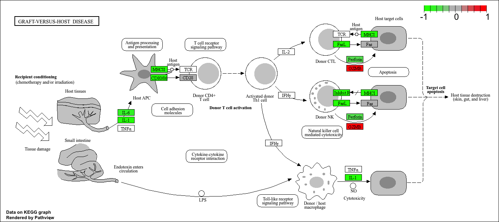

## background 

today we will perform an RNASeq analysis on the effects of dexamethasone (hereafter "dex"), a common steroid, on airway smoothe muslce (ASM) cell lines. 

## Data Import 

we need two things for this analysis: 

- **countData**: a table with genes as rows and smaples / experiements as columns, 
-**colData**: metadata about the columns (i.e. samples) in the main countData object. 

```{r, import}
counts <-read.csv("airway_scaledcounts.csv", row.names=1)
metadata <- read.csv("airway_metadata.csv")
```

```{r}
head(counts)
```

## check on metadata counts correspondance

we need to check that the metadata matches the samples in our count data. 

```{r}
ncol(counts) == nrow(metadata)
```

```{r}
colnames(counts) == metadata$id
```
```{r}
all(c(T,T,F,T))
```

>Q1. HOW MANY GENES ARE IN THIS DATAASET? 

```{r}
nrow(counts)
```

>Q2. how many "control" samples are in thsi dataset? 

```{r}
sum(metadata$dex == "control")
```

## Analysis Plan... 

we have 4 replicates per condition ("control" and "treated"). we want to compare the control vs the treated to see which genes expression levels change when we have the drug present. 

we will go row by row (gene by gene) and see if the average value in control columns is different than the average value in treated columns

step 1: find which columns in `counts` correspond to "control" samples 

step 2: extract and select these columns 

step 3: caluclate an average value for each gene (i.e each row)


```{r}
#the indices(i.e positions) that are "control" 
control.inds <- metadata$dex == "control"
```

```{r}
#extract/select these "control" columns from counts 
control.counts <- counts[,control.inds]
```

```{r}
#calculate the mean for each gene (i.e row)
control.means <- rowMeans(control.counts)
```

##for treated: 
```{r}
treated.inds <-metadata$dex=="treated"
```

```{r}
treated.counts <- counts[,treated.inds]
```

```{r}
treated.means <- rowMeans(treated.counts)

```

lets put these two mean values into a new data.frame `meancounts` for easy book-keeping and plotting 
```{r}
meancounts <- data.frame(control.means, 
                        treated.means)

head(meancounts)
```

> Q: make ggplot of average counts of control vs treated

```{r}
library(ggplot2)
ggplot(meancounts, aes(x=control.means,y=treated.means))+
  geom_point(alpha=0.3)
```
this needs to be log transformed as it is so highly skewed: 
```{r}
library(ggplot2)
ggplot(meancounts, aes(x=control.means,y=treated.means))+
  geom_point(alpha=0.3)+
  scale_x_log10()+
  scale_y_log10()
```

## log2 units and fold change

if we consider "treated"/"control" counts we will get a number that tells us the change. 

```{r}
log2(20/20)
```
```{r}
# a doubling in the treated vs control 
log2(2)
```
```{r}
log2(10/20)
```
>Q. add a new column `log2fc` for log2 fold change of treated and control to our meancounts object 

```{r}
meancounts$log2fc <- 
  log2(meancounts$treated.means/
         meancounts$control.means)

head(meancounts)
```

## remove zero count genes

typically we would not consider zero count genes - as we have no data about them and they should be excluded from further consideration. these lead to "funky" log2 fold change values (e.g divide by zero errors)

##DESeq analysis 

we are missing any measure of significance from the work we ahave so far. lets do this properly with the **DESeq2** package 
```{r, message=FALSE}
library(DESeq2)
```

the DESeq2 package, like many bioconductor packages, wants it's input in a very specific way - a data structure setup with all the info it neeeds for the calculation

```{r}
dds <- DESeqDataSetFromMatrix(countData= counts,
                              colData = metadata, 
                               design = ~dex)
```

The main function in this package is called `DESeq()` it will run the full analysis for us on our `dds` input object: 

```{r}
dds <- DESeq(dds)
```


extract our results: 
```{r}
res <- results(dds) 
head(res)
```

## Volcano plot 

a useful summary figure ofour results is often called a volcano plot. it is basically a plot of log2 fold change values vs Adjusted P values 

>Q. use ggplot to make a first version of "volcano plot" of `log2FoldChange` vs `padj`

```{r}
ggplot(res, aes(log2FoldChange, padj))+
  geom_point()
```

this is not very useful becuase the y-axis (P-value) is not really helpful - we want to focus on the low p value. 
```{r}
ggplot(res, aes(log2FoldChange, 
                log(padj)))+
       geom_point()
```

```{r}
ggplot(res, aes(log2FoldChange, 
                -log(padj)))+
       geom_point()
```

each dot is a gene
if it is away from 0 in positive direction, it means the expression is going up 
one of the exploding point meanas p value is small so it is significant 

```{r}
ggplot(res, aes(log2FoldChange, 
                -log(padj)))+
       geom_point()+
  geom_vline(xintercept = c(-2,+2), col="red")+
  geom_hline(yintercept = -log(0.05), col="red")
```

## add some plot annotation 

>Q: add clor to the points (genes) we care about, nice axis labels, a useful title, and a nice theme. 

```{r}

mycols <- rep("gray", nrow(res))
mycols[res$log2FoldChange > 2 ] <-"blue" 
mycols[res$log2FoldChange < -2] <- "green"
mycols[res$padj >= 0.05] <- "gray"
```

```{r}

ggplot(res)+
  aes(x=log2FoldChange, 
      y=-log(padj)) +
  geom_point(col = mycols)+ 
  geom_vline(xintercept = c(-2,+2), col="red")+
  geom_hline(yintercept = -log(0.05), col="red")
```


## save our results to a CSV file 

```{r}
write.csv(res, file="results.csv")
```

## add annotation data 

to make sense of our results we need to know what the differentially expressed genes are and what biological pathways and process they are involved in. 

```{r}
head(res)
```


Let's start by mapping our ENSEMBLE ids to the more conventional gene SYMBOL


we will use two bioconductor packages for this "mapping" **AnnotationDbi** and **org.Hs.eg.db**

we will need to install these from bioconductor with`BiocManager::install("AnnotationDbi")`

```{r}
library(AnnotationDbi)
library(org.Hs.eg.db)
```

```{r}
columns(org.Hs.eg.db)
```

different organism has different abbreviations 


```{r}
res$symbol <- mapIds(org.Hs.eg.db, 
               keys = rownames(res), #our ids 
                keytype = "ENSEMBL", #their format
              column = "SYMBOL")    #what i want to translate to 
```

```{r}
head(res)
```

>Q. can u add "GENENAME" and "ENTREZID" as new columns too `res` name "name" and "entrez"? 

```{r}
res$name <- mapIds(org.Hs.eg.db, 
            keys = rownames(res),
            keytype = "ENSEMBL",
            column = "GENENAME")

head(res)
```

```{r}
res$entrez <- mapIds(org.Hs.eg.db, 
            keys = rownames(res),
            keytype = "ENSEMBL",
            column = "ENTREZID")

head(res)
```

```{r}
write.csv(res, file="results_annotated.csv")
```

##pathway analysis

now we know the gene names (gene symbols) and their entrez IDs we can find out what pathways they are involved in. this is called "pathway analysis" or "gene set enrichment" 
we will use the **gage** package and the **pathviewr** package to do this analysis (but there are loads of others).

```{r,message=FALSE}
library(gage)
library(gageData)
library(pathview)
```

let's see what is in gageData, specifically KEGG pathways
```{r}
data(kegg.sets.hs)
head(kegg.sets.hs, 2)
```

to run our pathway analysis we will use the **gage()** function. it wants to maintain inputs: a vector of importance (in our case the log2 fold change values); and the gene sets to check overlap for. 

```{r}
foldchanges <- res$log2FoldChange
names(foldchanges) <- res$symbol 
foldchanges
```

KEGG speaks entrez (i.e uses ENTREZID format) not gene symbol format

```{r}
names(foldchanges) <- res$entrez
```

```{r}
keggres = gage (foldchanges, gsets=kegg.sets.hs)
```

```{r}
head(keggres$less,5)
```

let's make a figure of these pathways with our DEGs highlighted: 

```{r}
pathview(foldchanges, pathway.id = "hsa05310")
```


>Q. generate and insert a pthway figure for "graft-versus-host disease" and "Type I diabetes"? 

```{r}
pathview(foldchanges, pathway.id = "hsa05332")
```




```{r}
pathview(foldchanges, pathway.id = "hsa04940")

```


